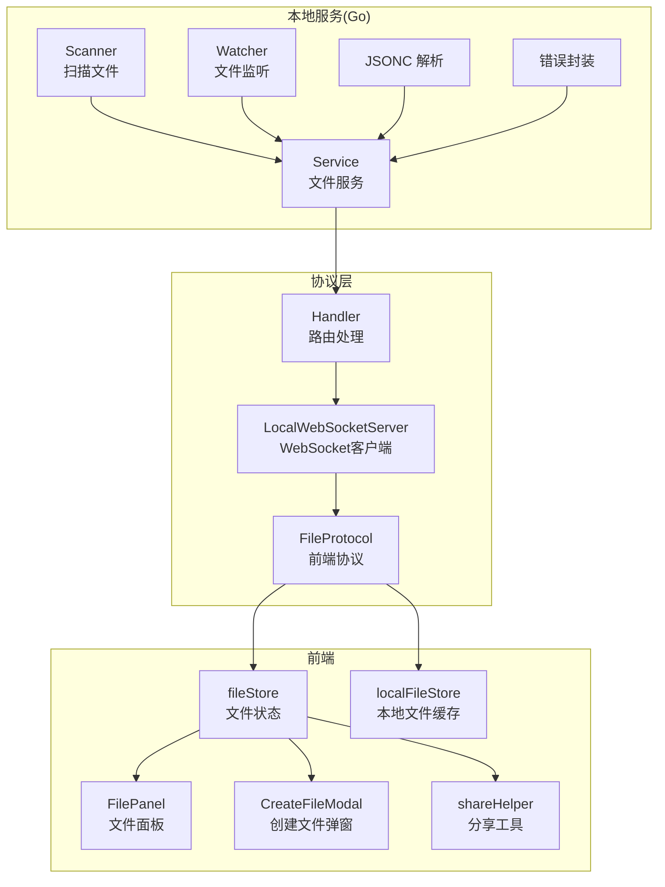
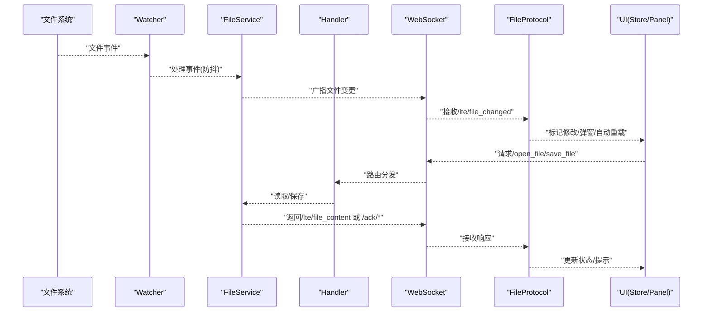
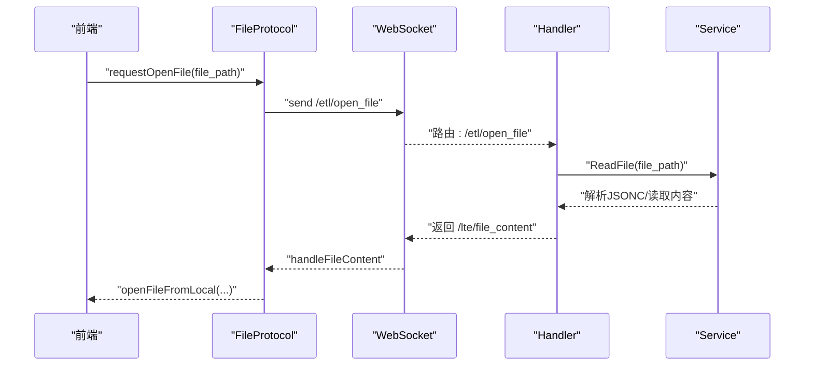
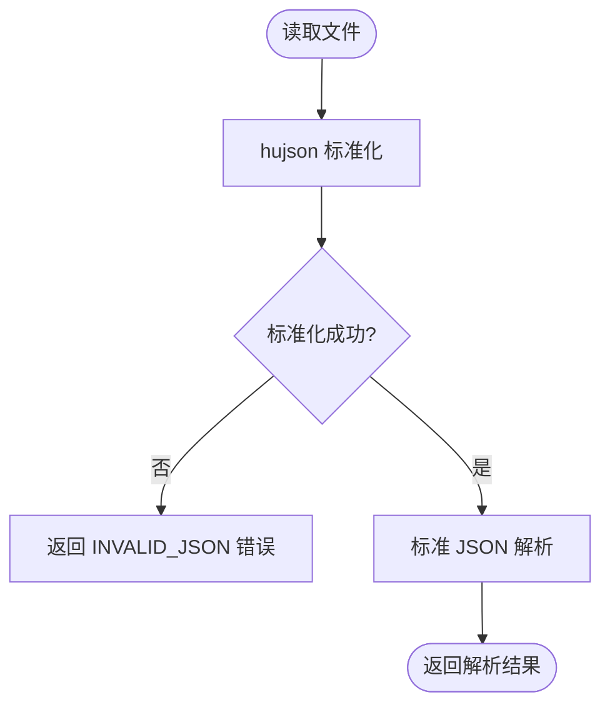
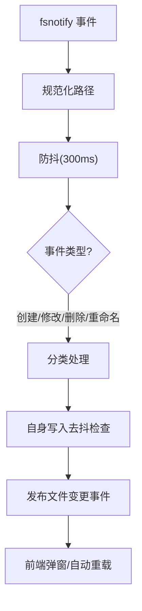
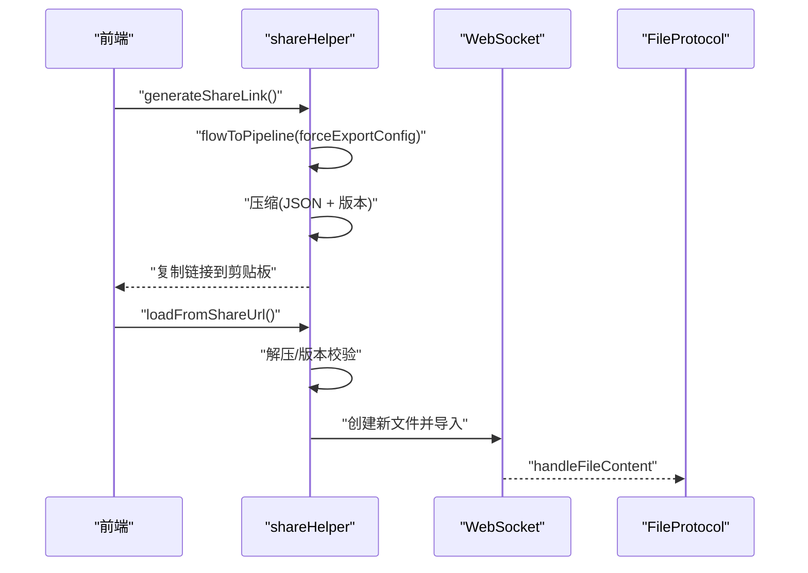
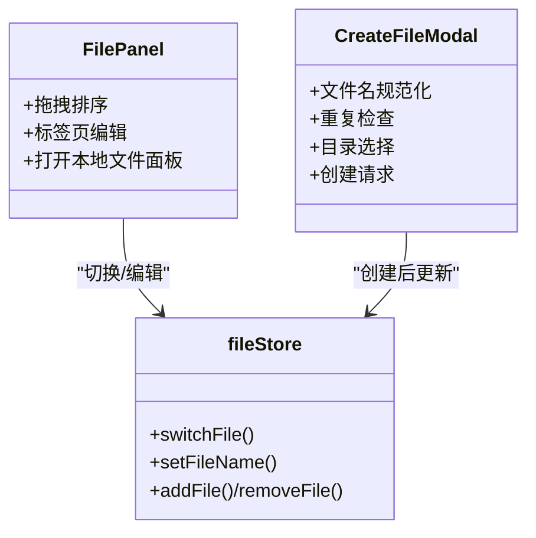
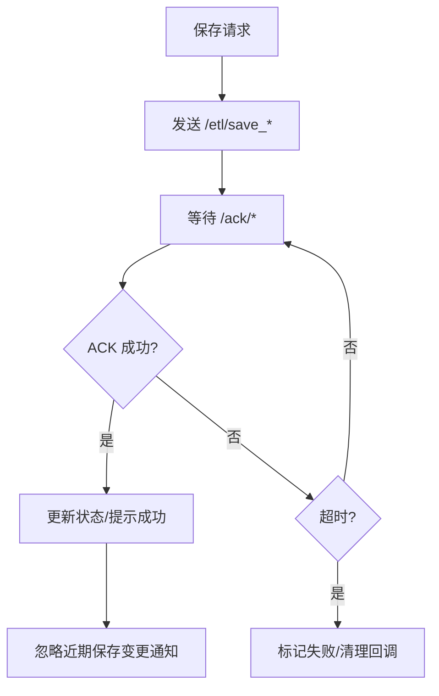
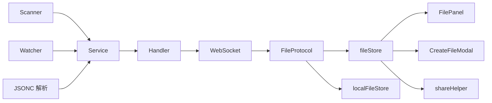

# 文件系统

<cite>
**本文档引用的文件**
- [file_service.go](file://LocalBridge/internal/service/file/file_service.go)
- [file_handler.go](file://LocalBridge/internal/protocol/file/file_handler.go)
- [jsonc.go](file://LocalBridge/internal/utils/jsonc.go)
- [watcher.go](file://LocalBridge/internal/service/file/watcher.go)
- [scanner.go](file://LocalBridge/internal/service/file/scanner.go)
- [errors.go](file://LocalBridge/internal/errors/errors.go)
- [FileProtocol.ts](file://src/services/protocols/FileProtocol.ts)
- [server.ts](file://src/services/server.ts)
- [fileStore.ts](file://src/stores/fileStore.ts)
- [localFileStore.ts](file://src/stores/localFileStore.ts)
- [FilePanel.tsx](file://src/components/panels/main/FilePanel.tsx)
- [CreateFileModal.tsx](file://src/components/modals/CreateFileModal.tsx)
- [shareHelper.ts](file://src/utils/data/shareHelper.ts)
</cite>

## 目录
1. [简介](#简介)
2. [项目结构](#项目结构)
3. [核心组件](#核心组件)
4. [架构总览](#架构总览)
5. [详细组件分析](#详细组件分析)
6. [依赖关系分析](#依赖关系分析)
7. [性能考量](#性能考量)
8. [故障排查指南](#故障排查指南)
9. [结论](#结论)
10. [附录](#附录)

## 简介
本文件系统围绕「本地文件导入导出」「JSONC 格式支持与校验」「文件监控与热重载」「分享功能（压缩与链接）」「文件面板设计与交互」「错误处理与异常恢复」等主题展开，覆盖从本地服务层到前端协议层的完整链路。系统采用 Go 实现的本地文件服务作为后端，通过 WebSocket 与前端交互，前端使用 TypeScript/Zustand 状态管理与 React 组件构建文件面板与交互逻辑。

## 项目结构
- 本地服务层（Go）：文件扫描、监听、读写、JSONC 解析、错误封装
- 协议层（Go → TS）：WebSocket 路由、消息分发、ACK 确认、自动重载策略
- 前端状态与界面：Zustand Store、文件面板、创建文件弹窗、分享工具

图示来源
- [file_service.go:37-95](file://LocalBridge/internal/service/file/file_service.go#L37-L95)
- [file_handler.go:22-64](file://LocalBridge/internal/protocol/file/file_handler.go#L22-L64)
- [FileProtocol.ts:44-68](file://src/services/protocols/FileProtocol.ts#L44-L68)
- [server.ts:22-343](file://src/services/server.ts#L22-L343)
- [fileStore.ts:376-571](file://src/stores/fileStore.ts#L376-L571)
- [localFileStore.ts:130-338](file://src/stores/localFileStore.ts#L130-L338)
- [FilePanel.tsx:48-165](file://src/components/panels/main/FilePanel.tsx#L48-L165)
- [CreateFileModal.tsx:14-450](file://src/components/modals/CreateFileModal.tsx#L14-L450)
- [shareHelper.ts:1-340](file://src/utils/data/shareHelper.ts#L1-L340)

章节来源
- [file_service.go:37-95](file://LocalBridge/internal/service/file/file_service.go#L37-L95)
- [file_handler.go:22-64](file://LocalBridge/internal/protocol/file/file_handler.go#L22-L64)
- [server.ts:22-343](file://src/services/server.ts#L22-L343)

## 核心组件
- 文件服务（Go）：负责扫描、监听、读取、保存、路径安全校验、JSONC 解析与错误封装
- 文件协议（TS）：负责 WebSocket 路由注册、消息处理、ACK 等待、自动重载与用户交互
- 前端 Store：维护文件列表、当前文件、视口状态、保存/加载状态
- 文件面板与创建弹窗：提供拖拽切换、文件名编辑、创建新文件等交互
- 分享工具：基于 lz-string 压缩与 URL 参数传递

章节来源
- [file_service.go:19-62](file://LocalBridge/internal/service/file/file_service.go#L19-L62)
- [file_handler.go:14-35](file://LocalBridge/internal/protocol/file/file_handler.go#L14-L35)
- [FileProtocol.ts:16-68](file://src/services/protocols/FileProtocol.ts#L16-L68)
- [fileStore.ts:346-375](file://src/stores/fileStore.ts#L346-L375)
- [FilePanel.tsx:48-165](file://src/components/panels/main/FilePanel.tsx#L48-L165)
- [CreateFileModal.tsx:14-450](file://src/components/modals/CreateFileModal.tsx#L14-L450)
- [shareHelper.ts:1-340](file://src/utils/data/shareHelper.ts#L1-L340)

## 架构总览
本地服务通过 fsnotify 监控文件系统，扫描器构建文件索引，文件服务统一处理读写与 JSONC 解析，并通过 WebSocket 将文件列表、内容与变更事件推送到前端。前端协议负责解析消息、触发 UI 交互与自动重载。

图示来源
- [watcher.go:95-191](file://LocalBridge/internal/service/file/watcher.go#L95-L191)
- [file_service.go:298-388](file://LocalBridge/internal/service/file/file_service.go#L298-L388)
- [file_handler.go:48-64](file://LocalBridge/internal/protocol/file/file_handler.go#L48-L64)
- [FileProtocol.ts:44-68](file://src/services/protocols/FileProtocol.ts#L44-L68)

## 详细组件分析

### 文件导入导出机制
- 导入：前端通过 /etl/open_file 请求后端读取文件并解析 JSONC，同时尝试读取同名 .mpe.json 配置文件，合并后通过 /lte/file_content 推送至前端
- 导出：支持两种模式
  - 单文件保存：/etl/save_file，后端返回 /ack/save_file
  - 分离保存：/etl/save_separated，将 Pipeline 与配置分别保存，返回 /ack/save_separated
- 路径安全：后端对路径进行绝对化与根目录范围校验，避免越权访问
- JSONC 支持：统一使用 hujson 标准化后再交由标准 JSON 解析器

图示来源
- [file_handler.go:66-137](file://LocalBridge/internal/protocol/file/file_handler.go#L66-L137)
- [file_service.go:122-156](file://LocalBridge/internal/service/file/file_service.go#L122-L156)
- [FileProtocol.ts:338-347](file://src/services/protocols/FileProtocol.ts#L338-L347)

章节来源
- [file_handler.go:66-137](file://LocalBridge/internal/protocol/file/file_handler.go#L66-L137)
- [file_service.go:122-156](file://LocalBridge/internal/service/file/file_service.go#L122-L156)
- [FileProtocol.ts:338-347](file://src/services/protocols/FileProtocol.ts#L338-L347)

### JSONC 格式支持与语法验证
- 解析流程：hujson 标准化 → 标准 JSON 解析
- 语法支持：行注释、块注释、尾随逗号
- 校验策略：读取阶段即进行 JSONC 校验，失败返回 INVALID_JSON 错误

图示来源
- [jsonc.go:9-29](file://LocalBridge/internal/utils/jsonc.go#L9-L29)
- [file_service.go:149-153](file://LocalBridge/internal/service/file/file_service.go#L149-L153)

章节来源
- [jsonc.go:9-29](file://LocalBridge/internal/utils/jsonc.go#L9-L29)
- [file_service.go:149-153](file://LocalBridge/internal/service/file/file_service.go#L149-L153)

### 文件监控与热重载
- 监控实现：fsnotify 递归监听目录树，新增目录自动加入监听
- 事件处理：创建/修改/删除/重命名分类处理，目录删除批量清理索引
- 防抖策略：统一 300ms 防抖，合并高频写入事件
- 自身写入去抖：记录最近写入文件时间，在窗口期内忽略自身触发的变更
- 前端热重载：根据配置自动重载或弹窗选择，ACK 成功后忽略近期保存的变更通知

图示来源
- [watcher.go:114-191](file://LocalBridge/internal/service/file/watcher.go#L114-L191)
- [file_service.go:298-388](file://LocalBridge/internal/service/file/file_service.go#L298-L388)
- [FileProtocol.ts:147-231](file://src/services/protocols/FileProtocol.ts#L147-L231)

章节来源
- [watcher.go:114-191](file://LocalBridge/internal/service/file/watcher.go#L114-L191)
- [file_service.go:298-388](file://LocalBridge/internal/service/file/file_service.go#L298-L388)
- [FileProtocol.ts:147-231](file://src/services/protocols/FileProtocol.ts#L147-L231)

### 分享功能的压缩与链接
- 压缩算法：lz-string 压缩 JSON
- 参数约定：共享参数名为 shared，版本号 v=1
- 链接生成：拼接 origin + pathname + ?shared=压缩串
- 导入流程：解析 URL 参数，解压并导入到新文件，支持清除参数

图示来源
- [shareHelper.ts:79-115](file://src/utils/data/shareHelper.ts#L79-L115)
- [shareHelper.ts:209-254](file://src/utils/data/shareHelper.ts#L209-L254)
- [FileProtocol.ts:109-141](file://src/services/protocols/FileProtocol.ts#L109-L141)

章节来源
- [shareHelper.ts:79-115](file://src/utils/data/shareHelper.ts#L79-L115)
- [shareHelper.ts:209-254](file://src/utils/data/shareHelper.ts#L209-L254)
- [FileProtocol.ts:109-141](file://src/services/protocols/FileProtocol.ts#L109-L141)

### 文件面板设计与用户交互
- 文件标签页：支持拖拽排序、双击编辑、右上角增删
- 文件名校验：重复检测、非法字符提示
- 本地文件面板：点击「本地文件」打开侧边文件列表，支持刷新
- 创建文件弹窗：自动填充当前文件名与目录，文件名规范化与重复检查，提交后刷新文件列表

图示来源
- [FilePanel.tsx:48-165](file://src/components/panels/main/FilePanel.tsx#L48-L165)
- [CreateFileModal.tsx:14-450](file://src/components/modals/CreateFileModal.tsx#L14-L450)
- [fileStore.ts:430-536](file://src/stores/fileStore.ts#L430-L536)

章节来源
- [FilePanel.tsx:48-165](file://src/components/panels/main/FilePanel.tsx#L48-L165)
- [CreateFileModal.tsx:14-450](file://src/components/modals/CreateFileModal.tsx#L14-L450)
- [fileStore.ts:430-536](file://src/stores/fileStore.ts#L430-L536)

### 错误处理与异常恢复策略
- 错误封装：统一 LBError，包含错误码、消息、细节与原始错误
- 前端 ACK 等待：保存请求超时控制（默认 10s），断连时清理回调
- 文件变更通知：区分最近保存文件、目录删除批量处理、重命名清理
- 本地存储异常：检测 localStorage 配额超限并提示

图示来源
- [FileProtocol.ts:237-289](file://src/services/protocols/FileProtocol.ts#L237-L289)
- [FileProtocol.ts:541-579](file://src/services/protocols/FileProtocol.ts#L541-L579)
- [errors.go:75-141](file://LocalBridge/internal/errors/errors.go#L75-L141)

章节来源
- [FileProtocol.ts:237-289](file://src/services/protocols/FileProtocol.ts#L237-L289)
- [FileProtocol.ts:541-579](file://src/services/protocols/FileProtocol.ts#L541-L579)
- [errors.go:75-141](file://LocalBridge/internal/errors/errors.go#L75-L141)

## 依赖关系分析

图示来源
- [scanner.go:20-48](file://LocalBridge/internal/service/file/scanner.go#L20-L48)
- [watcher.go:34-58](file://LocalBridge/internal/service/file/watcher.go#L34-L58)
- [file_service.go:19-62](file://LocalBridge/internal/service/file/file_service.go#L19-L62)
- [file_handler.go:14-35](file://LocalBridge/internal/protocol/file/file_handler.go#L14-L35)
- [server.ts:345-387](file://src/services/server.ts#L345-L387)
- [FileProtocol.ts:16-68](file://src/services/protocols/FileProtocol.ts#L16-L68)
- [fileStore.ts:376-571](file://src/stores/fileStore.ts#L376-L571)
- [localFileStore.ts:130-338](file://src/stores/localFileStore.ts#L130-L338)
- [FilePanel.tsx:48-165](file://src/components/panels/main/FilePanel.tsx#L48-L165)
- [CreateFileModal.tsx:14-450](file://src/components/modals/CreateFileModal.tsx#L14-L450)
- [shareHelper.ts:1-340](file://src/utils/data/shareHelper.ts#L1-L340)

章节来源
- [scanner.go:20-48](file://LocalBridge/internal/service/file/scanner.go#L20-L48)
- [watcher.go:34-58](file://LocalBridge/internal/service/file/watcher.go#L34-L58)
- [file_service.go:19-62](file://LocalBridge/internal/service/file/file_service.go#L19-L62)
- [file_handler.go:14-35](file://LocalBridge/internal/protocol/file/file_handler.go#L14-L35)
- [server.ts:345-387](file://src/services/server.ts#L345-L387)
- [FileProtocol.ts:16-68](file://src/services/protocols/FileProtocol.ts#L16-L68)
- [fileStore.ts:376-571](file://src/stores/fileStore.ts#L376-L571)
- [localFileStore.ts:130-338](file://src/stores/localFileStore.ts#L130-L338)
- [FilePanel.tsx:48-165](file://src/components/panels/main/FilePanel.tsx#L48-L165)
- [CreateFileModal.tsx:14-450](file://src/components/modals/CreateFileModal.tsx#L14-L450)
- [shareHelper.ts:1-340](file://src/utils/data/shareHelper.ts#L1-L340)

## 性能考量
- 扫描限制：最大深度与最大文件数可配置，避免大规模目录导致内存与 CPU 压力
- 防抖与去抖：统一防抖窗口与自身写入去抖，降低事件风暴影响
- JSONC 解析：hujson 标准化后走标准解析器，兼顾灵活性与性能
- 前端渲染：文件列表与节点信息按需更新，避免全量重绘

## 故障排查指南
- 连接问题：检查本地服务端口与协议版本，前端握手失败会提示版本不匹配并断开
- 保存失败：查看 /ack/* 回调与超时日志，确认文件路径与权限
- 文件变更未生效：确认自动重载开关与弹窗选择，检查近期保存去抖窗口
- 本地存储异常：当 localStorage 配额不足时会提示清理或减少文件数量

章节来源
- [server.ts:108-255](file://src/services/server.ts#L108-L255)
- [FileProtocol.ts:237-289](file://src/services/protocols/FileProtocol.ts#L237-L289)
- [fileStore.ts:234-273](file://src/stores/fileStore.ts#L234-L273)

## 结论
该文件系统通过「扫描 + 监听 + JSONC 解析 + WebSocket 协议」实现了稳定的本地文件导入导出能力，配合前端 Store 与面板提供了良好的交互体验。热重载与分享功能进一步提升了开发效率与协作便利性。建议在生产环境中结合扫描限制与错误监控，确保在复杂目录结构下的稳定性与可维护性。

## 附录
- 跨平台兼容性建议
  - 监听器使用 fsnotify，注意不同平台的文件系统差异与权限模型
  - 路径分隔符在 Windows 与 Unix 系统不同，代码中统一使用 filepath 处理
  - 分享链接长度限制：URL 过长可能在部分浏览器中受限，建议提示用户
- 最佳实践
  - 严格限制扫描深度与文件数量，避免 OOM
  - 在保存前进行节点名重复等前置校验，减少后端失败率
  - 使用 ACK 超时与回调清理，保证状态一致性