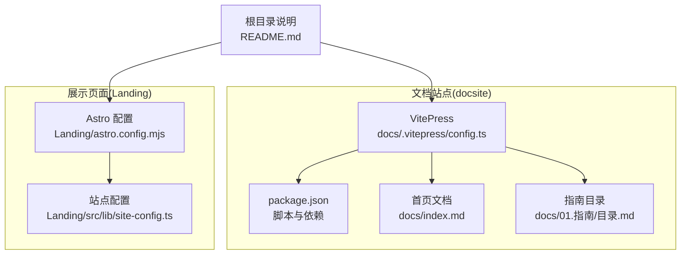
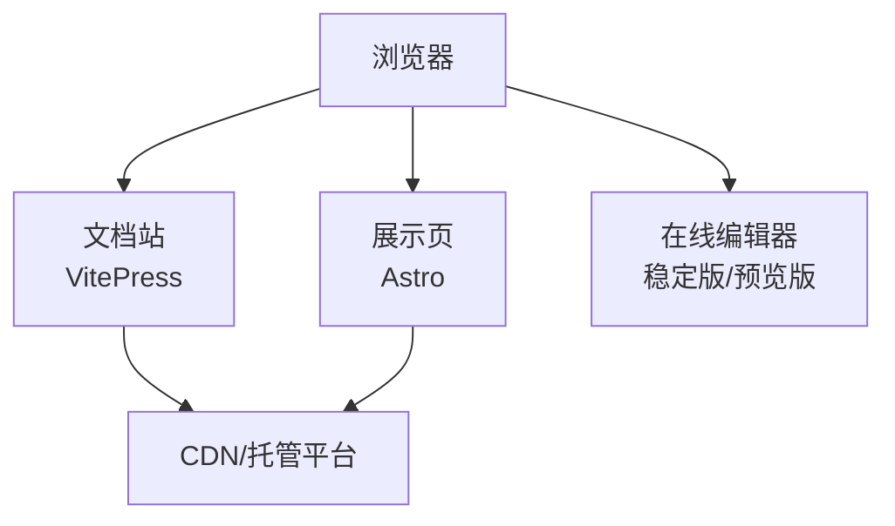
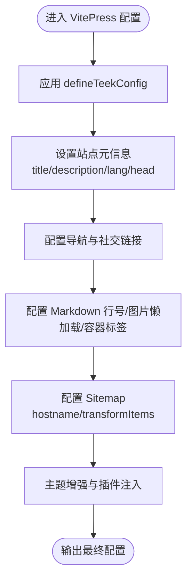
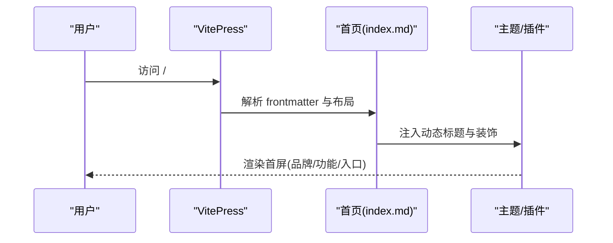
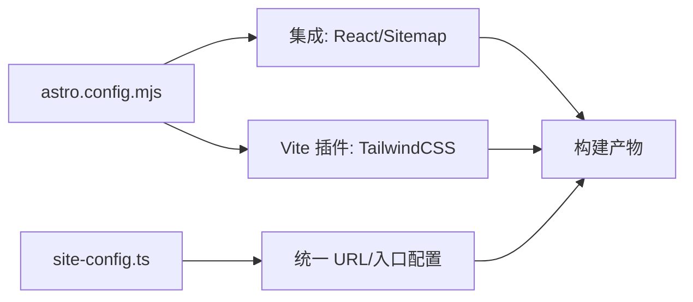
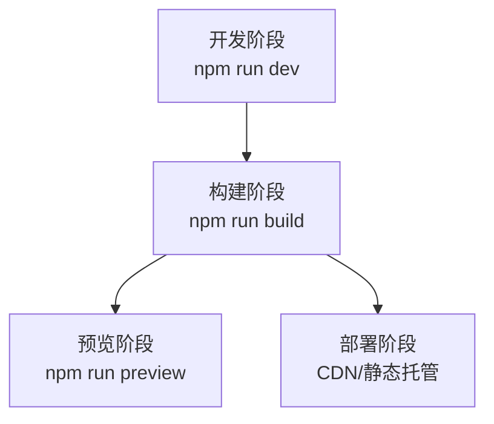
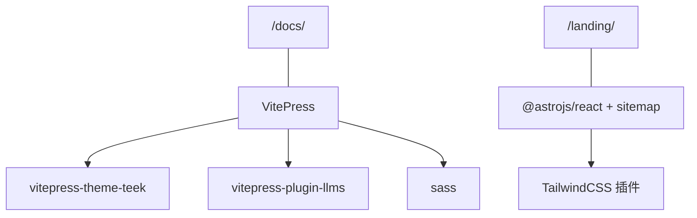

# 文档站点

<cite>
**本文引用的文件**
- [docsite/package.json](file://docsite/package.json)
- [docsite/docs/.vitepress/config.ts](file://docsite/docs/.vitepress/config.ts)
- [docsite/docs/index.md](file://docsite/docs/index.md)
- [docsite/docs/01.指南/目录.md](file://docsite/docs/01.指南/目录.md)
- [Landing/astro.config.mjs](file://Landing/astro.config.mjs)
- [Landing/src/lib/site-config.ts](file://Landing/src/lib/site-config.ts)
- [README.md](file://README.md)
</cite>

## 目录
1. [简介](#简介)
2. [项目结构](#项目结构)
3. [核心组件](#核心组件)
4. [架构总览](#架构总览)
5. [组件详解](#组件详解)
6. [依赖关系分析](#依赖关系分析)
7. [性能考量](#性能考量)
8. [故障排查指南](#故障排查指南)
9. [结论](#结论)
10. [附录](#附录)

## 简介
本文件面向文档站点的技术实现，围绕 VitePress 文档系统配置与主题定制、内容组织与导航设计、Astro 展示页面与 SEO 优化、构建与部署策略、多语言与国际化、内容管理与维护最佳实践，以及性能优化与用户体验提升进行系统化说明。目标读者既包括需要快速上手的非技术用户，也包括希望深度定制的技术人员。

## 项目结构
文档站点位于独立目录 docsite，采用 VitePress 作为静态站点生成器，并通过自定义主题与插件增强体验。同时，项目还包含一个 Astro 驱动的 Landing 页面，用于产品展示与引流。两者分别服务于“文档”和“展示/落地页”的不同场景，共享统一的域名与基础路径策略。

图表来源
- [docsite/docs/.vitepress/config.ts:60-194](file://docsite/docs/.vitepress/config.ts#L60-L194)
- [docsite/package.json:7-21](file://docsite/package.json#L7-L21)
- [docsite/docs/index.md:1-97](file://docsite/docs/index.md#L1-L97)
- [docsite/docs/01.指南/目录.md:1-11](file://docsite/docs/01.指南/目录.md#L1-L11)
- [Landing/astro.config.mjs:1-20](file://Landing/astro.config.mjs#L1-L20)
- [Landing/src/lib/site-config.ts:28-47](file://Landing/src/lib/site-config.ts#L28-L47)

章节来源
- [docsite/package.json:1-22](file://docsite/package.json#L1-L22)
- [docsite/docs/.vitepress/config.ts:60-194](file://docsite/docs/.vitepress/config.ts#L60-L194)
- [docsite/docs/index.md:1-97](file://docsite/docs/index.md#L1-L97)
- [docsite/docs/01.指南/目录.md:1-11](file://docsite/docs/01.指南/目录.md#L1-L11)
- [Landing/astro.config.mjs:1-20](file://Landing/astro.config.mjs#L1-L20)
- [Landing/src/lib/site-config.ts:28-47](file://Landing/src/lib/site-config.ts#L28-L47)
- [README.md:27-28](file://README.md#L27-L28)

## 核心组件
- VitePress 文档引擎与主题
  - 使用 vitepress-theme-teek 主题，提供导航、侧边栏、页脚、文章分析、分享、代码块增强等能力。
  - 通过 defineConfig 与 defineTeekConfig 组合配置，覆盖标题、描述、语言、head 元信息、markdown 容器与行号、sitemap、导航与社交链接、编辑链接等。
- 内容组织与导航
  - 导航以“首页/指南/相关链接/友情链接”为主，指南区通过 activeMatch 与路径映射实现精准激活。
  - 首页采用 home 布局，结合 Vue 组合式 API 动态渲染标题与装饰元素。
- Astro 展示页面
  - 基于 Astro + React + TailwindCSS，启用 sitemap 插件，统一站点 URL 与 base 路径。
  - 通过 site-config.ts 抽象站点 URL、编辑器入口、文档入口、GitHub 地址等，便于多环境配置。
- 构建与部署
  - docsite 通过 VitePress 提供 dev/build/preview 脚本；Landing 通过 Astro 提供构建与站点地图。
  - README 中提供文档站与在线编辑器的外部链接，便于用户直达。

章节来源
- [docsite/docs/.vitepress/config.ts:60-194](file://docsite/docs/.vitepress/config.ts#L60-L194)
- [docsite/docs/index.md:1-97](file://docsite/docs/index.md#L1-L97)
- [Landing/astro.config.mjs:1-20](file://Landing/astro.config.mjs#L1-L20)
- [Landing/src/lib/site-config.ts:28-47](file://Landing/src/lib/site-config.ts#L28-L47)
- [README.md:27-28](file://README.md#L27-L28)

## 架构总览
文档站点与展示页面相互独立但协同工作：文档站负责知识沉淀与使用说明，展示页面负责产品曝光与转化。两者共享域名空间并通过不同的 base 路径区分内容域。

图表来源
- [docsite/docs/.vitepress/config.ts:62-67](file://docsite/docs/.vitepress/config.ts#L62-L67)
- [Landing/astro.config.mjs:8-10](file://Landing/astro.config.mjs#L8-L10)
- [README.md:27-28](file://README.md#L27-L28)

## 组件详解

### VitePress 文档系统与主题定制
- 主题与增强
  - 通过 vitepress-theme-teek 的 defineTeekConfig 对主题行为进行细粒度控制，如侧边栏触发、回到顶部图标、页脚版权与主题信息、代码块复制提示、文章分享、文章更新分析、Markdown 示例仓库链接等。
- 站点元信息与 SEO
  - 设置 title、description、lang、lastUpdated、head 中的 og:、twitter、keywords、author 等，提升搜索引擎可见性与社交分享质量。
  - 启用 markdown 行号与图片懒加载，改善阅读体验。
- 导航与搜索
  - 导航条包含“首页/指南/相关链接/友情链接”，指南区通过 activeMatch 精准匹配路径前缀。
  - 搜索提供本地搜索 provider，编辑链接指向 GitHub 仓库对应路径，便于协作维护。
- Sitemap 与链接规范化
  - sitemap.hostname 固定为官方域名；transformItems 通过全局 VITEPRESS_CONFIG.site.themeConfig.permalinks 将自定义永久链接合并到 sitemap 条目中，确保索引一致性。
- LLM 插件集成
  - 通过 vitepress-plugin-llms 注入 LLM 相关能力，增强内容生成与检索体验。

图表来源
- [docsite/docs/.vitepress/config.ts:60-194](file://docsite/docs/.vitepress/config.ts#L60-L194)

章节来源
- [docsite/docs/.vitepress/config.ts:12-58](file://docsite/docs/.vitepress/config.ts#L12-L58)
- [docsite/docs/.vitepress/config.ts:60-194](file://docsite/docs/.vitepress/config.ts#L60-L194)

### 内容组织与导航设计
- 导航结构
  - 首页：根路径“/”，用于站点总览与入口。
  - 指南：路径前缀“/01.指南/”，通过 activeMatch 精确激活；“相关链接/友情链接”提供生态与外部资源入口。
- 首页布局与动态渲染
  - 采用 home 布局，通过 frontmatter 的 hero/actions/image 等字段驱动首屏展示。
  - 使用 Vue 组合式 API 在 mounted 生命周期将自定义 SVG 装饰与文案动态挂载到指定 DOM，实现视觉强化与品牌传达。
- 目录页
  - 指南目录页通过 frontmatter 的 catalogue、path、sidebar、article 等开关控制是否生成目录、侧边栏与文章区块，便于大规模文档的层级化浏览。

图表来源
- [docsite/docs/index.md:1-97](file://docsite/docs/index.md#L1-L97)
- [docsite/docs/.vitepress/config.ts:129-189](file://docsite/docs/.vitepress/config.ts#L129-L189)

章节来源
- [docsite/docs/index.md:1-97](file://docsite/docs/index.md#L1-L97)
- [docsite/docs/01.指南/目录.md:1-11](file://docsite/docs/01.指南/目录.md#L1-L11)
- [docsite/docs/.vitepress/config.ts:129-189](file://docsite/docs/.vitepress/config.ts#L129-L189)

### Astro 展示页面实现与 SEO 优化
- 配置与集成
  - 启用 @astrojs/react 与 @astrojs/sitemap，结合 TailwindCSS 插件，形成现代化前端展示栈。
  - 通过 astro.config.mjs 设置 site 与 base，确保站点地图与资源路径正确。
- 站点配置抽象
  - site-config.ts 提供统一的站点 URL、编辑器入口、文档入口、GitHub 地址、生态入口、可选的分析域名等，便于在不同环境间切换。
- SEO 与可访问性
  - 通过统一的 base 路径与站点地图，提升搜索引擎抓取效率；结合合理的页面结构与语义化标记，进一步优化 SEO。

图表来源
- [Landing/astro.config.mjs:1-20](file://Landing/astro.config.mjs#L1-L20)
- [Landing/src/lib/site-config.ts:28-47](file://Landing/src/lib/site-config.ts#L28-L47)

章节来源
- [Landing/astro.config.mjs:1-20](file://Landing/astro.config.mjs#L1-L20)
- [Landing/src/lib/site-config.ts:28-47](file://Landing/src/lib/site-config.ts#L28-L47)

### 构建流程与部署策略
- 文档站
  - 通过 docsite/package.json 中的脚本执行 dev/build/preview，分别用于本地开发、生产构建与本地预览。
- 展示页
  - 通过 Astro 默认构建流程生成静态页面，结合 sitemap 插件输出站点地图。
- 外部链接与入口
  - README 提供文档站与在线编辑器的外部链接，便于用户直达。

图表来源
- [docsite/package.json:7-11](file://docsite/package.json#L7-L11)
- [README.md:27-28](file://README.md#L27-L28)

章节来源
- [docsite/package.json:7-11](file://docsite/package.json#L7-L11)
- [README.md:27-28](file://README.md#L27-L28)

### 多语言支持与国际化配置
- 当前状态
  - 文档站配置中 lang 为 zh-CN，head 中 og:locale 也为 zh-CN，表明当前以简体中文为主。
- 建议
  - 若需扩展多语言，可在 VitePress 中引入多语言配置，为不同语言创建独立 docs 子目录与路由映射，并在导航中增加语言切换入口；同时保持各语言的 sitemap 与 OG 元信息同步更新。

章节来源
- [docsite/docs/.vitepress/config.ts:67-78](file://docsite/docs/.vitepress/config.ts#L67-L78)

### 文档内容管理与维护最佳实践
- 结构化组织
  - 使用 frontmatter 控制页面布局、目录生成、侧边栏与文章区块；通过路径前缀与 activeMatch 精准控制导航激活。
- 版本与更新
  - 启用 lastUpdated 与文章更新分析，便于追踪内容变更；结合编辑链接直连 GitHub，降低协作成本。
- SEO 与可发现性
  - 统一设置 og:、description、keywords 等元信息；通过 sitemap.transformItems 合并自定义永久链接，提升搜索引擎收录质量。
- 用户体验
  - 开启 markdown 行号与图片懒加载，优化长文档阅读体验；利用主题增强与分享功能提升传播效果。

章节来源
- [docsite/docs/.vitepress/config.ts:67-114](file://docsite/docs/.vitepress/config.ts#L67-L114)
- [docsite/docs/.vitepress/config.ts:181-189](file://docsite/docs/.vitepress/config.ts#L181-L189)

## 依赖关系分析
- 文档站依赖
  - vitepress 为核心构建与运行时；vitepress-theme-teek 提供主题与增强；vitepress-plugin-llms 提供 LLM 能力；sass 用于样式扩展。
- 展示页依赖
  - @astrojs/react、@astrojs/sitemap、TailwindCSS 插件构成前端展示与 SEO 基础设施。
- 路径与入口
  - 文档站 base 为 “/docs/”，展示页 base 为 “/landing/”，根 README 提供外部链接直达稳定版与文档站。

图表来源
- [docsite/package.json:12-20](file://docsite/package.json#L12-L20)
- [Landing/astro.config.mjs:2-4](file://Landing/astro.config.mjs#L2-L4)
- [docsite/docs/.vitepress/config.ts:62-67](file://docsite/docs/.vitepress/config.ts#L62-L67)

章节来源
- [docsite/package.json:12-20](file://docsite/package.json#L12-L20)
- [Landing/astro.config.mjs:1-20](file://Landing/astro.config.mjs#L1-L20)
- [docsite/docs/.vitepress/config.ts:62-67](file://docsite/docs/.vitepress/config.ts#L62-L67)

## 性能考量
- 图片与渲染
  - 启用 markdown.image.lazyLoading 与图片懒加载，减少首屏阻塞；合理压缩与尺寸控制有助于提升加载速度。
- 代码与样式
  - 通过 sass 扩展主题样式，避免冗余 CSS；按需开启主题增强与插件，防止过度打包。
- 搜索与索引
  - 本地搜索适合中小规模文档；若内容增长迅速，可考虑升级为更高效的搜索方案或 CDN 加速。
- 预览与缓存
  - 生产构建后通过 CDN 缓存静态资源，结合合适的缓存策略与版本号管理，平衡新鲜度与性能。

## 故障排查指南
- 文档站无法访问或路径错误
  - 检查 base 配置与实际部署路径是否一致；确认 sitemap.hostname 与 transformItems 中的永久链接映射是否正确。
- 导航不激活或侧边栏异常
  - 核对 activeMatch 与路径前缀；确认目录页 frontmatter 的 catalogue/path/sidebar/article 配置是否符合预期。
- SEO 元信息缺失
  - 检查 head 中 og:、description、keywords 是否正确设置；确保站点地图生成与部署完成。
- 展示页资源 404
  - 核对 astro.config.mjs 的 site 与 base；检查 site-config.ts 中的 URL 解析函数与环境变量是否正确。

章节来源
- [docsite/docs/.vitepress/config.ts:68-114](file://docsite/docs/.vitepress/config.ts#L68-L114)
- [docsite/docs/.vitepress/config.ts:129-189](file://docsite/docs/.vitepress/config.ts#L129-L189)
- [Landing/astro.config.mjs:8-10](file://Landing/astro.config.mjs#L8-L10)
- [Landing/src/lib/site-config.ts:1-47](file://Landing/src/lib/site-config.ts#L1-L47)

## 结论
该文档站点以 VitePress 为核心，结合 vitepress-theme-teek 与 LLM 插件，实现了高质量的知识文档体系；Astro 展示页面则提供了产品曝光与引流能力。通过统一的站点配置与路径策略，两者协同提升了整体用户体验与可发现性。后续可在多语言支持、搜索性能与 CDN 缓存等方面持续优化，以满足更大规模的内容与用户体量。

## 附录
- 关键配置要点速览
  - 文档站：base、lang、head、nav、search、editLink、markdown、sitemap、themeConfig、vite.plugins
  - 展示页：site、base、integrations、vite.plugins、site-config.ts 的 URL 抽象
- 推荐实践
  - 为每篇文档设置明确的 frontmatter；定期审查 sitemap 与 OG 元信息；建立内容更新与版本追踪机制；在 CI 中自动化构建与部署校验。