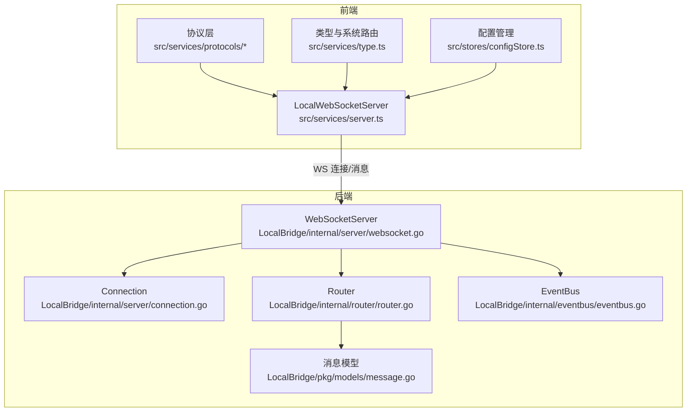
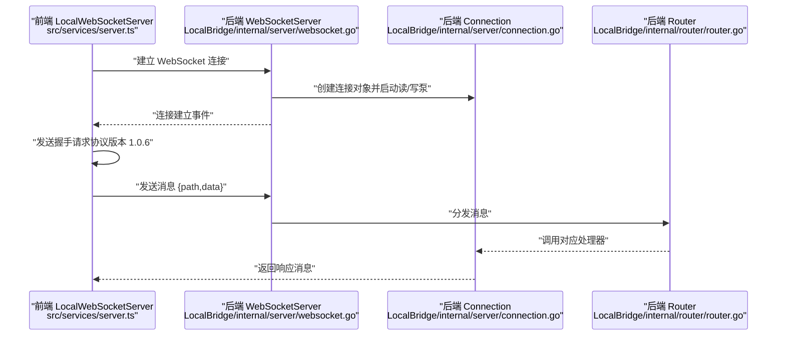
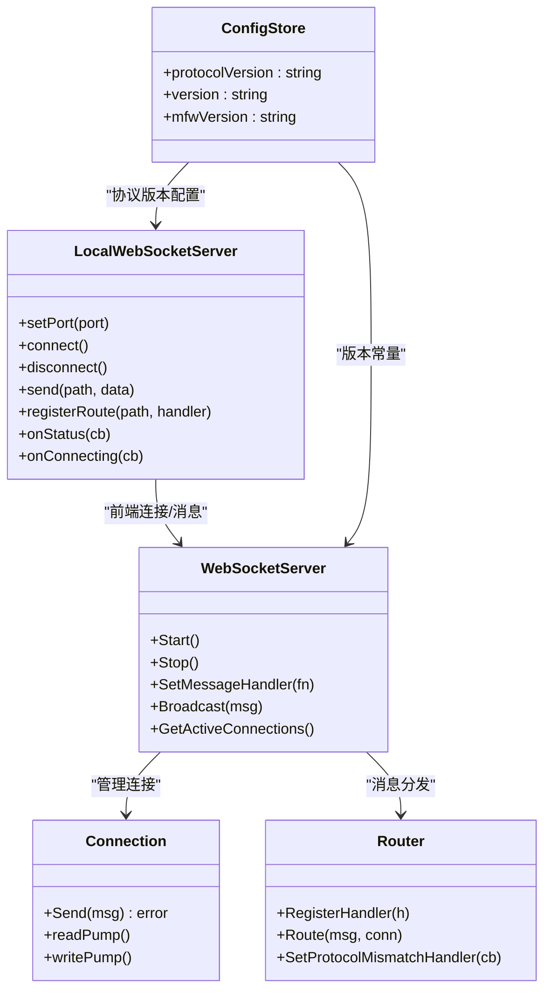
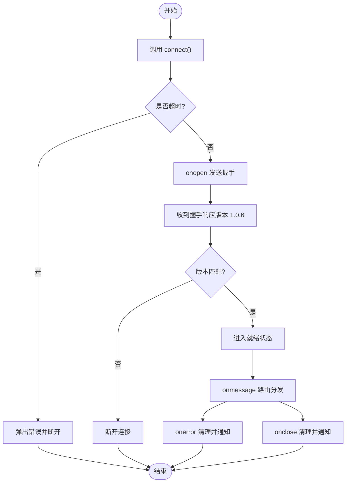
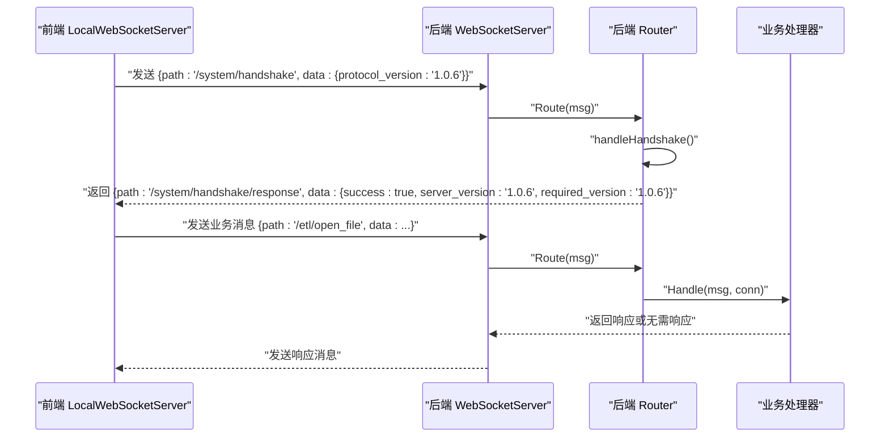
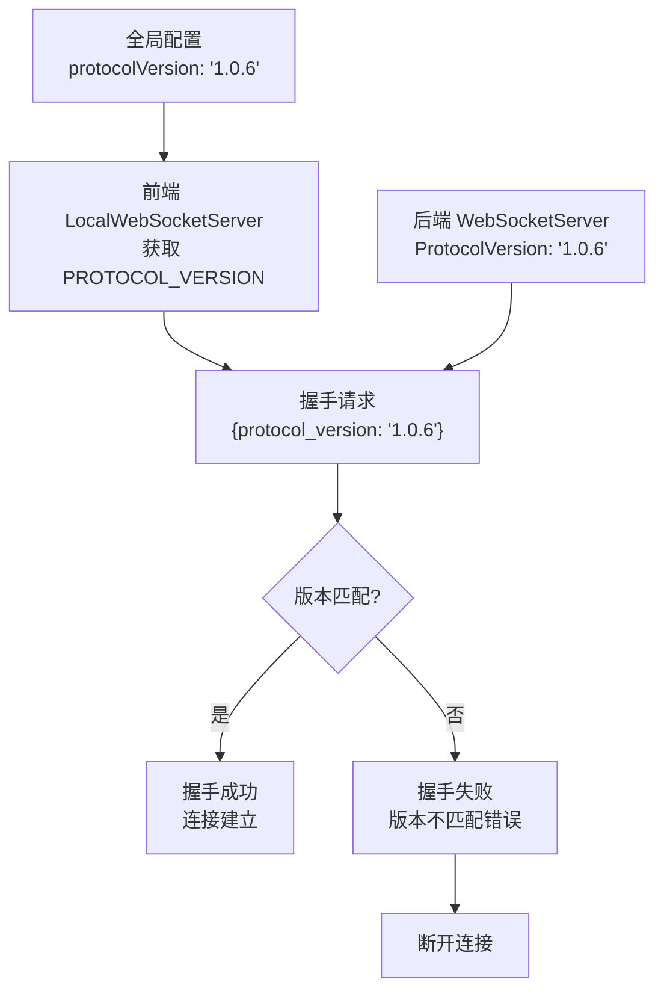

# WebSocket 服务器

<cite>
**本文引用的文件**
- [LocalBridge\internal\server\websocket.go](file://LocalBridge/internal/server/websocket.go)
- [LocalBridge\internal\server\connection.go](file://LocalBridge/internal/server/connection.go)
- [LocalBridge\internal\router\router.go](file://LocalBridge/internal/router/router.go)
- [LocalBridge\internal\eventbus\eventbus.go](file://LocalBridge/internal/eventbus/eventbus.go)
- [LocalBridge\pkg\models\message.go](file://LocalBridge/pkg/models/message.go)
- [LocalBridge\internal\protocol\file\file_handler.go](file://LocalBridge/internal/protocol/file/file_handler.go)
- [src\services\server.ts](file://src/services/server.ts)
- [src\services\type.ts](file://src/services/type.ts)
- [src\services\protocols\BaseProtocol.ts](file://src/services/protocols/BaseProtocol.ts)
- [src\services\protocols\ErrorProtocol.ts](file://src/services/protocols/ErrorProtocol.ts)
- [src\stores\configStore.ts](file://src/stores/configStore.ts)
</cite>

## 更新摘要
**变更内容**
- 更新协议版本从1.0.5到1.0.6的说明
- 新增协议版本管理相关的配置信息
- 更新握手协议处理流程的版本检查逻辑

## 目录
1. [简介](#简介)
2. [项目结构](#项目结构)
3. [核心组件](#核心组件)
4. [架构总览](#架构总览)
5. [详细组件分析](#详细组件分析)
6. [依赖关系分析](#依赖关系分析)
7. [性能考量](#性能考量)
8. [故障排查指南](#故障排查指南)
9. [结论](#结论)
10. [附录](#附录)

## 简介
本文件面向"本地桥接（LocalBridge）"子系统的 WebSocket 服务器实现，围绕 LocalWebSocketServer 类展开，系统性阐述其连接管理、握手协议、消息路由机制、连接状态管理、超时与错误恢复策略、系统级路由注册与消息处理流程、连接生命周期管理、连接状态监听器使用方法与最佳实践，并补充安全、并发与性能优化指导。目标是帮助开发者在理解现有实现的基础上进行扩展与维护。

**更新** 本次更新反映了协议版本从1.0.5升级到1.0.6的技术改进，包括版本协商机制的增强和错误处理的优化。

## 项目结构
本项目的 WebSocket 相关代码主要分布在两个层面：
- 前端 TypeScript 客户端：负责连接、握手、路由注册与消息收发，以及连接状态监听。
- 后端 Go 服务器：负责 HTTP 升级、连接管理、消息路由与广播。

**图表来源**
- [src\services\server.ts:22-343](file://src/services/server.ts#L22-L343)
- [LocalBridge\internal\server\websocket.go:36-46](file://LocalBridge/internal/server/websocket.go#L36-L46)
- [LocalBridge\internal\server\connection.go:13-19](file://LocalBridge/internal/server/connection.go#L13-L19)
- [LocalBridge\internal\router\router.go:29-33](file://LocalBridge/internal/router/router.go#L29-L33)
- [LocalBridge\internal\eventbus\eventbus.go:17-20](file://LocalBridge/internal/eventbus/eventbus.go#L17-L20)
- [LocalBridge\pkg\models\message.go:4-7](file://LocalBridge/pkg/models/message.go#L4-L7)
- [src\stores\configStore.ts:7-13](file://src/stores/configStore.ts#L7-L13)

**章节来源**
- [src\services\server.ts:1-388](file://src/services/server.ts#L1-L388)
- [LocalBridge\internal\server\websocket.go:1-179](file://LocalBridge/internal/server/websocket.go#L1-L179)
- [LocalBridge\internal\server\connection.go:1-96](file://LocalBridge/internal/server/connection.go#L1-L96)
- [LocalBridge\internal\router\router.go:1-161](file://LocalBridge/internal/router/router.go#L1-L161)
- [LocalBridge\internal\eventbus\eventbus.go:1-83](file://LocalBridge/internal/eventbus/eventbus.go#L1-L83)
- [LocalBridge\pkg\models\message.go:1-129](file://LocalBridge/pkg/models/message.go#L1-L129)
- [src\stores\configStore.ts:1-440](file://src/stores/configStore.ts#L1-L440)

## 核心组件
- LocalWebSocketServer（前端）：封装 WebSocket 客户端连接、握手、路由注册、消息发送、状态监听与超时控制。
- WebSocketServer（后端）：封装 HTTP 升级、连接注册/注销、消息分发、广播与服务器启停。
- Connection（后端）：封装单个 WebSocket 连接的读写泵、消息发送队列与关闭流程。
- Router（后端）：基于路径精确匹配与前缀匹配的路由分发器，内置系统握手处理与错误回传。
- EventBus（后端）：连接建立/关闭等事件的发布与订阅。
- 消息模型（后端）：统一的消息结构与各类业务数据结构（文件、日志、握手等）。

**更新** 协议版本管理现在通过全局配置集中管理，确保前后端版本一致性。

**章节来源**
- [src\services\server.ts:22-343](file://src/services/server.ts#L22-L343)
- [LocalBridge\internal\server\websocket.go:36-46](file://LocalBridge/internal/server/websocket.go#L36-L46)
- [LocalBridge\internal\server\connection.go:13-19](file://LocalBridge/internal/server/connection.go#L13-L19)
- [LocalBridge\internal\router\router.go:29-33](file://LocalBridge/internal/router/router.go#L29-L33)
- [LocalBridge\internal\eventbus\eventbus.go:17-20](file://LocalBridge/internal/eventbus/eventbus.go#L17-L20)
- [LocalBridge\pkg\models\message.go:4-7](file://LocalBridge/pkg/models/message.go#L4-L7)

## 架构总览
下图展示从前端 LocalWebSocketServer 到后端 WebSocketServer、Connection、Router 的整体交互流程。

**图表来源**
- [src\services\server.ts:109-255](file://src/services/server.ts#L109-L255)
- [LocalBridge\internal\server\websocket.go:145-161](file://LocalBridge/internal/server/websocket.go#L145-L161)
- [LocalBridge\internal\server\connection.go:32-59](file://LocalBridge/internal/server/connection.go#L32-L59)
- [LocalBridge\internal\router\router.go:57-83](file://LocalBridge/internal/router/router.go#L57-L83)
- [src\stores\configStore.ts:11-12](file://src/stores/configStore.ts#L11-L12)

## 详细组件分析

### LocalWebSocketServer（前端）：连接管理、握手与消息路由
- 连接管理
  - 支持设置端口、连接/断开、连接状态查询与"正在连接"状态查询。
  - 使用超时定时器控制连接超时，超时后主动关闭连接并触发错误通知。
  - onStatus/onConnecting 提供连接状态与"连接中"状态监听器注册。
- 握手协议
  - 在连接打开后发送系统握手请求，携带协议版本；收到握手响应后根据 success 字段决定后续行为。
  - 若版本不匹配，记录错误并主动断开连接。
- 消息路由机制
  - registerRoute/registerRoutes 批量注册业务路由。
  - onmessage 收到消息后按 path 查找处理器并执行，未匹配时记录告警。
  - send 方法统一序列化 {path,data} 并发送。
- 生命周期
  - connect：防重复连接、设置超时、onopen 发送握手、onmessage 路由分发、onerror/onclose 清理状态并通知。
  - disconnect：清理超时、关闭连接、重置状态。
  - destroy：断开连接并清理所有集合。
- 系统路由
  - SystemRoutes.HANDSHAKE/HANDSHAKE_RESPONSE 用于版本协商。
- 最佳实践
  - 在应用启动时调用 initializeWebSocket 完成协议注册。
  - 使用 onStatus/onConnecting 监听连接状态，结合 UI 层反馈用户。
  - 对关键业务消息使用明确的 path 命名空间，避免冲突。

**更新** 协议版本现在通过全局配置管理，确保与后端版本的一致性。

**章节来源**
- [src\services\server.ts:22-343](file://src/services/server.ts#L22-L343)
- [src\services\type.ts:1-28](file://src/services/type.ts#L1-L28)
- [src\stores\configStore.ts:11-12](file://src/stores/configStore.ts#L11-L12)

### 后端 WebSocketServer：连接管理与消息分发
- 连接管理
  - run 协程通过 select 监听 register/unregister，维护连接集合，发布连接建立/关闭事件。
  - Stop 关闭所有连接并关闭 HTTP 服务器。
- HTTP 升级与路由
  - handleWebSocket 使用 upgrader 升级为 WebSocket，创建 Connection 并启动读/写泵。
  - 设置 ReadTimeout/WriteTimeout，限制请求处理耗时。
- 广播与统计
  - Broadcast 向所有连接发送消息。
  - GetActiveConnections 提供活跃连接数查询。
- 并发与锁
  - connections 使用互斥读写锁保护，register/unregister 与 Broadcast 均采用读写锁。

**更新** 协议版本常量现在定义为1.0.6，确保与前端版本同步。

**章节来源**
- [LocalBridge\internal\server\websocket.go:36-179](file://LocalBridge/internal/server/websocket.go#L36-L179)

### Connection：读写泵与消息发送
- 读泵 readPump
  - 循环读取消息，解析为 models.Message，交由服务器消息处理器处理。
  - 异常时触发 unregister 流程。
- 写泵 writePump
  - 从 send 队列取出消息并写入底层 WebSocket，异常时关闭连接。
- 发送队列
  - send 通道容量为 256，非阻塞发送并在队列满时记录警告但不抛错，避免阻塞写泵。

**章节来源**
- [LocalBridge\internal\server\connection.go:13-96](file://LocalBridge/internal/server/connection.go#L13-L96)

### Router：系统握手与业务路由分发
- 路由匹配
  - 精确匹配优先，否则按前缀匹配；未匹配时返回 /error。
- 系统握手
  - handleHandshake 校验前端协议版本，不匹配则回调协议不匹配处理器并发送失败响应。
- 错误回传
  - sendError 将错误转换为 models.ErrorData 并发送至客户端。
- 协议处理器接口
  - Handler 接口要求实现 GetRoutePrefix 与 Handle，便于按前缀批量注册。

**更新** 版本校验逻辑增强了错误处理，提供更详细的版本不匹配信息。

**章节来源**
- [LocalBridge\internal\router\router.go:29-161](file://LocalBridge/internal/router/router.go#L29-L161)

### 消息模型与事件总线
- 消息模型
  - models.Message 作为统一载体，包含 path 与 data。
  - 包含文件、日志、握手等专用数据结构。
- 事件总线
  - EventBus 支持订阅/发布/异步发布/取消订阅，提供连接建立/关闭等事件常量。

**章节来源**
- [LocalBridge\pkg\models\message.go:4-129](file://LocalBridge/pkg/models/message.go#L4-L129)
- [LocalBridge\internal\eventbus\eventbus.go:17-83](file://LocalBridge/internal/eventbus/eventbus.go#L17-L83)

### 协议与处理器示例：文件协议
- 路由前缀
  - /etl/open_file、/etl/save_file、/etl/save_separated、/etl/create_file、/etl/refresh_file_list。
- 处理逻辑
  - 解析请求、调用文件服务、返回 ACK 或文件内容；对文件变化事件进行广播。
- 错误处理
  - 使用 sendError 将 LBError 转换为 /error 消息。

**章节来源**
- [LocalBridge\internal\protocol\file\file_handler.go:38-64](file://LocalBridge/internal/protocol/file/file_handler.go#L38-L64)

### 前端协议基类与错误协议
- BaseProtocol
  - 抽象基类，定义协议名称、版本、register/unregister 与消息入口。
- ErrorProtocol
  - 统一处理 /error 路由，按错误码映射 UI 提示，必要时清理控制器连接状态。

**章节来源**
- [src\services\protocols\BaseProtocol.ts:7-39](file://src/services/protocols/BaseProtocol.ts#L7-L39)
- [src\services\protocols\ErrorProtocol.ts:11-79](file://src/services/protocols/ErrorProtocol.ts#L11-L79)

### 协议版本管理
- 全局配置
  - protocolVersion: "1.0.6" 定义在全局配置中，确保前后端版本一致性。
- 版本协商
  - 前端通过 globalConfig.protocolVersion 获取协议版本。
  - 后端通过 const ProtocolVersion = "1.0.6" 定义服务器支持的协议版本。
- 版本检查
  - Router.handleHandshake 中进行版本匹配验证，不匹配时返回详细错误信息。

**新增** 协议版本管理是本次更新的重要改进，确保前后端版本同步。

**章节来源**
- [src\stores\configStore.ts:11-12](file://src/stores/configStore.ts#L11-L12)
- [LocalBridge\internal\server\websocket.go:15-16](file://LocalBridge/internal/server/websocket.go#L15-L16)
- [LocalBridge\internal\router\router.go:124-138](file://LocalBridge/internal/router/router.go#L124-L138)

## 依赖关系分析
- 前端
  - LocalWebSocketServer 依赖 SystemRoutes、MessageHandler、APIRoute、协议模块（FileProtocol、MFWProtocol、ErrorProtocol 等）。
  - initializeWebSocket 统一注册各协议。
- 后端
  - WebSocketServer 依赖 Connection、Router、EventBus、models。
  - Router 依赖 Handler 接口与错误模块，内部处理系统握手与未知路由。
- 数据流
  - 前端 send -> 后端 Router.Route -> Handler.Handle -> Connection.Send -> 前端 onmessage。

**图表来源**
- [src\services\server.ts:22-343](file://src/services/server.ts#L22-L343)
- [LocalBridge\internal\server\websocket.go:36-46](file://LocalBridge/internal/server\websocket.go#L36-L46)
- [LocalBridge\internal\server\connection.go:13-19](file://LocalBridge/internal/server\connection.go#L13-L19)
- [LocalBridge\internal\router\router.go:29-33](file://LocalBridge/internal/router\router.go#L29-L33)
- [src\stores\configStore.ts:7-13](file://src/stores\configStore.ts#L7-L13)

**章节来源**
- [src\services\server.ts:361-387](file://src/services\server.ts#L361-L387)
- [LocalBridge\internal\server\websocket.go:49-93](file://LocalBridge/internal/server\websocket.go#L49-L93)

## 性能考量
- 发送队列与背压
  - Connection.send 通道容量为 256，非阻塞发送并在队列满时记录警告，避免写泵阻塞。建议在高频场景下评估是否需要增大容量或引入限速。
- 并发与锁
  - WebSocketServer 使用读写锁保护连接集合，读多写少场景下可降低锁竞争；注意在高并发广播时的内存拷贝成本。
- 超时与资源回收
  - 前端连接超时与后端 HTTP 超时均设置，防止资源泄漏；断开连接时及时清理定时器与状态。
- 路由匹配
  - Router 采用精确匹配优先，再前缀匹配，复杂度较低；建议为高频路由使用更短前缀以减少遍历成本。
- I/O 与序列化
  - 建议在后端对大消息进行压缩或分片传输，前端侧避免一次性发送过大的 JSON 文本。
- 版本协商优化
  - 协议版本检查在握手阶段完成，避免后续不必要的版本不匹配错误处理。

**更新** 新增协议版本协商的性能优化考虑。

## 故障排查指南
- 连接超时
  - 前端：CONNECTION_TIMEOUT 默认 3 秒，超时后弹出错误通知并断开连接。检查本地服务是否启动、端口是否占用。
- 协议版本不匹配
  - 后端：Router.handleHandshake 校验失败时返回失败响应并记录告警；前端收到失败后断开连接并提示更新。
  - **更新** 现在提供更详细的版本不匹配信息，包括前端需求版本和后端支持版本。
- 未知路由
  - Router 未找到处理器时返回 /error，前端 onmessage 未匹配会记录告警。检查前端路由注册是否正确。
- 连接异常断开
  - readPump 中出现意外关闭错误时会触发 unregister；检查网络波动、防火墙或代理设置。
- 广播风暴
  - 大量客户端同时在线时，Broadcast 会产生大量写操作。建议对热点事件进行去抖或降频。
- 版本配置问题
  - **新增** 检查前端 globalConfig.protocolVersion 和后端 ProtocolVersion 是否一致。

**更新** 新增协议版本配置问题的排查指南。

**章节来源**
- [src\services\server.ts:109-255](file://src/services\server.ts#L109-L255)
- [LocalBridge\internal\router\router.go:57-83](file://LocalBridge/internal/router\router.go#L57-L83)
- [LocalBridge\internal\server\connection.go:32-59](file://LocalBridge/internal/server\connection.go#L32-L59)

## 结论
本文档系统梳理了 LocalWebSocketServer 与后端 WebSocketServer 的实现细节，覆盖连接管理、握手协议、消息路由、状态监听、错误恢复与性能优化等方面。通过清晰的前后端职责划分与事件驱动的路由分发，系统实现了稳定可靠的本地服务通信能力。

**更新** 本次更新重点加强了协议版本管理，通过全局配置确保前后端版本一致性，增强了版本协商的健壮性和错误处理的详细程度。建议在扩展新协议时遵循现有模式，确保路由命名规范、错误处理一致与状态监听完善。

## 附录

### 连接生命周期管理（概念流程）

### 系统级路由与消息处理流程（序列图）

**图表来源**
- [src\services\type.ts:2-5](file://src/services\type.ts#L2-L5)
- [LocalBridge\internal\router\router.go:115-160](file://LocalBridge/internal/router\router.go#L115-L160)
- [LocalBridge\internal\protocol\file\file_handler.go:49-64](file://LocalBridge/internal/protocol\file/file_handler.go#L49-L64)
- [src\stores\configStore.ts:11-12](file://src/stores\configStore.ts#L11-L12)

### 协议版本管理流程

**图表来源**
- [src\stores\configStore.ts:11-12](file://src/stores\configStore.ts#L11-L12)
- [LocalBridge\internal\server\websocket.go:15-16](file://LocalBridge/internal/server\websocket.go#L15-L16)
- [src\services\server.ts:279-283](file://src/services\server.ts#L279-L283)
- [LocalBridge\internal\router\router.go:124-142](file://LocalBridge/internal/router\router.go#L124-L142)

**章节来源**
- [src\stores\configStore.ts:11-12](file://src/stores\configStore.ts#L11-L12)
- [LocalBridge\internal\server\websocket.go:15-16](file://LocalBridge/internal/server\websocket.go#L15-L16)
- [src\services\server.ts:279-283](file://src/services\server.ts#L279-L283)
- [LocalBridge\internal\router\router.go:124-142](file://LocalBridge/internal/router\router.go#L124-L142)