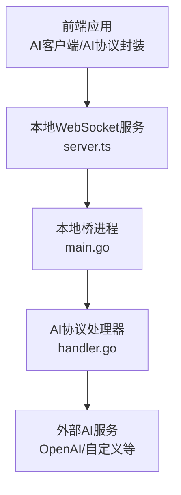
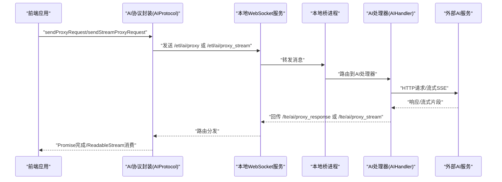
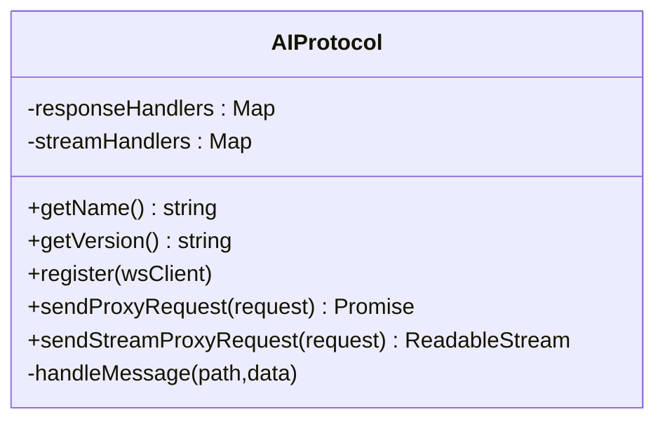
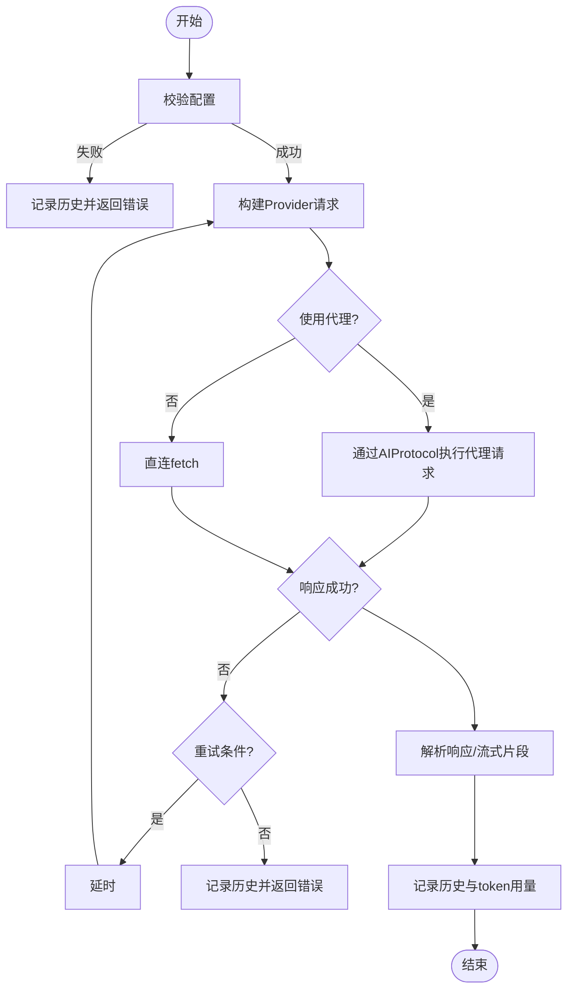
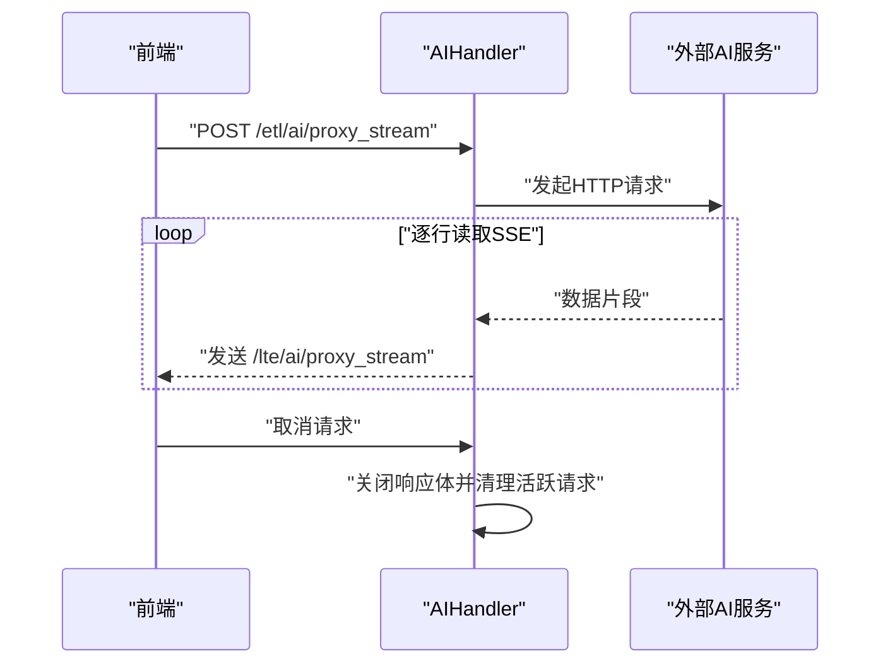
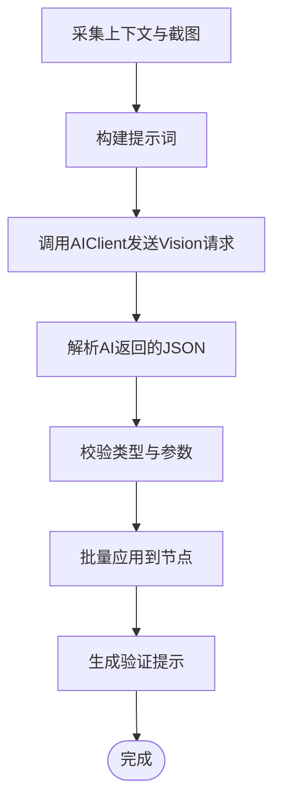
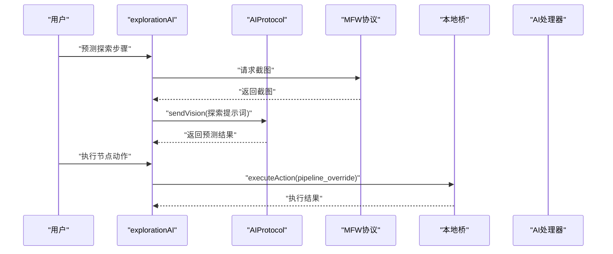
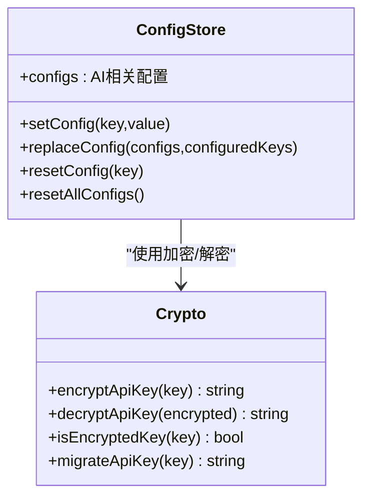
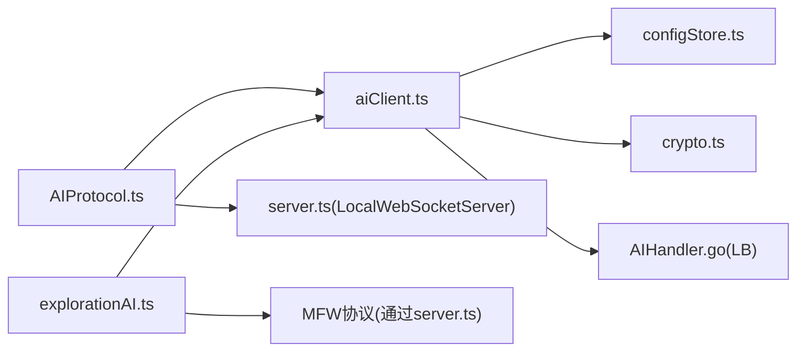

# AI协议处理

<cite>
**本文档引用的文件**
- [LocalBridge内部AI处理器](file://LocalBridge/internal/protocol/ai/handler.go)
- [前端AI协议封装](file://src/services/protocols/AIProtocol.ts)
- [AI客户端核心](file://src/utils/ai/aiClient.ts)
- [AI预测与应用](file://src/utils/ai/aiPredictor.ts)
- [探索模式AI工具](file://src/utils/ai/explorationAI.ts)
- [AI加密存储](file://src/utils/ai/crypto.ts)
- [配置存储](file://src/stores/configStore.ts)
- [AI历史记录](file://src/utils/ai/history.ts)
- [AI提示词管理](file://src/utils/ai/aiPrompts.ts)
- [本地WebSocket服务](file://src/services/server.ts)
- [基础协议抽象](file://src/services/protocols/BaseProtocol.ts)
- [本地桥主程序](file://LocalBridge/cmd/lb/main.go)
</cite>

## 目录
1. [引言](#引言)
2. [项目结构](#项目结构)
3. [核心组件](#核心组件)
4. [架构总览](#架构总览)
5. [详细组件分析](#详细组件分析)
6. [依赖关系分析](#依赖关系分析)
7. [性能考虑](#性能考虑)
8. [故障排查指南](#故障排查指南)
9. [结论](#结论)
10. [附录](#附录)

## 引言
本文件面向希望理解并扩展“AI协议处理”能力的工程师与产品人员，系统性阐述如下主题：
- AI协议的智能功能与服务集成机制
- AI请求的格式化、参数传递与结果处理流程
- 适配多AI提供商的适配层设计与统一接口实现
- 错误处理、重试机制与降级策略
- 性能优化、并发控制与资源管理
- 模型选择、参数调优与效果评估机制
- 在工作流中的应用场景与智能化决策支持

## 项目结构
整体采用“前端协议封装 + 本地桥代理 + 后端协议处理器”的三层架构：
- 前端层：通过WebSocket与本地桥通信，封装AI协议与业务逻辑
- 本地桥层：接收前端消息，转发至后端协议处理器，实现跨域与安全代理
- 后端层：具体协议处理器实现，负责与外部AI服务交互

图表来源
- [本地WebSocket服务:22-343](file://src/services/server.ts#L22-L343)
- [本地桥主程序:416-433](file://LocalBridge/cmd/lb/main.go#L416-L433)
- [LocalBridge内部AI处理器:16-53](file://LocalBridge/internal/protocol/ai/handler.go#L16-L53)

章节来源
- [本地WebSocket服务:22-343](file://src/services/server.ts#L22-L343)
- [本地桥主程序:416-433](file://LocalBridge/cmd/lb/main.go#L416-L433)

## 核心组件
- 前端AI协议封装（AIProtocol）：负责注册/注销路由、消息分发、非流式与流式请求的生命周期管理
- AI客户端（AIClient）：统一AI调用入口，内置配置校验、重试、CORS降级、代理开关、历史记录与令牌用量估算
- AI预测与应用（aiPredictor）：面向工作流的视觉预测，从截图与上下文构建提示词，解析并校验AI返回，应用到节点
- 探索模式AI工具（explorationAI）：在探索模式下进行节点预测与执行，支持智能标签生成与动作执行
- 本地桥AI处理器（AIHandler）：后端协议处理器，实现HTTP代理、SSE流式代理、请求取消与错误回传
- 配置与加密（configStore、crypto）：集中管理AI配置、API Key加密存储与迁移
- 提示词与历史（aiPrompts、history）：统一提示词模板、示例与历史记录管理

章节来源
- [前端AI协议封装:8-187](file://src/services/protocols/AIProtocol.ts#L8-L187)
- [AI客户端核心:45-520](file://src/utils/ai/aiClient.ts#L45-L520)
- [AI预测与应用:20-583](file://src/utils/ai/aiPredictor.ts#L20-L583)
- [探索模式AI工具:1-567](file://src/utils/ai/explorationAI.ts#L1-L567)
- [LocalBridge内部AI处理器:16-279](file://LocalBridge/internal/protocol/ai/handler.go#L16-L279)
- [AI加密存储:1-120](file://src/utils/ai/crypto.ts#L1-L120)
- [配置存储:117-239](file://src/stores/configStore.ts#L117-L239)
- [AI历史记录:28-67](file://src/utils/ai/history.ts#L28-L67)
- [AI提示词管理:8-444](file://src/utils/ai/aiPrompts.ts#L8-L444)

## 架构总览
从前端到后端的关键交互序列如下：

图表来源
- [前端AI协议封装:63-186](file://src/services/protocols/AIProtocol.ts#L63-L186)
- [本地WebSocket服务:97-106](file://src/services/server.ts#L97-L106)
- [本地桥主程序:432-433](file://LocalBridge/cmd/lb/main.go#L432-L433)
- [LocalBridge内部AI处理器:56-232](file://LocalBridge/internal/protocol/ai/handler.go#L56-L232)

## 详细组件分析

### 前端AI协议封装（AIProtocol）
- 路由注册：在构造时注册响应路由（非流式与流式），并在消息到达时按request_id分发
- 非流式请求：封装Promise，超时60秒；成功返回状态码、头部与正文
- 流式请求：返回ReadableStream，支持取消；超时120秒
- 请求标识：每个请求生成唯一request_id，保证多路并发下的消息关联

图表来源
- [前端AI协议封装:8-187](file://src/services/protocols/AIProtocol.ts#L8-L187)

章节来源
- [前端AI协议封装:20-186](file://src/services/protocols/AIProtocol.ts#L20-L186)

### AI客户端（AIClient）
- 配置管理：从配置存储读取并解密API Key，校验API URL、模型与温度等
- 代理开关：根据配置决定直连或通过LocalBridge代理
- 重试策略：可配置重试次数与间隔；对CORS类错误不重试
- 流式与非流式：分别解析响应与SSE片段，支持中断与取消
- 历史记录：记录每次交互，包含token用量估算
- CORS降级：识别浏览器CORS错误并给出用户友好提示

图表来源
- [AI客户端核心:203-391](file://src/utils/ai/aiClient.ts#L203-L391)

章节来源
- [AI客户端核心:65-391](file://src/utils/ai/aiClient.ts#L65-L391)

### 本地桥AI处理器（AIHandler）
- 非流式代理：构建HTTP请求，执行并回传状态码、头部与正文
- 流式代理：执行HTTP请求，逐行读取SSE响应，支持取消与错误回传
- 取消机制：维护活跃请求表，收到取消消息后关闭对应响应体
- 错误处理：统一格式化错误并回传前端

图表来源
- [LocalBridge内部AI处理器:127-232](file://LocalBridge/internal/protocol/ai/handler.go#L127-L232)

章节来源
- [LocalBridge内部AI处理器:56-279](file://LocalBridge/internal/protocol/ai/handler.go#L56-L279)

### AI预测与应用（aiPredictor）
- 上下文采集：收集当前节点、前置节点、连接类型与截图
- 提示词构建：基于协议规范与示例构建视觉预测提示词
- 结果解析：解析JSON并校验字段合法性，过滤无效类型与参数
- 应用到节点：批量更新节点的识别与动作配置，并生成验证提示

图表来源
- [AI预测与应用:172-342](file://src/utils/ai/aiPredictor.ts#L172-L342)

章节来源
- [AI预测与应用:172-583](file://src/utils/ai/aiPredictor.ts#L172-L583)

### 探索模式AI工具（explorationAI）
- 探索预测：在探索模式下预测下一步节点配置，支持目标描述与智能标签生成
- 执行动作：将预测结果转换为后端可执行的pipeline_override并发送执行请求
- 截图采集：通过MFW协议请求实时截图，支持缓存与超时控制

图表来源
- [探索模式AI工具:70-518](file://src/utils/ai/explorationAI.ts#L70-L518)

章节来源
- [探索模式AI工具:70-567](file://src/utils/ai/explorationAI.ts#L70-L567)

### 配置与加密（configStore、crypto）
- 配置项：API URL、API Key、模型、温度、提供商类型、代理开关等
- 加密存储：使用Web Crypto API对API Key进行AES-GCM加密，基于浏览器指纹派生密钥
- 迁移与降级：支持明文到加密的迁移，解密失败时降级为空

图表来源
- [配置存储:117-239](file://src/stores/configStore.ts#L117-L239)
- [AI加密存储:44-120](file://src/utils/ai/crypto.ts#L44-L120)

章节来源
- [配置存储:270-440](file://src/stores/configStore.ts#L270-L440)
- [AI加密存储:1-120](file://src/utils/ai/crypto.ts#L1-L120)

### 提示词与历史（aiPrompts、history）
- 提示词模板：统一的协议规范、示例与系统提示词，确保AI输出符合工作流规范
- 历史记录：记录每次交互的详细信息，支持订阅与清空

章节来源
- [AI提示词管理:8-444](file://src/utils/ai/aiPrompts.ts#L8-L444)
- [AI历史记录:28-67](file://src/utils/ai/history.ts#L28-L67)

## 依赖关系分析
- 前端协议依赖本地WebSocket服务进行消息路由
- AI协议封装依赖AI客户端进行实际请求
- AI客户端依赖配置存储与加密模块
- 本地桥AI处理器依赖HTTP客户端与后端路由分发
- 探索模式依赖MFW协议与文件存储以准备执行环境

图表来源
- [前端AI协议封装:1-187](file://src/services/protocols/AIProtocol.ts#L1-L187)
- [AI客户端核心:1-520](file://src/utils/ai/aiClient.ts#L1-L520)
- [配置存储:1-440](file://src/stores/configStore.ts#L1-L440)
- [AI加密存储:1-120](file://src/utils/ai/crypto.ts#L1-L120)
- [LocalBridge内部AI处理器:1-279](file://LocalBridge/internal/protocol/ai/handler.go#L1-L279)
- [本地WebSocket服务:1-388](file://src/services/server.ts#L1-L388)
- [探索模式AI工具:1-567](file://src/utils/ai/explorationAI.ts#L1-L567)

章节来源
- [本地桥主程序:416-433](file://LocalBridge/cmd/lb/main.go#L416-L433)

## 性能考虑
- 流式传输：SSE流式代理降低首字节延迟，前端可边接收边渲染
- 超时控制：非流式60秒、流式120秒，避免资源泄漏
- 取消机制：活跃请求表与响应体关闭，及时释放网络与内存资源
- 代理降级：CORS错误时自动切换代理，保障可用性
- 历史与用量：记录token用量，辅助成本控制与效果评估

## 故障排查指南
- 连接问题：检查本地桥是否启动、端口是否正确、协议版本是否匹配
- CORS错误：开启LocalBridge代理或调整后端CORS配置
- 代理请求失败：确认WebSocket连接状态、请求ID是否正确、后端是否返回错误
- 流式取消：调用cancel回调或发送取消消息，确保活跃请求被清理
- 配置错误：检查API URL、API Key、模型与温度配置，确认已加密存储

章节来源
- [本地WebSocket服务:108-270](file://src/services/server.ts#L108-L270)
- [AI客户端核心:113-133](file://src/utils/ai/aiClient.ts#L113-L133)
- [LocalBridge内部AI处理器:234-253](file://LocalBridge/internal/protocol/ai/handler.go#L234-L253)

## 结论
本AI协议处理体系通过“前端协议封装 + 本地桥代理 + 后端协议处理器”的分层设计，实现了：
- 统一的AI请求格式与参数传递
- 多提供商适配与代理降级
- 完整的错误处理、重试与取消机制
- 面向工作流的智能预测与应用
- 可观测的历史记录与用量统计

该体系为后续扩展更多AI提供商、引入更多工作流智能决策场景提供了清晰的扩展点。

## 附录
- 模型选择与参数调优建议
  - 温度（temperature）：0.7为默认值，创意类任务可提高，确定性任务可降低
  - 上下文长度：合理控制历史轮数，避免超出模型上下文限制
  - ROI与模板：在视觉预测中优先缩小识别区域，提升准确性与性能
- 效果评估机制
  - 基于历史记录的token用量与成功率统计
  - 用户反馈与人工验证，持续迭代提示词与约束规则