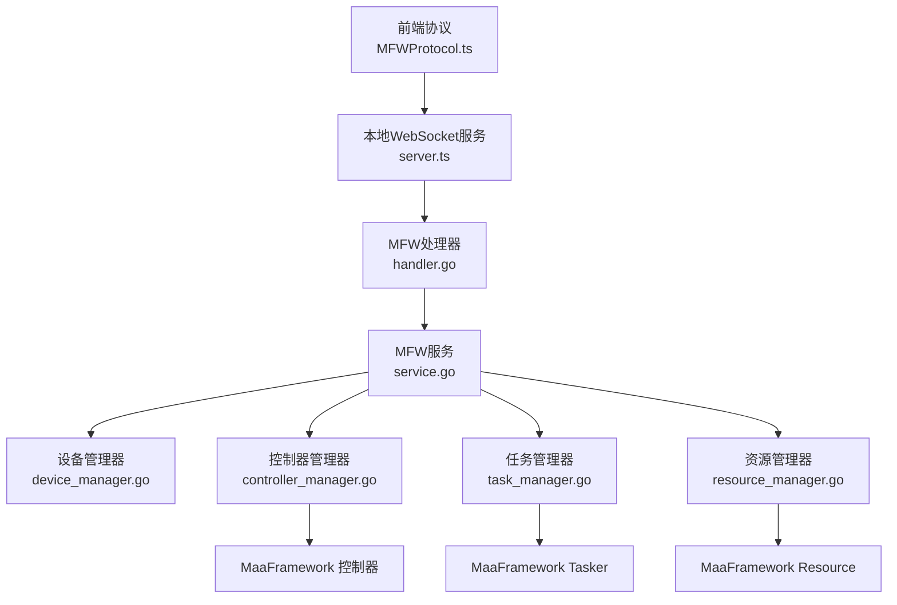
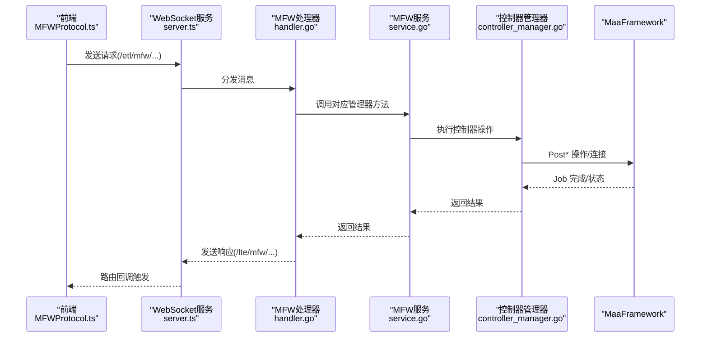
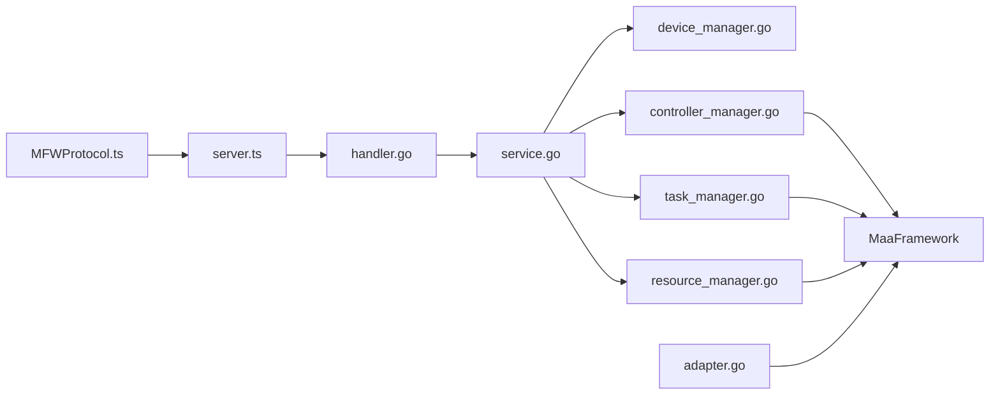

# MFW协议处理

<cite>
**本文引用的文件**
- [LocalBridge\internal\protocol\mfw\handler.go](file://LocalBridge/internal/protocol/mfw/handler.go)
- [src\services\protocols\MFWProtocol.ts](file://src/services/protocols/MFWProtocol.ts)
- [LocalBridge\internal\mfw\service.go](file://LocalBridge/internal/mfw/service.go)
- [LocalBridge\internal\mfw\controller_manager.go](file://LocalBridge/internal/mfw/controller_manager.go)
- [LocalBridge\internal\mfw\device_manager.go](file://LocalBridge/internal/mfw/device_manager.go)
- [LocalBridge\internal\mfw\task_manager.go](file://LocalBridge/internal/mfw/task_manager.go)
- [LocalBridge\internal\mfw\types.go](file://LocalBridge/internal/mfw/types.go)
- [LocalBridge\internal\mfw\error.go](file://LocalBridge/internal/mfw/error.go)
- [LocalBridge\internal\mfw\adapter.go](file://LocalBridge/internal/mfw/adapter.go)
- [src\stores\mfwStore.ts](file://src/stores/mfwStore.ts)
- [src\services\server.ts](file://src/services/server.ts)
- [LocalBridge\pkg\models\mfw.go](file://LocalBridge/pkg/models/mfw.go)
</cite>

## 目录
1. [简介](#简介)
2. [项目结构](#项目结构)
3. [核心组件](#核心组件)
4. [架构总览](#架构总览)
5. [详细组件分析](#详细组件分析)
6. [依赖关系分析](#依赖关系分析)
7. [性能考虑](#性能考虑)
8. [故障排查指南](#故障排查指南)
9. [结论](#结论)
10. [附录](#附录)

## 简介
本文件系统性阐述 MFW（MaaFramework）协议在本地桥接服务与前端界面之间的处理机制，覆盖设备管理、控制器生命周期、任务执行、状态监控、识别与动作执行、回调处理、错误与重连、超时管理、性能监控与日志调试，以及与其他协议的协作关系。目标是帮助开发者与使用者全面理解 MFW 协议的工作流与最佳实践。

## 项目结构
MFW 协议处理涉及三层：
- 前端协议层：负责 WebSocket 路由注册、消息发送与回调分发
- 本地桥接层：负责路由分发、MFW 服务编排、控制器/任务/资源管理
- MaaFramework 层：负责底层设备发现、控制器连接、任务执行、资源加载与事件回传

图表来源
- [src\services\protocols\MFWProtocol.ts:18-115](file://src/services/protocols/MFWProtocol.ts#L18-L115)
- [src\services\server.ts:22-343](file://src/services/server.ts#L22-L343)
- [LocalBridge\internal\protocol\mfw\handler.go:14-128](file://LocalBridge/internal/protocol/mfw/handler.go#L14-L128)
- [LocalBridge\internal\mfw\service.go:15-34](file://LocalBridge/internal/mfw/service.go#L15-L34)

章节来源
- [src\services\protocols\MFWProtocol.ts:18-115](file://src/services/protocols/MFWProtocol.ts#L18-L115)
- [src\services\server.ts:22-343](file://src/services/server.ts#L22-L343)
- [LocalBridge\internal\protocol\mfw\handler.go:14-128](file://LocalBridge/internal/protocol/mfw/handler.go#L14-L128)
- [LocalBridge\internal\mfw\service.go:15-34](file://LocalBridge/internal/mfw/service.go#L15-L34)

## 核心组件
- MFW 协议处理器：接收前端请求，分发至设备/控制器/任务/资源模块，统一返回响应或事件通知
- MFW 服务：集中初始化与管理设备、控制器、资源、任务四大子系统
- 设备管理器：封装 ADB、Win32、WlRoots 等设备发现与枚举
- 控制器管理器：创建/连接/断开控制器，执行点击、滑动、输入、应用启停、手柄操作等
- 任务管理器：提交/查询/停止任务，协调 Tasker 生命周期
- 资源管理器：加载/卸载资源包，提供哈希与路径解析
- 前端协议：注册路由、发送请求、订阅事件、维护连接状态
- 适配器：统一封装 Controller/Resource/Tasker/Agent 的生命周期与事件回传

章节来源
- [LocalBridge\internal\mfw\service.go:15-34](file://LocalBridge/internal/mfw/service.go#L15-L34)
- [LocalBridge\internal\mfw\device_manager.go:11-25](file://LocalBridge/internal/mfw/device_manager.go#L11-L25)
- [LocalBridge\internal\mfw\controller_manager.go:20-31](file://LocalBridge/internal/mfw/controller_manager.go#L20-L31)
- [LocalBridge\internal\mfw\task_manager.go:11-22](file://LocalBridge/internal/mfw/task_manager.go#L11-L22)
- [LocalBridge\internal\mfw\types.go:45-75](file://LocalBridge/internal/mfw/types.go#L45-L75)
- [src\services\protocols\MFWProtocol.ts:18-115](file://src/services/protocols/MFWProtocol.ts#L18-L115)
- [LocalBridge\internal\mfw\adapter.go:25-53](file://LocalBridge/internal/mfw/adapter.go#L25-L53)

## 架构总览
MFW 协议采用“前端 WebSocket → 本地处理器 → 服务编排 → MaaFramework”的分层设计。处理器根据路由将请求分派到对应管理器，管理器再调用 MaaFramework 完成具体操作；同时通过事件路由向前端推送状态与结果。

图表来源
- [src\services\protocols\MFWProtocol.ts:48-115](file://src/services/protocols/MFWProtocol.ts#L48-L115)
- [src\services\server.ts:97-106](file://src/services/server.ts#L97-L106)
- [LocalBridge\internal\protocol\mfw\handler.go:32-128](file://LocalBridge/internal/protocol/mfw/handler.go#L32-L128)
- [LocalBridge\internal\mfw\controller_manager.go:278-329](file://LocalBridge/internal/mfw/controller_manager.go#L278-L329)

## 详细组件分析

### MFW 协议处理器（handler）
- 路由前缀：/etl/mfw/
- 支持设备刷新、控制器创建/断开、截图、点击/滑动/输入、应用启停、手柄操作、任务提交/查询/停止、资源加载、自定义识别/动作注册等
- 服务初始化校验：若未初始化，返回“未初始化”错误并引导设置库路径
- 事件推送：控制器创建/状态变更、截图结果、OCR/图片路径/日志打开结果、执行动作结果等

章节来源
- [LocalBridge\internal\protocol\mfw\handler.go:14-128](file://LocalBridge/internal/protocol/mfw/handler.go#L14-L128)
- [LocalBridge\internal\protocol\mfw\handler.go:130-186](file://LocalBridge/internal/protocol/mfw/handler.go#L130-L186)
- [LocalBridge\internal\protocol\mfw\handler.go:188-750](file://LocalBridge/internal/protocol/mfw/handler.go#L188-L750)
- [LocalBridge\internal\protocol\mfw\handler.go:751-800](file://LocalBridge/internal/protocol/mfw/handler.go#L751-L800)

### 前端 MFW 协议（MFWProtocol.ts）
- 注册系统路由与 MFW 专属路由，包括设备列表、控制器状态、截图、OCR、图片路径解析、日志打开、操作结果、执行动作结果
- 维护连接状态与控制器信息，断线自动清理
- 提供丰富的发送方法：刷新设备、创建控制器、断开、截图、OCR、输入文本、启停应用、手柄操作、滚动、按键等
- 回调注册：onScreencapResult/onOCRResult/onImagePathResolved/onLogOpened/onExecuteActionResult

章节来源
- [src\services\protocols\MFWProtocol.ts:48-115](file://src/services/protocols/MFWProtocol.ts#L48-L115)
- [src\services\protocols\MFWProtocol.ts:117-326](file://src/services/protocols/MFWProtocol.ts#L117-L326)
- [src\services\protocols\MFWProtocol.ts:327-945](file://src/services/protocols/MFWProtocol.ts#L327-L945)

### MFW 服务与生命周期
- 初始化：读取配置库路径，处理 Windows 中文路径问题，设置日志目录，初始化 MaaFramework，开启调试模式
- 重载：关闭现有服务并重新初始化
- 关闭：停止任务、断开控制器、卸载资源、释放框架

章节来源
- [LocalBridge\internal\mfw\service.go:36-138](file://LocalBridge/internal/mfw/service.go#L36-L138)
- [LocalBridge\internal\mfw\service.go:140-170](file://LocalBridge/internal/mfw/service.go#L140-L170)
- [LocalBridge\internal\mfw\service.go:199-217](file://LocalBridge/internal/mfw/service.go#L199-L217)

### 设备管理器
- ADB 设备：FindAdbDevices，提供截图/输入方法列表
- Win32 窗口：FindDesktopWindows，提供截图/输入方法列表
- WlRoots 合成器：枚举窗口并提取套接字路径

章节来源
- [LocalBridge\internal\mfw\device_manager.go:27-61](file://LocalBridge/internal/mfw/device_manager.go#L27-L61)
- [LocalBridge\internal\mfw\device_manager.go:63-96](file://LocalBridge/internal/mfw/device_manager.go#L63-L96)
- [LocalBridge\internal\mfw\device_manager.go:98-121](file://LocalBridge/internal/mfw/device_manager.go#L98-L121)

### 控制器管理器
- 创建控制器：ADB/Win32/PlayCover/Gamepad/WlRoots，解析截图/输入方法，生成唯一 ID
- 连接控制器：异步连接并等待完成，超时处理，检查连接状态与 UUID
- 操作执行：点击、滑动、输入文本、启停应用、手柄按键/摇杆、滚动、Shell、Inactive 等
- 截图：支持目标长/短边缩放、原始尺寸、缓存控制，返回 Base64 PNG
- 资源清理：非活跃控制器自动清理

章节来源
- [LocalBridge\internal\mfw\controller_manager.go:33-75](file://LocalBridge/internal/mfw/controller_manager.go#L33-L75)
- [LocalBridge\internal\mfw\controller_manager.go:106-162](file://LocalBridge/internal/mfw/controller_manager.go#L106-L162)
- [LocalBridge\internal\mfw\controller_manager.go:164-192](file://LocalBridge/internal/mfw/controller_manager.go#L164-L192)
- [LocalBridge\internal\mfw\controller_manager.go:194-247](file://LocalBridge/internal/mfw/controller_manager.go#L194-L247)
- [LocalBridge\internal\mfw\controller_manager.go:249-276](file://LocalBridge/internal/mfw/controller_manager.go#L249-L276)
- [LocalBridge\internal\mfw\controller_manager.go:278-329](file://LocalBridge/internal/mfw/controller_manager.go#L278-L329)
- [LocalBridge\internal\mfw\controller_manager.go:365-399](file://LocalBridge/internal/mfw/controller_manager.go#L365-L399)
- [LocalBridge\internal\mfw\controller_manager.go:401-543](file://LocalBridge/internal/mfw/controller_manager.go#L401-L543)
- [LocalBridge\internal\mfw\controller_manager.go:545-622](file://LocalBridge/internal/mfw/controller_manager.go#L545-L622)
- [LocalBridge\internal\mfw\controller_manager.go:624-648](file://LocalBridge/internal/mfw/controller_manager.go#L624-L648)
- [LocalBridge\internal\mfw\controller_manager.go:650-684](file://LocalBridge/internal/mfw/controller_manager.go#L650-L684)
- [LocalBridge\internal\mfw\controller_manager.go:686-774](file://LocalBridge/internal/mfw/controller_manager.go#L686-L774)
- [LocalBridge\internal\mfw\controller_manager.go:776-800](file://LocalBridge/internal/mfw/controller_manager.go#L776-L800)

### 任务管理器
- 提交任务：创建 Tasker，记录任务状态
- 查询状态：返回 Pending/Running/Success/Failure
- 停止任务：调用 Tasker 停止并更新状态

章节来源
- [LocalBridge\internal\mfw\task_manager.go:24-53](file://LocalBridge/internal/mfw/task_manager.go#L24-L53)
- [LocalBridge\internal\mfw\task_manager.go:55-66](file://LocalBridge/internal/mfw/task_manager.go#L55-L66)
- [LocalBridge\internal\mfw\task_manager.go:68-90](file://LocalBridge/internal/mfw/task_manager.go#L68-L90)
- [LocalBridge\internal\mfw\task_manager.go:92-114](file://LocalBridge/internal/mfw/task_manager.go#L92-L114)

### 资源管理器
- 加载资源：解析资源包路径，创建 Resource，加载多包，计算哈希
- 获取/卸载/全部卸载：提供资源生命周期管理

章节来源
- [LocalBridge\internal\mfw\resource_manager.go:24-65](file://LocalBridge/internal/mfw/resource_manager.go#L24-L65)
- [LocalBridge\internal\mfw\resource_manager.go:67-78](file://LocalBridge/internal/mfw/resource_manager.go#L67-L78)
- [LocalBridge\internal\mfw\resource_manager.go:80-99](file://LocalBridge/internal/mfw/resource_manager.go#L80-L99)
- [LocalBridge\internal\mfw\resource_manager.go:101-118](file://LocalBridge/internal/mfw/resource_manager.go#L101-L118)

### 适配器（MaaFWAdapter）
- 统一封装：Controller/Resource/Tasker/Agent 生命周期与事件回传
- 控制器：ADB/Win32/WlRoots 连接，设置/借用控制器
- 资源：加载/设置/借用资源，节点 JSON 获取
- Tasker：初始化、绑定、提交/停止任务、识别/动作执行
- Agent：连接/断开、注册 Tasker Sink、健康检查
- 截图：截图器封装，缓存与 TTL 控制

章节来源
- [LocalBridge\internal\mfw\adapter.go:25-53](file://LocalBridge/internal/mfw/adapter.go#L25-L53)
- [LocalBridge\internal\mfw\adapter.go:66-121](file://LocalBridge/internal/mfw/adapter.go#L66-L121)
- [LocalBridge\internal\mfw\adapter.go:123-170](file://LocalBridge/internal/mfw/adapter.go#L123-L170)
- [LocalBridge\internal\mfw\adapter.go:172-212](file://LocalBridge/internal/mfw/adapter.go#L172-L212)
- [LocalBridge\internal\mfw\adapter.go:214-230](file://LocalBridge/internal/mfw/adapter.go#L214-L230)
- [LocalBridge\internal\mfw\adapter.go:249-328](file://LocalBridge/internal/mfw/adapter.go#L249-L328)
- [LocalBridge\internal\mfw\adapter.go:330-404](file://LocalBridge/internal/mfw/adapter.go#L330-L404)
- [LocalBridge\internal\mfw\adapter.go:425-513](file://LocalBridge/internal/mfw/adapter.go#L425-L513)
- [LocalBridge\internal\mfw\adapter.go:515-567](file://LocalBridge/internal/mfw/adapter.go#L515-L567)
- [LocalBridge\internal\mfw\adapter.go:568-630](file://LocalBridge/internal/mfw/adapter.go#L568-L630)
- [LocalBridge\internal\mfw\adapter.go:635-745](file://LocalBridge/internal/mfw/adapter.go#L635-L745)
- [LocalBridge\internal\mfw\adapter.go:747-801](file://LocalBridge/internal/mfw/adapter.go#L747-L801)
- [LocalBridge\internal\mfw\adapter.go:818-831](file://LocalBridge/internal/mfw/adapter.go#L818-L831)
- [LocalBridge\internal\mfw\adapter.go:837-878](file://LocalBridge/internal/mfw/adapter.go#L837-L878)
- [LocalBridge\internal\mfw\adapter.go:899-999](file://LocalBridge/internal/mfw/adapter.go#L899-L999)

### 类型与模型
- 控制器/资源/任务信息结构
- 截图请求/结果
- 控制器操作类型
- MFW 错误码与错误类型

章节来源
- [LocalBridge\internal\mfw\types.go:45-75](file://LocalBridge/internal/mfw/types.go#L45-L75)
- [LocalBridge\internal\mfw\types.go:77-95](file://LocalBridge/internal/mfw/types.go#L77-L95)
- [LocalBridge\internal\mfw\types.go:97-129](file://LocalBridge/internal/mfw/types.go#L97-L129)
- [LocalBridge\internal\mfw\error.go:5-31](file://LocalBridge/internal/mfw/error.go#L5-L31)
- [LocalBridge\pkg\models\mfw.go:1-260](file://LocalBridge/pkg/models/mfw.go#L1-L260)

## 依赖关系分析
- 前端协议依赖 WebSocket 服务进行消息收发与路由注册
- 处理器依赖服务编排，服务编排依赖各管理器
- 管理器依赖 MaaFramework 库完成设备/控制器/任务/资源操作
- 适配器提供统一封装，便于探索模式与外部集成

图表来源
- [src\services\protocols\MFWProtocol.ts:18-115](file://src/services/protocols/MFWProtocol.ts#L18-L115)
- [src\services\server.ts:22-343](file://src/services/server.ts#L22-L343)
- [LocalBridge\internal\protocol\mfw\handler.go:14-128](file://LocalBridge/internal/protocol/mfw/handler.go#L14-L128)
- [LocalBridge\internal\mfw\service.go:15-34](file://LocalBridge/internal/mfw/service.go#L15-L34)
- [LocalBridge\internal\mfw\controller_manager.go:20-31](file://LocalBridge/internal/mfw/controller_manager.go#L20-L31)

章节来源
- [src\services\protocols\MFWProtocol.ts:18-115](file://src/services/protocols/MFWProtocol.ts#L18-L115)
- [src\services\server.ts:22-343](file://src/services/server.ts#L22-L343)
- [LocalBridge\internal\protocol\mfw\handler.go:14-128](file://LocalBridge/internal/protocol/mfw/handler.go#L14-L128)
- [LocalBridge\internal\mfw\service.go:15-34](file://LocalBridge/internal/mfw/service.go#L15-L34)

## 性能考虑
- 截图缓存：截图器默认缓存 100ms，避免频繁截图造成性能损耗
- 控制器非活跃清理：定期清理长时间未活跃的控制器，释放资源
- 连接超时：控制器连接等待最多 10 秒，超时即判定失败
- 日志与调试：启用调试模式，但关闭 stdout 输出，仅保留日志目录输出
- 资源路径处理：Windows 中文路径优先短路径，否则切换工作目录规避问题

章节来源
- [LocalBridge\internal\mfw\adapter.go:908-999](file://LocalBridge/internal/mfw/adapter.go#L908-L999)
- [LocalBridge\internal\mfw\controller_manager.go:650-666](file://LocalBridge/internal/mfw/controller_manager.go#L650-L666)
- [LocalBridge\internal\mfw\controller_manager.go:300-312](file://LocalBridge/internal/mfw/controller_manager.go#L300-L312)
- [LocalBridge\internal\mfw\service.go:107-137](file://LocalBridge/internal/mfw/service.go#L107-L137)
- [LocalBridge\internal\mfw\service.go:67-94](file://LocalBridge/internal/mfw/service.go#L67-L94)

## 故障排查指南
- 未初始化：前端提示设置 MaaFramework 库路径后重启服务
- 控制器创建/连接失败：检查设备/方法参数、权限与驱动（如 ViGEm）
- 控制器未连接：确认连接状态与 UUID 获取
- 截图失败：检查截图方法、缓存与图像获取
- 任务提交失败：检查 Tasker 初始化、资源绑定与控制器连接
- Agent 连接异常：检查标识符、资源绑定、连接超时与存活状态
- WebSocket 连接超时/失败：检查本地服务端口、防火墙与握手版本

章节来源
- [LocalBridge\internal\protocol\mfw\handler.go:36-44](file://LocalBridge/internal/protocol/mfw/handler.go#L36-L44)
- [LocalBridge\internal\mfw\controller_manager.go:54-58](file://LocalBridge/internal/mfw/controller_manager.go#L54-L58)
- [LocalBridge\internal\mfw\controller_manager.go:294-329](file://LocalBridge/internal/mfw/controller_manager.go#L294-L329)
- [LocalBridge\internal\mfw\controller_manager.go:575-622](file://LocalBridge/internal/mfw/controller_manager.go#L575-L622)
- [LocalBridge\internal\mfw\task_manager.go:28-32](file://LocalBridge/internal/mfw/task_manager.go#L28-L32)
- [LocalBridge\internal\mfw\adapter.go:635-745](file://LocalBridge/internal/mfw/adapter.go#L635-L745)
- [src\services\server.ts:129-163](file://src/services/server.ts#L129-L163)

## 结论
MFW 协议通过清晰的分层设计与完善的生命周期管理，实现了从前端到 MaaFramework 的高效通信与可靠执行。其设备发现、控制器管理、任务执行、资源加载与事件回传机制，为自动化与可视化调试提供了坚实基础。配合错误处理、超时与缓存策略，整体具备良好的稳定性与可维护性。

## 附录

### MFW 协议路由与消息模型
- 设备相关：/etl/mfw/refresh_adb_devices、/etl/mfw/refresh_win32_windows、/etl/mfw/refresh_wlroots_sockets
- 控制器相关：/etl/mfw/create_*、/etl/mfw/disconnect_controller、/etl/mfw/request_screencap、/etl/mfw/controller_*（点击/滑动/输入/启停/按键/手柄/滚动/按键按下/释放/点击V2/滑动V2/Shell/Inactive）
- 任务相关：/etl/mfw/submit_task、/etl/mfw/query_task_status、/etl/mfw/stop_task
- 资源相关：/etl/mfw/load_resource、/etl/mfw/register_custom_recognition、/etl/mfw/register_custom_action
- 响应与事件：/lte/mfw/*（设备列表、控制器创建/状态、截图结果、执行动作结果）、/lte/utility/*（OCR/图片路径/日志）

章节来源
- [LocalBridge\internal\protocol\mfw\handler.go:46-128](file://LocalBridge/internal/protocol/mfw/handler.go#L46-L128)
- [LocalBridge\pkg\models\mfw.go:1-260](file://LocalBridge/pkg/models/mfw.go#L1-L260)