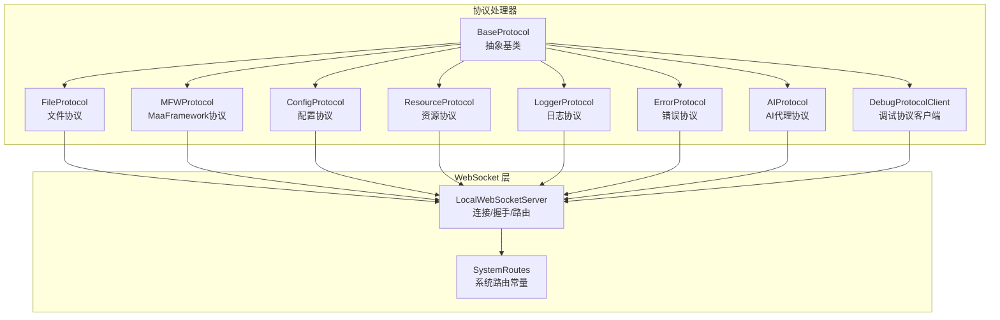
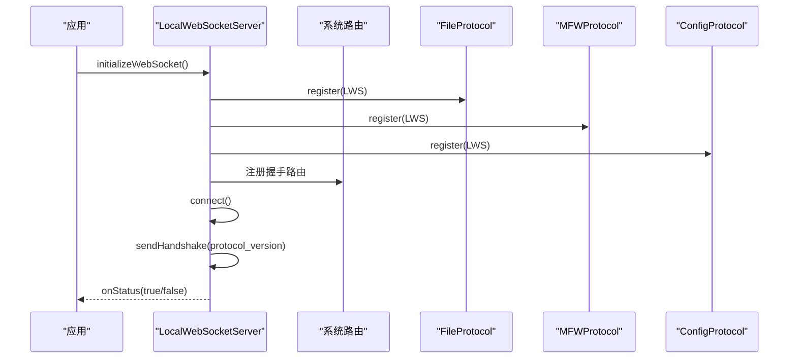
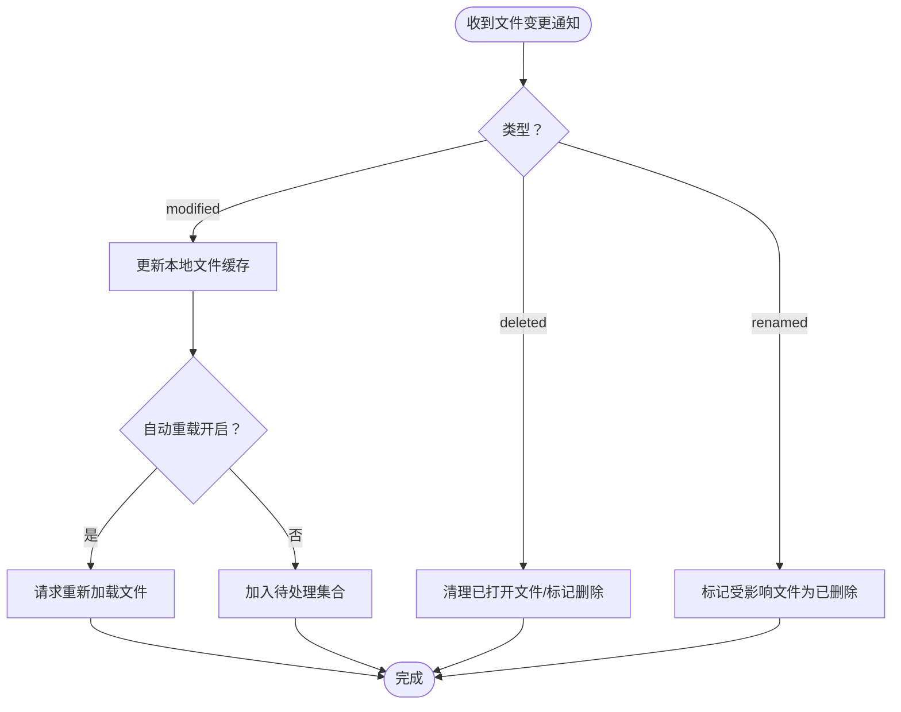
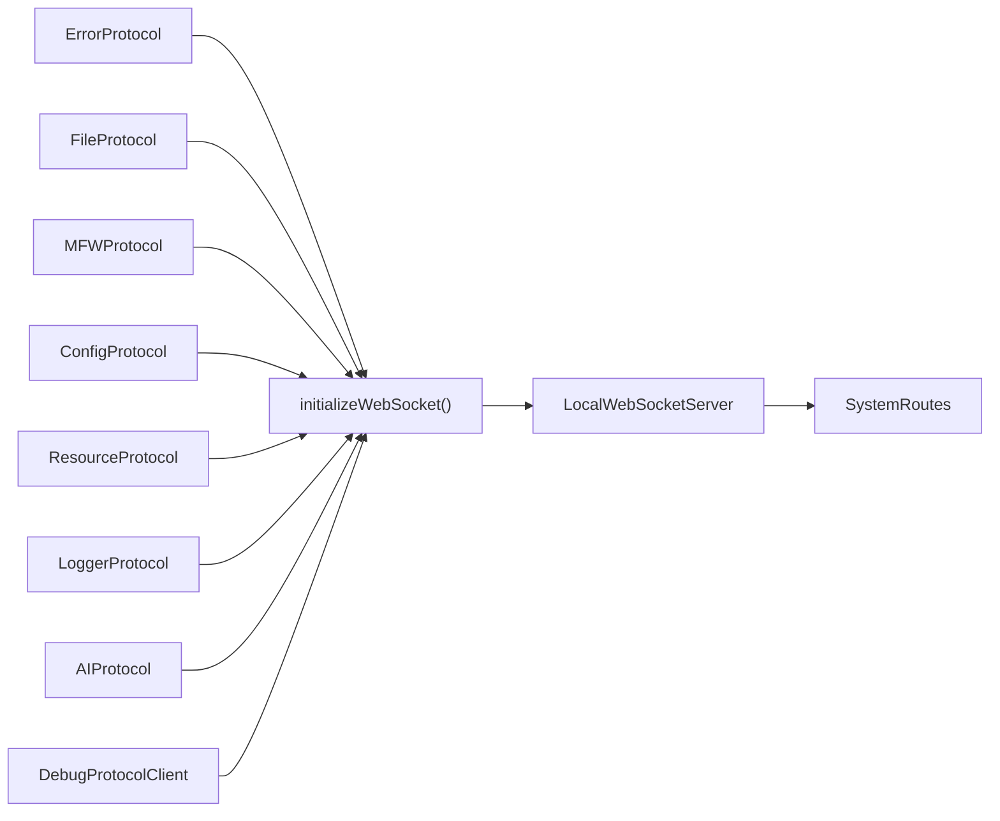

# 协议系统

<cite>
**本文引用的文件**
- [BaseProtocol.ts](file://src/services/protocols/BaseProtocol.ts)
- [FileProtocol.ts](file://src/services/protocols/FileProtocol.ts)
- [MFWProtocol.ts](file://src/services/protocols/MFWProtocol.ts)
- [ConfigProtocol.ts](file://src/services/protocols/ConfigProtocol.ts)
- [AIProtocol.ts](file://src/services/protocols/AIProtocol.ts)
- [ErrorProtocol.ts](file://src/services/protocols/ErrorProtocol.ts)
- [LoggerProtocol.ts](file://src/services/protocols/LoggerProtocol.ts)
- [ResourceProtocol.ts](file://src/services/protocols/ResourceProtocol.ts)
- [DebugProtocolClient.ts](file://src/services/protocols/DebugProtocolClient.ts)
- [index.ts](file://src/services/protocols/index.ts)
- [server.ts](file://src/services/server.ts)
- [type.ts](file://src/services/type.ts)
</cite>

## 目录
1. [简介](#简介)
2. [项目结构](#项目结构)
3. [核心组件](#核心组件)
4. [架构总览](#架构总览)
5. [详细组件分析](#详细组件分析)
6. [依赖关系分析](#依赖关系分析)
7. [性能考量](#性能考量)
8. [故障排查指南](#故障排查指南)
9. [结论](#结论)
10. [附录](#附录)

## 简介
本文件系统性梳理协议系统的架构设计与实现，重点覆盖：
- BaseProtocol 基类的设计原则与抽象约束
- 各协议处理器的职责边界与消息路由
- 协议注册机制与路由分发逻辑
- 消息格式标准化与数据序列化处理
- 协议扩展点与自定义协议开发指南
- 协议版本管理、向后兼容性与错误处理策略
- 协议间的数据流转与状态同步机制

## 项目结构
协议系统位于前端服务层，采用“协议处理器 + WebSocket 客户端”的分层设计：
- 协议处理器：围绕具体业务域（文件、MFW、配置、资源、日志、AI、调试等）封装消息收发与状态管理
- WebSocket 客户端：统一负责连接、握手、路由注册、消息发送与系统事件广播
- 类型与常量：集中定义系统路由、握手协议与消息处理签名

图表来源
- [server.ts:22-343](file://src/services/server.ts#L22-L343)
- [BaseProtocol.ts:7-39](file://src/services/protocols/BaseProtocol.ts#L7-L39)
- [index.ts:1-6](file://src/services/protocols/index.ts#L1-L6)

章节来源
- [server.ts:22-387](file://src/services/server.ts#L22-L387)
- [type.ts:1-28](file://src/services/type.ts#L1-L28)
- [index.ts:1-6](file://src/services/protocols/index.ts#L1-L6)

## 核心组件
- BaseProtocol 抽象基类
  - 规定协议名称、版本、注册与注销、以及消息处理入口
  - 为所有协议提供一致的生命周期与行为契约
- LocalWebSocketServer
  - 负责连接建立、握手校验、路由注册与消息分发
  - 提供 onStatus/onConnecting 等状态监听能力
  - 统一消息序列化与反序列化（JSON）

章节来源
- [BaseProtocol.ts:7-39](file://src/services/protocols/BaseProtocol.ts#L7-L39)
- [server.ts:22-343](file://src/services/server.ts#L22-L343)
- [type.ts:1-28](file://src/services/type.ts#L1-L28)

## 架构总览
协议系统以 BaseProtocol 为抽象基类，各协议处理器继承并实现具体路由；LocalWebSocketServer 在应用启动时统一注册所有协议处理器，并在握手阶段进行版本协商，确保前后端协议一致性。

图表来源
- [server.ts:361-387](file://src/services/server.ts#L361-L387)
- [server.ts:40-67](file://src/services/server.ts#L40-L67)
- [server.ts:272-287](file://src/services/server.ts#L272-L287)

## 详细组件分析

### BaseProtocol 基类
- 职责
  - 统一协议元信息（名称、版本）
  - 统一路由注册与注销
  - 统一消息入口（受保护，子类实现具体处理）
- 关键点
  - 通过抽象方法强制子类实现 getName/getVersion/register/unregister
  - handleMessage(path, data) 作为子类消息处理入口，避免直接暴露内部细节

章节来源
- [BaseProtocol.ts:7-39](file://src/services/protocols/BaseProtocol.ts#L7-L39)

### FileProtocol 文件协议
- 职责
  - 处理文件列表、文件内容、文件变更等推送
  - 处理保存/创建/分离保存等确认回执
  - 提供打开/创建/分离保存等请求方法
  - 维护保存确认回调队列与超时控制
- 路由
  - 接收：/lte/file_list、/lte/file_content、/lte/file_changed、/ack/save_file、/ack/save_separated、/ack/create_file
  - 发送：/etl/open_file、/etl/create_file、/etl/save_separated
- 数据流转
  - 列表/内容/变更由处理器更新本地存储
  - 保存/创建/分离保存通过确认路由解析回调并反馈 UI
- 状态同步
  - 通过 useLocalFileStore/useFileStore/useConfigStore 同步 UI 状态

图表来源
- [FileProtocol.ts:147-231](file://src/services/protocols/FileProtocol.ts#L147-L231)

章节来源
- [FileProtocol.ts:44-68](file://src/services/protocols/FileProtocol.ts#L44-L68)
- [FileProtocol.ts:78-141](file://src/services/protocols/FileProtocol.ts#L78-L141)
- [FileProtocol.ts:237-332](file://src/services/protocols/FileProtocol.ts#L237-L332)
- [FileProtocol.ts:541-579](file://src/services/protocols/FileProtocol.ts#L541-L579)

### MFWProtocol MaaFramework 协议
- 职责
  - 设备发现与控制器管理
  - 截图、OCR、图片路径解析、日志打开等通用能力
  - 控制器操作（点击、滑动、输入、按键、手柄触控等）
  - 回调注册与结果分发
- 路由
  - 接收：/lte/mfw/*、/lte/utility/*
  - 发送：/etl/mfw/*、/etl/utility/*
- 状态同步
  - 通过 useMFWStore 维护控制器状态、设备列表与连接状态

章节来源
- [MFWProtocol.ts:48-115](file://src/services/protocols/MFWProtocol.ts#L48-L115)
- [MFWProtocol.ts:123-280](file://src/services/protocols/MFWProtocol.ts#L123-L280)
- [MFWProtocol.ts:332-515](file://src/services/protocols/MFWProtocol.ts#L332-L515)

### ConfigProtocol 配置协议
- 职责
  - 获取/设置/重载后端配置
  - 分发配置数据与重载结果
- 路由
  - 接收：/lte/config/data、/lte/config/reload
  - 发送：/etl/config/get、/etl/config/set、/etl/config/reload
- 回调机制
  - onConfigData/onReload 提供订阅式通知

章节来源
- [ConfigProtocol.ts:60-74](file://src/services/protocols/ConfigProtocol.ts#L60-L74)
- [ConfigProtocol.ts:80-122](file://src/services/protocols/ConfigProtocol.ts#L80-L122)
- [ConfigProtocol.ts:128-161](file://src/services/protocols/ConfigProtocol.ts#L128-L161)

### ResourceProtocol 资源协议
- 职责
  - 资源包列表、图片单张/批量拉取、图片列表获取
  - 图片缓存与去重请求
- 路由
  - 接收：/lte/resource_bundles、/lte/image、/lte/images、/lte/image_list
  - 发送：/etl/get_image、/etl/get_images、/etl/refresh_resources、/etl/get_image_list
- 状态同步
  - 通过 useLocalFileStore 管理资源包、图片缓存与加载状态

章节来源
- [ResourceProtocol.ts:22-40](file://src/services/protocols/ResourceProtocol.ts#L22-L40)
- [ResourceProtocol.ts:46-70](file://src/services/protocols/ResourceProtocol.ts#L46-L70)
- [ResourceProtocol.ts:149-240](file://src/services/protocols/ResourceProtocol.ts#L149-L240)

### LoggerProtocol 日志协议
- 职责
  - 接收后端推送日志，标准化级别并写入日志存储
- 路由
  - 接收：/lte/logger

章节来源
- [LoggerProtocol.ts:25-30](file://src/services/protocols/LoggerProtocol.ts#L25-L30)
- [LoggerProtocol.ts:32-56](file://src/services/protocols/LoggerProtocol.ts#L32-L56)

### ErrorProtocol 错误协议
- 职责
  - 统一错误消息处理与 UI 提示
  - 对特定错误码清理控制器状态
- 路由
  - 接收：/error

章节来源
- [ErrorProtocol.ts:20-25](file://src/services/protocols/ErrorProtocol.ts#L20-L25)
- [ErrorProtocol.ts:27-79](file://src/services/protocols/ErrorProtocol.ts#L27-L79)

### AIProtocol AI 代理协议
- 职责
  - 通过 LocalBridge 代理跨域请求，支持非流式与流式响应
  - 维护请求 ID 与回调映射，处理超时与取消
- 路由
  - 接收：/lte/ai/proxy_response、/lte/ai/proxy_stream
  - 发送：/etl/ai/proxy、/etl/ai/proxy_stream、/etl/ai/proxy_cancel

章节来源
- [AIProtocol.ts:20-32](file://src/services/protocols/AIProtocol.ts#L20-L32)
- [AIProtocol.ts:34-58](file://src/services/protocols/AIProtocol.ts#L34-L58)
- [AIProtocol.ts:72-118](file://src/services/protocols/AIProtocol.ts#L72-L118)
- [AIProtocol.ts:129-186](file://src/services/protocols/AIProtocol.ts#L129-L186)

### DebugProtocolClient 调试协议客户端
- 职责
  - 作为客户端向后端发起调试相关请求
  - 订阅各类调试事件并分发给上层监听者
- 路由
  - 接收：/lte/debug/*
  - 发送：/mpe/debug/*

章节来源
- [DebugProtocolClient.ts:77-121](file://src/services/protocols/DebugProtocolClient.ts#L77-L121)
- [DebugProtocolClient.ts:268-274](file://src/services/protocols/DebugProtocolClient.ts#L268-L274)

## 依赖关系分析
- 协议注册顺序
  - 先注册 ErrorProtocol（保证错误可见性）
  - 再注册 FileProtocol、MFWProtocol、ConfigProtocol、ResourceProtocol、LoggerProtocol、AIProtocol
  - 最后注册 DebugProtocolClient 并绑定调试监听
- 路由注册与消息分发
  - LocalWebSocketServer 在 connect 成功后发送握手请求
  - 握手响应中若版本不匹配，主动断开并提示升级
  - 握手成功后，按注册顺序调用各协议的 register 方法完成路由注册
- 系统路由
  - SystemRoutes 定义了握手与响应路径，避免硬编码

图表来源
- [server.ts:361-387](file://src/services/server.ts#L361-L387)
- [server.ts:40-67](file://src/services/server.ts#L40-L67)

章节来源
- [server.ts:361-387](file://src/services/server.ts#L361-L387)
- [type.ts:2-5](file://src/services/type.ts#L2-L5)

## 性能考量
- 路由注册与消息分发
  - 使用 Map 存储路由，查找复杂度 O(1)，适合高频消息场景
- 图片资源加载
  - ResourceProtocol 对图片请求进行去重与缓存，减少重复网络请求
- 保存确认机制
  - FileProtocol 使用超时与回调队列，避免阻塞 UI 且保证幂等
- 连接与握手
  - LocalWebSocketServer 提供连接超时与状态广播，降低不可用连接对 UI 的影响

章节来源
- [ResourceProtocol.ts:149-207](file://src/services/protocols/ResourceProtocol.ts#L149-L207)
- [FileProtocol.ts:541-579](file://src/services/protocols/FileProtocol.ts#L541-L579)
- [server.ts:109-255](file://src/services/server.ts#L109-L255)

## 故障排查指南
- 连接失败/超时
  - 检查 LocalWebSocketServer 的 onerror/onclose 与通知提示
  - 确认本地服务端口与可达性
- 协议版本不匹配
  - 握手响应中会输出前端所需版本与后端版本，按提示升级
- 错误消息处理
  - ErrorProtocol 将错误码映射为用户可读提示，并对部分错误清理控制器状态
- 日志定位
  - LoggerProtocol 将后端日志标准化写入存储，便于问题复盘

章节来源
- [server.ts:131-163](file://src/services/server.ts#L131-L163)
- [server.ts:186-214](file://src/services/server.ts#L186-L214)
- [server.ts:44-65](file://src/services/server.ts#L44-L65)
- [ErrorProtocol.ts:27-79](file://src/services/protocols/ErrorProtocol.ts#L27-L79)
- [LoggerProtocol.ts:32-56](file://src/services/protocols/LoggerProtocol.ts#L32-L56)

## 结论
协议系统通过 BaseProtocol 抽象与 LocalWebSocketServer 统一承载，实现了清晰的职责划分与稳定的扩展能力。各协议处理器围绕自身领域进行消息编排与状态同步，配合严格的版本握手与错误处理，保障了前端与本地服务之间的可靠交互。

## 附录

### 协议版本管理与向后兼容
- 版本协商
  - 前端在握手时携带 protocol_version，后端比对 required_version，不匹配则断开并提示升级
- 兼容策略
  - 新增协议或路由时，保持旧路由不变，新增路由以新前缀区分，逐步迁移
  - 对于破坏性变更，通过版本号提升与文档说明引导升级

章节来源
- [server.ts:20](file://src/services/server.ts#L20)
- [server.ts:44-65](file://src/services/server.ts#L44-L65)
- [type.ts:8-18](file://src/services/type.ts#L8-L18)

### 消息格式标准化与序列化
- 统一格式
  - 每条消息包含 path 与 data 字段
  - send 方法将对象序列化为 JSON，onmessage 中解析并按 path 分发
- 类型约束
  - MessageHandler 与 APIRoute 定义了消息处理签名，确保路由注册一致性

章节来源
- [server.ts:170-184](file://src/services/server.ts#L170-L184)
- [server.ts:290-304](file://src/services/server.ts#L290-L304)
- [type.ts:20-27](file://src/services/type.ts#L20-L27)

### 协议扩展点与自定义协议开发指南
- 开发步骤
  - 新建类继承 BaseProtocol，实现 getName/getVersion/register/registerRoute/send
  - 在 initializeWebSocket 中按优先级注册
  - 如需系统事件监听，在构造函数中使用 wsClient.onStatus/onConnecting
- 路由规范
  - 接收路由以 /lte/{domain}/{action} 命名，发送路由以 /etl/{domain}/{action} 命名
  - 保留 /error 与 /lte/logger 等系统级路由不冲突
- 数据与状态
  - 通过对应 store（如 useLocalFileStore/useMFWStore 等）同步 UI 状态
  - 对于异步确认（如保存），使用静态回调队列与超时控制

章节来源
- [BaseProtocol.ts:7-39](file://src/services/protocols/BaseProtocol.ts#L7-L39)
- [server.ts:361-387](file://src/services/server.ts#L361-L387)
- [index.ts:1-6](file://src/services/protocols/index.ts#L1-L6)