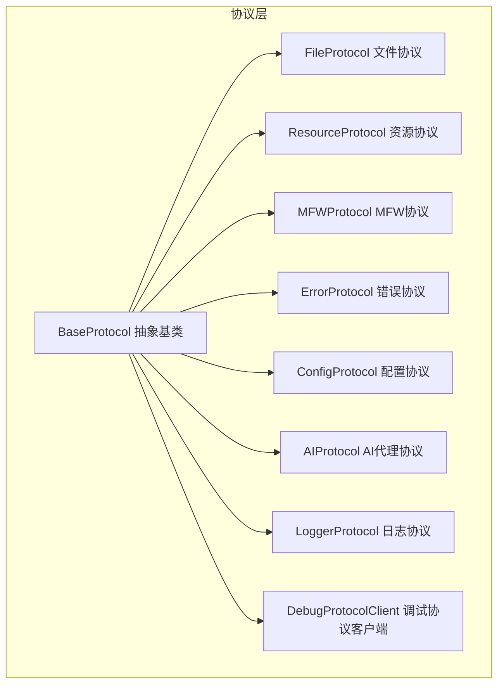
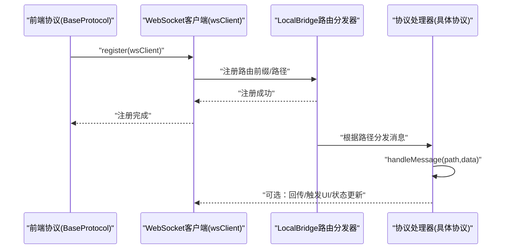
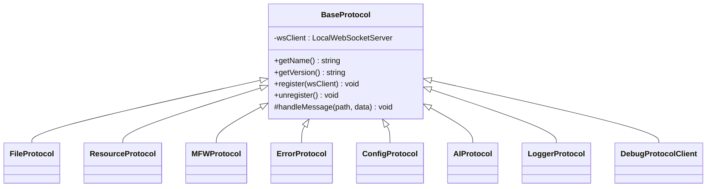
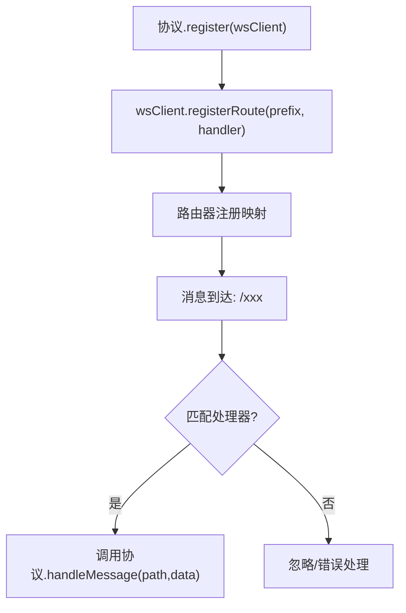
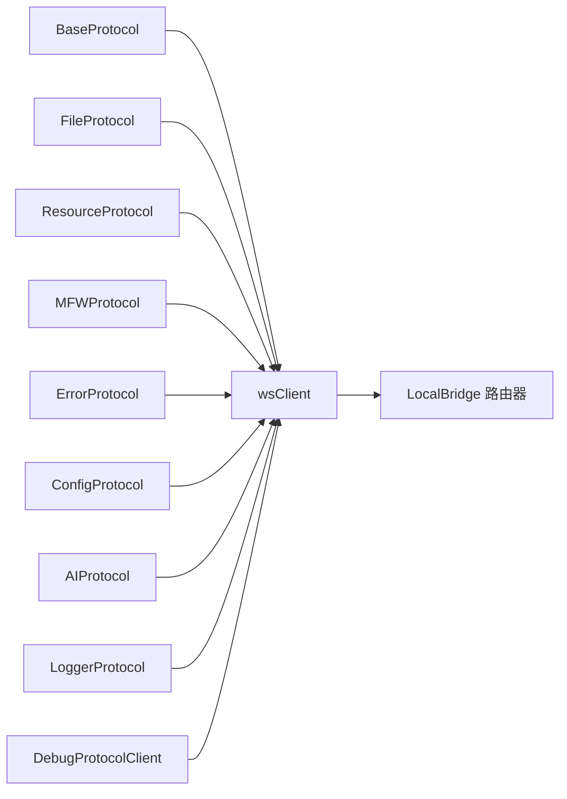

# 基础协议架构

<cite>
**本文引用的文件**
- [BaseProtocol.ts](file://src/services/protocols/BaseProtocol.ts)
- [index.ts](file://src/services/protocols/index.ts)
- [FileProtocol.ts](file://src/services/protocols/FileProtocol.ts)
- [ResourceProtocol.ts](file://src/services/protocols/ResourceProtocol.ts)
- [MFWProtocol.ts](file://src/services/protocols/MFWProtocol.ts)
- [ErrorProtocol.ts](file://src/services/protocols/ErrorProtocol.ts)
- [ConfigProtocol.ts](file://src/services/protocols/ConfigProtocol.ts)
- [AIProtocol.ts](file://src/services/protocols/AIProtocol.ts)
- [LoggerProtocol.ts](file://src/services/protocols/LoggerProtocol.ts)
- [DebugProtocolClient.ts](file://src/services/protocols/DebugProtocolClient.ts)
- [router.go](file://LocalBridge/internal/router/router.go)
</cite>

## 目录
1. [引言](#引言)
2. [项目结构](#项目结构)
3. [核心组件](#核心组件)
4. [架构总览](#架构总览)
5. [详细组件分析](#详细组件分析)
6. [依赖分析](#依赖分析)
7. [性能考虑](#性能考虑)
8. [故障排查指南](#故障排查指南)
9. [结论](#结论)
10. [附录](#附录)

## 引言
本文件系统性梳理前端协议抽象层的设计与实现，围绕 BaseProtocol 基类展开，阐释协议抽象层的作用与设计原则，详解协议生命周期管理、初始化与销毁流程，说明协议间的继承关系与多态实现，并给出协议扩展指南、注册机制、路由分发逻辑与错误处理框架。最后提供基于 BaseProtocol 开发自定义协议处理器的最佳实践。

## 项目结构
协议体系位于前端服务层，采用“协议即模块”的组织方式，每个协议独立封装路由注册、消息处理与对外 API，统一继承自 BaseProtocol 抽象基类。协议导出入口集中于协议索引文件，便于按需引入与组合使用。

**图表来源**
- [BaseProtocol.ts:7-39](file://src/services/protocols/BaseProtocol.ts#L7-L39)
- [FileProtocol.ts:16-68](file://src/services/protocols/FileProtocol.ts#L16-L68)
- [ResourceProtocol.ts:13-36](file://src/services/protocols/ResourceProtocol.ts#L13-L36)
- [MFWProtocol.ts:18-115](file://src/services/protocols/MFWProtocol.ts#L18-L115)
- [ErrorProtocol.ts:11-25](file://src/services/protocols/ErrorProtocol.ts#L11-L25)
- [ConfigProtocol.ts:46-70](file://src/services/protocols/ConfigProtocol.ts#L46-L70)
- [AIProtocol.ts:8-32](file://src/services/protocols/AIProtocol.ts#L8-L32)
- [LoggerProtocol.ts:16-30](file://src/services/protocols/LoggerProtocol.ts#L16-L30)
- [DebugProtocolClient.ts:31-121](file://src/services/protocols/DebugProtocolClient.ts#L31-L121)

**章节来源**
- [index.ts:1-6](file://src/services/protocols/index.ts#L1-L6)

## 核心组件
- BaseProtocol 抽象基类：定义协议名称、版本、注册与注销、消息处理入口等统一契约，约束子类必须实现的接口与可选的生命周期钩子。
- 具体协议：FileProtocol、ResourceProtocol、MFWProtocol、ErrorProtocol、ConfigProtocol、AIProtocol、LoggerProtocol、DebugProtocolClient 等，分别负责不同领域的消息路由与业务处理。
- 路由分发：LocalBridge 提供通用路由分发器，协议层通过 wsClient.registerRoute 完成路由注册；前端协议层通过 BaseProtocol 的 register 统一接入。

**章节来源**
- [BaseProtocol.ts:7-39](file://src/services/protocols/BaseProtocol.ts#L7-L39)
- [router.go:29-58](file://LocalBridge/internal/router/router.go#L29-L58)

## 架构总览
协议抽象层通过 BaseProtocol 将“协议名/版本”、“路由注册”、“消息处理”、“生命周期管理”等能力标准化，具体协议仅关注领域细节。前端协议与后端 LocalBridge 的路由分发配合，形成清晰的“协议-路由-消息-处理”的闭环。

**图表来源**
- [BaseProtocol.ts:24-38](file://src/services/protocols/BaseProtocol.ts#L24-L38)
- [router.go:42-58](file://LocalBridge/internal/router/router.go#L42-L58)

## 详细组件分析

### BaseProtocol 抽象基类
- 设计理念
  - 以“最小接口+可选钩子”的方式定义协议契约，确保各协议具备一致的生命周期与行为边界。
  - 通过受保护的 handleMessage 入口，隔离具体协议的消息分发细节，避免跨协议耦合。
- 核心接口
  - getName()/getVersion()：标识协议元信息。
  - register(wsClient)/unregister()：注册/注销路由，unregister 负责清理引用。
  - handleMessage(path, data)：统一消息入口，具体协议实现各自处理逻辑。
- 生命周期
  - 初始化：构造后由上层注入 wsClient 并调用 register 完成路由注册。
  - 运行期：通过 wsClient 分发消息至 handleMessage，再由具体协议处理。
  - 销毁：调用 unregister 清空 wsClient 引用，避免内存泄漏与悬挂回调。

**图表来源**
- [BaseProtocol.ts:7-39](file://src/services/protocols/BaseProtocol.ts#L7-L39)
- [FileProtocol.ts:16-42](file://src/services/protocols/FileProtocol.ts#L16-L42)
- [ResourceProtocol.ts:13-20](file://src/services/protocols/ResourceProtocol.ts#L13-L20)
- [MFWProtocol.ts:18-46](file://src/services/protocols/MFWProtocol.ts#L18-L46)
- [ErrorProtocol.ts:11-18](file://src/services/protocols/ErrorProtocol.ts#L11-L18)
- [ConfigProtocol.ts:46-58](file://src/services/protocols/ConfigProtocol.ts#L46-L58)
- [AIProtocol.ts:8-18](file://src/services/protocols/AIProtocol.ts#L8-L18)
- [LoggerProtocol.ts:16-23](file://src/services/protocols/LoggerProtocol.ts#L16-L23)
- [DebugProtocolClient.ts:31-71](file://src/services/protocols/DebugProtocolClient.ts#L31-L71)

**章节来源**
- [BaseProtocol.ts:7-39](file://src/services/protocols/BaseProtocol.ts#L7-L39)

### 协议注册机制与路由分发
- 前端协议注册
  - 各协议在 register 中调用 wsClient.registerRoute 注册本协议的接收路由，形成“协议-路由前缀”的映射。
  - 通过统一的 handleMessage 入口，协议内部可进一步细化到具体路径的处理。
- LocalBridge 路由分发
  - 路由器维护处理器映射表，按路径匹配进行分发；支持设置协议版本不匹配回调。
  - 协议层无需关心底层分发细节，专注于消息处理。

**图表来源**
- [FileProtocol.ts:44-68](file://src/services/protocols/FileProtocol.ts#L44-L68)
- [ResourceProtocol.ts:22-36](file://src/services/protocols/ResourceProtocol.ts#L22-L36)
- [router.go:42-58](file://LocalBridge/internal/router/router.go#L42-L58)

**章节来源**
- [FileProtocol.ts:44-68](file://src/services/protocols/FileProtocol.ts#L44-L68)
- [ResourceProtocol.ts:22-36](file://src/services/protocols/ResourceProtocol.ts#L22-L36)
- [router.go:29-58](file://LocalBridge/internal/router/router.go#L29-L58)

### 协议生命周期管理与销毁机制
- 初始化
  - 构造协议实例 → 注入 wsClient → 调用 register 完成路由注册。
- 运行期
  - handleMessage 统一入口，协议内部按路径细分处理；部分协议维护回调集合或状态缓存。
- 销毁
  - 调用 unregister 清空 wsClient 引用；部分协议提供静态清理方法（如文件协议的保存确认回调清理）。
- 注意事项
  - 协议应避免持有全局对象的强引用，及时清理定时器、回调集合与 UI 弹窗。
  - 在断开连接场景下，应主动清理等待中的异步回调，避免悬挂。

**章节来源**
- [BaseProtocol.ts:29-31](file://src/services/protocols/BaseProtocol.ts#L29-L31)
- [FileProtocol.ts:573-580](file://src/services/protocols/FileProtocol.ts#L573-L580)

### 协议间继承关系与多态实现
- 继承关系
  - 所有协议均继承自 BaseProtocol，遵循统一契约，保证多态一致性。
- 多态体现
  - 不同协议实现各自的 getName/getVersion，register 注册不同路由，handleMessage 内部按路径分支处理。
  - 协议对外暴露的方法（如 requestXxx）用于发起请求，内部通过 wsClient.send 发送消息。

**章节来源**
- [BaseProtocol.ts:13-38](file://src/services/protocols/BaseProtocol.ts#L13-L38)
- [MFWProtocol.ts:328-363](file://src/services/protocols/MFWProtocol.ts#L328-L363)

### 协议扩展指南与最佳实践
- 新增协议步骤
  - 继承 BaseProtocol，实现 getName/getVersion/register/unregister/handleMessage。
  - 在 register 中通过 wsClient.registerRoute 注册所需路由。
  - 如需对外暴露 API，提供 public 方法并通过 wsClient.send 发送消息。
  - 在协议索引文件中导出新协议，便于上层按需引入。
- 最佳实践
  - 明确职责边界：每个协议专注单一领域，避免“上帝对象”。
  - 统一错误处理：在 handleMessage 中捕获异常并输出日志，必要时向用户反馈。
  - 资源清理：在 unregister 或断开连接时清理回调、定时器与 UI 状态。
  - 版本管理：通过 getVersion 返回协议版本，配合 LocalBridge 的协议版本不匹配回调进行兼容性处理。

**章节来源**
- [index.ts:1-6](file://src/services/protocols/index.ts#L1-L6)

### 错误处理框架
- 统一错误协议
  - ErrorProtocol 注册 /error 路由，集中处理后端推送的错误消息，按错误码映射用户可见提示。
  - 对特定错误（如 OCR 资源加载失败）弹出 Modal 展示详细原因与排查建议。
  - 针对控制器相关错误，清理前端连接状态，避免误导用户。
- 建议
  - 前端协议在 handleMessage 中捕获异常并上报；必要时通过 ErrorProtocol 推送统一错误。
  - 对网络/超时类错误，提供重试或降级策略，并在 UI 中明确提示。

**章节来源**
- [ErrorProtocol.ts:20-79](file://src/services/protocols/ErrorProtocol.ts#L20-L79)

### 协议注册与路由分发的实现要点
- 前端协议
  - 通过 wsClient.registerRoute 注册路由，handleMessage 统一入口，内部按路径细分处理。
- LocalBridge 路由器
  - 维护处理器映射，支持设置协议版本不匹配回调；路由分发时按路径查找处理器。
- 协议版本控制
  - 各协议通过 getVersion 返回版本号；当版本不匹配时，可通过回调进行提示或降级。

**章节来源**
- [FileProtocol.ts:44-68](file://src/services/protocols/FileProtocol.ts#L44-L68)
- [router.go:52-54](file://LocalBridge/internal/router/router.go#L52-L54)

## 依赖分析
- 协议层依赖
  - BaseProtocol：所有协议的共同父类，提供统一契约。
  - wsClient：WebSocket 客户端，负责路由注册与消息发送。
  - Store：部分协议依赖状态存储（如文件、资源、MFW 等），用于 UI 同步与状态管理。
- 耦合与内聚
  - 协议之间低耦合：通过 BaseProtocol 契约与 wsClient 解耦。
  - 协议内部高内聚：同一协议内的路由、状态与 UI 逻辑紧密关联。
- 外部依赖
  - LocalBridge 路由器：提供通用路由分发能力，协议层无需关心底层实现。

**图表来源**
- [BaseProtocol.ts:7-39](file://src/services/protocols/BaseProtocol.ts#L7-L39)
- [router.go:29-58](file://LocalBridge/internal/router/router.go#L29-L58)

**章节来源**
- [BaseProtocol.ts:7-39](file://src/services/protocols/BaseProtocol.ts#L7-L39)
- [router.go:29-58](file://LocalBridge/internal/router/router.go#L29-L58)

## 性能考虑
- 路由注册与分发
  - 路由注册为 O(1) 查找，分发时按路径匹配，整体复杂度低。
- 回调与状态
  - 避免在协议中维护过大的回调集合或状态缓存；定期清理不再使用的项。
- UI 交互
  - 对频繁触发的事件（如文件变更通知）采用节流/去抖策略，减少 UI 重绘与弹窗风暴。
- 超时与重试
  - 对网络请求设置合理超时与重试次数，避免阻塞主线程。

## 故障排查指南
- 常见问题
  - 协议未注册：检查 register 是否被调用，路由是否正确注册。
  - 消息未到达：确认路径是否匹配，handleMessage 是否按路径分支处理。
  - 断开连接后仍回调：确认在 unregister 或断开连接时清理回调集合。
  - 错误提示缺失：检查 ErrorProtocol 是否正确处理 /error 路由。
- 排查步骤
  - 打开浏览器控制台查看日志与错误堆栈。
  - 在协议 handleMessage 中增加关键路径的日志输出。
  - 使用 LocalBridge 路由器的协议版本不匹配回调定位版本差异。
- 相关实现参考
  - 协议注销与回调清理：BaseProtocol.unregister、FileProtocol.clearAllPendingCallbacks。
  - 错误协议统一处理：ErrorProtocol.handleMessage。

**章节来源**
- [BaseProtocol.ts:29-31](file://src/services/protocols/BaseProtocol.ts#L29-L31)
- [FileProtocol.ts:573-580](file://src/services/protocols/FileProtocol.ts#L573-L580)
- [ErrorProtocol.ts:27-79](file://src/services/protocols/ErrorProtocol.ts#L27-L79)
- [router.go:52-54](file://LocalBridge/internal/router/router.go#L52-L54)

## 结论
BaseProtocol 抽象基类为协议体系提供了统一的契约与生命周期管理，结合 LocalBridge 的路由分发机制，实现了协议的模块化、可扩展与可维护。通过规范化的注册、消息处理与销毁流程，前端协议能够在保持低耦合的同时高效地完成跨域、设备、资源与调试等多领域任务。建议在新增协议时严格遵循本文的扩展指南与最佳实践，确保系统的稳定性与可演进性。

## 附录
- 协议清单与职责概览
  - FileProtocol：文件列表、内容、变更与保存确认的推送与请求。
  - ResourceProtocol：资源包、图片与图片列表的获取与缓存。
  - MFWProtocol：设备列表、控制器创建与状态、截图、OCR、日志与动作执行的回调与请求。
  - ErrorProtocol：统一错误消息处理与 UI 提示。
  - ConfigProtocol：后端配置的获取、设置与重载。
  - AIProtocol：AI 代理请求与流式代理请求。
  - LoggerProtocol：后端日志推送与存储。
  - DebugProtocolClient：调试会话、运行、资源健康与追踪等事件的监听与请求。

**章节来源**
- [FileProtocol.ts:16-68](file://src/services/protocols/FileProtocol.ts#L16-L68)
- [ResourceProtocol.ts:13-36](file://src/services/protocols/ResourceProtocol.ts#L13-L36)
- [MFWProtocol.ts:18-115](file://src/services/protocols/MFWProtocol.ts#L18-L115)
- [ErrorProtocol.ts:11-25](file://src/services/protocols/ErrorProtocol.ts#L11-L25)
- [ConfigProtocol.ts:46-70](file://src/services/protocols/ConfigProtocol.ts#L46-L70)
- [AIProtocol.ts:8-32](file://src/services/protocols/AIProtocol.ts#L8-L32)
- [LoggerProtocol.ts:16-30](file://src/services/protocols/LoggerProtocol.ts#L16-L30)
- [DebugProtocolClient.ts:31-121](file://src/services/protocols/DebugProtocolClient.ts#L31-L121)