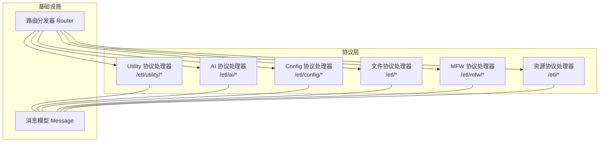
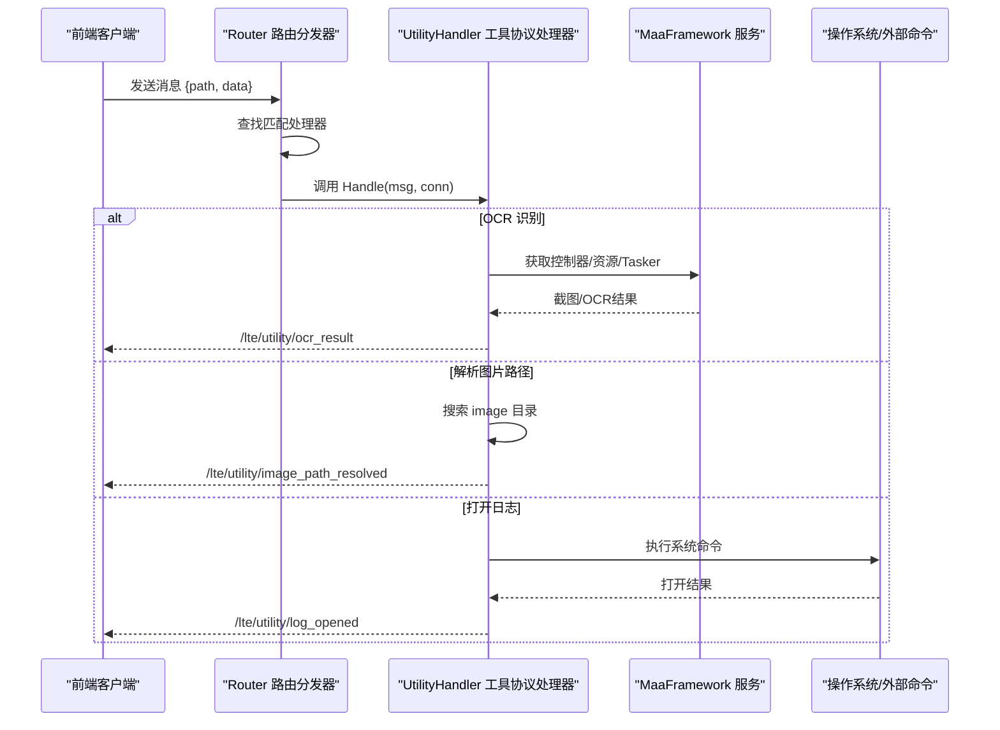
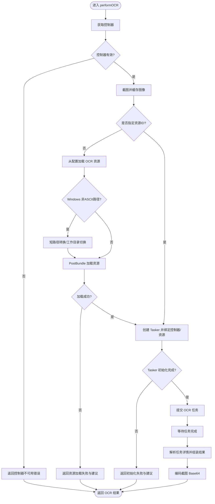
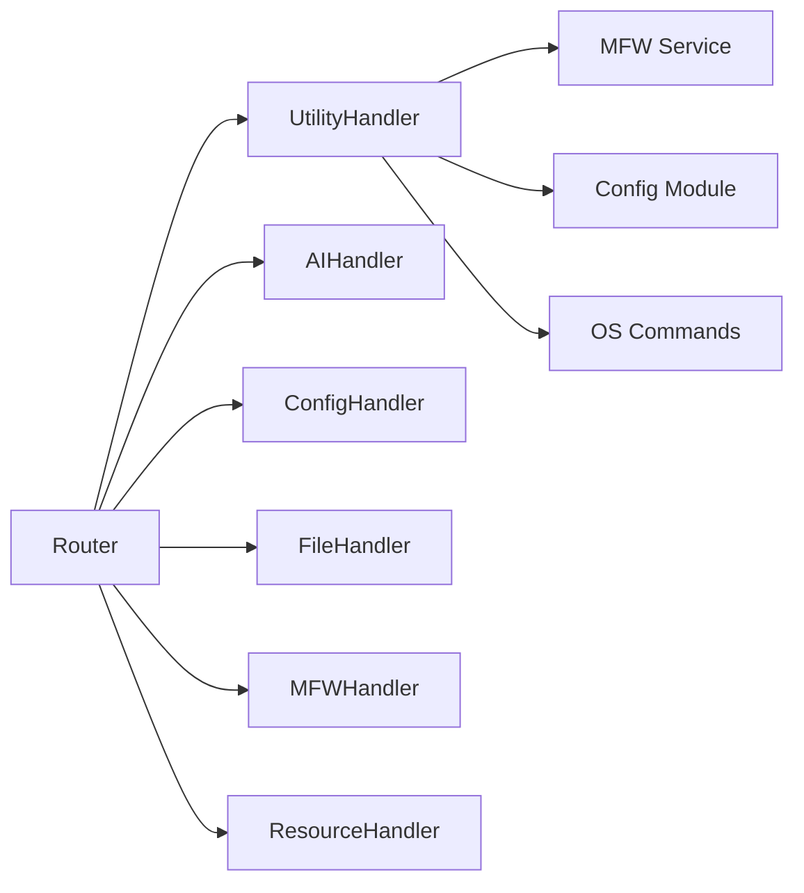

# 工具协议处理

<cite>
**本文引用的文件**
- [utility/handler.go](file://LocalBridge/internal/protocol/utility/handler.go)
- [router.go](file://LocalBridge/internal/router/router.go)
- [message.go](file://LocalBridge/pkg/models/message.go)
- [ai/handler.go](file://LocalBridge/internal/protocol/ai/handler.go)
- [config/handler.go](file://LocalBridge/internal/protocol/config/handler.go)
- [file/file_handler.go](file://LocalBridge/internal/protocol/file/file_handler.go)
- [mfw/handler.go](file://LocalBridge/internal/protocol/mfw/handler.go)
- [resource/handler.go](file://LocalBridge/internal/protocol/resource/handler.go)
</cite>

## 目录
1. [简介](#简介)
2. [项目结构](#项目结构)
3. [核心组件](#核心组件)
4. [架构总览](#架构总览)
5. [详细组件分析](#详细组件分析)
6. [依赖分析](#依赖分析)
7. [性能考虑](#性能考虑)
8. [故障排查指南](#故障排查指南)
9. [结论](#结论)
10. [附录](#附录)

## 简介
本文件聚焦 LocalBridge 中的“工具协议”（Utility Protocol），系统性梳理其设计目的、通用功能集合、接口定义、参数处理与结果返回机制，以及与系统内 MaaFramework、外部命令和第三方服务的集成方式。同时给出扩展点与自定义工具开发指南、错误处理与超时控制策略、资源清理策略，以及在系统中的典型应用场景与使用模式。

## 项目结构
工具协议位于 LocalBridge 的协议层，采用统一的路由前缀与消息模型进行交互；路由分发器负责根据消息路径选择对应处理器；消息模型提供通用的路径与数据结构。

图表来源
- [router.go:56-100](file://LocalBridge/internal/router/router.go#L56-L100)
- [utility/handler.go:40](file://LocalBridge/internal/protocol/utility/handler.go#L40)
- [ai/handler.go:32](file://LocalBridge/internal/protocol/ai/handler.go#L32)
- [config/handler.go:21](file://LocalBridge/internal/protocol/config/handler.go#L21)
- [file/file_handler.go:38](file://LocalBridge/internal/protocol/file/file_handler.go#L38)
- [mfw/handler.go:27](file://LocalBridge/internal/protocol/mfw/handler.go#L27)
- [resource/handler.go:46](file://LocalBridge/internal/protocol/resource/handler.go#L46)

章节来源
- [router.go:19-100](file://LocalBridge/internal/router/router.go#L19-L100)
- [message.go:4-7](file://LocalBridge/pkg/models/message.go#L4-L7)

## 核心组件
- 工具协议处理器（UtilityHandler）
  - 负责处理 /etl/utility/* 路由下的工具类请求，当前实现包含 OCR 识别、图片路径解析、打开日志等能力。
  - 通过路由前缀注册到 Router，由 Router 根据路径精确或前缀匹配分发。
- 路由分发器（Router）
  - 实现统一的处理器注册与消息分发逻辑，支持前缀匹配与错误回传。
- 消息模型（Message）
  - 通用的 WebSocket 消息结构，包含 path 与 data 字段，作为各协议间的数据载体。

章节来源
- [utility/handler.go:26-42](file://LocalBridge/internal/protocol/utility/handler.go#L26-L42)
- [router.go:43-100](file://LocalBridge/internal/router/router.go#L43-L100)
- [message.go:4-7](file://LocalBridge/pkg/models/message.go#L4-L7)

## 架构总览
工具协议在系统中的位置与交互如下：

图表来源
- [router.go:56-83](file://LocalBridge/internal/router/router.go#L56-L83)
- [utility/handler.go:45-123](file://LocalBridge/internal/protocol/utility/handler.go#L45-L123)
- [utility/handler.go:502-563](file://LocalBridge/internal/protocol/utility/handler.go#L502-L563)
- [utility/handler.go:647-742](file://LocalBridge/internal/protocol/utility/handler.go#L647-L742)

## 详细组件分析

### 工具协议处理器（UtilityHandler）
- 设计目的
  - 提供与系统工具链、外部命令及第三方服务协作的统一入口，覆盖 OCR 识别、资源路径解析、日志管理等常用工具能力。
- 路由前缀
  - /etl/utility/
- 主要功能
  - OCR 识别：基于 MaaFramework 的控制器与资源，执行 OCR 识别并返回文本、框位与截图。
  - 图片路径解析：在项目根目录下递归查找 image 子目录，定位指定文件并返回相对/绝对路径。
  - 打开日志：根据平台差异调用系统命令打开日志目录或文件，便于调试。
- 接口定义与参数处理
  - Handle(msg, conn)：接收 Message，解析 path 并分发至具体处理函数。
  - 参数校验：对请求数据进行类型断言与格式校验，错误时通过 sendError/sendUtilityError 返回标准错误结构。
  - ROI 参数：OCR 识别要求提供 [x, y, w, h] 的整型数组，否则返回 INVALID_ROI 错误。
- 结果返回机制
  - 成功：构造包含 success、结果数据与元信息的消息，发送至 /lte/utility/* 路径。
  - 失败：构造包含 code、message、detail 的错误消息，发送至 /error。
- 与系统工具/外部命令/第三方服务的集成
  - OCR 识别：依赖 MaaFramework 的 Controller、Resource、Tasker，涉及截图、资源加载、任务提交与结果解析。
  - 图片路径解析：基于文件系统遍历，优先返回最近修改时间的匹配项。
  - 打开日志：调用系统命令（Windows: explorer、macOS: open、Linux: xdg-open），支持选中文件或仅打开目录。
- 错误处理与资源清理
  - 统一错误封装：sendError 使用通用 LBError；sendUtilityError 使用自定义错误码与 detail。
  - 资源清理：OCR 识别中对临时 Resource 与 Tasker 进行 defer Destroy，确保资源释放。
- 扩展点与自定义工具开发指南
  - 新增路由：在 GetRoutePrefix 中声明前缀，在 Handle 中添加 case 分支。
  - 参数校验：严格进行 map[string]interface{} 断言与字段类型检查。
  - 结果标准化：遵循 /lte/{protocol}/{action}_result 的命名规范，错误遵循 /error。
  - 资源管理：对外部资源（文件、进程）使用 defer 或 finally 语义确保释放。
  - 平台差异：对跨平台行为（如路径分隔符、命令行）进行条件分支处理。

章节来源
- [utility/handler.go:26-42](file://LocalBridge/internal/protocol/utility/handler.go#L26-L42)
- [utility/handler.go:45-123](file://LocalBridge/internal/protocol/utility/handler.go#L45-L123)
- [utility/handler.go:126-335](file://LocalBridge/internal/protocol/utility/handler.go#L126-L335)
- [utility/handler.go:502-563](file://LocalBridge/internal/protocol/utility/handler.go#L502-L563)
- [utility/handler.go:647-742](file://LocalBridge/internal/protocol/utility/handler.go#L647-L742)
- [utility/handler.go:481-499](file://LocalBridge/internal/protocol/utility/handler.go#L481-L499)

### OCR 识别流程（performOCR）
- 关键步骤
  - 获取控制器与资源：若未指定资源 ID，则从配置加载 OCR 资源目录，必要时进行 Windows 非 ASCII 路径处理（短路径转换或工作目录切换）。
  - 创建 Tasker 并绑定控制器/资源：等待初始化完成，提交 OCR 任务，解析任务详情，组装结果。
  - 截图与编码：将截图编码为 data URI，便于前端显示。
- 错误与建议
  - 资源加载失败时返回带 suggestions 的 detail，指导用户检查目录结构与文件完整性。
  - Tasker 未初始化时返回结构化的错误信息，包含期望目录与必需文件清单。
- 性能与健壮性
  - 资源加载使用异步 Job 并 Wait，避免阻塞主线程。
  - 对空结果场景返回 no_content 标记，便于前端优化渲染。

图表来源
- [utility/handler.go:126-335](file://LocalBridge/internal/protocol/utility/handler.go#L126-L335)
- [utility/handler.go:472-478](file://LocalBridge/internal/protocol/utility/handler.go#L472-L478)

章节来源
- [utility/handler.go:126-335](file://LocalBridge/internal/protocol/utility/handler.go#L126-L335)
- [utility/handler.go:472-478](file://LocalBridge/internal/protocol/utility/handler.go#L472-L478)

### 图片路径解析（handleResolveImagePath）
- 行为
  - 在根目录下递归搜索所有名为 image 的子目录，定位与请求文件名匹配的最新文件，返回相对路径、绝对路径与消息。
- 错误处理
  - 未找到文件时返回明确提示；搜索过程中忽略错误目录，保证鲁棒性。
- 路径规范化
  - 统一使用正斜杠作为分隔符，提升跨平台一致性。

章节来源
- [utility/handler.go:502-563](file://LocalBridge/internal/protocol/utility/handler.go#L502-L563)
- [utility/handler.go:573-644](file://LocalBridge/internal/protocol/utility/handler.go#L573-L644)

### 打开日志（handleOpenLog）
- 行为
  - 根据配置确定日志目录，若未配置则回退到默认路径；判断 maa.log 是否存在，按平台执行不同命令打开目录或选中文件。
- 错误处理
  - 目录不存在时返回提示；命令执行失败时返回错误信息。
- 平台差异
  - Windows: explorer /select, 与 explorer
  - macOS: open -R 与 open
  - Linux: xdg-open

章节来源
- [utility/handler.go:647-742](file://LocalBridge/internal/protocol/utility/handler.go#L647-L742)

### 与其他协议的对比与协同
- 与 AI 协议（/etl/ai/*）
  - AI 协议侧重 HTTP 代理与流式传输，工具协议侧重本地工具与系统集成。
- 与 Config 协议（/etl/config/*）
  - Config 协议负责读取/设置/重载配置，工具协议在 OCR 识别中读取配置中的资源目录。
- 与文件协议（/etl/open_file, /etl/save_file...）
  - 文件协议负责文件系统读写与事件广播，工具协议在图片路径解析中使用文件系统遍历。
- 与 MFW 协议（/etl/mfw/*）
  - MFW 协议负责设备与控制器管理、任务执行等，工具协议在 OCR 识别中复用其控制器与资源。
- 与资源协议（/etl/get_image, /etl/get_images...）
  - 资源协议负责图片资源的获取与列表，工具协议在 OCR 识别中对截图进行 Base64 编码以便前端显示。

章节来源
- [ai/handler.go:32](file://LocalBridge/internal/protocol/ai/handler.go#L32)
- [config/handler.go:21](file://LocalBridge/internal/protocol/config/handler.go#L21)
- [file/file_handler.go:38](file://LocalBridge/internal/protocol/file/file_handler.go#L38)
- [mfw/handler.go:27](file://LocalBridge/internal/protocol/mfw/handler.go#L27)
- [resource/handler.go:46](file://LocalBridge/internal/protocol/resource/handler.go#L46)

## 依赖分析
- 组件耦合
  - UtilityHandler 依赖 Router 的前缀匹配机制；依赖 MFW 服务获取控制器与资源；依赖配置模块读取资源目录；依赖系统命令打开日志。
- 外部依赖
  - MaaFramework：用于控制器、资源与任务执行。
  - Go 标准库：文件系统、图像编码、命令执行等。
- 潜在循环依赖
  - 当前各协议处理器相互独立，通过 Router 进行解耦，未见循环依赖迹象。

图表来源
- [router.go:43-100](file://LocalBridge/internal/router/router.go#L43-L100)
- [utility/handler.go:16-23](file://LocalBridge/internal/protocol/utility/handler.go#L16-L23)

章节来源
- [router.go:43-100](file://LocalBridge/internal/router/router.go#L43-L100)
- [utility/handler.go:16-23](file://LocalBridge/internal/protocol/utility/handler.go#L16-L23)

## 性能考虑
- 异步与等待
  - OCR 资源加载与任务执行均使用 Job 并 Wait，避免阻塞主线程；建议在前端侧对长时间任务提供进度反馈。
- 资源管理
  - 对临时 Resource 与 Tasker 使用 defer 确保释放；Windows 非 ASCII 路径处理采用短路径或工作目录切换，减少 IO 开销。
- 文件遍历
  - 图片路径解析在 image 目录下进行，跳过子目录可减少遍历成本；按修改时间排序，优先返回最新文件。
- 图像编码
  - 截图编码为 PNG 并 Base64，注意内存占用；建议在前端侧进行懒加载与缓存。

## 故障排查指南
- OCR 识别失败
  - 检查资源目录配置与文件完整性；关注返回的 detail 中的 suggestions，逐项核对。
  - 若 Tasker 未初始化，确认 OCR 模型所在目录与必需文件是否齐全。
- 资源加载失败
  - Windows 非 ASCII 路径可能导致加载失败，尝试短路径转换或切换工作目录。
- 图片路径解析失败
  - 确认文件名大小写与扩展名；检查 image 目录结构与权限。
- 打开日志失败
  - 确认日志目录存在；检查平台命令是否可用；若文件不存在，按提示进行调试任务后再试。

章节来源
- [utility/handler.go:169-248](file://LocalBridge/internal/protocol/utility/handler.go#L169-L248)
- [utility/handler.go:280-301](file://LocalBridge/internal/protocol/utility/handler.go#L280-L301)
- [utility/handler.go:685-710](file://LocalBridge/internal/protocol/utility/handler.go#L685-L710)

## 结论
工具协议通过统一的路由与消息模型，将本地工具与系统能力（OCR、路径解析、日志管理）整合为可扩展的服务层。其设计强调参数校验、错误标准化、资源清理与跨平台兼容性，适合在此基础上持续扩展新的工具能力。建议在新增工具时遵循现有命名规范与错误处理模式，确保与系统其他协议的协同一致。

## 附录
- 典型使用模式
  - 前端发起 /etl/utility/ocr_recognize 请求，携带 controller_id、resource_id、roi 等参数；后端返回 /lte/utility/ocr_result。
  - 前端发起 /etl/utility/resolve_image_path 请求，携带 file_name；后端返回 /lte/utility/image_path_resolved。
  - 前端发起 /etl/utility/open_log 请求；后端返回 /lte/utility/log_opened。
- 扩展建议
  - 新增工具时，先在 Router 注册前缀，再在 UtilityHandler 中实现 Handle 分支与具体处理函数。
  - 对外部命令与文件系统操作增加超时控制与错误回退策略。
  - 对跨平台差异进行条件编译或运行时判断，确保行为一致。