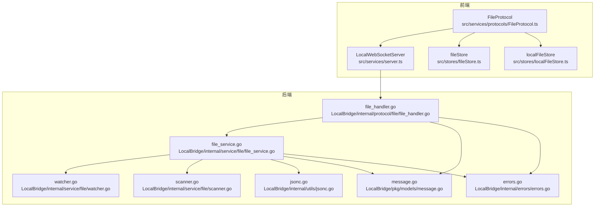
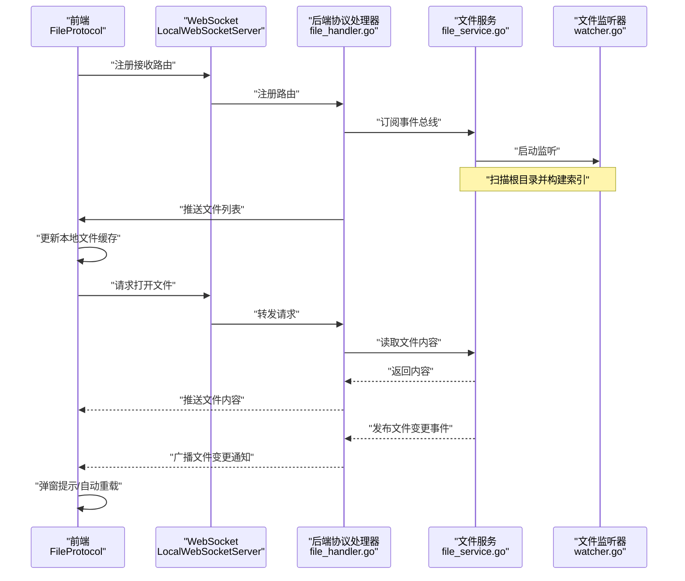
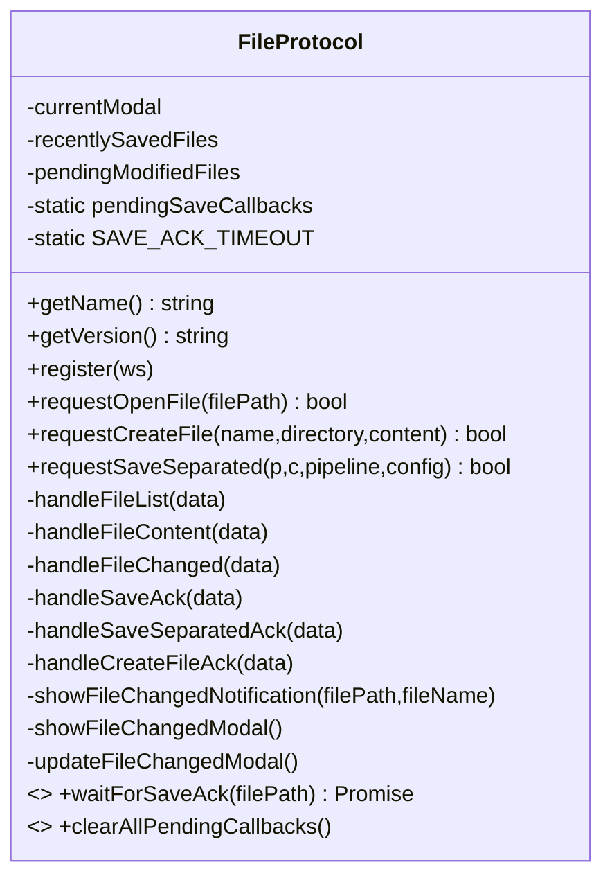
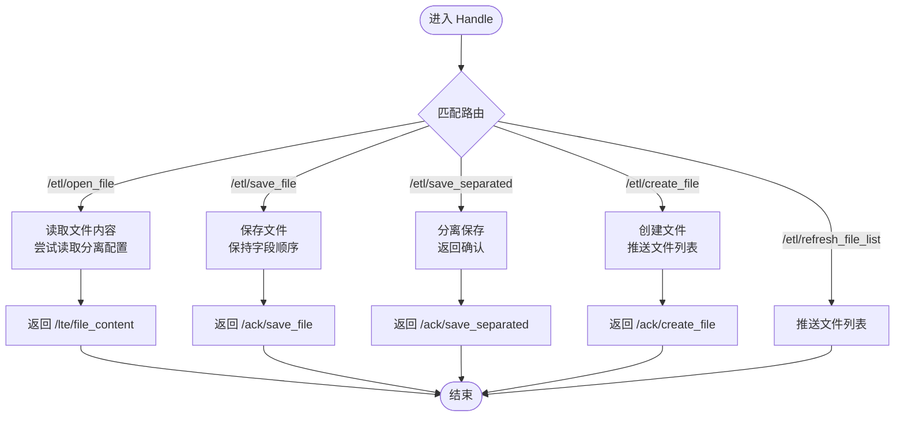
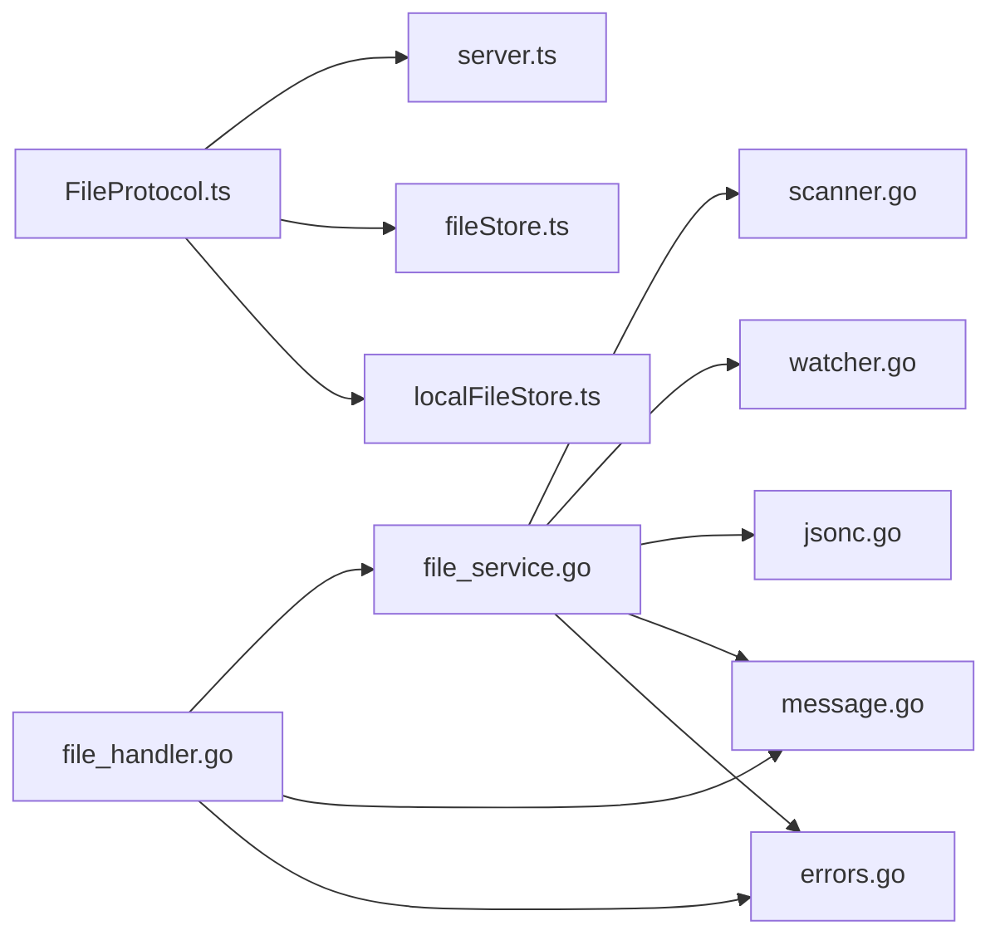

# 文件协议处理

<cite>
**本文档引用的文件**
- [FileProtocol.ts](file://src/services/protocols/FileProtocol.ts)
- [file_handler.go](file://LocalBridge/internal/protocol/file/file_handler.go)
- [file_service.go](file://LocalBridge/internal/service/file/file_service.go)
- [watcher.go](file://LocalBridge/internal/service/file/watcher.go)
- [scanner.go](file://LocalBridge/internal/service/file/scanner.go)
- [jsonc.go](file://LocalBridge/internal/utils/jsonc.go)
- [message.go](file://LocalBridge/pkg/models/message.go)
- [file.go](file://LocalBridge/pkg/models/file.go)
- [errors.go](file://LocalBridge/internal/errors/errors.go)
- [fileStore.ts](file://src/stores/fileStore.ts)
- [localFileStore.ts](file://src/stores/localFileStore.ts)
- [server.ts](file://src/services/server.ts)
- [BaseProtocol.ts](file://src/services/protocols/BaseProtocol.ts)
- [index.ts](file://src/services/protocols/index.ts)
- [index.ts](file://src/core/parser/index.ts)
</cite>

## 目录
1. [简介](#简介)
2. [项目结构](#项目结构)
3. [核心组件](#核心组件)
4. [架构总览](#架构总览)
5. [详细组件分析](#详细组件分析)
6. [依赖分析](#依赖分析)
7. [性能考虑](#性能考虑)
8. [故障排查指南](#故障排查指南)
9. [结论](#结论)
10. [附录](#附录)

## 简介
本文件协议处理模块负责在前端与本地桥接（LocalBridge）之间建立稳定的文件操作通道，涵盖文件读写、文件监控与变更通知、路径解析与安全校验、格式支持与编码处理、错误处理与异常恢复、缓存与性能优化以及并发访问控制等关键能力。通过 WebSocket 路由与消息协议，实现文件列表推送、文件内容导入、保存确认、创建文件确认以及文件变更广播等全流程闭环。

## 项目结构
文件协议处理涉及前后端两部分：
- 前端协议层：负责注册路由、接收后端推送、弹窗提示与用户交互、保存确认等待与回调清理。
- 后端协议层：负责解析请求、调用文件服务、触发事件总线、广播文件变更通知、推送文件列表。
- 文件服务层：负责扫描、监听、读写、安全校验、JSONC 解析与序列化、防抖与忽略自身写入。
- 模型与错误层：统一消息结构、错误码与错误封装。



**图表来源**
- [FileProtocol.ts:16-68](file://src/services/protocols/FileProtocol.ts#L16-L68)
- [file_handler.go:14-46](file://LocalBridge/internal/protocol/file/file_handler.go#L14-L46)
- [file_service.go:19-35](file://LocalBridge/internal/service/file/file_service.go#L19-L35)
- [watcher.go:34-41](file://LocalBridge/internal/service/file/watcher.go#L34-L41)
- [scanner.go:20-27](file://LocalBridge/internal/service/file/scanner.go#L20-L27)
- [jsonc.go:9-23](file://LocalBridge/internal/utils/jsonc.go#L9-L23)
- [message.go:3-7](file://LocalBridge/pkg/models/message.go#L3-L7)
- [errors.go:9-20](file://LocalBridge/internal/errors/errors.go#L9-L20)

**章节来源**
- [FileProtocol.ts:16-68](file://src/services/protocols/FileProtocol.ts#L16-L68)
- [file_handler.go:14-46](file://LocalBridge/internal/protocol/file/file_handler.go#L14-L46)
- [file_service.go:19-35](file://LocalBridge/internal/service/file/file_service.go#L19-L35)

## 核心组件
- 前端协议处理器：注册接收路由（文件列表、文件内容、文件变更）、发送请求路由（打开文件、创建文件、分离保存）、处理保存确认、文件变更通知弹窗与自动重载、保存确认等待与回调清理。
- 后端协议处理器：解析请求、调用文件服务、推送文件列表、广播文件变更、发送错误消息。
- 文件服务：扫描与索引、监听与防抖、读写与安全校验、JSONC 解析与序列化、忽略自身写入窗口。
- 模型与错误：统一消息结构、错误码与错误封装。
- 前端存储：文件内容与配置、本地文件列表缓存、图片缓存与请求去重。

**章节来源**
- [FileProtocol.ts:44-68](file://src/services/protocols/FileProtocol.ts#L44-L68)
- [file_handler.go:48-64](file://LocalBridge/internal/protocol/file/file_handler.go#L48-L64)
- [file_service.go:19-35](file://LocalBridge/internal/service/file/file_service.go#L19-L35)
- [message.go:3-7](file://LocalBridge/pkg/models/message.go#L3-L7)
- [errors.go:9-20](file://LocalBridge/internal/errors/errors.go#L9-L20)
- [fileStore.ts:346-375](file://src/stores/fileStore.ts#L346-L375)
- [localFileStore.ts:61-123](file://src/stores/localFileStore.ts#L61-L123)

## 架构总览
文件协议处理采用“前端协议处理器 + 后端协议处理器 + 文件服务”的分层设计，通过 WebSocket 实现双向通信。前端负责用户交互与状态管理，后端负责文件系统操作与事件广播。



**图表来源**
- [FileProtocol.ts:44-68](file://src/services/protocols/FileProtocol.ts#L44-L68)
- [file_handler.go:280-314](file://LocalBridge/internal/protocol/file/file_handler.go#L280-L314)
- [file_service.go:65-94](file://LocalBridge/internal/service/file/file_service.go#L65-L94)
- [watcher.go:62-82](file://LocalBridge/internal/service/file/watcher.go#L62-L82)

## 详细组件分析

### 前端协议处理器（FileProtocol）
职责范围：
- 注册接收路由：/lte/file_list、/lte/file_content、/lte/file_changed。
- 注册确认路由：/ack/save_file、/ack/save_separated、/ack/create_file。
- 发送请求路由：/etl/open_file、/etl/create_file、/etl/save_separated。
- 处理文件列表推送：更新本地文件缓存并提示刷新完成。
- 处理文件内容推送：打开文件、合并配置、提示打开成功或失败。
- 处理文件变更通知：根据类型执行增删改逻辑，避免自身写入干扰，支持自动重载与手动确认。
- 保存确认等待：为每个保存请求注册回调，设置超时并解析回调，断开连接时清理。
- 用户交互：弹窗提示文件变更、自动重载开关、批量重载。



**图表来源**
- [FileProtocol.ts:16-68](file://src/services/protocols/FileProtocol.ts#L16-L68)
- [FileProtocol.ts:78-141](file://src/services/protocols/FileProtocol.ts#L78-L141)
- [FileProtocol.ts:147-231](file://src/services/protocols/FileProtocol.ts#L147-L231)
- [FileProtocol.ts:237-332](file://src/services/protocols/FileProtocol.ts#L237-L332)
- [FileProtocol.ts:408-532](file://src/services/protocols/FileProtocol.ts#L408-L532)
- [FileProtocol.ts:541-579](file://src/services/protocols/FileProtocol.ts#L541-L579)

**章节来源**
- [FileProtocol.ts:44-68](file://src/services/protocols/FileProtocol.ts#L44-L68)
- [FileProtocol.ts:78-141](file://src/services/protocols/FileProtocol.ts#L78-L141)
- [FileProtocol.ts:147-231](file://src/services/protocols/FileProtocol.ts#L147-L231)
- [FileProtocol.ts:237-332](file://src/services/protocols/FileProtocol.ts#L237-L332)
- [FileProtocol.ts:408-532](file://src/services/protocols/FileProtocol.ts#L408-L532)
- [FileProtocol.ts:541-579](file://src/services/protocols/FileProtocol.ts#L541-L579)

### 后端协议处理器（file_handler.go）
职责范围：
- 路由前缀：/etl/open_file、/etl/save_file、/etl/save_separated、/etl/create_file、/etl/refresh_file_list。
- 处理打开文件：读取主文件内容，尝试读取同目录下的分离配置文件，返回文件内容与配置路径。
- 处理保存文件：支持保持字段顺序的字符串输入或 JSON 对象，返回保存确认。
- 处理分离保存：分别保存 Pipeline 与配置文件，返回双文件保存确认。
- 处理创建文件：创建文件并推送文件列表，返回创建确认。
- 订阅事件：连接建立时推送文件列表；文件变更时广播变更通知，并在必要时推送更新后的文件列表。
- 错误处理：解析数据失败、文件读写失败、权限不足等，统一转换为错误消息。



**图表来源**
- [file_handler.go:48-64](file://LocalBridge/internal/protocol/file/file_handler.go#L48-L64)
- [file_handler.go:67-137](file://LocalBridge/internal/protocol/file/file_handler.go#L67-L137)
- [file_handler.go:140-176](file://LocalBridge/internal/protocol/file/file_handler.go#L140-L176)
- [file_handler.go:178-238](file://LocalBridge/internal/protocol/file/file_handler.go#L178-L238)
- [file_handler.go:240-271](file://LocalBridge/internal/protocol/file/file_handler.go#L240-L271)
- [file_handler.go:273-277](file://LocalBridge/internal/protocol/file/file_handler.go#L273-L277)

**章节来源**
- [file_handler.go:37-46](file://LocalBridge/internal/protocol/file/file_handler.go#L37-L46)
- [file_handler.go:48-64](file://LocalBridge/internal/protocol/file/file_handler.go#L48-L64)
- [file_handler.go:67-137](file://LocalBridge/internal/protocol/file/file_handler.go#L67-L137)
- [file_handler.go:140-176](file://LocalBridge/internal/protocol/file/file_handler.go#L140-L176)
- [file_handler.go:178-238](file://LocalBridge/internal/protocol/file/file_handler.go#L178-L238)
- [file_handler.go:240-271](file://LocalBridge/internal/protocol/file/file_handler.go#L240-L271)
- [file_handler.go:273-277](file://LocalBridge/internal/protocol/file/file_handler.go#L273-L277)

### 文件服务（file_service.go）
职责范围：
- 扫描与索引：初始扫描根目录，构建文件索引，按相对路径排序。
- 监听与防抖：基于 fsnotify 监听文件系统事件，使用防抖器合并高频事件。
- 读写与安全：读取文件内容并解析 JSONC；保存文件支持保持字段顺序；路径合法性校验；忽略自身写入窗口。
- 变更处理：根据变更类型更新索引，发布事件总线事件。
- JSONC 支持：使用 hujson 标准化后解析，支持行注释、块注释与尾随逗号。

```mermaid
classDiagram
class Service {
-root
-scanner
-watcher
-fileIndex
-mu
-eventBus
-maxDepth
-maxFiles
-recentlyWrittenFiles
-selfWriteIgnoreWindow
+Start() error
+Stop()
+GetFileList() []FileInfo
+ReadFile(path) interface{}
+SaveFile(path,content,indent) error
+SaveFileWithOrder(path,content,indent,keepOrder) error
+CreateFile(dir,name,content) string
-handleFileChange(change)
-validatePath(path) error
-marshalJSON(content,indent) []byte
}
class Scanner {
-root
-exclude
-extensions
-maxDepth
-maxFiles
+ScanWithLimit() ScanResult
+ScanSingle(absPath) *File
-hasValidExtension(path) bool
-parseFileNodes(path) (nodes,prefix)
}
class Watcher {
-watcher
-root
-extensions
-handler
-debouncer
+Start() error
+Stop()
+ClearDebounce(filePath)
}
Service --> Scanner : "使用"
Service --> Watcher : "使用"
```

**图表来源**
- [file_service.go:19-35](file://LocalBridge/internal/service/file/file_service.go#L19-L35)
- [scanner.go:20-27](file://LocalBridge/internal/service/file/scanner.go#L20-L27)
- [watcher.go:34-41](file://LocalBridge/internal/service/file/watcher.go#L34-L41)

**章节来源**
- [file_service.go:37-62](file://LocalBridge/internal/service/file/file_service.go#L37-L62)
- [file_service.go:64-94](file://LocalBridge/internal/service/file/file_service.go#L64-L94)
- [file_service.go:104-120](file://LocalBridge/internal/service/file/file_service.go#L104-L120)
- [file_service.go:122-156](file://LocalBridge/internal/service/file/file_service.go#L122-L156)
- [file_service.go:158-215](file://LocalBridge/internal/service/file/file_service.go#L158-L215)
- [file_service.go:237-296](file://LocalBridge/internal/service/file/file_service.go#L237-L296)
- [file_service.go:298-388](file://LocalBridge/internal/service/file/file_service.go#L298-L388)
- [file_service.go:390-405](file://LocalBridge/internal/service/file/file_service.go#L390-L405)
- [scanner.go:58-147](file://LocalBridge/internal/service/file/scanner.go#L58-L147)
- [scanner.go:176-210](file://LocalBridge/internal/service/file/scanner.go#L176-L210)
- [scanner.go:212-254](file://LocalBridge/internal/service/file/scanner.go#L212-L254)
- [watcher.go:43-59](file://LocalBridge/internal/service/file/watcher.go#L43-L59)
- [watcher.go:61-92](file://LocalBridge/internal/service/file/watcher.go#L61-L92)
- [watcher.go:113-191](file://LocalBridge/internal/service/file/watcher.go#L113-L191)
- [watcher.go:204-261](file://LocalBridge/internal/service/file/watcher.go#L204-L261)

### JSONC 解析与编码（jsonc.go）
- 使用 hujson 标准化 JSONC，再交由标准 JSON 解析器解析，支持行注释、块注释与尾随逗号。
- 提供有效性检查函数。

**章节来源**
- [jsonc.go:9-23](file://LocalBridge/internal/utils/jsonc.go#L9-L23)

### 模型与错误（message.go, errors.go）
- 消息模型：Message、FileInfo、FileListData、FileContentData、FileChangedData、各类请求与确认数据结构。
- 错误模型：统一错误码与错误封装，便于前端展示与日志追踪。

**章节来源**
- [message.go:3-7](file://LocalBridge/pkg/models/message.go#L3-L7)
- [message.go:16-29](file://LocalBridge/pkg/models/message.go#L16-L29)
- [message.go:31-44](file://LocalBridge/pkg/models/message.go#L31-L44)
- [message.go:46-75](file://LocalBridge/pkg/models/message.go#L46-L75)
- [message.go:77-94](file://LocalBridge/pkg/models/message.go#L77-L94)
- [errors.go:9-20](file://LocalBridge/internal/errors/errors.go#L9-L20)
- [errors.go:75-141](file://LocalBridge/internal/errors/errors.go#L75-L141)

### 前端存储（fileStore.ts, localFileStore.ts）
- fileStore：管理打开的文件集合、当前文件、节点边数据、文件配置（路径、分离配置路径、是否外部修改、同步时间等），提供打开/保存/重载等方法。
- localFileStore：管理本地文件列表缓存（根路径、文件列表、最后更新时间、刷新状态、资源包与图片缓存等），提供增删改查与批量操作。

**章节来源**
- [fileStore.ts:346-375](file://src/stores/fileStore.ts#L346-L375)
- [fileStore.ts:573-661](file://src/stores/fileStore.ts#L573-L661)
- [fileStore.ts:663-800](file://src/stores/fileStore.ts#L663-L800)
- [localFileStore.ts:61-123](file://src/stores/localFileStore.ts#L61-L123)
- [localFileStore.ts:129-339](file://src/stores/localFileStore.ts#L129-L339)

### WebSocket 与协议注册（server.ts, BaseProtocol.ts, index.ts）
- LocalWebSocketServer：管理连接生命周期、路由注册与消息分发。
- BaseProtocol：协议基类，定义协议名称、版本与注册接口。
- 协议注册：在应用启动时注册各协议处理器。

**章节来源**
- [server.ts:22-343](file://src/services/server.ts#L22-L343)
- [server.ts:361-387](file://src/services/server.ts#L361-L387)
- [BaseProtocol.ts:7-39](file://src/services/protocols/BaseProtocol.ts#L7-L39)
- [index.ts:1-5](file://src/services/protocols/index.ts#L1-L5)

## 依赖分析
- 前端 FileProtocol 依赖 LocalWebSocketServer、fileStore、localFileStore。
- 后端 file_handler 依赖 file_service、eventbus、server、models。
- file_service 依赖 scanner、watcher、utils、errors、models。
- watcher 依赖 fsnotify 与自定义防抖器。
- scanner 依赖 utils 与 models。
- 错误与消息模型在两端共享。



**图表来源**
- [FileProtocol.ts:1-11](file://src/services/protocols/FileProtocol.ts#L1-L11)
- [server.ts:1-18](file://src/services/server.ts#L1-L18)
- [fileStore.ts:1-24](file://src/stores/fileStore.ts#L1-L24)
- [localFileStore.ts](file://src/stores/localFileStore.ts#L1)
- [file_handler.go:1-12](file://LocalBridge/internal/protocol/file/file_handler.go#L1-L12)
- [file_service.go:1-17](file://LocalBridge/internal/service/file/file_service.go#L1-L17)
- [scanner.go:1-12](file://LocalBridge/internal/service/file/scanner.go#L1-L12)
- [watcher.go:1-11](file://LocalBridge/internal/service/file/watcher.go#L1-L11)
- [jsonc.go:1-7](file://LocalBridge/internal/utils/jsonc.go#L1-L7)
- [message.go:1-7](file://LocalBridge/pkg/models/message.go#L1-L7)
- [errors.go:1-7](file://LocalBridge/internal/errors/errors.go#L1-L7)

**章节来源**
- [FileProtocol.ts:1-11](file://src/services/protocols/FileProtocol.ts#L1-L11)
- [server.ts:1-18](file://src/services/server.ts#L1-L18)
- [file_handler.go:1-12](file://LocalBridge/internal/protocol/file/file_handler.go#L1-L12)
- [file_service.go:1-17](file://LocalBridge/internal/service/file/file_service.go#L1-L17)

## 性能考虑
- 防抖与忽略自身写入：文件监听器对高频事件进行防抖，文件服务记录最近写入时间并在窗口期内忽略自身触发的变更，降低重复处理与广播频率。
- 扫描限制：扫描器支持最大深度与最大文件数量限制，避免大规模目录导致的性能问题。
- 缓存与增量更新：前端 localFileStore 提供增量添加/删除/更新文件的能力，减少不必要的渲染与状态更新。
- 字段顺序保持：保存时支持保持字段顺序的字符串输入，避免不必要的 JSON 重排，提升一致性与性能。
- 并发访问控制：文件服务内部使用读写锁保护文件索引，监听器与写入操作互斥，确保数据一致性。

**章节来源**
- [watcher.go:204-261](file://LocalBridge/internal/service/file/watcher.go#L204-L261)
- [file_service.go:30-35](file://LocalBridge/internal/service/file/file_service.go#L30-L35)
- [file_service.go:164-190](file://LocalBridge/internal/service/file/file_service.go#L164-L190)
- [scanner.go:40-48](file://LocalBridge/internal/service/file/scanner.go#L40-L48)
- [localFileStore.ts:158-173](file://src/stores/localFileStore.ts#L158-L173)
- [fileStore.ts:663-800](file://src/stores/fileStore.ts#L663-L800)

## 故障排查指南
常见问题与处理：
- 文件读取失败：检查路径合法性与权限，确认文件存在且可读；查看错误码 FILE_READ_ERROR。
- 文件写入失败：检查磁盘权限与空间，确认路径在根目录范围内；查看错误码 FILE_WRITE_ERROR。
- JSON 格式无效：确认 JSONC 合法性，使用 JSONC 解析工具验证；查看错误码 INVALID_JSON。
- 保存确认超时：前端保存确认等待超时（默认 10 秒），检查后端是否正确返回确认；必要时清理等待中的回调。
- 文件变更通知风暴：检查防抖与忽略窗口配置，确认无循环写入；查看监听器日志。
- 路径非法或权限不足：确认路径在根目录内，避免越权访问；查看错误码 PERMISSION_DENIED。

**章节来源**
- [errors.go:75-141](file://LocalBridge/internal/errors/errors.go#L75-L141)
- [FileProtocol.ts:541-579](file://src/services/protocols/FileProtocol.ts#L541-L579)
- [file_handler.go:347-357](file://LocalBridge/internal/protocol/file/file_handler.go#L347-L357)
- [file_service.go:390-405](file://LocalBridge/internal/service/file/file_service.go#L390-L405)

## 结论
文件协议处理模块通过清晰的前后端分层与完善的错误处理机制，实现了文件读写、监控与变更通知的高效协同。其在路径安全、JSONC 支持、字段顺序保持、防抖与忽略自身写入等方面的设计，有效提升了系统的稳定性与用户体验。结合前端缓存与并发控制策略，整体具备良好的性能表现与可维护性。

## 附录
- 协议版本与注册：应用启动时统一注册各协议处理器，确保路由与消息分发正常。
- 解析与转换：前端通过解析器模块实现 Pipeline 与 Flow 的互转，支持分离模式下的配置合并与导出。

**章节来源**
- [server.ts:361-387](file://src/services/server.ts#L361-L387)
- [index.ts:19-26](file://src/core/parser/index.ts#L19-L26)