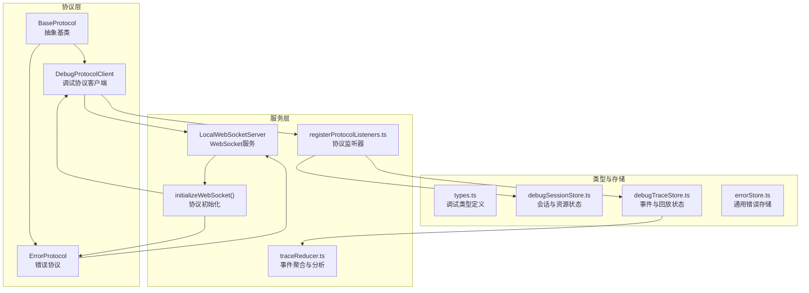
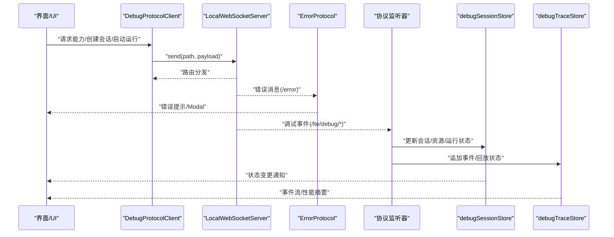
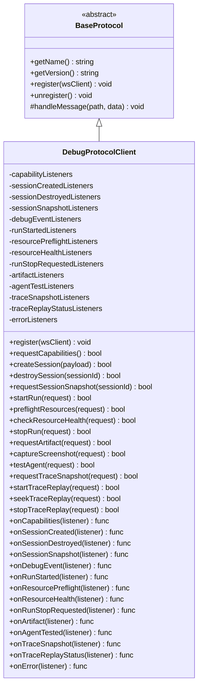
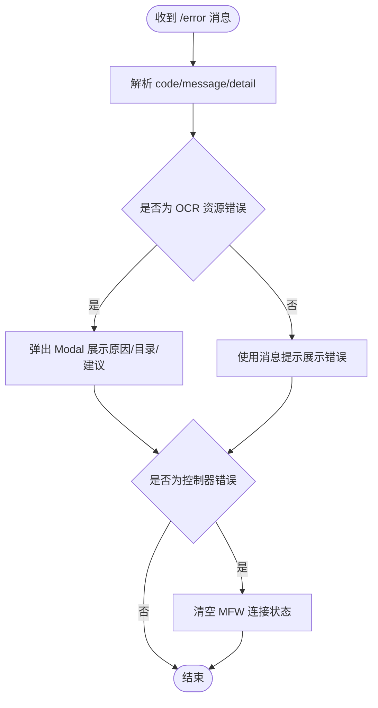
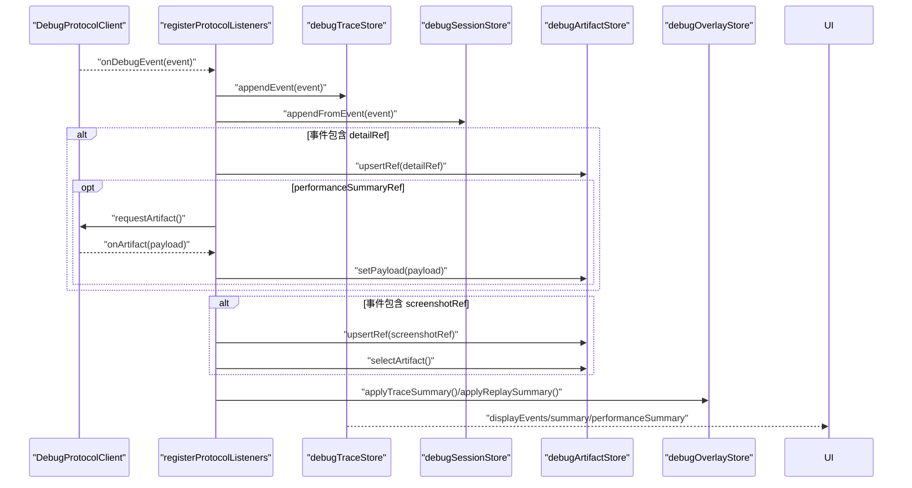
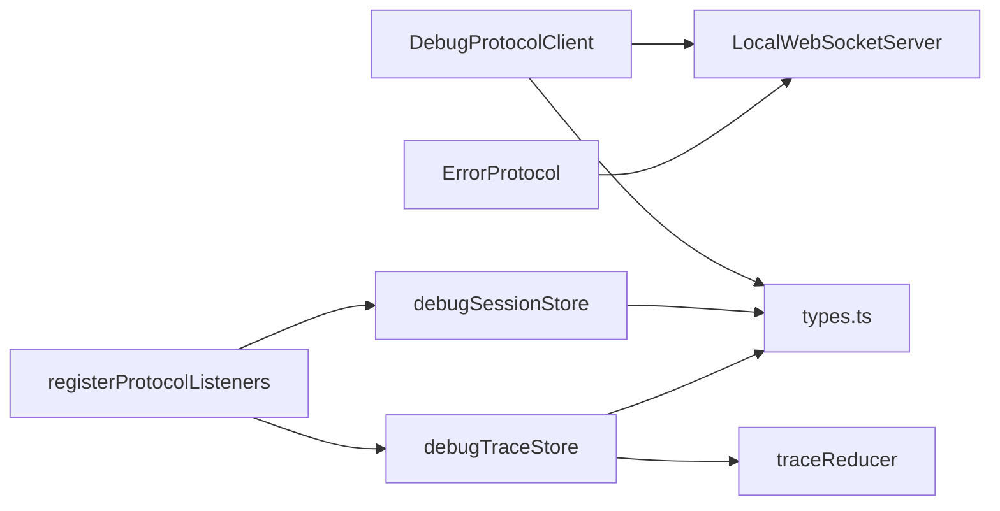

# 调试协议处理

<cite>
**本文档引用的文件**
- [DebugProtocolClient.ts](file://src/services/protocols/DebugProtocolClient.ts)
- [ErrorProtocol.ts](file://src/services/protocols/ErrorProtocol.ts)
- [types.ts](file://src/features/debug/types.ts)
- [debugSessionStore.ts](file://src/stores/debugSessionStore.ts)
- [debugTraceStore.ts](file://src/stores/debugTraceStore.ts)
- [server.ts](file://src/services/server.ts)
- [BaseProtocol.ts](file://src/services/protocols/BaseProtocol.ts)
- [registerProtocolListeners.ts](file://src/features/debug/registerProtocolListeners.ts)
- [traceReducer.ts](file://src/features/debug/traceReducer.ts)
- [errorStore.ts](file://src/stores/errorStore.ts)
</cite>

## 目录
1. [引言](#引言)
2. [项目结构](#项目结构)
3. [核心组件](#核心组件)
4. [架构总览](#架构总览)
5. [详细组件分析](#详细组件分析)
6. [依赖关系分析](#依赖关系分析)
7. [性能考虑](#性能考虑)
8. [故障排除指南](#故障排除指南)
9. [结论](#结论)
10. [附录](#附录)

## 引言
本文件面向开发与运维人员，系统性阐述本地调试协议（DebugProtocolClient）的设计与实现，以及错误协议（ErrorProtocol）的错误收集、分类与报告机制。文档覆盖调试信息的格式化、过滤与输出控制策略，调试协议与日志系统的集成方式，调试数据的持久化与可视化存储，性能分析与资源使用统计，以及远程调试、断点与变量监视等高级能力的可扩展设计。同时给出开发与生产环境的应用差异与配置要点。

## 项目结构
围绕调试协议的关键文件组织如下：
- 协议层：BaseProtocol 抽象基类；DebugProtocolClient 作为前端调试协议客户端；ErrorProtocol 用于统一错误处理。
- 类型定义：debug/types.ts 定义了调试事件、会话、运行、资源健康、追踪回放、性能摘要等完整类型体系。
- 存储层：debugSessionStore.ts 管理调试会话与资源检查状态；debugTraceStore.ts 管理事件流与回放状态。
- 服务层：LocalWebSocketServer 提供 WebSocket 通道与路由注册；initializeWebSocket 完成协议初始化。
- 监听器：registerProtocolListeners.ts 将协议事件映射到各 Store，驱动 UI 展示与交互。
- 视图计算：traceReducer.ts 提供事件聚合、节点重放、诊断与工件索引等分析能力。

图表来源
- [BaseProtocol.ts:1-40](file://src/services/protocols/BaseProtocol.ts#L1-L40)
- [DebugProtocolClient.ts:1-353](file://src/services/protocols/DebugProtocolClient.ts#L1-L353)
- [ErrorProtocol.ts:1-121](file://src/services/protocols/ErrorProtocol.ts#L1-L121)
- [types.ts:1-481](file://src/features/debug/types.ts#L1-L481)
- [debugSessionStore.ts:1-260](file://src/stores/debugSessionStore.ts#L1-L260)
- [debugTraceStore.ts:1-451](file://src/stores/debugTraceStore.ts#L1-L451)
- [server.ts:1-388](file://src/services/server.ts#L1-L388)
- [registerProtocolListeners.ts:1-189](file://src/features/debug/registerProtocolListeners.ts#L1-L189)
- [traceReducer.ts:1-570](file://src/features/debug/traceReducer.ts#L1-L570)

章节来源
- [server.ts:1-388](file://src/services/server.ts#L1-L388)
- [BaseProtocol.ts:1-40](file://src/services/protocols/BaseProtocol.ts#L1-L40)

## 核心组件
- DebugProtocolClient：负责调试协议的消息发送与接收，注册多条调试路由（会话、事件、运行、资源健康、回放、工件等），并提供对应的 onXxx 回调订阅接口。
- ErrorProtocol：统一处理后端错误消息，按错误码分类展示，并在特定场景下弹出 Modal 以提供更详细的排障信息。
- LocalWebSocketServer：封装 WebSocket 连接、握手、路由注册与消息分发，确保协议版本一致性与连接状态管理。
- 调试类型体系：types.ts 定义了调试事件、会话快照、运行模式、资源健康、追踪回放、性能摘要、工件编码等完整类型，为协议与 UI 提供强类型支撑。
- 调试存储：debugSessionStore.ts 管理会话生命周期、资源预检/健康检查状态、运行状态与错误；debugTraceStore.ts 管理事件流、回放游标、性能摘要与选择态。
- 监听器与视图：registerProtocolListeners.ts 将协议事件映射到 Store，触发 UI 更新；traceReducer.ts 提供事件聚合、节点重放与诊断统计。

章节来源
- [DebugProtocolClient.ts:31-353](file://src/services/protocols/DebugProtocolClient.ts#L31-L353)
- [ErrorProtocol.ts:11-121](file://src/services/protocols/ErrorProtocol.ts#L11-L121)
- [server.ts:22-343](file://src/services/server.ts#L22-L343)
- [types.ts:120-481](file://src/features/debug/types.ts#L120-L481)
- [debugSessionStore.ts:36-260](file://src/stores/debugSessionStore.ts#L36-L260)
- [debugTraceStore.ts:27-451](file://src/stores/debugTraceStore.ts#L27-L451)
- [registerProtocolListeners.ts:15-154](file://src/features/debug/registerProtocolListeners.ts#L15-L154)
- [traceReducer.ts:184-352](file://src/features/debug/traceReducer.ts#L184-L352)

## 架构总览
调试协议采用“协议客户端 + WebSocket 服务 + 多 Store 状态”的分层架构。前端通过 DebugProtocolClient 向本地服务发送调试请求，后端通过 WebSocket 推送调试事件与结果；协议监听器将事件写入对应 Store，UI 通过 Store 的状态进行渲染与交互。

图表来源
- [DebugProtocolClient.ts:77-121](file://src/services/protocols/DebugProtocolClient.ts#L77-L121)
- [ErrorProtocol.ts:20-25](file://src/services/protocols/ErrorProtocol.ts#L20-L25)
- [server.ts:108-184](file://src/services/server.ts#L108-L184)
- [registerProtocolListeners.ts:21-153](file://src/features/debug/registerProtocolListeners.ts#L21-L153)
- [debugSessionStore.ts:82-260](file://src/stores/debugSessionStore.ts#L82-L260)
- [debugTraceStore.ts:270-451](file://src/stores/debugTraceStore.ts#L270-L451)

## 详细组件分析

### DebugProtocolClient 组件分析
- 路由注册：在 register 中为调试相关路径注册处理器，包括能力清单、会话生命周期、事件流、运行控制、资源检查、回放控制、工件获取、代理测试、错误推送等。
- 请求方法：提供能力查询、会话创建/销毁、会话快照、运行启动/停止、资源预检/健康检查、工件获取、截图捕获、代理测试、追踪快照与回放控制等方法。
- 订阅接口：为每类事件提供 onXxx 回调注册，返回取消函数，便于组件卸载时清理。
- 错误处理：内部 send 方法在未初始化时记录错误；后端错误通过 /lte/debug/error 路由推送到 onError 订阅者。

图表来源
- [BaseProtocol.ts:7-39](file://src/services/protocols/BaseProtocol.ts#L7-L39)
- [DebugProtocolClient.ts:31-353](file://src/services/protocols/DebugProtocolClient.ts#L31-L353)

章节来源
- [DebugProtocolClient.ts:31-353](file://src/services/protocols/DebugProtocolClient.ts#L31-L353)

### ErrorProtocol 组件分析
- 路由注册：注册 /error 路由，统一接收后端错误消息。
- 错误分类：根据错误码映射到用户可读提示，支持文件、MFW（MaaFramework）等类别。
- 用户反馈：非 OCR 场景使用消息提示；OCR 资源加载失败场景弹出 Modal，展示原因、资源目录与排查建议。
- 状态联动：当控制器相关错误发生时，清空连接状态，避免后续误操作。

图表来源
- [ErrorProtocol.ts:20-79](file://src/services/protocols/ErrorProtocol.ts#L20-L79)
- [ErrorProtocol.ts:84-119](file://src/services/protocols/ErrorProtocol.ts#L84-L119)

章节来源
- [ErrorProtocol.ts:11-121](file://src/services/protocols/ErrorProtocol.ts#L11-L121)

### 调试事件流与回放序列
协议监听器将调试事件写入 debugTraceStore，并根据事件类型触发工件引用更新、性能摘要请求与 Overlay 叠加。traceReducer 对事件进行聚合，生成节点重放、诊断与工件索引，支持实时与回放两种视角。

图表来源
- [registerProtocolListeners.ts:59-122](file://src/features/debug/registerProtocolListeners.ts#L59-L122)
- [debugTraceStore.ts:270-451](file://src/stores/debugTraceStore.ts#L270-L451)
- [traceReducer.ts:184-352](file://src/features/debug/traceReducer.ts#L184-L352)

章节来源
- [registerProtocolListeners.ts:15-154](file://src/features/debug/registerProtocolListeners.ts#L15-L154)
- [debugTraceStore.ts:27-451](file://src/stores/debugTraceStore.ts#L27-L451)
- [traceReducer.ts:1-570](file://src/features/debug/traceReducer.ts#L1-L570)

### 调试信息格式化、过滤与输出控制
- 格式化：事件包含时间戳、会话/运行标识、节点信息、阶段/状态、详情与截图引用等，统一由 types.ts 定义。
- 过滤：支持按节点 ID、运行 ID、状态、事件类型、工件存在性、排序方式与去重等条件过滤。
- 输出控制：traceReducer 提供实时摘要与回放摘要两套视图；UI 可按会话选择、最新会话聚焦、全选等进行展示控制。

章节来源
- [types.ts:441-468](file://src/features/debug/types.ts#L441-L468)
- [debugTraceStore.ts:188-268](file://src/stores/debugTraceStore.ts#L188-L268)
- [traceReducer.ts:184-352](file://src/features/debug/traceReducer.ts#L184-L352)

### 调试协议与日志系统集成及持久化
- 集成：LocalWebSocketServer 在握手失败时提示版本不匹配；连接超时与错误时通过通知与弹窗提示，保证可观测性。
- 持久化：事件与工件引用写入 Store，UI 可导出/保存关键视图；性能摘要与诊断信息可用于离线分析。

章节来源
- [server.ts:40-66](file://src/services/server.ts#L40-L66)
- [server.ts:127-255](file://src/services/server.ts#L127-L255)
- [debugTraceStore.ts:310-336](file://src/stores/debugTraceStore.ts#L310-L336)

### 性能分析、内存监控与资源统计
- 性能摘要：事件中包含识别/动作/等待冻结/截图等计数与节点统计，traceReducer 生成 DebugPerformanceSummary，debugTraceStore 支持选择会话查看。
- 资源统计：资源预检/健康检查返回 ready/failed 与诊断列表，debugSessionStore 提供状态机与错误提取。
- 内存与事件去重：debugTraceStore 使用事件索引避免重复写入，降低内存占用。

章节来源
- [types.ts:354-391](file://src/features/debug/types.ts#L354-L391)
- [debugTraceStore.ts:270-451](file://src/stores/debugTraceStore.ts#L270-L451)
- [debugSessionStore.ts:166-247](file://src/stores/debugSessionStore.ts#L166-L247)

### 远程调试、断点与变量监视
- 远程调试：DebugProtocolClient 支持代理测试与资源健康检查，结合控制器类型与传输方式（identifier/tcp）进行远端连通性验证。
- 断点与变量：协议类型中包含节点执行事件、诊断与工件引用，配合 UI 的节点执行面板与工件查看，实现“断点”观察点与变量（工件内容）查看。
- 可扩展性：协议已预留 trace-replay、performance-summary、agent-run-profile 等特性位，便于后续增强。

章节来源
- [types.ts:120-143](file://src/features/debug/types.ts#L120-L143)
- [types.ts:399-411](file://src/features/debug/types.ts#L399-L411)
- [types.ts:441-468](file://src/features/debug/types.ts#L441-L468)

### 开发与生产环境差异与配置
- 版本协商：握手阶段严格校验协议版本，避免前后端不兼容导致的调试中断。
- 连接健壮性：开发环境可容忍短暂超时与重连；生产环境建议固定端口与健康检查，减少意外断开。
- 错误提示：生产环境应避免泄露敏感细节，ErrorProtocol 已内置错误码映射与 Modal 展示策略。

章节来源
- [server.ts:20-20](file://src/services/server.ts#L20-L20)
- [server.ts:42-66](file://src/services/server.ts#L42-L66)
- [ErrorProtocol.ts:31-67](file://src/services/protocols/ErrorProtocol.ts#L31-L67)

## 依赖关系分析
- 协议依赖：DebugProtocolClient 依赖 LocalWebSocketServer 的 send 能力；ErrorProtocol 依赖系统消息提示与 Modal 组件。
- 类型依赖：types.ts 为所有调试相关模块提供统一类型，确保协议与 Store 的一致性。
- 状态依赖：registerProtocolListeners 将协议事件映射到 debugSessionStore 与 debugTraceStore，形成“事件 -> Store -> UI”的单向数据流。

图表来源
- [DebugProtocolClient.ts:77-121](file://src/services/protocols/DebugProtocolClient.ts#L77-L121)
- [ErrorProtocol.ts:20-25](file://src/services/protocols/ErrorProtocol.ts#L20-L25)
- [registerProtocolListeners.ts:21-153](file://src/features/debug/registerProtocolListeners.ts#L21-L153)
- [debugSessionStore.ts:36-80](file://src/stores/debugSessionStore.ts#L36-L80)
- [debugTraceStore.ts:27-53](file://src/stores/debugTraceStore.ts#L27-L53)
- [types.ts:120-481](file://src/features/debug/types.ts#L120-L481)

章节来源
- [server.ts:345-387](file://src/services/server.ts#L345-L387)
- [registerProtocolListeners.ts:15-154](file://src/features/debug/registerProtocolListeners.ts#L15-L154)

## 性能考虑
- 事件聚合：traceReducer 对事件进行增量聚合，避免每次渲染都重新计算，提升大事件流下的 UI 响应。
- 去重与索引：debugTraceStore 使用事件键索引避免重复写入，降低内存与计算压力。
- 回放优化：回放仅对游标前事件进行裁剪与聚合，减少不必要的数据处理。
- 连接稳定性：LocalWebSocketServer 提供连接超时与错误提示，减少无效重试带来的资源浪费。

章节来源
- [traceReducer.ts:184-352](file://src/features/debug/traceReducer.ts#L184-L352)
- [debugTraceStore.ts:281-308](file://src/stores/debugTraceStore.ts#L281-L308)
- [server.ts:127-255](file://src/services/server.ts#L127-L255)

## 故障排除指南
- 连接失败/超时：检查本地服务是否启动、端口是否被占用；查看通知与弹窗提示，必要时参考部署文档。
- 协议版本不匹配：前端与后端协议版本需一致，握手失败时会明确提示所需版本与当前版本。
- 控制器错误：当出现控制器未找到/未连接/连接失败时，自动清空连接状态，避免后续误用。
- OCR 资源加载失败：弹出 Modal 展示原因、资源目录与排查建议，优先检查资源路径与权限。
- 事件丢失/重复：确认 WebSocket 连接状态与路由注册；Store 层已内置去重逻辑，若仍异常可重置 Trace。

章节来源
- [server.ts:42-66](file://src/services/server.ts#L42-L66)
- [server.ts:127-255](file://src/services/server.ts#L127-L255)
- [ErrorProtocol.ts:69-78](file://src/services/protocols/ErrorProtocol.ts#L69-L78)
- [ErrorProtocol.ts:84-119](file://src/services/protocols/ErrorProtocol.ts#L84-L119)
- [debugTraceStore.ts:281-308](file://src/stores/debugTraceStore.ts#L281-L308)

## 结论
本调试协议体系以强类型定义为基础，通过协议客户端与 WebSocket 服务实现前后端协同，借助 Store 与监听器完成事件到 UI 的闭环。ErrorProtocol 提供统一错误体验，traceReducer 提供强大的事件聚合与回放能力。整体架构具备良好的扩展性与可维护性，既满足开发期的高可视性调试，也兼顾生产环境的稳定性与可观测性。

## 附录
- 关键类型速览：调试事件、会话快照、运行模式、资源健康、追踪回放、性能摘要、工件编码等均在 types.ts 中定义，建议在新增功能时遵循现有命名与结构。
- Store 状态机：debugSessionStore 与 debugTraceStore 提供清晰的状态流转与错误处理，便于在 UI 中进行条件渲染与交互控制。

章节来源
- [types.ts:120-481](file://src/features/debug/types.ts#L120-L481)
- [debugSessionStore.ts:36-260](file://src/stores/debugSessionStore.ts#L36-L260)
- [debugTraceStore.ts:27-451](file://src/stores/debugTraceStore.ts#L27-L451)