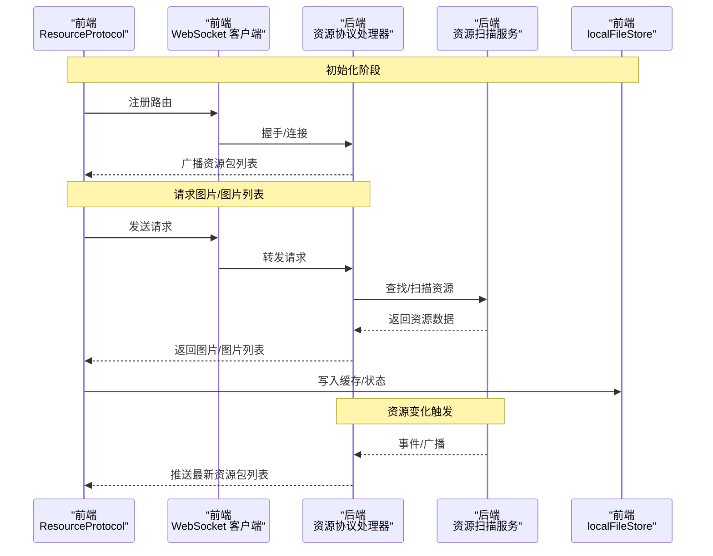
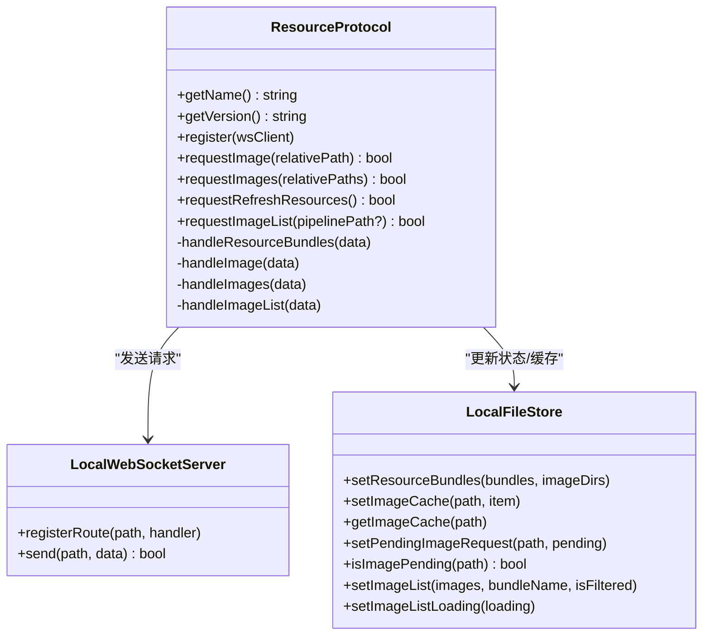
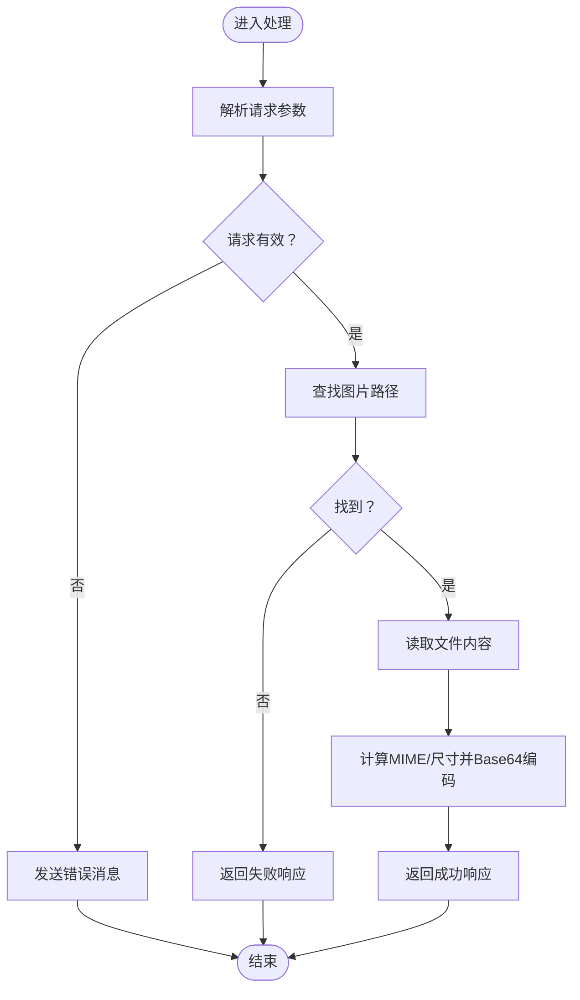
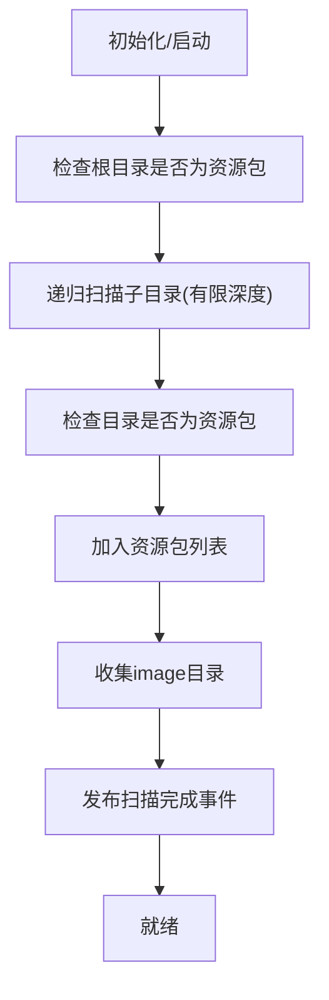
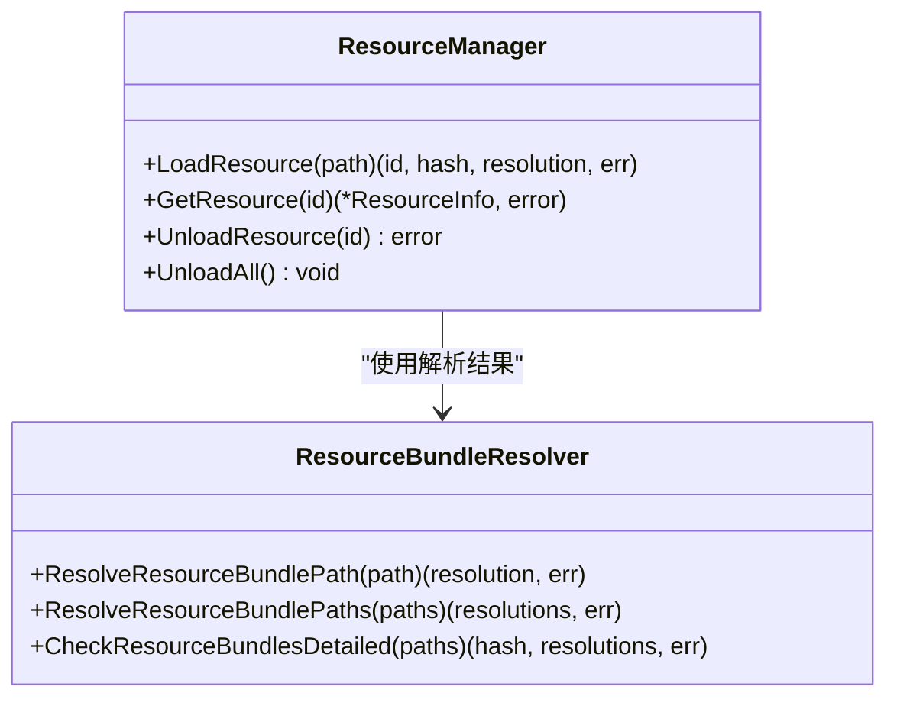
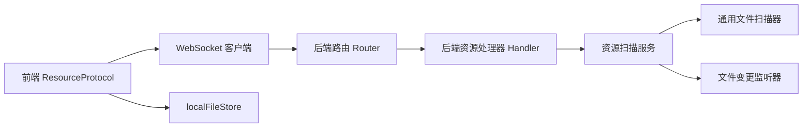

# 资源协议处理

<cite>
**本文档引用的文件**
- [ResourceProtocol.ts](file://src/services/protocols/ResourceProtocol.ts)
- [handler.go](file://LocalBridge/internal/protocol/resource/handler.go)
- [resource_service.go](file://LocalBridge/internal/service/resource/resource_service.go)
- [resource_manager.go](file://LocalBridge/internal/mfw/resource_manager.go)
- [resource_bundle_resolver.go](file://LocalBridge/internal/mfw/resource_bundle_resolver.go)
- [resource.go](file://LocalBridge/pkg/models/resource.go)
- [scanner.go](file://LocalBridge/internal/service/file/scanner.go)
- [watcher.go](file://LocalBridge/internal/service/file/watcher.go)
- [localFileStore.ts](file://src/stores/localFileStore.ts)
- [router.go](file://LocalBridge/internal/router/router.go)
- [server.ts](file://src/services/server.ts)
</cite>

## 目录
1. [简介](#简介)
2. [项目结构](#项目结构)
3. [核心组件](#核心组件)
4. [架构总览](#架构总览)
5. [详细组件分析](#详细组件分析)
6. [依赖关系分析](#依赖关系分析)
7. [性能考虑](#性能考虑)
8. [故障排查指南](#故障排查指南)
9. [结论](#结论)

## 简介
本文件聚焦于资源协议处理的技术实现，围绕 ResourceProtocol 的资源管理与资源文件处理机制展开，涵盖资源扫描、索引建立、资源发现、监控与变更检测、自动更新、路径解析、依赖关系管理、版本控制策略、缓存与预加载/懒加载优化、以及与文件系统/网络存储/云服务的集成方式。文档基于仓库中的前端协议实现、后端处理器与服务、模型定义及前端状态管理进行系统性梳理，并提供可视化图示帮助理解。

## 项目结构
资源协议处理涉及前后端协作：前端通过 WebSocket 与本地服务通信，后端负责资源扫描、打包、推送与响应；前端负责缓存、请求去重、UI 展示与交互。

```mermaid
graph TB
subgraph "前端"
RP["ResourceProtocol.ts<br/>前端资源协议"]
LFS["localFileStore.ts<br/>本地文件状态"]
WS["server.ts<br/>WebSocket 客户端"]
end
subgraph "后端"
RH["handler.go<br/>资源协议处理器"]
RS["resource_service.go<br/>资源扫描服务"]
RM["resource_manager.go<br/>MFW 资源管理器"]
RBR["resource_bundle_resolver.go<br/>资源包解析器"]
SC["scanner.go<br/>通用文件扫描器"]
WT["watcher.go<br/>文件变更监听器"]
RT["router.go<br/>路由分发器"]
end
RP --> WS
WS --> RH
RH --> RS
RH --> RM
RH --> RBR
RS --> SC
RS --> WT
RT --> RH
RP <-- LFS
```

**图表来源**
- [ResourceProtocol.ts:1-271](file://src/services/protocols/ResourceProtocol.ts#L1-L271)
- [handler.go:1-272](file://LocalBridge/internal/protocol/resource/handler.go#L1-L272)
- [resource_service.go:1-359](file://LocalBridge/internal/service/resource/resource_service.go#L1-L359)
- [resource_manager.go:1-118](file://LocalBridge/internal/mfw/resource_manager.go#L1-L118)
- [resource_bundle_resolver.go:1-368](file://LocalBridge/internal/mfw/resource_bundle_resolver.go#L1-L368)
- [scanner.go:1-301](file://LocalBridge/internal/service/file/scanner.go#L1-L301)
- [watcher.go:1-261](file://LocalBridge/internal/service/file/watcher.go#L1-L261)
- [router.go:1-161](file://LocalBridge/internal/router/router.go#L1-L161)
- [localFileStore.ts:1-339](file://src/stores/localFileStore.ts#L1-L339)
- [server.ts:1-388](file://src/services/server.ts#L1-L388)

**章节来源**
- [ResourceProtocol.ts:1-271](file://src/services/protocols/ResourceProtocol.ts#L1-L271)
- [handler.go:1-272](file://LocalBridge/internal/protocol/resource/handler.go#L1-L272)
- [resource_service.go:1-359](file://LocalBridge/internal/service/resource/resource_service.go#L1-L359)
- [resource_manager.go:1-118](file://LocalBridge/internal/mfw/resource_manager.go#L1-L118)
- [resource_bundle_resolver.go:1-368](file://LocalBridge/internal/mfw/resource_bundle_resolver.go#L1-L368)
- [scanner.go:1-301](file://LocalBridge/internal/service/file/scanner.go#L1-L301)
- [watcher.go:1-261](file://LocalBridge/internal/service/file/watcher.go#L1-L261)
- [localFileStore.ts:1-339](file://src/stores/localFileStore.ts#L1-L339)
- [router.go:1-161](file://LocalBridge/internal/router/router.go#L1-L161)
- [server.ts:1-388](file://src/services/server.ts#L1-L388)

## 核心组件
- 前端 ResourceProtocol：负责注册/处理资源相关 WebSocket 路由、请求图片/图片列表、刷新资源、维护前端缓存与请求状态。
- 后端资源协议处理器：对接前端请求，执行资源扫描、推送资源包、读取图片并编码、返回图片列表。
- 资源扫描服务：递归扫描资源包、识别 image 目录、构建资源索引、提供图片列表查询。
- MFW 资源管理器与解析器：面向 MaaFramework 的资源包路径解析、加载与生命周期管理。
- 通用文件扫描器与文件监听器：提供通用文件扫描能力与文件系统变更监听。
- 前端状态管理：集中维护资源包、图片缓存、图片列表与加载状态。

**章节来源**
- [ResourceProtocol.ts:13-36](file://src/services/protocols/ResourceProtocol.ts#L13-L36)
- [handler.go:22-53](file://LocalBridge/internal/protocol/resource/handler.go#L22-L53)
- [resource_service.go:14-46](file://LocalBridge/internal/service/resource/resource_service.go#L14-L46)
- [resource_manager.go:11-22](file://LocalBridge/internal/mfw/resource_manager.go#L11-L22)
- [resource_bundle_resolver.go:16-50](file://LocalBridge/internal/mfw/resource_bundle_resolver.go#L16-L50)
- [scanner.go:20-38](file://LocalBridge/internal/service/file/scanner.go#L20-L38)
- [watcher.go:34-60](file://LocalBridge/internal/service/file/watcher.go#L34-L60)
- [localFileStore.ts:60-123](file://src/stores/localFileStore.ts#L60-L123)

## 架构总览
资源协议的端到端流程包括：前端初始化连接并握手，后端推送资源包列表；前端请求图片或图片列表，后端扫描/查找资源并返回；前端缓存图片数据，避免重复请求；后端通过事件/广播机制在资源变化时主动推送最新资源包列表。



**图表来源**
- [ResourceProtocol.ts:22-36](file://src/services/protocols/ResourceProtocol.ts#L22-L36)
- [server.ts:357-387](file://src/services/server.ts#L357-L387)
- [handler.go:55-69](file://LocalBridge/internal/protocol/resource/handler.go#L55-L69)
- [resource_service.go:33-46](file://LocalBridge/internal/service/resource/resource_service.go#L33-L46)
- [localFileStore.ts:251-271](file://src/stores/localFileStore.ts#L251-L271)

**章节来源**
- [server.ts:357-387](file://src/services/server.ts#L357-L387)
- [handler.go:219-245](file://LocalBridge/internal/protocol/resource/handler.go#L219-L245)
- [resource_service.go:33-46](file://LocalBridge/internal/service/resource/resource_service.go#L33-L46)

## 详细组件分析

### 前端资源协议（ResourceProtocol）
- 路由注册：注册资源包推送、单张/批量图片、图片列表等接收路由。
- 图片请求：去重与缓存优先策略，避免重复请求；批量请求时过滤已缓存/正在请求项。
- 图片列表：标记加载状态，接收并写入图片列表与来源资源包信息。
- 资源刷新：触发后端重新扫描并推送最新资源包列表。



**图表来源**
- [ResourceProtocol.ts:13-36](file://src/services/protocols/ResourceProtocol.ts#L13-L36)
- [ResourceProtocol.ts:149-240](file://src/services/protocols/ResourceProtocol.ts#L149-L240)
- [localFileStore.ts:103-123](file://src/stores/localFileStore.ts#L103-L123)

**章节来源**
- [ResourceProtocol.ts:22-70](file://src/services/protocols/ResourceProtocol.ts#L22-L70)
- [ResourceProtocol.ts:149-240](file://src/services/protocols/ResourceProtocol.ts#L149-L240)
- [localFileStore.ts:103-123](file://src/stores/localFileStore.ts#L103-L123)

### 后端资源协议处理器（Handler）
- 路由前缀：定义 /etl/* 请求路由，对应前端 /lte/* 响应。
- 请求处理：
  - 单张/批量图片：根据相对路径查找资源包中的图片，读取文件、计算 MIME 与尺寸、Base64 编码后返回。
  - 图片列表：根据 pipeline 路径定位资源包，返回该资源包或全部资源包的图片清单。
  - 刷新资源：触发资源扫描并广播资源包列表。
- 事件订阅：连接建立与扫描完成事件触发资源包列表推送。



**图表来源**
- [handler.go:71-182](file://LocalBridge/internal/protocol/resource/handler.go#L71-L182)

**章节来源**
- [handler.go:45-69](file://LocalBridge/internal/protocol/resource/handler.go#L45-L69)
- [handler.go:107-137](file://LocalBridge/internal/protocol/resource/handler.go#L107-L137)
- [handler.go:219-245](file://LocalBridge/internal/protocol/resource/handler.go#L219-L245)

### 资源扫描服务（Service）
- 扫描策略：递归扫描根目录及其子目录（有限深度），识别资源包（包含 pipeline/image/model/default_pipeline.json）。
- 索引建立：维护资源包列表与 image 目录集合，提供图片列表查询与按 pipeline 路径定位资源包的能力。
- 变更检测：通过文件监听器监听文件系统变化，结合去抖动策略减少频繁刷新。
- 重载机制：支持动态更新根目录并重新扫描，发布扫描完成事件。



**图表来源**
- [resource_service.go:48-68](file://LocalBridge/internal/service/resource/resource_service.go#L48-L68)
- [resource_service.go:70-119](file://LocalBridge/internal/service/resource/resource_service.go#L70-L119)
- [resource_service.go:336-358](file://LocalBridge/internal/service/resource/resource_service.go#L336-L358)

**章节来源**
- [resource_service.go:48-68](file://LocalBridge/internal/service/resource/resource_service.go#L48-L68)
- [resource_service.go:240-272](file://LocalBridge/internal/service/resource/resource_service.go#L240-L272)
- [watcher.go:61-92](file://LocalBridge/internal/service/file/watcher.go#L61-L92)

### MFW 资源管理器与解析器
- 资源包解析：支持多种解析策略（精确根目录、祖先路径、后代唯一等），并输出诊断信息。
- 资源加载：创建 MaaFramework 资源对象，加载解析后的资源包，生成哈希标识。
- 生命周期管理：提供加载、获取、卸载与全部卸载能力，配合前端缓存策略使用。



**图表来源**
- [resource_manager.go:11-22](file://LocalBridge/internal/mfw/resource_manager.go#L11-L22)
- [resource_bundle_resolver.go:131-205](file://LocalBridge/internal/mfw/resource_bundle_resolver.go#L131-L205)

**章节来源**
- [resource_manager.go:24-65](file://LocalBridge/internal/mfw/resource_manager.go#L24-L65)
- [resource_bundle_resolver.go:105-129](file://LocalBridge/internal/mfw/resource_bundle_resolver.go#L105-L129)

### 前端状态管理（localFileStore）
- 资源包与图片目录：维护资源包列表与 image 目录集合。
- 图片缓存：以相对路径为键缓存 Base64 数据、MIME 类型、尺寸、来源资源包与绝对路径。
- 请求状态：记录正在请求的图片集合，避免重复请求。
- 图片列表：维护图片清单、来源资源包名称与是否过滤状态。

**章节来源**
- [localFileStore.ts:60-123](file://src/stores/localFileStore.ts#L60-L123)
- [localFileStore.ts:259-294](file://src/stores/localFileStore.ts#L259-L294)

### 路由与握手（Router/Server）
- 路由分发：根据路径精确或前缀匹配路由处理器，未知路由返回错误。
- 握手校验：比较前端协议版本与后端协议版本，不匹配则拒绝连接并提示更新。
- WebSocket 客户端：封装连接、发送消息、状态回调与清理。

**章节来源**
- [router.go:56-100](file://LocalBridge/internal/router/router.go#L56-L100)
- [router.go:114-143](file://LocalBridge/internal/router/router.go#L114-L143)
- [server.ts:39-67](file://src/services/server.ts#L39-L67)
- [server.ts:272-287](file://src/services/server.ts#L272-L287)

## 依赖关系分析
- 前端 ResourceProtocol 依赖 WebSocket 客户端与 localFileStore；后端 Handler 依赖资源扫描服务与事件总线。
- Handler 与 Router 协作完成消息路由与版本校验。
- 资源扫描服务内部组合通用文件扫描器与文件监听器，形成完整的资源发现与变更检测闭环。



**图表来源**
- [ResourceProtocol.ts:22-36](file://src/services/protocols/ResourceProtocol.ts#L22-L36)
- [server.ts:357-387](file://src/services/server.ts#L357-L387)
- [router.go:42-54](file://LocalBridge/internal/router/router.go#L42-L54)
- [handler.go:39-43](file://LocalBridge/internal/protocol/resource/handler.go#L39-L43)
- [resource_service.go:33-46](file://LocalBridge/internal/service/resource/resource_service.go#L33-L46)
- [scanner.go:58-62](file://LocalBridge/internal/service/file/scanner.go#L58-L62)
- [watcher.go:61-83](file://LocalBridge/internal/service/file/watcher.go#L61-L83)

**章节来源**
- [router.go:42-54](file://LocalBridge/internal/router/router.go#L42-L54)
- [handler.go:39-43](file://LocalBridge/internal/protocol/resource/handler.go#L39-L43)
- [resource_service.go:33-46](file://LocalBridge/internal/service/resource/resource_service.go#L33-L46)

## 性能考虑
- 前端去重与缓存
  - 请求去重：在请求前检查缓存与“正在请求”集合，避免重复请求。
  - 图片缓存：以相对路径为键缓存 Base64 数据与元信息，降低网络与解码开销。
- 后端批量处理
  - 批量图片请求：后端逐条构造响应，前端批量消费，减少往返次数。
- 扫描与监听
  - 递归扫描限制深度，避免深层目录导致的性能问题。
  - 文件监听采用防抖策略，合并短时间内多次变更。
- 资源包解析
  - 解析策略分类明确，便于在复杂路径场景下快速定位资源包根目录。

**章节来源**
- [ResourceProtocol.ts:149-207](file://src/services/protocols/ResourceProtocol.ts#L149-L207)
- [localFileStore.ts:259-294](file://src/stores/localFileStore.ts#L259-L294)
- [resource_service.go:70-119](file://LocalBridge/internal/service/resource/resource_service.go#L70-L119)
- [watcher.go:204-235](file://LocalBridge/internal/service/file/watcher.go#L204-L235)

## 故障排查指南
- 协议版本不匹配
  - 现象：握手失败，提示前端与后端协议版本不一致。
  - 处理：根据提示更新前端或后端至兼容版本。
- 资源未找到
  - 现象：图片请求返回失败，消息包含未找到或读取失败。
  - 处理：确认资源包内 image 目录与相对路径正确；检查资源扫描是否完成。
- 连接超时/断开
  - 现象：前端连接超时或后端断开。
  - 处理：检查本地服务是否启动、端口是否占用；查看通知与日志。
- 图片列表为空
  - 现象：请求图片列表后为空或未过滤。
  - 处理：确认传入的 pipeline 路径是否属于某个资源包；检查资源扫描结果。

**章节来源**
- [router.go:114-143](file://LocalBridge/internal/router/router.go#L114-L143)
- [handler.go:140-182](file://LocalBridge/internal/protocol/resource/handler.go#L140-L182)
- [server.ts:108-255](file://src/services/server.ts#L108-L255)
- [ResourceProtocol.ts:227-240](file://src/services/protocols/ResourceProtocol.ts#L227-L240)

## 结论
资源协议处理通过前后端协同实现了资源扫描、索引建立、资源发现与自动更新的完整链路。前端侧重于请求去重、缓存与 UI 展示，后端侧重于资源扫描、解析与响应。配合文件监听与事件广播，系统能够及时感知资源变化并推送最新状态。未来可在以下方面进一步优化：引入更细粒度的缓存失效策略、增强资源包解析的容错与诊断、扩展对网络存储/云服务的支持以提升可移植性。