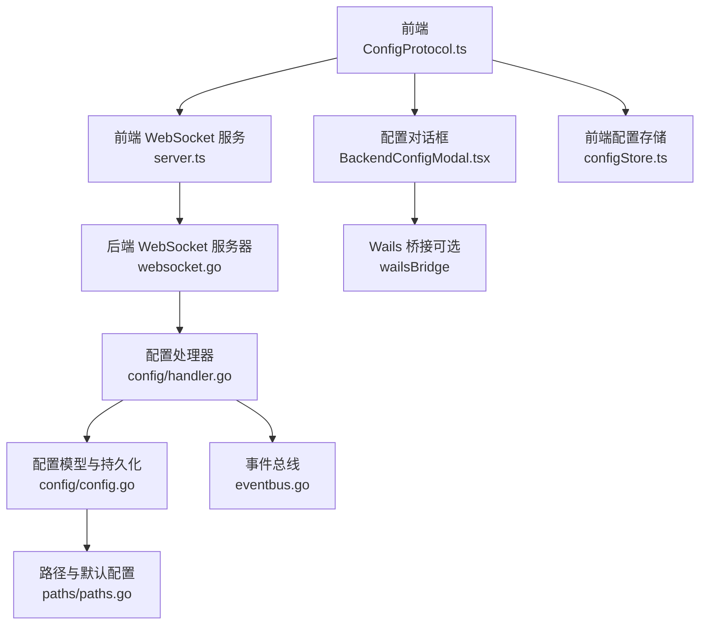
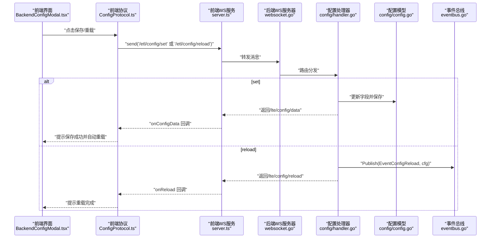
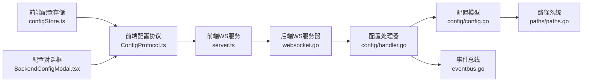
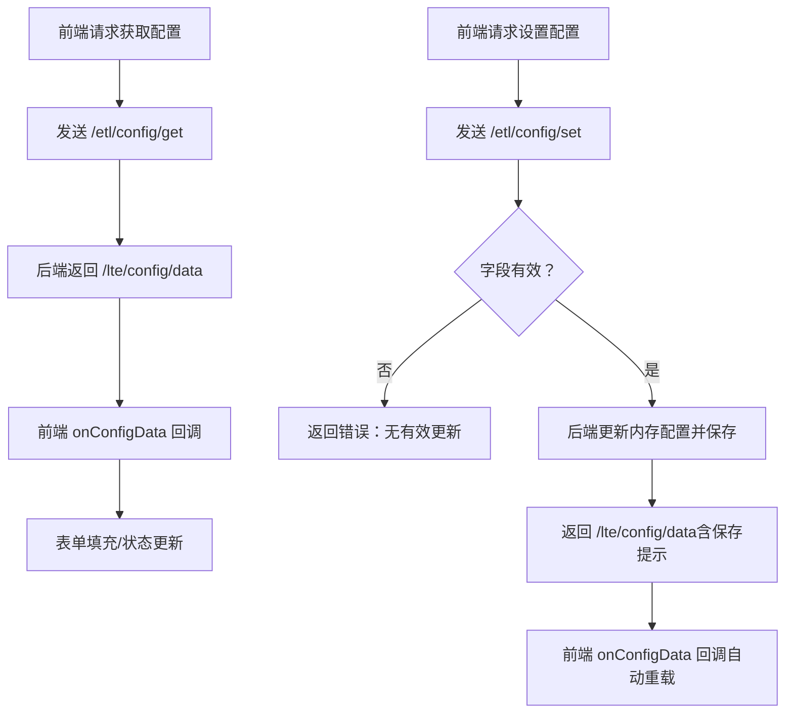

# 配置协议处理

<cite>
**本文引用的文件**
- [LocalBridge 内部配置处理器](file://LocalBridge/internal/protocol/config/handler.go)
- [前端配置协议](file://src/services/protocols/ConfigProtocol.ts)
- [后端配置模型与持久化](file://LocalBridge/internal/config/config.go)
- [路径与默认配置](file://LocalBridge/internal/paths/paths.go)
- [Extremer 默认配置](file://Extremer/config/default.json)
- [前端配置存储](file://src/stores/configStore.ts)
- [前端配置对话框](file://src/components/modals/BackendConfigModal.tsx)
- [事件总线](file://LocalBridge/internal/eventbus/eventbus.go)
- [WebSocket 服务器](file://LocalBridge/internal/server/websocket.go)
- [前端 WebSocket 服务](file://src/services/server.ts)
- [AI 加密工具](file://src/utils/ai/crypto.ts)
- [前端守卫系统](file://src/components/panels/settings/guardSystem.ts)
</cite>

## 目录
1. [引言](#引言)
2. [项目结构](#项目结构)
3. [核心组件](#核心组件)
4. [架构总览](#架构总览)
5. [详细组件分析](#详细组件分析)
6. [依赖关系分析](#依赖关系分析)
7. [性能考量](#性能考量)
8. [故障排查指南](#故障排查指南)
9. [结论](#结论)
10. [附录](#附录)

## 引言
本文件围绕“配置协议处理”主题，系统性梳理后端 LocalBridge 与前端之间的配置管理协议，涵盖配置读取、写入、验证、同步、热重载、增量更新、批量操作、备份恢复、迁移、加密与安全、权限控制以及与应用状态管理的集成与一致性保障。目标是帮助开发者与运维人员全面理解配置协议的工作原理与最佳实践。

## 项目结构
配置协议涉及前后端多层协作：
- 前端负责 UI 交互、协议封装与状态管理
- 后端负责配置模型、持久化、事件总线与 WebSocket 服务
- 两者通过统一的协议路由进行消息交换

图示来源
- [前端配置协议:1-197](file://src/services/protocols/ConfigProtocol.ts#L1-L197)
- [前端 WebSocket 服务:1-387](file://src/services/server.ts#L1-L387)
- [WebSocket 服务器:1-58](file://LocalBridge/internal/server/websocket.go#L1-L58)
- [配置处理器:1-237](file://LocalBridge/internal/protocol/config/handler.go#L1-L237)
- [配置模型与持久化:1-339](file://LocalBridge/internal/config/config.go#L1-L339)
- [路径与默认配置:1-238](file://LocalBridge/internal/paths/paths.go#L1-L238)
- [前端配置对话框:1-200](file://src/components/modals/BackendConfigModal.tsx#L1-L200)
- [前端配置存储:1-440](file://src/stores/configStore.ts#L1-L440)
- [事件总线:1-83](file://LocalBridge/internal/eventbus/eventbus.go#L1-L83)

章节来源
- [前端配置协议:1-197](file://src/services/protocols/ConfigProtocol.ts#L1-L197)
- [前端 WebSocket 服务:1-387](file://src/services/server.ts#L1-L387)
- [WebSocket 服务器:1-58](file://LocalBridge/internal/server/websocket.go#L1-L58)
- [配置处理器:1-237](file://LocalBridge/internal/protocol/config/handler.go#L1-L237)
- [配置模型与持久化:1-339](file://LocalBridge/internal/config/config.go#L1-L339)
- [路径与默认配置:1-238](file://LocalBridge/internal/paths/paths.go#L1-L238)
- [前端配置对话框:1-200](file://src/components/modals/BackendConfigModal.tsx#L1-L200)
- [前端配置存储:1-440](file://src/stores/configStore.ts#L1-L440)
- [事件总线:1-83](file://LocalBridge/internal/eventbus/eventbus.go#L1-L83)

## 核心组件
- 配置协议（前端）：封装 /etl/config/* 与 /lte/config/* 路由，提供获取、设置、重载接口与回调管理。
- 配置处理器（后端）：解析消息、更新内存配置、持久化到文件，并通过事件总线广播重载。
- 配置模型（后端）：定义 server、file、log、maafw 等配置结构，提供默认值、路径规范化、安全检查与保存。
- 路径系统（后端）：决定配置文件位置、日志目录、开发/便携/用户模式，确保目录存在并生成默认配置。
- 事件总线（后端）：发布 config.reload 事件，供订阅者响应重载。
- 前端 WebSocket 服务：统一注册系统路由与业务路由，维护连接状态与握手校验。
- 前端配置存储（Zustand）：管理前端 UI 配置、加密 AI Key、迁移逻辑与缓存。
- 前端配置对话框：承载后端配置的编辑、保存、自动重载与 Extremer 同步。
- AI 加密工具：前端对敏感配置（如 API Key）进行加密存储与迁移。
- 守卫系统（前端）：基于已配置键集合，对特定动作进行前置校验。

章节来源
- [前端配置协议:1-197](file://src/services/protocols/ConfigProtocol.ts#L1-L197)
- [配置处理器:1-237](file://LocalBridge/internal/protocol/config/handler.go#L1-L237)
- [配置模型与持久化:1-339](file://LocalBridge/internal/config/config.go#L1-L339)
- [路径与默认配置:1-238](file://LocalBridge/internal/paths/paths.go#L1-L238)
- [事件总线:1-83](file://LocalBridge/internal/eventbus/eventbus.go#L1-L83)
- [前端 WebSocket 服务:1-387](file://src/services/server.ts#L1-L387)
- [前端配置存储:1-440](file://src/stores/configStore.ts#L1-L440)
- [前端配置对话框:1-200](file://src/components/modals/BackendConfigModal.tsx#L1-L200)
- [AI 加密工具:1-120](file://src/utils/ai/crypto.ts#L1-L120)
- [前端守卫系统:1-37](file://src/components/panels/settings/guardSystem.ts#L1-L37)

## 架构总览
配置协议采用“前端协议 + 后端处理器 + 配置模型 + 事件总线”的分层设计，消息通过 WebSocket 在两端之间传递，遵循统一的路由命名规范与错误处理机制。

图示来源
- [前端配置对话框:1-200](file://src/components/modals/BackendConfigModal.tsx#L1-L200)
- [前端配置协议:1-197](file://src/services/protocols/ConfigProtocol.ts#L1-L197)
- [前端 WebSocket 服务:1-387](file://src/services/server.ts#L1-L387)
- [WebSocket 服务器:1-58](file://LocalBridge/internal/server/websocket.go#L1-L58)
- [配置处理器:1-237](file://LocalBridge/internal/protocol/config/handler.go#L1-L237)
- [配置模型与持久化:1-339](file://LocalBridge/internal/config/config.go#L1-L339)
- [事件总线:1-83](file://LocalBridge/internal/eventbus/eventbus.go#L1-L83)

## 详细组件分析

### 配置协议（前端）
- 路由与回调
  - 注册 /lte/config/data 与 /lte/config/reload 接收路由，分别处理配置数据推送与重载响应。
  - 提供 onConfigData 与 onReload 回调注册与注销，便于订阅者响应配置变更。
- 请求接口
  - requestGetConfig：向后端请求当前配置。
  - requestSetConfig：向后端提交增量配置更新。
  - requestReload：请求后端触发配置重载。
- 错误处理
  - 统一通过 /error 路由处理后端错误，前端以消息提示用户。

章节来源
- [前端配置协议:1-197](file://src/services/protocols/ConfigProtocol.ts#L1-L197)

### 配置处理器（后端）
- 路由分发
  - /etl/config/get：返回当前全局配置与配置文件路径。
  - /etl/config/set：解析请求数据，按 server、file、log、maafw 分组更新字段，若无有效更新则返回错误；保存成功后推送 /lte/config/data。
  - /etl/config/reload：发布 EventConfigReload 事件，返回 /lte/config/reload。
- 数据转换
  - 将 interface{} 切片转换为 string 切片，确保数组字段正确赋值。
- 错误处理
  - 对无效请求、配置未加载、保存失败等情况返回标准化错误。

章节来源
- [配置处理器:1-237](file://LocalBridge/internal/protocol/config/handler.go#L1-L237)

### 配置模型与持久化（后端）
- 结构定义
  - ServerConfig、FileConfig、LogConfig、MaaFWConfig 与全局 Config。
- 默认值与路径
  - 通过 Viper 设置默认值；EnsureConfigFile 确保配置文件存在并写入默认内容；normalize 规范化相对路径并校验根目录存在。
- 保存与覆盖
  - Save 将配置序列化写入文件；OverrideFromFlags 支持命令行覆盖；SetMaaFWLibDir/SetMaaFWResourceDir 提供便捷保存。
- 安全检查
  - CheckRootSafety 检测高风险目录、驱动器根目录与用户主目录，给出风险等级与建议。
- 与前端协议的映射
  - 前端 BackendConfig 与后端 Config 字段一一对应，确保双向一致。

章节来源
- [配置模型与持久化:1-339](file://LocalBridge/internal/config/config.go#L1-L339)

### 路径与默认配置（后端）
- 运行模式
  - 用户模式（APPDATA/Library/Application Support）、开发模式（exe 目录旁 config）、便携模式（exe 目录）。
- 目录与文件
  - GetConfigDir/GetLogDir/EnsureAllDirs；GetDefaultConfigContent/EnsureConfigFile 生成默认配置。
- Extremer 默认配置
  - Extremer/config/default.json 提供额外扩展配置项，与 LocalBridge 配置协同。

章节来源
- [路径与默认配置:1-238](file://LocalBridge/internal/paths/paths.go#L1-L238)
- [Extremer 默认配置:1-34](file://Extremer/config/default.json#L1-L34)

### 事件总线（后端）
- 事件类型
  - EventConfigReload：配置重载事件，供订阅者响应。
- 发布与订阅
  - Publish/PublishAsync 支持同步与异步发布；Subscribe/Unsubscribe 管理订阅生命周期。

章节来源
- [事件总线:1-83](file://LocalBridge/internal/eventbus/eventbus.go#L1-L83)

### 前端 WebSocket 服务与握手
- 路由注册
  - registerRoute/registerRoutes 统一注册业务路由。
- 握手与版本校验
  - 系统路由 /system/handshake 与 /system/handshake/response，前端与后端约定协议版本，不匹配时主动断开并提示。
- 连接状态
  - 维护连接中/已连接状态监听器，超时与错误处理完善。

章节来源
- [前端 WebSocket 服务:1-387](file://src/services/server.ts#L1-L387)
- [WebSocket 服务器:1-58](file://LocalBridge/internal/server/websocket.go#L1-L58)

### 前端配置存储与加密
- 存储结构
  - configs、configuredKeys、status；支持 setConfig/replaceConfig/resetConfig/resetAllConfigs。
- 加密与迁移
  - aiApiKey 自动加密存储；迁移明文为加密格式；isExportConfig 与 configHandlingMode 同步。
- 缓存与恢复
  - saveConfigCache/restoreConfigCache 将配置与已配置键持久化到 localStorage。

章节来源
- [前端配置存储:1-440](file://src/stores/configStore.ts#L1-L440)
- [AI 加密工具:1-120](file://src/utils/ai/crypto.ts#L1-L120)

### 前端配置对话框与 Extremer 同步
- 功能
  - 表单绑定后端配置；保存后自动触发重载；可同步根目录到 Extremer（Wails 环境）。
- 流程
  - requestGetConfig -> onConfigData -> 表单填充 -> requestSetConfig -> 保存成功提示 -> 自动 requestReload。

章节来源
- [前端配置对话框:1-200](file://src/components/modals/BackendConfigModal.tsx#L1-L200)

### 守卫系统（前端）
- 作用
  - 基于 configuredKeys 对特定动作（如导出）进行前置校验，未配置项会阻断并提示。
- 与配置协议的关系
  - 通过 settingsDefinitions 与 guardAction 关联，配合前端协议的回调机制实现一致的用户体验。

章节来源
- [前端守卫系统:1-37](file://src/components/panels/settings/guardSystem.ts#L1-L37)

## 依赖关系分析
- 前端依赖
  - ConfigProtocol 依赖 LocalWebSocketServer；BackendConfigModal 依赖 ConfigProtocol 与 Wails 桥接；configStore 提供前端配置状态。
- 后端依赖
  - ConfigHandler 依赖 config、errors、eventbus、logger、server、models；Config 依赖 viper、paths。
- 事件耦合
  - ConfigHandler 通过事件总线发布重载事件，订阅者可响应配置变更。

图示来源
- [前端配置协议:1-197](file://src/services/protocols/ConfigProtocol.ts#L1-L197)
- [前端 WebSocket 服务:1-387](file://src/services/server.ts#L1-L387)
- [WebSocket 服务器:1-58](file://LocalBridge/internal/server/websocket.go#L1-L58)
- [配置处理器:1-237](file://LocalBridge/internal/protocol/config/handler.go#L1-L237)
- [配置模型与持久化:1-339](file://LocalBridge/internal/config/config.go#L1-L339)
- [路径与默认配置:1-238](file://LocalBridge/internal/paths/paths.go#L1-L238)
- [事件总线:1-83](file://LocalBridge/internal/eventbus/eventbus.go#L1-L83)
- [前端配置存储:1-440](file://src/stores/configStore.ts#L1-L440)
- [前端配置对话框:1-200](file://src/components/modals/BackendConfigModal.tsx#L1-L200)

## 性能考量
- I/O 优化
  - 后端 Save 采用原子写入（序列化后写入临时文件再替换），降低崩溃导致的配置损坏风险。
- 事件处理
  - 重载通过事件总线异步发布，避免阻塞主消息处理流程。
- 前端状态
  - Zustand 状态更新为细粒度变更，减少不必要的渲染；加密操作异步执行，不影响 UI 响应。
- 路由与握手
  - 前端 WS 服务统一注册与超时控制，避免重复连接与资源泄漏。

## 故障排查指南
- 连接问题
  - 检查前端 WS 服务连接状态与握手版本；确认后端端口与主机配置。
- 配置未加载
  - 后端返回“配置未加载”时，确认配置文件路径与权限；检查 EnsureConfigFile 是否成功创建默认配置。
- 保存失败
  - 后端返回“保存配置失败”，检查文件权限与磁盘空间；查看日志定位具体错误。
- 重载无效
  - 确认事件总线订阅者是否正确处理 EventConfigReload；检查后端返回 /lte/config/reload 成功。
- 前端回调未触发
  - 检查 ConfigProtocol 的 onConfigData/onReload 注册与注销逻辑；确认消息路由与数据结构一致。
- 安全检查告警
  - 当根目录为高风险或无限制扫描时，遵循建议调整配置；必要时启用更严格的扫描限制。

章节来源
- [配置处理器:1-237](file://LocalBridge/internal/protocol/config/handler.go#L1-L237)
- [配置模型与持久化:1-339](file://LocalBridge/internal/config/config.go#L1-L339)
- [前端配置协议:1-197](file://src/services/protocols/ConfigProtocol.ts#L1-L197)
- [前端 WebSocket 服务:1-387](file://src/services/server.ts#L1-L387)

## 结论
配置协议通过清晰的路由分层、完善的错误处理与事件总线机制，实现了前后端配置的可靠同步与一致性保障。后端提供强健的配置模型与持久化策略，前端通过协议与存储实现易用的配置体验与安全防护。结合热重载、增量更新与加密机制，整体方案兼顾了可用性、安全性与可维护性。

## 附录

### 配置项读取、写入、验证与同步流程

图示来源
- [配置处理器:1-237](file://LocalBridge/internal/protocol/config/handler.go#L1-L237)
- [前端配置协议:1-197](file://src/services/protocols/ConfigProtocol.ts#L1-L197)

### 配置层级结构与优先级
- 层级
  - 命令行覆盖（OverrideFromFlags） > 配置文件（Viper） > 默认值（setDefaults）。
- 优先级
  - 命令行最高，其次为配置文件，最后为内置默认值；路径规范化与安全检查在加载后执行。

章节来源
- [配置模型与持久化:1-339](file://LocalBridge/internal/config/config.go#L1-L339)

### 默认值管理策略
- 后端默认值：通过 Viper SetDefault 设置 server、file、log、maafw 的默认值。
- 前端默认值：通过 configStore.defaultConfigs 管理 UI 配置默认值；与后端字段映射保持一致。

章节来源
- [配置模型与持久化:102-123](file://LocalBridge/internal/config/config.go#L102-L123)
- [前端配置存储:117-177](file://src/stores/configStore.ts#L117-L177)

### 热重载、增量更新与批量操作
- 热重载
  - 前端发送 /etl/config/reload，后端发布 EventConfigReload，订阅者响应；前端收到 /lte/config/reload 并提示完成。
- 增量更新
  - /etl/config/set 支持按组更新（server、file、log、maafw），仅更新传入字段。
- 批量操作
  - 前端 replaceConfig 支持批量合并与迁移；前端对话框一次性提交多个字段。

章节来源
- [配置处理器:1-237](file://LocalBridge/internal/protocol/config/handler.go#L1-L237)
- [前端配置协议:1-197](file://src/services/protocols/ConfigProtocol.ts#L1-L197)
- [前端配置存储:312-366](file://src/stores/configStore.ts#L312-L366)

### 备份、恢复与迁移
- 备份与恢复
  - 后端 Save 将当前配置写入文件；前端 localStorage 缓存配置与已配置键，支持恢复。
- 迁移
  - 前端迁移 isExportConfig 至 configHandlingMode；AI Key 从明文迁移到加密格式。

章节来源
- [配置模型与持久化:195-224](file://LocalBridge/internal/config/config.go#L195-L224)
- [前端配置存储:326-362](file://src/stores/configStore.ts#L326-L362)
- [AI 加密工具:112-120](file://src/utils/ai/crypto.ts#L112-L120)

### 加密、权限控制与安全验证
- 加密
  - 前端对 aiApiKey 使用 AES-GCM 加密存储，兼容降级；迁移旧版明文。
- 权限控制
  - 配置文件写入权限与目录存在性检查；路径规范化避免越权访问。
- 安全验证
  - CheckRootSafety 检测高风险目录与无限制扫描，给出风险等级与建议。

章节来源
- [AI 加密工具:1-120](file://src/utils/ai/crypto.ts#L1-L120)
- [配置模型与持久化:234-296](file://LocalBridge/internal/config/config.go#L234-L296)

### 与应用状态管理的集成与一致性
- 前端
  - ConfigProtocol 与 configStore 协作，确保 UI 配置与后端配置一致；守卫系统在关键动作前进行前置校验。
- 后端
  - 事件总线驱动订阅者更新内部状态；配置变更通过消息推送反馈给前端。

章节来源
- [前端配置协议:1-197](file://src/services/protocols/ConfigProtocol.ts#L1-L197)
- [前端配置存储:1-440](file://src/stores/configStore.ts#L1-L440)
- [事件总线:1-83](file://LocalBridge/internal/eventbus/eventbus.go#L1-L83)
- [前端守卫系统:1-37](file://src/components/panels/settings/guardSystem.ts#L1-L37)