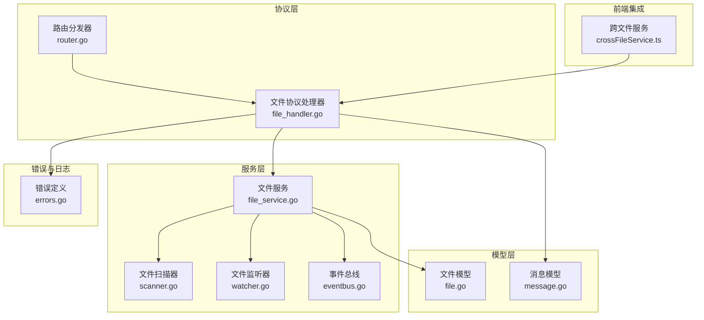
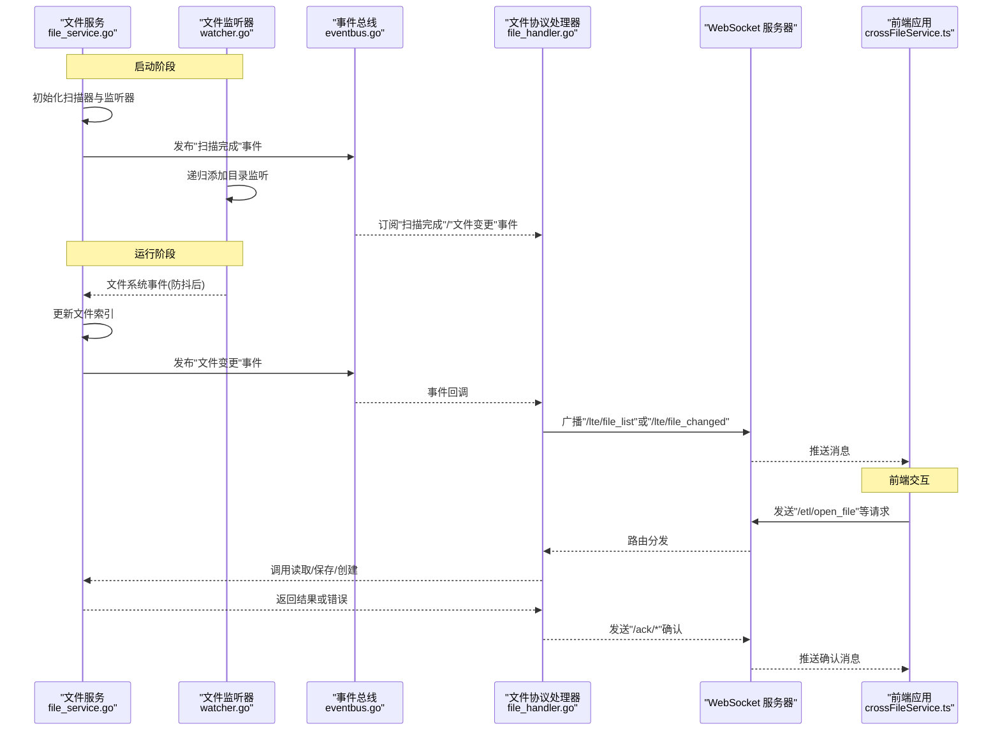
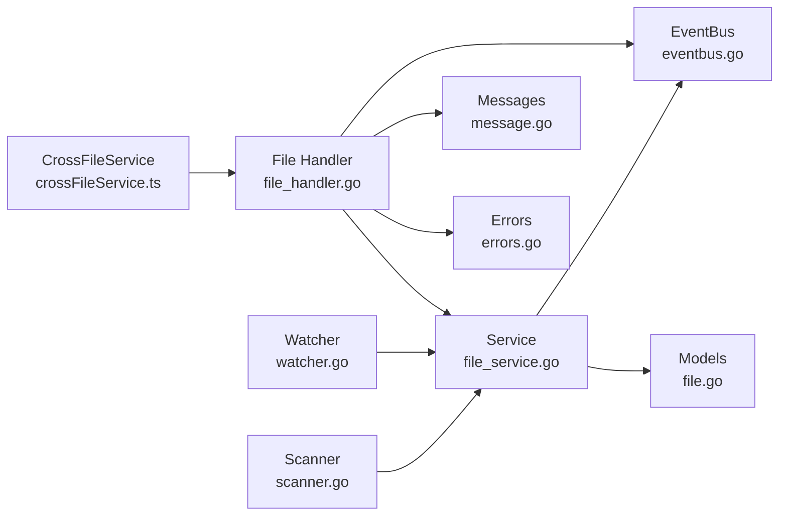

# 文件服务

<cite>
**本文档引用的文件**
- [file_service.go](file://LocalBridge/internal/service/file/file_service.go)
- [scanner.go](file://LocalBridge/internal/service/file/scanner.go)
- [watcher.go](file://LocalBridge/internal/service/file/watcher.go)
- [file_handler.go](file://LocalBridge/internal/protocol/file/file_handler.go)
- [file.go](file://LocalBridge/pkg/models/file.go)
- [message.go](file://LocalBridge/pkg/models/message.go)
- [errors.go](file://LocalBridge/internal/errors/errors.go)
- [eventbus.go](file://LocalBridge/internal/eventbus/eventbus.go)
- [router.go](file://LocalBridge/internal/router/router.go)
- [crossFileService.ts](file://src/services/crossFileService.ts)
</cite>

## 目录
1. [简介](#简介)
2. [项目结构](#项目结构)
3. [核心组件](#核心组件)
4. [架构总览](#架构总览)
5. [详细组件分析](#详细组件分析)
6. [依赖关系分析](#依赖关系分析)
7. [性能考量](#性能考量)
8. [故障排查指南](#故障排查指南)
9. [结论](#结论)
10. [附录](#附录)

## 简介
本文件服务为本地桥接服务的核心模块之一，负责管理本地文件系统的文件读写、文件监控与热重载、文件路径解析与权限校验、以及与前端的文件变更通知与增量更新策略。其设计目标是在保证安全性与稳定性的同时，提供高效的文件扫描、实时变更感知与可靠的增量更新能力，并与前端的跨文件导航与自动补全等特性紧密协作。

## 项目结构
文件服务位于 LocalBridge 子项目中，采用分层架构：
- 协议层：负责与前端通过 WebSocket 通信，处理打开/保存/创建/刷新等请求。
- 服务层：封装文件读写、扫描、监控与事件发布。
- 数据模型层：定义文件信息、节点信息、消息结构等。
- 错误与事件：统一错误码与事件总线，便于跨模块解耦。



图表来源
- [file_handler.go:1-358](file://LocalBridge/internal/protocol/file/file_handler.go#L1-L358)
- [file_service.go:1-406](file://LocalBridge/internal/service/file/file_service.go#L1-L406)
- [scanner.go:1-301](file://LocalBridge/internal/service/file/scanner.go#L1-L301)
- [watcher.go:1-261](file://LocalBridge/internal/service/file/watcher.go#L1-L261)
- [eventbus.go:1-83](file://LocalBridge/internal/eventbus/eventbus.go#L1-L83)
- [router.go:1-161](file://LocalBridge/internal/router/router.go#L1-L161)
- [file.go:1-30](file://LocalBridge/pkg/models/file.go#L1-L30)
- [message.go:1-129](file://LocalBridge/pkg/models/message.go#L1-L129)
- [errors.go:1-141](file://LocalBridge/internal/errors/errors.go#L1-L141)
- [crossFileService.ts:1-740](file://src/services/crossFileService.ts#L1-L740)

章节来源
- [file_service.go:1-406](file://LocalBridge/internal/service/file/file_service.go#L1-L406)
- [file_handler.go:1-358](file://LocalBridge/internal/protocol/file/file_handler.go#L1-L358)
- [router.go:1-161](file://LocalBridge/internal/router/router.go#L1-L161)

## 核心组件
- 文件服务（Service）：提供文件读取、保存、创建、文件列表查询；维护文件索引；处理文件变更事件；内置路径安全校验与自身写入忽略窗口。
- 文件扫描器（Scanner）：递归扫描根目录，支持深度与文件数量限制；解析文件节点与前缀；支持单文件扫描。
- 文件监听器（Watcher）：基于 fsnotify 实现文件系统事件监听；支持防抖；区分创建/修改/删除/重命名；自动添加新建目录监听。
- 文件协议处理器（Handler）：对接 WebSocket 路由，处理打开/保存/分离保存/创建/刷新等请求；向前端推送文件列表与变更通知。
- 事件总线（EventBus）：发布“扫描完成”“文件变更”等事件，供协议处理器订阅并广播至前端。
- 错误模型（LBError）：统一错误码与错误包装，便于前端识别与处理。
- 前端跨文件服务（crossFileService.ts）：整合本地文件与前端已加载文件，提供跨文件节点搜索、跳转、自动完成与锚点引用查询。

章节来源
- [file_service.go:19-62](file://LocalBridge/internal/service/file/file_service.go#L19-L62)
- [scanner.go:20-48](file://LocalBridge/internal/service/file/scanner.go#L20-L48)
- [watcher.go:34-59](file://LocalBridge/internal/service/file/watcher.go#L34-L59)
- [file_handler.go:14-35](file://LocalBridge/internal/protocol/file/file_handler.go#L14-L35)
- [eventbus.go:16-51](file://LocalBridge/internal/eventbus/eventbus.go#L16-L51)
- [errors.go:9-28](file://LocalBridge/internal/errors/errors.go#L9-L28)
- [crossFileService.ts:48-740](file://src/services/crossFileService.ts#L48-L740)

## 架构总览
文件服务通过“扫描—监听—事件—协议”的闭环实现文件系统集成：
- 启动阶段：扫描器构建初始文件索引，发布扫描完成事件；监听器启动并递归监听根目录。
- 运行阶段：文件系统事件经监听器防抖后交由服务层处理；服务层根据事件类型更新索引并发布变更事件；协议处理器订阅事件并向前端推送文件列表与变更通知。
- 前端交互：前端通过协议处理器发起打开/保存/创建/刷新等请求；跨文件服务整合本地与前端文件，提供节点搜索与跳转。



图表来源
- [file_service.go:64-95](file://LocalBridge/internal/service/file/file_service.go#L64-L95)
- [watcher.go:62-83](file://LocalBridge/internal/service/file/watcher.go#L62-L83)
- [eventbus.go:37-51](file://LocalBridge/internal/eventbus/eventbus.go#L37-L51)
- [file_handler.go:48-64](file://LocalBridge/internal/protocol/file/file_handler.go#L48-L64)
- [crossFileService.ts:458-526](file://src/services/crossFileService.ts#L458-L526)

## 详细组件分析

### 文件服务（Service）
职责与特性：
- 文件读取：路径安全校验；允许直接读取特定配置文件；解析 JSONC；返回结构化内容。
- 文件保存：支持保持字段顺序的保存；序列化 JSON；写入后清除防抖；记录最近写入文件以避免自身写入事件风暴。
- 文件创建：校验目录与文件名；序列化初始内容；写入后更新索引。
- 文件索引：维护绝对路径到文件信息的映射；提供稳定排序的文件列表。
- 事件处理：区分创建/修改/删除/重命名；更新索引；发布变更事件；忽略自身写入窗口内的事件。
- 路径安全：规范化绝对路径；校验根目录范围；拒绝越权访问。

```mermaid
classDiagram
class Service {
-string root
-Scanner scanner
-Watcher watcher
-map~string,*File~ fileIndex
-RWMutex mu
-EventBus eventBus
-int maxDepth
-int maxFiles
-map~string,int64~ recentlyWrittenFiles
-RWMutex writtenMu
-Duration selfWriteIgnoreWindow
+Start() error
+Stop() void
+GetFileList() []FileInfo
+ReadFile(path) interface{}
+SaveFile(path, content, indent) error
+SaveFileWithOrder(path, content, indent, keepOrder) error
+CreateFile(dir, name, content) string
-handleFileChange(change)
-validatePath(path) error
-marshalJSON(content, indent) []byte
}
class Scanner {
-string root
-[]string exclude
-[]string extensions
-int maxDepth
-int maxFiles
+SetMaxDepth(depth)
+SetMaxFiles(count)
+ScanWithLimit() ScanResult
+ScanSingle(absPath) *File
-shouldExcludeDir(name) bool
-hasValidExtension(path) bool
-parseFileNodes(filePath) ([]FileNode, string)
-extractAnchors(nodeData) []string
}
class Watcher {
-Watcher watcher
-string root
-[]string extensions
-ChangeHandler handler
-debouncer debouncer
+Start() error
+Stop() void
+ClearDebounce(filePath)
-processEvent(event)
-hasValidExtension(path) bool
}
class EventBus {
+Subscribe(type, handler)
+Publish(type, data)
+PublishAsync(type, data)
+Unsubscribe(type)
}
Service --> Scanner : "使用"
Service --> Watcher : "使用"
Service --> EventBus : "发布事件"
```

图表来源
- [file_service.go:19-62](file://LocalBridge/internal/service/file/file_service.go#L19-L62)
- [scanner.go:20-48](file://LocalBridge/internal/service/file/scanner.go#L20-L48)
- [watcher.go:34-59](file://LocalBridge/internal/service/file/watcher.go#L34-L59)
- [eventbus.go:16-51](file://LocalBridge/internal/eventbus/eventbus.go#L16-L51)

章节来源
- [file_service.go:64-95](file://LocalBridge/internal/service/file/file_service.go#L64-L95)
- [file_service.go:122-156](file://LocalBridge/internal/service/file/file_service.go#L122-L156)
- [file_service.go:158-215](file://LocalBridge/internal/service/file/file_service.go#L158-L215)
- [file_service.go:237-296](file://LocalBridge/internal/service/file/file_service.go#L237-L296)
- [file_service.go:298-388](file://LocalBridge/internal/service/file/file_service.go#L298-L388)
- [file_service.go:390-405](file://LocalBridge/internal/service/file/file_service.go#L390-L405)

### 文件扫描器（Scanner）
- 递归遍历根目录，支持排除目录与扩展名过滤。
- 深度与文件数量限制：超过限制时截断并记录原因。
- 单文件扫描：用于新增文件的索引补充。
- 节点解析：从 JSONC 内容提取节点列表与前缀，支持多种 anchor 形态。

章节来源
- [scanner.go:58-147](file://LocalBridge/internal/service/file/scanner.go#L58-L147)
- [scanner.go:176-210](file://LocalBridge/internal/service/file/scanner.go#L176-L210)
- [scanner.go:212-254](file://LocalBridge/internal/service/file/scanner.go#L212-L254)
- [scanner.go:256-295](file://LocalBridge/internal/service/file/scanner.go#L256-L295)

### 文件监听器（Watcher）
- 基于 fsnotify 监听文件系统事件；自动为新建目录添加监听。
- 防抖策略：针对同一文件的多次事件合并为一次处理，降低抖动。
- 事件类型：创建/修改/删除/重命名；区分目录与文件；规范化路径。
- 清除防抖：在服务层写入后主动清除对应防抖，避免延迟触发。

章节来源
- [watcher.go:62-83](file://LocalBridge/internal/service/file/watcher.go#L62-L83)
- [watcher.go:113-191](file://LocalBridge/internal/service/file/watcher.go#L113-L191)
- [watcher.go:204-260](file://LocalBridge/internal/service/file/watcher.go#L204-L260)

### 文件协议处理器（Handler）
- 路由前缀：/etl/open_file、/etl/save_file、/etl/save_separated、/etl/create_file、/etl/refresh_file_list。
- 请求处理：解析请求体；调用文件服务执行读取/保存/创建；返回确认消息。
- 事件订阅：订阅连接建立与文件变更事件；向前端广播文件列表与变更通知。
- 配置文件联动：打开文件时尝试读取同目录下的配置文件并返回。

章节来源
- [file_handler.go:37-64](file://LocalBridge/internal/protocol/file/file_handler.go#L37-L64)
- [file_handler.go:66-137](file://LocalBridge/internal/protocol/file/file_handler.go#L66-L137)
- [file_handler.go:139-176](file://LocalBridge/internal/protocol/file/file_handler.go#L139-L176)
- [file_handler.go:178-238](file://LocalBridge/internal/protocol/file/file_handler.go#L178-L238)
- [file_handler.go:240-271](file://LocalBridge/internal/protocol/file/file_handler.go#L240-L271)
- [file_handler.go:273-277](file://LocalBridge/internal/protocol/file/file_handler.go#L273-L277)
- [file_handler.go:279-330](file://LocalBridge/internal/protocol/file/file_handler.go#L279-L330)

### 跨文件服务（crossFileService.ts）
- 整合本地文件与前端已加载文件，提供跨文件节点搜索、跳转与自动完成。
- 支持模糊匹配、类型过滤、当前文件优先排序。
- 未加载本地文件时，通过后端加载后再跳转。
- 提供锚点引用查询，辅助外部/锚点节点的引用关系分析。

章节来源
- [crossFileService.ts:61-206](file://src/services/crossFileService.ts#L61-L206)
- [crossFileService.ts:283-364](file://src/services/crossFileService.ts#L283-L364)
- [crossFileService.ts:453-526](file://src/services/crossFileService.ts#L453-L526)
- [crossFileService.ts:625-709](file://src/services/crossFileService.ts#L625-L709)

## 依赖关系分析
- 文件服务依赖扫描器与监听器，通过事件总线与协议处理器解耦。
- 协议处理器依赖文件服务与事件总线；通过 WebSocket 广播消息。
- 错误模型统一错误码与包装，便于前端识别。
- 前端跨文件服务依赖协议处理器与本地文件存储，实现跨文件导航与自动完成。



图表来源
- [file_service.go:19-62](file://LocalBridge/internal/service/file/file_service.go#L19-L62)
- [scanner.go:20-48](file://LocalBridge/internal/service/file/scanner.go#L20-L48)
- [watcher.go:34-59](file://LocalBridge/internal/service/file/watcher.go#L34-L59)
- [eventbus.go:16-51](file://LocalBridge/internal/eventbus/eventbus.go#L16-L51)
- [file_handler.go:14-35](file://LocalBridge/internal/protocol/file/file_handler.go#L14-L35)
- [file.go:1-30](file://LocalBridge/pkg/models/file.go#L1-L30)
- [message.go:1-129](file://LocalBridge/pkg/models/message.go#L1-L129)
- [errors.go:9-28](file://LocalBridge/internal/errors/errors.go#L9-L28)
- [crossFileService.ts:48-740](file://src/services/crossFileService.ts#L48-L740)

章节来源
- [file_service.go:19-62](file://LocalBridge/internal/service/file/file_service.go#L19-L62)
- [file_handler.go:14-35](file://LocalBridge/internal/protocol/file/file_handler.go#L14-L35)
- [crossFileService.ts:48-740](file://src/services/crossFileService.ts#L48-L740)

## 性能考量
- 扫描限制：通过最大深度与最大文件数量限制，避免大规模目录扫描导致的性能问题；超过限制时截断并记录原因。
- 防抖策略：监听器对同一文件的多次事件进行合并，减少重复处理与广播频率。
- 自身写入忽略窗口：避免服务层自身写入触发的事件风暴，提升稳定性。
- 索引更新：仅在必要时更新索引（创建/删除/重命名），修改事件主要触发前端提示而非重建索引。
- 前端增量更新：前端在收到“文件变更”通知后，按需重新加载或弹窗提示，避免不必要的全量刷新。

章节来源
- [scanner.go:40-48](file://LocalBridge/internal/service/file/scanner.go#L40-L48)
- [watcher.go:204-260](file://LocalBridge/internal/service/file/watcher.go#L204-L260)
- [file_service.go:30-35](file://LocalBridge/internal/service/file/file_service.go#L30-L35)
- [file_service.go:298-388](file://LocalBridge/internal/service/file/file_service.go#L298-L388)
- [file_handler.go:279-330](file://LocalBridge/internal/protocol/file/file_handler.go#L279-L330)

## 故障排查指南
常见错误与处理建议：
- 文件不存在：检查路径是否在根目录范围内；确认文件是否被排除或未被扫描。
- 文件读取失败：检查文件权限与磁盘状态；确认 JSONC 格式正确。
- 文件写入失败：检查磁盘空间与写权限；查看最近写入记录是否被忽略窗口影响。
- 文件名冲突：确保文件名不包含非法字符且未被占用。
- JSON 格式无效：检查 JSONC 语法；必要时使用字符串保持字段顺序。
- 权限不足：确认路径规范化与根目录校验通过；避免越权访问。

章节来源
- [errors.go:75-140](file://LocalBridge/internal/errors/errors.go#L75-L140)
- [file_service.go:390-405](file://LocalBridge/internal/service/file/file_service.go#L390-L405)
- [file_handler.go:66-137](file://LocalBridge/internal/protocol/file/file_handler.go#L66-L137)
- [file_handler.go:139-176](file://LocalBridge/internal/protocol/file/file_handler.go#L139-L176)
- [file_handler.go:240-271](file://LocalBridge/internal/protocol/file/file_handler.go#L240-L271)

## 结论
文件服务通过“扫描—监听—事件—协议”的清晰分层，实现了对本地文件系统的高效集成与稳定运行。其路径安全校验、自身写入忽略窗口、防抖策略与事件驱动的增量更新机制，共同保障了在复杂文件场景下的可靠性与性能。配合前端跨文件服务，进一步提升了跨文件导航与自动补全体验。建议在生产环境中合理设置扫描限制与日志级别，以便在大规模项目中保持良好性能。

## 附录

### API 接口与使用示例
- 打开文件
  - 路由：/etl/open_file
  - 请求体：包含文件绝对路径
  - 响应：返回文件内容与可选配置文件内容及路径
- 保存文件
  - 路由：/etl/save_file
  - 请求体：包含文件绝对路径、JSON 字符串或 JSON 对象、缩进空格数
  - 响应：确认消息
- 分离保存文件
  - 路由：/etl/save_separated
  - 请求体：包含 Pipeline 与配置文件路径、内容（字符串或对象）、缩进空格数
  - 响应：确认消息
- 创建文件
  - 路由：/etl/create_file
  - 请求体：包含目录绝对路径、文件名、可选初始内容
  - 响应：确认消息
- 刷新文件列表
  - 路由：/etl/refresh_file_list
  - 响应：无（协议处理器会主动推送最新文件列表）

章节来源
- [file_handler.go:37-64](file://LocalBridge/internal/protocol/file/file_handler.go#L37-L64)
- [file_handler.go:66-137](file://LocalBridge/internal/protocol/file/file_handler.go#L66-L137)
- [file_handler.go:139-176](file://LocalBridge/internal/protocol/file/file_handler.go#L139-L176)
- [file_handler.go:178-238](file://LocalBridge/internal/protocol/file/file_handler.go#L178-L238)
- [file_handler.go:240-271](file://LocalBridge/internal/protocol/file/file_handler.go#L240-L271)
- [file_handler.go:273-277](file://LocalBridge/internal/protocol/file/file_handler.go#L273-L277)

### 文件变更通知与增量更新策略
- 通知机制：服务层发布“文件变更”事件；协议处理器订阅并广播至前端。
- 增量更新：前端根据变更类型决定是否重新加载文件或弹窗提示；支持自动重载配置。
- 重命名/删除目录：触发文件列表推送，确保前端 UI 与实际文件结构一致。

章节来源
- [eventbus.go:74-82](file://LocalBridge/internal/eventbus/eventbus.go#L74-L82)
- [file_handler.go:279-330](file://LocalBridge/internal/protocol/file/file_handler.go#L279-L330)
- [crossFileService.ts:147-191](file://src/services/crossFileService.ts#L147-L191)
- [crossFileService.ts:414-461](file://src/services/crossFileService.ts#L414-L461)

### 路径解析与权限管理
- 路径解析：规范化绝对路径；计算相对路径；解析文件节点与前缀。
- 权限管理：严格校验路径是否在根目录范围内；拒绝非法字符与越权访问；对配置文件读取做特殊处理。

章节来源
- [scanner.go:118-135](file://LocalBridge/internal/service/file/scanner.go#L118-L135)
- [file_service.go:390-405](file://LocalBridge/internal/service/file/file_service.go#L390-L405)
- [file_handler.go:86-125](file://LocalBridge/internal/protocol/file/file_handler.go#L86-L125)