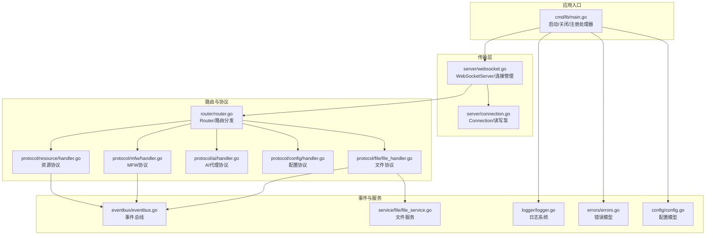
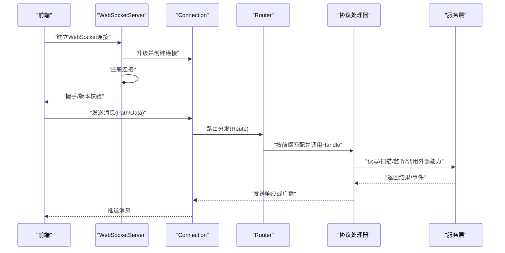
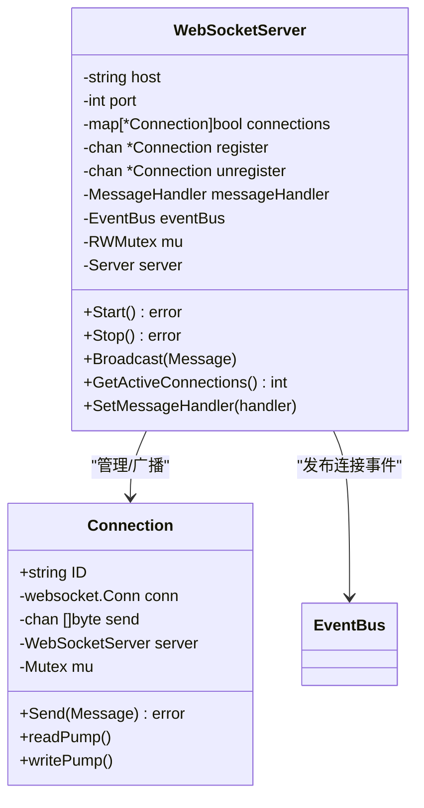
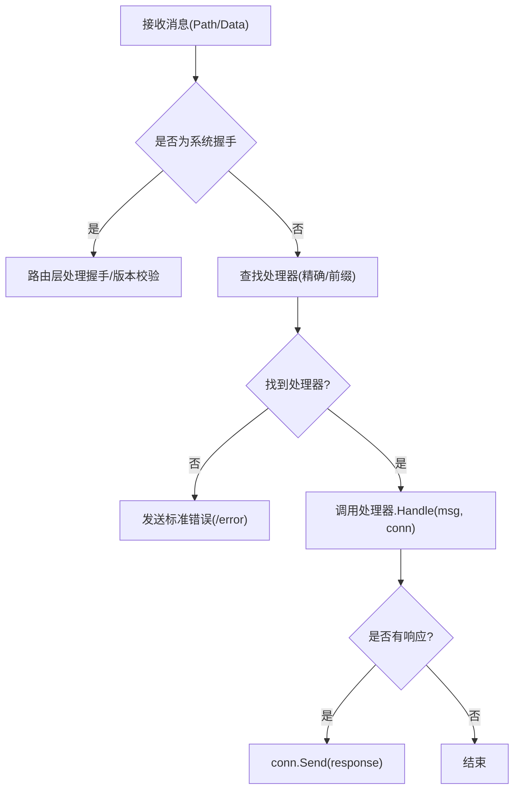
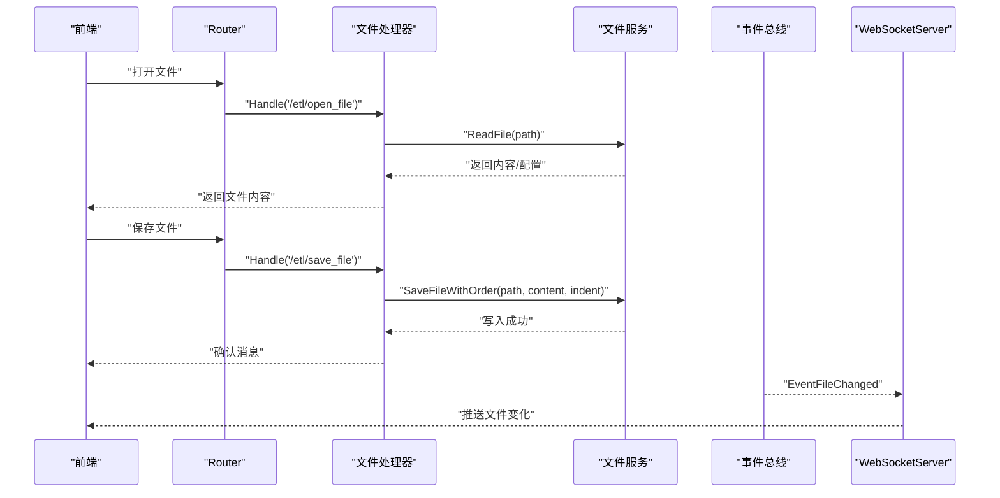
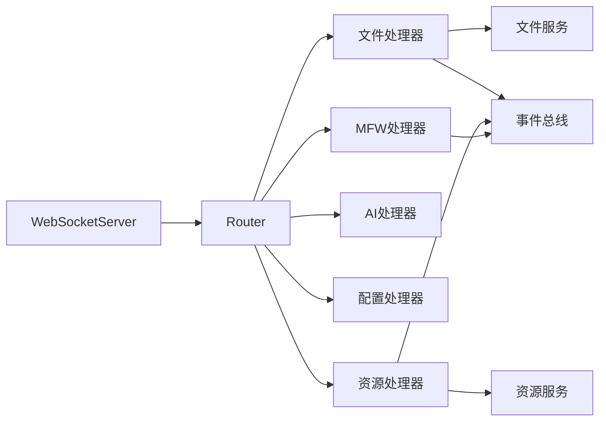

# 服务层架构

<cite>
**本文引用的文件**
- [LocalBridge\internal\server\websocket.go](file://LocalBridge/internal/server/websocket.go)
- [LocalBridge\internal\server\connection.go](file://LocalBridge/internal/server/connection.go)
- [LocalBridge\internal\router\router.go](file://LocalBridge/internal/router/router.go)
- [LocalBridge\internal\protocol\ai\handler.go](file://LocalBridge/internal/protocol/ai/handler.go)
- [LocalBridge\internal\protocol\config\handler.go](file://LocalBridge/internal/protocol/config/handler.go)
- [LocalBridge\internal\protocol\file\file_handler.go](file://LocalBridge/internal/protocol/file/file_handler.go)
- [LocalBridge\internal\protocol\mfw\handler.go](file://LocalBridge/internal/protocol/mfw/handler.go)
- [LocalBridge\internal\protocol\resource\handler.go](file://LocalBridge/internal/protocol/resource/handler.go)
- [LocalBridge\internal\eventbus\eventbus.go](file://LocalBridge/internal/eventbus/eventbus.go)
- [LocalBridge\internal\service\file\file_service.go](file://LocalBridge/internal/service/file/file_service.go)
- [LocalBridge\internal\logger\logger.go](file://LocalBridge/internal/logger/logger.go)
- [LocalBridge\internal\errors\errors.go](file://LocalBridge/internal/errors/errors.go)
- [LocalBridge\internal\config\config.go](file://LocalBridge/internal/config/config.go)
- [LocalBridge\cmd\lb\main.go](file://LocalBridge/cmd/lb/main.go)
</cite>

## 目录
1. [简介](#简介)
2. [项目结构](#项目结构)
3. [核心组件](#核心组件)
4. [架构总览](#架构总览)
5. [详细组件分析](#详细组件分析)
6. [依赖分析](#依赖分析)
7. [性能考量](#性能考量)
8. [故障排查指南](#故障排查指南)
9. [结论](#结论)
10. [附录](#附录)

## 简介
本文件面向服务层架构，系统性阐述基于 WebSocket 的本地桥接服务（Local Bridge）的实现原理与运行机制，涵盖连接管理、协议系统、消息路由、事件分发、错误处理、前端状态同步、跨文件服务与文件系统集成、扩展点与插件化设计、监控与日志、性能分析以及安全与并发最佳实践。目标读者既包括需要深入理解实现细节的工程师，也包括希望了解如何正确使用与维护服务的运维与产品人员。

## 项目结构
LocalBridge 采用清晰的分层与职责划分：
- 应用入口与生命周期管理：命令行入口负责配置加载、服务初始化、事件总线、日志推送、协议处理器注册与服务启停。
- 传输层：基于 Gorilla WebSocket 的服务器，负责连接升级、读写泵、广播与连接池管理。
- 路由与协议层：统一的路由分发器，按路径前缀将消息分派至具体协议处理器；内置多种协议（文件、配置、资源、MFW、AI、调试等）。
- 事件总线：轻量级事件总线，用于服务间解耦与跨模块通知。
- 服务层：文件服务、资源服务等，负责文件系统与外部能力的封装。
- 日志与错误：统一日志与错误模型，支持历史日志推送与错误标准化。

图示来源
- [LocalBridge\cmd\lb\main.go:184-468](file://LocalBridge/cmd/lb/main.go#L184-L468)
- [LocalBridge\internal\server\websocket.go:35-179](file://LocalBridge/internal/server/websocket.go#L35-L179)
- [LocalBridge\internal\server\connection.go:12-96](file://LocalBridge/internal/server/connection.go#L12-L96)
- [LocalBridge\internal\router\router.go:28-161](file://LocalBridge/internal/router/router.go#L28-L161)
- [LocalBridge\internal\protocol\file\file_handler.go:14-358](file://LocalBridge/internal/protocol/file/file_handler.go#L14-L358)
- [LocalBridge\internal\protocol\mfw\handler.go:14-800](file://LocalBridge/internal/protocol/mfw/handler.go#L14-L800)
- [LocalBridge\internal\protocol\ai\handler.go:16-279](file://LocalBridge/internal/protocol/ai/handler.go#L16-L279)
- [LocalBridge\internal\protocol\config\handler.go:12-237](file://LocalBridge/internal/protocol/config/handler.go#L12-L237)
- [LocalBridge\internal\protocol\resource\handler.go:22-272](file://LocalBridge/internal/protocol/resource/handler.go#L22-L272)
- [LocalBridge\internal\eventbus\eventbus.go:16-83](file://LocalBridge/internal/eventbus/eventbus.go#L16-L83)
- [LocalBridge\internal\service\file\file_service.go:19-406](file://LocalBridge/internal/service/file/file_service.go#L19-L406)
- [LocalBridge\internal\logger\logger.go:13-251](file://LocalBridge/internal/logger/logger.go#L13-L251)
- [LocalBridge\internal\errors\errors.go:22-141](file://LocalBridge/internal/errors/errors.go#L22-L141)
- [LocalBridge\internal\config\config.go:42-339](file://LocalBridge/internal/config/config.go#L42-L339)

章节来源
- [LocalBridge\cmd\lb\main.go:184-468](file://LocalBridge/cmd/lb/main.go#L184-L468)
- [LocalBridge\internal\server\websocket.go:35-179](file://LocalBridge/internal/server/websocket.go#L35-L179)
- [LocalBridge\internal\router\router.go:28-161](file://LocalBridge/internal/router/router.go#L28-L161)

## 核心组件
- WebSocket 服务器：负责连接升级、注册/注销、广播、读写泵与连接池管理。
- 连接对象：封装单个 WebSocket 连接，提供读取、写入与发送队列。
- 路由分发器：根据消息路径精确或前缀匹配，选择对应协议处理器，并处理握手与错误。
- 协议处理器：按功能域划分（文件、配置、资源、MFW、AI、调试），每个处理器实现统一接口。
- 事件总线：提供订阅/发布机制，用于服务间解耦与状态广播。
- 服务层：文件服务负责扫描、监听、读写与路径安全校验；资源服务负责资源包扫描与图片获取。
- 日志与错误：统一日志接口与错误模型，支持历史日志推送与错误标准化。

章节来源
- [LocalBridge\internal\server\websocket.go:35-179](file://LocalBridge/internal/server/websocket.go#L35-L179)
- [LocalBridge\internal\server\connection.go:12-96](file://LocalBridge/internal/server/connection.go#L12-L96)
- [LocalBridge\internal\router\router.go:28-161](file://LocalBridge/internal/router/router.go#L28-L161)
- [LocalBridge\internal\protocol\file\file_handler.go:14-358](file://LocalBridge/internal/protocol/file/file_handler.go#L14-L358)
- [LocalBridge\internal\protocol\mfw\handler.go:14-800](file://LocalBridge/internal/protocol/mfw/handler.go#L14-L800)
- [LocalBridge\internal\protocol\ai\handler.go:16-279](file://LocalBridge/internal/protocol/ai/handler.go#L16-L279)
- [LocalBridge\internal\protocol\config\handler.go:12-237](file://LocalBridge/internal/protocol/config/handler.go#L12-L237)
- [LocalBridge\internal\protocol\resource\handler.go:22-272](file://LocalBridge/internal/protocol/resource/handler.go#L22-L272)
- [LocalBridge\internal\eventbus\eventbus.go:16-83](file://LocalBridge/internal/eventbus/eventbus.go#L16-L83)
- [LocalBridge\internal\service\file\file_service.go:19-406](file://LocalBridge/internal/service/file/file_service.go#L19-L406)
- [LocalBridge\internal\logger\logger.go:13-251](file://LocalBridge/internal/logger/logger.go#L13-L251)
- [LocalBridge\internal\errors\errors.go:22-141](file://LocalBridge/internal/errors/errors.go#L22-L141)

## 架构总览
服务层采用“入口 -> 传输层 -> 路由 -> 协议处理器 -> 服务层”的链路，配合事件总线实现模块间解耦与状态同步。WebSocket 提供双向实时通道，路由分发器保证协议扩展性，事件总线支撑广播与异步通知，日志与错误体系贯穿始终。

图示来源
- [LocalBridge\internal\server\websocket.go:144-161](file://LocalBridge/internal/server/websocket.go#L144-L161)
- [LocalBridge\internal\server\connection.go:31-76](file://LocalBridge/internal/server/connection.go#L31-L76)
- [LocalBridge\internal\router\router.go:56-83](file://LocalBridge/internal/router/router.go#L56-L83)
- [LocalBridge\internal\protocol\file\file_handler.go:48-64](file://LocalBridge/internal/protocol/file/file_handler.go#L48-L64)
- [LocalBridge\internal\protocol\mfw\handler.go:31-128](file://LocalBridge/internal/protocol/mfw/handler.go#L31-L128)

## 详细组件分析

### WebSocket 服务器与连接管理
- 连接升级与注册：使用 Gorilla WebSocket 升级 HTTP 连接，创建 Connection 并注册到服务器。
- 连接池与广播：维护连接集合，支持广播消息给所有连接；提供活跃连接数查询。
- 读写泵：独立 goroutine 负责读取与写入，异常时自动注销并关闭连接。
- 生命周期：启动时设置超时、发布在线服务地址；停止时关闭所有连接并关闭 HTTP 服务器。

图示来源
- [LocalBridge\internal\server\websocket.go:35-179](file://LocalBridge/internal/server/websocket.go#L35-L179)
- [LocalBridge\internal\server\connection.go:12-96](file://LocalBridge/internal/server/connection.go#L12-L96)

章节来源
- [LocalBridge\internal\server\websocket.go:35-179](file://LocalBridge/internal/server/websocket.go#L35-L179)
- [LocalBridge\internal\server\connection.go:12-96](file://LocalBridge/internal/server/connection.go#L12-L96)

### 路由与协议系统
- 路由器：维护处理器映射表，支持精确匹配与前缀匹配；处理系统握手与版本校验；对未知路由返回标准错误。
- 协议处理器：实现统一接口，按路由前缀注册；处理消息并返回响应或触发广播。
- 握手与版本校验：统一在路由层处理，不进入具体协议处理器；版本不匹配时触发回调并优雅退出。

图示来源
- [LocalBridge\internal\router\router.go:56-161](file://LocalBridge/internal/router/router.go#L56-L161)

章节来源
- [LocalBridge\internal\router\router.go:28-161](file://LocalBridge/internal/router/router.go#L28-L161)

### 协议详解

#### 文件协议（/etl/*）
- 功能：打开/保存/分离保存文件、创建文件、刷新文件列表、推送文件变化通知。
- 与服务层交互：调用文件服务读写与索引；监听文件变化并通过事件总线广播。
- 前端状态同步：连接建立时推送文件列表；文件变化时推送变更事件；保存/创建后主动刷新列表。

图示来源
- [LocalBridge\internal\protocol\file\file_handler.go:48-358](file://LocalBridge/internal/protocol/file/file_handler.go#L48-L358)
- [LocalBridge\internal\service\file\file_service.go:122-215](file://LocalBridge/internal/service/file/file_service.go#L122-L215)
- [LocalBridge\internal\eventbus\eventbus.go:74-83](file://LocalBridge/internal/eventbus/eventbus.go#L74-L83)

章节来源
- [LocalBridge\internal\protocol\file\file_handler.go:14-358](file://LocalBridge/internal/protocol/file/file_handler.go#L14-L358)
- [LocalBridge\internal\service\file\file_service.go:19-406](file://LocalBridge/internal/service/file/file_service.go#L19-L406)

#### 配置协议（/etl/config/*）
- 功能：获取/设置/重载配置；设置时支持多段字段更新；重载时发布事件并广播结果。
- 与配置系统交互：读取/保存全局配置；支持从命令行覆盖配置。

章节来源
- [LocalBridge\internal\protocol\config\handler.go:12-237](file://LocalBridge/internal/protocol/config/handler.go#L12-L237)
- [LocalBridge\internal\config\config.go:42-339](file://LocalBridge/internal/config/config.go#L42-L339)

#### 资源协议（/etl/get_*）
- 功能：获取单/多张图片、获取图片列表、刷新资源包；根据 Pipeline 路径匹配资源包。
- 与服务层交互：调用资源服务扫描与查找；连接建立时推送资源包列表。

章节来源
- [LocalBridge\internal\protocol\resource\handler.go:22-272](file://LocalBridge/internal/protocol/resource/handler.go#L22-L272)

#### MFW 协议（/etl/mfw/*）
- 功能：设备发现、控制器创建/连接/断开、屏幕截图、输入/滑动/点击、任务提交/查询/停止、自定义识别/动作注册等。
- 与服务层交互：通过 MFW 服务封装底层能力；未初始化时拒绝请求并提示配置。

章节来源
- [LocalBridge\internal\protocol\mfw\handler.go:14-800](file://LocalBridge/internal/protocol/mfw/handler.go#L14-L800)

#### AI 代理协议（/etl/ai/*）
- 功能：非流式/流式代理请求、取消；支持 SSE 流式传输与错误传播。
- 实现要点：使用活跃请求表跟踪流式请求；读取器增大缓冲区以支持长行；取消时关闭响应体。

章节来源
- [LocalBridge\internal\protocol\ai\handler.go:16-279](file://LocalBridge/internal/protocol/ai/handler.go#L16-L279)

### 事件总线与状态同步
- 事件类型：文件扫描完成、文件变化、连接建立/关闭、资源扫描完成、配置重载。
- 订阅与发布：处理器订阅连接建立事件推送列表；服务层在文件变化时发布事件；入口在配置重载时触发服务重载。
- 前端同步：连接建立时推送历史日志；文件/资源列表变化时广播最新状态。

章节来源
- [LocalBridge\internal\eventbus\eventbus.go:16-83](file://LocalBridge/internal/eventbus/eventbus.go#L16-L83)
- [LocalBridge\cmd\lb\main.go:335-385](file://LocalBridge/cmd/lb/main.go#L335-L385)
- [LocalBridge\internal\protocol\file\file_handler.go:279-330](file://LocalBridge/internal/protocol/file/file_handler.go#L279-L330)
- [LocalBridge\internal\protocol\resource\handler.go:219-245](file://LocalBridge/internal/protocol/resource/handler.go#L219-L245)

### 错误处理与日志
- 错误模型：统一的 LBError，包含错误码、消息、详情与原始错误；可转换为标准错误数据。
- 日志系统：支持控制台与文件双通道；可将日志推送到客户端；维护历史日志缓冲区；自动清理旧日志。
- 统一错误返回：路由层对未知路由与处理器错误统一返回 /error；协议处理器在解析/业务错误时返回标准错误。

章节来源
- [LocalBridge\internal\errors\errors.go:22-141](file://LocalBridge/internal/errors/errors.go#L22-L141)
- [LocalBridge\internal\logger\logger.go:13-251](file://LocalBridge/internal/logger/logger.go#L13-L251)
- [LocalBridge\internal\router\router.go:102-112](file://LocalBridge/internal/router/router.go#L102-L112)
- [LocalBridge\internal\protocol\file\file_handler.go:347-358](file://LocalBridge/internal/protocol/file/file_handler.go#L347-L358)

## 依赖分析
- 组件耦合：路由层与协议处理器松耦合，通过接口与前缀匹配解耦；处理器与服务层通过接口解耦；事件总线进一步降低模块间耦合。
- 外部依赖：Gorilla WebSocket、Logrus、Viper 等第三方库。
- 循环依赖：未发现循环依赖迹象，模块边界清晰。

图示来源
- [LocalBridge\internal\server\websocket.go:35-179](file://LocalBridge/internal/server/websocket.go#L35-L179)
- [LocalBridge\internal\router\router.go:28-161](file://LocalBridge/internal/router/router.go#L28-L161)
- [LocalBridge\internal\protocol\file\file_handler.go:14-358](file://LocalBridge/internal/protocol/file/file_handler.go#L14-L358)
- [LocalBridge\internal\protocol\mfw\handler.go:14-800](file://LocalBridge/internal/protocol/mfw/handler.go#L14-L800)
- [LocalBridge\internal\protocol\ai\handler.go:16-279](file://LocalBridge/internal/protocol/ai/handler.go#L16-L279)
- [LocalBridge\internal\protocol\config\handler.go:12-237](file://LocalBridge/internal/protocol/config/handler.go#L12-L237)
- [LocalBridge\internal\protocol\resource\handler.go:22-272](file://LocalBridge/internal/protocol/resource/handler.go#L22-L272)

章节来源
- [LocalBridge\internal\server\websocket.go:35-179](file://LocalBridge/internal/server/websocket.go#L35-L179)
- [LocalBridge\internal\router\router.go:28-161](file://LocalBridge/internal/router/router.go#L28-L161)

## 性能考量
- 连接与消息队列：连接发送队列容量有限，避免阻塞；读写泵独立 goroutine，减少主线程压力。
- 路由匹配：精确匹配优先，前缀匹配作为补充，降低查找成本。
- 文件服务：扫描与监听分离，支持最大深度与文件数限制；写入时清理防抖，减少重复事件。
- 日志：文件日志全级别记录，控制台仅推送指定级别；历史日志缓冲区限制大小，避免内存膨胀。
- 流式代理：SSE 读取器增大缓冲区，支持长行；取消时及时关闭响应体，释放资源。

## 故障排查指南
- 握手失败：检查前端协议版本与后端协议版本一致性；查看路由层握手响应与错误日志。
- 连接异常断开：关注读取消息错误与意外关闭错误；确认发送队列是否溢出。
- 文件读写失败：检查路径合法性与根目录限制；查看权限与文件存在性。
- 资源获取失败：确认资源包扫描是否完成；检查图片路径与 MIME 类型推断。
- MFW 未初始化：检查 MaaFramework 库路径与资源路径配置；查看初始化错误日志。
- 日志缺失：确认日志级别与推送开关；检查历史日志缓冲区是否被覆盖。

章节来源
- [LocalBridge\internal\router\router.go:114-161](file://LocalBridge/internal/router/router.go#L114-L161)
- [LocalBridge\internal\server\connection.go:31-76](file://LocalBridge/internal/server/connection.go#L31-L76)
- [LocalBridge\internal\service\file\file_service.go:122-156](file://LocalBridge/internal/service/file/file_service.go#L122-L156)
- [LocalBridge\internal\protocol\resource\handler.go:139-217](file://LocalBridge/internal/protocol/resource/handler.go#L139-L217)
- [LocalBridge\internal\protocol\mfw\handler.go:36-44](file://LocalBridge/internal/protocol/mfw/handler.go#L36-L44)
- [LocalBridge\internal\logger\logger.go:107-134](file://LocalBridge/internal/logger/logger.go#L107-L134)

## 结论
该服务层架构以 WebSocket 为核心，结合统一路由与协议处理器，实现了文件、配置、资源、MFW、AI 等多领域能力的模块化接入；通过事件总线与广播机制，保障了前端状态的实时同步；完善的日志与错误体系提供了可观测性与可维护性。整体设计具备良好的扩展性与稳定性，适合在复杂场景下持续演进。

## 附录
- 扩展点与插件化：新增协议处理器只需实现统一接口并注册到路由；服务层可通过事件总线扩展广播与订阅。
- 安全与并发：路径安全校验、连接池与锁保护、日志与错误标准化；建议在生产环境开启严格的根目录限制与最小权限原则。
- 监控与日志：利用日志推送与历史缓冲，结合前端面板展示；建议增加指标埋点与健康检查接口。