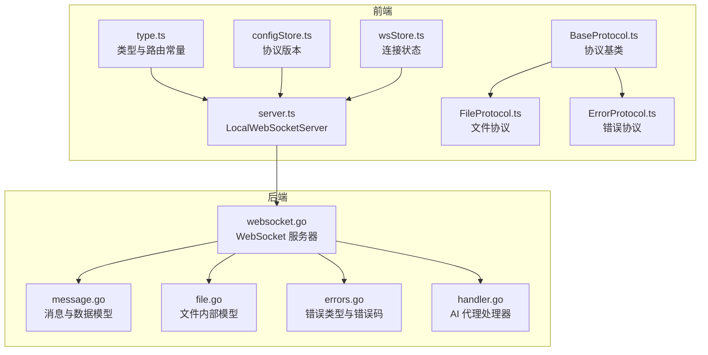
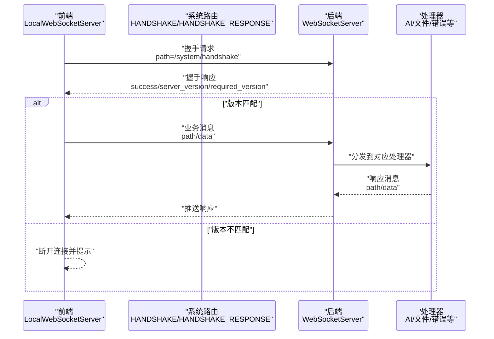
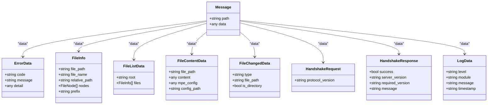
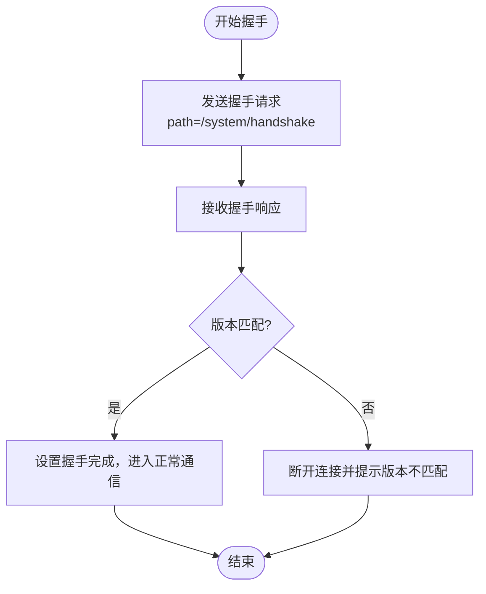
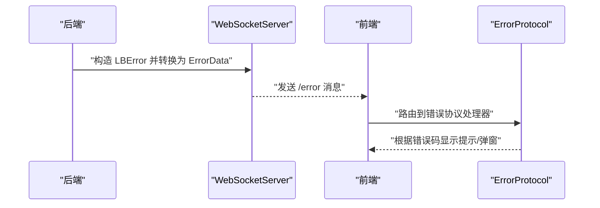
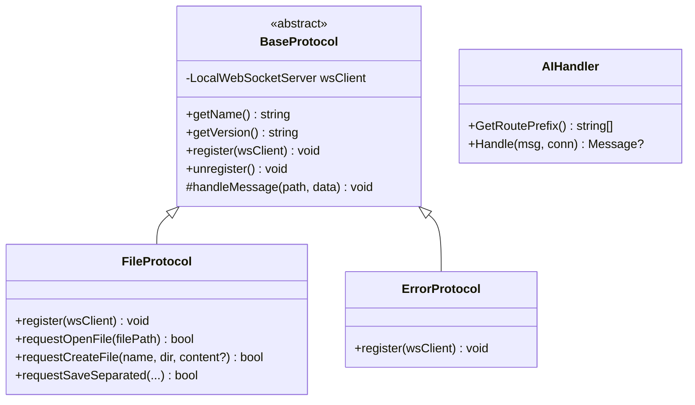
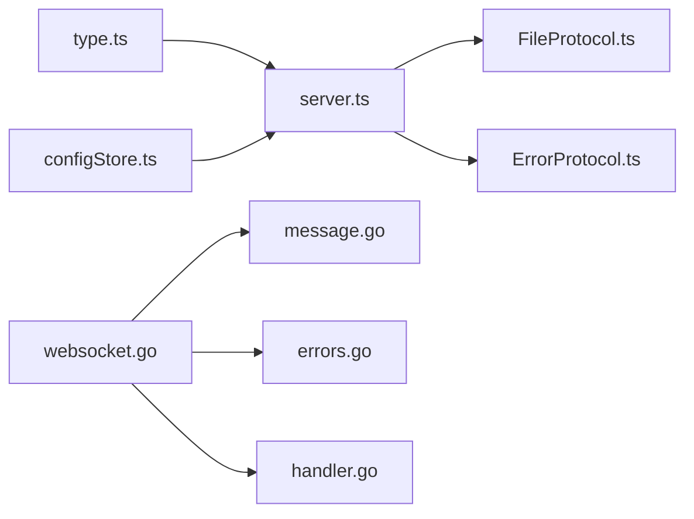

# 类型定义

<cite>
**本文档引用的文件**
- [message.go](file://LocalBridge/pkg/models/message.go)
- [file.go](file://LocalBridge/pkg/models/file.go)
- [websocket.go](file://LocalBridge/internal/server/websocket.go)
- [errors.go](file://LocalBridge/internal/errors/errors.go)
- [type.ts](file://src/services/type.ts)
- [server.ts](file://src/services/server.ts)
- [wsStore.ts](file://src/stores/wsStore.ts)
- [BaseProtocol.ts](file://src/services/protocols/BaseProtocol.ts)
- [FileProtocol.ts](file://src/services/protocols/FileProtocol.ts)
- [ErrorProtocol.ts](file://src/services/protocols/ErrorProtocol.ts)
- [configStore.ts](file://src/stores/configStore.ts)
- [handler.go](file://LocalBridge/internal/protocol/ai/handler.go)
</cite>

## 目录
1. [简介](#简介)
2. [项目结构](#项目结构)
3. [核心组件](#核心组件)
4. [架构总览](#架构总览)
5. [详细组件分析](#详细组件分析)
6. [依赖分析](#依赖分析)
7. [性能考虑](#性能考虑)
8. [故障排除指南](#故障排除指南)
9. [结论](#结论)
10. [附录](#附录)

## 简介
本文件聚焦于服务层的类型定义与通信协议体系，系统性阐述 WebSocket 消息的类型系统设计、消息格式规范、协议版本管理、类型安全机制、错误类型与异常处理策略，并提供类型扩展与自定义开发指南。通过前端 TypeScript 类型与后端 Go 类型的双向映射与约束，确保消息在端到端链路中的强一致性与可维护性。

## 项目结构
围绕类型定义与通信协议的关键位置如下：
- 前端类型与协议
  - 服务层类型与路由常量：[type.ts](file://src/services/type.ts)
  - WebSocket 客户端封装与握手流程：[server.ts](file://src/services/server.ts)
  - 连接状态存储：[wsStore.ts](file://src/stores/wsStore.ts)
  - 协议基类与具体协议实现：[BaseProtocol.ts](file://src/services/protocols/BaseProtocol.ts)、[FileProtocol.ts](file://src/services/protocols/FileProtocol.ts)、[ErrorProtocol.ts](file://src/services/protocols/ErrorProtocol.ts)
  - 全局配置（协议版本）：[configStore.ts](file://src/stores/configStore.ts)
- 后端类型与协议
  - 通用消息与数据模型：[message.go](file://LocalBridge/pkg/models/message.go)、[file.go](file://LocalBridge/pkg/models/file.go)
  - WebSocket 服务器与消息处理器：[websocket.go](file://LocalBridge/internal/server/websocket.go)
  - 错误类型与错误码：[errors.go](file://LocalBridge/internal/errors/errors.go)
  - AI 代理协议处理器（示例）：[handler.go](file://LocalBridge/internal/protocol/ai/handler.go)

**图表来源**
- [type.ts:1-28](file://src/services/type.ts#L1-L28)
- [server.ts:1-388](file://src/services/server.ts#L1-L388)
- [BaseProtocol.ts:1-40](file://src/services/protocols/BaseProtocol.ts#L1-L40)
- [FileProtocol.ts:1-581](file://src/services/protocols/FileProtocol.ts#L1-L581)
- [ErrorProtocol.ts:1-121](file://src/services/protocols/ErrorProtocol.ts#L1-L121)
- [wsStore.ts:1-24](file://src/stores/wsStore.ts#L1-L24)
- [configStore.ts:1-440](file://src/stores/configStore.ts#L1-L440)
- [message.go:1-129](file://LocalBridge/pkg/models/message.go#L1-L129)
- [file.go:1-30](file://LocalBridge/pkg/models/file.go#L1-L30)
- [websocket.go:1-179](file://LocalBridge/internal/server/websocket.go#L1-L179)
- [errors.go:1-141](file://LocalBridge/internal/errors/errors.go#L1-L141)
- [handler.go:1-279](file://LocalBridge/internal/protocol/ai/handler.go#L1-L279)

**章节来源**
- [type.ts:1-28](file://src/services/type.ts#L1-L28)
- [server.ts:1-388](file://src/services/server.ts#L1-L388)
- [BaseProtocol.ts:1-40](file://src/services/protocols/BaseProtocol.ts#L1-L40)
- [FileProtocol.ts:1-581](file://src/services/protocols/FileProtocol.ts#L1-L581)
- [ErrorProtocol.ts:1-121](file://src/services/protocols/ErrorProtocol.ts#L1-L121)
- [wsStore.ts:1-24](file://src/stores/wsStore.ts#L1-L24)
- [configStore.ts:1-440](file://src/stores/configStore.ts#L1-L440)
- [message.go:1-129](file://LocalBridge/pkg/models/message.go#L1-L129)
- [file.go:1-30](file://LocalBridge/pkg/models/file.go#L1-L30)
- [websocket.go:1-179](file://LocalBridge/internal/server/websocket.go#L1-L179)
- [errors.go:1-141](file://LocalBridge/internal/errors/errors.go#L1-L141)
- [handler.go:1-279](file://LocalBridge/internal/protocol/ai/handler.go#L1-L279)

## 核心组件
- 消息与数据模型（后端）
  - 通用消息结构、错误数据、文件信息、日志、版本握手等结构体，统一承载消息路径与数据载体。
- 前端类型与路由
  - 系统路由常量、握手请求/响应接口、消息处理函数类型、API 路由接口，保证前端对消息格式与路由的强约束。
- WebSocket 客户端与协议版本管理
  - LocalWebSocketServer 负责连接、握手、消息分发、状态管理；协议版本来自全局配置并在握手阶段校验。
- 协议基类与具体协议
  - BaseProtocol 抽象协议生命周期；FileProtocol、ErrorProtocol 等实现具体路由注册与消息处理。
- 错误类型与异常处理
  - 后端定义错误码与错误包装器，前端根据错误码进行 UI 提示与状态清理。

**章节来源**
- [message.go:1-129](file://LocalBridge/pkg/models/message.go#L1-L129)
- [type.ts:1-28](file://src/services/type.ts#L1-L28)
- [server.ts:20-388](file://src/services/server.ts#L20-L388)
- [BaseProtocol.ts:1-40](file://src/services/protocols/BaseProtocol.ts#L1-L40)
- [FileProtocol.ts:1-581](file://src/services/protocols/FileProtocol.ts#L1-L581)
- [ErrorProtocol.ts:1-121](file://src/services/protocols/ErrorProtocol.ts#L1-L121)
- [errors.go:1-141](file://LocalBridge/internal/errors/errors.go#L1-L141)

## 架构总览
下图展示了从前端到后端的类型驱动通信链路，强调消息格式、协议版本、错误传播与协议扩展点。

**图表来源**
- [server.ts:39-67](file://src/services/server.ts#L39-L67)
- [websocket.go:18-22](file://LocalBridge/internal/server/websocket.go#L18-L22)
- [handler.go:36-53](file://LocalBridge/internal/protocol/ai/handler.go#L36-L53)

**章节来源**
- [server.ts:108-287](file://src/services/server.ts#L108-L287)
- [websocket.go:144-161](file://LocalBridge/internal/server/websocket.go#L144-L161)

## 详细组件分析

### 消息格式规范与数据结构
- 通用消息结构
  - 后端：包含 path 与 data 的通用消息结构，作为所有消息的载体。
  - 前端：同构的 MessageHandler 与 APIRoute 接口，确保路由与处理器签名一致。
- 数据模型
  - 文件相关：文件信息、文件列表、文件内容、文件变更通知、创建/保存请求与确认。
  - 错误模型：错误码、错误消息与可选详情。
  - 日志模型：日志级别、模块、消息与时间戳。
  - 版本握手：请求包含前端协议版本，响应包含后端版本与所需版本。
- 本地文件内部模型
  - 后端内部文件模型与对外传输模型的转换方法，确保序列化一致性。

**图表来源**
- [message.go:3-129](file://LocalBridge/pkg/models/message.go#L3-L129)

**章节来源**
- [message.go:1-129](file://LocalBridge/pkg/models/message.go#L1-L129)
- [type.ts:20-27](file://src/services/type.ts#L20-L27)

### 协议版本管理与类型安全
- 前端协议版本
  - 通过全局配置暴露协议版本，用于握手请求。
- 后端协议版本
  - 固定常量定义协议版本，作为握手响应的一部分返回。
- 握手流程
  - 前端发送握手请求，后端返回握手响应；若 required_version 与前端不一致，前端断开连接并提示用户。

**图表来源**
- [server.ts:40-66](file://src/services/server.ts#L40-L66)
- [websocket.go:15-22](file://LocalBridge/internal/server/websocket.go#L15-L22)

**章节来源**
- [configStore.ts:7-13](file://src/stores/configStore.ts#L7-L13)
- [server.ts:20-66](file://src/services/server.ts#L20-L66)
- [websocket.go:15-22](file://LocalBridge/internal/server/websocket.go#L15-L22)

### 错误类型定义与异常处理策略
- 后端错误类型
  - 统一的错误包装器包含错误码、消息、可选详情与原始错误，并提供转换为 ErrorData 的方法。
  - 预定义错误码覆盖文件、网络、请求参数等常见场景。
- 前端错误协议
  - 统一处理 /error 路由，根据错误码映射 UI 提示；对特定错误（如 OCR 资源加载失败）弹出详细 Modal。
  - 对控制器相关错误清理连接状态，避免后续误操作。

**图表来源**
- [errors.go:22-50](file://LocalBridge/internal/errors/errors.go#L22-L50)
- [ErrorProtocol.ts:20-79](file://src/services/protocols/ErrorProtocol.ts#L20-L79)

**章节来源**
- [errors.go:1-141](file://LocalBridge/internal/errors/errors.go#L1-L141)
- [ErrorProtocol.ts:1-121](file://src/services/protocols/ErrorProtocol.ts#L1-L121)

### 协议扩展与自定义开发指南
- 新增协议步骤
  - 继承 BaseProtocol，实现 getName、getVersion、register、unregister 与受保护的 handleMessage。
  - 在 LocalWebSocketServer 中注册协议实例，确保初始化时调用 register。
- 新增路由
  - 在协议 register 中通过 wsClient.registerRoute 注册接收路由；通过 wsClient.send 发送请求消息。
  - 使用同构的 path 命名约定（例如 /etl/* 为请求，/lte/* 为推送）。
- 类型对齐
  - 前端 type.ts 中的 APIRoute 与 MessageHandler 与后端 models.Message 保持一致的 path/data 结构。
- 示例：AI 代理协议
  - 后端处理器根据 path 分发到不同代理逻辑，支持非流式与流式代理，并提供取消能力。

**图表来源**
- [BaseProtocol.ts:7-39](file://src/services/protocols/BaseProtocol.ts#L7-L39)
- [FileProtocol.ts:16-68](file://src/services/protocols/FileProtocol.ts#L16-L68)
- [ErrorProtocol.ts:11-25](file://src/services/protocols/ErrorProtocol.ts#L11-L25)
- [handler.go:17-34](file://LocalBridge/internal/protocol/ai/handler.go#L17-L34)

**章节来源**
- [BaseProtocol.ts:1-40](file://src/services/protocols/BaseProtocol.ts#L1-L40)
- [FileProtocol.ts:44-68](file://src/services/protocols/FileProtocol.ts#L44-L68)
- [server.ts:361-387](file://src/services/server.ts#L361-L387)
- [handler.go:36-53](file://LocalBridge/internal/protocol/ai/handler.go#L36-L53)

### 类型推导、泛型使用与接口设计最佳实践
- 类型推导
  - 前端 APIRoute 与 MessageHandler 通过接口约束，配合 Map<string, MessageHandler> 实现路由表的类型安全。
- 泛型使用
  - 在协议静态方法中使用 Promise<T> 与 Map<K, V> 管理异步确认回调，提升可测试性与可维护性。
- 接口设计
  - BaseProtocol 将协议生命周期抽象为统一接口，便于扩展新协议；消息结构采用通用 Message，降低耦合。
- 建议
  - 为每个协议定义明确的请求/响应数据模型，前后端保持字段命名一致。
  - 对于复杂业务消息，优先使用结构化的 data 对象而非字符串拼接，便于类型约束与调试。

**章节来源**
- [type.ts:20-27](file://src/services/type.ts#L20-L27)
- [FileProtocol.ts:541-568](file://src/services/protocols/FileProtocol.ts#L541-L568)

## 依赖分析
- 前端依赖
  - LocalWebSocketServer 依赖 type.ts 中的路由常量与类型，以及各协议模块。
  - 各协议依赖 BaseProtocol 与 LocalWebSocketServer 的注册/发送能力。
- 后端依赖
  - WebSocketServer 依赖 models 中的消息与数据模型、errors 中的错误类型、eventbus 与 logger。
  - 协议处理器依赖 server.Connection 与 models.Message，实现消息分发与响应。

**图表来源**
- [type.ts:1-28](file://src/services/type.ts#L1-L28)
- [server.ts:1-388](file://src/services/server.ts#L1-L388)
- [configStore.ts:1-440](file://src/stores/configStore.ts#L1-L440)
- [websocket.go:1-179](file://LocalBridge/internal/server/websocket.go#L1-L179)
- [message.go:1-129](file://LocalBridge/pkg/models/message.go#L1-L129)
- [errors.go:1-141](file://LocalBridge/internal/errors/errors.go#L1-L141)
- [handler.go:1-279](file://LocalBridge/internal/protocol/ai/handler.go#L1-L279)

**章节来源**
- [server.ts:1-388](file://src/services/server.ts#L1-L388)
- [websocket.go:1-179](file://LocalBridge/internal/server/websocket.go#L1-L179)

## 性能考虑
- 连接与广播
  - 后端使用读写锁保护连接集合，广播消息时遍历连接发送，注意连接数量增长带来的性能影响。
- 消息解析与分发
  - 前端 onmessage 中对 JSON 解析与路由查找为 O(1)，但需避免在高频消息场景中产生过多 UI 提示。
- 流式代理
  - 后端流式代理使用 Scanner 并增大缓冲区，适合长文本/流式响应；注意取消与错误处理的及时性。

**章节来源**
- [websocket.go:163-179](file://LocalBridge/internal/server/websocket.go#L163-L179)
- [handler.go:186-232](file://LocalBridge/internal/protocol/ai/handler.go#L186-L232)

## 故障排除指南
- 握手失败
  - 现象：前端提示版本不匹配并断开连接。
  - 排查：核对前端全局配置中的协议版本与后端常量是否一致。
- 连接超时
  - 现象：前端显示连接超时并引导查看文档。
  - 排查：确认本地服务已启动、端口正确且防火墙允许。
- 文件变更通知风暴
  - 现象：频繁弹窗或 UI 卡顿。
  - 排查：启用自动重载或合并变更 Modal，减少手动交互。
- OCR 资源加载失败
  - 现象：弹出详细 Modal 展示原因与排查建议。
  - 排查：根据提示检查资源目录与配置项。

**章节来源**
- [server.ts:108-255](file://src/services/server.ts#L108-L255)
- [ErrorProtocol.ts:81-119](file://src/services/protocols/ErrorProtocol.ts#L81-L119)

## 结论
通过前后端一致的类型定义与严格的协议版本管理，服务层实现了高内聚、低耦合的通信体系。消息格式规范、错误模型与协议扩展机制共同保障了系统的可维护性与可演进性。遵循本文档的类型设计与最佳实践，可在不破坏契约的前提下快速扩展新协议与功能模块。

## 附录
- 常用路由命名约定
  - 请求：/etl/*
  - 推送：/lte/*
  - 系统：/system/*
- 常见错误码
  - 文件相关：FILE_NOT_FOUND、FILE_READ_ERROR、FILE_WRITE_ERROR、FILE_NAME_CONFLICT、INVALID_JSON、PERMISSION_DENIED
  - 控制器相关：MFW_NOT_INITIALIZED、MFW_CONTROLLER_CREATE_FAIL、MFW_CONTROLLER_NOT_FOUND、MFW_CONTROLLER_CONNECT_FAIL、MFW_CONTROLLER_NOT_CONNECTED、MFW_DEVICE_NOT_FOUND、MFW_OCR_RESOURCE_NOT_CONFIGURED
  - 其他：MFW_RESOURCE_LOAD_FAILED、MFW_TASK_SUBMIT_FAILED、INVALID_REQUEST、CONNECTION_FAILED、INTERNAL_ERROR

**章节来源**
- [message.go:10-129](file://LocalBridge/pkg/models/message.go#L10-L129)
- [errors.go:10-20](file://LocalBridge/internal/errors/errors.go#L10-L20)
- [ErrorProtocol.ts:31-51](file://src/services/protocols/ErrorProtocol.ts#L31-L51)