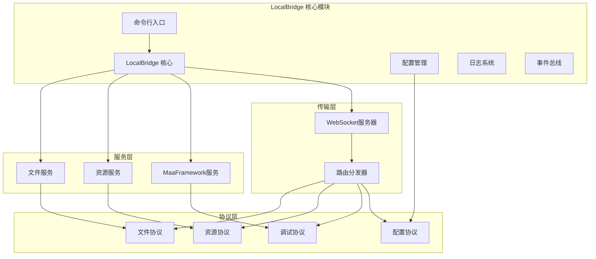
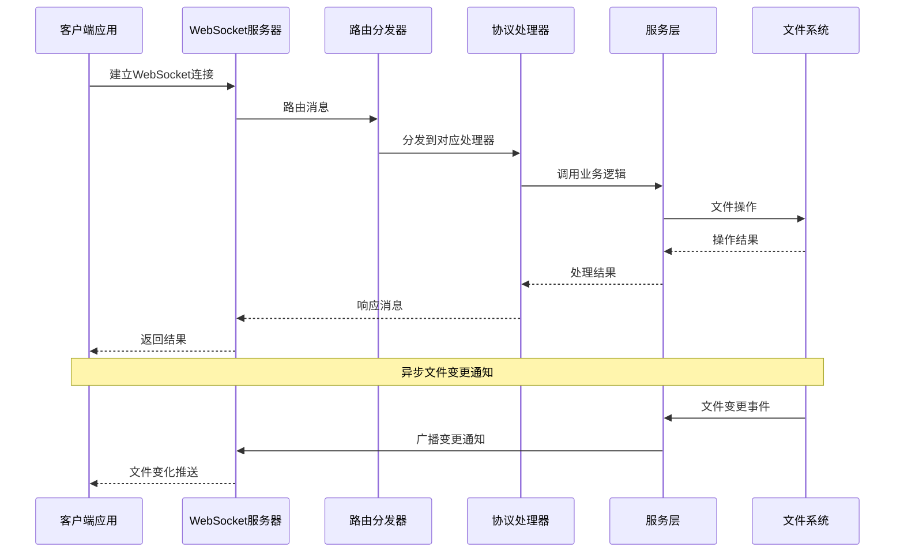
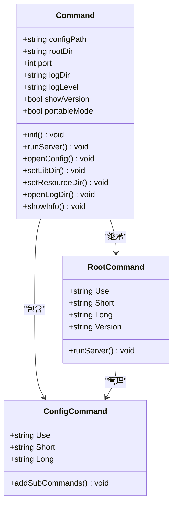
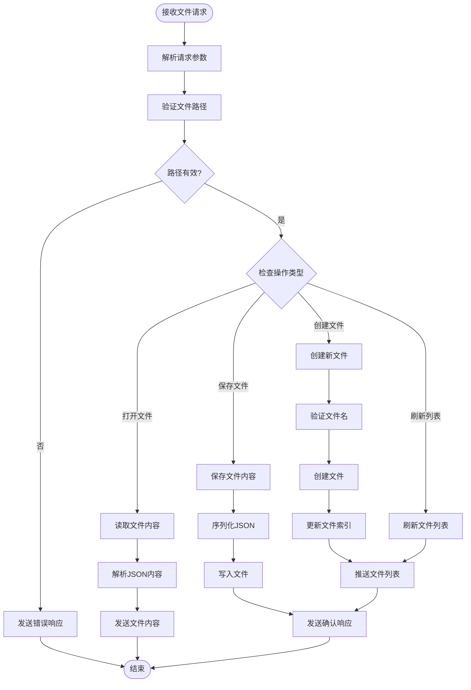
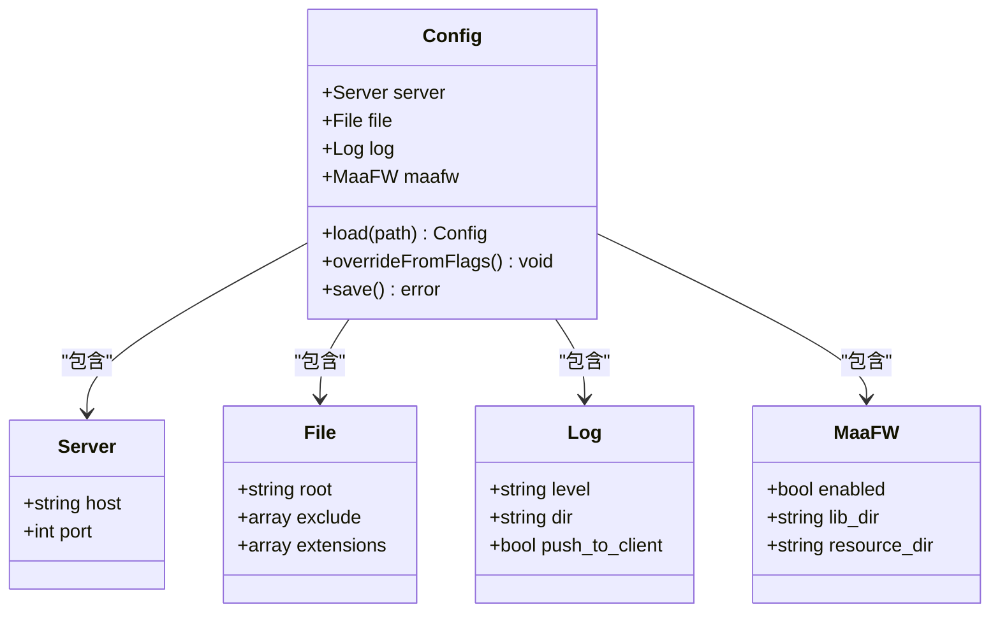

# 本地一体包部署指南

<cite>
**本文档引用的文件**
- [LocalBridge/README.md](file://LocalBridge/README.md)
- [LocalBridge/cmd/lb/main.go](file://LocalBridge/cmd/lb/main.go)
- [LocalBridge/config/default.json](file://LocalBridge/config/default.json)
- [LocalBridge/internal/protocol/file/file_handler.go](file://LocalBridge/internal/protocol/file/file_handler.go)
- [LocalBridge/internal/server/websocket.go](file://LocalBridge/internal/server/websocket.go)
- [LocalBridge/internal/service/file/file_service.go](file://LocalBridge/internal/service/file/file_service.go)
- [Extremer/main.go](file://Extremer/main.go)
- [Extremer/config/default.json](file://Extremer/config/default.json)
- [tools/install.bat](file://tools/install.bat)
- [tools/install.ps1](file://tools/install.ps1)
- [tools/install.sh](file://tools/install.sh)
</cite>

## 目录
1. [简介](#简介)
2. [项目结构](#项目结构)
3. [核心组件](#核心组件)
4. [架构概览](#架构概览)
5. [详细组件分析](#详细组件分析)
6. [部署流程](#部署流程)
7. [性能考虑](#性能考虑)
8. [故障排除指南](#故障排除指南)
9. [结论](#结论)

## 简介

本地一体包（Local Bridge）是 MaaPipelineEditor 的核心组件，负责连接本地文件系统与前端界面，提供 WebSocket 通信和文件管理功能。该系统采用模块化设计，支持多平台部署，包括 Windows、Linux 和 macOS。

本地一体包的主要功能包括：
- 本地文件协议处理
- WebSocket 通信服务
- 文件扫描与监控
- 路径安全验证
- 错误处理与日志记录

## 项目结构

本地一体包项目采用清晰的分层架构，主要包含以下核心模块：



**图表来源**
- [LocalBridge/cmd/lb/main.go](file://LocalBridge/cmd/lb/main.go#L183-L403)
- [LocalBridge/internal/server/websocket.go](file://LocalBridge/internal/server/websocket.go#L35-L58)

**章节来源**
- [LocalBridge/README.md](file://LocalBridge/README.md#L282-L319)
- [LocalBridge/cmd/lb/main.go](file://LocalBridge/cmd/lb/main.go#L1-L845)

## 核心组件

### WebSocket 服务器

WebSocket 服务器是本地一体包的通信中枢，基于 Gorilla WebSocket 库实现，支持 RFC 6455 标准协议。

**主要特性：**
- 默认监听端口 9066（可配置）
- 支持并发连接管理
- 自动连接超时处理（3秒）
- 消息广播机制
- 事件驱动架构

**章节来源**
- [LocalBridge/internal/server/websocket.go](file://LocalBridge/internal/server/websocket.go#L15-L93)

### 文件服务系统

文件服务提供完整的文件管理功能，包括扫描、读取、保存、创建和监控。

**核心功能：**
- 递归扫描 JSON/JSONC 文件
- 文件变更监控（新增、修改、删除）
- 路径安全验证
- 防抖处理机制
- 文件索引管理

**章节来源**
- [LocalBridge/internal/service/file/file_service.go](file://LocalBridge/internal/service/file/file_service.go#L16-L71)

### 协议处理器

协议处理器实现具体的业务逻辑，支持多种协议类型：

**已实现协议：**
- 文件协议（/etl/* 路由）
- 资源协议（/etl/* 路由）
- 调试协议（/etl/* 路由）
- 配置协议（/etl/* 路由）

**章节来源**
- [LocalBridge/internal/protocol/file/file_handler.go](file://LocalBridge/internal/protocol/file/file_handler.go#L14-L46)

## 架构概览

本地一体包采用事件驱动的模块化架构，通过事件总线实现模块间的松耦合通信。



**图表来源**
- [LocalBridge/internal/server/websocket.go](file://LocalBridge/internal/server/websocket.go#L144-L161)
- [LocalBridge/internal/protocol/file/file_handler.go](file://LocalBridge/internal/protocol/file/file_handler.go#L48-L64)

## 详细组件分析

### 命令行入口分析

命令行入口采用 Cobra 框架实现，提供丰富的命令行参数和子命令功能。



**图表来源**
- [LocalBridge/cmd/lb/main.go](file://LocalBridge/cmd/lb/main.go#L51-L158)

**章节来源**
- [LocalBridge/cmd/lb/main.go](file://LocalBridge/cmd/lb/main.go#L134-L158)

### 文件协议处理流程

文件协议处理实现了完整的文件管理功能，包括打开、保存、创建和刷新操作。



**图表来源**
- [LocalBridge/internal/protocol/file/file_handler.go](file://LocalBridge/internal/protocol/file/file_handler.go#L66-L241)

**章节来源**
- [LocalBridge/internal/protocol/file/file_handler.go](file://LocalBridge/internal/protocol/file/file_handler.go#L48-L290)

### 配置管理系统

配置管理系统提供了灵活的配置管理功能，支持多种配置源和优先级。



**图表来源**
- [LocalBridge/config/default.json](file://LocalBridge/config/default.json#L1-L29)

**章节来源**
- [LocalBridge/config/default.json](file://LocalBridge/config/default.json#L1-L29)

## 部署流程

### 系统要求

本地一体包支持以下操作系统：
- **Windows**: Windows 7 SP1 及以上版本
- **Linux**: 所有主流发行版
- **macOS**: macOS 10.13 及以上版本

### 安装步骤

#### Windows 安装

**方法一：使用 PowerShell 脚本**
```powershell
# 下载并执行安装脚本
irm https://raw.githubusercontent.com/kqcoxn/MaaPipelineEditor/main/tools/install.ps1 | iex
```

**方法二：使用 CMD 脚本**
```batch
# 下载并执行安装脚本
curl -fsSL https://raw.githubusercontent.com/kqcoxn/MaaPipelineEditor/main/tools/install.bat -o %TEMP%\install-mpelb.bat && %TEMP%\install-mpelb.bat
```

#### Linux/macOS 安装

```bash
# 使用单行安装命令
curl -fsSL https://raw.githubusercontent.com/kqcoxn/MaaPipelineEditor/main/tools/install.sh | bash
```

### 配置文件说明

默认配置文件位于 `config/default.json`，包含以下主要配置项：

| 配置项 | 类型 | 默认值 | 说明 |
|--------|------|--------|------|
| server.host | string | "localhost" | WebSocket 服务器绑定地址 |
| server.port | integer | 9066 | WebSocket 服务器监听端口 |
| file.root | string | "./" | 文件扫描根目录 |
| file.exclude | array | ["node_modules",".git","dist","build"] | 排除目录列表 |
| file.extensions | array | [".json",".jsonc"] | 文件扩展名过滤 |
| log.level | string | "INFO" | 日志级别 (DEBUG/INFO/WARN/ERROR) |
| log.dir | string | "./logs" | 日志文件目录 |
| log.push_to_client | boolean | false | 是否推送日志到客户端 |

### 启动服务

**基本启动命令：**
```bash
# 使用默认配置启动
mpelb

# 指定根目录和端口
mpelb --root ./pipelines --port 9066

# 使用配置文件
mpelb --config ./config/default.json

# 完整参数示例
mpelb --root D:/pipelines --port 9066 --log-level DEBUG --log-dir ./logs
```

**章节来源**
- [LocalBridge/README.md](file://LocalBridge/README.md#L40-L74)
- [LocalBridge/config/default.json](file://LocalBridge/config/default.json#L1-L29)

## 性能考虑

### 连接管理

本地一体包采用高效的连接管理模式：
- **并发连接**: 支持多客户端同时连接
- **内存管理**: 使用连接池减少内存分配
- **超时处理**: 自动清理长时间未活动的连接
- **资源回收**: 及时释放连接占用的系统资源

### 文件监控优化

文件监控系统采用以下优化策略：
- **防抖机制**: 避免频繁的文件变更通知
- **增量扫描**: 仅扫描新增或修改的文件
- **缓存机制**: 缓存文件元数据减少磁盘访问
- **异步处理**: 文件变更事件异步处理避免阻塞

### 内存使用优化

- **文件索引**: 使用哈希表快速查找文件
- **消息队列**: 使用通道实现异步消息传递
- **连接复用**: 复用数据库连接和文件句柄
- **垃圾回收**: 定期清理无用对象

## 故障排除指南

### 常见问题及解决方案

**1. 端口占用问题**
```bash
# 检查端口占用情况
netstat -ano | findstr :9066

# 更换端口启动
mpelb --port 9067
```

**2. 权限不足问题**
```bash
# 检查文件权限
icacls "C:\pipelines" /T

# 以管理员身份运行
Run as Administrator
```

**3. 路径配置问题**
```bash
# 验证路径有效性
mpelb --root "D:\pipelines"

# 检查路径分隔符
# 使用正斜杠或双反斜杠
```

**4. 日志分析**
```bash
# 查看日志文件
# 日志文件位于 logs/ 目录下
# 文件命名格式: lb-YYYY-MM-DD.log
```

### 错误代码对照表

| 错误代码 | 说明 | 可能原因 | 解决方案 |
|----------|------|----------|----------|
| FILE_NOT_FOUND | 文件不存在 | 路径错误或文件被删除 | 检查文件路径是否正确 |
| FILE_READ_ERROR | 文件读取失败 | 权限不足或文件损坏 | 检查文件权限和完整性 |
| FILE_WRITE_ERROR | 文件写入失败 | 权限不足或磁盘空间不足 | 检查磁盘空间和写权限 |
| FILE_NAME_CONFLICT | 文件名冲突 | 目标文件已存在 | 修改文件名或删除现有文件 |
| INVALID_JSON | JSON 格式无效 | 文件内容格式错误 | 检查 JSON 语法 |
| PERMISSION_DENIED | 权限不足 | 路径超出根目录范围 | 检查路径安全性和权限 |

**章节来源**
- [LocalBridge/README.md](file://LocalBridge/README.md#L253-L281)

### 调试模式

启用调试模式可以获取更详细的日志信息：
```bash
# 启用调试日志
mpelb --log-level DEBUG

# 指定日志目录
mpelb --log-dir ./logs --log-level DEBUG

# 推送日志到客户端
mpelb --config ./config/default.json
```

## 结论

本地一体包作为 MaaPipelineEditor 的核心组件，提供了稳定可靠的本地文件管理服务。其模块化设计、事件驱动架构和完善的错误处理机制确保了系统的高可用性和易维护性。

**主要优势：**
- **跨平台支持**: 支持 Windows、Linux、macOS 三大平台
- **模块化设计**: 清晰的分层架构便于维护和扩展
- **事件驱动**: 基于事件总线实现松耦合通信
- **安全可靠**: 完善的路径验证和错误处理机制
- **易于部署**: 提供多种安装方式和配置选项

**未来发展方向：**
- 增强 MaaFramework 集成能力
- 扩展更多协议处理器
- 优化性能和资源使用
- 增加更多调试和监控功能

通过本文档的指导，用户可以顺利完成本地一体包的部署和配置，充分发挥 MaaPipelineEditor 的强大功能。