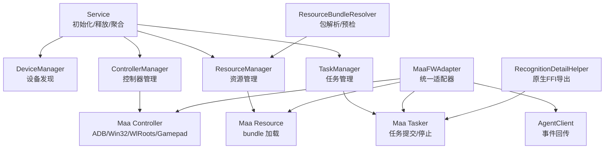
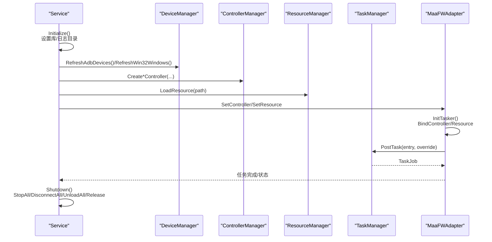
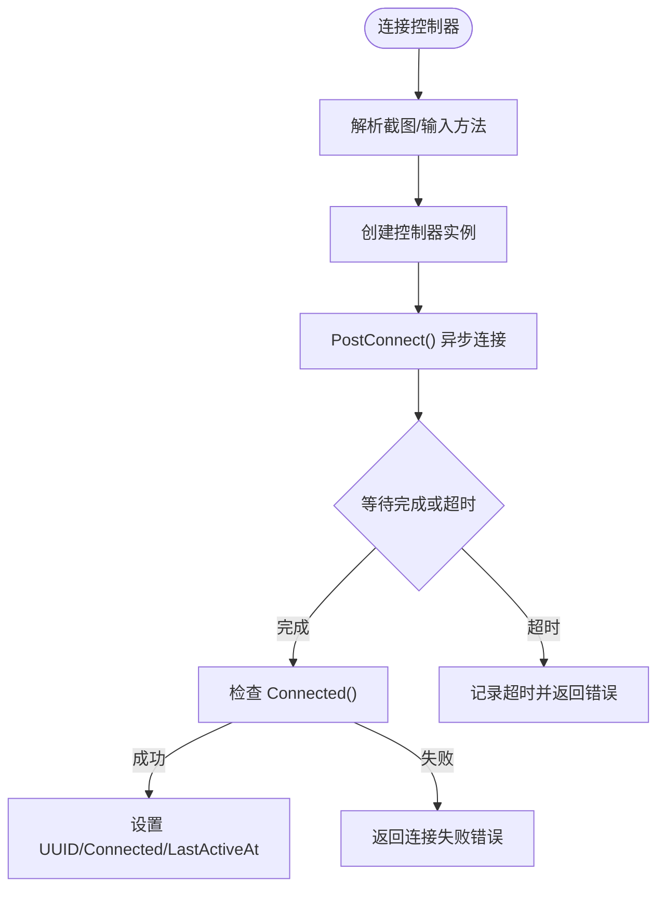
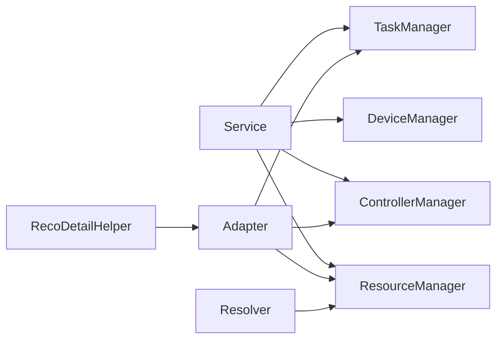

# MaaFramework集成

<cite>
**本文引用的文件**
- [controller_manager.go](file://LocalBridge/internal/mfw/controller_manager.go)
- [device_manager.go](file://LocalBridge/internal/mfw/device_manager.go)
- [task_manager.go](file://LocalBridge/internal/mfw/task_manager.go)
- [service.go](file://LocalBridge/internal/mfw/service.go)
- [resource_manager.go](file://LocalBridge/internal/mfw/resource_manager.go)
- [types.go](file://LocalBridge/internal/mfw/types.go)
- [error.go](file://LocalBridge/internal/mfw/error.go)
- [adapter.go](file://LocalBridge/internal/mfw/adapter.go)
- [reco_detail_helper.go](file://LocalBridge/internal/mfw/reco_detail_helper.go)
- [resource_bundle_resolver.go](file://LocalBridge/internal/mfw/resource_bundle_resolver.go)
- [lib_loader_unix.go](file://LocalBridge/internal/mfw/lib_loader_unix.go)
- [lib_loader_windows.go](file://LocalBridge/internal/mfw/lib_loader_windows.go)
- [path_unix.go](file://LocalBridge/internal/mfw/path_unix.go)
- [path_windows.go](file://LocalBridge/internal/mfw/path_windows.go)
</cite>

## 目录
1. [简介](#简介)
2. [项目结构](#项目结构)
3. [核心组件](#核心组件)
4. [架构总览](#架构总览)
5. [详细组件分析](#详细组件分析)
6. [依赖关系分析](#依赖关系分析)
7. [性能考量](#性能考量)
8. [故障排查指南](#故障排查指南)
9. [结论](#结论)
10. [附录](#附录)

## 简介
本文件面向希望在本地桥接服务中集成 MaaFramework Go 绑定的工程师与架构师，系统性说明控制器管理、设备发现、资源加载、任务执行、识别细节导出与原生 FFI 桥接等模块的设计与实现要点。文档同时覆盖错误处理、超时控制、并发安全与最佳实践，并提供可直接定位到源码的路径指引，便于快速落地集成。

## 项目结构
LocalBridge 内部的 MaaFramework 集成位于 internal/mfw 目录，采用“服务聚合 + 管理器分治”的组织方式：
- 服务入口：Service 负责框架初始化、释放与子系统聚合
- 设备与控制器：DeviceManager、ControllerManager 提供设备发现与控制器生命周期管理
- 资源与任务：ResourceManager、TaskManager 提供资源加载与任务提交/停止
- 统一适配器：MaaFWAdapter 提供对 Controller/Resource/Tasker/Agent 的统一封装
- 识别细节导出：reco_detail_helper 通过纯 Go FFI 访问原生 API 导出识别细节
- 资源包解析：resource_bundle_resolver 提供资源包根目录解析与预检加载
- 跨平台支持：lib_loader_*、path_* 提供动态库加载与路径处理

图表来源
- [service.go:15-34](file://LocalBridge/internal/mfw/service.go#L15-L34)
- [device_manager.go:11-25](file://LocalBridge/internal/mfw/device_manager.go#L11-L25)
- [controller_manager.go:20-31](file://LocalBridge/internal/mfw/controller_manager.go#L20-L31)
- [resource_manager.go:11-22](file://LocalBridge/internal/mfw/resource_manager.go#L11-L22)
- [task_manager.go:11-22](file://LocalBridge/internal/mfw/task_manager.go#L11-L22)
- [adapter.go:25-53](file://LocalBridge/internal/mfw/adapter.go#L25-L53)
- [reco_detail_helper.go:22-41](file://LocalBridge/internal/mfw/reco_detail_helper.go#L22-L41)
- [resource_bundle_resolver.go:27-32](file://LocalBridge/internal/mfw/resource_bundle_resolver.go#L27-L32)

章节来源
- [service.go:15-34](file://LocalBridge/internal/mfw/service.go#L15-L34)
- [device_manager.go:11-25](file://LocalBridge/internal/mfw/device_manager.go#L11-L25)
- [controller_manager.go:20-31](file://LocalBridge/internal/mfw/controller_manager.go#L20-L31)
- [resource_manager.go:11-22](file://LocalBridge/internal/mfw/resource_manager.go#L11-L22)
- [task_manager.go:11-22](file://LocalBridge/internal/mfw/task_manager.go#L11-L22)
- [adapter.go:25-53](file://LocalBridge/internal/mfw/adapter.go#L25-L53)
- [reco_detail_helper.go:22-41](file://LocalBridge/internal/mfw/reco_detail_helper.go#L22-L41)
- [resource_bundle_resolver.go:27-32](file://LocalBridge/internal/mfw/resource_bundle_resolver.go#L27-L32)

## 核心组件
- 服务管理器 Service：集中初始化/释放 MaaFramework，聚合各子系统；提供 Reload 能力
- 设备管理器 DeviceManager：列举 ADB 设备、Win32 窗口、WlRoots 合成器
- 控制器管理器 ControllerManager：创建/连接/断开控制器，执行点击/滑动/输入/截图等操作
- 资源管理器 ResourceManager：加载/卸载资源包，计算哈希，暴露资源元信息
- 任务管理器 TaskManager：提交/停止任务，维护任务状态
- 统一适配器 MaaFWAdapter：封装 Controller/Resource/Tasker/Agent 生命周期与事件回传
- 识别细节导出 RecoDetailHelper：通过 purego 调用原生 API 获取识别名称、算法、框、原始图与绘制图
- 资源包解析 Resolver：自动解析 bundle 根目录，支持多种策略与诊断输出
- 跨平台支持：lib_loader_*、path_* 处理动态库加载与路径（含 Windows 非 ASCII 路径）

章节来源
- [service.go:15-34](file://LocalBridge/internal/mfw/service.go#L15-L34)
- [device_manager.go:11-25](file://LocalBridge/internal/mfw/device_manager.go#L11-L25)
- [controller_manager.go:20-31](file://LocalBridge/internal/mfw/controller_manager.go#L20-L31)
- [resource_manager.go:11-22](file://LocalBridge/internal/mfw/resource_manager.go#L11-L22)
- [task_manager.go:11-22](file://LocalBridge/internal/mfw/task_manager.go#L11-L22)
- [adapter.go:25-53](file://LocalBridge/internal/mfw/adapter.go#L25-L53)
- [reco_detail_helper.go:22-41](file://LocalBridge/internal/mfw/reco_detail_helper.go#L22-L41)
- [resource_bundle_resolver.go:27-32](file://LocalBridge/internal/mfw/resource_bundle_resolver.go#L27-L32)
- [lib_loader_unix.go:11-18](file://LocalBridge/internal/mfw/lib_loader_unix.go#L11-L18)
- [lib_loader_windows.go:11-20](file://LocalBridge/internal/mfw/lib_loader_windows.go#L11-L20)
- [path_unix.go:7-21](file://LocalBridge/internal/mfw/path_unix.go#L7-L21)
- [path_windows.go:12-56](file://LocalBridge/internal/mfw/path_windows.go#L12-L56)

## 架构总览
下图展示从 Service 到各子系统的协作关系，以及统一适配器如何串联控制器、资源与任务执行链路。

图表来源
- [service.go:36-138](file://LocalBridge/internal/mfw/service.go#L36-L138)
- [device_manager.go:27-95](file://LocalBridge/internal/mfw/device_manager.go#L27-L95)
- [controller_manager.go:33-161](file://LocalBridge/internal/mfw/controller_manager.go#L33-L161)
- [resource_manager.go:24-64](file://LocalBridge/internal/mfw/resource_manager.go#L24-L64)
- [adapter.go:452-499](file://LocalBridge/internal/mfw/adapter.go#L452-L499)
- [task_manager.go:24-52](file://LocalBridge/internal/mfw/task_manager.go#L24-L52)

## 详细组件分析

### 控制器管理（ControllerManager）
职责
- 创建多种控制器（ADB、Win32、PlayCover、Gamepad、WlRoots），解析截图与输入方法
- 连接/断开控制器，异步连接并带超时
- 执行点击、滑动、输入文本、启动/停止应用、截图等操作
- 支持游戏手柄按键与触摸操作
- 提供状态查询、列表、清理非活跃控制器、断开全部

并发与超时
- 读写锁保护控制器表
- 连接阶段使用 Job.Wait + select 超时（约 10 秒）
- 截图前可按需禁用缓存，确保实时性

错误处理
- 统一包装为 MFWError，携带错误码与可选明细
- 对未连接、控制器不存在、连接失败等场景进行明确区分

图表来源
- [controller_manager.go:278-329](file://LocalBridge/internal/mfw/controller_manager.go#L278-L329)

章节来源
- [controller_manager.go:20-800](file://LocalBridge/internal/mfw/controller_manager.go#L20-L800)
- [types.go:45-54](file://LocalBridge/internal/mfw/types.go#L45-L54)
- [error.go:5-31](file://LocalBridge/internal/mfw/error.go#L5-L31)

### 设备管理（DeviceManager）
职责
- ADB 设备：列出设备、可用截图与输入方法
- Win32 窗口：枚举桌面窗口，提供截图与输入方法
- WlRoots：枚举可用套接字路径

注意
- 方法列表来自 MaaFramework API 的能力枚举，供前端选择

章节来源
- [device_manager.go:11-136](file://LocalBridge/internal/mfw/device_manager.go#L11-L136)

### 资源管理（ResourceManager）
职责
- 解析资源包路径，加载 bundle，计算哈希
- 提供资源获取、卸载与批量卸载
- 与资源包解析器配合，支持多种解析策略

章节来源
- [resource_manager.go:11-118](file://LocalBridge/internal/mfw/resource_manager.go#L11-L118)
- [resource_bundle_resolver.go:105-205](file://LocalBridge/internal/mfw/resource_bundle_resolver.go#L105-L205)

### 任务管理（TaskManager）
职责
- 创建 Tasker，提交任务，查询状态，停止任务
- 停止所有任务并回收资源

章节来源
- [task_manager.go:11-114](file://LocalBridge/internal/mfw/task_manager.go#L11-L114)

### 统一适配器（MaaFWAdapter）
职责
- 控制器：创建/设置控制器，连接状态管理
- 资源：加载/设置资源，节点 JSON 获取
- 任务：初始化 Tasker、提交/停止任务、识别/动作桥接
- Agent：连接/断开 Agent，注册 Tasker 事件回传
- 事件：添加/移除上下文与 Tasker 事件 Sink

并发与线程安全
- 适配器内部使用互斥锁保护状态变更
- 读多写少场景使用 RWMutex

章节来源
- [adapter.go:25-800](file://LocalBridge/internal/mfw/adapter.go#L25-L800)

### 识别细节导出（RecognitionDetailHelper）
职责
- 通过 purego 动态加载 MaaFramework 原生库
- 注册字符串/图像/矩形/图像列表等缓冲区 API
- 从 Tasker 获取识别详情：名称、算法、命中、框、原始图、绘制图
- 将图像编码为 Base64 返回前端

平台差异
- Windows 使用 LoadLibrary
- Unix 使用 Dlopen

章节来源
- [reco_detail_helper.go:1-345](file://LocalBridge/internal/mfw/reco_detail_helper.go#L1-L345)
- [lib_loader_unix.go:11-18](file://LocalBridge/internal/mfw/lib_loader_unix.go#L11-L18)
- [lib_loader_windows.go:11-20](file://LocalBridge/internal/mfw/lib_loader_windows.go#L11-L20)

### 资源包解析（ResourceBundleResolver）
职责
- 自动解析 bundle 根目录，支持多种策略：
  - 精确根目录
  - 向上回溯到 pipeline/image/model 子路径
  - 子目录唯一命中
- 提供诊断数据与错误码，便于问题定位
- 支持预检加载并计算资源哈希

章节来源
- [resource_bundle_resolver.go:105-234](file://LocalBridge/internal/mfw/resource_bundle_resolver.go#L105-L234)

### 路径与库加载（跨平台）
职责
- Windows：检测非 ASCII 路径，尝试短路径转换或切换工作目录
- Unix：直接返回原路径
- 动态库加载：Windows 使用 LoadLibrary，Unix 使用 Dlopen

章节来源
- [path_windows.go:12-56](file://LocalBridge/internal/mfw/path_windows.go#L12-L56)
- [path_unix.go:7-21](file://LocalBridge/internal/mfw/path_unix.go#L7-L21)
- [lib_loader_unix.go:11-18](file://LocalBridge/internal/mfw/lib_loader_unix.go#L11-L18)
- [lib_loader_windows.go:11-20](file://LocalBridge/internal/mfw/lib_loader_windows.go#L11-L20)

## 依赖关系分析
- Service 聚合 DeviceManager、ControllerManager、ResourceManager、TaskManager
- Adapter 在 Controller/Resource/Tasker/Agent 之间提供统一入口
- RecoDetailHelper 依赖 Adapter 的 Tasker 指针与原生库句柄
- Resolver 与 ResourceManager 协同完成资源包解析与加载
- 跨平台路径与库加载为上述组件提供基础支撑

图表来源
- [service.go:15-34](file://LocalBridge/internal/mfw/service.go#L15-L34)
- [adapter.go:25-53](file://LocalBridge/internal/mfw/adapter.go#L25-L53)
- [reco_detail_helper.go:22-41](file://LocalBridge/internal/mfw/reco_detail_helper.go#L22-L41)
- [resource_bundle_resolver.go:27-32](file://LocalBridge/internal/mfw/resource_bundle_resolver.go#L27-L32)

章节来源
- [service.go:15-34](file://LocalBridge/internal/mfw/service.go#L15-L34)
- [adapter.go:25-53](file://LocalBridge/internal/mfw/adapter.go#L25-L53)
- [reco_detail_helper.go:22-41](file://LocalBridge/internal/mfw/reco_detail_helper.go#L22-L41)
- [resource_bundle_resolver.go:27-32](file://LocalBridge/internal/mfw/resource_bundle_resolver.go#L27-L32)

## 性能考量
- 控制器连接采用异步 Job + 超时，避免阻塞主线程
- 截图支持禁用缓存以保证实时性，但会增加 CPU/GPU 开销
- 任务提交与停止使用 Job 接口，建议在业务侧做队列化与去抖
- 资源包加载支持预检与哈希校验，减少运行期失败
- 识别细节导出涉及原生库调用与图像编码，建议限制频率与批量处理

## 故障排查指南
常见错误与定位
- 控制器创建/连接失败：检查设备/窗口句柄、截图/输入方法组合、ADB 代理路径
- 资源加载失败：确认 bundle 根目录存在 pipeline 目录，路径非 ASCII 场景在 Windows 上使用短路径或切换工作目录
- 任务提交失败：确认 Tasker 已初始化、绑定资源与控制器
- Agent 连接异常：检查 Identifier、资源绑定、连接状态轮询超时

错误码与语义
- 控制器类：创建失败、未找到、连接失败、未连接
- 资源类：加载失败、未找到
- 任务类：提交失败
- 参数类：参数非法
- 未初始化：框架未初始化

章节来源
- [error.go:5-53](file://LocalBridge/internal/mfw/error.go#L5-L53)
- [controller_manager.go:278-329](file://LocalBridge/internal/mfw/controller_manager.go#L278-L329)
- [resource_manager.go:24-64](file://LocalBridge/internal/mfw/resource_manager.go#L24-L64)
- [adapter.go:452-499](file://LocalBridge/internal/mfw/adapter.go#L452-L499)

## 结论
该集成以 Service 为中心，围绕控制器、设备、资源、任务四大域构建清晰的分层与职责边界；通过 MaaFWAdapter 提供统一的生命周期与事件回传能力；借助 RecoDetailHelper 与 Resolver 完成识别细节导出与资源包解析。整体设计兼顾易用性与可维护性，适合在本地桥接服务中稳定集成 MaaFramework 的核心能力。

## 附录
- 初始化与重载
  - 参考：[service.go:36-138](file://LocalBridge/internal/mfw/service.go#L36-L138)
- 控制器创建与连接
  - 参考：[controller_manager.go:33-161](file://LocalBridge/internal/mfw/controller_manager.go#L33-L161)
- 资源加载与解析
  - 参考：[resource_manager.go:24-64](file://LocalBridge/internal/mfw/resource_manager.go#L24-L64)、[resource_bundle_resolver.go:105-205](file://LocalBridge/internal/mfw/resource_bundle_resolver.go#L105-L205)
- 任务提交与停止
  - 参考：[task_manager.go:24-90](file://LocalBridge/internal/mfw/task_manager.go#L24-L90)
- 识别细节导出
  - 参考：[reco_detail_helper.go:168-267](file://LocalBridge/internal/mfw/reco_detail_helper.go#L168-L267)
- 跨平台路径与库加载
  - 参考：[path_windows.go:22-56](file://LocalBridge/internal/mfw/path_windows.go#L22-L56)、[lib_loader_unix.go:11-18](file://LocalBridge/internal/mfw/lib_loader_unix.go#L11-L18)、[lib_loader_windows.go:11-20](file://LocalBridge/internal/mfw/lib_loader_windows.go#L11-L20)