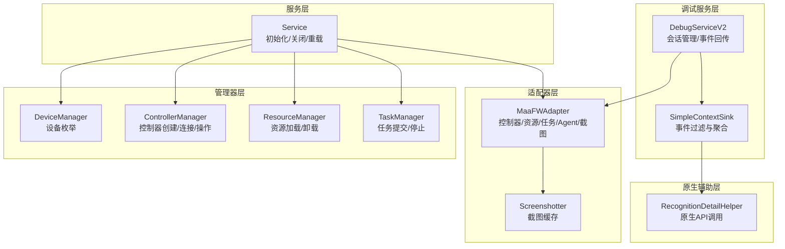
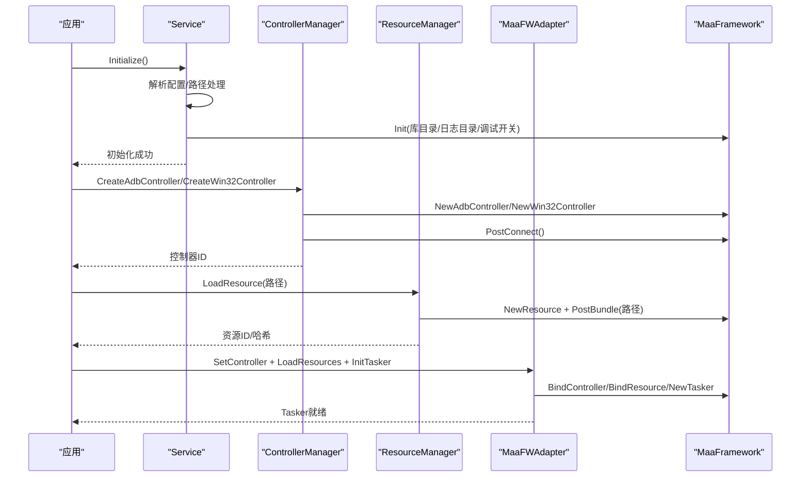
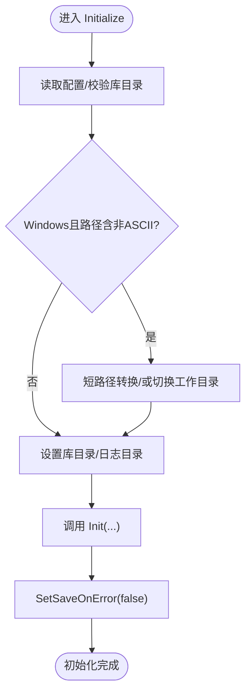
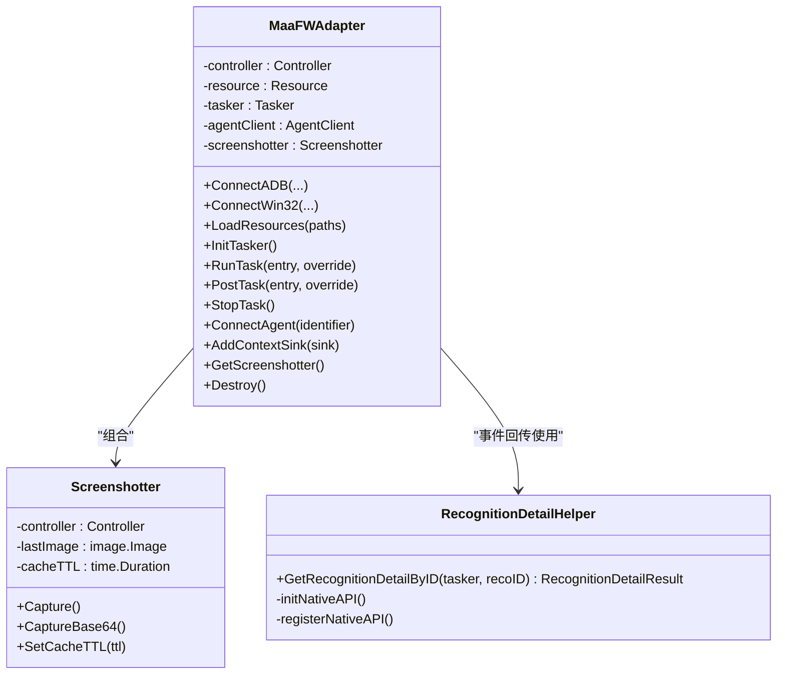
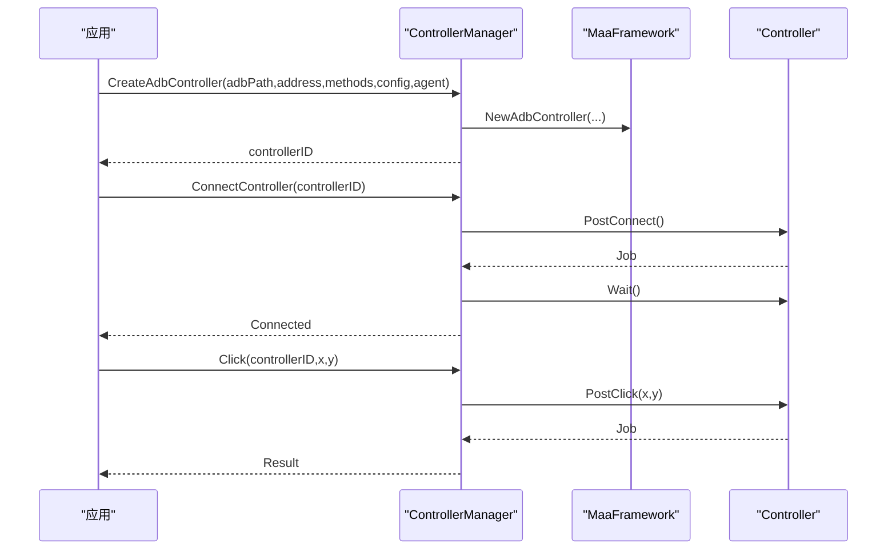
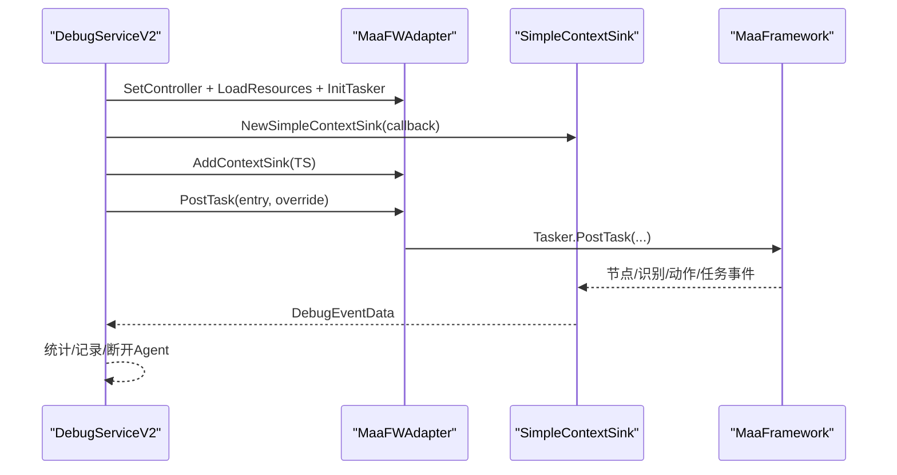
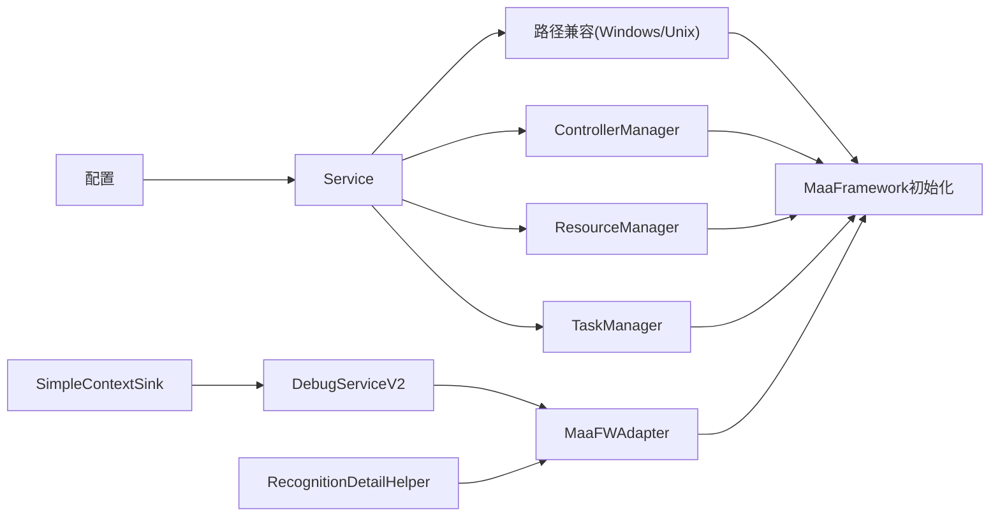

# MaaFramework集成

<cite>
**本文档引用的文件**
- [service.go](file://LocalBridge/internal/mfw/service.go)
- [adapter.go](file://LocalBridge/internal/mfw/adapter.go)
- [types.go](file://LocalBridge/internal/mfw/types.go)
- [lib_loader_windows.go](file://LocalBridge/internal/mfw/lib_loader_windows.go)
- [lib_loader_unix.go](file://LocalBridge/internal/mfw/lib_loader_unix.go)
- [error.go](file://LocalBridge/internal/mfw/error.go)
- [device_manager.go](file://LocalBridge/internal/mfw/device_manager.go)
- [resource_manager.go](file://LocalBridge/internal/mfw/resource_manager.go)
- [task_manager.go](file://LocalBridge/internal/mfw/task_manager.go)
- [controller_manager.go](file://LocalBridge/internal/mfw/controller_manager.go)
- [debug_service_v2.go](file://LocalBridge/internal/mfw/debug_service_v2.go)
- [event_sink.go](file://LocalBridge/internal/mfw/event_sink.go)
- [reco_detail_helper.go](file://LocalBridge/internal/mfw/reco_detail_helper.go)
- [path_windows.go](file://LocalBridge/internal/mfw/path_windows.go)
- [path_unix.go](file://LocalBridge/internal/mfw/path_unix.go)
</cite>

## 目录
1. [简介](#简介)
2. [项目结构](#项目结构)
3. [核心组件](#核心组件)
4. [架构总览](#架构总览)
5. [详细组件分析](#详细组件分析)
6. [依赖关系分析](#依赖关系分析)
7. [性能考量](#性能考量)
8. [故障排除指南](#故障排除指南)
9. [结论](#结论)

## 简介
本文件面向MaaFramework集成，围绕LocalBridge模块中的MFW子系统，系统性阐述以下主题：
- MFW服务初始化流程：库加载、版本检查、依赖验证、路径兼容处理
- 适配器模式实现：Go与C/C++库桥接、数据类型转换、内存管理策略
- 协议处理器能力：设备控制、OCR识别、任务执行、事件回调与调试
- 错误处理与异常恢复：库版本不匹配、运行时错误、资源释放
- 调试技巧与故障排除方法

## 项目结构
MFW集成位于LocalBridge内部，采用分层设计：
- 服务层：统一管理设备、控制器、资源、任务与框架生命周期
- 适配器层：封装MaaFramework Go绑定，屏蔽底层控制器/资源/任务细节
- 管理器层：设备管理、控制器管理、资源管理、任务管理
- 调试服务层：基于适配器的调试会话与事件回传
- 原生辅助层：通过纯Go方式调用原生库以获取识别详情等增强信息

**图表来源**
- [service.go:15-218](file://LocalBridge/internal/mfw/service.go#L15-L218)
- [adapter.go:23-703](file://LocalBridge/internal/mfw/adapter.go#L23-L703)
- [device_manager.go:11-110](file://LocalBridge/internal/mfw/device_manager.go#L11-L110)
- [controller_manager.go:20-994](file://LocalBridge/internal/mfw/controller_manager.go#L20-L994)
- [resource_manager.go:13-158](file://LocalBridge/internal/mfw/resource_manager.go#L13-L158)
- [task_manager.go:11-114](file://LocalBridge/internal/mfw/task_manager.go#L11-L114)
- [debug_service_v2.go:60-472](file://LocalBridge/internal/mfw/debug_service_v2.go#L60-L472)
- [event_sink.go:61-520](file://LocalBridge/internal/mfw/event_sink.go#L61-L520)
- [reco_detail_helper.go:85-345](file://LocalBridge/internal/mfw/reco_detail_helper.go#L85-L345)

**章节来源**
- [service.go:15-218](file://LocalBridge/internal/mfw/service.go#L15-L218)
- [adapter.go:23-703](file://LocalBridge/internal/mfw/adapter.go#L23-L703)

## 核心组件
- MFW服务管理器：负责MaaFramework初始化、关闭、重载，协调各子系统生命周期
- MaaFW适配器：统一控制器、资源、任务、Agent与截图的管理与调用
- 设备/控制器/资源/任务管理器：提供设备枚举、控制器创建/连接/操作、资源加载/卸载、任务提交/停止
- 调试服务V2：基于适配器的调试会话，事件回传与节点识别详情增强
- 原生识别详情助手：通过纯Go调用原生库获取识别算法、框选区域、原始图像与绘制图像

**章节来源**
- [service.go:15-218](file://LocalBridge/internal/mfw/service.go#L15-L218)
- [adapter.go:23-703](file://LocalBridge/internal/mfw/adapter.go#L23-L703)
- [device_manager.go:11-110](file://LocalBridge/internal/mfw/device_manager.go#L11-L110)
- [controller_manager.go:20-994](file://LocalBridge/internal/mfw/controller_manager.go#L20-L994)
- [resource_manager.go:13-158](file://LocalBridge/internal/mfw/resource_manager.go#L13-L158)
- [task_manager.go:11-114](file://LocalBridge/internal/mfw/task_manager.go#L11-L114)
- [debug_service_v2.go:60-472](file://LocalBridge/internal/mfw/debug_service_v2.go#L60-L472)
- [event_sink.go:61-520](file://LocalBridge/internal/mfw/event_sink.go#L61-L520)
- [reco_detail_helper.go:85-345](file://LocalBridge/internal/mfw/reco_detail_helper.go#L85-L345)

## 架构总览
MFW集成采用“服务-适配器-管理器-调试”的分层架构，服务层统一调度，适配器层封装底层框架，管理器层提供具体能力，调试服务层提供可视化与可观测性。

**图表来源**
- [service.go:36-138](file://LocalBridge/internal/mfw/service.go#L36-L138)
- [controller_manager.go:33-162](file://LocalBridge/internal/mfw/controller_manager.go#L33-L162)
- [resource_manager.go:26-105](file://LocalBridge/internal/mfw/resource_manager.go#L26-L105)
- [adapter.go:308-357](file://LocalBridge/internal/mfw/adapter.go#L308-L357)

## 详细组件分析

### 服务初始化与生命周期
- 初始化流程要点：
  - 读取全局配置，校验库目录与日志目录
  - Windows路径兼容：非ASCII路径转换为短路径或切换工作目录
  - 调用MaaFramework初始化，设置日志级别、保存截图、调试模式
  - 设置SaveOnError为false，避免错误时保存截图
  - 初始化完成后标记initialized
- 关闭流程要点：
  - 停止所有任务、断开所有控制器、卸载所有资源
  - 调用Release释放框架资源
  - 清理状态
- 重载流程：先Shutdown再Initialize，用于配置变更后的热更新

**图表来源**
- [service.go:36-138](file://LocalBridge/internal/mfw/service.go#L36-L138)
- [path_windows.go:22-56](file://LocalBridge/internal/mfw/path_windows.go#L22-L56)
- [path_unix.go:17-21](file://LocalBridge/internal/mfw/path_unix.go#L17-L21)

**章节来源**
- [service.go:36-138](file://LocalBridge/internal/mfw/service.go#L36-L138)
- [service.go:140-170](file://LocalBridge/internal/mfw/service.go#L140-L170)
- [service.go:199-217](file://LocalBridge/internal/mfw/service.go#L199-L217)

### 适配器模式与桥接
- 适配器职责：
  - 统一控制器、资源、任务、Agent与截图的生命周期与调用
  - 提供同步/异步任务提交、停止、事件回调注册
  - 管理控制器所有权（自建/借用），避免重复销毁
- Go与C/C++桥接：
  - 通过MaaFramework Go绑定直接调用底层C/C++接口
  - 原生识别详情助手通过purego加载原生库并注册符号，实现对识别算法、框选区域、原始图像与绘制图像的提取
- 数据类型转换与内存管理：
  - 图像数据在Go与原生之间传递时进行格式转换（如BGR/BGRA到RGBA）
  - 通过缓冲区与句柄管理原生内存，确保及时释放
  - 截图缓存降低频繁截图带来的性能开销

**图表来源**
- [adapter.go:23-703](file://LocalBridge/internal/mfw/adapter.go#L23-L703)
- [reco_detail_helper.go:85-345](file://LocalBridge/internal/mfw/reco_detail_helper.go#L85-L345)

**章节来源**
- [adapter.go:23-703](file://LocalBridge/internal/mfw/adapter.go#L23-L703)
- [reco_detail_helper.go:85-345](file://LocalBridge/internal/mfw/reco_detail_helper.go#L85-L345)

### 设备与控制器管理
- 设备管理：
  - ADB设备枚举与可用截图/输入方法列表
  - Win32窗口枚举与可用截图/输入方法列表
- 控制器管理：
  - 创建ADB/Win32/PlayCover/Gamepad控制器
  - 连接控制器并等待完成，超时处理
  - 执行点击、滑动、输入文本、启动/停止应用、滚动、手柄按键与触摸等操作
  - 截图支持目标长边/短边缩放与原始尺寸模式
  - 定期清理非活跃控制器，避免资源泄露

**图表来源**
- [controller_manager.go:33-300](file://LocalBridge/internal/mfw/controller_manager.go#L33-L300)
- [controller_manager.go:516-585](file://LocalBridge/internal/mfw/controller_manager.go#L516-L585)

**章节来源**
- [device_manager.go:26-94](file://LocalBridge/internal/mfw/device_manager.go#L26-L94)
- [controller_manager.go:33-300](file://LocalBridge/internal/mfw/controller_manager.go#L33-L300)
- [controller_manager.go:516-585](file://LocalBridge/internal/mfw/controller_manager.go#L516-L585)

### 资源与任务管理
- 资源管理：
  - 资源包加载（支持Windows路径兼容）
  - 获取资源哈希，便于缓存与一致性校验
  - 卸载单个/全部资源，确保资源句柄释放
- 任务管理：
  - 提交任务并分配任务ID
  - 查询任务状态
  - 停止单个/全部任务
  - 任务完成后清理Tasker实例

**章节来源**
- [resource_manager.go:26-105](file://LocalBridge/internal/mfw/resource_manager.go#L26-L105)
- [resource_manager.go:120-158](file://LocalBridge/internal/mfw/resource_manager.go#L120-L158)
- [task_manager.go:24-90](file://LocalBridge/internal/mfw/task_manager.go#L24-L90)
- [task_manager.go:92-114](file://LocalBridge/internal/mfw/task_manager.go#L92-L114)

### 调试服务与事件回传
- 调试会话：
  - 创建会话时绑定控制器、加载资源、初始化Tasker、可选连接Agent
  - 事件回传：节点开始/成功/失败、识别开始/成功/失败、动作开始/成功/失败、任务开始/成功/失败、资源加载事件
  - 会话内统计节点执行次数、耗时，并在任务完成后断开Agent
- 事件过滤：
  - 简化版事件接收器仅转发关键事件，减少噪声
  - 支持启用/禁用、重置计数器、设置截图器引用

**图表来源**
- [debug_service_v2.go:87-171](file://LocalBridge/internal/mfw/debug_service_v2.go#L87-L171)
- [debug_service_v2.go:220-277](file://LocalBridge/internal/mfw/debug_service_v2.go#L220-L277)
- [event_sink.go:108-167](file://LocalBridge/internal/mfw/event_sink.go#L108-L167)

**章节来源**
- [debug_service_v2.go:87-171](file://LocalBridge/internal/mfw/debug_service_v2.go#L87-L171)
- [debug_service_v2.go:220-277](file://LocalBridge/internal/mfw/debug_service_v2.go#L220-L277)
- [event_sink.go:61-520](file://LocalBridge/internal/mfw/event_sink.go#L61-L520)

### 原生识别详情增强
- 目标：在调试过程中获取识别算法、框选区域、原始图像与绘制图像，提升可观测性
- 实现：
  - 通过purego按平台加载原生库（Windows/Darwin/Linux）
  - 注册字符串缓冲、图像缓冲、图像列表缓冲、矩形等原生API
  - 通过Tasker句柄与识别ID查询识别详情，转换为Go侧数据结构
  - 将图像编码为Base64以便前端展示

**章节来源**
- [reco_detail_helper.go:85-345](file://LocalBridge/internal/mfw/reco_detail_helper.go#L85-L345)

## 依赖关系分析
- 平台库加载：
  - Windows：使用syscall.LoadLibrary加载DLL
  - Unix：使用purego.Dlopen加载SO/DYLIB
- 路径兼容：
  - Windows：非ASCII路径转换为短路径；若失败则切换工作目录至库目录
  - Unix：直接返回原路径
- 错误码与错误类型：
  - 预定义错误码覆盖控制器、连接、截图、操作、任务、资源、参数、设备、未初始化、OCR资源配置等场景
  - 自定义MFWError结构体，便于序列化与前端展示

**图表来源**
- [service.go:36-138](file://LocalBridge/internal/mfw/service.go#L36-L138)
- [lib_loader_windows.go:11-21](file://LocalBridge/internal/mfw/lib_loader_windows.go#L11-L21)
- [lib_loader_unix.go:11-19](file://LocalBridge/internal/mfw/lib_loader_unix.go#L11-L19)
- [path_windows.go:22-56](file://LocalBridge/internal/mfw/path_windows.go#L22-L56)
- [path_unix.go:17-21](file://LocalBridge/internal/mfw/path_unix.go#L17-L21)

**章节来源**
- [error.go:5-53](file://LocalBridge/internal/mfw/error.go#L5-L53)
- [lib_loader_windows.go:11-21](file://LocalBridge/internal/mfw/lib_loader_windows.go#L11-L21)
- [lib_loader_unix.go:11-19](file://LocalBridge/internal/mfw/lib_loader_unix.go#L11-L19)
- [path_windows.go:12-56](file://LocalBridge/internal/mfw/path_windows.go#L12-L56)
- [path_unix.go:7-21](file://LocalBridge/internal/mfw/path_unix.go#L7-L21)

## 性能考量
- 截图缓存：截图器默认缓存100ms，减少重复截图开销
- 任务并发：任务管理器为每个任务创建独立Tasker实例，避免阻塞
- 资源卸载：资源管理器在卸载时销毁句柄，防止内存泄漏
- 控制器清理：定期清理非活跃控制器，降低系统负担
- 原生API延迟：识别详情助手按需初始化原生库，避免不必要的开销

[本节为通用指导，无需特定文件引用]

## 故障排除指南
- 库版本不匹配：
  - 现象：初始化时panic并提示库版本不匹配
  - 处理：更新MaaFramework到最新版本，参考初始化错误提示中的下载链接
- 路径问题（Windows）：
  - 现象：中文路径导致加载失败
  - 处理：优先尝试短路径转换；若失败，切换工作目录至库目录后再初始化
- 控制器连接失败：
  - 现象：PostConnect超时或连接状态异常
  - 处理：检查ADB/Win32权限、代理/驱动、输入法/截图方法配置
- 资源加载失败：
  - 现象：PostBundle失败或返回错误
  - 处理：确认资源路径存在且可访问，必要时切换工作目录
- 任务提交/执行失败：
  - 现象：提交任务失败或任务状态异常
  - 处理：检查Tasker初始化、控制器/资源绑定状态；查看事件回传中的失败节点
- Agent连接异常：
  - 现象：Agent连接超时或状态异常
  - 处理：确认Agent标识符正确，服务端可达；必要时手动断开并重连

**章节来源**
- [service.go:36-138](file://LocalBridge/internal/mfw/service.go#L36-L138)
- [controller_manager.go:249-300](file://LocalBridge/internal/mfw/controller_manager.go#L249-L300)
- [resource_manager.go:26-105](file://LocalBridge/internal/mfw/resource_manager.go#L26-L105)
- [task_manager.go:24-90](file://LocalBridge/internal/mfw/task_manager.go#L24-L90)
- [debug_service_v2.go:238-243](file://LocalBridge/internal/mfw/debug_service_v2.go#L238-L243)

## 结论
MaaFramework集成通过清晰的服务-适配器-管理器-调试分层，实现了对设备控制、资源管理、任务执行与事件可观测性的完整覆盖。适配器模式有效屏蔽了Go与C/C++之间的差异，配合原生API增强识别详情，显著提升了调试体验。完善的错误处理与资源管理策略保障了系统的稳定性与可维护性。