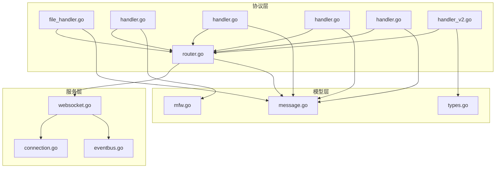
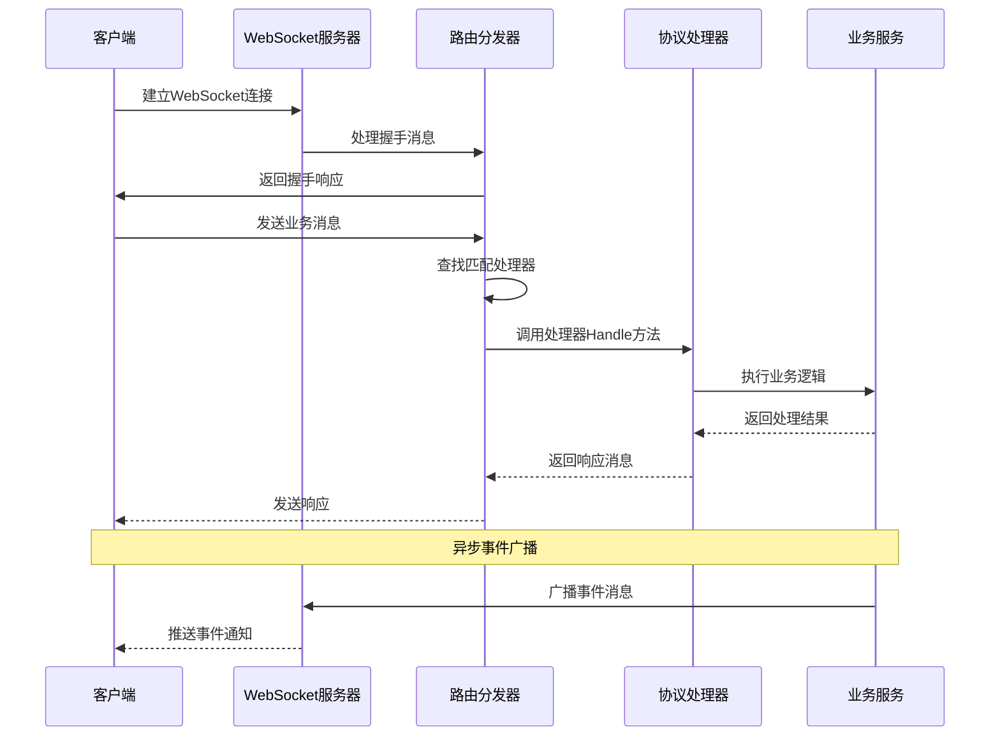
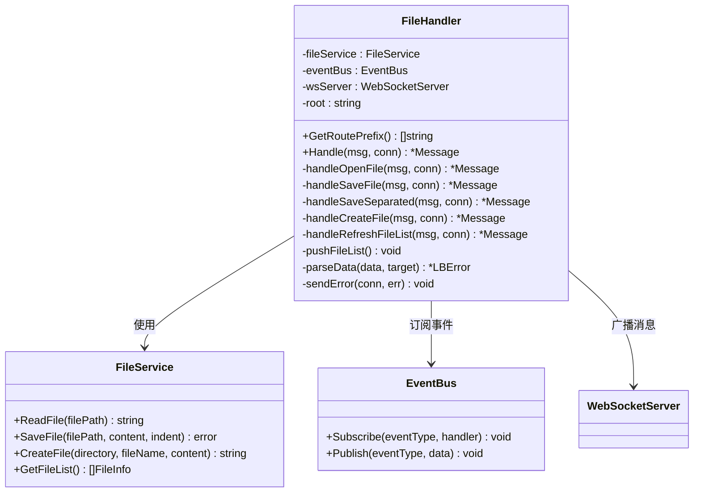
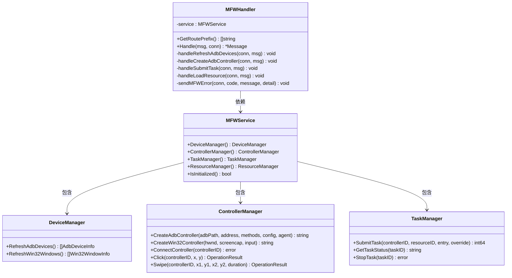
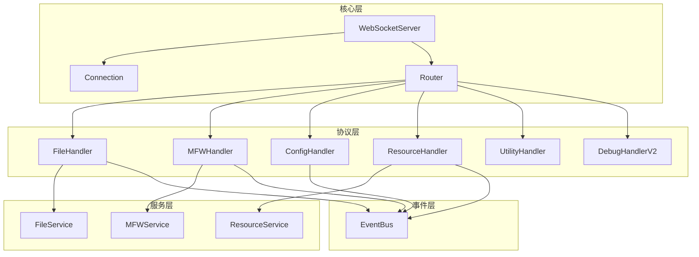
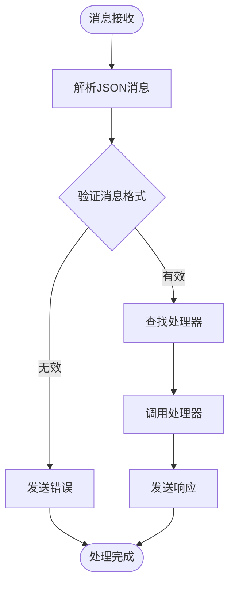

# WebSocket通信协议

<cite>
**本文档引用的文件**
- [router.go](file://LocalBridge/internal/router/router.go)
- [websocket.go](file://LocalBridge/internal/server/websocket.go)
- [connection.go](file://LocalBridge/internal/server/connection.go)
- [message.go](file://LocalBridge/pkg/models/message.go)
- [file_handler.go](file://LocalBridge/internal/protocol/file/file_handler.go)
- [handler.go](file://LocalBridge/internal/protocol/mfw/handler.go)
- [handler.go](file://LocalBridge/internal/protocol/config/handler.go)
- [handler.go](file://LocalBridge/internal/protocol/resource/handler.go)
- [handler.go](file://LocalBridge/internal/protocol/utility/handler.go)
- [handler_v2.go](file://LocalBridge/internal/protocol/debug/handler_v2.go)
- [types.go](file://LocalBridge/internal/mfw/types.go)
- [mfw.go](file://LocalBridge/pkg/models/mfw.go)
- [eventbus.go](file://LocalBridge/internal/eventbus/eventbus.go)
- [10.通信协议.md](file://docsite/docs/01.指南/100.其他/10.通信协议.md)
</cite>

## 目录
1. [简介](#简介)
2. [项目结构](#项目结构)
3. [核心组件](#核心组件)
4. [架构概览](#架构概览)
5. [详细组件分析](#详细组件分析)
6. [依赖关系分析](#依赖关系分析)
7. [性能考虑](#性能考虑)
8. [故障排除指南](#故障排除指南)
9. [结论](#结论)
10. [附录](#附录)

## 简介

LocalBridge WebSocket通信协议是MaaPipelineEditor（MPE）的核心通信基础设施，基于WebSocket协议实现编辑器与本地服务之间的实时双向通信。该协议采用JSON格式的消息传递，支持多种业务协议处理器，包括文件协议、MFW协议、配置协议、资源协议等。

协议设计遵循模块化原则，通过路由分发机制实现不同功能模块的解耦，支持版本握手、消息路由、错误处理、事件广播等核心功能。

## 项目结构

LocalBridge项目的通信协议相关文件组织结构如下：



**图表来源**
- [router.go:1-151](file://LocalBridge/internal/router/router.go#L1-L151)
- [websocket.go:1-179](file://LocalBridge/internal/server/websocket.go#L1-L179)

**章节来源**
- [router.go:1-151](file://LocalBridge/internal/router/router.go#L1-L151)
- [websocket.go:1-179](file://LocalBridge/internal/server/websocket.go#L1-L179)

## 核心组件

### WebSocket服务器

WebSocket服务器是整个通信系统的基础，负责处理客户端连接、消息转发和连接生命周期管理。

**主要功能**：
- WebSocket连接升级和管理
- 连接注册和注销
- 消息广播和分发
- 连接状态监控

**章节来源**
- [websocket.go:35-93](file://LocalBridge/internal/server/websocket.go#L35-L93)
- [connection.go:12-29](file://LocalBridge/internal/server/connection.go#L12-L29)

### 路由分发器

路由分发器实现了基于路径的协议处理器注册和分发机制，支持精确匹配和前缀匹配两种模式。

**核心特性**：
- 处理器注册机制
- 路由查找算法
- 版本握手处理
- 错误消息处理

**章节来源**
- [router.go:28-93](file://LocalBridge/internal/router/router.go#L28-L93)

### 协议处理器接口

所有协议处理器都实现了统一的Handler接口，确保了系统的可扩展性和一致性。

**接口规范**：
- GetRoutePrefix(): 返回处理的路由前缀列表
- Handle(msg, conn): 处理具体的消息逻辑

**章节来源**
- [router.go:19-26](file://LocalBridge/internal/router/router.go#L19-L26)

## 架构概览

LocalBridge的WebSocket通信协议采用分层架构设计，各层职责明确，耦合度低。



**图表来源**
- [websocket.go:108-151](file://LocalBridge/internal/server/websocket.go#L108-L151)
- [router.go:49-76](file://LocalBridge/internal/router/router.go#L49-L76)

## 详细组件分析

### 文件协议处理器

文件协议处理器负责处理与文件相关的所有WebSocket消息，包括文件读取、保存、创建等功能。



**图表来源**
- [file_handler.go:14-35](file://LocalBridge/internal/protocol/file/file_handler.go#L14-L35)
- [file_handler.go:249-285](file://LocalBridge/internal/protocol/file/file_handler.go#L249-L285)

**路由前缀**：
- `/etl/open_file` - 打开文件
- `/etl/save_file` - 保存文件
- `/etl/save_separated` - 分离保存
- `/etl/create_file` - 创建文件
- `/etl/refresh_file_list` - 刷新文件列表

**消息格式**：
- 请求消息：包含文件路径和内容数据
- 响应消息：包含文件内容或操作确认

**章节来源**
- [file_handler.go:37-64](file://LocalBridge/internal/protocol/file/file_handler.go#L37-L64)
- [file_handler.go:66-137](file://LocalBridge/internal/protocol/file/file_handler.go#L66-L137)

### MFW协议处理器

MFW（MaaFramework）协议处理器是系统的核心功能模块，负责与MaaFramework框架交互，提供设备管理、控制器操作、任务执行等功能。



**图表来源**
- [handler.go:11-21](file://LocalBridge/internal/protocol/mfw/handler.go#L11-L21)
- [types.go:40-70](file://LocalBridge/internal/mfw/types.go#L40-L70)

**路由前缀**：
- `/etl/mfw/` - MFW相关所有路由的前缀

**支持的操作**：
- 设备管理：ADB设备刷新、Win32窗口刷新
- 控制器操作：创建连接、点击、滑动、输入文本等
- 任务管理：提交任务、查询状态、停止任务
- 资源管理：加载资源、注册自定义识别

**章节来源**
- [handler.go:23-117](file://LocalBridge/internal/protocol/mfw/handler.go#L23-L117)
- [types.go:1-124](file://LocalBridge/internal/mfw/types.go#L1-L124)

### 配置协议处理器

配置协议处理器负责处理系统配置的获取、设置和重载操作。

**路由前缀**：
- `/etl/config/` - 配置相关所有路由的前缀

**支持的操作**：
- 获取配置：`/etl/config/get` - 获取当前配置
- 设置配置：`/etl/config/set` - 更新配置
- 重载配置：`/etl/config/reload` - 重载配置文件

**章节来源**
- [handler.go:20-47](file://LocalBridge/internal/protocol/config/handler.go#L20-L47)

### 资源协议处理器

资源协议处理器负责处理图片资源的获取和管理。

**路由前缀**：
- `/etl/get_image` - 获取单张图片
- `/etl/get_images` - 批量获取图片
- `/etl/get_image_list` - 获取图片列表
- `/etl/refresh_resources` - 刷新资源列表

**章节来源**
- [handler.go:45-69](file://LocalBridge/internal/protocol/resource/handler.go#L45-L69)

### 工具协议处理器

工具协议处理器提供各种辅助功能，包括OCR识别、图片路径解析、日志文件打开等。

**路由前缀**：
- `/etl/utility/` - 工具相关所有路由的前缀

**支持的功能**：
- OCR识别：`/etl/utility/ocr_recognize`
- 图片路径解析：`/etl/utility/resolve_image_path`
- 打开日志：`/etl/utility/open_log`

**章节来源**
- [handler.go:38-65](file://LocalBridge/internal/protocol/utility/handler.go#L38-L65)

### 调试协议处理器V2

调试协议处理器V2提供了高级的调试功能，支持会话管理和实时调试控制。

**路由前缀**：
- `/mpe/debug/` - 调试相关所有路由的前缀

**支持的功能**：
- 会话管理：创建、销毁、列出、获取会话
- 调试控制：启动、运行、停止调试
- 数据查询：获取节点数据、截图

**章节来源**
- [handler_v2.go:30-79](file://LocalBridge/internal/protocol/debug/handler_v2.go#L30-L79)

## 依赖关系分析

### 组件耦合度分析



**图表来源**
- [websocket.go:35-58](file://LocalBridge/internal/server/websocket.go#L35-L58)
- [router.go:28-47](file://LocalBridge/internal/router/router.go#L28-L47)

### 依赖注入模式

系统采用了依赖注入的设计模式，通过构造函数参数传递依赖关系，提高了代码的可测试性和可维护性。

**依赖注入示例**：
- FileHandler依赖FileService、EventBus、WebSocketServer
- MFWHandler依赖MFWService
- ResourceHandler依赖ResourceService、EventBus、WebSocketServer

**章节来源**
- [file_handler.go:22-35](file://LocalBridge/internal/protocol/file/file_handler.go#L22-L35)
- [handler.go:16-21](file://LocalBridge/internal/protocol/mfw/handler.go#L16-L21)

## 性能考虑

### 连接管理优化

系统实现了高效的连接管理机制，包括连接池、消息队列和异步处理。

**性能特性**：
- 连接池管理：支持多客户端并发连接
- 消息队列：使用缓冲通道避免阻塞
- 异步处理：事件驱动的消息处理模式

### 内存管理



**图表来源**
- [router.go:49-76](file://LocalBridge/internal/router/router.go#L49-L76)

### 错误处理策略

系统实现了多层次的错误处理机制，确保服务的稳定性和可靠性。

**错误处理层次**：
- 消息解析错误：返回标准错误格式
- 处理器未找到：记录警告并返回错误
- 业务逻辑错误：包装为LBError类型
- 网络传输错误：连接自动重置

## 故障排除指南

### 常见问题诊断

**连接问题**：
1. 检查WebSocket服务器是否正常启动
2. 验证端口配置和防火墙设置
3. 确认客户端连接URL格式正确

**消息处理问题**：
1. 验证消息格式符合JSON规范
2. 检查路由路径是否正确
3. 确认处理器已正确注册

**章节来源**
- [websocket.go:66-93](file://LocalBridge/internal/server/websocket.go#L66-L93)
- [router.go:95-105](file://LocalBridge/internal/router/router.go#L95-L105)

### 日志分析

系统提供了详细的日志记录机制，便于问题诊断和性能监控。

**日志级别**：
- Info：一般信息和状态变更
- Warn：警告信息和潜在问题
- Error：错误信息和异常情况

**章节来源**
- [websocket.go:123-136](file://LocalBridge/internal/server/websocket.go#L123-L136)
- [router.go:62-64](file://LocalBridge/internal/router/router.go#L62-L64)

## 结论

LocalBridge WebSocket通信协议通过模块化设计和清晰的分层架构，实现了高效、可靠的实时通信功能。协议支持多种业务场景，具有良好的扩展性和维护性。

**主要优势**：
- 模块化设计，职责分离明确
- 路由分发机制，支持灵活扩展
- 完善的错误处理和日志系统
- 支持异步事件广播和实时通知

**未来发展方向**：
- 增强协议版本管理机制
- 优化大规模连接的性能表现
- 扩展更多业务协议处理器
- 提供更丰富的调试和监控功能

## 附录

### 消息格式规范

所有WebSocket消息采用统一的JSON格式：

```json
{
  "path": "/api/route_name",
  "data": {
    // 路由特定的数据
  }
}
```

**字段说明**：
- `path`：路由路径，用于标识消息类型
- `data`：消息携带的数据载荷

### 协议版本管理

系统实现了版本握手机制，确保客户端和服务端的兼容性。

**版本信息**：
- 当前协议版本：0.7.4
- 版本握手路由：`/system/handshake`
- 版本响应路由：`/system/handshake/response`

### 客户端集成示例

基于现有协议实现的最小化服务端示例：

```javascript
// JavaScript WebSocket客户端示例
const socket = new WebSocket('ws://localhost:9066');

socket.onopen = function(event) {
    console.log('连接已建立');
    // 发送版本握手
    socket.send(JSON.stringify({
        path: '/system/handshake',
        data: {
            protocol_version: '0.7.4'
        }
    }));
};

socket.onmessage = function(event) {
    const message = JSON.parse(event.data);
    console.log('收到消息:', message.path);
};
```

**章节来源**
- [10.通信协议.md:37-56](file://docsite/docs/01.指南/100.其他/10.通信协议.md#L37-L56)
- [websocket.go:15-22](file://LocalBridge/internal/server/websocket.go#L15-L22)