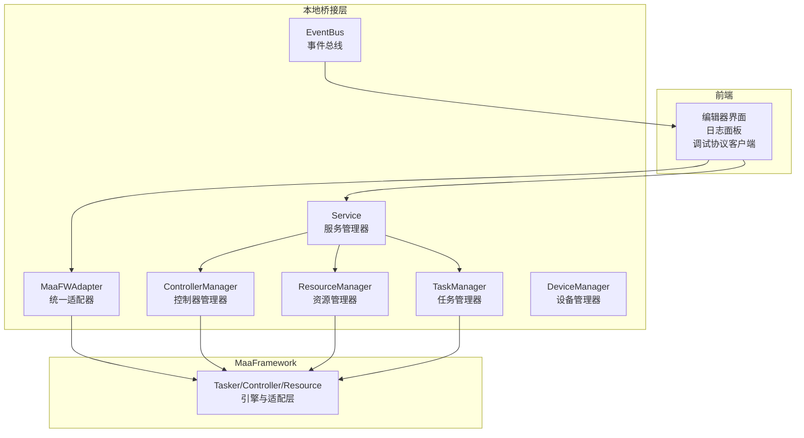
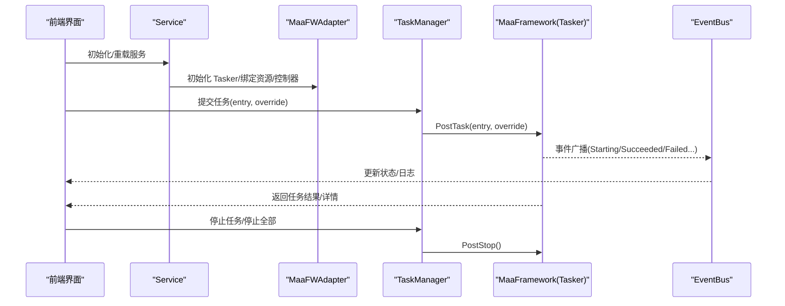
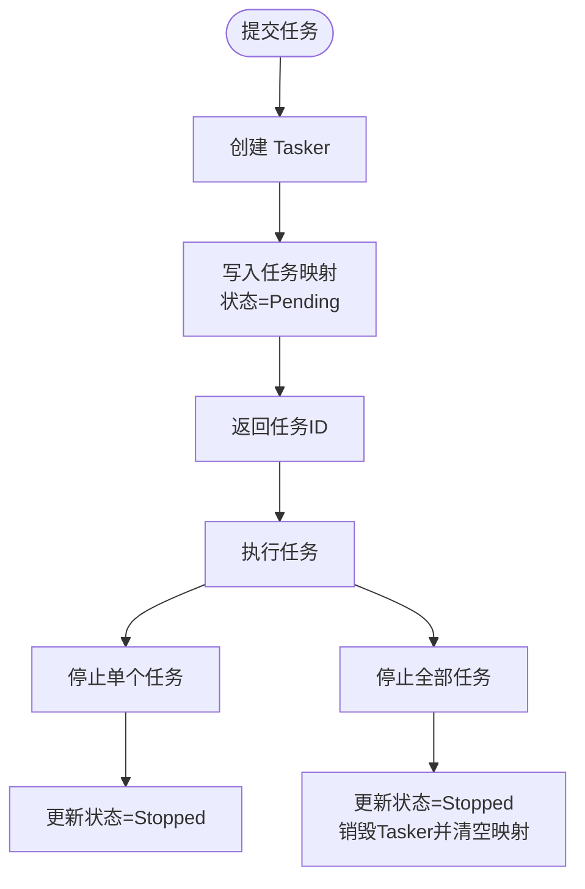
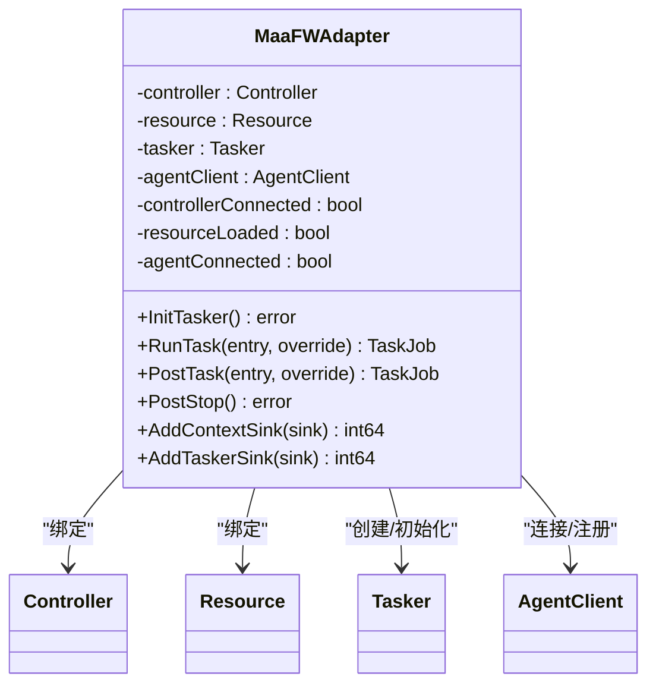
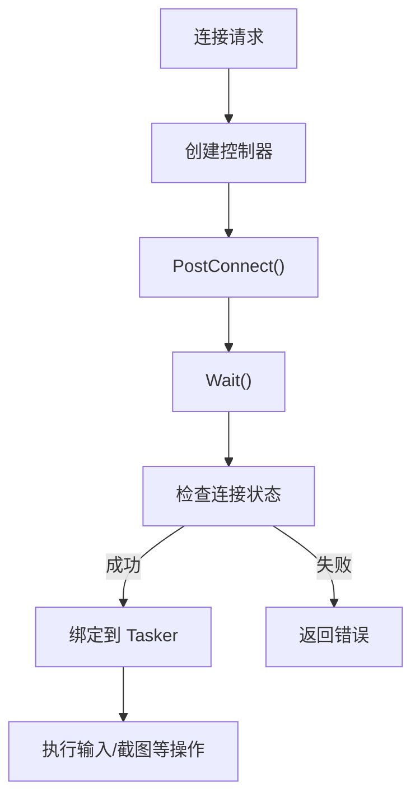
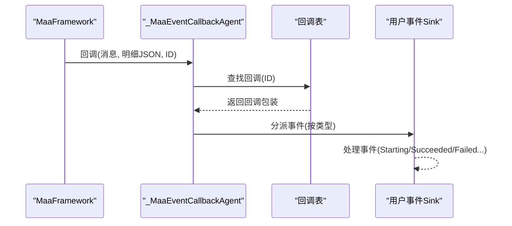
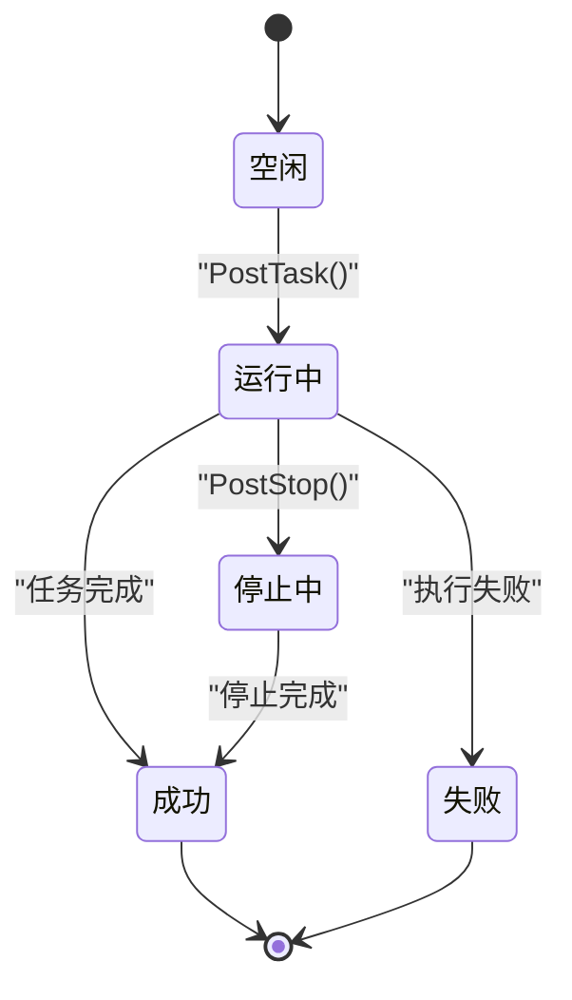
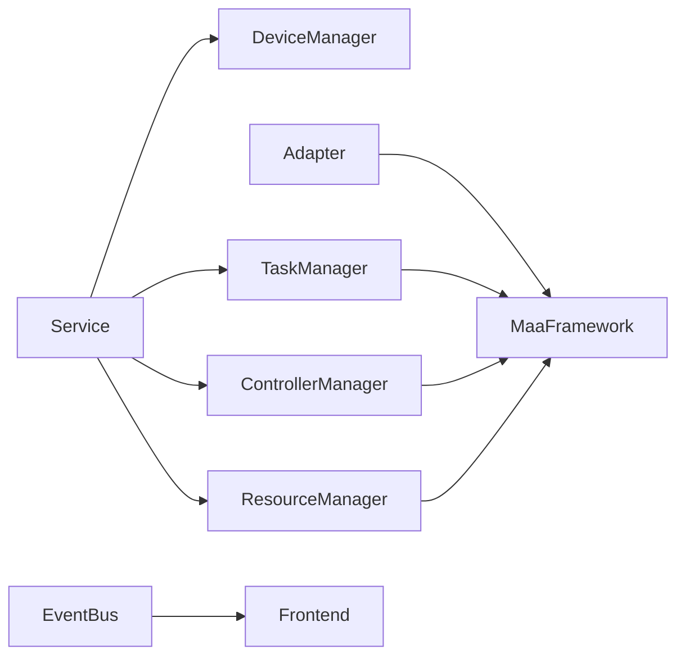

# 任务执行与监控

<cite>
**本文引用的文件**
- [task_manager.go](file://LocalBridge/internal/mfw/task_manager.go)
- [controller_manager.go](file://LocalBridge/internal/mfw/controller_manager.go)
- [service.go](file://LocalBridge/internal/mfw/service.go)
- [adapter.go](file://LocalBridge/internal/mfw/adapter.go)
- [types.go](file://LocalBridge/internal/mfw/types.go)
- [device_manager.go](file://LocalBridge/internal/mfw/device_manager.go)
- [resource_manager.go](file://LocalBridge/internal/mfw/resource_manager.go)
- [eventbus.go](file://LocalBridge/internal/eventbus/eventbus.go)
- [loggerStore.ts](file://src/stores/loggerStore.ts)
- [DebugProtocolClient.ts](file://src/services/protocols/DebugProtocolClient.ts)
- [Task Definition and Execution.md](file://dev/instructions/maafw-golang-binding/Task Definition and Execution.md)
- [Async Operations and Job Management.md](file://dev/instructions/maafw-golang-binding/Async Operations and Job Management.md)
- [Event Architecture.md](file://dev/instructions/maafw-golang-binding/Event Architecture.md)
- [Event System and Monitoring.md](file://dev/instructions/maafw-golang-binding/Event System and Monitoring.md)
- [Tasker.md](file://dev/instructions/maafw-golang-binding/Tasker.md)
- [Error Handling.md](file://dev/instructions/maafw-golang-binding/Error Handling.md)
- [Pipeline Architecture.md](file://dev/instructions/maafw-golang-binding/Pipeline Architecture.md)
- [3.1-PipelineProtocol.md](file://dev/instructions/maafw-guide/3.1-PipelineProtocol.md)
- [default_pipeline.json](file://LocalBridge/test-json/resource/base/default_pipeline.json)
</cite>

## 目录
1. [引言](#引言)
2. [项目结构](#项目结构)
3. [核心组件](#核心组件)
4. [架构总览](#架构总览)
5. [详细组件分析](#详细组件分析)
6. [依赖关系分析](#依赖关系分析)
7. [性能考虑](#性能考虑)
8. [故障排查指南](#故障排查指南)
9. [结论](#结论)
10. [附录](#附录)

## 引言
本技术文档围绕“任务执行与监控”主题，系统梳理了基于 MaaFramework 的任务调度、执行流程、状态跟踪与监控体系。内容覆盖任务队列管理、并发控制、优先级调度、执行进度监控、日志记录、性能统计、失败处理与重试、异常恢复、任务配置管理与动态调整、批量执行以及监控调试工具使用方法。文档以代码为依据，辅以可视化图示，帮助读者从整体到局部全面理解系统设计与实现。

## 项目结构
本项目采用分层架构：
- 本地桥接层（LocalBridge）：封装 MaaFramework 的控制器、资源、任务器与适配器，提供统一的服务入口与生命周期管理。
- 前端层（src）：提供可视化编辑器、日志面板、调试协议客户端与状态存储。
- 指令与文档（dev/instructions）：提供 MaaFramework 的接口说明、事件系统、任务执行模型与指南文档。

**图表来源**
- [service.go:15-34](file://LocalBridge/internal/mfw/service.go#L15-L34)
- [adapter.go:25-60](file://LocalBridge/internal/mfw/adapter.go#L25-L60)
- [task_manager.go:11-22](file://LocalBridge/internal/mfw/task_manager.go#L11-L22)
- [controller_manager.go:20-31](file://LocalBridge/internal/mfw/controller_manager.go#L20-L31)
- [resource_manager.go:11-22](file://LocalBridge/internal/mfw/resource_manager.go#L11-L22)
- [device_manager.go:11-25](file://LocalBridge/internal/mfw/device_manager.go#L11-L25)
- [eventbus.go:16-27](file://LocalBridge/internal/eventbus/eventbus.go#L16-L27)

**章节来源**
- [service.go:15-34](file://LocalBridge/internal/mfw/service.go#L15-L34)
- [adapter.go:25-60](file://LocalBridge/internal/mfw/adapter.go#L25-L60)

## 核心组件
- 服务管理器（Service）：负责初始化/关闭 MaaFramework，协调设备、控制器、资源与任务管理器的生命周期。
- 统一适配器（MaaFWAdapter）：封装 Tasker、Controller、Resource、Agent 的创建、绑定与事件回调注册。
- 任务管理器（TaskManager）：维护任务状态、提交与停止任务。
- 控制器管理器（ControllerManager）：创建/连接/断开控制器，执行输入与截图等操作。
- 资源管理器（ResourceManager）：加载/卸载资源包，计算哈希，提供资源信息。
- 设备管理器（DeviceManager）：枚举 ADB、Win32、WlRoots 设备，提供可用方法列表。
- 事件总线（EventBus）：跨模块事件发布/订阅，支持同步与异步事件。
- 前端日志存储（loggerStore.ts）：前端侧日志队列、展开状态与最大条目数控制。
- 调试协议客户端（DebugProtocolClient.ts）：注册调试路由，接收 trace、错误等消息。

**章节来源**
- [service.go:15-34](file://LocalBridge/internal/mfw/service.go#L15-L34)
- [adapter.go:25-60](file://LocalBridge/internal/mfw/adapter.go#L25-L60)
- [task_manager.go:11-22](file://LocalBridge/internal/mfw/task_manager.go#L11-L22)
- [controller_manager.go:20-31](file://LocalBridge/internal/mfw/controller_manager.go#L20-L31)
- [resource_manager.go:11-22](file://LocalBridge/internal/mfw/resource_manager.go#L11-L22)
- [device_manager.go:11-25](file://LocalBridge/internal/mfw/device_manager.go#L11-L25)
- [eventbus.go:16-27](file://LocalBridge/internal/eventbus/eventbus.go#L16-L27)
- [loggerStore.ts:11-19](file://src/stores/loggerStore.ts#L11-L19)
- [DebugProtocolClient.ts:108-121](file://src/services/protocols/DebugProtocolClient.ts#L108-L121)

## 架构总览
下图展示了从前端触发任务到 MaaFramework 执行再到事件回调与前端展示的整体流程。

**图表来源**
- [service.go:36-138](file://LocalBridge/internal/mfw/service.go#L36-L138)
- [adapter.go:452-567](file://LocalBridge/internal/mfw/adapter.go#L452-L567)
- [task_manager.go:24-53](file://LocalBridge/internal/mfw/task_manager.go#L24-L53)
- [Event System and Monitoring.md:294-326](file://dev/instructions/maafw-golang-binding/Event System and Monitoring.md#L294-L326)

## 详细组件分析

### 任务管理器（TaskManager）
- 职责：提交任务、查询状态、停止单个/全部任务；维护任务映射表与读写锁。
- 关键点：
  - 任务 ID 使用纳秒时间戳生成，避免冲突。
  - 停止任务通过 Tasker.PostStop 并阻塞等待完成。
  - 停止全部时遍历任务表，逐一停止并销毁 Tasker，清空映射。

**图表来源**
- [task_manager.go:24-53](file://LocalBridge/internal/mfw/task_manager.go#L24-L53)
- [task_manager.go:68-90](file://LocalBridge/internal/mfw/task_manager.go#L68-L90)
- [task_manager.go:92-113](file://LocalBridge/internal/mfw/task_manager.go#L92-L113)

**章节来源**
- [task_manager.go:11-22](file://LocalBridge/internal/mfw/task_manager.go#L11-L22)
- [task_manager.go:24-53](file://LocalBridge/internal/mfw/task_manager.go#L24-L53)
- [task_manager.go:68-90](file://LocalBridge/internal/mfw/task_manager.go#L68-L90)
- [task_manager.go:92-113](file://LocalBridge/internal/mfw/task_manager.go#L92-L113)

### 统一适配器（MaaFWAdapter）
- 职责：在 Controller、Resource、Tasker、Agent 之间建立桥梁，提供统一的初始化、运行与停止能力。
- 关键点：
  - 初始化 Tasker 前必须确保 Controller 与 Resource 已就绪。
  - 支持同步运行（RunTask）与异步提交（PostTask），并提供 PostStop。
  - 事件回调：添加/移除上下文事件与 Tasker 事件监听器，便于监控节点执行与任务状态。

**图表来源**
- [adapter.go:25-60](file://LocalBridge/internal/mfw/adapter.go#L25-L60)
- [adapter.go:452-567](file://LocalBridge/internal/mfw/adapter.go#L452-L567)
- [adapter.go:788-800](file://LocalBridge/internal/mfw/adapter.go#L788-L800)

**章节来源**
- [adapter.go:452-567](file://LocalBridge/internal/mfw/adapter.go#L452-L567)
- [adapter.go:788-800](file://LocalBridge/internal/mfw/adapter.go#L788-L800)

### 控制器管理器（ControllerManager）
- 职责：创建多种类型的控制器（ADB/Win32/WlRoots/PlayCover/Gamepad），连接/断开，执行输入操作与截图。
- 关键点：
  - 连接采用 PostConnect 并带超时等待，确保连接状态可验证。
  - 操作均通过 Job 管理，Wait 同步等待，成功与否通过 Success() 判断。
  - 截图支持目标长/短边缩放与原始尺寸选项，输出 Base64 PNG。

**图表来源**
- [controller_manager.go:278-329](file://LocalBridge/internal/mfw/controller_manager.go#L278-L329)
- [controller_manager.go:365-399](file://LocalBridge/internal/mfw/controller_manager.go#L365-L399)
- [controller_manager.go:545-622](file://LocalBridge/internal/mfw/controller_manager.go#L545-L622)

**章节来源**
- [controller_manager.go:278-329](file://LocalBridge/internal/mfw/controller_manager.go#L278-L329)
- [controller_manager.go:365-399](file://LocalBridge/internal/mfw/controller_manager.go#L365-L399)
- [controller_manager.go:545-622](file://LocalBridge/internal/mfw/controller_manager.go#L545-L622)

### 资源管理器（ResourceManager）
- 职责：加载/卸载资源包，解析路径，计算哈希，提供资源信息。
- 关键点：
  - 加载前进行路径解析与准备，必要时处理非 ASCII 路径问题。
  - 卸载时销毁资源实例并清理映射。

**章节来源**
- [resource_manager.go:24-65](file://LocalBridge/internal/mfw/resource_manager.go#L24-L65)
- [resource_manager.go:80-99](file://LocalBridge/internal/mfw/resource_manager.go#L80-L99)

### 设备管理器（DeviceManager）
- 职责：枚举 ADB、Win32、WlRoots 设备，提供可用截图与输入方法列表。
- 关键点：
  - ADB：列出设备、名称、配置与方法集合。
  - Win32：列出窗口句柄、类名、标题与方法集合。
  - WlRoots：列出套接字路径。

**章节来源**
- [device_manager.go:27-61](file://LocalBridge/internal/mfw/device_manager.go#L27-L61)
- [device_manager.go:63-96](file://LocalBridge/internal/mfw/device_manager.go#L63-L96)
- [device_manager.go:98-121](file://LocalBridge/internal/mfw/device_manager.go#L98-L121)

### 事件系统与监控
- 事件架构：
  - 事件消息遵循“组件.事件.状态”命名约定，解析后分发到对应事件接口。
  - 回调注册采用原子自增 ID 与只读锁保护的回调表，保证并发安全。
  - 支持 Tasker 事件与上下文事件（节点识别/动作/流水线等）。
- 事件流示意：

**图表来源**
- [Event Architecture.md:294-326](file://dev/instructions/maafw-golang-binding/Event Architecture.md#L294-L326)
- [Event System and Monitoring.md:279-325](file://dev/instructions/maafw-golang-binding/Event System and Monitoring.md#L279-L325)

**章节来源**
- [Event Architecture.md:289-808](file://dev/instructions/maafw-golang-binding/Event Architecture.md#L289-L808)
- [Event System and Monitoring.md:85-342](file://dev/instructions/maafw-golang-binding/Event System and Monitoring.md#L85-L342)

### 任务执行流程与状态跟踪
- 任务定义与执行：
  - 通过 Pipeline 定义节点，每个节点包含识别、动作、下一跳与错误处理等属性。
  - 执行逻辑为：顺序检测下一节点列表，命中则中断后续检测并执行动作；若动作成功进入其 next，否则进入 on_error；若 next 列表超时则进入 on_error。
  - 终止条件：next 列表为空或超时，或收到外部停止信号。
- 任务状态机（Tasker）：

**图表来源**
- [Task Definition and Execution.md:30-71](file://dev/instructions/maafw-golang-binding/Task Definition and Execution.md#L30-L71)
- [Task Definition and Execution.md:736-785](file://dev/instructions/maafw-golang-binding/Task Definition and Execution.md#L736-L785)
- [Tasker.md:381-418](file://dev/instructions/maafw-golang-binding/Tasker.md#L381-L418)

**章节来源**
- [3.1-PipelineProtocol.md:22-48](file://dev/instructions/maafw-guide/3.1-PipelineProtocol.md#L22-L48)
- [Task Definition and Execution.md:30-71](file://dev/instructions/maafw-golang-binding/Task Definition and Execution.md#L30-L71)
- [Task Definition and Execution.md:736-785](file://dev/instructions/maafw-golang-binding/Task Definition and Execution.md#L736-L785)
- [Tasker.md:381-418](file://dev/instructions/maafw-golang-binding/Tasker.md#L381-L418)

### 并发控制与队列管理
- 任务队列：
  - 任务通过 Tasker 的任务队列执行，底层由 MaaFramework 引擎调度。
  - 适配器提供 PostTask 与 RunTask 两种方式：前者异步提交，后者同步等待。
- 并发与线程安全：
  - 事件回调注册采用原子计数与读写锁，确保多线程并发注册/注销与回调分发的安全性。
  - 任务管理器内部使用读写锁保护任务映射表。

**章节来源**
- [Async Operations and Job Management.md:60-87](file://dev/instructions/maafw-golang-binding/Async Operations and Job Management.md#L60-L87)
- [Event Architecture.md:1056-1142](file://dev/instructions/maafw-golang-binding/Event Architecture.md#L1056-L1142)
- [task_manager.go:12-15](file://LocalBridge/internal/mfw/task_manager.go#L12-L15)

### 执行进度监控、日志记录与性能统计
- 前端日志存储：
  - 使用 zustand 管理日志列表，限制最大条目数，支持展开/收起与清空。
- 事件驱动的进度与状态：
  - 通过 Tasker 事件与上下文事件回调，实时推送“开始/成功/失败”等状态。
- 性能统计建议：
  - 在事件回调中记录节点耗时、命中率、重试次数等指标，结合前端 Store 展示。

**章节来源**
- [loggerStore.ts:11-19](file://src/stores/loggerStore.ts#L11-L19)
- [Event System and Monitoring.md:222-246](file://dev/instructions/maafw-golang-binding/Event System and Monitoring.md#L222-L246)

### 失败处理、重试机制与异常恢复
- 任务作业错误传播：
  - 提交阶段错误与执行阶段错误在 TaskJob 层统一处理，可通过 Error() 区分。
  - 失败时可获取任务详情，定位失败节点与原因。
- 重试与回退：
  - 节点 on_error 列表用于失败回退与重试；支持超时与重复延迟控制。
  - 适配器提供 PostStop 主动停止任务，避免长时间无效等待。

**章节来源**
- [Async Operations and Job Management.md:256-297](file://dev/instructions/maafw-golang-binding/Async Operations and Job Management.md#L256-L297)
- [Error Handling.md:389-555](file://dev/instructions/maafw-golang-binding/Error Handling.md#L389-L555)
- [Pipeline Architecture.md:229-273](file://dev/instructions/maafw-golang-binding/Pipeline Architecture.md#L229-L273)

### 任务配置管理、动态调整与批量执行
- 配置项示例：
  - 默认管道配置包含超时、前置延时、重复延时等参数，可在资源包中定义。
- 动态调整：
  - 通过适配器的 OverridePipeline 对当前资源的管道进行覆盖。
- 批量执行：
  - 服务层提供 StopAll 与 DisconnectAll 等批量停止/断开能力，便于大规模场景下的资源回收。

**章节来源**
- [default_pipeline.json:1-7](file://LocalBridge/test-json/resource/base/default_pipeline.json#L1-L7)
- [adapter.go:441-450](file://LocalBridge/internal/mfw/adapter.go#L441-L450)
- [service.go:140-170](file://LocalBridge/internal/mfw/service.go#L140-L170)

### 监控调试工具使用指南
- 调试协议客户端：
  - 注册调试路由（如 agent_tested、trace_snapshot、trace_replay_status、error），接收后端调试事件并在前端展示。
- 建议流程：
  - 启动调试协议客户端，订阅相关路由；
  - 在任务执行过程中观察 trace 与 replay 状态；
  - 出错时查看错误事件并结合任务详情定位问题。

**章节来源**
- [DebugProtocolClient.ts:108-121](file://src/services/protocols/DebugProtocolClient.ts#L108-L121)

## 依赖关系分析
- 组件耦合：
  - Service 作为协调者，聚合 Device/Controller/Resource/Task 管理器。
  - Adapter 依赖 MaaFramework 的 Tasker/Controller/Resource/Agent。
  - 事件系统通过回调表与只读锁实现低耦合的事件分发。
- 外部依赖：
  - MaaFramework（Tasker/Controller/Resource/Agent）。
  - 前端 Zustand（loggerStore）与 WebSocket（调试协议）。

**图表来源**
- [service.go:15-34](file://LocalBridge/internal/mfw/service.go#L15-L34)
- [adapter.go:25-60](file://LocalBridge/internal/mfw/adapter.go#L25-L60)
- [eventbus.go:16-27](file://LocalBridge/internal/eventbus/eventbus.go#L16-L27)

**章节来源**
- [service.go:15-34](file://LocalBridge/internal/mfw/service.go#L15-L34)
- [adapter.go:25-60](file://LocalBridge/internal/mfw/adapter.go#L25-L60)

## 性能考虑
- 事件回调零拷贝优化：消息采用零拷贝转换，明细 JSON 进行复制存储，降低内存压力。
- 任务并发与锁粒度：任务管理器与事件回调分别使用读写锁，减少锁竞争。
- 资源路径处理：对非 ASCII 路径进行短路径转换或工作目录切换，避免库初始化失败导致的性能浪费。
- 截图与编码：前端对 PNG 编码后的 Base64 输出，注意大图时的内存占用与传输成本。

[本节为通用指导，无需特定文件引用]

## 故障排查指南
- 初始化失败：
  - 检查 MaaFramework 库路径与日志目录是否正确配置；Windows 下非 ASCII 路径需转换。
- 控制器连接失败：
  - 查看连接超时与连接状态；确认设备/窗口句柄有效。
- 任务提交失败：
  - 使用 TaskJob.Error() 区分提交阶段错误与执行阶段错误；查看任务详情定位节点。
- 事件未到达：
  - 确认回调注册成功且未被提前注销；检查回调表与只读锁状态。
- 日志与调试：
  - 前端日志队列上限与展开状态；调试协议路由是否正确注册。

**章节来源**
- [service.go:36-138](file://LocalBridge/internal/mfw/service.go#L36-L138)
- [controller_manager.go:278-329](file://LocalBridge/internal/mfw/controller_manager.go#L278-L329)
- [Async Operations and Job Management.md:256-297](file://dev/instructions/maafw-golang-binding/Async Operations and Job Management.md#L256-L297)
- [Event Architecture.md:1056-1142](file://dev/instructions/maafw-golang-binding/Event Architecture.md#L1056-L1142)
- [loggerStore.ts:26-45](file://src/stores/loggerStore.ts#L26-L45)
- [DebugProtocolClient.ts:108-121](file://src/services/protocols/DebugProtocolClient.ts#L108-L121)

## 结论
本系统通过 Service 与 Adapter 实现对 MaaFramework 的统一封装，配合 TaskManager、ControllerManager、ResourceManager 与 DeviceManager 形成完整的任务执行与资源管理体系。事件系统提供细粒度的状态与进度监控，前端通过日志与调试协议实现可观测性。在并发控制、错误处理与性能优化方面具备良好设计，适合在复杂自动化场景中稳定运行。

[本节为总结，无需特定文件引用]

## 附录
- 任务配置示例：参考默认管道配置中的超时、延时与重复延时参数。
- 监控调试：注册调试路由，关注 trace 与错误事件，结合任务详情进行定位。

**章节来源**
- [default_pipeline.json:1-7](file://LocalBridge/test-json/resource/base/default_pipeline.json#L1-L7)
- [DebugProtocolClient.ts:108-121](file://src/services/protocols/DebugProtocolClient.ts#L108-L121)