# 协议系统

<cite>
**本文引用的文件**
- [LocalBridge/internal/router/router.go](file://LocalBridge/internal/router/router.go)
- [LocalBridge/internal/server/websocket.go](file://LocalBridge/internal/server/websocket.go)
- [LocalBridge/internal/server/connection.go](file://LocalBridge/internal/server/connection.go)
- [LocalBridge/internal/eventbus/eventbus.go](file://LocalBridge/internal/eventbus/eventbus.go)
- [LocalBridge/pkg/models/message.go](file://LocalBridge/pkg/models/message.go)
- [LocalBridge/internal/protocol/ai/handler.go](file://LocalBridge/internal/protocol/ai/handler.go)
- [LocalBridge/internal/protocol/config/handler.go](file://LocalBridge/internal/protocol/config/handler.go)
- [LocalBridge/internal/protocol/file/file_handler.go](file://LocalBridge/internal/protocol/file/file_handler.go)
- [LocalBridge/internal/protocol/mfw/handler.go](file://LocalBridge/internal/protocol/mfw/handler.go)
- [LocalBridge/internal/protocol/resource/handler.go](file://LocalBridge/internal/protocol/resource/handler.go)
- [LocalBridge/internal/protocol/utility/handler.go](file://LocalBridge/internal/protocol/utility/handler.go)
- [LocalBridge/internal/mfw/types.go](file://LocalBridge/internal/mfw/types.go)
</cite>

## 目录
1. [引言](#引言)
2. [项目结构](#项目结构)
3. [核心组件](#核心组件)
4. [架构总览](#架构总览)
5. [详细组件分析](#详细组件分析)
6. [依赖分析](#依赖分析)
7. [性能考虑](#性能考虑)
8. [故障排查指南](#故障排查指南)
9. [结论](#结论)
10. [附录](#附录)

## 引言
本文件系统性梳理本地桥接服务（LocalBridge）中的协议系统，覆盖消息协议设计、处理器注册与路由、事件总线与消息分发、版本管理与兼容性、安全与完整性校验、错误处理策略，并提供协议定义示例、消息格式规范与调试工具使用指南。目标读者既包括需要快速上手的开发者，也包括希望深入理解系统实现细节的高级用户。

## 项目结构
协议系统围绕“消息模型 + 路由分发 + 协议处理器 + 事件总线 + WebSocket 传输”展开，形成清晰的分层架构：
- 消息模型层：统一的消息结构与各类业务数据结构
- 传输层：WebSocket 服务器与连接管理
- 路由层：基于前缀的处理器注册与分发
- 协议层：各功能域处理器（AI、配置、文件、MFW、资源、工具）
- 事件层：进程内事件总线，驱动广播与订阅

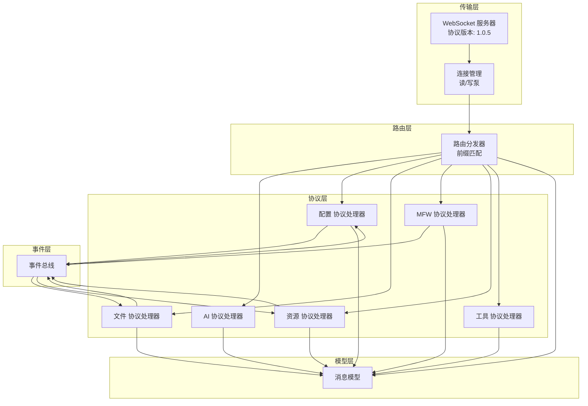

图表来源
- [LocalBridge/internal/server/websocket.go:15-46](file://LocalBridge/internal/server/websocket.go#L15-L46)
- [LocalBridge/internal/server/connection.go:12-29](file://LocalBridge/internal/server/connection.go#L12-L29)
- [LocalBridge/internal/router/router.go:28-49](file://LocalBridge/internal/router/router.go#L28-L49)
- [LocalBridge/internal/eventbus/eventbus.go:16-27](file://LocalBridge/internal/eventbus/eventbus.go#L16-L27)
- [LocalBridge/pkg/models/message.go:3-7](file://LocalBridge/pkg/models/message.go#L3-L7)

章节来源
- [LocalBridge/internal/server/websocket.go:15-46](file://LocalBridge/internal/server/websocket.go#L15-L46)
- [LocalBridge/internal/server/connection.go:12-29](file://LocalBridge/internal/server/connection.go#L12-L29)
- [LocalBridge/internal/router/router.go:28-49](file://LocalBridge/internal/router/router.go#L28-L49)
- [LocalBridge/internal/eventbus/eventbus.go:16-27](file://LocalBridge/internal/eventbus/eventbus.go#L16-L27)
- [LocalBridge/pkg/models/message.go:3-7](file://LocalBridge/pkg/models/message.go#L3-L7)

## 核心组件
- 消息模型：统一的 Message 结构，包含 path 与 data；配套错误、文件、资源、MFW 等专用数据结构
- WebSocket 服务器：负责升级、连接生命周期管理、广播与连接数统计
- 路由分发器：注册处理器、前缀匹配、版本握手、错误回传
- 协议处理器：按领域划分，实现 Handle 与 GetRoutePrefix，负责具体业务逻辑
- 事件总线：进程内事件发布/订阅，支持同步与异步，驱动广播与联动

章节来源
- [LocalBridge/pkg/models/message.go:3-7](file://LocalBridge/pkg/models/message.go#L3-L7)
- [LocalBridge/internal/server/websocket.go:15-46](file://LocalBridge/internal/server/websocket.go#L15-L46)
- [LocalBridge/internal/server/connection.go:12-29](file://LocalBridge/internal/server/connection.go#L12-L29)
- [LocalBridge/internal/router/router.go:28-49](file://LocalBridge/internal/router/router.go#L28-L49)
- [LocalBridge/internal/eventbus/eventbus.go:16-27](file://LocalBridge/internal/eventbus/eventbus.go#L16-L27)

## 架构总览
协议系统采用“请求-路由-处理-响应”的流水线模式：
- 客户端通过 WebSocket 发送消息（Message）
- 服务器解析后交由路由分发器
- 路由根据 path 前缀匹配处理器
- 处理器执行业务逻辑，必要时通过事件总线广播或通过连接回传消息
- 错误通过统一的错误消息结构返回

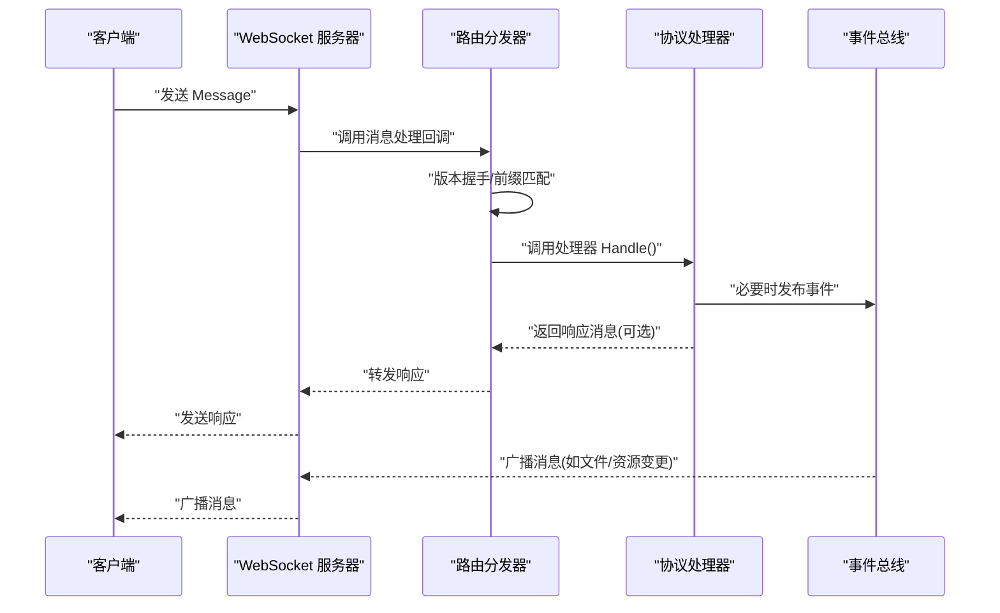

图表来源
- [LocalBridge/internal/server/websocket.go:114-161](file://LocalBridge/internal/server/websocket.go#L114-L161)
- [LocalBridge/internal/router/router.go:56-83](file://LocalBridge/internal/router/router.go#L56-L83)
- [LocalBridge/internal/eventbus/eventbus.go:37-56](file://LocalBridge/internal/eventbus/eventbus.go#L37-L56)

## 详细组件分析

### 路由分发器与版本管理
- 注册机制：处理器通过实现 GetRoutePrefix 返回一组前缀，路由将其映射到处理器
- 路由匹配：先精确匹配，再进行前缀匹配，提升灵活性
- 版本握手：统一的 /system/handshake 路由，校验客户端协议版本，不匹配时触发回调
- 错误处理：未知路由或解析失败统一返回 /error 消息

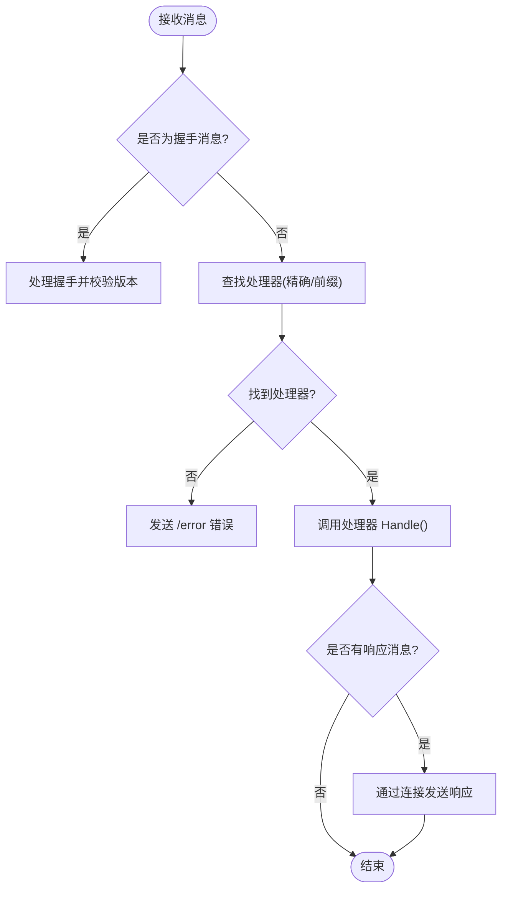

图表来源
- [LocalBridge/internal/router/router.go:56-100](file://LocalBridge/internal/router/router.go#L56-L100)
- [LocalBridge/internal/router/router.go:114-160](file://LocalBridge/internal/router/router.go#L114-L160)

章节来源
- [LocalBridge/internal/router/router.go:28-49](file://LocalBridge/internal/router/router.go#L28-L49)
- [LocalBridge/internal/router/router.go:56-83](file://LocalBridge/internal/router/router.go#L56-L83)
- [LocalBridge/internal/router/router.go:114-160](file://LocalBridge/internal/router/router.go#L114-L160)

### WebSocket 传输与连接管理
- 升级与读写：自动升级 HTTP 到 WebSocket，分别启动读/写泵协程
- 连接生命周期：注册/注销、广播、连接数统计
- 协议版本常量：统一的协议版本号，用于握手校验

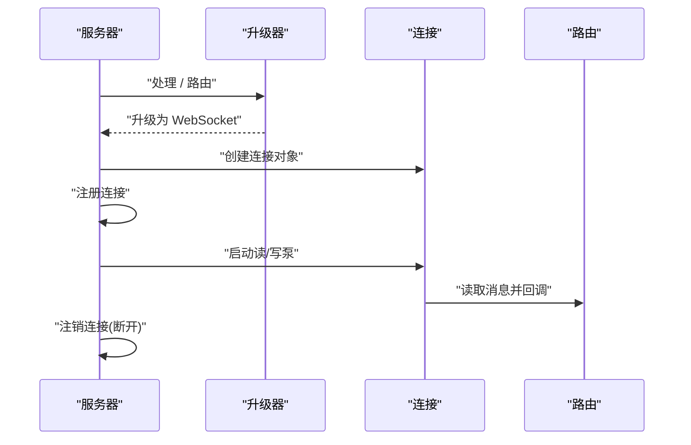

图表来源
- [LocalBridge/internal/server/websocket.go:144-161](file://LocalBridge/internal/server/websocket.go#L144-L161)
- [LocalBridge/internal/server/connection.go:31-76](file://LocalBridge/internal/server/connection.go#L31-L76)

章节来源
- [LocalBridge/internal/server/websocket.go:15-46](file://LocalBridge/internal/server/websocket.go#L15-L46)
- [LocalBridge/internal/server/connection.go:12-29](file://LocalBridge/internal/server/connection.go#L12-L29)

### 事件总线与消息分发
- 订阅/发布：支持同步与异步发布，避免阻塞
- 全局实例：提供全局事件总线，便于跨模块解耦
- 事件类型：文件扫描完成、文件变更、连接建立/关闭、资源扫描完成、配置重载等

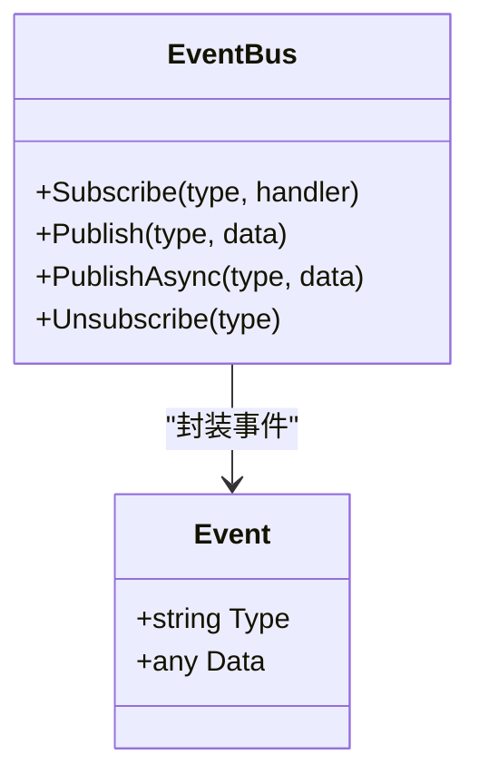

图表来源
- [LocalBridge/internal/eventbus/eventbus.go:16-56](file://LocalBridge/internal/eventbus/eventbus.go#L16-L56)

章节来源
- [LocalBridge/internal/eventbus/eventbus.go:16-56](file://LocalBridge/internal/eventbus/eventbus.go#L16-L56)

### 协议处理器：文件协议
- 路由前缀：/etl/open_file、/etl/save_file、/etl/save_separated、/etl/create_file、/etl/refresh_file_list
- 功能：打开/保存/分离保存/创建文件；监听文件变化并广播；解析数据结构
- 错误处理：统一包装为 /error 消息

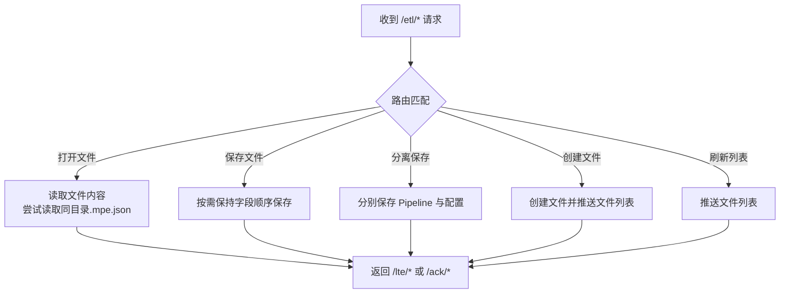

图表来源
- [LocalBridge/internal/protocol/file/file_handler.go:37-64](file://LocalBridge/internal/protocol/file/file_handler.go#L37-L64)
- [LocalBridge/internal/protocol/file/file_handler.go:66-137](file://LocalBridge/internal/protocol/file/file_handler.go#L66-L137)
- [LocalBridge/internal/protocol/file/file_handler.go:139-176](file://LocalBridge/internal/protocol/file/file_handler.go#L139-L176)
- [LocalBridge/internal/protocol/file/file_handler.go:178-238](file://LocalBridge/internal/protocol/file/file_handler.go#L178-L238)
- [LocalBridge/internal/protocol/file/file_handler.go:240-271](file://LocalBridge/internal/protocol/file/file_handler.go#L240-L271)
- [LocalBridge/internal/protocol/file/file_handler.go:273-277](file://LocalBridge/internal/protocol/file/file_handler.go#L273-L277)

章节来源
- [LocalBridge/internal/protocol/file/file_handler.go:37-64](file://LocalBridge/internal/protocol/file/file_handler.go#L37-L64)
- [LocalBridge/internal/protocol/file/file_handler.go:66-137](file://LocalBridge/internal/protocol/file/file_handler.go#L66-L137)
- [LocalBridge/internal/protocol/file/file_handler.go:139-176](file://LocalBridge/internal/protocol/file/file_handler.go#L139-L176)
- [LocalBridge/internal/protocol/file/file_handler.go:178-238](file://LocalBridge/internal/protocol/file/file_handler.go#L178-L238)
- [LocalBridge/internal/protocol/file/file_handler.go:240-271](file://LocalBridge/internal/protocol/file/file_handler.go#L240-L271)
- [LocalBridge/internal/protocol/file/file_handler.go:273-277](file://LocalBridge/internal/protocol/file/file_handler.go#L273-L277)

### 协议处理器：资源协议
- 路由前缀：/etl/get_image、/etl/get_images、/etl/get_image_list、/etl/refresh_resources
- 功能：获取单/多/列表图片；刷新资源包；事件驱动推送资源包列表
- 数据：Base64 编码、MIME 类型、尺寸、资源包归属

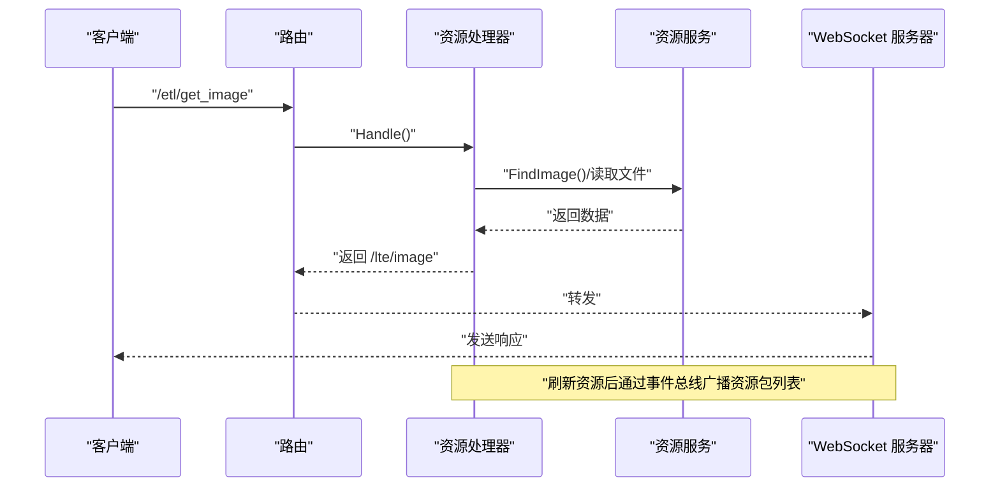

图表来源
- [LocalBridge/internal/protocol/resource/handler.go:45-53](file://LocalBridge/internal/protocol/resource/handler.go#L45-L53)
- [LocalBridge/internal/protocol/resource/handler.go:71-105](file://LocalBridge/internal/protocol/resource/handler.go#L71-L105)
- [LocalBridge/internal/protocol/resource/handler.go:107-114](file://LocalBridge/internal/protocol/resource/handler.go#L107-L114)
- [LocalBridge/internal/protocol/resource/handler.go:116-137](file://LocalBridge/internal/protocol/resource/handler.go#L116-L137)
- [LocalBridge/internal/protocol/resource/handler.go:219-245](file://LocalBridge/internal/protocol/resource/handler.go#L219-L245)

章节来源
- [LocalBridge/internal/protocol/resource/handler.go:45-53](file://LocalBridge/internal/protocol/resource/handler.go#L45-L53)
- [LocalBridge/internal/protocol/resource/handler.go:71-105](file://LocalBridge/internal/protocol/resource/handler.go#L71-L105)
- [LocalBridge/internal/protocol/resource/handler.go:107-114](file://LocalBridge/internal/protocol/resource/handler.go#L107-L114)
- [LocalBridge/internal/protocol/resource/handler.go:116-137](file://LocalBridge/internal/protocol/resource/handler.go#L116-L137)
- [LocalBridge/internal/protocol/resource/handler.go:219-245](file://LocalBridge/internal/protocol/resource/handler.go#L219-L245)

### 协议处理器：配置协议
- 路由前缀：/etl/config/*
- 功能：获取配置、设置配置（分段更新）、内部重载并发布事件
- 错误：统一返回 /error 或特定配置错误

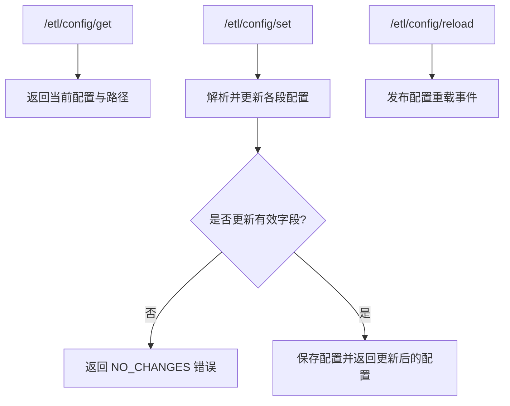

图表来源
- [LocalBridge/internal/protocol/config/handler.go:20-47](file://LocalBridge/internal/protocol/config/handler.go#L20-L47)
- [LocalBridge/internal/protocol/config/handler.go:49-68](file://LocalBridge/internal/protocol/config/handler.go#L49-L68)
- [LocalBridge/internal/protocol/config/handler.go:70-171](file://LocalBridge/internal/protocol/config/handler.go#L70-L171)
- [LocalBridge/internal/protocol/config/handler.go:173-204](file://LocalBridge/internal/protocol/config/handler.go#L173-L204)

章节来源
- [LocalBridge/internal/protocol/config/handler.go:20-47](file://LocalBridge/internal/protocol/config/handler.go#L20-L47)
- [LocalBridge/internal/protocol/config/handler.go:49-68](file://LocalBridge/internal/protocol/config/handler.go#L49-L68)
- [LocalBridge/internal/protocol/config/handler.go:70-171](file://LocalBridge/internal/protocol/config/handler.go#L70-L171)
- [LocalBridge/internal/protocol/config/handler.go:173-204](file://LocalBridge/internal/protocol/config/handler.go#L173-L204)

### 协议处理器：MFW 协议（设备/控制器/任务/资源）
- 路由前缀：/etl/mfw/*
- 功能：设备刷新、控制器创建/连接/断开、输入/点击/滑动/截图、任务提交/查询/停止、资源加载、自定义识别/动作注册
- 安全：未初始化时拒绝请求并返回明确错误码
- 数据：大量 MFW 类型定义，确保前后端一致

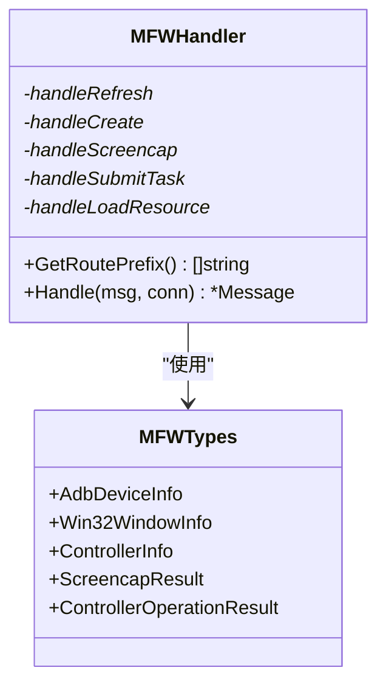

图表来源
- [LocalBridge/internal/protocol/mfw/handler.go:26-30](file://LocalBridge/internal/protocol/mfw/handler.go#L26-L30)
- [LocalBridge/internal/protocol/mfw/handler.go:31-128](file://LocalBridge/internal/protocol/mfw/handler.go#L31-L128)
- [LocalBridge/internal/mfw/types.go:7-129](file://LocalBridge/internal/mfw/types.go#L7-L129)

章节来源
- [LocalBridge/internal/protocol/mfw/handler.go:26-30](file://LocalBridge/internal/protocol/mfw/handler.go#L26-L30)
- [LocalBridge/internal/protocol/mfw/handler.go:31-128](file://LocalBridge/internal/protocol/mfw/handler.go#L31-L128)
- [LocalBridge/internal/mfw/types.go:7-129](file://LocalBridge/internal/mfw/types.go#L7-L129)

### 协议处理器：AI 协议（代理/流式代理/取消）
- 路由前缀：/etl/ai/*
- 功能：非流式代理、SSE 流式代理、取消请求；内部维护活跃请求表
- 错误：统一返回 /lte/ai/proxy_response 或 /lte/ai/proxy_stream 的错误字段

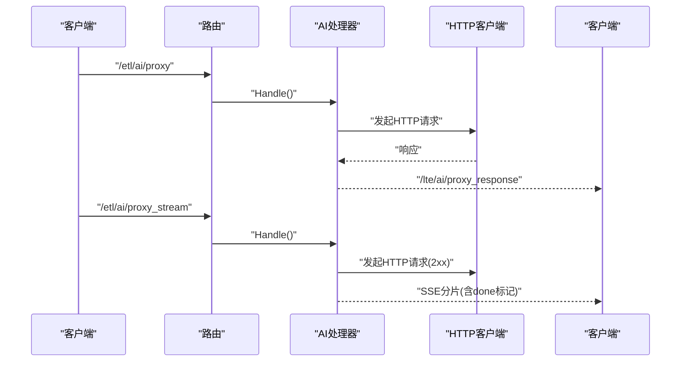

图表来源
- [LocalBridge/internal/protocol/ai/handler.go:31-53](file://LocalBridge/internal/protocol/ai/handler.go#L31-L53)
- [LocalBridge/internal/protocol/ai/handler.go:55-124](file://LocalBridge/internal/protocol/ai/handler.go#L55-L124)
- [LocalBridge/internal/protocol/ai/handler.go:126-232](file://LocalBridge/internal/protocol/ai/handler.go#L126-L232)
- [LocalBridge/internal/protocol/ai/handler.go:234-253](file://LocalBridge/internal/protocol/ai/handler.go#L234-L253)

章节来源
- [LocalBridge/internal/protocol/ai/handler.go:31-53](file://LocalBridge/internal/protocol/ai/handler.go#L31-L53)
- [LocalBridge/internal/protocol/ai/handler.go:55-124](file://LocalBridge/internal/protocol/ai/handler.go#L55-L124)
- [LocalBridge/internal/protocol/ai/handler.go:126-232](file://LocalBridge/internal/protocol/ai/handler.go#L126-L232)
- [LocalBridge/internal/protocol/ai/handler.go:234-253](file://LocalBridge/internal/protocol/ai/handler.go#L234-L253)

### 协议处理器：工具协议（OCR/路径解析/打开日志）
- 路由前缀：/etl/utility/*
- 功能：OCR 识别（截图+资源+Tasker）、图片路径解析、打开日志目录
- 安全：OCR 资源加载失败时返回明确错误码与建议

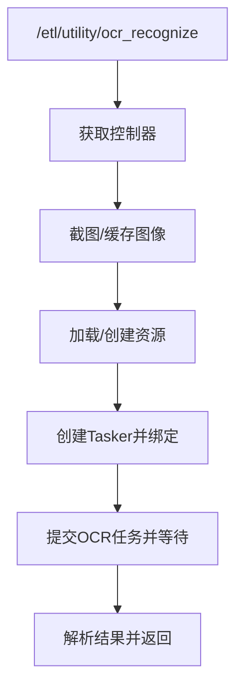

图表来源
- [LocalBridge/internal/protocol/utility/handler.go:44-66](file://LocalBridge/internal/protocol/utility/handler.go#L44-L66)
- [LocalBridge/internal/protocol/utility/handler.go:68-123](file://LocalBridge/internal/protocol/utility/handler.go#L68-L123)
- [LocalBridge/internal/protocol/utility/handler.go:125-335](file://LocalBridge/internal/protocol/utility/handler.go#L125-L335)

章节来源
- [LocalBridge/internal/protocol/utility/handler.go:44-66](file://LocalBridge/internal/protocol/utility/handler.go#L44-L66)
- [LocalBridge/internal/protocol/utility/handler.go:68-123](file://LocalBridge/internal/protocol/utility/handler.go#L68-L123)
- [LocalBridge/internal/protocol/utility/handler.go:125-335](file://LocalBridge/internal/protocol/utility/handler.go#L125-L335)

## 依赖分析
- 耦合关系
  - 路由器依赖处理器接口，处理器依赖消息模型与服务器连接
  - 处理器与事件总线松耦合，通过事件类型解耦
  - WebSocket 服务器仅依赖事件总线与路由回调，不直接依赖处理器
- 可能的循环依赖
  - 当前结构清晰，无明显循环依赖迹象
- 外部依赖
  - WebSocket 升级与读写
  - HTTP 客户端（AI 代理）
  - MaaFramework（MFW 协议）

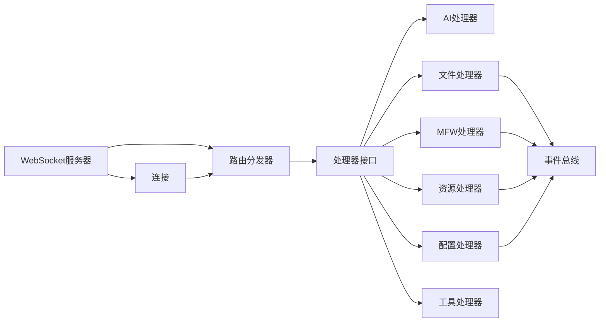

图表来源
- [LocalBridge/internal/router/router.go:19-26](file://LocalBridge/internal/router/router.go#L19-L26)
- [LocalBridge/internal/server/websocket.go:35-46](file://LocalBridge/internal/server/websocket.go#L35-L46)
- [LocalBridge/internal/server/connection.go:12-19](file://LocalBridge/internal/server/connection.go#L12-L19)
- [LocalBridge/internal/eventbus/eventbus.go:16-27](file://LocalBridge/internal/eventbus/eventbus.go#L16-L27)

章节来源
- [LocalBridge/internal/router/router.go:19-26](file://LocalBridge/internal/router/router.go#L19-L26)
- [LocalBridge/internal/server/websocket.go:35-46](file://LocalBridge/internal/server/websocket.go#L35-L46)
- [LocalBridge/internal/server/connection.go:12-19](file://LocalBridge/internal/server/connection.go#L12-L19)
- [LocalBridge/internal/eventbus/eventbus.go:16-27](file://LocalBridge/internal/eventbus/eventbus.go#L16-L27)

## 性能考虑
- 发送队列与背压：连接发送通道带缓冲，避免阻塞；当队列满时记录告警
- SSE 流式代理：增大扫描缓冲以支持长行，减少内存峰值
- 广播优化：广播时按连接持有只读锁，降低竞争
- 路由匹配：前缀匹配在处理器数量较少时效率高；若未来增长，可引入更高效的数据结构（如 Trie）

章节来源
- [LocalBridge/internal/server/connection.go:78-95](file://LocalBridge/internal/server/connection.go#L78-L95)
- [LocalBridge/internal/protocol/ai/handler.go:186-189](file://LocalBridge/internal/protocol/ai/handler.go#L186-L189)
- [LocalBridge/internal/server/websocket.go:163-171](file://LocalBridge/internal/server/websocket.go#L163-L171)

## 故障排查指南
- 协议版本不匹配
  - 现象：握手失败，返回版本不一致
  - 处理：按后端提示更新前端版本或降级前端版本
- 未知路由
  - 现象：返回 /error，提示未知路由
  - 处理：检查前端发送的 path 是否符合后端处理器前缀
- 文件/资源操作错误
  - 现象：/error 或特定配置错误
  - 处理：查看日志与错误 detail，确认路径、权限与文件格式
- MFW 未初始化
  - 现象：返回未初始化错误码
  - 处理：按提示设置库路径并重启服务
- AI 代理错误
  - 现象：代理响应或流式代理错误
  - 处理：检查 URL、方法、头部与远端服务状态

章节来源
- [LocalBridge/internal/router/router.go:114-160](file://LocalBridge/internal/router/router.go#L114-L160)
- [LocalBridge/internal/protocol/config/handler.go:217-236](file://LocalBridge/internal/protocol/config/handler.go#L217-L236)
- [LocalBridge/internal/protocol/mfw/handler.go:36-44](file://LocalBridge/internal/protocol/mfw/handler.go#L36-L44)
- [LocalBridge/internal/protocol/ai/handler.go:255-278](file://LocalBridge/internal/protocol/ai/handler.go#L255-L278)

## 结论
协议系统通过清晰的分层与职责划分，实现了高内聚、低耦合的消息处理框架。路由分发器与处理器接口保证了扩展性；事件总线提供了强大的模块间解耦能力；统一的错误模型与版本握手机制提升了稳定性与可观测性。未来可在处理器数量增长时优化路由匹配算法，并进一步完善协议版本演进策略与向后兼容性保障。

## 附录

### 协议版本管理与兼容性
- 协议版本：固定在服务器侧，当前版本号用于握手校验
- 兼容性策略：建议采用语义化版本，新增路由前缀不破坏旧版；变更既有路由时提供过渡期与迁移指引

章节来源
- [LocalBridge/internal/server/websocket.go:15-22](file://LocalBridge/internal/server/websocket.go#L15-L22)

### 消息格式规范
- 通用消息结构
  - path：路由路径
  - data：任意 JSON 对象
- 错误消息结构
  - code：错误码
  - message：错误描述
  - detail：可选详细信息
- 文件相关
  - 打开/保存/分离保存/创建文件请求与响应
  - 文件列表与文件变更通知
- 资源相关
  - 单/多/列表图片获取
  - 资源包列表广播
- MFW 相关
  - 设备/控制器/任务/资源数据结构
- 工具相关
  - OCR 结果、图片路径解析结果、日志打开结果

章节来源
- [LocalBridge/pkg/models/message.go:3-7](file://LocalBridge/pkg/models/message.go#L3-L7)
- [LocalBridge/pkg/models/message.go:9-14](file://LocalBridge/pkg/models/message.go#L9-L14)
- [LocalBridge/pkg/models/message.go:46-94](file://LocalBridge/pkg/models/message.go#L46-L94)
- [LocalBridge/pkg/models/message.go:117-129](file://LocalBridge/pkg/models/message.go#L117-L129)
- [LocalBridge/internal/mfw/types.go:7-129](file://LocalBridge/internal/mfw/types.go#L7-L129)

### 调试工具使用指南
- 打开日志目录
  - 路由：/etl/utility/open_log
  - 行为：根据平台使用系统默认方式打开日志目录，若存在 maa.log 则选中该文件
- 路径解析
  - 路由：/etl/utility/resolve_image_path
  - 行为：在所有 image 目录中搜索文件，返回最近修改的匹配项
- OCR 识别
  - 路由：/etl/utility/ocr_recognize
  - 行为：截图 + 加载 OCR 资源 + 提交任务 + 返回文本与框信息

章节来源
- [LocalBridge/internal/protocol/utility/handler.go:44-66](file://LocalBridge/internal/protocol/utility/handler.go#L44-L66)
- [LocalBridge/internal/protocol/utility/handler.go:646-742](file://LocalBridge/internal/protocol/utility/handler.go#L646-L742)
- [LocalBridge/internal/protocol/utility/handler.go:501-563](file://LocalBridge/internal/protocol/utility/handler.go#L501-L563)
- [LocalBridge/internal/protocol/utility/handler.go:68-123](file://LocalBridge/internal/protocol/utility/handler.go#L68-L123)