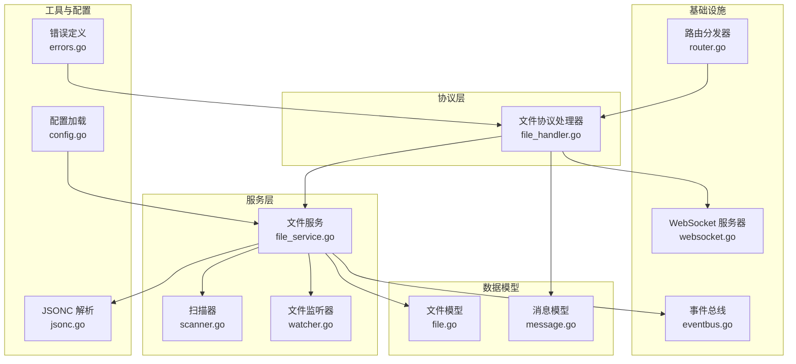
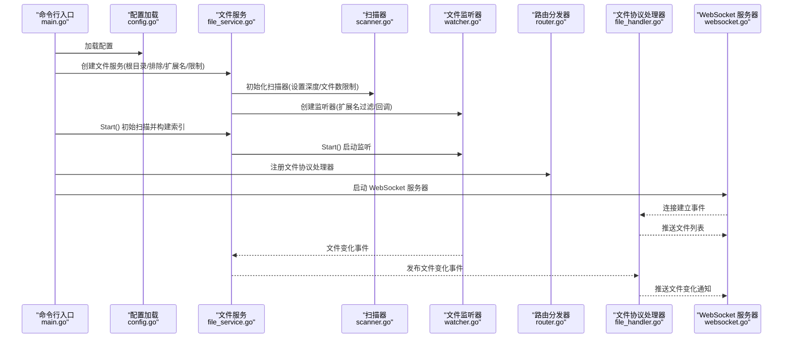
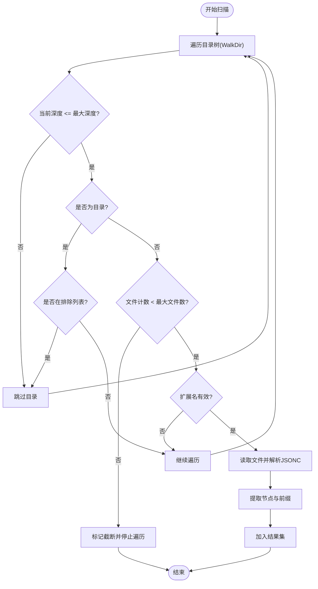
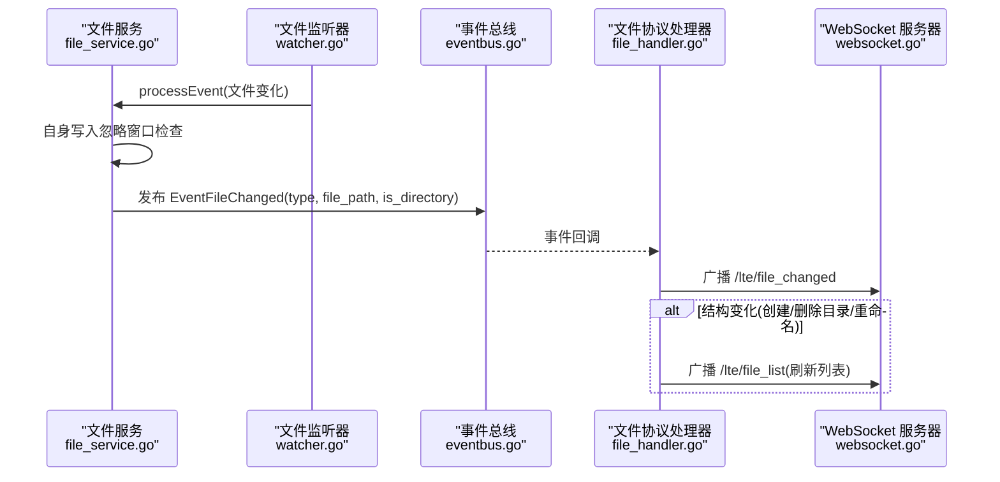
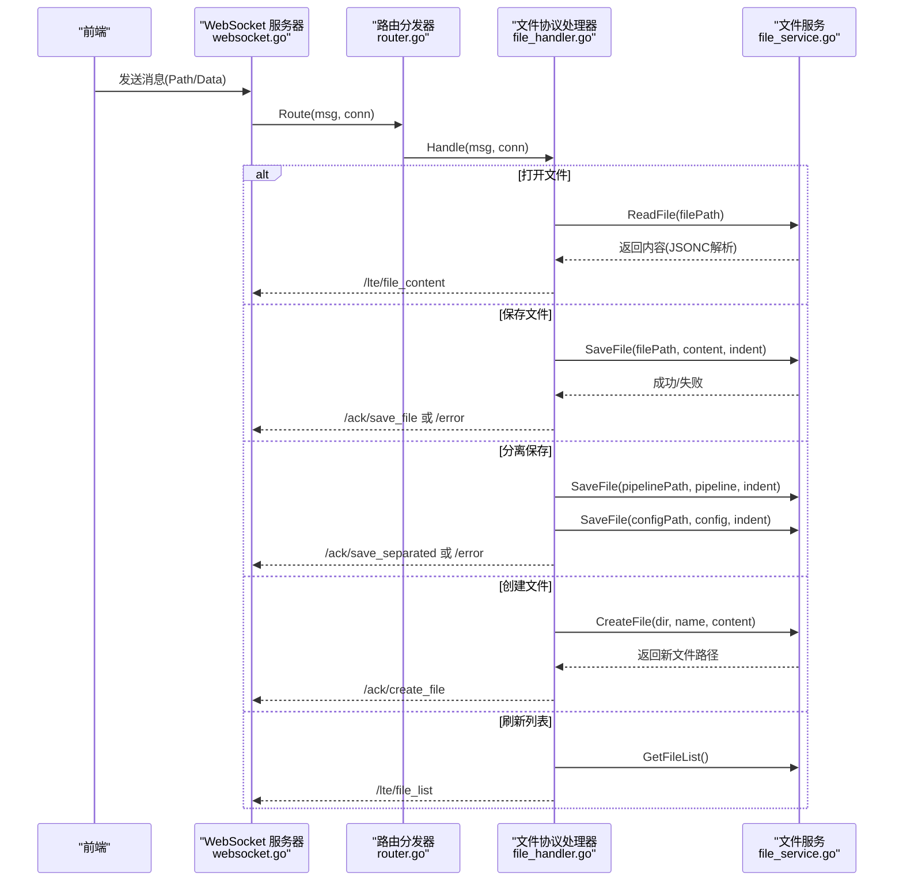
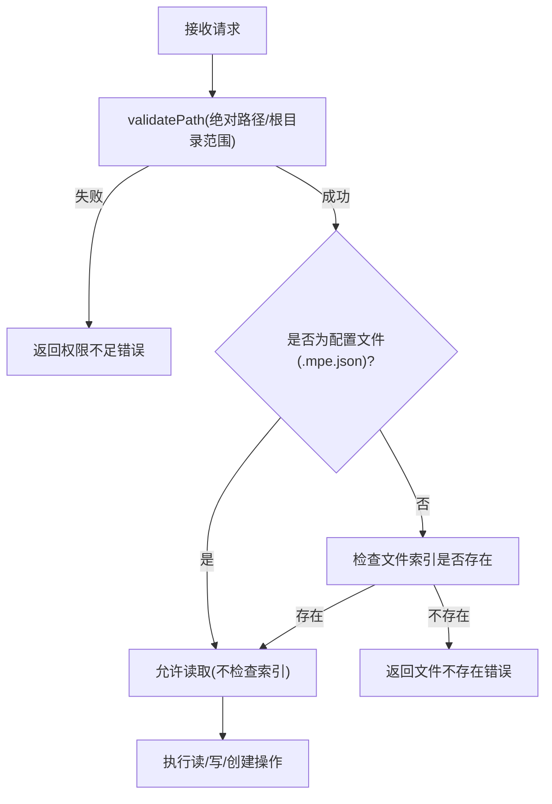
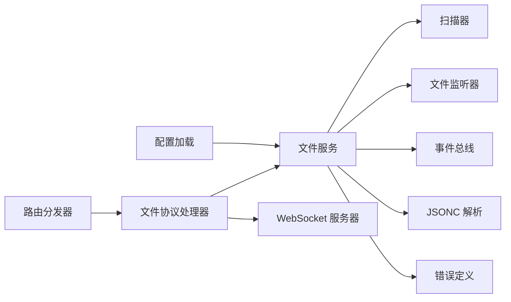

# 文件管理系统

<cite>
**本文档引用的文件**
- [scanner.go](file://LocalBridge/internal/service/file/scanner.go)
- [watcher.go](file://LocalBridge/internal/service/file/watcher.go)
- [file_handler.go](file://LocalBridge/internal/protocol/file/file_handler.go)
- [file_service.go](file://LocalBridge/internal/service/file/file_service.go)
- [file.go](file://LocalBridge/pkg/models/file.go)
- [router.go](file://LocalBridge/internal/router/router.go)
- [websocket.go](file://LocalBridge/internal/server/websocket.go)
- [eventbus.go](file://LocalBridge/internal/eventbus/eventbus.go)
- [jsonc.go](file://LocalBridge/internal/utils/jsonc.go)
- [main.go](file://LocalBridge/cmd/lb/main.go)
- [config.go](file://LocalBridge/internal/config/config.go)
- [errors.go](file://LocalBridge/internal/errors/errors.go)
- [message.go](file://LocalBridge/pkg/models/message.go)
</cite>

## 目录
1. [简介](#简介)
2. [项目结构](#项目结构)
3. [核心组件](#核心组件)
4. [架构总览](#架构总览)
5. [详细组件分析](#详细组件分析)
6. [依赖关系分析](#依赖关系分析)
7. [性能考虑](#性能考虑)
8. [故障排查指南](#故障排查指南)
9. [结论](#结论)
10. [附录](#附录)

## 简介
本文件管理系统基于 LocalBridge 提供的本地文件桥接能力，围绕文件扫描、文件监控、文件协议处理、权限控制与安全机制展开。系统支持：
- 递归扫描与过滤（扩展名、深度、数量限制）
- 实时文件变更检测与通知（含防抖）
- 文件协议处理（打开/保存/分离保存/创建/刷新列表）
- 路径验证与访问控制
- JSONC 解析与安全检查
- 事件总线与 WebSocket 推送

## 项目结构
LocalBridge 的文件管理相关代码主要分布在以下模块：
- 协议层：文件协议处理器负责路由与消息处理
- 服务层：文件服务封装扫描、监控、读写、权限校验
- 扫描与监控：Scanner 负责递归扫描与过滤；Watcher 负责文件系统事件监听与防抖
- 数据模型：统一的消息与文件模型
- 事件总线与 WebSocket：跨组件通信与实时推送
- 配置与错误：配置加载与错误码定义

图表来源
- [file_handler.go:14-35](file://LocalBridge/internal/protocol/file/file_handler.go#L14-L35)
- [file_service.go:19-35](file://LocalBridge/internal/service/file/file_service.go#L19-L35)
- [scanner.go:20-27](file://LocalBridge/internal/service/file/scanner.go#L20-L27)
- [watcher.go:34-41](file://LocalBridge/internal/service/file/watcher.go#L34-L41)
- [eventbus.go:16-20](file://LocalBridge/internal/eventbus/eventbus.go#L16-L20)
- [websocket.go:35-46](file://LocalBridge/internal/server/websocket.go#L35-L46)
- [router.go:28-31](file://LocalBridge/internal/router/router.go#L28-L31)
- [file.go:3-28](file://LocalBridge/pkg/models/file.go#L3-L28)
- [message.go:3-7](file://LocalBridge/pkg/models/message.go#L3-L7)
- [jsonc.go:9-23](file://LocalBridge/internal/utils/jsonc.go#L9-L23)
- [config.go:42-48](file://LocalBridge/internal/config/config.go#L42-L48)
- [errors.go:22-28](file://LocalBridge/internal/errors/errors.go#L22-L28)

章节来源
- [main.go:385-413](file://LocalBridge/cmd/lb/main.go#L385-L413)
- [router.go:40-47](file://LocalBridge/internal/router/router.go#L40-L47)
- [websocket.go:48-58](file://LocalBridge/internal/server/websocket.go#L48-L58)

## 核心组件
- 文件扫描器（Scanner）：递归扫描目录，支持扩展名过滤、深度限制、文件数量限制，并解析文件节点与前缀。
- 文件监听器（Watcher）：基于 fsnotify 监听文件系统事件，提供防抖与事件分类（创建/修改/删除/重命名），并自动跟踪新增目录。
- 文件服务（Service）：聚合扫描与监听，维护文件索引，提供读写、创建、路径安全校验、自身写入忽略窗口等能力。
- 文件协议处理器（Handler）：对接前端协议，处理打开/保存/分离保存/创建/刷新列表等请求，推送文件变化与文件列表。
- 事件总线与 WebSocket：事件广播与实时推送，支持连接建立/关闭事件与文件变化事件。
- JSONC 解析：支持带注释的 JSON（JSONC）解析，兼容行注释、块注释与尾随逗号。
- 配置与错误：集中化配置加载与安全检查，统一错误码与错误包装。

章节来源
- [scanner.go:20-27](file://LocalBridge/internal/service/file/scanner.go#L20-L27)
- [watcher.go:34-41](file://LocalBridge/internal/service/file/watcher.go#L34-L41)
- [file_service.go:19-35](file://LocalBridge/internal/service/file/file_service.go#L19-L35)
- [file_handler.go:14-20](file://LocalBridge/internal/protocol/file/file_handler.go#L14-L20)
- [eventbus.go:16-20](file://LocalBridge/internal/eventbus/eventbus.go#L16-L20)
- [websocket.go:35-46](file://LocalBridge/internal/server/websocket.go#L35-L46)
- [jsonc.go:9-23](file://LocalBridge/internal/utils/jsonc.go#L9-L23)
- [config.go:42-48](file://LocalBridge/internal/config/config.go#L42-L48)
- [errors.go:22-28](file://LocalBridge/internal/errors/errors.go#L22-L28)

## 架构总览
系统采用“协议处理器 -> 服务层 -> 扫描/监控”的分层设计，配合事件总线与 WebSocket 实现实时推送。启动流程中，主程序加载配置、创建服务、注册处理器、启动 WebSocket 服务器并等待信号退出。

图表来源
- [main.go:267-304](file://LocalBridge/cmd/lb/main.go#L267-L304)
- [file_service.go:37-62](file://LocalBridge/internal/service/file/file_service.go#L37-L62)
- [scanner.go:29-38](file://LocalBridge/internal/service/file/scanner.go#L29-L38)
- [watcher.go:43-59](file://LocalBridge/internal/service/file/watcher.go#L43-L59)
- [router.go:40-47](file://LocalBridge/internal/router/router.go#L40-L47)
- [file_handler.go:23-35](file://LocalBridge/internal/protocol/file/file_handler.go#L23-L35)
- [websocket.go:65-93](file://LocalBridge/internal/server/websocket.go#L65-L93)

## 详细组件分析

### 文件扫描机制
- 递归扫描：使用 filepath.WalkDir 遍历目录树，计算相对深度，支持深度限制。
- 文件过滤：扩展名白名单过滤；特殊隐藏配置文件（以 . 开头且以 .mpe.json 结尾）会被排除。
- 大小限制：通过 maxFiles 控制最大文件数量，超过限制时截断并记录原因。
- 节点解析：扫描时解析 JSONC 内容，提取顶层键作为节点名，并识别 $mpe.prefix 作为文件前缀。
- 单文件扫描：支持对单个文件进行扩展名校验与节点解析。

图表来源
- [scanner.go:58-147](file://LocalBridge/internal/service/file/scanner.go#L58-L147)
- [scanner.go:159-174](file://LocalBridge/internal/service/file/scanner.go#L159-L174)
- [scanner.go:212-249](file://LocalBridge/internal/service/file/scanner.go#L212-L249)

章节来源
- [scanner.go:58-147](file://LocalBridge/internal/service/file/scanner.go#L58-L147)
- [scanner.go:159-174](file://LocalBridge/internal/service/file/scanner.go#L159-L174)
- [scanner.go:212-249](file://LocalBridge/internal/service/file/scanner.go#L212-L249)

### 文件监控功能
- 事件类型：创建、修改、删除、重命名；目录变更与文件变更分别处理。
- 目录跟踪：新增目录自动加入监听；删除目录时清理索引。
- 防抖策略：针对同一路径的多次事件进行合并，避免频繁触发。
- 自身写入忽略：写入窗口期内忽略自身触发的修改事件，减少误报。
- 扩展名过滤：仅对指定扩展名文件进行处理，非目标文件直接忽略。

图表来源
- [watcher.go:114-188](file://LocalBridge/internal/service/file/watcher.go#L114-L188)
- [file_service.go:253-343](file://LocalBridge/internal/service/file/file_service.go#L253-L343)
- [eventbus.go:37-51](file://LocalBridge/internal/eventbus/eventbus.go#L37-L51)
- [file_handler.go:257-284](file://LocalBridge/internal/protocol/file/file_handler.go#L257-L284)
- [websocket.go:163-171](file://LocalBridge/internal/server/websocket.go#L163-L171)

章节来源
- [watcher.go:62-92](file://LocalBridge/internal/service/file/watcher.go#L62-L92)
- [watcher.go:114-188](file://LocalBridge/internal/service/file/watcher.go#L114-L188)
- [file_service.go:253-343](file://LocalBridge/internal/service/file/file_service.go#L253-L343)

### 文件协议处理器实现
- 路由前缀：支持 /etl/open_file、/etl/save_file、/etl/save_separated、/etl/create_file、/etl/refresh_file_list。
- 打开文件：读取文件内容与关联的 .mpe.json 配置文件，返回文件内容与配置路径。
- 保存文件：序列化 JSON 并写入文件，支持缩进；写入后清除防抖事件。
- 分离保存：同时保存 Pipeline 与配置文件，分别处理错误。
- 创建文件：校验文件名合法性与目录安全性，写入初始内容并更新索引。
- 刷新列表：主动推送当前文件列表。
- 错误处理：统一包装错误码与错误详情，通过 WebSocket 发送 /error。

图表来源
- [file_handler.go:37-64](file://LocalBridge/internal/protocol/file/file_handler.go#L37-L64)
- [file_handler.go:67-137](file://LocalBridge/internal/protocol/file/file_handler.go#L67-L137)
- [file_handler.go:139-208](file://LocalBridge/internal/protocol/file/file_handler.go#L139-L208)
- [file_handler.go:210-241](file://LocalBridge/internal/protocol/file/file_handler.go#L210-L241)
- [file_handler.go:243-247](file://LocalBridge/internal/protocol/file/file_handler.go#L243-L247)
- [file_service.go:122-156](file://LocalBridge/internal/service/file/file_service.go#L122-L156)
- [file_service.go:158-201](file://LocalBridge/internal/service/file/file_service.go#L158-L201)
- [file_service.go:203-251](file://LocalBridge/internal/service/file/file_service.go#L203-L251)

章节来源
- [file_handler.go:37-64](file://LocalBridge/internal/protocol/file/file_handler.go#L37-L64)
- [file_handler.go:67-137](file://LocalBridge/internal/protocol/file/file_handler.go#L67-L137)
- [file_handler.go:139-208](file://LocalBridge/internal/protocol/file/file_handler.go#L139-L208)
- [file_handler.go:210-241](file://LocalBridge/internal/protocol/file/file_handler.go#L210-L241)
- [file_handler.go:243-247](file://LocalBridge/internal/protocol/file/file_handler.go#L243-L247)

### 文件权限控制与安全机制
- 路径验证：将传入路径转换为绝对路径，确保位于根目录范围内，否则返回权限不足错误。
- 文件存在性：读取非配置文件时检查索引是否存在，不存在则返回文件不存在错误。
- 文件名合法性：创建文件时禁止包含非法字符。
- 安全检查：启动时对根目录进行安全评估，高风险目录会阻止启动并给出建议。
- JSONC 安全：解析前先标准化，避免不规范格式导致异常。

图表来源
- [file_service.go:122-156](file://LocalBridge/internal/service/file/file_service.go#L122-L156)
- [file_service.go:203-251](file://LocalBridge/internal/service/file/file_service.go#L203-L251)
- [file_service.go:345-359](file://LocalBridge/internal/service/file/file_service.go#L345-L359)
- [main.go:222-254](file://LocalBridge/cmd/lb/main.go#L222-L254)

章节来源
- [file_service.go:122-156](file://LocalBridge/internal/service/file/file_service.go#L122-L156)
- [file_service.go:203-251](file://LocalBridge/internal/service/file/file_service.go#L203-L251)
- [file_service.go:345-359](file://LocalBridge/internal/service/file/file_service.go#L345-L359)
- [main.go:222-254](file://LocalBridge/cmd/lb/main.go#L222-L254)

### 数据模型与消息协议
- 文件模型：包含绝对路径、相对路径、文件名、最后修改时间、节点列表与前缀。
- 传输模型：FileInfo 用于列表展示；FileContentData 用于打开文件返回内容与配置路径。
- 协议消息：Message 作为通用载体，包含路径与数据；错误统一为 ErrorData。

章节来源
- [file.go:3-28](file://LocalBridge/pkg/models/file.go#L3-L28)
- [message.go:3-7](file://LocalBridge/pkg/models/message.go#L3-L7)
- [message.go:16-44](file://LocalBridge/pkg/models/message.go#L16-L44)
- [message.go:31-37](file://LocalBridge/pkg/models/message.go#L31-L37)

## 依赖关系分析
- 组件耦合：文件协议处理器依赖文件服务；文件服务依赖扫描器、监听器、事件总线与 JSONC 工具；路由分发器与 WebSocket 服务器贯穿消息流转。
- 外部依赖：fsnotify 用于文件系统事件监听；hujson 用于 JSONC 标准化；viper 用于配置加载。
- 循环依赖：未发现循环依赖，模块职责清晰。

图表来源
- [file_handler.go:14-20](file://LocalBridge/internal/protocol/file/file_handler.go#L14-L20)
- [file_service.go:19-35](file://LocalBridge/internal/service/file/file_service.go#L19-L35)
- [scanner.go:20-27](file://LocalBridge/internal/service/file/scanner.go#L20-L27)
- [watcher.go:34-41](file://LocalBridge/internal/service/file/watcher.go#L34-L41)
- [eventbus.go:16-20](file://LocalBridge/internal/eventbus/eventbus.go#L16-L20)
- [websocket.go:35-46](file://LocalBridge/internal/server/websocket.go#L35-L46)
- [router.go:28-31](file://LocalBridge/internal/router/router.go#L28-L31)
- [jsonc.go:9-23](file://LocalBridge/internal/utils/jsonc.go#L9-L23)
- [errors.go:22-28](file://LocalBridge/internal/errors/errors.go#L22-L28)
- [config.go:42-48](file://LocalBridge/internal/config/config.go#L42-L48)

章节来源
- [router.go:40-47](file://LocalBridge/internal/router/router.go#L40-L47)
- [websocket.go:65-93](file://LocalBridge/internal/server/websocket.go#L65-L93)
- [main.go:385-413](file://LocalBridge/cmd/lb/main.go#L385-L413)

## 性能考虑
- 扫描限制：通过 max_depth 与 max_files 控制扫描规模，避免大规模目录导致内存与 CPU 压力。
- 防抖策略：对高频事件进行合并，降低重复处理成本。
- 自身写入忽略：写入窗口期内忽略事件，减少不必要的索引更新与广播。
- JSONC 解析：先标准化再解析，提升稳定性与性能。
- 并发与锁：文件索引使用读写锁，读多写少场景下提升并发性能。
- WebSocket 广播：批量推送文件列表，避免频繁小消息。

## 故障排查指南
- 启动安全检查失败：若根目录为高风险或未设置限制，系统会阻止启动并给出建议，需调整配置。
- 文件读取失败：检查路径是否在根目录范围内、文件是否存在、JSONC 格式是否正确。
- 文件写入失败：检查权限、磁盘空间、缩进设置；写入后会清除防抖事件，避免延迟触发。
- 监听异常：确认扩展名过滤设置、目录权限、系统文件句柄限制。
- 协议版本不匹配：前端与后端协议版本不一致会导致握手失败，需按提示更新。

章节来源
- [main.go:222-254](file://LocalBridge/cmd/lb/main.go#L222-L254)
- [file_service.go:122-156](file://LocalBridge/internal/service/file/file_service.go#L122-L156)
- [file_service.go:158-201](file://LocalBridge/internal/service/file/file_service.go#L158-L201)
- [watcher.go:114-188](file://LocalBridge/internal/service/file/watcher.go#L114-L188)
- [router.go:107-133](file://LocalBridge/internal/router/router.go#L107-L133)

## 结论
LocalBridge 文件管理系统通过清晰的分层设计与完善的事件机制，实现了高效、安全、可扩展的本地文件管理能力。扫描与监控结合防抖与忽略策略，确保在复杂文件系统中的稳定性；协议层与 WebSocket 的配合提供了实时反馈；严格的路径验证与安全检查保障了系统安全。

## 附录
- 最佳实践
  - 合理设置扫描深度与文件数量上限，避免大规模扫描影响性能。
  - 使用扩展名白名单过滤，减少无关文件干扰。
  - 在高并发写入场景下，利用自身写入忽略窗口减少误报。
  - 对外暴露的根目录应限定在项目范围内，避免高风险目录。
  - JSONC 内容建议使用标准格式，便于解析与维护。
- 性能优化建议
  - 优先使用 SSD 存储，减少 IO 延迟。
  - 合理配置 WebSocket 缓冲区大小与超时时间。
  - 对热点文件采用缓存策略，减少重复解析。
  - 监控事件队列长度，必要时增加防抖延迟以平衡实时性与性能。