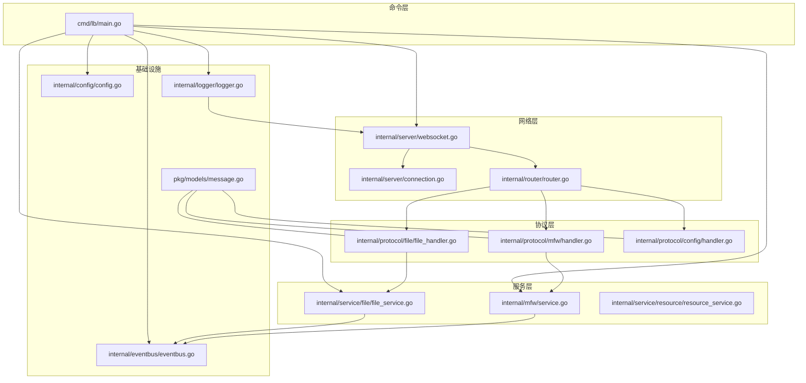
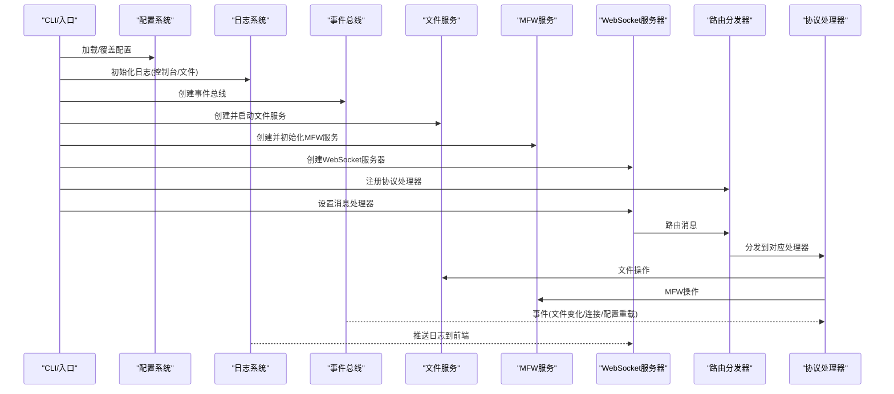
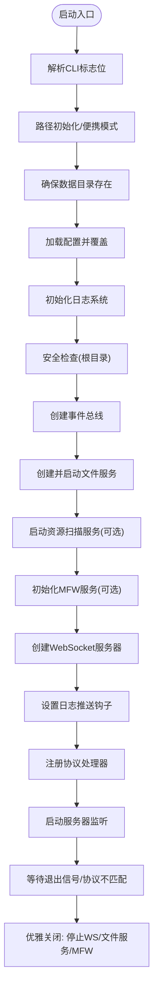
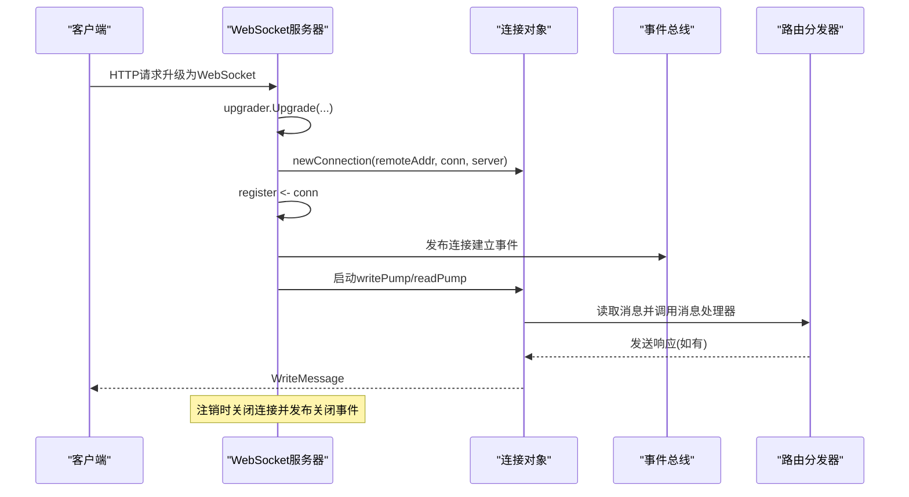
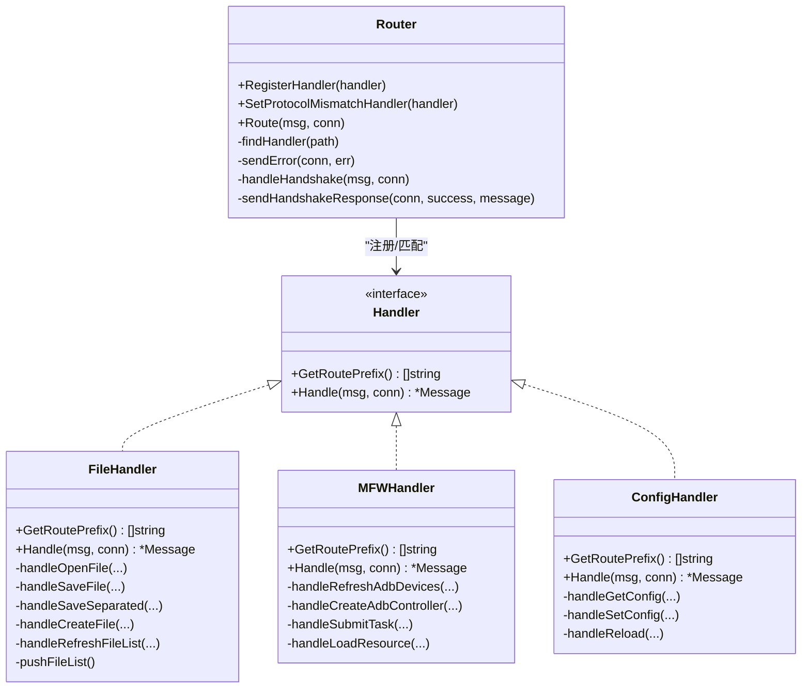
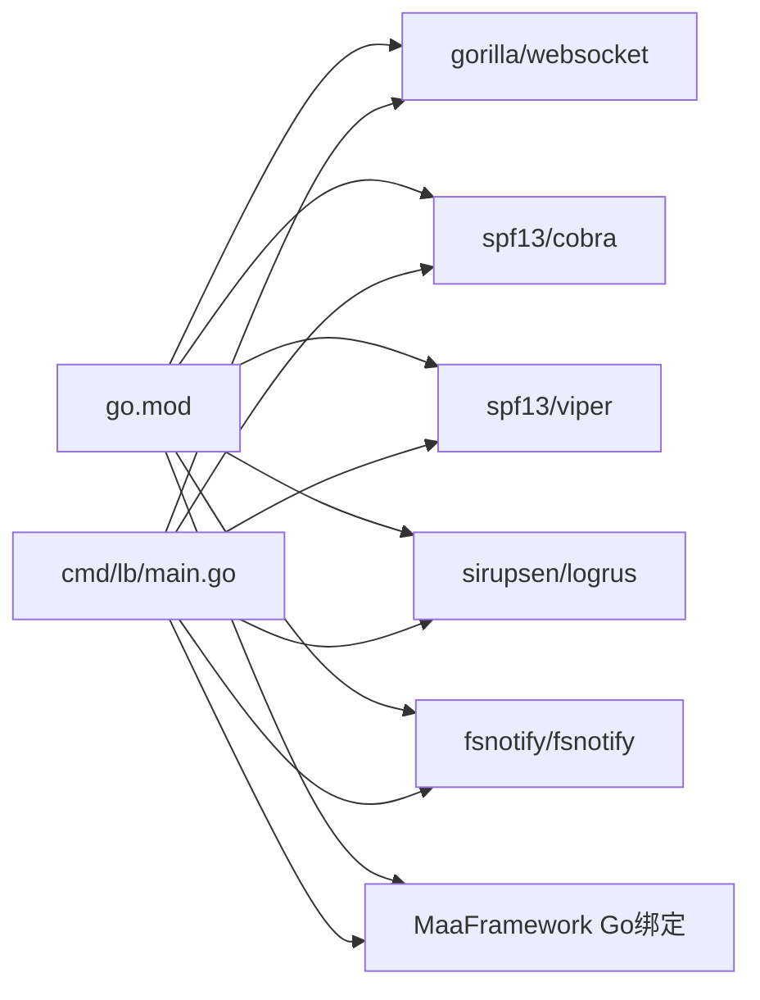

# 服务架构设计

<cite>
**本文档引用的文件**
- [LocalBridge/cmd/lb/main.go](file://LocalBridge/cmd/lb/main.go)
- [LocalBridge/internal/server/websocket.go](file://LocalBridge/internal/server/websocket.go)
- [LocalBridge/internal/server/connection.go](file://LocalBridge/internal/server/connection.go)
- [LocalBridge/internal/router/router.go](file://LocalBridge/internal/router/router.go)
- [LocalBridge/internal/config/config.go](file://LocalBridge/internal/config/config.go)
- [LocalBridge/internal/protocol/file/file_handler.go](file://LocalBridge/internal/protocol/file/file_handler.go)
- [LocalBridge/internal/protocol/mfw/handler.go](file://LocalBridge/internal/protocol/mfw/handler.go)
- [LocalBridge/internal/protocol/config/handler.go](file://LocalBridge/internal/protocol/config/handler.go)
- [LocalBridge/internal/service/file/file_service.go](file://LocalBridge/internal/service/file/file_service.go)
- [LocalBridge/internal/mfw/service.go](file://LocalBridge/internal/mfw/service.go)
- [LocalBridge/internal/eventbus/eventbus.go](file://LocalBridge/internal/eventbus/eventbus.go)
- [LocalBridge/internal/logger/logger.go](file://LocalBridge/internal/logger/logger.go)
- [LocalBridge/pkg/models/message.go](file://LocalBridge/pkg/models/message.go)
- [LocalBridge/go.mod](file://LocalBridge/go.mod)
</cite>

## 目录
1. [简介](#简介)
2. [项目结构](#项目结构)
3. [核心组件](#核心组件)
4. [架构总览](#架构总览)
5. [详细组件分析](#详细组件分析)
6. [依赖分析](#依赖分析)
7. [性能考虑](#性能考虑)
8. [故障排查指南](#故障排查指南)
9. [结论](#结论)
10. [附录](#附录)

## 简介
本文件面向 LocalBridge 服务的架构设计与实现，围绕 Go 语言服务的整体架构模式与设计原则展开，重点覆盖以下方面：
- 服务启动流程与生命周期管理
- 端口分配与监听机制
- 路由系统与协议处理
- WebSocket 连接管理与消息分发
- 服务优雅关闭与错误恢复策略
- 监控、健康检查与性能指标建议
- 组件交互关系与可视化图示

LocalBridge 作为 MaaPipelineEditor 的本地桥接服务，提供文件管理、MaaFramework 设备与任务控制、资源扫描、日志推送等能力，并通过统一的 WebSocket 协议与前端通信。

## 项目结构
LocalBridge 采用分层与职责分离的组织方式：
- cmd/lb：命令入口与 CLI 子命令定义
- internal/*：核心业务与基础设施
  - config：配置加载与校验
  - server：WebSocket 服务器与连接管理
  - router：消息路由与协议版本握手
  - protocol/*：协议处理器（文件、MFW、配置等）
  - service/*：具体服务（文件扫描/监听、资源扫描）
  - mfw：MaaFramework 封装与管理
  - eventbus：事件总线
  - logger：日志系统
- pkg/models：跨模块共享的数据模型
- go.mod：依赖管理

**图表来源**
- [LocalBridge/cmd/lb/main.go:185-468](file://LocalBridge/cmd/lb/main.go#L185-L468)
- [LocalBridge/internal/server/websocket.go:49-93](file://LocalBridge/internal/server/websocket.go#L49-L93)
- [LocalBridge/internal/router/router.go:36-83](file://LocalBridge/internal/router/router.go#L36-L83)
- [LocalBridge/internal/protocol/file/file_handler.go:23-64](file://LocalBridge/internal/protocol/file/file_handler.go#L23-L64)
- [LocalBridge/internal/protocol/mfw/handler.go:20-30](file://LocalBridge/internal/protocol/mfw/handler.go#L20-L30)
- [LocalBridge/internal/protocol/config/handler.go:16-23](file://LocalBridge/internal/protocol/config/handler.go#L16-L23)
- [LocalBridge/internal/service/file/file_service.go:38-62](file://LocalBridge/internal/service/file/file_service.go#L38-L62)
- [LocalBridge/internal/mfw/service.go:26-34](file://LocalBridge/internal/mfw/service.go#L26-L34)
- [LocalBridge/internal/config/config.go:54-95](file://LocalBridge/internal/config/config.go#L54-L95)
- [LocalBridge/internal/eventbus/eventbus.go:23-51](file://LocalBridge/internal/eventbus/eventbus.go#L23-L51)
- [LocalBridge/internal/logger/logger.go:43-100](file://LocalBridge/internal/logger/logger.go#L43-L100)
- [LocalBridge/pkg/models/message.go:4-7](file://LocalBridge/pkg/models/message.go#L4-L7)

**章节来源**
- [LocalBridge/cmd/lb/main.go:136-168](file://LocalBridge/cmd/lb/main.go#L136-L168)
- [LocalBridge/go.mod:1-38](file://LocalBridge/go.mod#L1-L38)

## 核心组件
- 命令入口与生命周期
  - CLI 子命令：启动服务、配置管理、信息展示、日志目录打开等
  - 生命周期：启动初始化 → 服务运行 → 优雅关闭
- WebSocket 服务器
  - 协议版本常量与握手路由
  - 连接注册/注销、广播、活跃连接统计
- 路由分发器
  - 前缀匹配与处理器注册
  - 协议版本不匹配回调
- 协议处理器
  - 文件协议：打开/保存/分离保存/创建/刷新列表
  - MFW 协议：设备发现、控制器创建/连接/操作、任务提交/查询/停止、资源加载与自定义识别/动作注册
  - 配置协议：获取/设置/重载配置
- 服务层
  - 文件服务：扫描、索引、监听、安全路径校验、保存/创建逻辑
  - MFW 服务：框架初始化/重载/关闭、设备/控制器/资源/任务管理
- 基础设施
  - 配置系统：默认值、路径规范化、安全检查
  - 事件总线：文件变化、连接建立/关闭、配置重载
  - 日志系统：控制台/文件双通道、历史日志缓存、推送钩子

**章节来源**
- [LocalBridge/cmd/lb/main.go:185-468](file://LocalBridge/cmd/lb/main.go#L185-L468)
- [LocalBridge/internal/server/websocket.go:15-93](file://LocalBridge/internal/server/websocket.go#L15-L93)
- [LocalBridge/internal/router/router.go:29-83](file://LocalBridge/internal/router/router.go#L29-L83)
- [LocalBridge/internal/protocol/file/file_handler.go:14-64](file://LocalBridge/internal/protocol/file/file_handler.go#L14-L64)
- [LocalBridge/internal/protocol/mfw/handler.go:14-30](file://LocalBridge/internal/protocol/mfw/handler.go#L14-L30)
- [LocalBridge/internal/protocol/config/handler.go:12-23](file://LocalBridge/internal/protocol/config/handler.go#L12-L23)
- [LocalBridge/internal/service/file/file_service.go:19-62](file://LocalBridge/internal/service/file/file_service.go#L19-L62)
- [LocalBridge/internal/mfw/service.go:15-34](file://LocalBridge/internal/mfw/service.go#L15-L34)
- [LocalBridge/internal/config/config.go:13-48](file://LocalBridge/internal/config/config.go#L13-L48)
- [LocalBridge/internal/eventbus/eventbus.go:16-51](file://LocalBridge/internal/eventbus/eventbus.go#L16-L51)
- [LocalBridge/internal/logger/logger.go:13-100](file://LocalBridge/internal/logger/logger.go#L13-L100)
- [LocalBridge/pkg/models/message.go:3-14](file://LocalBridge/pkg/models/message.go#L3-L14)

## 架构总览
LocalBridge 采用“命令入口 → 服务初始化 → WebSocket 服务器 → 路由分发 → 协议处理器 → 服务/基础设施”的流水线式架构。消息以统一的 Message 结构在连接与处理器之间流转；事件总线贯穿文件扫描、连接状态、配置重载等横切关注点；日志系统同时输出到控制台与文件，并可推送至前端。

**图表来源**
- [LocalBridge/cmd/lb/main.go:202-434](file://LocalBridge/cmd/lb/main.go#L202-L434)
- [LocalBridge/internal/server/websocket.go:66-93](file://LocalBridge/internal/server/websocket.go#L66-L93)
- [LocalBridge/internal/router/router.go:57-83](file://LocalBridge/internal/router/router.go#L57-L83)
- [LocalBridge/internal/protocol/file/file_handler.go:49-64](file://LocalBridge/internal/protocol/file/file_handler.go#L49-L64)
- [LocalBridge/internal/protocol/mfw/handler.go:32-30](file://LocalBridge/internal/protocol/mfw/handler.go#L32-L30)
- [LocalBridge/internal/protocol/config/handler.go:26-47](file://LocalBridge/internal/protocol/config/handler.go#L26-L47)
- [LocalBridge/internal/service/file/file_service.go:65-95](file://LocalBridge/internal/service/file/file_service.go#L65-L95)
- [LocalBridge/internal/mfw/service.go:37-138](file://LocalBridge/internal/mfw/service.go#L37-L138)
- [LocalBridge/internal/logger/logger.go:103-162](file://LocalBridge/internal/logger/logger.go#L103-L162)

## 详细组件分析

### 命令入口与服务启动流程
- CLI 子命令与标志位：配置路径、根目录、端口、日志目录/级别、便携模式、版本信息等
- 启动步骤：
  - 设置便携模式与路径初始化
  - 确保数据目录存在
  - 加载配置并从命令行覆盖
  - 初始化日志系统（含推送钩子）
  - 安全性检查（根目录风险评估）
  - 初始化事件总线
  - 创建并启动文件服务、资源扫描服务
  - 初始化 MFW 服务（可选）
  - 创建 WebSocket 服务器并设置消息处理器
  - 注册协议处理器（文件/MFW/配置/资源/调试等）
  - 启动服务器监听
  - 信号监听与优雅关闭

**图表来源**
- [LocalBridge/cmd/lb/main.go:185-468](file://LocalBridge/cmd/lb/main.go#L185-L468)

**章节来源**
- [LocalBridge/cmd/lb/main.go:136-168](file://LocalBridge/cmd/lb/main.go#L136-L168)
- [LocalBridge/cmd/lb/main.go:185-468](file://LocalBridge/cmd/lb/main.go#L185-L468)

### 端口分配与监听机制
- 端口来源：配置中的 server.host/server.port
- 监听实现：基于 net/http 的 http.Server，设置超时参数
- 在启动日志中输出在线服务地址（便于外部访问）

**章节来源**
- [LocalBridge/internal/config/config.go:14-17](file://LocalBridge/internal/config/config.go#L14-L17)
- [LocalBridge/internal/server/websocket.go:75-92](file://LocalBridge/internal/server/websocket.go#L75-L92)

### WebSocket 连接管理与消息分发
- 协议版本：统一常量，握手路由固定
- 连接生命周期：
  - 升级为 WebSocket
  - 创建连接对象，注册到连接管理协程
  - 启动读/写泵协程
  - 注销时关闭连接并发布事件
- 广播：遍历活跃连接发送消息
- 活跃连接数：读锁保护的统计

**图表来源**
- [LocalBridge/internal/server/websocket.go:145-161](file://LocalBridge/internal/server/websocket.go#L145-L161)
- [LocalBridge/internal/server/websocket.go:115-142](file://LocalBridge/internal/server/websocket.go#L115-L142)
- [LocalBridge/internal/server/connection.go:32-76](file://LocalBridge/internal/server/connection.go#L32-L76)
- [LocalBridge/internal/router/router.go:57-83](file://LocalBridge/internal/router/router.go#L57-L83)

**章节来源**
- [LocalBridge/internal/server/websocket.go:36-93](file://LocalBridge/internal/server/websocket.go#L36-L93)
- [LocalBridge/internal/server/connection.go:13-96](file://LocalBridge/internal/server/connection.go#L13-L96)

### 路由系统与协议处理
- 路由器：
  - 支持精确匹配与前缀匹配
  - 特殊处理版本握手
  - 未知路由返回错误
- 协议处理器：
  - 文件协议：打开/保存/分离保存/创建/刷新列表
  - MFW 协议：设备/控制器/任务/资源/自定义扩展
  - 配置协议：获取/设置/重载
- 协议版本不匹配：触发回调并主动退出

**图表来源**
- [LocalBridge/internal/router/router.go:29-161](file://LocalBridge/internal/router/router.go#L29-L161)
- [LocalBridge/internal/protocol/file/file_handler.go:15-64](file://LocalBridge/internal/protocol/file/file_handler.go#L15-L64)
- [LocalBridge/internal/protocol/mfw/handler.go:15-30](file://LocalBridge/internal/protocol/mfw/handler.go#L15-L30)
- [LocalBridge/internal/protocol/config/handler.go:13-23](file://LocalBridge/internal/protocol/config/handler.go#L13-L23)

**章节来源**
- [LocalBridge/internal/router/router.go:57-161](file://LocalBridge/internal/router/router.go#L57-L161)
- [LocalBridge/internal/protocol/file/file_handler.go:49-358](file://LocalBridge/internal/protocol/file/file_handler.go#L49-L358)
- [LocalBridge/internal/protocol/mfw/handler.go:32-128](file://LocalBridge/internal/protocol/mfw/handler.go#L32-L128)
- [LocalBridge/internal/protocol/config/handler.go:26-204](file://LocalBridge/internal/protocol/config/handler.go#L26-L204)

### 文件服务与资源扫描
- 文件服务：
  - 初始扫描构建索引，限制深度与文件数
  - 文件监听器捕获创建/修改/删除/重命名事件
  - 自身写入防抖，避免重复事件风暴
  - 路径安全校验，禁止越权访问
  - 保存/创建支持保持字段顺序（JSONC）
- 资源扫描服务：
  - 启动后扫描并发布完成事件
  - 重载时根据配置重新扫描

**章节来源**
- [LocalBridge/internal/service/file/file_service.go:38-406](file://LocalBridge/internal/service/file/file_service.go#L38-L406)
- [LocalBridge/internal/config/config.go:235-296](file://LocalBridge/internal/config/config.go#L235-L296)

### MaaFramework 服务封装
- 初始化：
  - 从配置读取库路径，处理 Windows 中文路径问题（短路径/工作目录切换）
  - 设置日志目录、保存截图开关、调试模式等
- 重载与关闭：
  - 重载先关闭再初始化
  - 关闭时断开控制器、卸载资源、释放框架
- 管理器聚合：设备/控制器/资源/任务管理器

**章节来源**
- [LocalBridge/internal/mfw/service.go:37-218](file://LocalBridge/internal/mfw/service.go#L37-L218)

### 配置系统与安全检查
- 默认值：server/host/port、file/exclude/extensions/max_depth/max_files、log/level/dir/push_to_client、maafw/enabled/lib_dir/resource_dir
- 路径规范化：绝对化与存在性校验
- 安全检查：高/中/低风险目录判定与建议
- 命令行覆盖：root/logDir/logLevel/port

**章节来源**
- [LocalBridge/internal/config/config.go:54-212](file://LocalBridge/internal/config/config.go#L54-L212)
- [LocalBridge/internal/config/config.go:235-339](file://LocalBridge/internal/config/config.go#L235-L339)

### 事件总线与日志系统
- 事件总线：
  - 同步/异步发布
  - 文件扫描完成、文件变化、连接建立/关闭、资源扫描完成、配置重载
- 日志系统：
  - 控制台与文件双通道
  - 历史日志缓存（固定大小）
  - 推送钩子：将日志推送到前端

**章节来源**
- [LocalBridge/internal/eventbus/eventbus.go:23-83](file://LocalBridge/internal/eventbus/eventbus.go#L23-L83)
- [LocalBridge/internal/logger/logger.go:43-251](file://LocalBridge/internal/logger/logger.go#L43-L251)

## 依赖分析
- 外部依赖要点：
  - gorilla/websocket：WebSocket 实现
  - spf13/cobra：CLI 命令框架
  - spf13/viper：配置读取与解析
  - sirupsen/logrus：日志
  - fsnotify：文件监听
  - MaaFramework Go 绑定：设备/控制器/任务/资源
- 模块间耦合：
  - 路由器与处理器松耦合（通过接口与前缀匹配）
  - 服务器与处理器通过消息处理器回调解耦
  - 事件总线作为横切基础设施降低模块间耦合

**图表来源**
- [LocalBridge/go.mod:5-16](file://LocalBridge/go.mod#L5-L16)
- [LocalBridge/cmd/lb/main.go:3-37](file://LocalBridge/cmd/lb/main.go#L3-L37)

**章节来源**
- [LocalBridge/go.mod:1-38](file://LocalBridge/go.mod#L1-L38)

## 性能考虑
- 连接与消息处理
  - 连接读/写泵协程分离，避免阻塞
  - 发送队列容量与丢弃策略，防止内存膨胀
- 文件服务
  - 初始扫描限制深度与文件数，避免大规模扫描阻塞
  - 文件监听采用防抖窗口，减少频繁事件风暴
  - 路径安全校验与索引查找 O(1)，列表排序稳定化
- 日志
  - 历史日志缓存上限，避免无限增长
  - 文件日志全级别记录，控制台仅推送关键级别
- MFW
  - 初始化阶段处理路径编码问题，避免后续运行时异常
  - 重载时有序释放资源，降低碎片化

[本节为通用指导，无需特定文件引用]

## 故障排查指南
- 协议版本不一致
  - 现象：握手失败并记录错误
  - 处理：触发回调并主动退出
  - 建议：同步前后端版本
- MFW 初始化失败
  - 现象：库版本不匹配或 panic
  - 处理：捕获 panic 并提示更新 MaaFramework
  - 建议：使用官方发布包，检查 lib_dir 与资源目录
- 文件路径越权
  - 现象：权限不足错误
  - 处理：路径安全校验失败
  - 建议：限定在 root 目录内操作
- 日志推送异常
  - 现象：前端无日志
  - 处理：检查日志推送钩子与连接建立事件
  - 建议：确认 log.push_to_client 配置

**章节来源**
- [LocalBridge/internal/router/router.go:115-143](file://LocalBridge/internal/router/router.go#L115-L143)
- [LocalBridge/internal/mfw/service.go:42-51](file://LocalBridge/internal/mfw/service.go#L42-L51)
- [LocalBridge/internal/service/file/file_service.go:391-405](file://LocalBridge/internal/service/file/file_service.go#L391-L405)
- [LocalBridge/internal/logger/logger.go:103-162](file://LocalBridge/internal/logger/logger.go#L103-L162)

## 结论
LocalBridge 通过清晰的分层与解耦设计，实现了稳定的本地服务：以 WebSocket 为统一通信面，以路由与协议处理器承载业务能力，以事件总线与日志系统提供可观测性与横切能力。其启动流程严谨、优雅关闭可靠、错误处理明确，适合在桌面与本地开发场景中长期运行。

[本节为总结性内容，无需特定文件引用]

## 附录
- 数据模型概览（消息结构与常用数据载体）
  - 通用消息：path + data
  - 错误数据：code + message + detail
  - 文件列表/内容/变更通知
  - 日志数据
  - 握手请求/响应

**章节来源**
- [LocalBridge/pkg/models/message.go:4-129](file://LocalBridge/pkg/models/message.go#L4-L129)