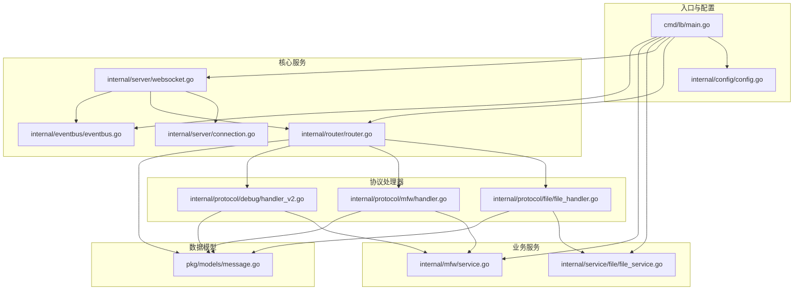
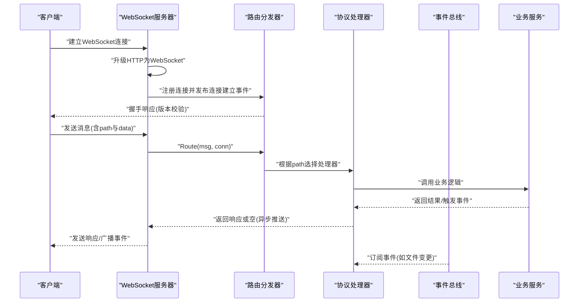
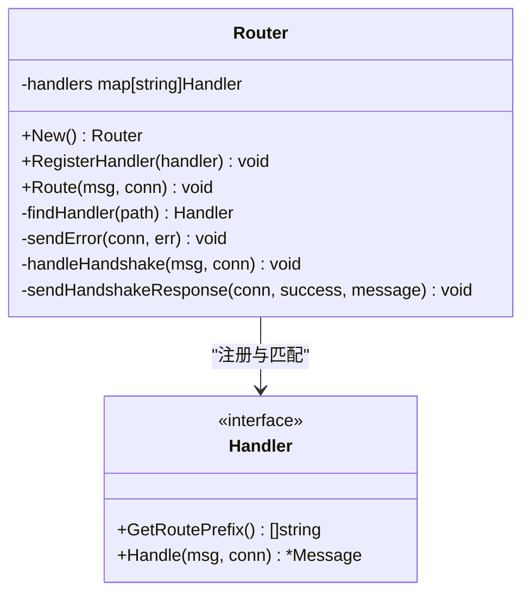
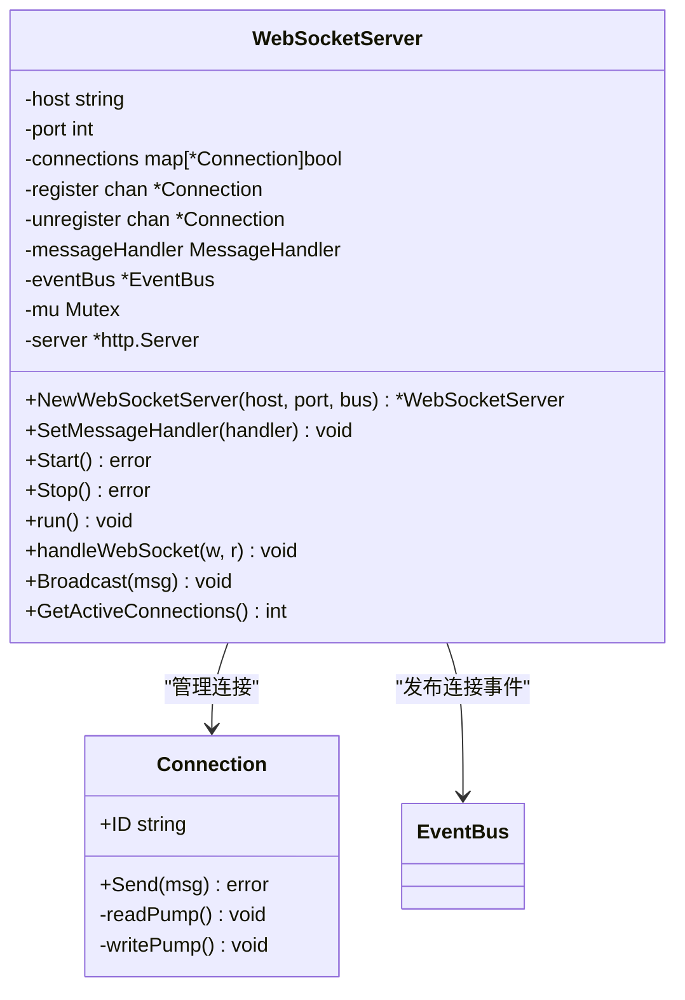
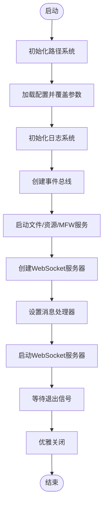
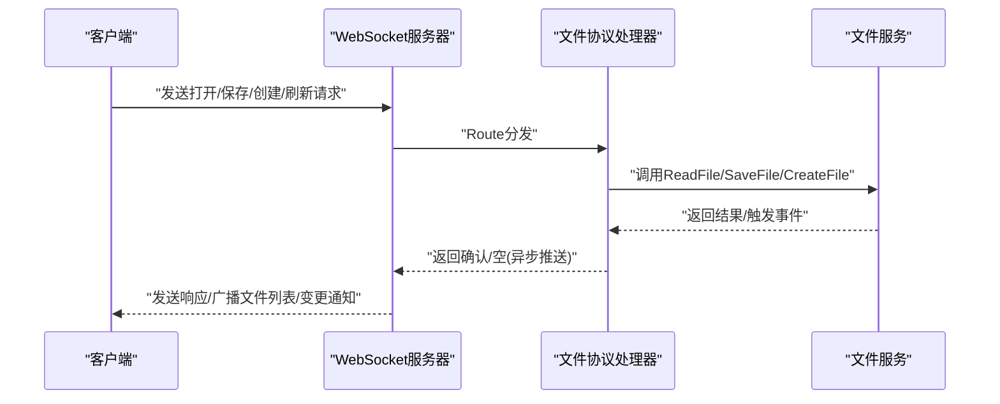
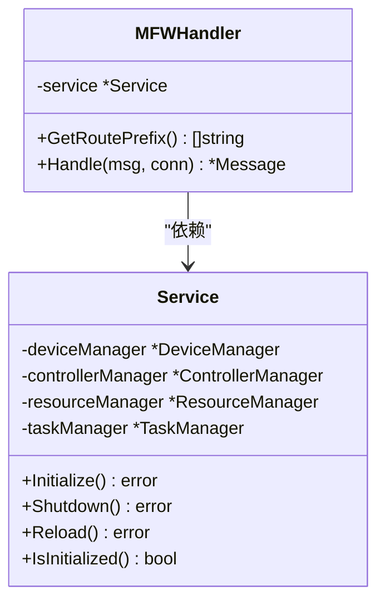
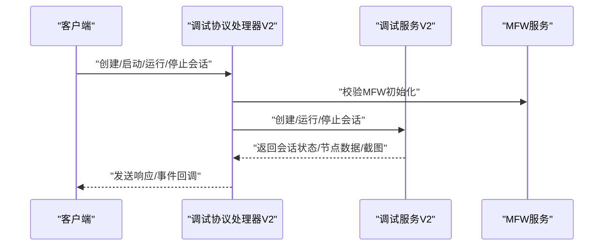
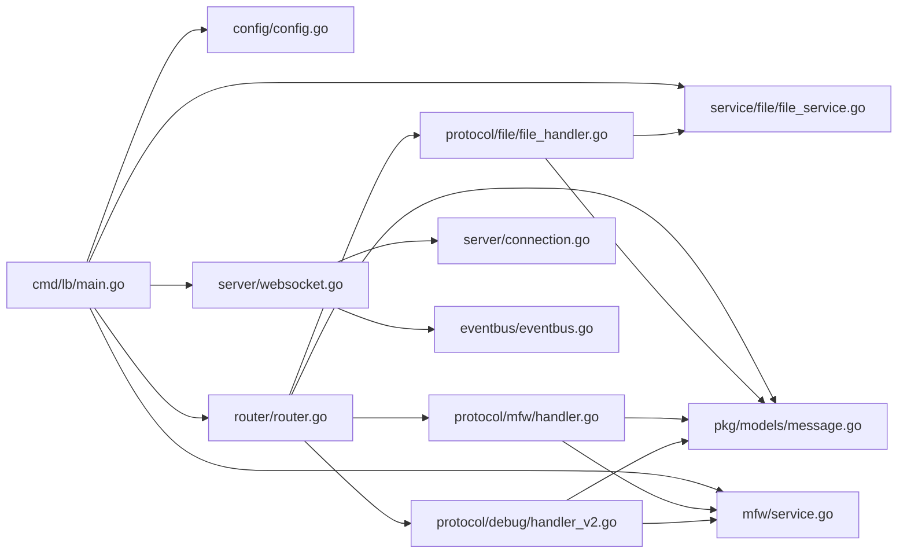

# 服务架构设计

<cite>
**本文档引用的文件**
- [main.go](file://LocalBridge/cmd/lb/main.go)
- [router.go](file://LocalBridge/internal/router/router.go)
- [websocket.go](file://LocalBridge/internal/server/websocket.go)
- [connection.go](file://LocalBridge/internal/server/connection.go)
- [message.go](file://LocalBridge/pkg/models/message.go)
- [config.go](file://LocalBridge/internal/config/config.go)
- [eventbus.go](file://LocalBridge/internal/eventbus/eventbus.go)
- [file_handler.go](file://LocalBridge/internal/protocol/file/file_handler.go)
- [mfw_handler.go](file://LocalBridge/internal/protocol/mfw/handler.go)
- [debug_handler_v2.go](file://LocalBridge/internal/protocol/debug/handler_v2.go)
- [file_service.go](file://LocalBridge/internal/service/file/file_service.go)
- [service.go](file://LocalBridge/internal/mfw/service.go)
</cite>

## 目录
1. [简介](#简介)
2. [项目结构](#项目结构)
3. [核心组件](#核心组件)
4. [架构总览](#架构总览)
5. [详细组件分析](#详细组件分析)
6. [依赖关系分析](#依赖关系分析)
7. [性能考虑](#性能考虑)
8. [故障排查指南](#故障排查指南)
9. [结论](#结论)

## 简介
本文件面向LocalBridge服务的架构设计，围绕Go语言服务的整体架构、模块划分、依赖管理、路由系统、WebSocket服务器、服务生命周期管理等方面进行深入说明，并提供架构图与组件关系图，帮助开发者理解各模块间的交互方式与数据流向。

## 项目结构
LocalBridge采用清晰的分层与职责分离：
- cmd/lb：服务入口与命令行子命令定义
- internal：核心业务逻辑与基础设施
  - config：配置管理
  - eventbus：事件总线
  - logger：日志系统
  - mfw：MaaFramework集成与设备/控制器/任务/资源管理
  - protocol：协议处理器（文件、MFW、调试等）
  - router：消息路由分发
  - server：WebSocket服务器与连接管理
  - service：文件服务与资源扫描服务
  - utils：工具类
- pkg/models：跨模块共享的数据模型
- go.mod/go.sum：依赖管理



图表来源
- [main.go:160-440](file://LocalBridge/cmd/lb/main.go#L160-L440)
- [router.go:28-93](file://LocalBridge/internal/router/router.go#L28-L93)
- [websocket.go:35-93](file://LocalBridge/internal/server/websocket.go#L35-L93)
- [connection.go:12-96](file://LocalBridge/internal/server/connection.go#L12-L96)
- [file_handler.go:14-64](file://LocalBridge/internal/protocol/file/file_handler.go#L14-L64)
- [mfw_handler.go:11-27](file://LocalBridge/internal/protocol/mfw/handler.go#L11-L27)
- [debug_handler_v2.go:16-33](file://LocalBridge/internal/protocol/debug/handler_v2.go#L16-L33)
- [file_service.go:19-62](file://LocalBridge/internal/service/file/file_service.go#L19-L62)
- [service.go:15-34](file://LocalBridge/internal/mfw/service.go#L15-L34)
- [message.go:3-126](file://LocalBridge/pkg/models/message.go#L3-L126)

章节来源
- [main.go:160-440](file://LocalBridge/cmd/lb/main.go#L160-L440)
- [router.go:28-93](file://LocalBridge/internal/router/router.go#L28-L93)
- [websocket.go:35-93](file://LocalBridge/internal/server/websocket.go#L35-L93)

## 核心组件
- 服务入口与生命周期
  - 命令行入口：使用Cobra定义主命令与子命令，负责解析参数、加载配置、初始化日志、启动服务、注册信号处理与优雅关闭。
  - 生命周期：启动阶段初始化路径系统、加载配置、初始化日志、创建事件总线、启动文件服务与资源扫描服务、初始化MFW服务、创建WebSocket服务器、注册协议处理器、启动WS服务器；退出阶段关闭WS、文件服务、MFW服务。
- 路由系统
  - 路由器：维护处理器映射表，支持精确匹配与前缀匹配；内置版本握手处理；统一错误响应。
  - 协议处理器：实现Handler接口，声明路由前缀，具体处理消息并返回响应或空（异步推送）。
- WebSocket服务器
  - 连接管理：升级HTTP为WebSocket，维护连接集合，注册/注销通道，广播消息，统计活跃连接数。
  - 事件总线：发布连接建立/断开事件，供上层订阅。
- 事件总线
  - 提供同步/异步事件发布与订阅，支持多类型事件（文件扫描完成、文件变更、连接建立/关闭、配置重载等）。
- 协议处理器
  - 文件协议：打开/保存/分离保存/创建文件/刷新文件列表；订阅文件变更事件并广播给客户端。
  - MFW协议：设备/控制器/任务/资源管理；统一错误封装。
  - 调试协议V2：会话管理、调试控制、数据查询、事件回调。
- 业务服务
  - 文件服务：扫描/监听文件变化、安全路径校验、读写JSONC、防自写触发。
  - MFW服务：初始化/重载/关闭、设备/控制器/任务/资源管理器聚合。

章节来源
- [main.go:182-440](file://LocalBridge/cmd/lb/main.go#L182-L440)
- [router.go:19-151](file://LocalBridge/internal/router/router.go#L19-L151)
- [websocket.go:35-179](file://LocalBridge/internal/server/websocket.go#L35-L179)
- [connection.go:12-96](file://LocalBridge/internal/server/connection.go#L12-L96)
- [eventbus.go:16-83](file://LocalBridge/internal/eventbus/eventbus.go#L16-L83)
- [file_handler.go:14-328](file://LocalBridge/internal/protocol/file/file_handler.go#L14-L328)
- [mfw_handler.go:11-800](file://LocalBridge/internal/protocol/mfw/handler.go#L11-L800)
- [debug_handler_v2.go:16-520](file://LocalBridge/internal/protocol/debug/handler_v2.go#L16-L520)
- [file_service.go:19-360](file://LocalBridge/internal/service/file/file_service.go#L19-L360)
- [service.go:15-218](file://LocalBridge/internal/mfw/service.go#L15-L218)

## 架构总览
LocalBridge采用“入口-路由-协议处理器-业务服务-事件总线”的分层架构，WebSocket作为统一通信通道承载消息分发与事件推送。



图表来源
- [websocket.go:144-161](file://LocalBridge/internal/server/websocket.go#L144-L161)
- [router.go:49-76](file://LocalBridge/internal/router/router.go#L49-L76)
- [file_handler.go:48-64](file://LocalBridge/internal/protocol/file/file_handler.go#L48-L64)
- [eventbus.go:37-51](file://LocalBridge/internal/eventbus/eventbus.go#L37-L51)

## 详细组件分析

### 路由系统设计
- 路由器职责
  - 维护处理器映射：key为路由前缀，value为Handler实例。
  - 版本握手：统一处理协议版本校验，失败时返回错误消息。
  - 错误处理：未匹配处理器时统一返回错误消息。
- 处理器接口
  - GetRoutePrefix：声明该处理器负责的路由前缀集合。
  - Handle：接收消息与连接对象，返回响应消息或空（异步推送）。
- 匹配策略
  - 精确匹配优先，其次前缀匹配，提升灵活性与兼容性。



图表来源
- [router.go:28-151](file://LocalBridge/internal/router/router.go#L28-L151)

章节来源
- [router.go:19-151](file://LocalBridge/internal/router/router.go#L19-L151)

### WebSocket服务器实现
- 连接管理
  - 升级与读写：使用gorilla/websocket，分别启动读/写协程。
  - 注册/注销：通过通道管理连接集合，发布连接建立/断开事件。
  - 广播：遍历连接集合发送消息。
- 服务器生命周期
  - Start：启动连接管理协程，创建HTTP服务器，监听端口。
  - Stop：关闭所有连接并关闭HTTP服务器。
- 协议版本
  - 统一协议版本常量，握手时进行版本校验。



图表来源
- [websocket.go:35-179](file://LocalBridge/internal/server/websocket.go#L35-L179)
- [connection.go:12-96](file://LocalBridge/internal/server/connection.go#L12-L96)

章节来源
- [websocket.go:35-179](file://LocalBridge/internal/server/websocket.go#L35-L179)
- [connection.go:12-96](file://LocalBridge/internal/server/connection.go#L12-L96)

### 服务生命周期管理
- 启动流程
  - 初始化路径系统与配置，加载并覆盖配置，初始化日志。
  - 创建事件总线，启动文件服务与资源扫描服务，初始化MFW服务。
  - 创建WebSocket服务器，设置消息处理器，启动WS服务器。
  - 注册信号处理，等待退出信号。
- 优雅关闭
  - 收到退出信号后，依次关闭WS服务器、文件服务、MFW服务。
- 错误处理
  - 启动阶段遇到致命错误直接退出。
  - 运行阶段通过日志与错误消息反馈问题。



图表来源
- [main.go:182-440](file://LocalBridge/cmd/lb/main.go#L182-L440)

章节来源
- [main.go:182-440](file://LocalBridge/cmd/lb/main.go#L182-L440)

### 协议处理器详解

#### 文件协议处理器
- 路由前缀：/etl/open_file、/etl/save_file、/etl/save_separated、/etl/create_file、/etl/refresh_file_list
- 功能要点
  - 打开文件：读取Pipeline文件，尝试读取同目录下的.mpe.json配置文件并返回内容。
  - 保存文件：保存单文件，支持缩进。
  - 分离保存：同时保存Pipeline与配置文件。
  - 创建文件：在指定目录创建文件，返回创建结果。
  - 刷新文件列表：主动推送文件列表。
  - 事件订阅：连接建立时推送文件列表；文件变更时广播变更通知并按需刷新列表。
- 错误处理：统一封装LBError并通过消息通道返回。



图表来源
- [file_handler.go:48-328](file://LocalBridge/internal/protocol/file/file_handler.go#L48-L328)
- [file_service.go:64-360](file://LocalBridge/internal/service/file/file_service.go#L64-L360)

章节来源
- [file_handler.go:14-328](file://LocalBridge/internal/protocol/file/file_handler.go#L14-L328)
- [file_service.go:19-360](file://LocalBridge/internal/service/file/file_service.go#L19-L360)

#### MFW协议处理器
- 路由前缀：/etl/mfw/*
- 功能要点
  - 设备：刷新ADB设备列表、刷新Win32窗体列表。
  - 控制器：创建/断开ADB/Win32/PlayCover/Gamepad控制器，执行点击/滑动/输入/按键/滚动/Shell等操作。
  - 任务：提交任务、查询状态、停止任务。
  - 资源：加载资源、注册自定义识别/动作。
  - 错误封装：统一返回MFW错误码与消息。
- 依赖：MFW服务聚合设备/控制器/任务/资源管理器。



图表来源
- [mfw_handler.go:11-27](file://LocalBridge/internal/protocol/mfw/handler.go#L11-L27)
- [service.go:15-34](file://LocalBridge/internal/mfw/service.go#L15-L34)

章节来源
- [mfw_handler.go:11-800](file://LocalBridge/internal/protocol/mfw/handler.go#L11-L800)
- [service.go:15-218](file://LocalBridge/internal/mfw/service.go#L15-L218)

#### 调试协议处理器V2
- 路由前缀：/mpe/debug/*
- 功能要点
  - 会话管理：创建/销毁/列出/获取会话。
  - 调试控制：启动/运行/停止调试。
  - 数据查询：获取节点数据、截图。
  - 事件回调：通过回调向客户端推送调试事件。
- 依赖：MFW服务与调试服务V2。



图表来源
- [debug_handler_v2.go:35-520](file://LocalBridge/internal/protocol/debug/handler_v2.go#L35-L520)
- [service.go:15-34](file://LocalBridge/internal/mfw/service.go#L15-L34)

章节来源
- [debug_handler_v2.go:16-520](file://LocalBridge/internal/protocol/debug/handler_v2.go#L16-L520)
- [service.go:15-218](file://LocalBridge/internal/mfw/service.go#L15-L218)

### 事件总线与数据模型
- 事件总线
  - 支持同步/异步发布，订阅者通过事件类型接收消息。
  - 常用事件：文件扫描完成、文件变更、连接建立/关闭、配置重载。
- 数据模型
  - 通用消息结构：path与data。
  - 错误数据：code、message、detail。
  - 文件相关：文件列表、文件内容、文件变更通知等。
  - 日志数据：级别、模块、消息、时间戳。
  - 握手数据：协议版本、成功标志、消息说明。

```mermaid
classDiagram
class EventBus {
-handlers map[string][]EventHandler
+Subscribe(eventType, handler) void
+Publish(eventType, data) void
+PublishAsync(eventType, data) void
+Unsubscribe(eventType) void
}
class Message {
+Path string
+Data interface{}
}
class ErrorData {
+Code string
+Message string
+Detail interface{}
}
EventBus --> Message : "发布/订阅"
```

图表来源
- [eventbus.go:16-83](file://LocalBridge/internal/eventbus/eventbus.go#L16-L83)
- [message.go:3-126](file://LocalBridge/pkg/models/message.go#L3-L126)

章节来源
- [eventbus.go:16-83](file://LocalBridge/internal/eventbus/eventbus.go#L16-L83)
- [message.go:3-126](file://LocalBridge/pkg/models/message.go#L3-L126)

## 依赖关系分析
- 模块耦合
  - 入口依赖配置、事件总线、文件服务、MFW服务、WebSocket服务器。
  - 路由器依赖协议处理器与错误封装。
  - 协议处理器依赖业务服务与事件总线。
  - WebSocket服务器依赖连接管理与事件总线。
- 外部依赖
  - gorilla/websocket：WebSocket协议实现。
  - spf13/viper：配置读取与默认值设置。
  - MaaFramework：设备/控制器/任务/资源管理。
- 循环依赖
  - 通过接口与事件总线避免循环依赖，协议处理器与业务服务通过接口解耦。



图表来源
- [main.go:160-440](file://LocalBridge/cmd/lb/main.go#L160-L440)
- [router.go:28-93](file://LocalBridge/internal/router/router.go#L28-L93)
- [websocket.go:35-93](file://LocalBridge/internal/server/websocket.go#L35-L93)
- [connection.go:12-96](file://LocalBridge/internal/server/connection.go#L12-L96)
- [file_handler.go:14-64](file://LocalBridge/internal/protocol/file/file_handler.go#L14-L64)
- [mfw_handler.go:11-27](file://LocalBridge/internal/protocol/mfw/handler.go#L11-L27)
- [debug_handler_v2.go:16-33](file://LocalBridge/internal/protocol/debug/handler_v2.go#L16-L33)
- [file_service.go:19-62](file://LocalBridge/internal/service/file/file_service.go#L19-L62)
- [service.go:15-34](file://LocalBridge/internal/mfw/service.go#L15-L34)
- [message.go:3-126](file://LocalBridge/pkg/models/message.go#L3-L126)

章节来源
- [main.go:160-440](file://LocalBridge/cmd/lb/main.go#L160-L440)
- [router.go:28-93](file://LocalBridge/internal/router/router.go#L28-L93)
- [websocket.go:35-93](file://LocalBridge/internal/server/websocket.go#L35-L93)
- [connection.go:12-96](file://LocalBridge/internal/server/connection.go#L12-L96)
- [file_handler.go:14-64](file://LocalBridge/internal/protocol/file/file_handler.go#L14-L64)
- [mfw_handler.go:11-27](file://LocalBridge/internal/protocol/mfw/handler.go#L11-L27)
- [debug_handler_v2.go:16-33](file://LocalBridge/internal/protocol/debug/handler_v2.go#L16-L33)
- [file_service.go:19-62](file://LocalBridge/internal/service/file/file_service.go#L19-L62)
- [service.go:15-34](file://LocalBridge/internal/mfw/service.go#L15-L34)
- [message.go:3-126](file://LocalBridge/pkg/models/message.go#L3-L126)

## 性能考虑
- 连接管理
  - 使用通道与锁保护连接集合，避免并发冲突。
  - 发送队列容量限制，防止内存膨胀。
- 文件服务
  - 初始扫描限制（最大深度、最大文件数），避免大规模扫描阻塞。
  - 文件监听采用防抖窗口，忽略自身写入触发的事件。
- 日志推送
  - 日志推送到客户端时采用广播，注意在高并发场景下的吞吐量。
- MFW服务
  - 初始化时处理中文路径与工作目录切换，减少初始化失败概率。
  - 重载时先关闭再初始化，保证状态一致性。

## 故障排查指南
- 启动失败
  - 配置加载失败：检查配置文件路径与权限。
  - MFW库路径未配置：运行配置命令设置库路径并重启服务。
  - 端口占用：调整端口或释放占用进程。
- 连接异常
  - 握手失败：检查前端协议版本与后端协议版本是否一致。
  - 连接断开：查看日志中的断开原因，确认网络与防火墙设置。
- 文件操作异常
  - 路径不在根目录范围内：确认文件路径在配置的根目录下。
  - 保存失败：检查磁盘权限与文件锁定情况。
- MFW操作异常
  - 未初始化：确认MFW服务已初始化且库路径正确。
  - 控制器/任务/资源操作失败：检查设备连接状态与资源路径有效性。

章节来源
- [main.go:222-262](file://LocalBridge/cmd/lb/main.go#L222-L262)
- [file_handler.go:317-328](file://LocalBridge/internal/protocol/file/file_handler.go#L317-L328)
- [mfw_handler.go:33-41](file://LocalBridge/internal/protocol/mfw/handler.go#L33-L41)
- [debug_handler_v2.go:40-45](file://LocalBridge/internal/protocol/debug/handler_v2.go#L40-L45)

## 结论
LocalBridge服务采用清晰的分层架构与事件驱动设计，通过路由系统与协议处理器实现消息分发，借助WebSocket提供实时通信能力，结合事件总线实现松耦合的模块协作。服务生命周期管理完善，具备良好的可扩展性与可维护性，适合在本地与前端之间构建稳定的桥梁。