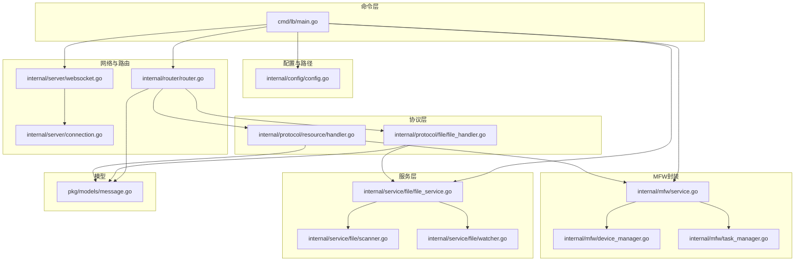
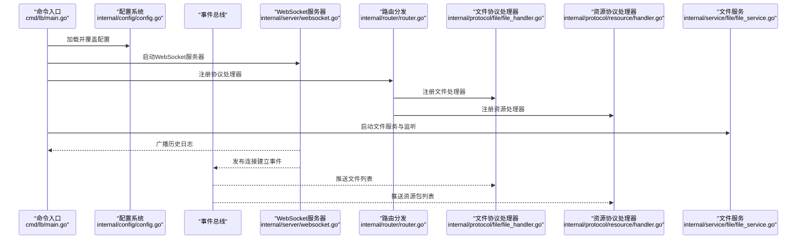
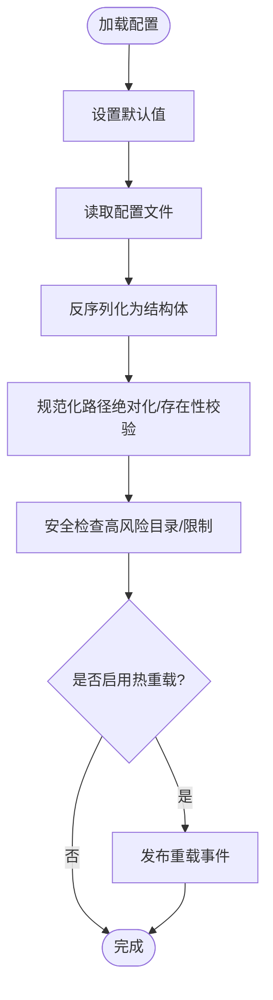
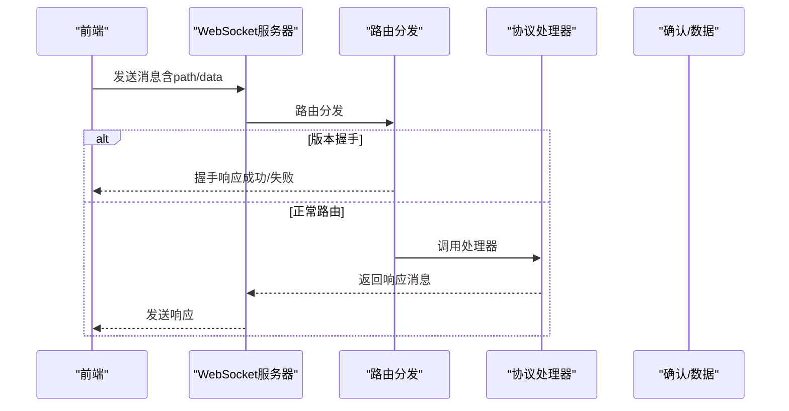
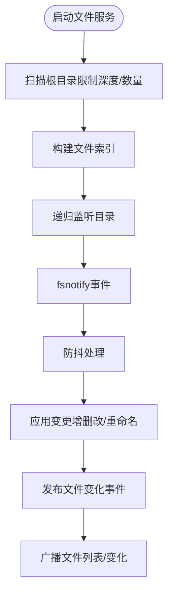
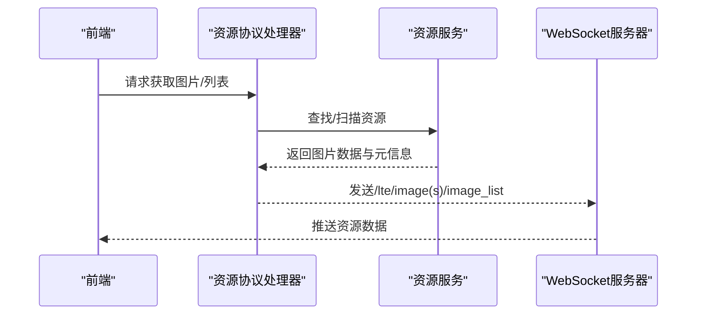
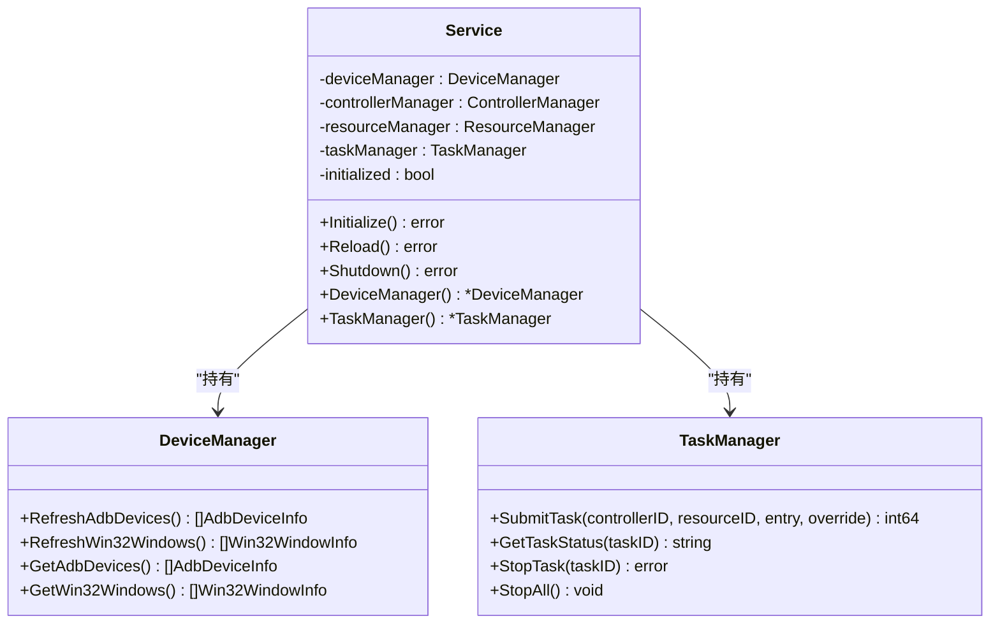
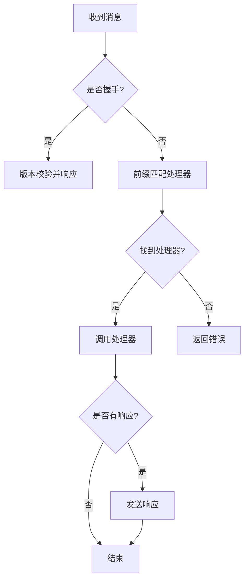
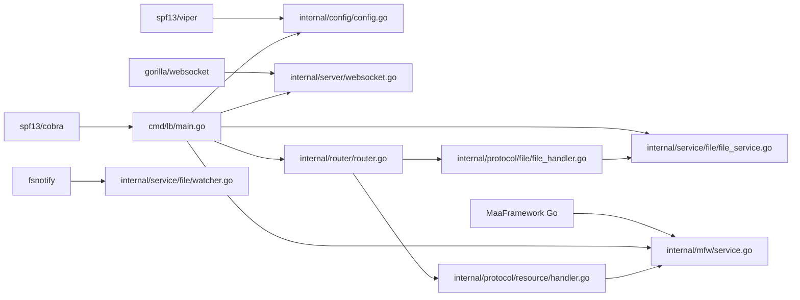

# 本地服务集成

<cite>
**本文引用的文件**
- [LocalBridge/cmd/lb/main.go](file://LocalBridge/cmd/lb/main.go)
- [LocalBridge/go.mod](file://LocalBridge/go.mod)
- [LocalBridge/internal/config/config.go](file://LocalBridge/internal/config/config.go)
- [LocalBridge/internal/router/router.go](file://LocalBridge/internal/router/router.go)
- [LocalBridge/internal/server/websocket.go](file://LocalBridge/internal/server/websocket.go)
- [LocalBridge/internal/server/connection.go](file://LocalBridge/internal/server/connection.go)
- [LocalBridge/internal/protocol/file/file_handler.go](file://LocalBridge/internal/protocol/file/file_handler.go)
- [LocalBridge/internal/protocol/resource/handler.go](file://LocalBridge/internal/protocol/resource/handler.go)
- [LocalBridge/internal/service/file/file_service.go](file://LocalBridge/internal/service/file/file_service.go)
- [LocalBridge/internal/service/file/scanner.go](file://LocalBridge/internal/service/file/scanner.go)
- [LocalBridge/internal/service/file/watcher.go](file://LocalBridge/internal/service/file/watcher.go)
- [LocalBridge/internal/mfw/service.go](file://LocalBridge/internal/mfw/service.go)
- [LocalBridge/internal/mfw/device_manager.go](file://LocalBridge/internal/mfw/device_manager.go)
- [LocalBridge/internal/mfw/task_manager.go](file://LocalBridge/internal/mfw/task_manager.go)
- [LocalBridge/pkg/models/message.go](file://LocalBridge/pkg/models/message.go)
</cite>

## 目录
1. [简介](#简介)
2. [项目结构](#项目结构)
3. [核心组件](#核心组件)
4. [架构总览](#架构总览)
5. [详细组件分析](#详细组件分析)
6. [依赖分析](#依赖分析)
7. [性能考虑](#性能考虑)
8. [故障排除指南](#故障排除指南)
9. [结论](#结论)
10. [附录](#附录)

## 简介
本文件面向MaaPipelineEditor的本地服务集成，聚焦LocalBridge服务架构与实现细节，涵盖Go语言服务设计、模块划分、依赖管理；文件管理系统（扫描、监控、权限控制）；资源服务（图像处理、模板管理、缓存策略）；MaaFramework集成机制（设备控制、OCR识别、任务调度）；配置管理系统（配置文件解析、热重载、版本兼容）；以及WebSocket通信协议（消息格式、路由机制、错误处理）。同时提供部署指南、性能优化建议与故障排除方法。

## 项目结构
LocalBridge采用清晰的分层与职责划分：
- cmd/lb：命令入口与CLI子命令（配置管理、路径信息、版本检查等）
- internal/config：配置加载、校验与默认值设置
- internal/router：消息路由与版本握手
- internal/server：WebSocket服务器、连接管理
- internal/protocol：协议处理器（文件、资源、MFW、调试、配置等）
- internal/service：业务服务（文件、资源）
- internal/mfw：MaaFramework封装（设备、控制器、资源、任务）
- pkg/models：消息与数据模型定义

图表来源
- [LocalBridge/cmd/lb/main.go:182-440](file://LocalBridge/cmd/lb/main.go#L182-L440)
- [LocalBridge/internal/config/config.go:54-95](file://LocalBridge/internal/config/config.go#L54-L95)
- [LocalBridge/internal/router/router.go:50-76](file://LocalBridge/internal/router/router.go#L50-L76)
- [LocalBridge/internal/server/websocket.go:66-93](file://LocalBridge/internal/server/websocket.go#L66-L93)
- [LocalBridge/internal/protocol/file/file_handler.go:49-64](file://LocalBridge/internal/protocol/file/file_handler.go#L49-L64)
- [LocalBridge/internal/protocol/resource/handler.go:56-69](file://LocalBridge/internal/protocol/resource/handler.go#L56-L69)
- [LocalBridge/internal/service/file/file_service.go:65-95](file://LocalBridge/internal/service/file/file_service.go#L65-L95)
- [LocalBridge/internal/mfw/service.go:37-138](file://LocalBridge/internal/mfw/service.go#L37-L138)
- [LocalBridge/pkg/models/message.go:4-126](file://LocalBridge/pkg/models/message.go#L4-L126)

章节来源
- [LocalBridge/cmd/lb/main.go:160-166](file://LocalBridge/cmd/lb/main.go#L160-L166)
- [LocalBridge/go.mod:1-38](file://LocalBridge/go.mod#L1-L38)

## 核心组件
- 配置系统：Viper驱动的配置加载、默认值、路径规范化、安全检查、热重载事件
- 路由与握手：基于前缀匹配的路由分发，协议版本握手与兼容性校验
- WebSocket服务器：连接注册/注销、广播、读写泵、超时控制
- 文件服务：扫描（深度/数量限制）、监控（fsnotify防抖）、权限校验、索引维护
- 资源服务：图像读取、MIME推断、尺寸探测、资源包广播
- MFW服务：框架初始化/重载/关闭、设备枚举、任务提交与停止
- 协议处理器：文件读写/创建/分离保存、资源获取/刷新、调试与配置管理

章节来源
- [LocalBridge/internal/config/config.go:54-95](file://LocalBridge/internal/config/config.go#L54-L95)
- [LocalBridge/internal/router/router.go:50-76](file://LocalBridge/internal/router/router.go#L50-L76)
- [LocalBridge/internal/server/websocket.go:66-93](file://LocalBridge/internal/server/websocket.go#L66-L93)
- [LocalBridge/internal/protocol/file/file_handler.go:49-64](file://LocalBridge/internal/protocol/file/file_handler.go#L49-L64)
- [LocalBridge/internal/protocol/resource/handler.go:56-69](file://LocalBridge/internal/protocol/resource/handler.go#L56-L69)
- [LocalBridge/internal/mfw/service.go:37-138](file://LocalBridge/internal/mfw/service.go#L37-L138)

## 架构总览
LocalBridge以“配置-路由-协议-服务-网络”为主线，形成松耦合、可扩展的服务架构。启动流程负责初始化路径、加载配置、安全检查、服务启动与事件订阅；路由层统一处理消息分发与版本握手；协议层按域划分处理器；服务层提供文件与资源能力；网络层承载WebSocket通信。

图表来源
- [LocalBridge/cmd/lb/main.go:182-440](file://LocalBridge/cmd/lb/main.go#L182-L440)
- [LocalBridge/internal/server/websocket.go:115-142](file://LocalBridge/internal/server/websocket.go#L115-L142)
- [LocalBridge/internal/protocol/file/file_handler.go:250-285](file://LocalBridge/internal/protocol/file/file_handler.go#L250-L285)
- [LocalBridge/internal/protocol/resource/handler.go:220-232](file://LocalBridge/internal/protocol/resource/handler.go#L220-L232)

## 详细组件分析

### 配置管理系统
- 加载与默认值：通过Viper设置默认值，支持从指定路径或默认路径读取配置
- 路径规范化：根目录、日志目录转绝对路径并校验存在性
- 安全检查：对高风险目录（系统目录、驱动器根、用户主目录）与无限制扫描深度/数量给出风险提示与建议
- 热重载：订阅配置重载事件，重载资源扫描与MFW服务（当启用）

图表来源
- [LocalBridge/internal/config/config.go:54-95](file://LocalBridge/internal/config/config.go#L54-L95)
- [LocalBridge/internal/config/config.go:235-296](file://LocalBridge/internal/config/config.go#L235-L296)
- [LocalBridge/cmd/lb/main.go:354-383](file://LocalBridge/cmd/lb/main.go#L354-L383)

章节来源
- [LocalBridge/internal/config/config.go:54-95](file://LocalBridge/internal/config/config.go#L54-L95)
- [LocalBridge/internal/config/config.go:235-296](file://LocalBridge/internal/config/config.go#L235-L296)
- [LocalBridge/cmd/lb/main.go:354-383](file://LocalBridge/cmd/lb/main.go#L354-L383)

### WebSocket通信协议
- 协议版本：固定版本号，握手阶段校验前后端版本一致性
- 连接管理：注册/注销、广播、读写泵、队列满丢弃策略
- 消息格式：统一Message结构，包含path与data；错误统一为/error路径
- 路由机制：精确匹配优先，否则前缀匹配；未匹配路由返回错误

图表来源
- [LocalBridge/internal/server/websocket.go:145-161](file://LocalBridge/internal/server/websocket.go#L145-L161)
- [LocalBridge/internal/router/router.go:108-133](file://LocalBridge/internal/router/router.go#L108-L133)
- [LocalBridge/internal/router/router.go:50-76](file://LocalBridge/internal/router/router.go#L50-L76)
- [LocalBridge/pkg/models/message.go:4-14](file://LocalBridge/pkg/models/message.go#L4-L14)

章节来源
- [LocalBridge/internal/server/websocket.go:15-31](file://LocalBridge/internal/server/websocket.go#L15-L31)
- [LocalBridge/internal/server/connection.go:32-76](file://LocalBridge/internal/server/connection.go#L32-L76)
- [LocalBridge/internal/router/router.go:108-133](file://LocalBridge/internal/router/router.go#L108-L133)
- [LocalBridge/pkg/models/message.go:4-14](file://LocalBridge/pkg/models/message.go#L4-L14)

### 文件管理系统
- 扫描器：支持最大深度与最大文件数限制，过滤隐藏配置文件，解析文件节点与前缀
- 监听器：基于fsnotify，目录递归监听，事件防抖，区分创建/修改/删除/重命名
- 文件服务：索引维护、路径安全校验（仅允许根目录范围内）、读写JSONC、创建文件、最近写入防抖
- 协议处理：打开/保存/分离保存/创建/刷新文件列表；推送文件变化与文件列表

图表来源
- [LocalBridge/internal/service/file/file_service.go:65-95](file://LocalBridge/internal/service/file/file_service.go#L65-L95)
- [LocalBridge/internal/service/file/scanner.go:65-147](file://LocalBridge/internal/service/file/scanner.go#L65-L147)
- [LocalBridge/internal/service/file/watcher.go:62-83](file://LocalBridge/internal/service/file/watcher.go#L62-L83)
- [LocalBridge/internal/protocol/file/file_handler.go:250-285](file://LocalBridge/internal/protocol/file/file_handler.go#L250-L285)

章节来源
- [LocalBridge/internal/service/file/file_service.go:122-201](file://LocalBridge/internal/service/file/file_service.go#L122-L201)
- [LocalBridge/internal/service/file/scanner.go:65-147](file://LocalBridge/internal/service/file/scanner.go#L65-L147)
- [LocalBridge/internal/service/file/watcher.go:114-188](file://LocalBridge/internal/service/file/watcher.go#L114-L188)
- [LocalBridge/internal/protocol/file/file_handler.go:67-137](file://LocalBridge/internal/protocol/file/file_handler.go#L67-L137)

### 资源服务与图像处理
- 资源扫描：根据Pipeline路径匹配资源包，提供图片列表
- 图像获取：单张/批量获取，读取文件、推断MIME、探测尺寸、Base64编码
- 资源包广播：连接建立与扫描完成事件触发资源包列表推送

图表来源
- [LocalBridge/internal/protocol/resource/handler.go:56-69](file://LocalBridge/internal/protocol/resource/handler.go#L56-L69)
- [LocalBridge/internal/protocol/resource/handler.go:117-137](file://LocalBridge/internal/protocol/resource/handler.go#L117-L137)
- [LocalBridge/internal/protocol/resource/handler.go:140-182](file://LocalBridge/internal/protocol/resource/handler.go#L140-L182)
- [LocalBridge/internal/protocol/resource/handler.go:235-245](file://LocalBridge/internal/protocol/resource/handler.go#L235-L245)

章节来源
- [LocalBridge/internal/protocol/resource/handler.go:71-105](file://LocalBridge/internal/protocol/resource/handler.go#L71-L105)
- [LocalBridge/internal/protocol/resource/handler.go:140-182](file://LocalBridge/internal/protocol/resource/handler.go#L140-L182)

### MaaFramework集成机制
- 服务生命周期：Initialize/Reload/Shutdown，捕获panic并提示库版本不匹配
- 设备管理：ADB设备与Win32窗口枚举，提供截图与输入方法列表
- 任务管理：提交任务（带controller/resource/entry/override），查询状态，停止任务/全部任务
- 资源管理：卸载资源（关闭时）
- 控制器管理：断开连接（关闭时）

图表来源
- [LocalBridge/internal/mfw/service.go:16-34](file://LocalBridge/internal/mfw/service.go#L16-L34)
- [LocalBridge/internal/mfw/service.go:37-138](file://LocalBridge/internal/mfw/service.go#L37-L138)
- [LocalBridge/internal/mfw/device_manager.go:12-24](file://LocalBridge/internal/mfw/device_manager.go#L12-L24)
- [LocalBridge/internal/mfw/task_manager.go:12-22](file://LocalBridge/internal/mfw/task_manager.go#L12-L22)

章节来源
- [LocalBridge/internal/mfw/service.go:37-138](file://LocalBridge/internal/mfw/service.go#L37-L138)
- [LocalBridge/internal/mfw/device_manager.go:27-60](file://LocalBridge/internal/mfw/device_manager.go#L27-L60)
- [LocalBridge/internal/mfw/task_manager.go:25-53](file://LocalBridge/internal/mfw/task_manager.go#L25-L53)

### 协议处理器与路由
- 路由：前缀匹配处理器，未匹配返回错误
- 文件协议：打开/保存/分离保存/创建/刷新列表；推送文件变化与列表
- 资源协议：获取单张/批量图片、刷新资源、获取图片列表；推送资源包列表

图表来源
- [LocalBridge/internal/router/router.go:50-76](file://LocalBridge/internal/router/router.go#L50-L76)
- [LocalBridge/internal/router/router.go:108-133](file://LocalBridge/internal/router/router.go#L108-L133)
- [LocalBridge/internal/protocol/file/file_handler.go:49-64](file://LocalBridge/internal/protocol/file/file_handler.go#L49-L64)
- [LocalBridge/internal/protocol/resource/handler.go:56-69](file://LocalBridge/internal/protocol/resource/handler.go#L56-L69)

章节来源
- [LocalBridge/internal/router/router.go:50-76](file://LocalBridge/internal/router/router.go#L50-L76)
- [LocalBridge/internal/protocol/file/file_handler.go:49-64](file://LocalBridge/internal/protocol/file/file_handler.go#L49-L64)
- [LocalBridge/internal/protocol/resource/handler.go:56-69](file://LocalBridge/internal/protocol/resource/handler.go#L56-L69)

## 依赖分析
- 外部依赖：MaaFramework Go绑定、fsnotify、gorilla/websocket、spf13/viper、spf13/cobra、logrus、purego等
- 内部依赖：协议层依赖服务层；服务层依赖配置与事件总线；网络层依赖路由与模型

图表来源
- [LocalBridge/go.mod:5-16](file://LocalBridge/go.mod#L5-L16)
- [LocalBridge/cmd/lb/main.go:17-35](file://LocalBridge/cmd/lb/main.go#L17-L35)

章节来源
- [LocalBridge/go.mod:5-16](file://LocalBridge/go.mod#L5-L16)
- [LocalBridge/cmd/lb/main.go:17-35](file://LocalBridge/cmd/lb/main.go#L17-L35)

## 性能考虑
- 扫描限制：通过最大深度与最大文件数避免大规模目录扫描导致的阻塞
- 监听防抖：fsnotify事件防抖减少频繁写入引发的抖动
- 写入防抖：最近写入窗口忽略自身触发的文件变化，降低重复事件
- 广播队列：连接发送队列容量与满载丢弃策略，避免内存膨胀
- 图像处理：按需读取与Base64编码，建议前端缓存与懒加载
- MFW初始化：中文路径处理与工作目录切换，避免路径问题导致的初始化失败

章节来源
- [LocalBridge/internal/service/file/scanner.go:65-147](file://LocalBridge/internal/service/file/scanner.go#L65-L147)
- [LocalBridge/internal/service/file/watcher.go:178-188](file://LocalBridge/internal/service/file/watcher.go#L178-L188)
- [LocalBridge/internal/server/websocket.go:164-171](file://LocalBridge/internal/server/websocket.go#L164-L171)
- [LocalBridge/internal/mfw/service.go:68-94](file://LocalBridge/internal/mfw/service.go#L68-L94)

## 故障排除指南
- 版本不匹配：握手阶段提示前端所需版本与后端版本差异，建议按提示更新
- 配置加载失败：检查配置文件路径与权限，确认Viper读取成功
- 安全警告：根目录为高风险或无限制扫描，建议调整根目录与限制参数
- MFW初始化失败：检查库路径与资源路径配置，注意中文路径与工作目录切换
- 文件写入失败：检查路径合法性与权限，确认未超出扫描限制
- 资源获取失败：确认资源包扫描完成，图片路径正确

章节来源
- [LocalBridge/internal/router/router.go:120-128](file://LocalBridge/internal/router/router.go#L120-L128)
- [LocalBridge/internal/config/config.go:235-296](file://LocalBridge/internal/config/config.go#L235-L296)
- [LocalBridge/internal/mfw/service.go:42-51](file://LocalBridge/internal/mfw/service.go#L42-L51)
- [LocalBridge/internal/service/file/file_service.go:159-201](file://LocalBridge/internal/service/file/file_service.go#L159-L201)
- [LocalBridge/internal/protocol/resource/handler.go:140-182](file://LocalBridge/internal/protocol/resource/handler.go#L140-L182)

## 结论
LocalBridge通过清晰的分层设计与模块化实现，提供了稳定的本地服务集成能力。配置系统保障了易用性与安全性；WebSocket协议与路由机制实现了前后端高效通信；文件与资源服务满足工程化需求；MaaFramework封装为设备控制与任务调度提供基础。整体架构具备良好的扩展性与可维护性，适合在复杂工程场景中持续演进。

## 附录
- 部署指南
  - 安装与运行：使用CLI命令启动服务，支持便携模式与路径覆盖
  - 配置管理：通过子命令打开配置、设置MaaFramework库路径与OCR资源路径、查看日志目录
  - 路径信息：显示当前运行模式与各路径配置
- 性能优化建议
  - 合理设置扫描深度与文件数量上限
  - 使用防抖与写入窗口避免重复事件
  - 前端缓存与懒加载图像资源
  - 严格控制MFW资源与任务数量
- 故障排除
  - 版本不匹配：按提示更新前端或后端
  - 中文路径：确保库路径与日志路径短路径可用或正确切换工作目录
  - 权限问题：检查根目录与文件写入权限

章节来源
- [LocalBridge/cmd/lb/main.go:51-158](file://LocalBridge/cmd/lb/main.go#L51-L158)
- [LocalBridge/cmd/lb/main.go:442-492](file://LocalBridge/cmd/lb/main.go#L442-L492)
- [LocalBridge/cmd/lb/main.go:494-601](file://LocalBridge/cmd/lb/main.go#L494-L601)
- [LocalBridge/cmd/lb/main.go:623-677](file://LocalBridge/cmd/lb/main.go#L623-L677)
- [LocalBridge/cmd/lb/main.go:798-800](file://LocalBridge/cmd/lb/main.go#L798-L800)