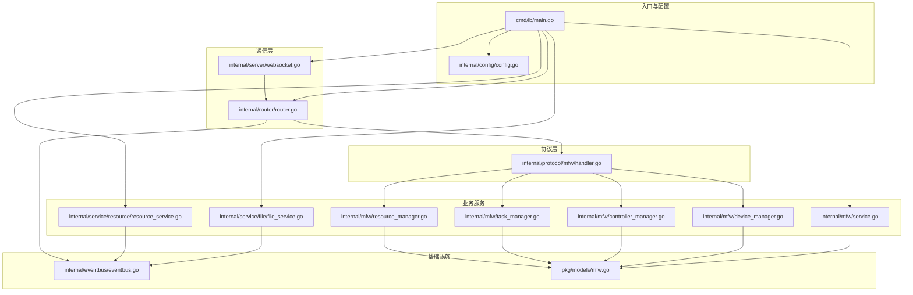
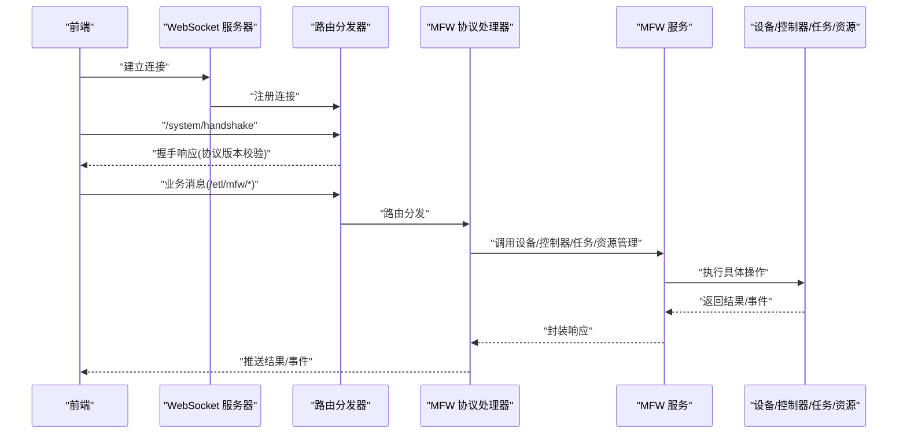
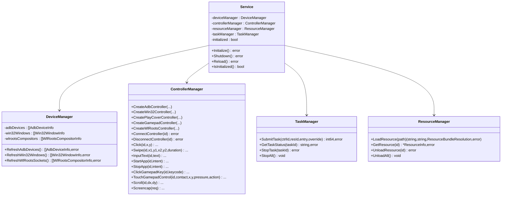
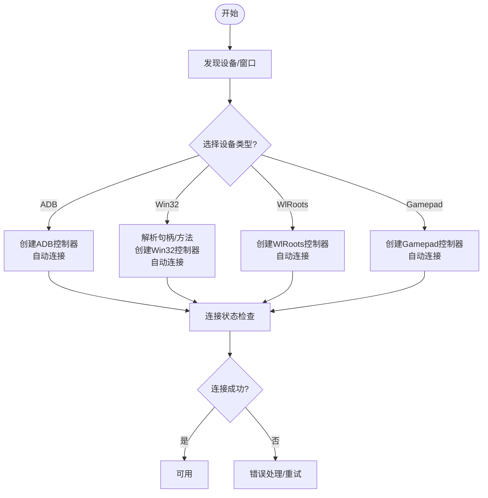
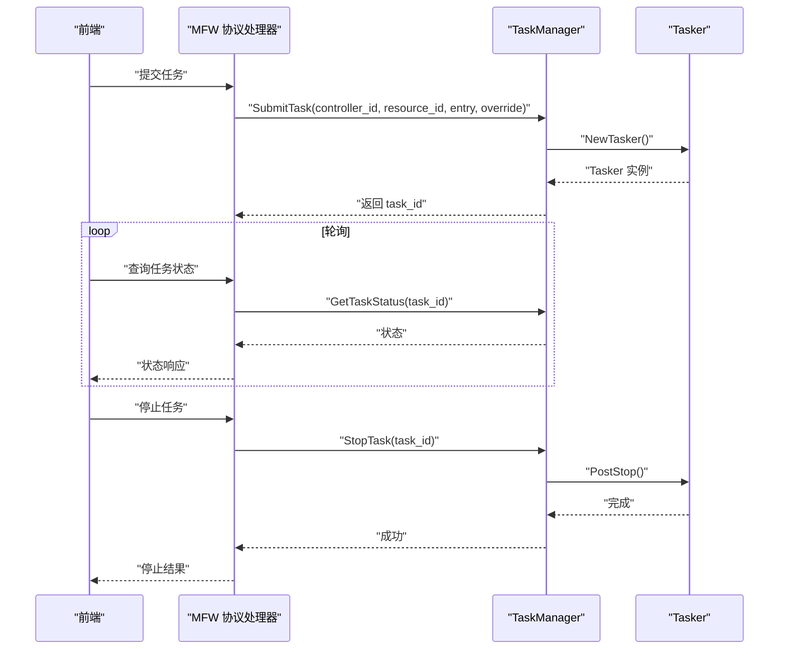
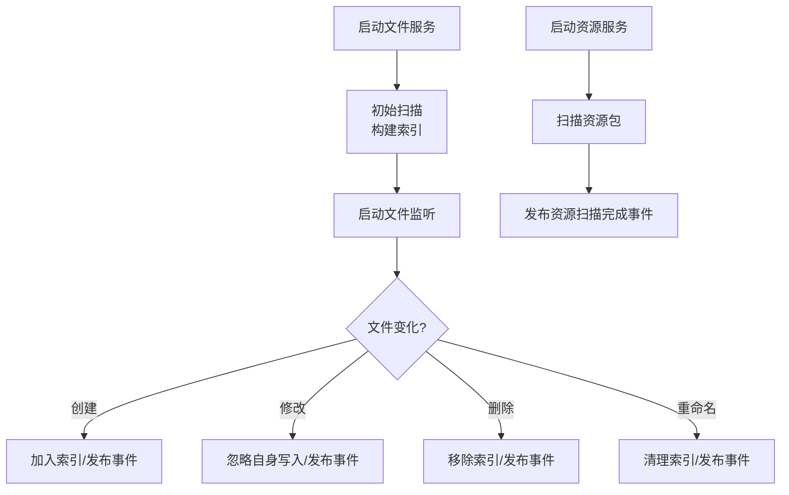
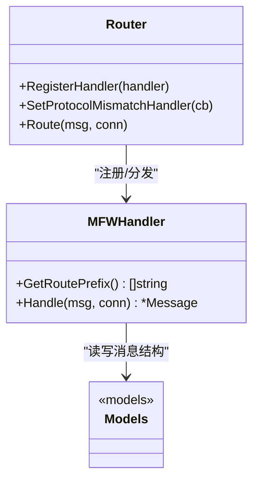
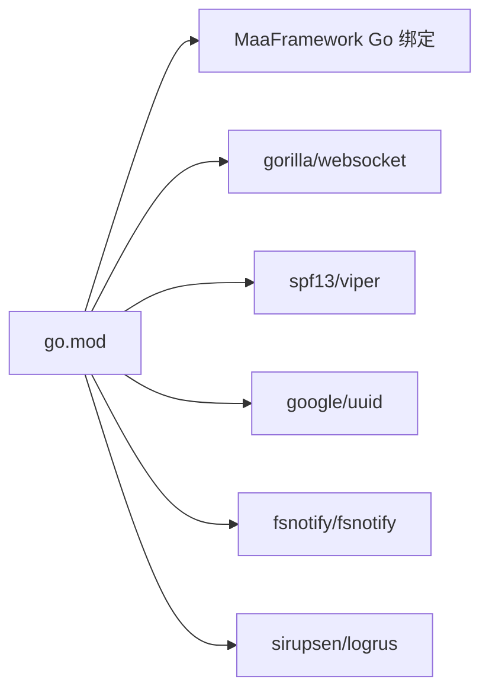

# 本地服务集成

<cite>
**本文引用的文件**
- [LocalBridge/cmd/lb/main.go](file://LocalBridge/cmd/lb/main.go)
- [LocalBridge/internal/mfw/service.go](file://LocalBridge/internal/mfw/service.go)
- [LocalBridge/internal/mfw/device_manager.go](file://LocalBridge/internal/mfw/device_manager.go)
- [LocalBridge/internal/mfw/controller_manager.go](file://LocalBridge/internal/mfw/controller_manager.go)
- [LocalBridge/internal/mfw/task_manager.go](file://LocalBridge/internal/mfw/task_manager.go)
- [LocalBridge/internal/mfw/resource_manager.go](file://LocalBridge/internal/mfw/resource_manager.go)
- [LocalBridge/internal/mfw/types.go](file://LocalBridge/internal/mfw/types.go)
- [LocalBridge/internal/mfw/error.go](file://LocalBridge/internal/mfw/error.go)
- [LocalBridge/internal/protocol/mfw/handler.go](file://LocalBridge/internal/protocol/mfw/handler.go)
- [LocalBridge/internal/service/file/file_service.go](file://LocalBridge/internal/service/file/file_service.go)
- [LocalBridge/internal/service/resource/resource_service.go](file://LocalBridge/internal/service/resource/resource_service.go)
- [LocalBridge/internal/server/websocket.go](file://LocalBridge/internal/server/websocket.go)
- [LocalBridge/internal/router/router.go](file://LocalBridge/internal/router/router.go)
- [LocalBridge/internal/config/config.go](file://LocalBridge/internal/config/config.go)
- [LocalBridge/internal/eventbus/eventbus.go](file://LocalBridge/internal/eventbus/eventbus.go)
- [LocalBridge/pkg/models/mfw.go](file://LocalBridge/pkg/models/mfw.go)
- [LocalBridge/go.mod](file://LocalBridge/go.mod)
</cite>

## 目录
1. [简介](#简介)
2. [项目结构](#项目结构)
3. [核心组件](#核心组件)
4. [架构总览](#架构总览)
5. [详细组件分析](#详细组件分析)
6. [依赖分析](#依赖分析)
7. [性能考虑](#性能考虑)
8. [故障排查指南](#故障排查指南)
9. [结论](#结论)
10. [附录](#附录)

## 简介
本文件面向“本地服务集成”场景，围绕 LocalBridge 的 Go 语言实现，系统性阐述以下主题：
- LocalBridge 服务架构与控制流
- MaaFramework 集成方案与设备管理能力
- 设备连接机制（ADB、Win32、WlRoots、手柄）
- 任务执行与状态监控
- 资源管理系统与文件监控机制
- 自定义识别与扩展能力的实现指引
- 错误处理、性能优化与跨平台兼容的最佳实践

## 项目结构
LocalBridge 采用模块化分层设计：
- cmd/lb：入口与 CLI 子命令，负责启动、配置、版本检查与优雅退出
- internal/mfw：MaaFramework 服务封装，含设备、控制器、任务、资源管理
- internal/protocol：协议处理器，将前端消息路由到具体服务
- internal/service：文件与资源扫描服务
- internal/server：WebSocket 服务端
- internal/router：消息路由与握手协议校验
- internal/config：配置加载与安全检查
- internal/eventbus：事件总线
- pkg/models：协议消息与数据模型

**图表来源**
- [LocalBridge/cmd/lb/main.go:1-468](file://LocalBridge/cmd/lb/main.go#L1-L468)
- [LocalBridge/internal/server/websocket.go:1-179](file://LocalBridge/internal/server/websocket.go#L1-L179)
- [LocalBridge/internal/router/router.go:1-161](file://LocalBridge/internal/router/router.go#L1-L161)
- [LocalBridge/internal/protocol/mfw/handler.go:1-128](file://LocalBridge/internal/protocol/mfw/handler.go#L1-L128)
- [LocalBridge/internal/mfw/service.go:1-218](file://LocalBridge/internal/mfw/service.go#L1-L218)
- [LocalBridge/internal/mfw/device_manager.go:1-136](file://LocalBridge/internal/mfw/device_manager.go#L1-L136)
- [LocalBridge/internal/mfw/controller_manager.go:1-800](file://LocalBridge/internal/mfw/controller_manager.go#L1-L800)
- [LocalBridge/internal/mfw/task_manager.go:1-114](file://LocalBridge/internal/mfw/task_manager.go#L1-L114)
- [LocalBridge/internal/mfw/resource_manager.go:1-118](file://LocalBridge/internal/mfw/resource_manager.go#L1-L118)
- [LocalBridge/internal/service/file/file_service.go:1-406](file://LocalBridge/internal/service/file/file_service.go#L1-L406)
- [LocalBridge/internal/service/resource/resource_service.go:1-359](file://LocalBridge/internal/service/resource/resource_service.go#L1-L359)
- [LocalBridge/internal/eventbus/eventbus.go:1-83](file://LocalBridge/internal/eventbus/eventbus.go#L1-L83)
- [LocalBridge/pkg/models/mfw.go:1-260](file://LocalBridge/pkg/models/mfw.go#L1-L260)

**章节来源**
- [LocalBridge/cmd/lb/main.go:1-468](file://LocalBridge/cmd/lb/main.go#L1-L468)
- [LocalBridge/internal/config/config.go:1-339](file://LocalBridge/internal/config/config.go#L1-L339)

## 核心组件
- 服务生命周期与启动流程：入口负责加载配置、初始化日志、创建事件总线、启动文件与资源扫描、初始化 MaaFramework、创建 WebSocket 与路由、注册协议处理器、设置消息处理回调、等待退出信号并优雅关闭
- 协议与路由：统一通过路由分发器处理握手与业务消息，支持协议版本校验与不匹配回调
- 事件总线：贯穿文件变更、连接建立/关闭、资源扫描完成、配置重载等事件
- 文件服务：扫描、索引、监听文件变化，支持读写、创建、JSONC 解析与安全路径校验
- 资源服务：扫描资源包、聚合 image 目录、提供图片列表查询
- MFW 服务：封装设备、控制器、任务、资源管理，提供截图、输入、应用启停、手柄操作等能力

**章节来源**
- [LocalBridge/cmd/lb/main.go:184-468](file://LocalBridge/cmd/lb/main.go#L184-L468)
- [LocalBridge/internal/router/router.go:56-161](file://LocalBridge/internal/router/router.go#L56-L161)
- [LocalBridge/internal/eventbus/eventbus.go:29-83](file://LocalBridge/internal/eventbus/eventbus.go#L29-L83)
- [LocalBridge/internal/service/file/file_service.go:64-406](file://LocalBridge/internal/service/file/file_service.go#L64-L406)
- [LocalBridge/internal/service/resource/resource_service.go:33-359](file://LocalBridge/internal/service/resource/resource_service.go#L33-L359)
- [LocalBridge/internal/mfw/service.go:36-218](file://LocalBridge/internal/mfw/service.go#L36-L218)

## 架构总览
LocalBridge 以“协议处理器 + 业务服务”的模式组织，WebSocket 作为统一接入面，路由负责协议版本校验与消息分发，业务服务通过事件总线与文件/资源服务协同。

**图表来源**
- [LocalBridge/internal/server/websocket.go:144-161](file://LocalBridge/internal/server/websocket.go#L144-L161)
- [LocalBridge/internal/router/router.go:114-161](file://LocalBridge/internal/router/router.go#L114-L161)
- [LocalBridge/internal/protocol/mfw/handler.go:31-128](file://LocalBridge/internal/protocol/mfw/handler.go#L31-L128)
- [LocalBridge/internal/mfw/service.go:36-218](file://LocalBridge/internal/mfw/service.go#L36-L218)

## 详细组件分析

### MaaFramework 集成与服务管理
- 服务初始化：捕获 panic，处理 Windows 中文路径问题（短路径或工作目录切换），设置日志目录与调试开关，支持 SaveOnError 配置
- 服务关闭：停止任务、断开控制器、卸载资源、释放框架
- 服务重载：先关闭再初始化，用于配置变更后的热更新

**图表来源**
- [LocalBridge/internal/mfw/service.go:15-218](file://LocalBridge/internal/mfw/service.go#L15-L218)
- [LocalBridge/internal/mfw/device_manager.go:11-136](file://LocalBridge/internal/mfw/device_manager.go#L11-L136)
- [LocalBridge/internal/mfw/controller_manager.go:20-800](file://LocalBridge/internal/mfw/controller_manager.go#L20-L800)
- [LocalBridge/internal/mfw/task_manager.go:11-114](file://LocalBridge/internal/mfw/task_manager.go#L11-L114)
- [LocalBridge/internal/mfw/resource_manager.go:11-118](file://LocalBridge/internal/mfw/resource_manager.go#L11-L118)

**章节来源**
- [LocalBridge/internal/mfw/service.go:36-218](file://LocalBridge/internal/mfw/service.go#L36-L218)
- [LocalBridge/internal/mfw/device_manager.go:27-136](file://LocalBridge/internal/mfw/device_manager.go#L27-L136)
- [LocalBridge/internal/mfw/controller_manager.go:33-800](file://LocalBridge/internal/mfw/controller_manager.go#L33-L800)
- [LocalBridge/internal/mfw/task_manager.go:24-114](file://LocalBridge/internal/mfw/task_manager.go#L24-L114)
- [LocalBridge/internal/mfw/resource_manager.go:24-118](file://LocalBridge/internal/mfw/resource_manager.go#L24-L118)

### 设备连接机制（ADB、Win32、WlRoots、手柄）
- ADB 设备：枚举设备并提供多种截图与输入方法；创建控制器后自动连接
- Win32 窗体：枚举桌面窗口，支持多种截图与输入方法；句柄解析与默认策略
- WlRoots 合成器：基于套接字路径连接
- 手柄：支持 Xbox360/DualShock4 类型，提供按键与触控摇杆/扳机操作
- 连接超时与状态检查：异步连接并等待，超时与失败处理

**图表来源**
- [LocalBridge/internal/mfw/device_manager.go:27-136](file://LocalBridge/internal/mfw/device_manager.go#L27-L136)
- [LocalBridge/internal/mfw/controller_manager.go:33-350](file://LocalBridge/internal/mfw/controller_manager.go#L33-L350)

**章节来源**
- [LocalBridge/internal/mfw/device_manager.go:27-136](file://LocalBridge/internal/mfw/device_manager.go#L27-L136)
- [LocalBridge/internal/mfw/controller_manager.go:106-350](file://LocalBridge/internal/mfw/controller_manager.go#L106-L350)

### 任务执行与状态监控
- 提交任务：创建 Tasker，分配任务 ID，记录状态
- 查询状态：根据任务 ID 获取状态
- 停止任务：向 Tasker 发送停止作业并等待
- 停止全部：遍历并销毁 Tasker，清空任务表

**图表来源**
- [LocalBridge/internal/mfw/task_manager.go:24-114](file://LocalBridge/internal/mfw/task_manager.go#L24-L114)
- [LocalBridge/internal/protocol/mfw/handler.go:107-113](file://LocalBridge/internal/protocol/mfw/handler.go#L107-L113)

**章节来源**
- [LocalBridge/internal/mfw/task_manager.go:24-114](file://LocalBridge/internal/mfw/task_manager.go#L24-L114)
- [LocalBridge/internal/protocol/mfw/handler.go:107-113](file://LocalBridge/internal/protocol/mfw/handler.go#L107-L113)

### 资源管理与文件监控
- 文件服务：初始扫描构建索引，启动文件监听；支持读取 JSONC、写入（忽略自身写入）、创建文件、路径安全校验
- 资源服务：扫描资源包（pipeline/image/model/default_pipeline），聚合 image 目录，提供图片列表与定位

**图表来源**
- [LocalBridge/internal/service/file/file_service.go:64-406](file://LocalBridge/internal/service/file/file_service.go#L64-L406)
- [LocalBridge/internal/service/resource/resource_service.go:33-359](file://LocalBridge/internal/service/resource/resource_service.go#L33-L359)

**章节来源**
- [LocalBridge/internal/service/file/file_service.go:64-406](file://LocalBridge/internal/service/file/file_service.go#L64-L406)
- [LocalBridge/internal/service/resource/resource_service.go:33-359](file://LocalBridge/internal/service/resource/resource_service.go#L33-L359)

### 协议与消息模型
- 路由前缀：/etl/mfw/ 开头的协议处理器
- 握手协议：版本校验，不匹配时触发回调并主动退出
- 消息模型：控制器、任务、资源、设备等请求/响应结构

**图表来源**
- [LocalBridge/internal/router/router.go:28-161](file://LocalBridge/internal/router/router.go#L28-L161)
- [LocalBridge/internal/protocol/mfw/handler.go:14-128](file://LocalBridge/internal/protocol/mfw/handler.go#L14-L128)
- [LocalBridge/pkg/models/mfw.go:1-260](file://LocalBridge/pkg/models/mfw.go#L1-L260)

**章节来源**
- [LocalBridge/internal/router/router.go:56-161](file://LocalBridge/internal/router/router.go#L56-L161)
- [LocalBridge/internal/protocol/mfw/handler.go:26-128](file://LocalBridge/internal/protocol/mfw/handler.go#L26-L128)
- [LocalBridge/pkg/models/mfw.go:1-260](file://LocalBridge/pkg/models/mfw.go#L1-L260)

### 自定义识别与扩展
- 自定义识别与动作注册：协议处理器提供注册接口，结合 MFW 服务的适配器与资源加载能力，可在运行时扩展识别与动作
- 探索模式：通过临时资源与任务执行单节点动作，便于调试与验证

**章节来源**
- [LocalBridge/internal/protocol/mfw/handler.go:117-121](file://LocalBridge/internal/protocol/mfw/handler.go#L117-L121)
- [LocalBridge/internal/protocol/mfw/handler.go:751-800](file://LocalBridge/internal/protocol/mfw/handler.go#L751-L800)

## 依赖分析
- 外部依赖：MaaFramework Go 绑定、WebSocket、Viper 配置、UUID、fsnotify 文件监控、Logrus 日志等
- 模块间耦合：协议处理器依赖 MFW 服务；文件/资源服务通过事件总线与路由/WebSocket 解耦；配置与路径模块独立

**图表来源**
- [LocalBridge/go.mod:1-38](file://LocalBridge/go.mod#L1-L38)

**章节来源**
- [LocalBridge/go.mod:1-38](file://LocalBridge/go.mod#L1-L38)

## 性能考虑
- 路径与日志目录的 Windows 中文路径处理，避免初始化失败与后续异常
- 文件写入采用“自身写入忽略窗口”，减少重复事件风暴
- 任务与控制器操作均采用异步连接与作业等待，避免阻塞主线程
- 资源扫描限制层级与文件数量，降低大规模目录扫描对性能的影响
- WebSocket 读写超时与连接池化，提升并发稳定性

[本节为通用指导，无需特定文件引用]

## 故障排查指南
- 协议版本不匹配：握手阶段即被拦截并触发回调，需同步前后端版本
- MFW 未初始化：检查库路径配置，必要时通过 CLI 设置并重启
- 设备/控制器连接失败：查看连接超时与失败日志，确认设备可用性与权限
- 任务提交/状态查询失败：核对任务 ID 与状态机流转
- 文件写入冲突：确认自身写入窗口与防抖逻辑，避免重复触发

**章节来源**
- [LocalBridge/internal/router/router.go:114-161](file://LocalBridge/internal/router/router.go#L114-L161)
- [LocalBridge/internal/mfw/service.go:36-138](file://LocalBridge/internal/mfw/service.go#L36-L138)
- [LocalBridge/internal/mfw/controller_manager.go:278-350](file://LocalBridge/internal/mfw/controller_manager.go#L278-L350)
- [LocalBridge/internal/mfw/task_manager.go:55-90](file://LocalBridge/internal/mfw/task_manager.go#L55-L90)
- [LocalBridge/internal/service/file/file_service.go:158-215](file://LocalBridge/internal/service/file/file_service.go#L158-L215)

## 结论
LocalBridge 通过清晰的分层架构与协议化设计，实现了对 MaaFramework 的深度集成与本地服务能力扩展。其在设备连接、任务执行、资源管理与文件监控方面具备良好的可维护性与可扩展性，适合在多平台环境下提供稳定的本地服务支撑。

## 附录
- 配置项与默认值：服务器、文件扫描、日志、MaaFramework 路径等
- 安全检查：根目录风险评估与建议
- CLI 命令：配置管理、路径设置、日志目录打开、信息展示

**章节来源**
- [LocalBridge/internal/config/config.go:53-339](file://LocalBridge/internal/config/config.go#L53-L339)