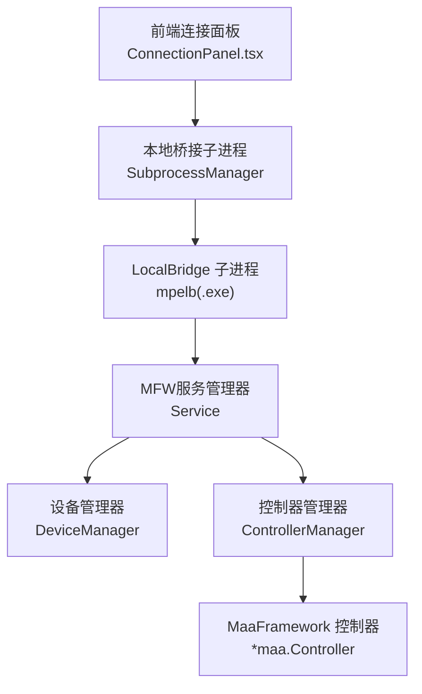
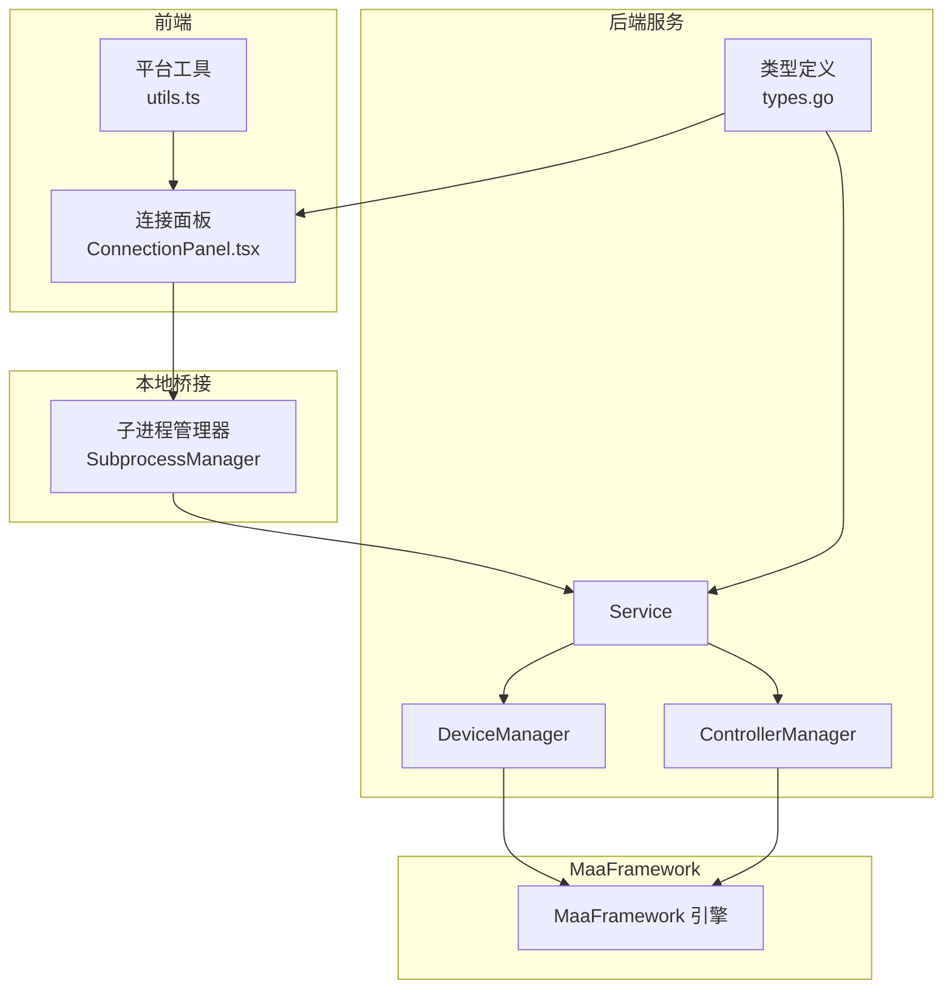
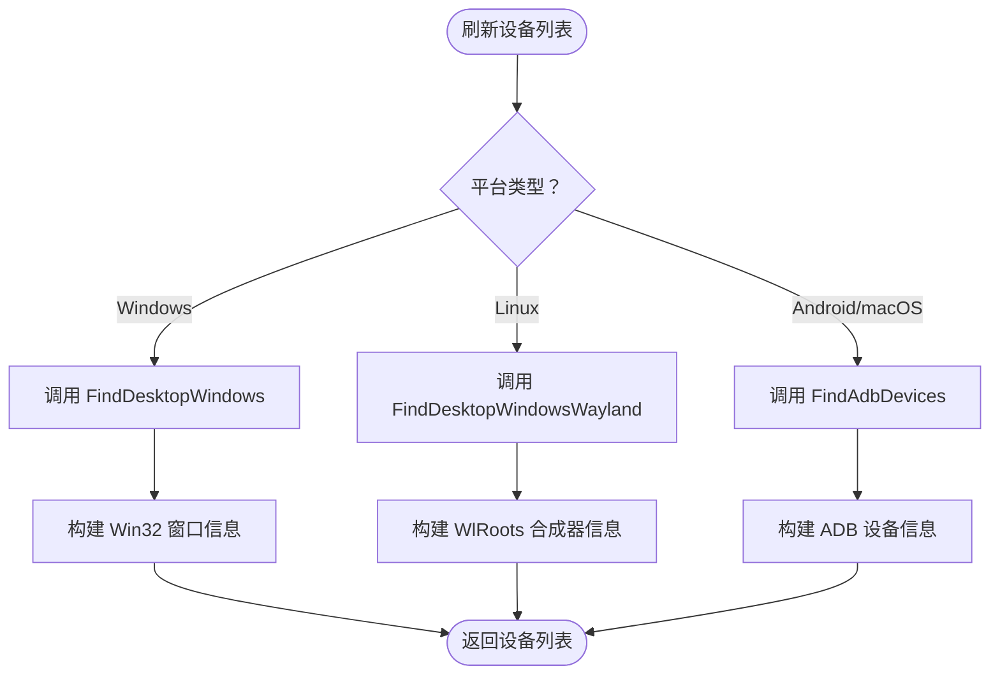
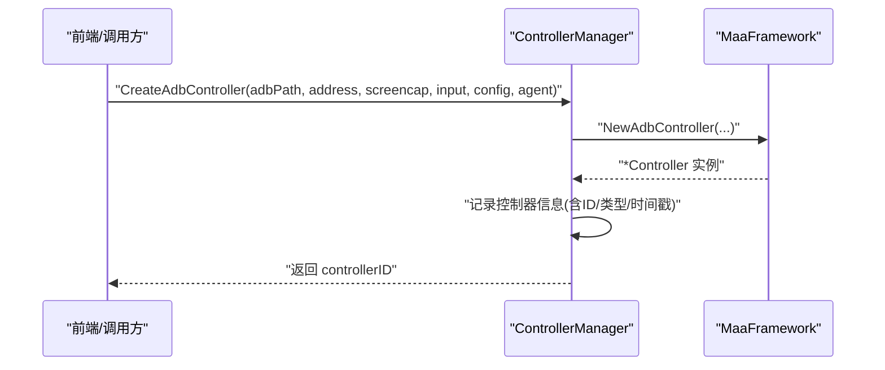
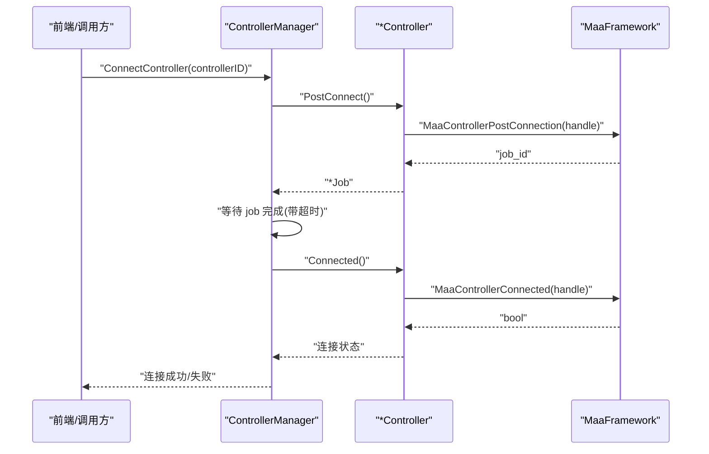
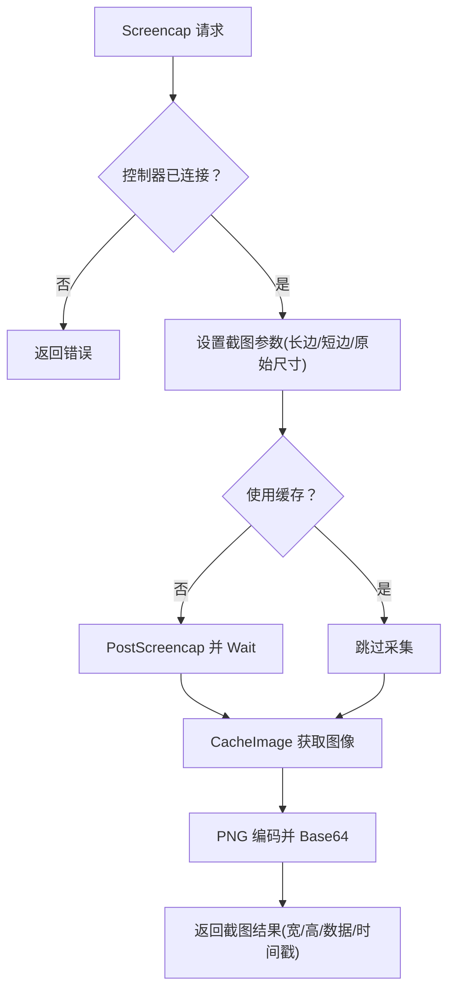
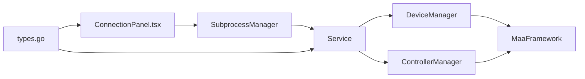

# 设备连接管理

<cite>
**本文档引用的文件**
- [controller_manager.go](file://LocalBridge/internal/mfw/controller_manager.go)
- [device_manager.go](file://LocalBridge/internal/mfw/device_manager.go)
- [service.go](file://LocalBridge/internal/mfw/service.go)
- [types.go](file://LocalBridge/internal/mfw/types.go)
- [subprocess.go](file://Extremer/internal/bridge/subprocess.go)
- [ConnectionPanel.tsx](file://src/components/panels/main/ConnectionPanel.tsx)
- [utils.ts](file://src/components/panels/main/connection/utils.ts)
- [Device Discovery and Connection.md](file://dev/instructions/maafw-golang-binding/Device Discovery and Connection.md)
- [设备连接.md](file://docsite/docs/01.指南/20.本地服务/15.设备连接.md)
</cite>

## 目录
1. [简介](#简介)
2. [项目结构](#项目结构)
3. [核心组件](#核心组件)
4. [架构总览](#架构总览)
5. [详细组件分析](#详细组件分析)
6. [依赖关系分析](#依赖关系分析)
7. [性能考虑](#性能考虑)
8. [故障排查指南](#故障排查指南)
9. [结论](#结论)
10. [附录](#附录)

## 简介
本文件面向设备连接管理的技术文档，围绕多平台设备支持（ADB、Win32、WlRoots、手柄设备）进行深入解析。重点涵盖设备发现、连接建立、状态监控、参数配置、连接池管理与重连策略、跨平台适配层设计及平台特定功能处理。同时提供兼容性测试、性能优化与故障诊断方法，并给出配置示例与调试技巧。

## 项目结构
设备连接管理由前端连接面板、本地桥接子进程与后端 MaaFramework 服务三部分协同完成：
- 前端负责用户交互、设备类型选择与连接状态展示
- 本地桥接子进程负责启动与管理 LocalBridge 子进程
- 后端服务封装 MaaFramework 的设备发现与控制器管理能力

图表来源
- [ConnectionPanel.tsx:634-757](file://src/components/panels/main/ConnectionPanel.tsx#L634-L757)
- [subprocess.go:35-105](file://Extremer/internal/bridge/subprocess.go#L35-L105)
- [service.go:15-34](file://LocalBridge/internal/mfw/service.go#L15-L34)

章节来源
- [ConnectionPanel.tsx:634-757](file://src/components/panels/main/ConnectionPanel.tsx#L634-L757)
- [subprocess.go:35-105](file://Extremer/internal/bridge/subprocess.go#L35-L105)
- [service.go:15-34](file://LocalBridge/internal/mfw/service.go#L15-L34)

## 核心组件
- 设备管理器：负责扫描与维护 ADB 设备、Win32 窗口与 WlRoots 合成器列表
- 控制器管理器：负责创建、连接、断开与操作各类控制器，维护连接池与状态
- MFW 服务管理器：负责初始化/释放 MaaFramework，协调设备与控制器管理器
- 类型定义：统一设备信息、控制器信息、操作结果与截图请求/响应的数据结构
- 前端连接面板：提供设备类型选择、参数配置、连接/断开与状态展示
- 本地桥接子进程：负责启动 LocalBridge 子进程并管理其生命周期

章节来源
- [device_manager.go:11-25](file://LocalBridge/internal/mfw/device_manager.go#L11-L25)
- [controller_manager.go:20-31](file://LocalBridge/internal/mfw/controller_manager.go#L20-L31)
- [service.go:15-34](file://LocalBridge/internal/mfw/service.go#L15-L34)
- [types.go:7-129](file://LocalBridge/internal/mfw/types.go#L7-L129)
- [ConnectionPanel.tsx:634-757](file://src/components/panels/main/ConnectionPanel.tsx#L634-L757)
- [subprocess.go:12-33](file://Extremer/internal/bridge/subprocess.go#L12-L33)

## 架构总览
整体架构采用“前端交互 → 本地桥接 → 后端服务 → MaaFramework”的分层设计，确保跨平台适配与平台特定功能的解耦。

图表来源
- [ConnectionPanel.tsx:634-757](file://src/components/panels/main/ConnectionPanel.tsx#L634-L757)
- [utils.ts:1-25](file://src/components/panels/main/connection/utils.ts#L1-L25)
- [subprocess.go:35-105](file://Extremer/internal/bridge/subprocess.go#L35-L105)
- [service.go:15-34](file://LocalBridge/internal/mfw/service.go#L15-L34)
- [device_manager.go:11-25](file://LocalBridge/internal/mfw/device_manager.go#L11-L25)
- [controller_manager.go:20-31](file://LocalBridge/internal/mfw/controller_manager.go#L20-L31)
- [types.go:7-129](file://LocalBridge/internal/mfw/types.go#L7-L129)

## 详细组件分析

### 设备管理器（DeviceManager）
职责与能力
- ADB 设备发现：调用 MaaFramework 的设备发现接口，返回设备列表并附带截图与输入方法选项
- Win32 窗口发现：枚举桌面窗口，提供截图与输入方法选项
- WlRoots 合成器发现：在 Linux 平台下提供 Wayland 合成器的套接字路径信息
- 线程安全：内部使用读写锁保护设备列表

关键流程
- 刷新设备列表：按平台调用对应发现 API，填充设备信息结构体
- 提供只读访问：通过 Get 方法返回当前缓存的设备列表

图表来源
- [device_manager.go:27-61](file://LocalBridge/internal/mfw/device_manager.go#L27-L61)
- [device_manager.go:63-96](file://LocalBridge/internal/mfw/device_manager.go#L63-L96)
- [device_manager.go:98-121](file://LocalBridge/internal/mfw/device_manager.go#L98-L121)

章节来源
- [device_manager.go:11-136](file://LocalBridge/internal/mfw/device_manager.go#L11-L136)

### 控制器管理器（ControllerManager）
职责与能力
- 多控制器创建：支持 ADB、Win32、PlayCover、Gamepad、WlRoots 控制器实例化
- 连接管理：异步连接、超时控制、连接状态查询与断开销毁
- 操作执行：点击、滑动、输入文本、启动/停止应用、截图、滚动、按键、Shell 命令、恢复状态等
- 连接池与清理：维护控制器映射表，定期清理非活跃控制器
- 线程安全：读写锁保护控制器集合

控制器创建流程（以 ADB 为例）

图表来源
- [controller_manager.go:33-75](file://LocalBridge/internal/mfw/controller_manager.go#L33-L75)

连接流程（通用）

图表来源
- [controller_manager.go:278-329](file://LocalBridge/internal/mfw/controller_manager.go#L278-L329)
- [Device Discovery and Connection.md:454-484](file://dev/instructions/maafw-golang-binding/Device Discovery and Connection.md#L454-L484)

截图流程

图表来源
- [controller_manager.go:545-622](file://LocalBridge/internal/mfw/controller_manager.go#L545-L622)

章节来源
- [controller_manager.go:20-1031](file://LocalBridge/internal/mfw/controller_manager.go#L20-L1031)
- [Device Discovery and Connection.md:454-484](file://dev/instructions/maafw-golang-binding/Device Discovery and Connection.md#L454-L484)

### MFW 服务管理器（Service）
职责与能力
- 初始化：加载 MaaFramework 库、设置日志目录、处理 Windows 中文路径问题、启用调试模式
- 关闭：停止任务、断开所有控制器、卸载资源、释放框架
- 重载：关闭后重新初始化，便于配置变更生效
- 统一入口：提供设备/控制器/资源/任务管理器的访问接口

章节来源
- [service.go:15-218](file://LocalBridge/internal/mfw/service.go#L15-L218)

### 类型定义（types.go）
作用
- 统一设备信息结构：ADB、Win32、PlayCover、Gamepad、WlRoots
- 统一控制器信息结构：控制器 ID、类型、连接状态、UUID、时间戳
- 统一操作与结果结构：操作类型、作业 ID、成功与否、状态与错误信息
- 统一截图请求/结果结构：目标尺寸、缓存策略、图像数据与元信息

章节来源
- [types.go:7-129](file://LocalBridge/internal/mfw/types.go#L7-L129)

### 前端连接面板（ConnectionPanel.tsx）
职责与能力
- 展示连接状态徽章与设备信息
- 提供连接/断开/切换设备的操作按钮
- 在连接新设备前自动断开当前设备，避免并发连接
- 根据平台动态显示可用设备类型与方法

章节来源
- [ConnectionPanel.tsx:634-757](file://src/components/panels/main/ConnectionPanel.tsx#L634-L757)
- [设备连接.md:1-55](file://docsite/docs/01.指南/20.本地服务/15.设备连接.md#L1-L55)

### 本地桥接子进程（SubprocessManager）
职责与能力
- 启动/停止 LocalBridge 子进程
- 平台特定进程属性设置
- 输出重定向至日志文件
- 端口传递与配置参数注入

章节来源
- [subprocess.go:12-132](file://Extremer/internal/bridge/subprocess.go#L12-L132)

## 依赖关系分析
组件间依赖关系
- Service 依赖 DeviceManager 与 ControllerManager
- ControllerManager 依赖 MaaFramework 控制器接口
- DeviceManager 依赖 MaaFramework 设备发现接口
- 前端连接面板依赖服务层提供的状态与操作接口
- SubprocessManager 依赖本地可执行文件与平台特性

图表来源
- [ConnectionPanel.tsx:634-757](file://src/components/panels/main/ConnectionPanel.tsx#L634-L757)
- [subprocess.go:35-105](file://Extremer/internal/bridge/subprocess.go#L35-L105)
- [service.go:15-34](file://LocalBridge/internal/mfw/service.go#L15-L34)
- [device_manager.go:11-25](file://LocalBridge/internal/mfw/device_manager.go#L11-L25)
- [controller_manager.go:20-31](file://LocalBridge/internal/mfw/controller_manager.go#L20-L31)
- [types.go:7-129](file://LocalBridge/internal/mfw/types.go#L7-L129)

## 性能考虑
- 截图参数优化
  - 目标长/短边与原始尺寸：在保证识别精度的前提下，优先使用目标尺寸减少后续缩放成本
  - 缓存策略：频繁截图场景建议开启缓存，避免重复采集
- 连接超时与重试
  - 连接阶段设置合理超时（如 10 秒），避免阻塞 UI
  - 对于不稳定设备，可在上层实现指数退避重连策略
- 控制器池清理
  - 定期清理长时间未活跃的控制器，释放底层资源
- 平台差异
  - Win32：优先选择 FramePool/DXGI 等高效截图方法；输入方法优先 SendMessage/PostMessage
  - ADB：在模拟器场景优先使用 EmulatorExtras；真机场景优先 Minicap/Encode
  - Linux Wayland：WlRoots 需要合适的套接字路径与虚拟键码映射

## 故障排查指南
常见问题与解决步骤
- ADB 设备列表为空
  - 确认模拟器或设备已启动
  - 检查 ADB 服务是否运行（可通过命令行查看设备列表）
  - 若使用自定义 ADB 路径，确认路径正确
- Win32 窗口列表中找不到目标窗口
  - 确认目标应用已启动且窗口可见
  - 部分全屏应用可能不在列表中，尝试切换为窗口模式
  - 刷新窗口列表
- 连接后截图黑屏
  - 尝试切换截图方式（如从 Encode 切换到 EncodeToFileAndPull）
  - 确认设备画面正常显示
  - 部分模拟器需要使用 EmulatorExtras 方式
- 连接超时或失败
  - 检查设备网络与权限
  - 查看 LocalBridge 与 MaaFramework 日志定位错误
  - 对不稳定设备实施重连策略

章节来源
- [设备连接.md:141-159](file://docsite/docs/01.指南/20.本地服务/15.设备连接.md#L141-L159)

## 结论
该设备连接管理方案通过清晰的分层架构与完善的控制器/设备管理能力，实现了对多平台设备的统一接入与操作。结合前端交互与本地桥接子进程，既保证了易用性，又兼顾了跨平台适配与性能优化。建议在生产环境中配合日志监控、连接池清理与重连策略，进一步提升稳定性与用户体验。

## 附录

### 设备参数配置示例（参考）
- ADB
  - ADB 路径：可留空使用系统 PATH
  - 设备地址：如 127.0.0.1:5555 或模拟器序列号
  - 截图方式：优先选择兼容性好或性能高的方式（如 EncodeToFileAndPull/Minicap）
  - 输入方式：根据设备类型选择（如 Minitouch/EmulatorExtras）
- Win32
  - 窗口句柄：十六进制字符串（如 0x...）
  - 截图方式：FramePool/DXGI/PrintWindow 等
  - 输入方式：SendMessage/PostMessage 及带光标/窗口位置变体
- WlRoots（Linux Wayland）
  - Socket 路径：Wayland 套接字文件路径
  - 可选：虚拟键码映射
- 手柄设备
  - 设备类型：Xbox360 或 DualShock4
  - 截图方式：可选 Win32 截图方法（用于窗口截图）

章节来源
- [设备连接.md:30-120](file://docsite/docs/01.指南/20.本地服务/15.设备连接.md#L30-L120)
- [controller_manager.go:106-162](file://LocalBridge/internal/mfw/controller_manager.go#L106-L162)
- [controller_manager.go:249-276](file://LocalBridge/internal/mfw/controller_manager.go#L249-L276)
- [controller_manager.go:194-247](file://LocalBridge/internal/mfw/controller_manager.go#L194-L247)

### 平台可用设备类型
- Windows：ADB、Win32、Gamepad
- macOS：ADB、macOS、PlayCover
- Linux：ADB、WlRoots

章节来源
- [设备连接.md:12-24](file://docsite/docs/01.指南/20.本地服务/15.设备连接.md#L12-L24)
- [utils.ts:11-25](file://src/components/panels/main/connection/utils.ts#L11-L25)