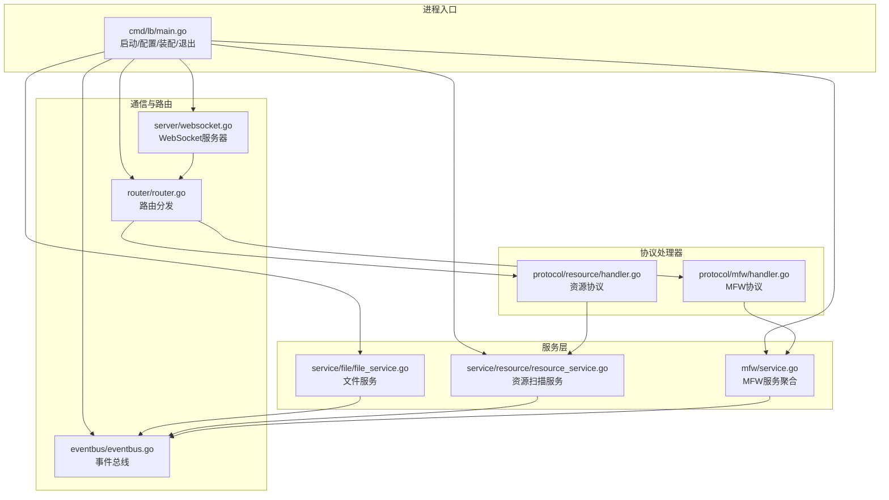
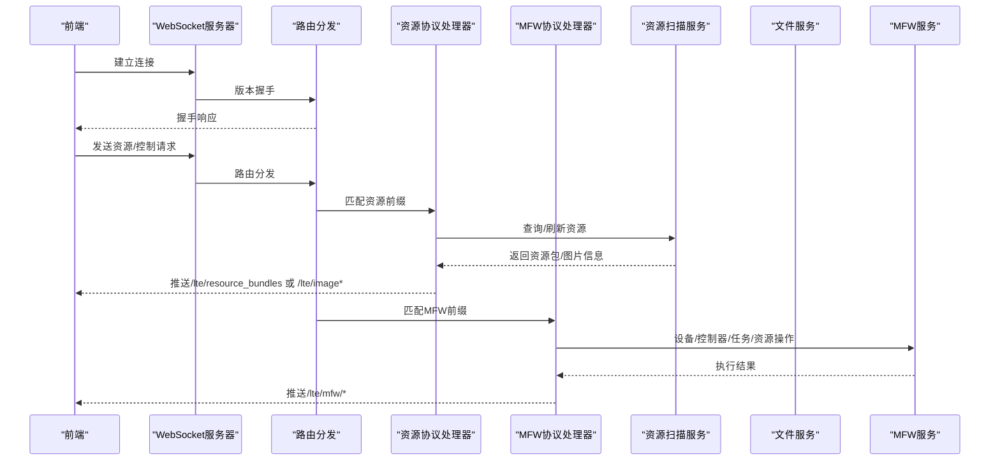
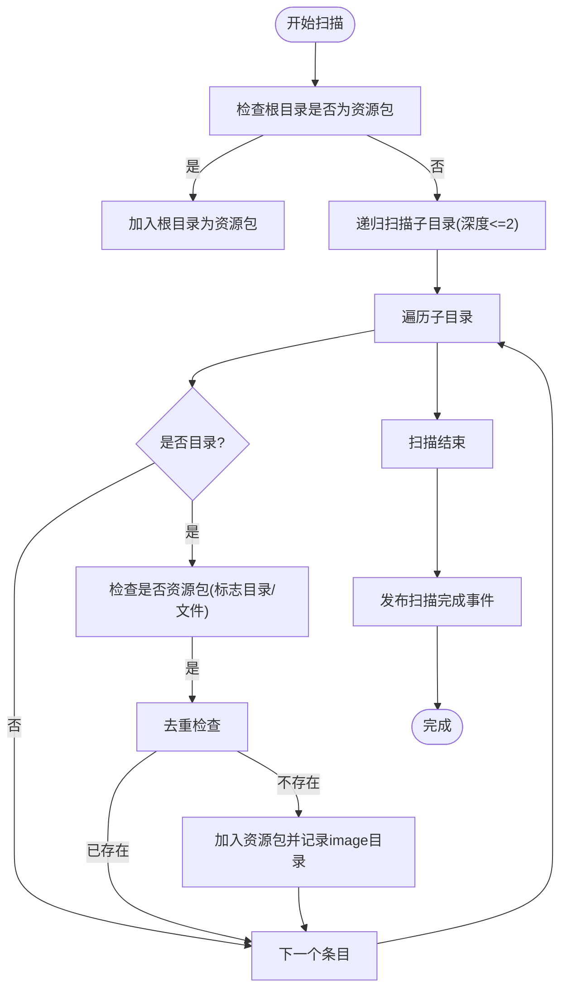
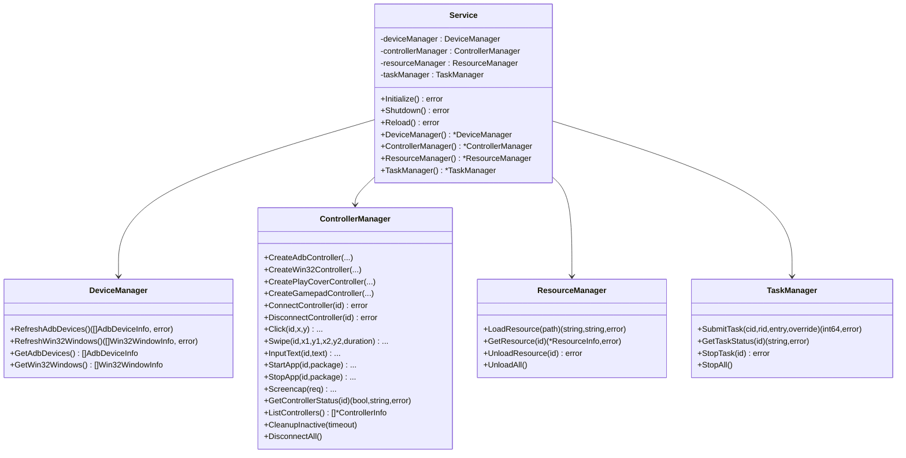
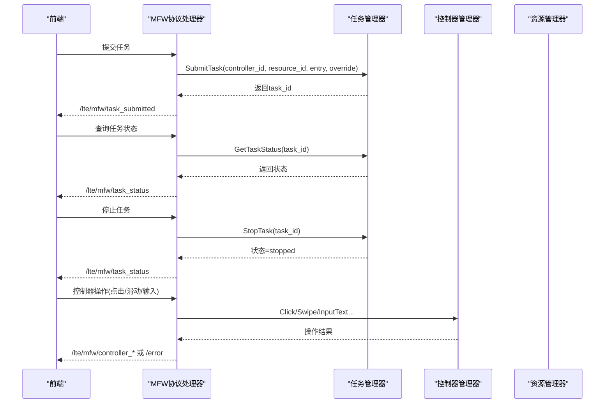
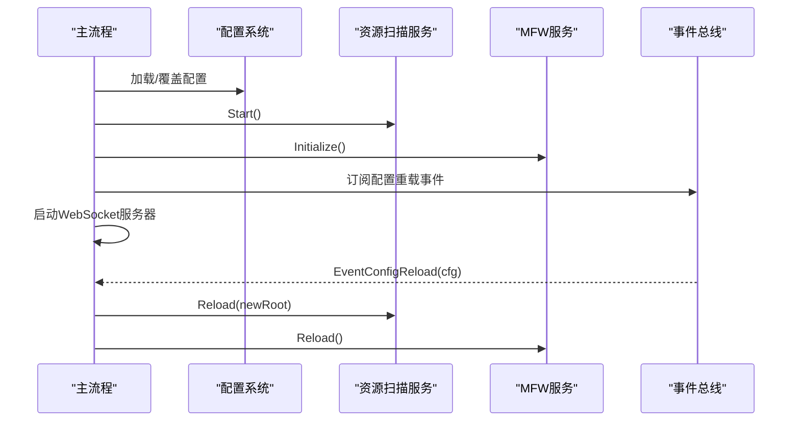
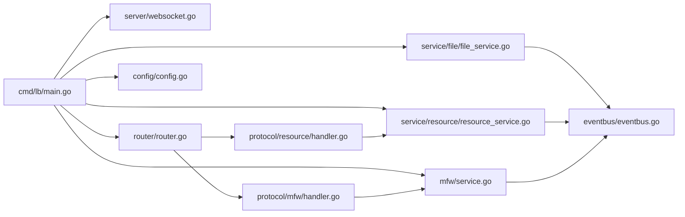

# 资源服务

<cite>
**本文引用的文件**
- [LocalBridge/cmd/lb/main.go](file://LocalBridge/cmd/lb/main.go)
- [LocalBridge/internal/mfw/service.go](file://LocalBridge/internal/mfw/service.go)
- [LocalBridge/internal/mfw/device_manager.go](file://LocalBridge/internal/mfw/device_manager.go)
- [LocalBridge/internal/mfw/controller_manager.go](file://LocalBridge/internal/mfw/controller_manager.go)
- [LocalBridge/internal/mfw/resource_manager.go](file://LocalBridge/internal/mfw/resource_manager.go)
- [LocalBridge/internal/mfw/task_manager.go](file://LocalBridge/internal/mfw/task_manager.go)
- [LocalBridge/internal/service/resource/resource_service.go](file://LocalBridge/internal/service/resource/resource_service.go)
- [LocalBridge/internal/service/file/file_service.go](file://LocalBridge/internal/service/file/file_service.go)
- [LocalBridge/internal/service/file/scanner.go](file://LocalBridge/internal/service/file/scanner.go)
- [LocalBridge/internal/service/file/watcher.go](file://LocalBridge/internal/service/file/watcher.go)
- [LocalBridge/internal/protocol/resource/handler.go](file://LocalBridge/internal/protocol/resource/handler.go)
- [LocalBridge/internal/protocol/mfw/handler.go](file://LocalBridge/internal/protocol/mfw/handler.go)
- [LocalBridge/internal/config/config.go](file://LocalBridge/internal/config/config.go)
- [LocalBridge/internal/eventbus/eventbus.go](file://LocalBridge/internal/eventbus/eventbus.go)
- [LocalBridge/internal/server/websocket.go](file://LocalBridge/internal/server/websocket.go)
- [LocalBridge/internal/router/router.go](file://LocalBridge/internal/router/router.go)
- [LocalBridge/pkg/models/resource.go](file://LocalBridge/pkg/models/resource.go)
</cite>

## 目录
1. [简介](#简介)
2. [项目结构](#项目结构)
3. [核心组件](#核心组件)
4. [架构总览](#架构总览)
5. [详细组件分析](#详细组件分析)
6. [依赖分析](#依赖分析)
7. [性能考虑](#性能考虑)
8. [故障排查指南](#故障排查指南)
9. [结论](#结论)
10. [附录](#附录)

## 简介
本文面向LocalBridge资源服务，系统性阐述以下主题：
- 资源扫描机制：图像文件识别、模板资源管理、缓存策略
- MaaFramework设备管理：设备连接、状态监控、控制命令
- 控制器管理功能：任务调度、执行状态跟踪、错误处理
- 资源服务的启动流程与重载机制：配置更新、服务重启、状态恢复
- 资源管理最佳实践与性能优化建议

## 项目结构
LocalBridge采用分层与模块化设计：
- 命令入口与生命周期：cmd/lb/main.go负责启动、配置加载、服务装配与优雅退出
- 协议与路由：protocol/*定义消息协议，router根据路径前缀分发至对应处理器
- 服务层：service/*实现文件与资源扫描；mfw/*封装MaaFramework能力
- 通信层：server/websocket提供WebSocket服务，eventbus事件总线贯穿各模块
- 配置与模型：config/*管理配置，pkg/models/*承载跨模块数据结构

图表来源
- [LocalBridge/cmd/lb/main.go:183-440](file://LocalBridge/cmd/lb/main.go#L183-L440)
- [LocalBridge/internal/server/websocket.go:66-93](file://LocalBridge/internal/server/websocket.go#L66-L93)
- [LocalBridge/internal/router/router.go:49-76](file://LocalBridge/internal/router/router.go#L49-L76)
- [LocalBridge/internal/protocol/resource/handler.go:55-69](file://LocalBridge/internal/protocol/resource/handler.go#L55-L69)
- [LocalBridge/internal/protocol/mfw/handler.go:28-43](file://LocalBridge/internal/protocol/mfw/handler.go#L28-L43)
- [LocalBridge/internal/service/file/file_service.go:64-95](file://LocalBridge/internal/service/file/file_service.go#L64-L95)
- [LocalBridge/internal/service/resource/resource_service.go:33-46](file://LocalBridge/internal/service/resource/resource_service.go#L33-L46)
- [LocalBridge/internal/mfw/service.go:36-138](file://LocalBridge/internal/mfw/service.go#L36-L138)

章节来源
- [LocalBridge/cmd/lb/main.go:183-440](file://LocalBridge/cmd/lb/main.go#L183-L440)
- [LocalBridge/internal/server/websocket.go:66-93](file://LocalBridge/internal/server/websocket.go#L66-L93)
- [LocalBridge/internal/router/router.go:49-76](file://LocalBridge/internal/router/router.go#L49-L76)

## 核心组件
- 配置系统：集中管理服务器、文件、日志、MaaFramework等配置项，并提供安全检查与路径规范化
- 文件服务：扫描与监听文件系统变化，维护索引，支持读写与安全路径校验
- 资源扫描服务：识别MaaFramework资源包，聚合image目录，提供图片检索与列表
- MFW服务：封装设备管理、控制器管理、资源管理、任务管理
- 协议处理器：将消息路由到具体业务处理逻辑，负责错误包装与响应
- 事件总线：连接建立、文件变化、资源扫描完成、配置重载等事件的发布与订阅
- WebSocket服务器：提供长连接通信，广播消息与推送日志

章节来源
- [LocalBridge/internal/config/config.go:53-95](file://LocalBridge/internal/config/config.go#L53-L95)
- [LocalBridge/internal/service/file/file_service.go:37-62](file://LocalBridge/internal/service/file/file_service.go#L37-L62)
- [LocalBridge/internal/service/resource/resource_service.go:23-31](file://LocalBridge/internal/service/resource/resource_service.go#L23-L31)
- [LocalBridge/internal/mfw/service.go:15-34](file://LocalBridge/internal/mfw/service.go#L15-L34)
- [LocalBridge/internal/eventbus/eventbus.go:74-82](file://LocalBridge/internal/eventbus/eventbus.go#L74-L82)
- [LocalBridge/internal/server/websocket.go:35-58](file://LocalBridge/internal/server/websocket.go#L35-L58)

## 架构总览
LocalBridge以“协议-路由-处理器-服务”的模式组织，WebSocket作为统一接入点，事件总线贯穿生命周期，MFW服务与文件/资源服务并行运行。

图表来源
- [LocalBridge/internal/server/websocket.go:144-161](file://LocalBridge/internal/server/websocket.go#L144-L161)
- [LocalBridge/internal/router/router.go:49-76](file://LocalBridge/internal/router/router.go#L49-L76)
- [LocalBridge/internal/protocol/resource/handler.go:55-69](file://LocalBridge/internal/protocol/resource/handler.go#L55-L69)
- [LocalBridge/internal/protocol/mfw/handler.go:28-43](file://LocalBridge/internal/protocol/mfw/handler.go#L28-L43)

## 详细组件分析

### 资源扫描机制
- 图像文件识别
  - 资源包判定：目录包含pipeline、image、model或default_pipeline.json即视为资源包
  - image目录聚合：记录每个资源包的image目录，用于后续图片检索
  - 图片扩展名：支持png/jpg/jpeg/gif/webp/bmp
- 模板资源管理
  - 资源包元信息：绝对/相对路径、名称、标志位（是否有pipeline/image/model/default_pipeline）
  - 图片列表：支持按pipeline路径定位所属资源包，返回过滤或全量图片列表
- 缓存策略
  - 资源扫描结果缓存在内存中，通过事件总线在扫描完成后广播给前端
  - 资源重载时重建索引并再次广播

图表来源
- [LocalBridge/internal/service/resource/resource_service.go:48-119](file://LocalBridge/internal/service/resource/resource_service.go#L48-L119)
- [LocalBridge/internal/service/resource/resource_service.go:121-153](file://LocalBridge/internal/service/resource/resource_service.go#L121-L153)
- [LocalBridge/internal/service/resource/resource_service.go:336-358](file://LocalBridge/internal/service/resource/resource_service.go#L336-L358)

章节来源
- [LocalBridge/internal/service/resource/resource_service.go:48-153](file://LocalBridge/internal/service/resource/resource_service.go#L48-L153)
- [LocalBridge/internal/service/resource/resource_service.go:175-193](file://LocalBridge/internal/service/resource/resource_service.go#L175-L193)
- [LocalBridge/internal/service/resource/resource_service.go:240-272](file://LocalBridge/internal/service/resource/resource_service.go#L240-L272)
- [LocalBridge/internal/protocol/resource/handler.go:107-137](file://LocalBridge/internal/protocol/resource/handler.go#L107-L137)

### MaaFramework设备管理
- 设备枚举
  - ADB设备：列出设备、截图与输入方法集合
  - Win32窗体：列出窗口、截图与输入方法集合
- 控制器管理
  - 创建：支持ADB、Win32、PlayCover、Gamepad控制器
  - 连接：异步连接并等待完成，超时保护
  - 操作：点击、滑动、输入文本、应用启停、手柄按键/触控、滚动、按键按下/释放、Shell、恢复状态等
  - 状态：连接状态、UUID、最后活跃时间
  - 清理：非活跃控制器自动清理
- 资源管理
  - 加载资源包，返回资源ID与哈希
  - 卸载与全部卸载
- 任务管理
  - 提交任务（绑定控制器、资源、入口、覆盖参数）
  - 查询状态、停止任务、全部停止

图表来源
- [LocalBridge/internal/mfw/service.go:15-34](file://LocalBridge/internal/mfw/service.go#L15-L34)
- [LocalBridge/internal/mfw/device_manager.go:11-24](file://LocalBridge/internal/mfw/device_manager.go#L11-L24)
- [LocalBridge/internal/mfw/controller_manager.go:20-31](file://LocalBridge/internal/mfw/controller_manager.go#L20-L31)
- [LocalBridge/internal/mfw/resource_manager.go:13-24](file://LocalBridge/internal/mfw/resource_manager.go#L13-L24)
- [LocalBridge/internal/mfw/task_manager.go:11-22](file://LocalBridge/internal/mfw/task_manager.go#L11-L22)

章节来源
- [LocalBridge/internal/mfw/device_manager.go:26-95](file://LocalBridge/internal/mfw/device_manager.go#L26-L95)
- [LocalBridge/internal/mfw/controller_manager.go:33-162](file://LocalBridge/internal/mfw/controller_manager.go#L33-L162)
- [LocalBridge/internal/mfw/controller_manager.go:249-300](file://LocalBridge/internal/mfw/controller_manager.go#L249-L300)
- [LocalBridge/internal/mfw/resource_manager.go:26-105](file://LocalBridge/internal/mfw/resource_manager.go#L26-L105)
- [LocalBridge/internal/mfw/task_manager.go:24-53](file://LocalBridge/internal/mfw/task_manager.go#L24-L53)

### 控制器管理功能
- 任务调度
  - 提交任务时创建Tasker并记录状态
  - 支持按任务ID查询状态与停止任务
- 执行状态跟踪
  - 每次操作更新控制器最后活跃时间
  - 连接状态与UUID可查询
- 错误处理
  - 统一错误码与包装，返回/lte/mfw/*或/error消息

图表来源
- [LocalBridge/internal/protocol/mfw/handler.go:684-771](file://LocalBridge/internal/protocol/mfw/handler.go#L684-L771)
- [LocalBridge/internal/mfw/task_manager.go:55-90](file://LocalBridge/internal/mfw/task_manager.go#L55-L90)
- [LocalBridge/internal/mfw/controller_manager.go:336-442](file://LocalBridge/internal/mfw/controller_manager.go#L336-L442)

章节来源
- [LocalBridge/internal/protocol/mfw/handler.go:684-771](file://LocalBridge/internal/protocol/mfw/handler.go#L684-L771)
- [LocalBridge/internal/mfw/task_manager.go:55-90](file://LocalBridge/internal/mfw/task_manager.go#L55-L90)
- [LocalBridge/internal/mfw/controller_manager.go:336-442](file://LocalBridge/internal/mfw/controller_manager.go#L336-L442)

### 资源服务启动与重载机制
- 启动流程
  - 初始化路径、加载配置、安全检查、日志初始化
  - 创建并启动文件服务、资源扫描服务
  - 初始化MFW服务（可选），设置日志推送与连接事件
  - 注册协议处理器，启动WebSocket服务器
- 重载机制
  - 订阅配置重载事件，分别重载资源扫描与MFW服务
  - 资源重载：更新根目录（如有变化）、重新扫描并广播结果
  - MFW重载：先Shutdown再Initialize

图表来源
- [LocalBridge/cmd/lb/main.go:183-262](file://LocalBridge/cmd/lb/main.go#L183-L262)
- [LocalBridge/cmd/lb/main.go:354-383](file://LocalBridge/cmd/lb/main.go#L354-L383)
- [LocalBridge/internal/mfw/service.go:199-217](file://LocalBridge/internal/mfw/service.go#L199-L217)
- [LocalBridge/internal/service/resource/resource_service.go:336-358](file://LocalBridge/internal/service/resource/resource_service.go#L336-L358)

章节来源
- [LocalBridge/cmd/lb/main.go:183-262](file://LocalBridge/cmd/lb/main.go#L183-L262)
- [LocalBridge/cmd/lb/main.go:354-383](file://LocalBridge/cmd/lb/main.go#L354-L383)
- [LocalBridge/internal/mfw/service.go:199-217](file://LocalBridge/internal/mfw/service.go#L199-L217)
- [LocalBridge/internal/service/resource/resource_service.go:336-358](file://LocalBridge/internal/service/resource/resource_service.go#L336-L358)

### 文件服务与事件总线
- 文件扫描
  - 支持深度与文件数量限制，避免大规模扫描导致阻塞
  - 通过Scanner与Watcher配合，构建索引并监听变化
- 文件监听
  - 使用fsnotify监听文件系统事件，防抖合并多次写入
  - 自身写入忽略窗口，避免重复触发
- 事件总线
  - 发布文件扫描完成、文件变化、连接建立、资源扫描完成、配置重载等事件
  - 资源协议处理器订阅事件并推送资源包列表

章节来源
- [LocalBridge/internal/service/file/scanner.go:58-147](file://LocalBridge/internal/service/file/scanner.go#L58-L147)
- [LocalBridge/internal/service/file/watcher.go:61-92](file://LocalBridge/internal/service/file/watcher.go#L61-L92)
- [LocalBridge/internal/service/file/watcher.go:113-188](file://LocalBridge/internal/service/file/watcher.go#L113-L188)
- [LocalBridge/internal/service/file/file_service.go:64-95](file://LocalBridge/internal/service/file/file_service.go#L64-L95)
- [LocalBridge/internal/eventbus/eventbus.go:74-82](file://LocalBridge/internal/eventbus/eventbus.go#L74-L82)
- [LocalBridge/internal/protocol/resource/handler.go:219-245](file://LocalBridge/internal/protocol/resource/handler.go#L219-L245)

## 依赖分析
- 组件耦合
  - 协议处理器依赖服务层；服务层依赖事件总线；WebSocket服务器依赖路由与连接管理
  - MFW服务内部聚合设备、控制器、资源、任务管理器，对外暴露统一接口
- 外部依赖
  - MaaFramework Go绑定、fsnotify、gorilla/websocket、spf13/viper等
- 循环依赖
  - 通过接口与事件解耦，未见循环依赖迹象

图表来源
- [LocalBridge/cmd/lb/main.go:183-440](file://LocalBridge/cmd/lb/main.go#L183-L440)
- [LocalBridge/internal/server/websocket.go:35-58](file://LocalBridge/internal/server/websocket.go#L35-L58)
- [LocalBridge/internal/router/router.go:28-47](file://LocalBridge/internal/router/router.go#L28-L47)
- [LocalBridge/internal/protocol/resource/handler.go:22-43](file://LocalBridge/internal/protocol/resource/handler.go#L22-L43)
- [LocalBridge/internal/protocol/mfw/handler.go:11-21](file://LocalBridge/internal/protocol/mfw/handler.go#L11-L21)

章节来源
- [LocalBridge/cmd/lb/main.go:183-440](file://LocalBridge/cmd/lb/main.go#L183-L440)
- [LocalBridge/internal/router/router.go:28-47](file://LocalBridge/internal/router/router.go#L28-L47)

## 性能考虑
- 扫描限制
  - 合理设置max_depth与max_files，避免大规模扫描造成阻塞
  - 资源扫描仅递归两层，降低开销
- 监听与防抖
  - 文件监听采用防抖减少频繁写入触发
  - 自身写入忽略窗口，避免重复处理
- 控制器与任务
  - 非活跃控制器定期清理，释放资源
  - 任务统一管理，支持批量停止
- I/O与缓存
  - 资源扫描结果缓存在内存，避免重复磁盘扫描
  - 截图结果以Base64传输，适合小规模展示；大图场景建议前端缓存或CDN

## 故障排查指南
- MFW未初始化
  - 现象：拒绝MFW请求，提示设置库路径
  - 处理：运行“mpelb config set-lib”设置MaaFramework库路径并重启
- 库版本不匹配
  - 现象：初始化panic或库版本不匹配错误
  - 处理：更新MaaFramework到最新版本
- 路径安全警告
  - 现象：扫描高风险目录（系统目录/驱动器根/用户主目录）发出警告
  - 处理：指定具体项目目录，设置合理的max_depth与max_files
- 截图/操作失败
  - 现象：控制器连接超时、截图失败、操作失败
  - 处理：检查设备/窗口句柄有效性、截图与输入方法配置、网络与权限
- 配置重载
  - 现象：修改配置后需重载生效
  - 处理：触发配置重载事件，服务将重载资源扫描与MFW服务

章节来源
- [LocalBridge/cmd/lb/main.go:256-298](file://LocalBridge/cmd/lb/main.go#L256-L298)
- [LocalBridge/internal/mfw/service.go:36-51](file://LocalBridge/internal/mfw/service.go#L36-L51)
- [LocalBridge/internal/config/config.go:234-296](file://LocalBridge/internal/config/config.go#L234-L296)
- [LocalBridge/internal/mfw/controller_manager.go:278-288](file://LocalBridge/internal/mfw/controller_manager.go#L278-L288)
- [LocalBridge/cmd/lb/main.go:354-383](file://LocalBridge/cmd/lb/main.go#L354-L383)

## 结论
LocalBridge资源服务通过清晰的分层与事件驱动架构，实现了稳定的文件与资源扫描、灵活的MFW设备与控制器管理、以及可靠的协议路由与通信。遵循本文的最佳实践与性能建议，可在保证稳定性的同时获得良好的用户体验。

## 附录
- 数据模型要点
  - 资源包信息：包含标志位与image目录路径
  - 图片文件信息：相对路径与所属资源包名称
  - 资源包列表数据：根目录、资源包列表、image目录列表

章节来源
- [LocalBridge/pkg/models/resource.go:3-67](file://LocalBridge/pkg/models/resource.go#L3-L67)