# 资源管理系统

<cite>
**本文引用的文件**
- [resource_service.go](file://LocalBridge/internal/service/resource/resource_service.go)
- [scanner.go](file://LocalBridge/internal/service/file/scanner.go)
- [watcher.go](file://LocalBridge/internal/service/file/watcher.go)
- [resource_manager.go](file://LocalBridge/internal/mfw/resource_manager.go)
- [resource_bundle_resolver.go](file://LocalBridge/internal/mfw/resource_bundle_resolver.go)
- [controller_manager.go](file://LocalBridge/internal/mfw/controller_manager.go)
- [device_manager.go](file://LocalBridge/internal/mfw/device_manager.go)
- [task_manager.go](file://LocalBridge/internal/mfw/task_manager.go)
- [router.go](file://LocalBridge/internal/router/router.go)
- [eventbus.go](file://LocalBridge/internal/eventbus/eventbus.go)
- [websocket.go](file://LocalBridge/internal/server/websocket.go)
- [resource.go](file://LocalBridge/pkg/models/resource.go)
- [file.go](file://LocalBridge/pkg/models/file.go)
- [types.go](file://LocalBridge/internal/mfw/types.go)
- [paths.go](file://LocalBridge/internal/paths/paths.go)
</cite>

## 目录
1. [简介](#简介)
2. [项目结构](#项目结构)
3. [核心组件](#核心组件)
4. [架构总览](#架构总览)
5. [详细组件分析](#详细组件分析)
6. [依赖分析](#依赖分析)
7. [性能考虑](#性能考虑)
8. [故障排查指南](#故障排查指南)
9. [结论](#结论)
10. [附录](#附录)

## 简介
本文件面向“资源管理系统”的技术文档，聚焦于本地资源扫描、索引与管理，资源文件监控、变更检测与热重载，自定义识别注册、资源路径解析与依赖管理，资源缓存策略与内存管理，以及资源导入导出、版本控制与备份恢复的实现思路与最佳实践。文档基于仓库中的 LocalBridge 与 MaaFramework 集成模块，结合前端交互与本地服务的协作机制，提供从代码到运维的全链路说明。

## 项目结构
系统采用分层与模块化组织方式：
- LocalBridge 内部模块负责本地资源扫描、文件监控、MaaFramework 集成与服务编排
- pkg/models 定义跨模块传输的数据结构
- internal/server 提供 WebSocket 服务与协议版本管理
- internal/router 负责消息路由与处理器分发
- internal/eventbus 提供事件总线机制
- internal/paths 提供运行模式与路径管理

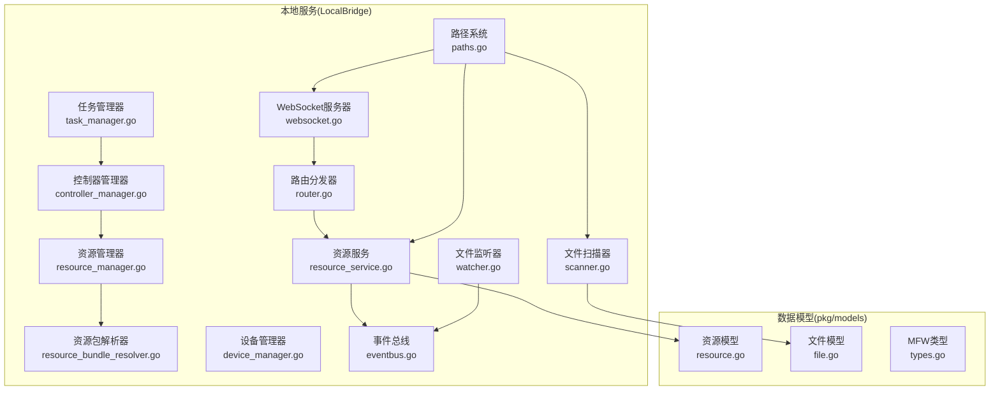

图表来源
- [resource_service.go:1-359](file://LocalBridge/internal/service/resource/resource_service.go#L1-L359)
- [scanner.go:1-301](file://LocalBridge/internal/service/file/scanner.go#L1-L301)
- [watcher.go:1-261](file://LocalBridge/internal/service/file/watcher.go#L1-L261)
- [resource_manager.go:1-118](file://LocalBridge/internal/mfw/resource_manager.go#L1-L118)
- [resource_bundle_resolver.go:1-368](file://LocalBridge/internal/mfw/resource_bundle_resolver.go#L1-L368)
- [controller_manager.go:1-800](file://LocalBridge/internal/mfw/controller_manager.go#L1-L800)
- [device_manager.go:1-136](file://LocalBridge/internal/mfw/device_manager.go#L1-L136)
- [task_manager.go:1-114](file://LocalBridge/internal/mfw/task_manager.go#L1-L114)
- [router.go:1-161](file://LocalBridge/internal/router/router.go#L1-L161)
- [eventbus.go:1-83](file://LocalBridge/internal/eventbus/eventbus.go#L1-L83)
- [websocket.go:1-179](file://LocalBridge/internal/server/websocket.go#L1-L179)
- [resource.go:1-67](file://LocalBridge/pkg/models/resource.go#L1-L67)
- [file.go:1-30](file://LocalBridge/pkg/models/file.go#L1-L30)
- [types.go:1-129](file://LocalBridge/internal/mfw/types.go#L1-L129)
- [paths.go:1-238](file://LocalBridge/internal/paths/paths.go#L1-L238)

章节来源
- [paths.go:1-238](file://LocalBridge/internal/paths/paths.go#L1-L238)
- [websocket.go:1-179](file://LocalBridge/internal/server/websocket.go#L1-L179)
- [router.go:1-161](file://LocalBridge/internal/router/router.go#L1-L161)
- [eventbus.go:1-83](file://LocalBridge/internal/eventbus/eventbus.go#L1-L83)

## 核心组件
- 资源服务(ResourceService)：负责扫描本地资源包、构建资源包索引、提供图片查询与列表能力，并在重载时重建索引
- 文件扫描器(Scanner)：按扩展名与深度限制扫描文件，解析节点与锚点，支持单文件扫描
- 文件监听器(Watcher)：基于 fsnotify 实现文件系统事件监听，支持防抖与目录/文件类型判定
- 资源管理器(ResourceManager)：封装 MaaFramework 资源加载、查询与卸载，维护资源生命周期
- 资源包解析器(ResourceBundleResolver)：根据路径策略解析资源包根目录，支持多种解析策略与诊断输出
- 控制器管理器(ControllerManager)：创建与管理多类控制器，提供截图、输入、点击、滑动等操作
- 设备管理器(DeviceManager)：枚举 ADB、Win32 窗口与 WlRoots 设备，提供可用方法列表
- 任务管理器(TaskManager)：提交与停止任务，跟踪任务状态
- 路由分发器(Router)：协议握手、路由匹配与错误响应
- 事件总线(EventBus)：异步事件发布/订阅，贯穿扫描完成、文件变更、连接建立/关闭等事件
- WebSocket 服务器：提供协议版本校验、连接管理与广播能力

章节来源
- [resource_service.go:14-359](file://LocalBridge/internal/service/resource/resource_service.go#L14-L359)
- [scanner.go:20-301](file://LocalBridge/internal/service/file/scanner.go#L20-L301)
- [watcher.go:34-261](file://LocalBridge/internal/service/file/watcher.go#L34-L261)
- [resource_manager.go:11-118](file://LocalBridge/internal/mfw/resource_manager.go#L11-L118)
- [resource_bundle_resolver.go:131-368](file://LocalBridge/internal/mfw/resource_bundle_resolver.go#L131-L368)
- [controller_manager.go:20-800](file://LocalBridge/internal/mfw/controller_manager.go#L20-L800)
- [device_manager.go:11-136](file://LocalBridge/internal/mfw/device_manager.go#L11-L136)
- [task_manager.go:11-114](file://LocalBridge/internal/mfw/task_manager.go#L11-L114)
- [router.go:28-161](file://LocalBridge/internal/router/router.go#L28-L161)
- [eventbus.go:16-83](file://LocalBridge/internal/eventbus/eventbus.go#L16-L83)
- [websocket.go:35-179](file://LocalBridge/internal/server/websocket.go#L35-L179)

## 架构总览
系统通过 WebSocket 与前端建立长连接，Router 负责协议握手与路由分发；资源服务与文件扫描器负责本地资源与文件索引；事件总线在扫描完成、文件变更等时刻触发通知；资源管理器与资源包解析器对接 MaaFramework，完成资源加载与路径解析；控制器/设备/任务管理器提供运行期控制与任务执行能力。

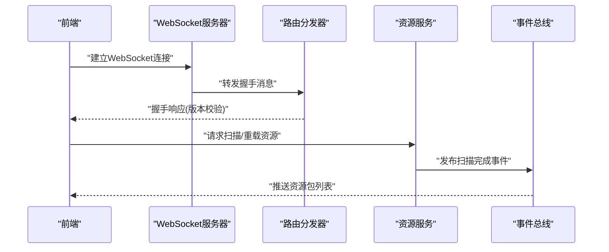

图表来源
- [websocket.go:144-161](file://LocalBridge/internal/server/websocket.go#L144-L161)
- [router.go:114-161](file://LocalBridge/internal/router/router.go#L114-L161)
- [resource_service.go:33-46](file://LocalBridge/internal/service/resource/resource_service.go#L33-L46)
- [eventbus.go:37-56](file://LocalBridge/internal/eventbus/eventbus.go#L37-L56)

## 详细组件分析

### 资源扫描与索引
- 扫描策略
  - 从根目录开始，先判定根目录是否为资源包，再递归扫描最多两层子目录
  - 资源包判定依据：存在 pipeline/image/model/default_pipeline.json 任一即视为资源包
  - 收集所有 image 目录，用于后续图片查询
- 线程安全
  - 使用互斥锁保护 bundles 与 imageDirs 的并发访问
- 事件发布
  - 扫描完成后发布扫描完成事件，推送资源包列表给前端
- 重载机制
  - 支持更新根目录并重新扫描，随后发布事件

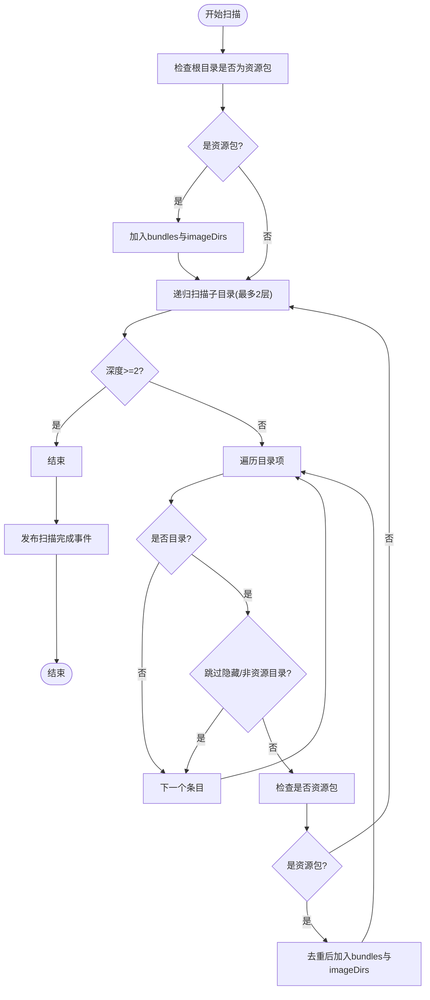

图表来源
- [resource_service.go:48-119](file://LocalBridge/internal/service/resource/resource_service.go#L48-L119)
- [resource_service.go:121-153](file://LocalBridge/internal/service/resource/resource_service.go#L121-L153)
- [resource_service.go:336-359](file://LocalBridge/internal/service/resource/resource_service.go#L336-L359)

章节来源
- [resource_service.go:14-359](file://LocalBridge/internal/service/resource/resource_service.go#L14-L359)

### 文件扫描与节点解析
- 扩展名过滤：支持 JSON/JSONC，特殊隐藏配置文件过滤
- 深度与文件数量限制：防止大规模扫描导致性能问题
- 节点解析：从 JSONC 中提取顶层键作为节点，解析 anchor 引用（字符串/数组/映射）
- 单文件扫描：用于增量更新场景

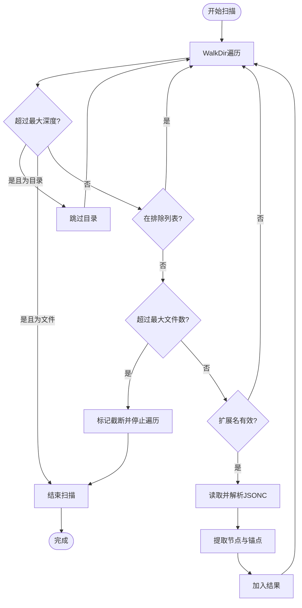

图表来源
- [scanner.go:58-147](file://LocalBridge/internal/service/file/scanner.go#L58-L147)
- [scanner.go:212-295](file://LocalBridge/internal/service/file/scanner.go#L212-L295)

章节来源
- [scanner.go:20-301](file://LocalBridge/internal/service/file/scanner.go#L20-L301)

### 文件监控与热重载
- 监听范围：递归添加所有子目录至 fsnotify
- 事件类型：创建/修改/删除/重命名，区分目录与文件
- 防抖策略：针对同一路径的多次事件合并，降低重复处理
- 路径规范化：统一清理与标准化路径，避免大小写与分隔符差异
- 处理回调：将变更事件传递给上层逻辑（如触发重新扫描或增量更新）

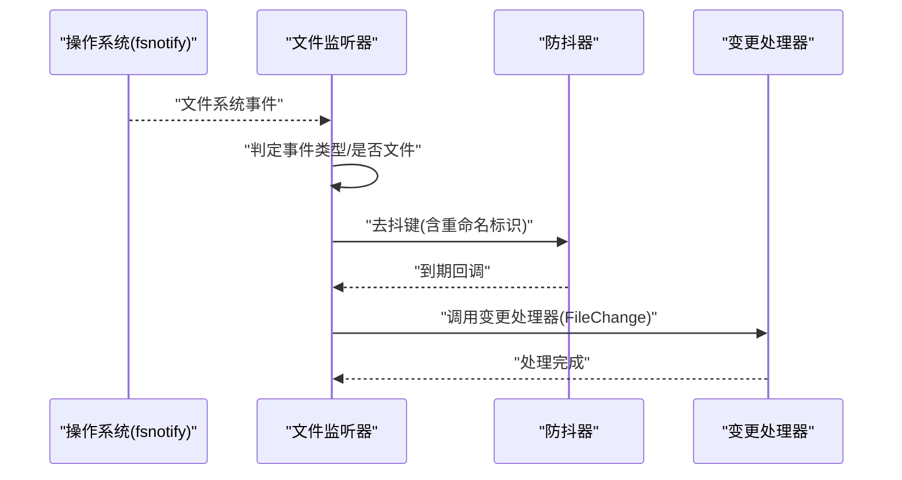

图表来源
- [watcher.go:62-191](file://LocalBridge/internal/service/file/watcher.go#L62-L191)
- [watcher.go:204-261](file://LocalBridge/internal/service/file/watcher.go#L204-L261)

章节来源
- [watcher.go:34-261](file://LocalBridge/internal/service/file/watcher.go#L34-L261)

### 资源路径解析与依赖管理
- 解析策略：从输入路径向上回溯到资源包根目录；若输入为目录，可向下查找唯一候选；支持精确根、祖先路径、后代唯一等策略
- 诊断输出：提供策略描述与候选路径，便于定位歧义
- 预检加载：对多个资源包路径进行串联加载与哈希校验，确保依赖链完整

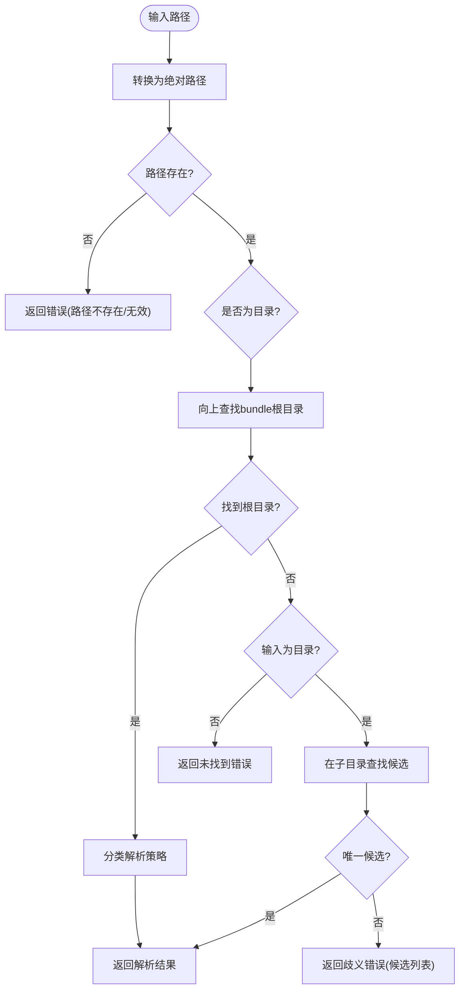

图表来源
- [resource_bundle_resolver.go:131-205](file://LocalBridge/internal/mfw/resource_bundle_resolver.go#L131-L205)
- [resource_bundle_resolver.go:207-234](file://LocalBridge/internal/mfw/resource_bundle_resolver.go#L207-L234)

章节来源
- [resource_bundle_resolver.go:131-368](file://LocalBridge/internal/mfw/resource_bundle_resolver.go#L131-L368)

### 资源加载与缓存策略
- 资源加载：创建 MaaFramework 资源对象，发起加载作业，等待完成并获取哈希
- 生命周期管理：维护资源 ID 映射，支持按需卸载与全部卸载
- 缓存与内存
  - 截图缓存：控制器支持使用缓存图像，减少重复抓取
  - 非活跃清理：定期清理长时间未活跃的控制器实例，释放资源
- 并发安全：读写锁保护资源与控制器集合

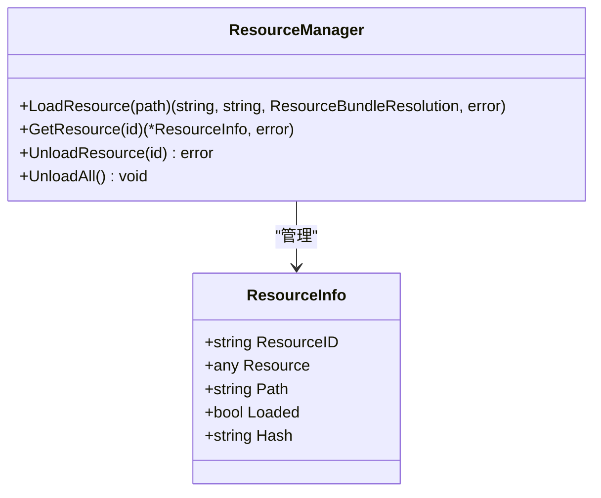

图表来源
- [resource_manager.go:11-118](file://LocalBridge/internal/mfw/resource_manager.go#L11-L118)
- [types.go:56-63](file://LocalBridge/internal/mfw/types.go#L56-L63)

章节来源
- [resource_manager.go:11-118](file://LocalBridge/internal/mfw/resource_manager.go#L11-L118)
- [types.go:56-63](file://LocalBridge/internal/mfw/types.go#L56-L63)

### 控制器与设备管理
- 控制器类型：ADB、Win32、PlayCover、Gamepad、WlRoots
- 设备枚举：ADB 设备、Win32 窗口、WlRoots 合成器
- 操作能力：点击、滑动、输入文本、启动/停止应用、滚动、截图等
- 状态管理：连接状态、最后活跃时间、UUID 等

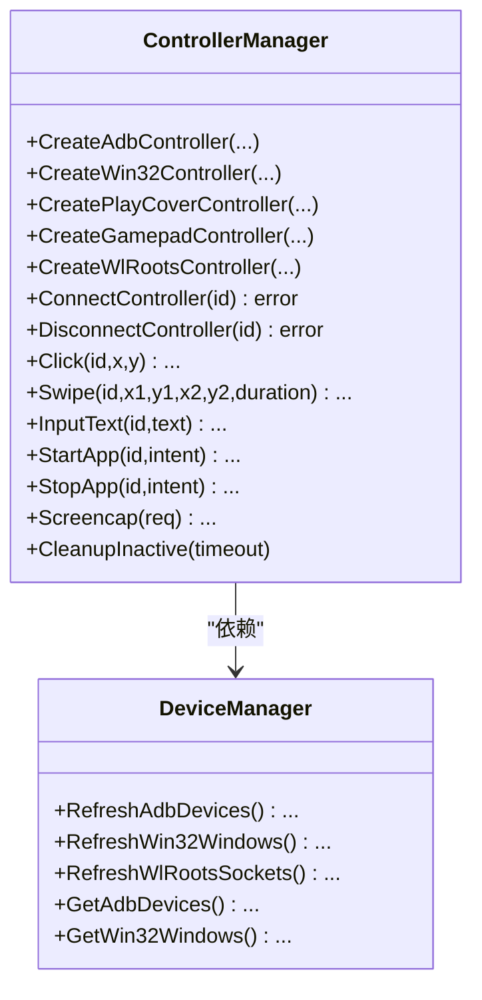

图表来源
- [controller_manager.go:20-800](file://LocalBridge/internal/mfw/controller_manager.go#L20-L800)
- [device_manager.go:11-136](file://LocalBridge/internal/mfw/device_manager.go#L11-L136)

章节来源
- [controller_manager.go:20-800](file://LocalBridge/internal/mfw/controller_manager.go#L20-L800)
- [device_manager.go:11-136](file://LocalBridge/internal/mfw/device_manager.go#L11-L136)

### 任务管理与执行
- 提交任务：创建 Tasker，记录任务状态与覆盖参数
- 停止任务：支持单个与全部停止
- 状态跟踪：任务状态随提交与停止更新

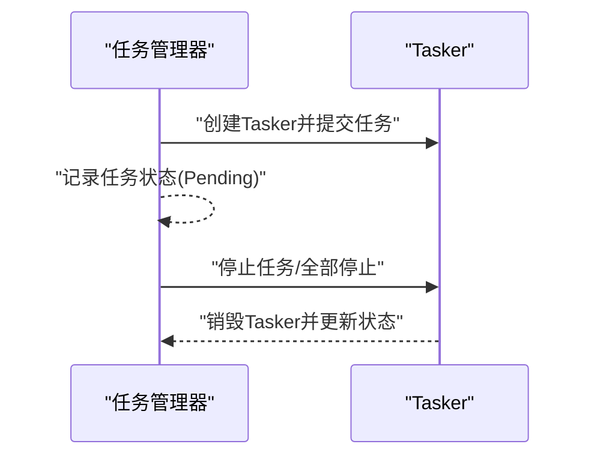

图表来源
- [task_manager.go:24-114](file://LocalBridge/internal/mfw/task_manager.go#L24-L114)

章节来源
- [task_manager.go:11-114](file://LocalBridge/internal/mfw/task_manager.go#L11-L114)

### 事件总线与路由
- 事件总线：支持同步/异步发布，订阅特定事件类型
- 路由分发：精确与前缀匹配，处理握手与错误响应
- WebSocket：连接注册/注销、广播消息、统计活跃连接

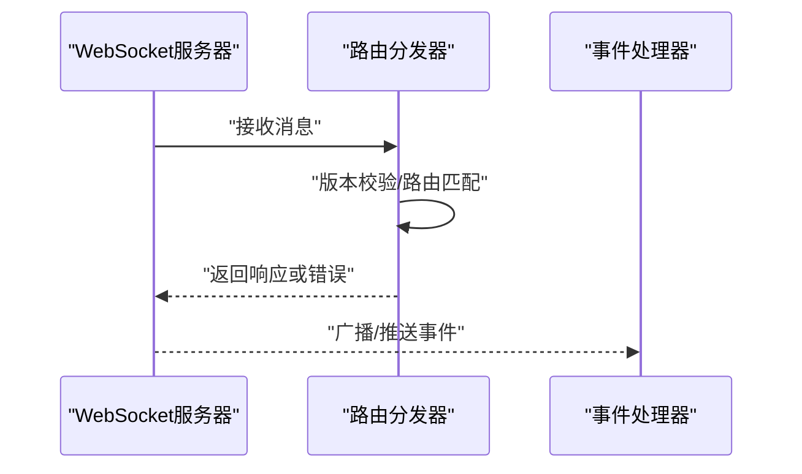

图表来源
- [websocket.go:114-179](file://LocalBridge/internal/server/websocket.go#L114-L179)
- [router.go:56-113](file://LocalBridge/internal/router/router.go#L56-L113)
- [eventbus.go:37-56](file://LocalBridge/internal/eventbus/eventbus.go#L37-L56)

章节来源
- [eventbus.go:16-83](file://LocalBridge/internal/eventbus/eventbus.go#L16-L83)
- [router.go:28-161](file://LocalBridge/internal/router/router.go#L28-L161)
- [websocket.go:35-179](file://LocalBridge/internal/server/websocket.go#L35-L179)

## 依赖分析
- 组件耦合
  - 资源服务依赖事件总线发布扫描结果
  - 文件扫描器与监听器独立，但共同服务于资源服务的索引与热重载
  - 资源管理器依赖资源包解析器进行路径解析与加载
  - 控制器/设备/任务管理器相互解耦，通过统一的错误与状态管理接口交互
- 外部依赖
  - MaaFramework Go 绑定：资源加载、控制器与任务执行
  - fsnotify：文件系统事件监听
  - gorilla/websocket：WebSocket 通信
- 循环依赖
  - 未见循环依赖迹象；各模块职责清晰，通过接口与事件解耦

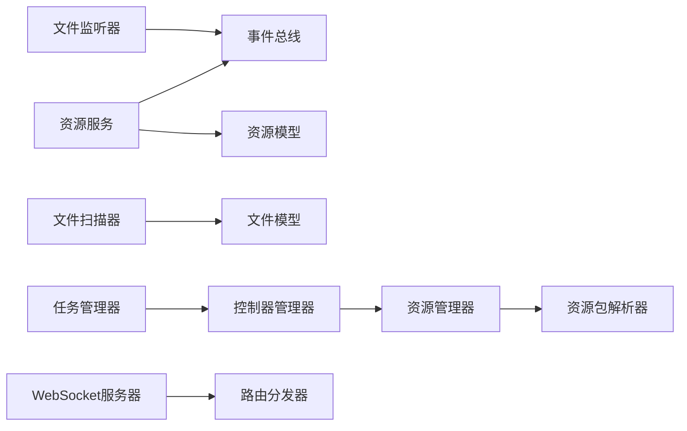

图表来源
- [resource_service.go:14-31](file://LocalBridge/internal/service/resource/resource_service.go#L14-L31)
- [resource_manager.go:11-22](file://LocalBridge/internal/mfw/resource_manager.go#L11-L22)
- [resource_bundle_resolver.go:131-139](file://LocalBridge/internal/mfw/resource_bundle_resolver.go#L131-L139)
- [controller_manager.go:20-31](file://LocalBridge/internal/mfw/controller_manager.go#L20-L31)
- [task_manager.go:11-22](file://LocalBridge/internal/mfw/task_manager.go#L11-L22)
- [websocket.go:35-58](file://LocalBridge/internal/server/websocket.go#L35-L58)
- [router.go:28-49](file://LocalBridge/internal/router/router.go#L28-L49)

章节来源
- [resource_service.go:14-359](file://LocalBridge/internal/service/resource/resource_service.go#L14-L359)
- [resource_manager.go:11-118](file://LocalBridge/internal/mfw/resource_manager.go#L11-L118)
- [resource_bundle_resolver.go:131-368](file://LocalBridge/internal/mfw/resource_bundle_resolver.go#L131-L368)
- [controller_manager.go:20-800](file://LocalBridge/internal/mfw/controller_manager.go#L20-L800)
- [task_manager.go:11-114](file://LocalBridge/internal/mfw/task_manager.go#L11-L114)
- [websocket.go:35-179](file://LocalBridge/internal/server/websocket.go#L35-L179)
- [router.go:28-161](file://LocalBridge/internal/router/router.go#L28-L161)

## 性能考虑
- 扫描限制
  - 文件数量与扫描深度上限，避免大规模目录导致阻塞
  - 路径解析限定最大搜索深度，减少不必要的子树遍历
- 并发与锁
  - 资源服务与管理器使用读写锁，提升并发读取效率
- 防抖与批处理
  - 文件监听器的防抖器减少高频事件的重复处理
- 缓存与清理
  - 控制器截图缓存与非活跃清理，降低资源占用
- I/O 优化
  - 图片扫描统一扩展名校验，减少无关文件处理

[本节为通用性能建议，无需具体文件分析]

## 故障排查指南
- 协议版本不匹配
  - 现象：握手失败，提示前端与后端协议版本不一致
  - 处理：确认前端/后端版本一致性，或按后端要求更新
- 资源路径解析失败
  - 现象：返回“路径不存在/无效”、“未找到包含 pipeline 的 bundle 根目录”或“命中多个候选”
  - 处理：检查输入路径是否正确，确认资源包结构与命名规范
- 资源加载失败
  - 现象：资源加载作业失败或未处于 Loaded 状态
  - 处理：查看诊断数据与候选路径，确认资源包完整性与依赖
- 文件扫描异常
  - 现象：扫描被截断、深度受限或忽略某些目录
  - 处理：调整最大深度与文件数量限制，检查排除列表
- 控制器连接失败
  - 现象：连接超时或状态异常
  - 处理：检查设备可用性与方法映射，确认权限与驱动

章节来源
- [router.go:114-161](file://LocalBridge/internal/router/router.go#L114-L161)
- [resource_bundle_resolver.go:68-103](file://LocalBridge/internal/mfw/resource_bundle_resolver.go#L68-L103)
- [resource_manager.go:24-65](file://LocalBridge/internal/mfw/resource_manager.go#L24-L65)
- [scanner.go:14-18](file://LocalBridge/internal/service/file/scanner.go#L14-L18)
- [controller_manager.go:278-329](file://LocalBridge/internal/mfw/controller_manager.go#L278-L329)

## 结论
本资源管理系统通过本地资源扫描与索引、文件监控与热重载、资源路径解析与依赖管理、资源与控制器缓存策略，实现了稳定高效的资源生命周期管理。配合事件总线与 WebSocket 通道，系统能够及时向前端推送状态变更，满足编辑器对实时性的需求。未来可在以下方面持续优化：引入更细粒度的增量扫描与缓存失效策略、增强资源包元数据与版本信息、完善导入导出与备份恢复流程。

[本节为总结性内容，无需具体文件分析]

## 附录

### 数据模型与接口
- 资源包与图片
  - 资源包结构：包含绝对/相对路径、标志位与 image 目录
  - 图片信息：相对路径与所属资源包名称
- 文件与节点
  - 文件结构：绝对/相对路径、修改时间、节点列表与前缀
  - 节点结构：标签、前缀与锚点列表
- 控制器/任务/截图
  - 控制器信息：类型、连接状态、UUID、活跃时间
  - 任务信息：任务 ID、控制器/资源 ID、入口与覆盖参数、状态
  - 截图结果：Base64 图像、尺寸与时间戳

章节来源
- [resource.go:3-67](file://LocalBridge/pkg/models/resource.go#L3-L67)
- [file.go:3-30](file://LocalBridge/pkg/models/file.go#L3-L30)
- [types.go:45-129](file://LocalBridge/internal/mfw/types.go#L45-L129)

### 配置示例与路径管理
- 路径系统
  - 运行模式：用户模式、开发模式、便携模式
  - 数据目录：根据平台与模式确定，确保目录存在
  - 配置文件：默认配置与存在性保障
- 配置要点
  - 服务器：主机与端口
  - 文件扫描：根目录、排除列表、扩展名、最大深度与文件数
  - 日志：级别与推送开关
  - MaaFramework：启用开关、库目录与资源目录

章节来源
- [paths.go:39-238](file://LocalBridge/internal/paths/paths.go#L39-L238)