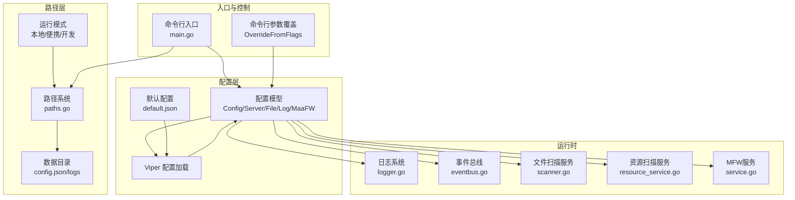
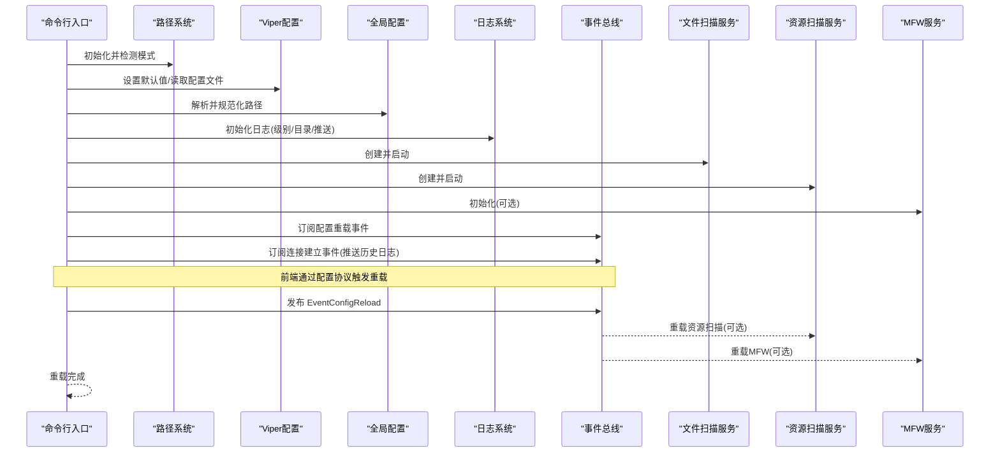
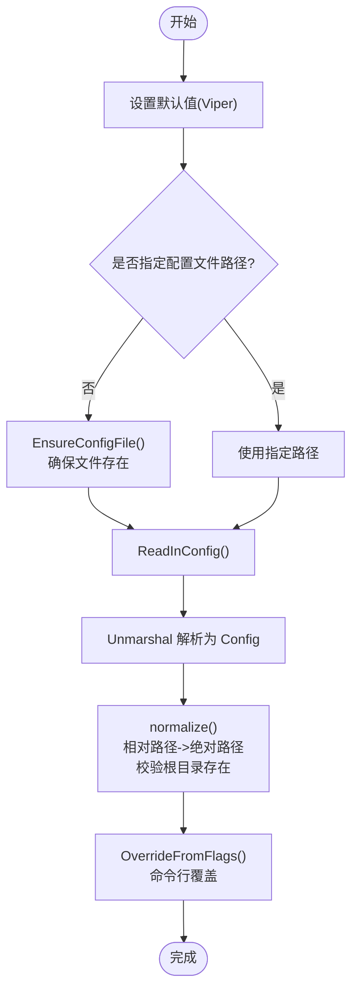
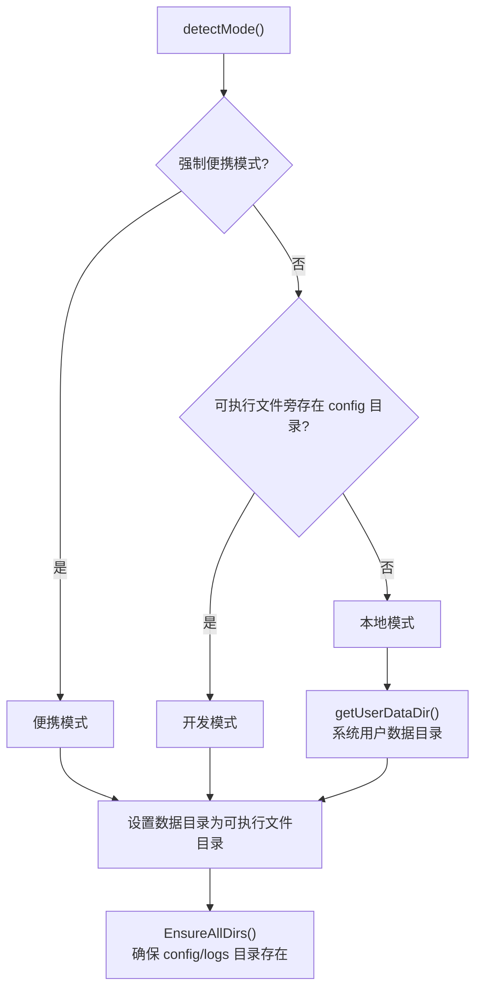
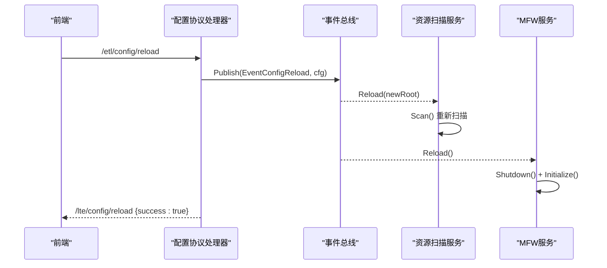
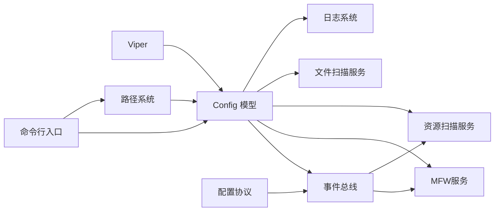

# 配置管理系统

<cite>
**本文档引用的文件**
- [LocalBridge/config/default.json](file://LocalBridge/config/default.json)
- [LocalBridge/internal/config/config.go](file://LocalBridge/internal/config/config.go)
- [LocalBridge/internal/paths/paths.go](file://LocalBridge/internal/paths/paths.go)
- [LocalBridge/cmd/lb/main.go](file://LocalBridge/cmd/lb/main.go)
- [LocalBridge/internal/logger/logger.go](file://LocalBridge/internal/logger/logger.go)
- [LocalBridge/internal/eventbus/eventbus.go](file://LocalBridge/internal/eventbus/eventbus.go)
- [LocalBridge/internal/mfw/service.go](file://LocalBridge/internal/mfw/service.go)
- [LocalBridge/internal/service/file/scanner.go](file://LocalBridge/internal/service/file/scanner.go)
- [LocalBridge/internal/protocol/config/handler.go](file://LocalBridge/internal/protocol/config/handler.go)
- [LocalBridge/internal/service/resource/resource_service.go](file://LocalBridge/internal/service/resource/resource_service.go)
- [docsite/docs/01.指南/20.本地服务/100.进阶配置.md](file://docsite/docs/01.指南/20.本地服务/100.进阶配置.md)
</cite>

## 目录
1. [简介](#简介)
2. [项目结构](#项目结构)
3. [核心组件](#核心组件)
4. [架构总览](#架构总览)
5. [详细组件分析](#详细组件分析)
6. [依赖关系分析](#依赖关系分析)
7. [性能考虑](#性能考虑)
8. [故障排查指南](#故障排查指南)
9. [结论](#结论)
10. [附录](#附录)

## 简介
本文件面向LocalBridge配置管理系统，系统性阐述配置文件结构（服务器、文件扫描、日志、MFW）、配置加载机制（默认值、命令行覆盖、环境变量）、路径管理（便携模式、数据目录、配置文件位置）、配置热重载（事件触发、服务重启、状态保持）以及最佳实践与常见场景。文档同时提供可视化图示帮助理解系统行为，并给出排障建议。

## 项目结构
LocalBridge的配置系统围绕以下关键模块组织：
- 配置模型与加载：定义配置结构体并通过Viper加载与解析
- 路径系统：根据运行模式确定数据目录、配置文件与日志目录
- 命令行入口：解析参数并覆盖配置
- 日志系统：控制台与文件双通道，支持推送至前端
- 事件总线：统一的配置重载事件分发
- 服务层：文件扫描、资源扫描、MFW服务等按需重载
- 协议层：前端通过配置协议进行读取、设置与重载

**图表来源**
- [LocalBridge/internal/config/config.go:54-95](file://LocalBridge/internal/config/config.go#L54-L95)
- [LocalBridge/internal/paths/paths.go:47-87](file://LocalBridge/internal/paths/paths.go#L47-L87)
- [LocalBridge/cmd/lb/main.go:183-221](file://LocalBridge/cmd/lb/main.go#L183-L221)
- [LocalBridge/internal/logger/logger.go:43-100](file://LocalBridge/internal/logger/logger.go#L43-L100)
- [LocalBridge/internal/eventbus/eventbus.go:67-82](file://LocalBridge/internal/eventbus/eventbus.go#L67-L82)
- [LocalBridge/internal/service/file/scanner.go:58-147](file://LocalBridge/internal/service/file/scanner.go#L58-L147)
- [LocalBridge/internal/service/resource/resource_service.go:34-68](file://LocalBridge/internal/service/resource/resource_service.go#L34-L68)
- [LocalBridge/internal/mfw/service.go:37-138](file://LocalBridge/internal/mfw/service.go#L37-L138)

**章节来源**
- [LocalBridge/internal/config/config.go:13-48](file://LocalBridge/internal/config/config.go#L13-L48)
- [LocalBridge/internal/paths/paths.go:15-87](file://LocalBridge/internal/paths/paths.go#L15-L87)
- [LocalBridge/cmd/lb/main.go:183-221](file://LocalBridge/cmd/lb/main.go#L183-L221)

## 核心组件
- 配置模型：包含服务器、文件扫描、日志、MaaFramework四大部分，均支持JSON映射与默认值设置
- 路径系统：自动检测运行模式，决定配置与日志存放位置；支持便携模式强制
- 配置加载：Viper负责默认值、文件读取、命令行覆盖与解析
- 日志系统：控制台与文件双通道，支持历史日志推送与清理
- 事件总线：集中发布配置重载事件，驱动服务层响应
- 服务层：文件扫描、资源扫描、MFW服务具备重载能力
- 协议层：前端通过配置协议实现读取、设置与重载

**章节来源**
- [LocalBridge/internal/config/config.go:13-48](file://LocalBridge/internal/config/config.go#L13-L48)
- [LocalBridge/internal/paths/paths.go:15-87](file://LocalBridge/internal/paths/paths.go#L15-L87)
- [LocalBridge/internal/logger/logger.go:43-100](file://LocalBridge/internal/logger/logger.go#L43-L100)
- [LocalBridge/internal/eventbus/eventbus.go:67-82](file://LocalBridge/internal/eventbus/eventbus.go#L67-L82)

## 架构总览
配置系统采用“模型-加载-覆盖-应用-事件”的流水线：
- 模型定义：结构体承载配置项
- 加载默认：Viper设置默认值
- 读取文件：定位并读取配置文件
- 命令行覆盖：优先级最高，覆盖模型
- 规范化路径：确保绝对路径与存在性校验
- 应用到服务：日志、文件扫描、资源扫描、MFW服务按需使用
- 事件驱动：前端触发重载，事件总线分发，服务层重载

**图表来源**
- [LocalBridge/cmd/lb/main.go:183-440](file://LocalBridge/cmd/lb/main.go#L183-L440)
- [LocalBridge/internal/eventbus/eventbus.go:38-82](file://LocalBridge/internal/eventbus/eventbus.go#L38-L82)
- [LocalBridge/internal/service/resource/resource_service.go:336-358](file://LocalBridge/internal/service/resource/resource_service.go#L336-L358)
- [LocalBridge/internal/mfw/service.go:199-217](file://LocalBridge/internal/mfw/service.go#L199-L217)

## 详细组件分析

### 配置文件结构与默认值
- 服务器配置：端口与主机
- 文件扫描配置：根目录、排除列表、扩展名、最大深度、最大文件数
- 日志配置：级别、目录、是否推送至前端
- MaaFramework配置：开关、库目录、资源目录

默认值来源：
- 内部默认值：Viper设置默认值，覆盖未配置项
- 文件默认值：default.json提供基础默认，便于首次生成

**章节来源**
- [LocalBridge/config/default.json:1-29](file://LocalBridge/config/default.json#L1-L29)
- [LocalBridge/internal/config/config.go:103-123](file://LocalBridge/internal/config/config.go#L103-L123)
- [LocalBridge/internal/paths/paths.go:192-217](file://LocalBridge/internal/paths/paths.go#L192-L217)

### 配置加载机制
- 默认值设置：Viper.SetDefault为各配置项设置默认值
- 配置文件定位：若未指定路径，调用EnsureConfigFile确保文件存在并返回路径
- 读取与解析：ReadInConfig读取，Unmarshal解析为结构体
- 路径规范化：将相对路径转为绝对路径并校验存在性
- 命令行覆盖：OverrideFromFlags优先覆盖根目录、日志目录、日志级别、端口，并重新规范化

**图表来源**
- [LocalBridge/internal/config/config.go:54-95](file://LocalBridge/internal/config/config.go#L54-L95)
- [LocalBridge/internal/config/config.go:103-123](file://LocalBridge/internal/config/config.go#L103-L123)
- [LocalBridge/internal/config/config.go:126-182](file://LocalBridge/internal/config/config.go#L126-L182)
- [LocalBridge/internal/paths/paths.go:219-237](file://LocalBridge/internal/paths/paths.go#L219-L237)

**章节来源**
- [LocalBridge/internal/config/config.go:54-95](file://LocalBridge/internal/config/config.go#L54-L95)
- [LocalBridge/internal/config/config.go:155-182](file://LocalBridge/internal/config/config.go#L155-L182)

### 路径管理系统
- 运行模式检测：
  - 便携模式：强制使用可执行文件同目录
  - 开发模式：可执行文件旁存在config目录即进入
  - 本地模式：默认使用系统用户数据目录
- 数据目录：config.json与logs目录
- 配置文件位置：根据模式确定config.json路径
- 日志目录：根据模式确定logs目录

**图表来源**
- [LocalBridge/internal/paths/paths.go:72-87](file://LocalBridge/internal/paths/paths.go#L72-L87)
- [LocalBridge/internal/paths/paths.go:178-190](file://LocalBridge/internal/paths/paths.go#L178-L190)

**章节来源**
- [LocalBridge/internal/paths/paths.go:72-87](file://LocalBridge/internal/paths/paths.go#L72-L87)
- [LocalBridge/internal/paths/paths.go:151-176](file://LocalBridge/internal/paths/paths.go#L151-L176)
- [LocalBridge/internal/paths/paths.go:178-190](file://LocalBridge/internal/paths/paths.go#L178-L190)

### 配置热重载功能
- 触发方式：前端通过配置协议发送重载请求
- 事件分发：发布EventConfigReload事件
- 服务重载：
  - 资源扫描服务：Reload更新根目录并重新扫描
  - MFW服务：Shutdown后Initialize重新初始化
- 状态保持：日志系统、文件扫描服务等维持运行状态，仅对可重载服务进行刷新

**图表来源**
- [LocalBridge/internal/protocol/config/handler.go:174-204](file://LocalBridge/internal/protocol/config/handler.go#L174-L204)
- [LocalBridge/internal/eventbus/eventbus.go:74-82](file://LocalBridge/internal/eventbus/eventbus.go#L74-L82)
- [LocalBridge/internal/service/resource/resource_service.go:336-358](file://LocalBridge/internal/service/resource/resource_service.go#L336-L358)
- [LocalBridge/internal/mfw/service.go:199-217](file://LocalBridge/internal/mfw/service.go#L199-L217)

**章节来源**
- [LocalBridge/internal/protocol/config/handler.go:174-204](file://LocalBridge/internal/protocol/config/handler.go#L174-L204)
- [LocalBridge/internal/service/resource/resource_service.go:336-358](file://LocalBridge/internal/service/resource/resource_service.go#L336-L358)
- [LocalBridge/internal/mfw/service.go:199-217](file://LocalBridge/internal/mfw/service.go#L199-L217)

### 日志配置与推送
- 初始化：根据配置创建控制台与文件日志器，设置级别与格式
- 历史日志：维护固定长度缓冲，连接建立时推送历史日志
- 推送钩子：满足条件级别自动推送至前端
- 清理策略：定期清理过期日志文件

**章节来源**
- [LocalBridge/internal/logger/logger.go:43-100](file://LocalBridge/internal/logger/logger.go#L43-L100)
- [LocalBridge/internal/logger/logger.go:107-162](file://LocalBridge/internal/logger/logger.go#L107-L162)
- [LocalBridge/internal/logger/logger.go:208-250](file://LocalBridge/internal/logger/logger.go#L208-L250)

### 文件扫描配置与限制
- 扫描范围：根目录、排除列表、扩展名过滤
- 限制策略：最大深度、最大文件数，超限时截断
- 性能影响：限制参数直接影响扫描耗时与内存占用
- 特殊处理：.mpe.json分离配置文件不计入节点

**章节来源**
- [LocalBridge/internal/service/file/scanner.go:58-147](file://LocalBridge/internal/service/file/scanner.go#L58-L147)
- [LocalBridge/internal/service/file/scanner.go:149-174](file://LocalBridge/internal/service/file/scanner.go#L149-L174)

### MaaFramework配置与安全检查
- 启用条件：maafw.enabled=true时初始化MFW服务
- 路径要求：lib_dir必须指向包含MaaFramework库的目录
- 安全检查：根目录安全检查，高/中/低风险提示与建议
- 中文路径处理：Windows下短路径转换或工作目录切换

**章节来源**
- [LocalBridge/internal/config/config.go:235-296](file://LocalBridge/internal/config/config.go#L235-L296)
- [LocalBridge/internal/mfw/service.go:67-94](file://LocalBridge/internal/mfw/service.go#L67-L94)

## 依赖关系分析
- 配置加载依赖Viper与路径系统
- 命令行入口依赖路径系统与配置加载
- 日志系统依赖配置中的日志级别与目录
- 事件总线为配置重载提供跨模块通信
- 服务层依赖配置进行初始化与重载
- 协议层依赖事件总线与配置模型

**图表来源**
- [LocalBridge/internal/config/config.go:54-95](file://LocalBridge/internal/config/config.go#L54-L95)
- [LocalBridge/internal/paths/paths.go:47-87](file://LocalBridge/internal/paths/paths.go#L47-L87)
- [LocalBridge/cmd/lb/main.go:183-221](file://LocalBridge/cmd/lb/main.go#L183-L221)
- [LocalBridge/internal/protocol/config/handler.go:174-204](file://LocalBridge/internal/protocol/config/handler.go#L174-L204)

**章节来源**
- [LocalBridge/internal/config/config.go:54-95](file://LocalBridge/internal/config/config.go#L54-L95)
- [LocalBridge/internal/protocol/config/handler.go:174-204](file://LocalBridge/internal/protocol/config/handler.go#L174-L204)

## 性能考虑
- 扫描限制：合理设置max_depth与max_files，避免大规模扫描导致性能问题
- 排除列表：将大型或无关目录加入exclude，减少I/O压力
- 日志级别：生产环境建议INFO以上，避免过多DEBUG日志
- 资源扫描：资源扫描服务限制递归深度，避免深层目录遍历
- MFW初始化：库路径尽量使用短路径或ASCII路径，减少Windows路径转换开销

[本节为通用指导，无需特定文件引用]

## 故障排查指南
- 配置文件不存在：EnsureConfigFile会自动创建默认配置，确认数据目录权限
- 根目录不存在：normalize阶段会报错，检查路径是否正确
- MFW初始化失败：检查lib_dir是否正确，确认库版本兼容
- 端口占用：调整server.port或释放占用进程
- 日志未推送：确认log.push_to_client为true且前端已连接
- 重载无效：确认前端已发送重载请求，事件总线订阅正常

**章节来源**
- [LocalBridge/internal/config/config.go:126-153](file://LocalBridge/internal/config/config.go#L126-L153)
- [LocalBridge/internal/mfw/service.go:200-217](file://LocalBridge/internal/mfw/service.go#L200-L217)
- [LocalBridge/internal/logger/logger.go:60-64](file://LocalBridge/internal/logger/logger.go#L60-L64)

## 结论
LocalBridge配置管理系统通过清晰的配置模型、灵活的加载与覆盖机制、完善的路径管理与事件驱动的热重载，实现了稳定可靠的本地服务配置体验。结合合理的扫描限制与日志策略，可在保证性能的同时提供良好的可观测性与可维护性。

[本节为总结，无需特定文件引用]

## 附录

### 配置文件结构参考
- 服务器：port、host
- 文件：root、exclude、extensions、max_depth、max_files
- 日志：level、dir、push_to_client
- MaaFramework：enabled、lib_dir、resource_dir

**章节来源**
- [LocalBridge/config/default.json:1-29](file://LocalBridge/config/default.json#L1-L29)
- [docsite/docs/01.指南/20.本地服务/100.进阶配置.md:22-62](file://docsite/docs/01.指南/20.本地服务/100.进阶配置.md#L22-L62)

### 常见配置场景示例
- 自定义配置文件：使用--config指定路径
- 便携模式：mpelb --portable，配置与日志位于可执行文件同目录
- 开发模式：在可执行文件旁放置config目录，自动识别
- 快速打开日志：mpelb config open-log

**章节来源**
- [docsite/docs/01.指南/20.本地服务/100.进阶配置.md:10-123](file://docsite/docs/01.指南/20.本地服务/100.进阶配置.md#L10-L123)
- [LocalBridge/cmd/lb/main.go:442-492](file://LocalBridge/cmd/lb/main.go#L442-L492)