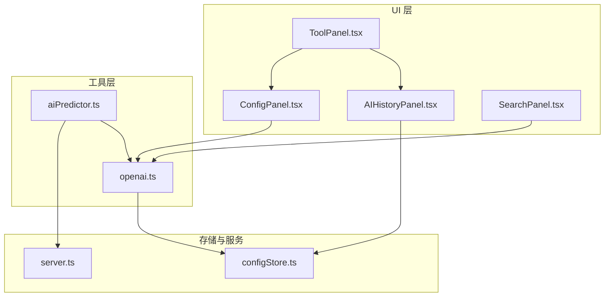
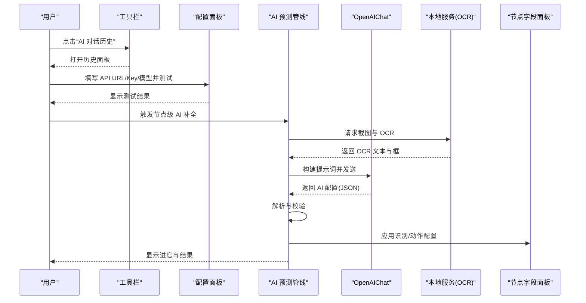
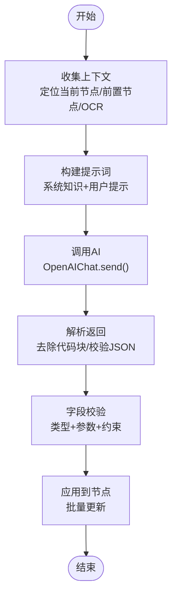
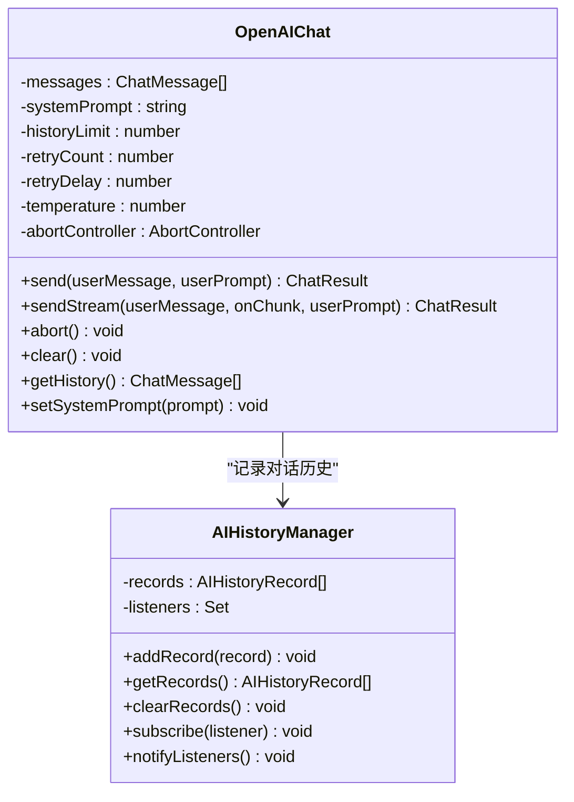
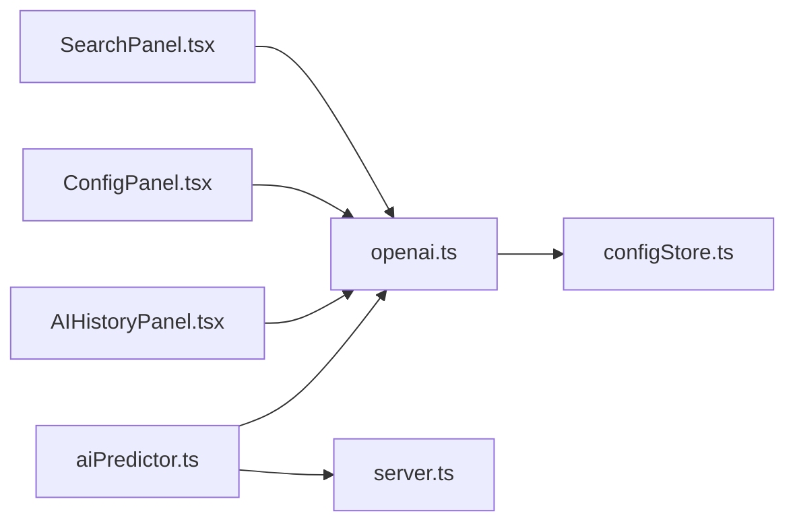

# AI 服务

<cite>
**本文引用的文件**
- [README.md](file://README.md)
- [AI 服务.md](file://docsite/docs/01.指南/05.本地服务/30.AI 服务.md)
- [aiPredictor.ts](file://src/utils/aiPredictor.ts)
- [openai.ts](file://src/utils/openai.ts)
- [AIHistoryPanel.tsx](file://src/components/panels/AIHistoryPanel.tsx)
- [ConfigPanel.tsx](file://src/components/panels/ConfigPanel.tsx)
- [ToolPanel.tsx](file://src/components/panels/ToolPanel.tsx)
- [SearchPanel.tsx](file://src/components/panels/SearchPanel.tsx)
- [configStore.ts](file://src/stores/configStore.ts)
- [server.ts](file://src/services/server.ts)
</cite>

## 目录
1. [简介](#简介)
2. [项目结构](#项目结构)
3. [核心组件](#核心组件)
4. [架构总览](#架构总览)
5. [详细组件分析](#详细组件分析)
6. [依赖分析](#依赖分析)
7. [性能考虑](#性能考虑)
8. [故障排查指南](#故障排查指南)
9. [结论](#结论)
10. [附录](#附录)

## 简介
本节面向“AI 服务”的使用与实现，聚焦于 MaaPipelineEditor（MPE）中的智能节点配置预测能力。AI 服务通过结合 OCR 识别结果、节点上下文与流程分析，自动推断节点的识别与动作配置，并提供历史记录与实时进度反馈，显著提升节点配置效率与一致性。

- 项目亮点中明确指出“智能节点搜索”“节点级 AI 补全”等能力，体现 AI 服务在编辑器中的定位与价值。
- 文档站指南章节对 AI 服务的配置步骤、使用方法、注意事项与最佳实践进行了系统说明。

**章节来源**
- file://README.md#L63-L67
- file://docsite/docs/01.指南/05.本地服务/30.AI 服务.md#L1-L37

## 项目结构
围绕 AI 服务的关键文件分布如下：
- 工具层
  - aiPredictor.ts：负责收集上下文、执行 OCR、构建提示词、调用 AI、解析与校验结果、应用预测到节点。
  - openai.ts：封装 OpenAI 兼容 API 的对话管理、历史记录、重试与流式响应。
- UI 层
  - AIHistoryPanel.tsx：展示 AI 对话历史，支持展开查看实际消息与错误详情。
  - ConfigPanel.tsx：提供 AI API 配置项（URL、Key、模型）与“测试连接”入口。
  - ToolPanel.tsx：全局工具栏中提供“AI 对话历史”入口。
  - SearchPanel.tsx：提供 AI 搜索节点的能力（与节点级补全互补）。
- 存储与服务
  - configStore.ts：集中管理 AI 配置与 UI 状态。
  - server.ts：本地服务（LocalBridge）的 WebSocket 通道，为 OCR 采集提供底层通信。

**图表来源**
- [ToolPanel.tsx](file://src/components/panels/ToolPanel.tsx#L90-L100)
- [ConfigPanel.tsx](file://src/components/panels/ConfigPanel.tsx#L422-L521)
- [AIHistoryPanel.tsx](file://src/components/panels/AIHistoryPanel.tsx#L82-L166)
- [SearchPanel.tsx](file://src/components/panels/SearchPanel.tsx#L161-L201)
- [aiPredictor.ts](file://src/utils/aiPredictor.ts#L529-L556)
- [openai.ts](file://src/utils/openai.ts#L169-L243)
- [configStore.ts](file://src/stores/configStore.ts#L23-L106)
- [server.ts](file://src/services/server.ts#L1-L304)

**章节来源**
- file://src/utils/aiPredictor.ts#L1-L120
- file://src/utils/openai.ts#L1-L120
- file://src/components/panels/ConfigPanel.tsx#L422-L521
- file://src/components/panels/AIHistoryPanel.tsx#L82-L166
- file://src/components/panels/ToolPanel.tsx#L90-L100
- file://src/components/panels/SearchPanel.tsx#L161-L201
- file://src/stores/configStore.ts#L23-L106
- file://src/services/server.ts#L1-L120

## 核心组件
- OpenAIChat（openai.ts）
  - 负责构建请求体、发送消息（含重试与取消）、维护对话历史、记录历史记录、支持流式与非流式两种模式。
- AI 预测管线（aiPredictor.ts）
  - 收集节点上下文（前置节点、连接类型、关键参数）、执行 OCR（截图+OCR）、构建提示词、调用 AI、解析与校验结果、应用到节点。
- 历史记录管理（openai.ts + AIHistoryPanel.tsx）
  - 全局历史记录管理器持久化记录每次对话的用户输入、实际消息、响应内容与错误信息；UI 面板支持展开查看与清空。
- 配置与触发（ConfigPanel.tsx + ToolPanel.tsx + SearchPanel.tsx）
  - 配置面板提供 API URL、Key、模型与“测试连接”；工具栏提供“AI 对话历史”入口；搜索面板提供节点级 AI 搜索。

**章节来源**
- file://src/utils/openai.ts#L90-L180
- file://src/utils/aiPredictor.ts#L529-L556
- file://src/components/panels/AIHistoryPanel.tsx#L82-L166
- file://src/components/panels/ConfigPanel.tsx#L422-L521
- file://src/components/panels/ToolPanel.tsx#L90-L100
- file://src/components/panels/SearchPanel.tsx#L161-L201

## 架构总览
AI 服务整体工作流分为“节点级 AI 补全”和“节点搜索 AI”两条主线，均依赖统一的 OpenAIChat 与历史记录管理。

**图表来源**
- [ToolPanel.tsx](file://src/components/panels/ToolPanel.tsx#L90-L100)
- [ConfigPanel.tsx](file://src/components/panels/ConfigPanel.tsx#L422-L521)
- [aiPredictor.ts](file://src/utils/aiPredictor.ts#L529-L556)
- [openai.ts](file://src/utils/openai.ts#L169-L243)
- [server.ts](file://src/services/server.ts#L1-L120)

## 详细组件分析

### 组件 A：AI 预测管线（aiPredictor.ts）
- 上下文收集
  - 从图数据中定位当前节点，提取识别与动作配置；遍历前置边，按连接类型（next/jump_back/on_error）归类；提取关键参数（如 expected、template、roi）。
- OCR 采集
  - 依赖 LocalBridge 的截图与 OCR 请求，设置超时与错误兜底，降级为无内容结果。
- 提示词构建
  - 系统知识：严格定义识别类型、动作类型、字段约束与默认值；用户提示词：节点名、前置节点、OCR 结果与推理要求。
- AI 调用与解析
  - 通过 OpenAIChat 发送提示词，解析返回的 JSON，去除 Markdown 代码块标记，校验字段完整性与有效性。
- 校验与应用
  - 识别类型校验：DirectHit 禁止参数；OCR/TemplateMatch/FeatureMatch/ColorMatch/NN 等分别校验专属字段与通用字段；动作类型校验：DoNothing 禁止参数。
  - 应用阶段：批量更新节点的 recognition/action 类型与参数。

**图表来源**
- [aiPredictor.ts](file://src/utils/aiPredictor.ts#L79-L169)
- [aiPredictor.ts](file://src/utils/aiPredictor.ts#L268-L522)
- [aiPredictor.ts](file://src/utils/aiPredictor.ts#L529-L556)
- [aiPredictor.ts](file://src/utils/aiPredictor.ts#L558-L710)
- [aiPredictor.ts](file://src/utils/aiPredictor.ts#L712-L782)

**章节来源**
- file://src/utils/aiPredictor.ts#L79-L169
- file://src/utils/aiPredictor.ts#L171-L262
- file://src/utils/aiPredictor.ts#L268-L522
- file://src/utils/aiPredictor.ts#L529-L556
- file://src/utils/aiPredictor.ts#L558-L710
- file://src/utils/aiPredictor.ts#L712-L782

### 组件 B：OpenAI 对话管理（openai.ts）
- 能力范围
  - 配置校验（URL/Key/模型）、构建请求体、发送消息（非流式与流式）、重试策略、取消请求、维护历史记录、全局历史记录管理器。
- 历史记录
  - 记录每次对话的用户输入、实际消息、响应内容、错误与时间戳；支持订阅变更与清空。
- 与配置存储联动
  - 从 configStore 读取 AI 配置，保证配置项一致性。

**图表来源**
- [openai.ts](file://src/utils/openai.ts#L90-L180)
- [openai.ts](file://src/utils/openai.ts#L181-L394)

**章节来源**
- file://src/utils/openai.ts#L90-L180
- file://src/utils/openai.ts#L181-L394

### 组件 C：历史记录面板（AIHistoryPanel.tsx）
- 功能
  - 展示历史记录列表，支持展开查看“实际消息”，标记成功/失败与是否包含提示词，提供清空与关闭入口。
- 数据来源
  - 订阅全局历史记录管理器，渲染最新记录。

**章节来源**
- file://src/components/panels/AIHistoryPanel.tsx#L82-L166

### 组件 D：配置面板（ConfigPanel.tsx）
- 功能
  - 提供 AI API URL、Key、模型名称输入项与“测试连接”按钮；测试通过后显示 AI 简短回复。
- 与 OpenAIChat 集成
  - 使用 OpenAIChat 实例进行一次性对话测试，验证配置可用性。

**章节来源**
- file://src/components/panels/ConfigPanel.tsx#L422-L521

### 组件 E：工具栏与节点搜索（ToolPanel.tsx + SearchPanel.tsx）
- 工具栏
  - 提供“AI 对话历史”入口，便于随时查看推理过程与错误信息。
- 节点搜索
  - 基于用户输入与节点上下文，调用 AI 生成节点 ID 并定位到对应节点，适合“智能节点搜索”。

**章节来源**
- file://src/components/panels/ToolPanel.tsx#L90-L100
- file://src/components/panels/SearchPanel.tsx#L161-L201

## 依赖分析
- 组件耦合
  - aiPredictor.ts 依赖 openai.ts（对话管理）、server.ts（OCR 采集）、configStore.ts（AI 配置）、flow store（节点数据）。
  - openai.ts 依赖 configStore.ts（读取配置）、AIHistoryPanel.tsx（历史记录 UI）。
  - UI 面板（ConfigPanel、AIHistoryPanel、ToolPanel、SearchPanel）通过 store 与工具层交互。
- 外部依赖
  - OpenAI 兼容 API（URL/Key/模型），浏览器 fetch 与 AbortController，LocalStorage（配置存储）。
- 潜在循环依赖
  - 未发现直接循环依赖；openai.ts 与 AIHistoryPanel.tsx 通过全局管理器解耦。

**图表来源**
- [aiPredictor.ts](file://src/utils/aiPredictor.ts#L1-L20)
- [openai.ts](file://src/utils/openai.ts#L1-L30)
- [server.ts](file://src/services/server.ts#L1-L60)
- [configStore.ts](file://src/stores/configStore.ts#L23-L106)
- [AIHistoryPanel.tsx](file://src/components/panels/AIHistoryPanel.tsx#L82-L166)
- [ConfigPanel.tsx](file://src/components/panels/ConfigPanel.tsx#L422-L521)
- [SearchPanel.tsx](file://src/components/panels/SearchPanel.tsx#L161-L201)

**章节来源**
- file://src/utils/aiPredictor.ts#L1-L20
- file://src/utils/openai.ts#L1-L30
- file://src/services/server.ts#L1-L60
- file://src/stores/configStore.ts#L23-L106

## 性能考虑
- 提示词长度与上下文
  - 提示词包含系统知识与用户提示，建议控制前置节点数量与 OCR 文本长度，避免超出模型上下文限制。
- 重试与超时
  - OpenAIChat 默认重试次数与延迟可调；OCR 截图与识别设置超时，避免阻塞 UI。
- 流式响应
  - 流式响应可改善用户体验，但需注意 UI 渲染频率与内存占用。
- 模型选择
  - 不同模型的生成质量与速度差异较大，建议在配置面板中按需选择。

[本节为通用指导，不涉及具体文件分析]

## 故障排查指南
- 常见问题与解决
  - 未连接本地服务或设备：确认 LocalBridge 已启动并连接设备，检查连接状态指示器。
  - AI API 配置缺失：在配置面板填写完整的 API URL、Key 与模型名称，并点击“测试连接”。
  - OCR 识别失败：检查 MaaFramework 路径、OCR 模型文件与设备画面清晰度；单独测试 OCR 功能。
  - CORS 跨域错误：使用支持 CORS 的 API 代理服务或更换支持 CORS 的提供商。
  - 预测结果不符合预期：查看 AI 对话历史了解推理依据，手动调整不准确字段；优化节点命名与前置节点配置。
- 定位手段
  - 打开“AI 对话历史”查看实际消息与错误详情；在配置面板“测试连接”验证 API 可用性；在工具栏“AI 对话历史”入口随时回顾。

**章节来源**
- file://docsite/docs/01.指南/05.本地服务/30.AI 服务.md#L157-L225
- file://src/components/panels/AIHistoryPanel.tsx#L82-L166
- file://src/components/panels/ConfigPanel.tsx#L422-L521

## 结论
AI 服务在 MPE 中通过“节点级 AI 补全”与“节点搜索 AI”两条路径，结合 OCR 与上下文分析，为用户提供高效、可追溯的智能配置体验。其核心在于：
- 严谨的提示词构建与字段校验，确保生成配置符合协议规范；
- 完整的历史记录与实时进度反馈，提升可解释性与可控性；
- 与本地服务与配置存储的紧密集成，保障端到端可用性。

[本节为总结性内容，不涉及具体文件分析]

## 附录
- 使用建议
  - 合理命名节点，使 AI 更易理解意图；
  - 保持流程连贯，前置节点配置越完整，后续预测越准确；
  - 确保 OCR 可用，模板图片需手动处理；
  - 验证预测结果，必要时手动调整。

**章节来源**
- file://docsite/docs/01.指南/05.本地服务/30.AI 服务.md#L110-L156