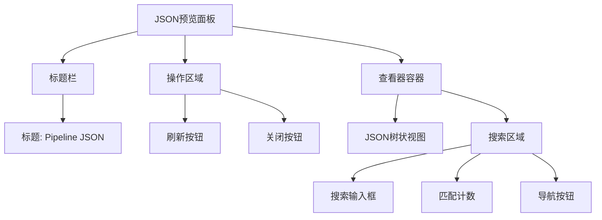
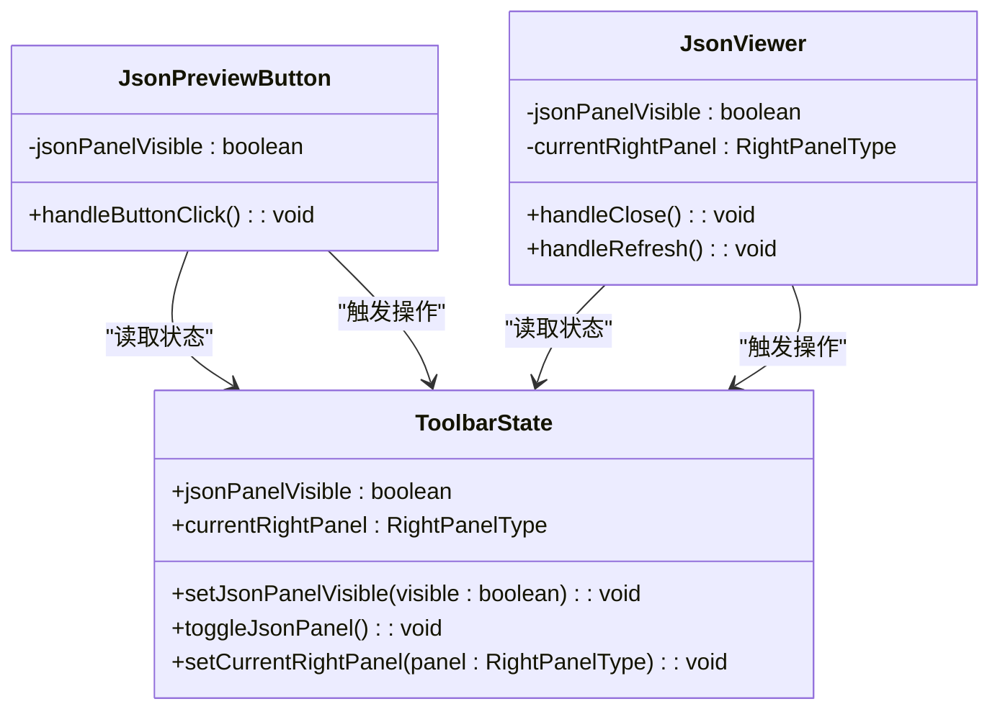
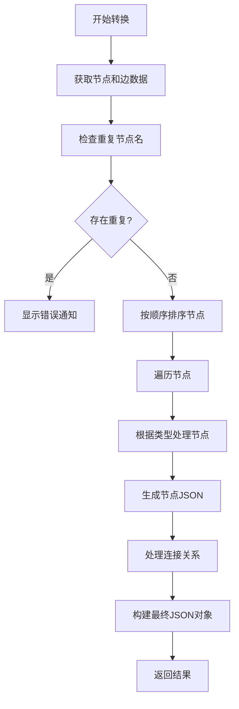
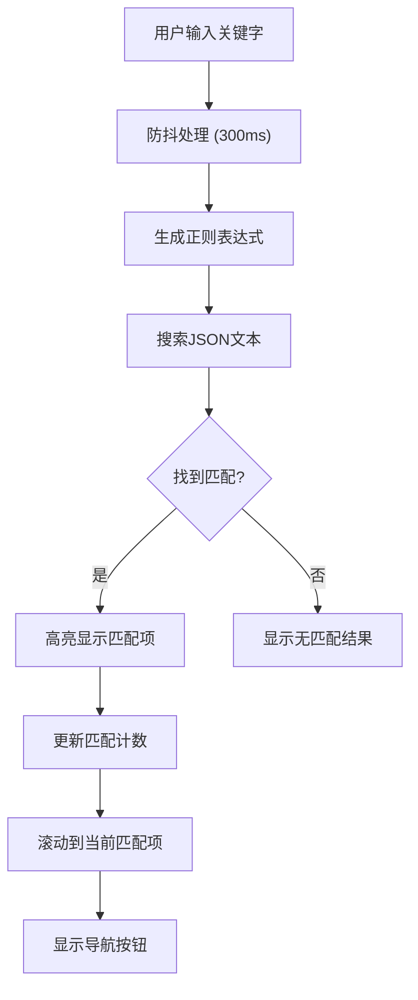
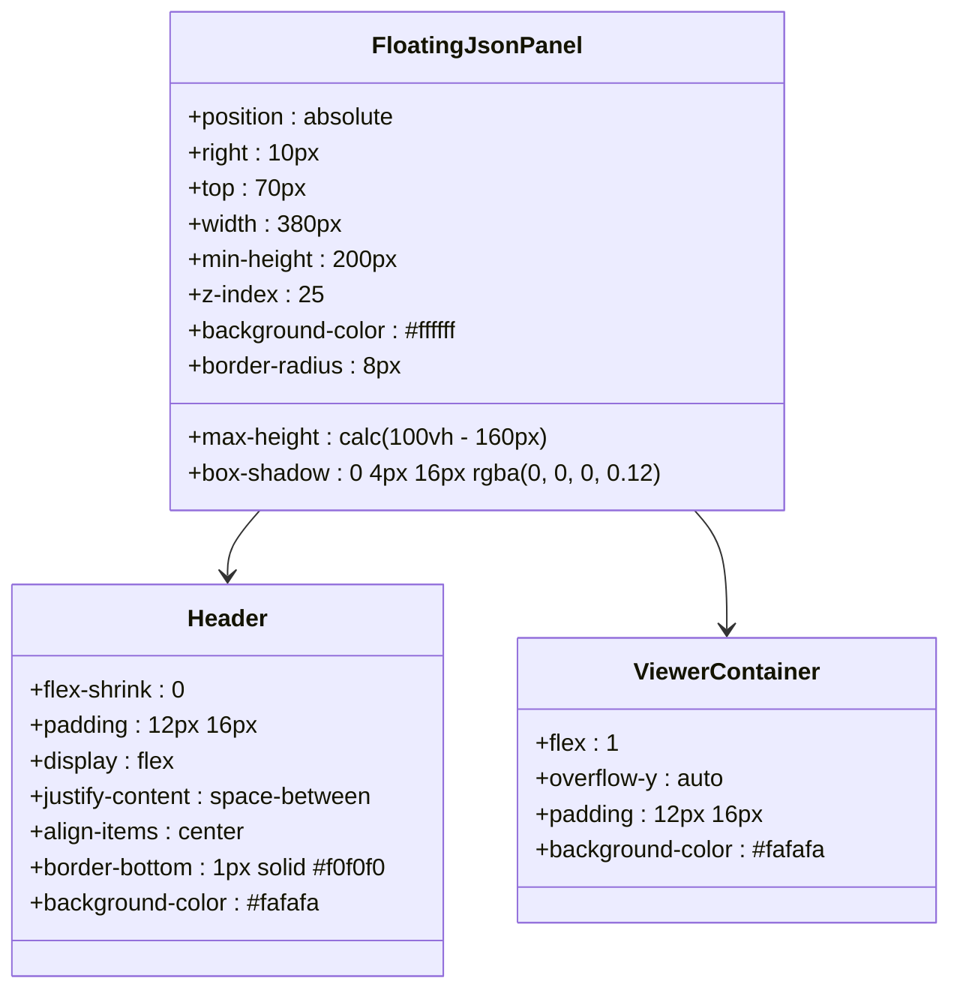
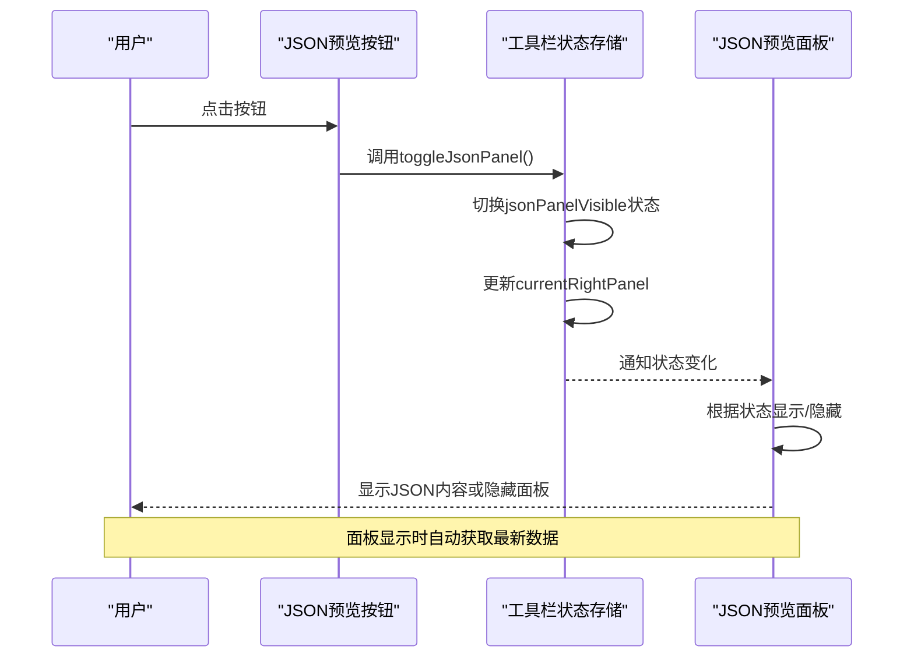
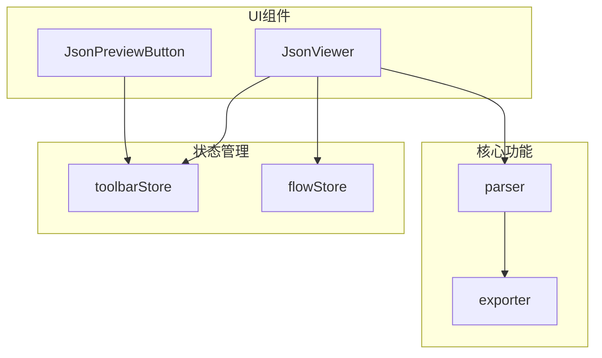

# JSON预览面板

<cite>
**本文档引用的文件**   
- [JsonViewer.tsx](file://src/components/JsonViewer.tsx)
- [JsonPreviewButton.tsx](file://src/components/panels/toolbar/JsonPreviewButton.tsx)
- [toolbarStore.ts](file://src/stores/toolbarStore.ts)
- [FloatingJsonPanel.module.less](file://src/styles/FloatingJsonPanel.module.less)
- [ToolbarPanel.module.less](file://src/styles/ToolbarPanel.module.less)
- [exporter.ts](file://src/core/parser/exporter.ts)
- [App.tsx](file://src/App.tsx)
</cite>

## 更新摘要
**变更内容**   
- 新增实时关键字搜索功能，支持键名和值的搜索
- 实现语法高亮显示，突出显示匹配的关键字
- 添加匹配结果导航，支持上一个/下一个匹配项跳转
- 优化搜索性能，使用防抖机制减少不必要的计算
- 增强用户体验，提供匹配计数和滚动定位功能

## 目录
1. [简介](#简介)
2. [核心功能](#核心功能)
3. [用户界面](#用户界面)
4. [状态管理](#状态管理)
5. [数据转换机制](#数据转换机制)
6. [搜索与高亮功能](#搜索与高亮功能)
7. [样式与布局](#样式与布局)
8. [交互流程](#交互流程)
9. [错误处理](#错误处理)
10. [集成与依赖](#集成与依赖)

## 简介

JSON预览面板是MaaPipelineEditor中的一个核心功能组件，为用户提供了一个实时查看和验证工作流配置的可视化界面。该面板通过将图形化编辑器中的节点和连接转换为标准的JSON格式，使用户能够直接查看底层数据结构，确保配置的准确性和完整性。

该功能主要服务于高级用户和开发者，帮助他们理解系统如何将可视化操作转换为可执行的配置文件。通过JSON预览，用户可以验证复杂的节点关系、检查配置参数，并在导出前确认数据结构的正确性。

**Section sources**
- [JsonViewer.tsx](file://src/components/JsonViewer.tsx#L1-L113)
- [App.tsx](file://src/App.tsx#L242)

## 核心功能

JSON预览面板提供了多项关键功能，包括实时数据预览、手动刷新机制、自动状态同步和强大的搜索高亮功能。面板能够实时将当前工作流中的所有节点和边转换为JSON对象，并以树状结构展示给用户。

面板支持手动刷新功能，允许用户在修改配置后主动触发数据更新，确保显示内容与当前编辑状态完全一致。此外，系统实现了智能的状态管理机制，当其他面板（如节点字段面板或边面板）被激活时，JSON预览面板会自动隐藏，避免界面混乱。

**Section sources**
- [JsonViewer.tsx](file://src/components/JsonViewer.tsx#L42-L112)
- [toolbarStore.ts](file://src/stores/toolbarStore.ts#L27-L42)

## 用户界面

JSON预览面板采用浮动式设计，固定在界面右上角，确保不会遮挡主要的工作区。面板包含清晰的标题栏和操作按钮，提供良好的用户体验。

**Diagram sources**
- [JsonViewer.tsx](file://src/components/JsonViewer.tsx#L200-L276)
- [FloatingJsonPanel.module.less](file://src/styles/FloatingJsonPanel.module.less#L31-L52)

## 状态管理

JSON预览面板的状态由全局的工具栏状态管理器统一控制。系统使用Zustand库创建了一个集中式的状态存储，管理面板的显示状态和当前激活的右侧面板类型。

**Diagram sources**
- [toolbarStore.ts](file://src/stores/toolbarStore.ts#L26-L124)
- [JsonViewer.tsx](file://src/components/JsonViewer.tsx#L113-L118)
- [JsonPreviewButton.tsx](file://src/components/panels/toolbar/JsonPreviewButton.tsx#L12-L17)

## 数据转换机制

JSON预览面板的核心是将图形化工作流转换为标准JSON格式的机制。这一过程通过`flowToPipeline`函数实现，该函数遍历所有节点和边，按照预定义的规则生成对应的JSON对象。

转换过程包括节点排序、类型识别、属性提取和连接关系构建等步骤。系统会根据节点类型（如Pipeline、External、Anchor）分别处理，并将特殊标记（如配置标记、外部标记）正确地应用到输出的JSON中。

**Diagram sources**
- [exporter.ts](file://src/core/parser/exporter.ts#L37-L187)
- [JsonViewer.tsx](file://src/components/JsonViewer.tsx#L170-L175)

## 搜索与高亮功能

**更新** 新增了强大的搜索和高亮功能，显著提升了JSON内容的可读性和查找效率。

JSON预览面板集成了实时关键字搜索系统，支持对键名和值进行高亮显示。用户可以在搜索框中输入关键字，面板会立即显示匹配结果并进行语法高亮。

### 搜索功能特性

- **实时搜索**：输入关键字后立即触发搜索，支持防抖优化（300ms延迟）
- **大小写不敏感**：搜索时不区分大小写，提高查找便利性
- **正则表达式支持**：使用JavaScript正则表达式引擎进行精确匹配
- **转义处理**：自动处理特殊字符的转义，确保搜索准确性

### 高亮显示机制

- **语法高亮**：匹配的关键字使用黄色背景高亮显示
- **当前匹配项**：当前选中的匹配项使用橙色背景突出显示
- **滚动定位**：自动滚动到当前匹配项位置，便于快速定位
- **文本渲染**：使用等宽字体和合适的行间距提升可读性

### 匹配导航系统

- **匹配计数**：显示总匹配数量和当前位置信息
- **循环导航**：支持上一个和下一个匹配项的循环跳转
- **键盘快捷键**：支持使用方向键进行快速导航
- **视觉反馈**：提供清晰的导航状态指示

**Diagram sources**
- [JsonViewer.tsx](file://src/components/JsonViewer.tsx#L138-L157)
- [JsonViewer.tsx](file://src/components/JsonViewer.tsx#L36-L90)

**Section sources**
- [JsonViewer.tsx](file://src/components/JsonViewer.tsx#L124-L157)
- [JsonViewer.tsx](file://src/components/JsonViewer.tsx#L36-L90)
- [FloatingJsonPanel.module.less](file://src/styles/FloatingJsonPanel.module.less#L99-L118)

## 样式与布局

JSON预览面板的样式设计注重美观性和实用性，采用现代化的UI设计原则。面板具有圆角边框、阴影效果和流畅的动画过渡，提升了整体的视觉体验。

**Diagram sources**
- [FloatingJsonPanel.module.less](file://src/styles/FloatingJsonPanel.module.less#L4-L73)
- [JsonViewer.tsx](file://src/components/JsonViewer.tsx#L200-L276)

## 交互流程

JSON预览面板的交互流程设计简洁直观，用户可以通过工具栏上的"JSON 预览"按钮来控制面板的显示和隐藏。点击按钮会触发状态切换，面板会以平滑的动画效果出现或消失。

**Diagram sources**
- [JsonPreviewButton.tsx](file://src/components/panels/toolbar/JsonPreviewButton.tsx#L15-L17)
- [toolbarStore.ts](file://src/stores/toolbarStore.ts#L98-L105)
- [JsonViewer.tsx](file://src/components/JsonViewer.tsx#L113-L118)

## 错误处理

JSON预览面板实现了完善的错误处理机制，确保在数据转换过程中出现问题时能够及时反馈给用户。系统会检查节点名称重复等常见错误，并在发现时显示相应的错误通知。

当JSON转换过程发生异常时，系统会捕获错误并显示通用的错误消息，同时在控制台输出详细的错误信息供开发者调试。这种分层的错误处理策略既保护了普通用户免受技术细节的困扰，又为开发者提供了必要的调试信息。

**Section sources**
- [exporter.ts](file://src/core/parser/exporter.ts#L42-L53)
- [exporter.ts](file://src/core/parser/exporter.ts#L194-L202)

## 集成与依赖

JSON预览面板与其他系统组件紧密集成，依赖于多个核心模块来实现其功能。面板通过状态管理器与应用程序的其他部分通信，并使用专门的解析器将工作流数据转换为JSON格式。

**Diagram sources**
- [App.tsx](file://src/App.tsx#L25-L26)
- [JsonViewer.tsx](file://src/components/JsonViewer.tsx#L23-L29)
- [toolbarStore.ts](file://src/stores/toolbarStore.ts#L26-L124)