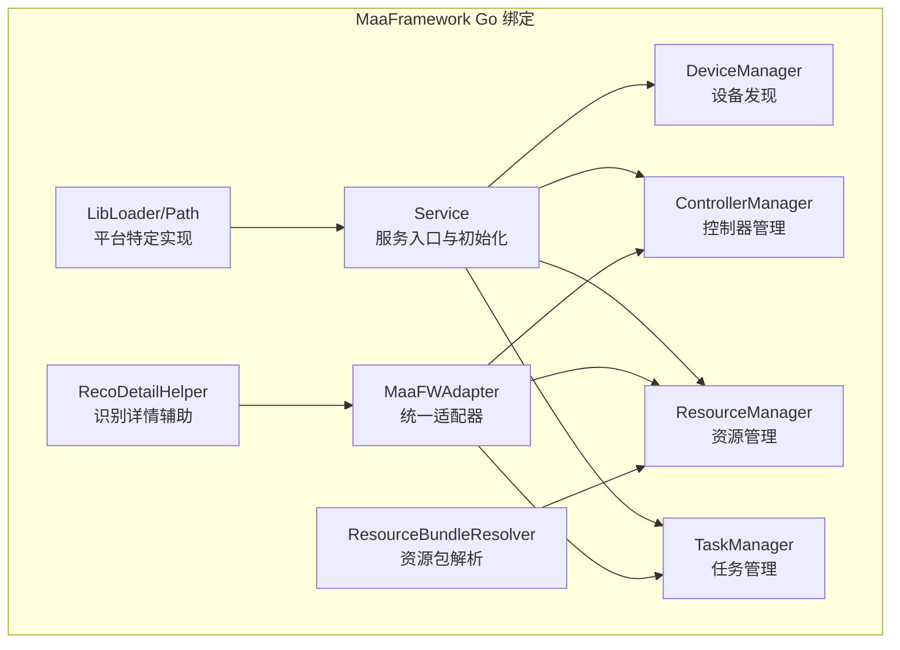
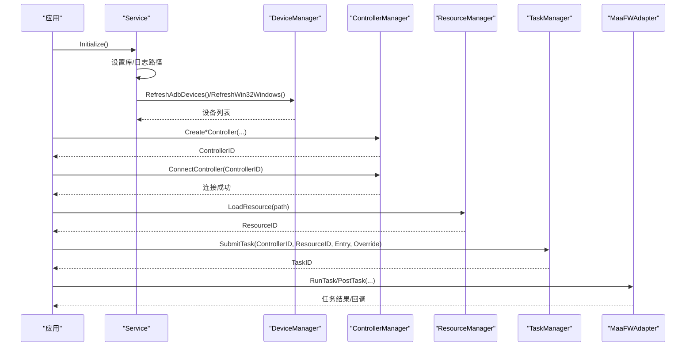
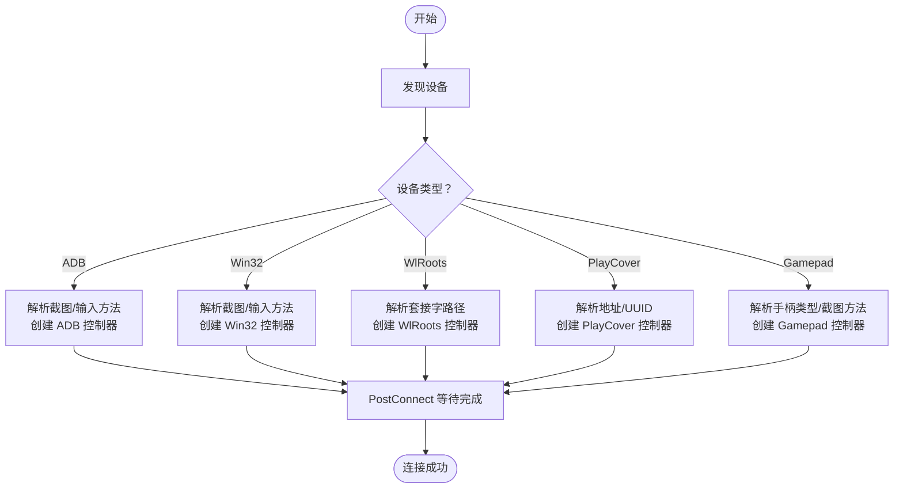
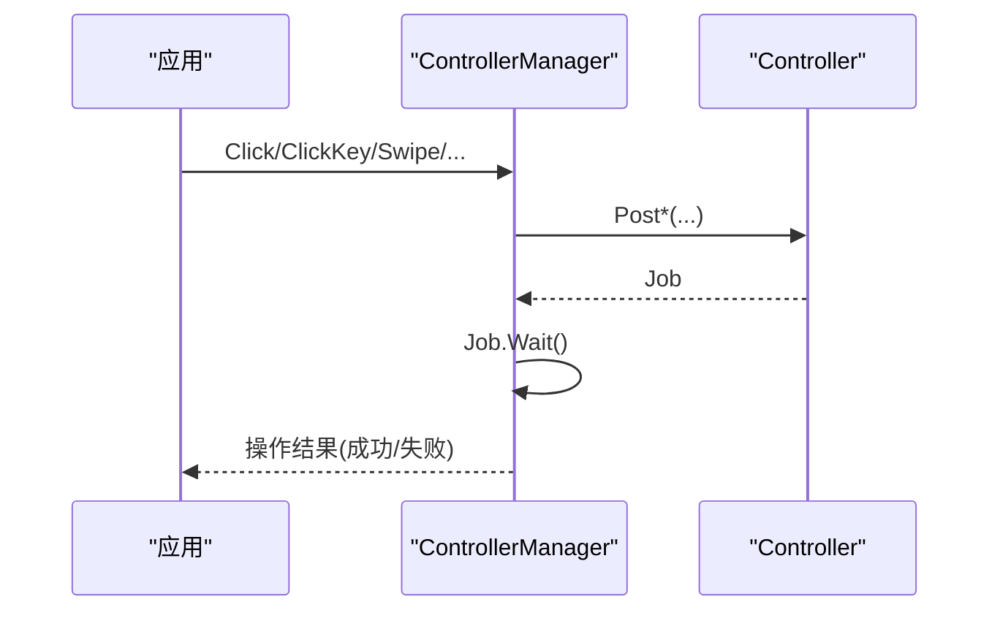
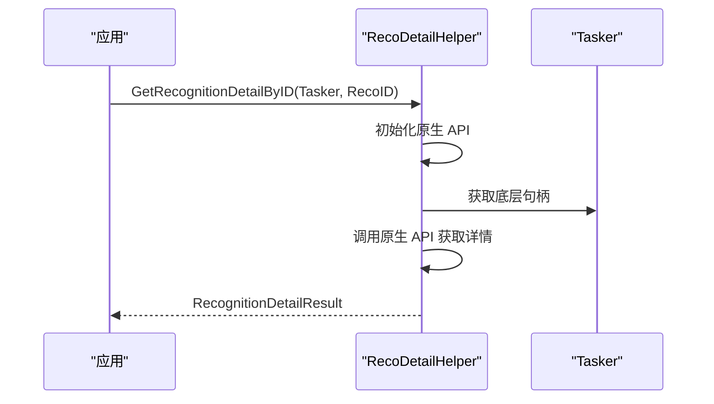
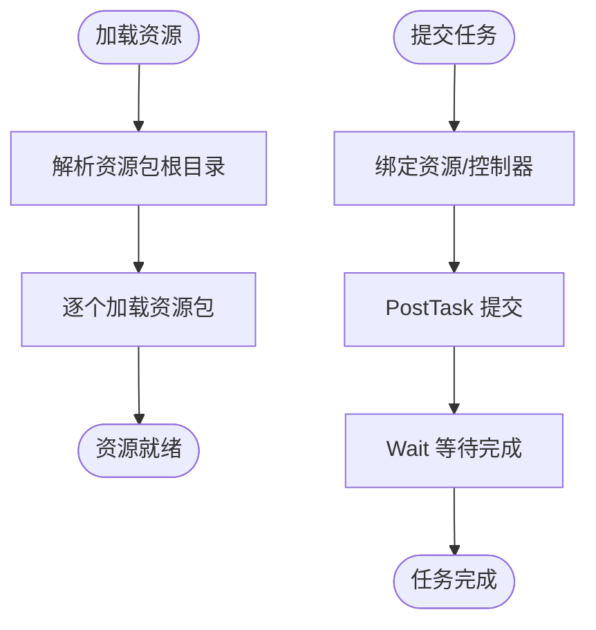
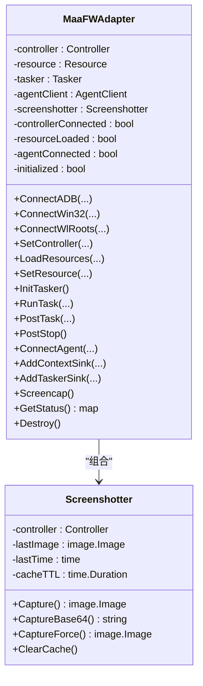
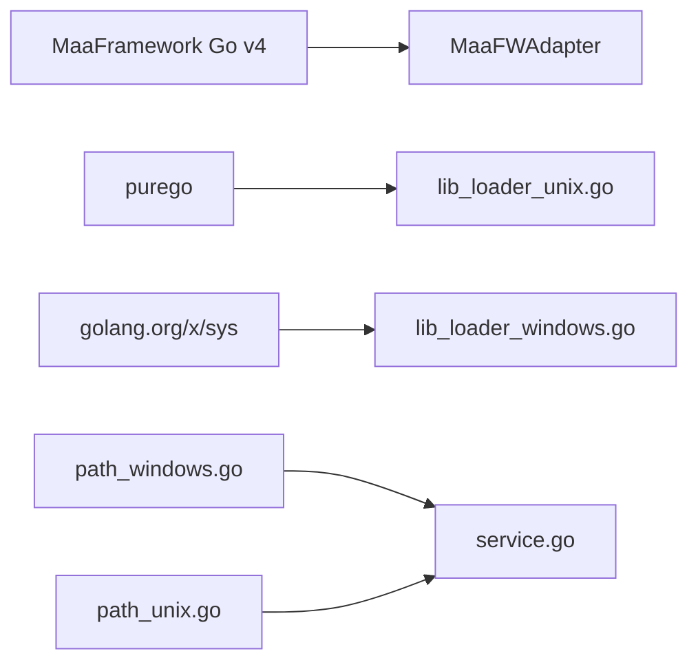

# MaaFramework Go 绑定

<cite>
**本文引用的文件**
- [types.go](file://LocalBridge/internal/mfw/types.go)
- [service.go](file://LocalBridge/internal/mfw/service.go)
- [device_manager.go](file://LocalBridge/internal/mfw/device_manager.go)
- [controller_manager.go](file://LocalBridge/internal/mfw/controller_manager.go)
- [task_manager.go](file://LocalBridge/internal/mfw/task_manager.go)
- [resource_manager.go](file://LocalBridge/internal/mfw/resource_manager.go)
- [adapter.go](file://LocalBridge/internal/mfw/adapter.go)
- [reco_detail_helper.go](file://LocalBridge/internal/mfw/reco_detail_helper.go)
- [resource_bundle_resolver.go](file://LocalBridge/internal/mfw/resource_bundle_resolver.go)
- [lib_loader_windows.go](file://LocalBridge/internal/mfw/lib_loader_windows.go)
- [lib_loader_unix.go](file://LocalBridge/internal/mfw/lib_loader_unix.go)
- [path_windows.go](file://LocalBridge/internal/mfw/path_windows.go)
- [path_unix.go](file://LocalBridge/internal/mfw/path_unix.go)
- [error.go](file://LocalBridge/internal/mfw/error.go)
- [go.mod](file://LocalBridge/go.mod)
</cite>

## 目录
1. [简介](#简介)
2. [项目结构](#项目结构)
3. [核心组件](#核心组件)
4. [架构总览](#架构总览)
5. [详细组件分析](#详细组件分析)
6. [依赖分析](#依赖分析)
7. [性能考虑](#性能考虑)
8. [故障排查指南](#故障排查指南)
9. [结论](#结论)
10. [附录](#附录)

## 简介
本文件为 MaaFramework Go 绑定的权威技术文档，面向希望在 Go 语言环境中使用 MaaFramework 的开发者。文档覆盖以下主题：
- 架构设计与模块职责
- 上下文与适配器模式
- 控制器接口与多平台设备支持（ADB、Win32、WlRoots、手柄）
- 识别引擎与识别详情辅助能力
- 资源管理与任务执行
- 设备发现与连接机制
- 异步操作、回调与错误处理
- API 使用示例与集成指导

## 项目结构
LocalBridge 内部的 mfw 包提供了对 MaaFramework Go v4 的封装与管理，主要文件组织如下：
- 类型与常量定义：types.go
- 服务入口与初始化：service.go
- 设备管理：device_manager.go
- 控制器管理：controller_manager.go
- 资源管理：resource_manager.go
- 任务管理：task_manager.go
- 统一适配器：adapter.go
- 识别详情辅助：reco_detail_helper.go
- 资源包解析与加载：resource_bundle_resolver.go
- 平台特定实现：lib_loader_*、path_* 文件
- 错误与常量：error.go
- 依赖声明：go.mod

图表来源
- [service.go:15-34](file://LocalBridge/internal/mfw/service.go#L15-L34)
- [device_manager.go:11-25](file://LocalBridge/internal/mfw/device_manager.go#L11-L25)
- [controller_manager.go:20-31](file://LocalBridge/internal/mfw/controller_manager.go#L20-L31)
- [resource_manager.go:11-22](file://LocalBridge/internal/mfw/resource_manager.go#L11-L22)
- [task_manager.go:11-22](file://LocalBridge/internal/mfw/task_manager.go#L11-L22)
- [adapter.go:25-60](file://LocalBridge/internal/mfw/adapter.go#L25-L60)
- [reco_detail_helper.go:168-267](file://LocalBridge/internal/mfw/reco_detail_helper.go#L168-L267)
- [resource_bundle_resolver.go:105-205](file://LocalBridge/internal/mfw/resource_bundle_resolver.go#L105-L205)

章节来源
- [service.go:15-34](file://LocalBridge/internal/mfw/service.go#L15-L34)
- [go.mod:5-16](file://LocalBridge/go.mod#L5-L16)

## 核心组件
- 服务管理器 Service：负责框架初始化、重载与关闭，聚合设备、控制器、资源、任务管理器。
- 设备管理器 DeviceManager：提供 ADB、Win32、WlRoots 等设备的发现与列举。
- 控制器管理器 ControllerManager：创建/连接/断开控制器，执行点击、滑动、输入、截图等操作，支持手柄按键与触摸。
- 资源管理器 ResourceManager：加载/卸载资源，支持资源包解析与哈希获取。
- 任务管理器 TaskManager：提交/停止任务，维护任务状态。
- 统一适配器 MaaFWAdapter：对外暴露简化的 API，封装控制器、资源、任务、Agent 的生命周期与事件回调。
- 识别详情辅助 RecoDetailHelper：通过原生 API 获取识别名称、算法、框选区域、原始图像与绘制图像列表。
- 资源包解析器 ResourceBundleResolver：自动解析资源包根目录，支持多种策略与诊断输出。

章节来源
- [service.go:15-218](file://LocalBridge/internal/mfw/service.go#L15-L218)
- [device_manager.go:11-136](file://LocalBridge/internal/mfw/device_manager.go#L11-L136)
- [controller_manager.go:20-800](file://LocalBridge/internal/mfw/controller_manager.go#L20-L800)
- [resource_manager.go:11-118](file://LocalBridge/internal/mfw/resource_manager.go#L11-L118)
- [task_manager.go:11-114](file://LocalBridge/internal/mfw/task_manager.go#L11-L114)
- [adapter.go:25-999](file://LocalBridge/internal/mfw/adapter.go#L25-L999)
- [reco_detail_helper.go:168-345](file://LocalBridge/internal/mfw/reco_detail_helper.go#L168-L345)
- [resource_bundle_resolver.go:105-368](file://LocalBridge/internal/mfw/resource_bundle_resolver.go#L105-L368)

## 架构总览
MaaFramework Go 绑定采用“服务聚合 + 统一适配器”的架构：
- Service 作为全局入口，协调各子系统；在初始化阶段设置库路径、日志路径、保存绘图与调试模式。
- DeviceManager 通过 MaaFramework API 列举设备；ControllerManager 负责控制器生命周期与操作。
- MaaFWAdapter 将控制器、资源、任务、Agent 的复杂性封装，提供简洁的 API 与事件回调。
- ResourceManager 与 ResourceBundleResolver 负责资源加载与路径解析。
- RecoDetailHelper 通过原生 API 访问底层细节，便于调试与可视化。

图表来源
- [service.go:36-138](file://LocalBridge/internal/mfw/service.go#L36-L138)
- [device_manager.go:27-96](file://LocalBridge/internal/mfw/device_manager.go#L27-L96)
- [controller_manager.go:33-329](file://LocalBridge/internal/mfw/controller_manager.go#L33-L329)
- [resource_manager.go:24-65](file://LocalBridge/internal/mfw/resource_manager.go#L24-L65)
- [task_manager.go:24-53](file://LocalBridge/internal/mfw/task_manager.go#L24-L53)
- [adapter.go:515-567](file://LocalBridge/internal/mfw/adapter.go#L515-L567)

## 详细组件分析

### 设备发现与连接机制
- ADB 设备：通过 FindAdbDevices 获取设备列表，支持多种截图与输入方法枚举，创建控制器时可组合多种方法。
- Win32 窗口：通过 FindDesktopWindows 获取窗口列表，支持多种截图与输入方法映射，含伪最小化变体。
- WlRoots：通过窗口信息推导套接字路径，创建控制器进行连接。
- PlayCover：在 macOS 上通过地址与 UUID 创建控制器。
- 手柄：支持 Xbox360 与 DualShock4 类型，可结合截图方法与可选窗口句柄。

图表来源
- [device_manager.go:27-121](file://LocalBridge/internal/mfw/device_manager.go#L27-L121)
- [controller_manager.go:33-276](file://LocalBridge/internal/mfw/controller_manager.go#L33-L276)

章节来源
- [device_manager.go:27-121](file://LocalBridge/internal/mfw/device_manager.go#L27-L121)
- [controller_manager.go:33-276](file://LocalBridge/internal/mfw/controller_manager.go#L33-L276)

### 控制器接口与操作
- 支持的操作类型：点击、滑动、输入文本、启动/停止应用、按键、触控、滚动、截图、Shell 等。
- 操作均以 Job 形式异步提交，支持 Wait 同步等待与 Success/Status 判断。
- 截图支持目标长/短边缩放、原始尺寸与缓存策略。
- 手柄支持按键点击与触摸（按下/移动/抬起）。

图表来源
- [controller_manager.go:365-800](file://LocalBridge/internal/mfw/controller_manager.go#L365-L800)

章节来源
- [controller_manager.go:365-800](file://LocalBridge/internal/mfw/controller_manager.go#L365-L800)

### 识别引擎与识别详情辅助
- 通过原生 API 获取识别详情：名称、算法、命中状态、框选区域、原始图像与绘制图像列表。
- 使用 purego 动态加载 MaaFramework 库函数，跨平台兼容。
- 结果以结构化形式返回，便于前端或调试工具展示。

图表来源
- [reco_detail_helper.go:85-267](file://LocalBridge/internal/mfw/reco_detail_helper.go#L85-L267)

章节来源
- [reco_detail_helper.go:85-267](file://LocalBridge/internal/mfw/reco_detail_helper.go#L85-L267)

### 资源管理与任务执行
- 资源加载：支持单个/多个资源路径，自动解析资源包根目录，支持进度回调。
- 任务提交：创建 Tasker，绑定资源与控制器，提交任务并等待完成或异步获取结果。
- 停止任务：支持主动停止当前任务。

图表来源
- [resource_manager.go:24-65](file://LocalBridge/internal/mfw/resource_manager.go#L24-L65)
- [adapter.go:452-567](file://LocalBridge/internal/mfw/adapter.go#L452-L567)

章节来源
- [resource_manager.go:24-65](file://LocalBridge/internal/mfw/resource_manager.go#L24-L65)
- [adapter.go:452-567](file://LocalBridge/internal/mfw/adapter.go#L452-L567)

### 统一适配器 MaaFWAdapter
- 生命周期管理：控制器、资源、Tasker、Agent 的创建、绑定、销毁与所有权标记。
- 事件回调：支持添加/移除上下文事件与 Tasker 事件监听器。
- 截图缓存：内置 Screenshotter，支持 TTL 缓存与强制刷新。
- 状态查询：提供当前连接状态、设备类型、资源加载状态等摘要。

图表来源
- [adapter.go:25-999](file://LocalBridge/internal/mfw/adapter.go#L25-L999)

章节来源
- [adapter.go:25-999](file://LocalBridge/internal/mfw/adapter.go#L25-L999)

### 错误处理与状态监控
- 定义统一错误码与错误类型，便于上层捕获与分类处理。
- 控制器/资源/任务/设备等常见错误场景均有明确返回。
- 适配器与管理器内部广泛使用锁保护并发安全。

章节来源
- [error.go:5-53](file://LocalBridge/internal/mfw/error.go#L5-L53)
- [controller_manager.go:278-329](file://LocalBridge/internal/mfw/controller_manager.go#L278-L329)
- [resource_manager.go:80-99](file://LocalBridge/internal/mfw/resource_manager.go#L80-L99)
- [task_manager.go:68-90](file://LocalBridge/internal/mfw/task_manager.go#L68-L90)

## 依赖分析
- 核心依赖：MaaFramework Go v4（github.com/MaaXYZ/maa-framework-go/v4）
- 平台工具：purego（非 Windows）、golang.org/x/sys（Windows）
- 其他：uuid、websocket、logrus、viper、cobra 等（用于桥接与配置）

图表来源
- [go.mod:5-16](file://LocalBridge/go.mod#L5-L16)
- [lib_loader_unix.go:11-18](file://LocalBridge/internal/mfw/lib_loader_unix.go#L11-L18)
- [lib_loader_windows.go:11-20](file://LocalBridge/internal/mfw/lib_loader_windows.go#L11-L20)
- [path_windows.go:22-56](file://LocalBridge/internal/mfw/path_windows.go#L22-L56)
- [path_unix.go:17-21](file://LocalBridge/internal/mfw/path_unix.go#L17-L21)

章节来源
- [go.mod:5-16](file://LocalBridge/go.mod#L5-L16)

## 性能考虑
- 截图缓存：Screenshotter 默认缓存 100ms，减少频繁截图带来的性能开销；可通过 SetCacheTTL 调整。
- 连接超时：控制器连接等待最多 10 秒，避免阻塞；建议在业务侧设置更合适的超时策略。
- 资源加载：支持按路径列表批量加载与进度回调，建议在大资源包场景分批加载并记录日志。
- 平台路径处理：Windows 非 ASCII 路径优先转换为短路径，否则切换工作目录；避免中文路径导致的库加载问题。

## 故障排查指南
- 初始化失败：检查库路径与日志路径配置，确认 Windows 非 ASCII 路径已转换或工作目录切换成功。
- 控制器连接失败：确认设备可用、方法组合正确、权限足够；查看连接 Job 的状态与错误信息。
- 资源加载失败：使用 CheckResourceBundles 预检资源包，定位具体失败项；核对 bundle 根目录与子目录结构。
- 识别详情为空：确认已启用原生 API 初始化，且 Tasker 句柄有效；检查识别 ID 是否正确。
- 并发访问：确保在多线程环境下使用适配器与管理器时遵循读写锁语义，避免竞态。

章节来源
- [service.go:36-138](file://LocalBridge/internal/mfw/service.go#L36-L138)
- [controller_manager.go:278-329](file://LocalBridge/internal/mfw/controller_manager.go#L278-L329)
- [resource_bundle_resolver.go:207-234](file://LocalBridge/internal/mfw/resource_bundle_resolver.go#L207-L234)
- [reco_detail_helper.go:85-129](file://LocalBridge/internal/mfw/reco_detail_helper.go#L85-L129)

## 结论
MaaFramework Go 绑定通过清晰的模块划分与统一适配器，为多平台自动化与识别任务提供了稳定、易用的 Go 生态集成方案。开发者可基于 Service/Adapter 快速完成设备发现、控制器连接、资源加载与任务执行，并借助识别详情辅助与资源包解析能力提升调试效率与可维护性。

## 附录

### API 使用示例与集成指导
- 初始化与重载
  - 使用 Service.Initialize() 完成框架初始化；如需重载，调用 Reload()。
  - 参考路径：[service.go:36-138](file://LocalBridge/internal/mfw/service.go#L36-L138)
- 设备发现
  - ADB：调用 DeviceManager.RefreshAdbDevices() 获取设备列表。
  - Win32：调用 DeviceManager.RefreshWin32Windows() 获取窗口列表。
  - 参考路径：[device_manager.go:27-96](file://LocalBridge/internal/mfw/device_manager.go#L27-L96)
- 控制器创建与连接
  - ADB/Win32/WlRoots/PlayCover/Gamepad：分别调用对应创建方法，再调用 ConnectController。
  - 参考路径：[controller_manager.go:33-329](file://LocalBridge/internal/mfw/controller_manager.go#L33-L329)
- 资源加载
  - 单个/多个资源：调用 ResourceManager.LoadResource/LoadResourcesWithProgress。
  - 参考路径：[resource_manager.go:24-65](file://LocalBridge/internal/mfw/resource_manager.go#L24-L65)
- 任务执行
  - 同步：Adapter.RunTask(entry, override...)。
  - 异步：Adapter.PostTask(...) 获取 Job，后续 Wait/Success/Status。
  - 参考路径：[adapter.go:515-567](file://LocalBridge/internal/mfw/adapter.go#L515-L567)
- 识别详情
  - 通过 RecoDetailHelper.GetRecognitionDetailByID 获取识别详情。
  - 参考路径：[reco_detail_helper.go:168-267](file://LocalBridge/internal/mfw/reco_detail_helper.go#L168-L267)
- 截图
  - Adapter.Screencap()/ScreencapImage() 或 Screenshotter.Capture/CaptureBase64。
  - 参考路径：[adapter.go:823-831](file://LocalBridge/internal/mfw/adapter.go#L823-L831)，[adapter.go:967-982](file://LocalBridge/internal/mfw/adapter.go#L967-L982)