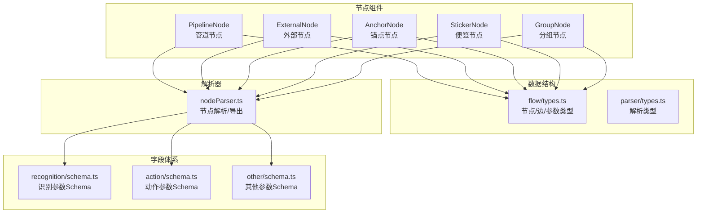
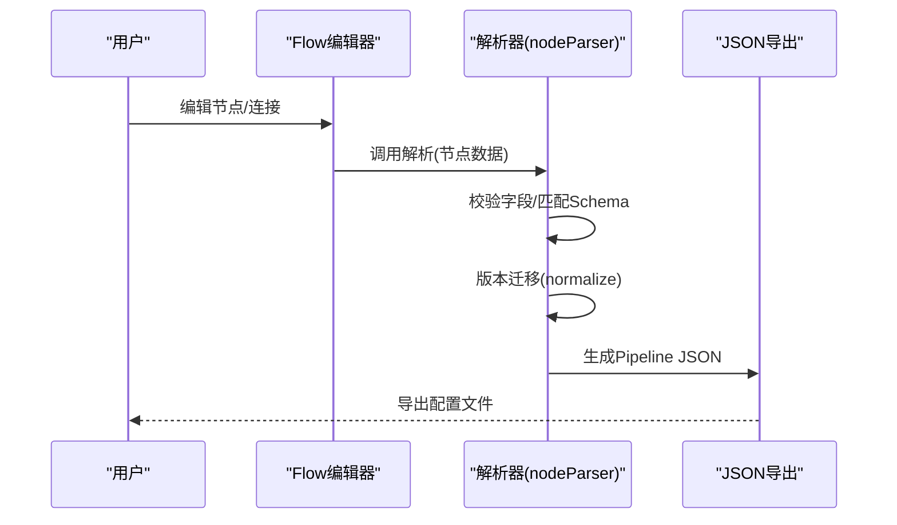
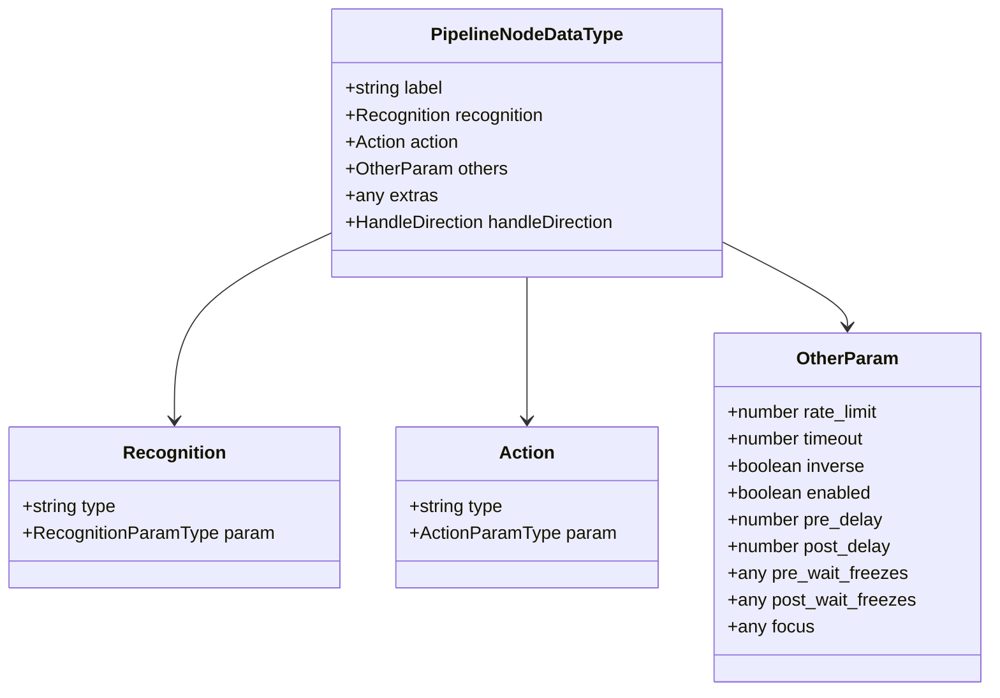
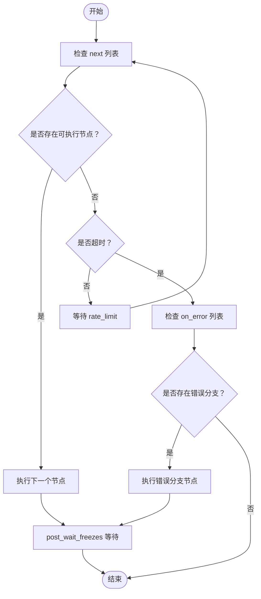
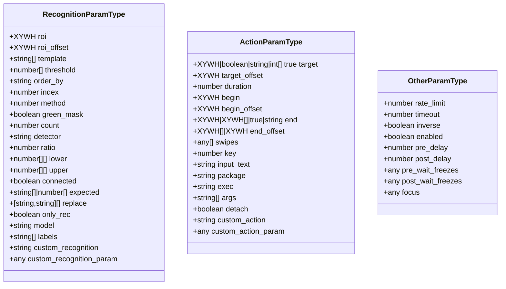
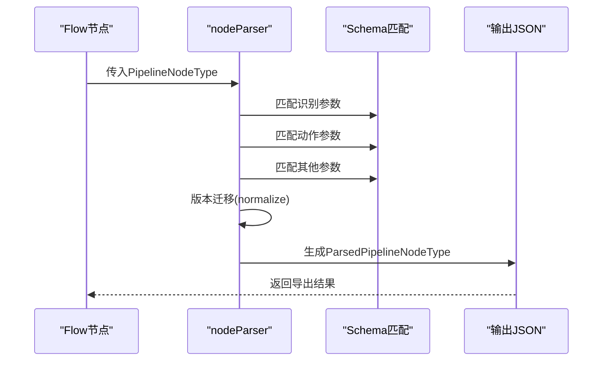
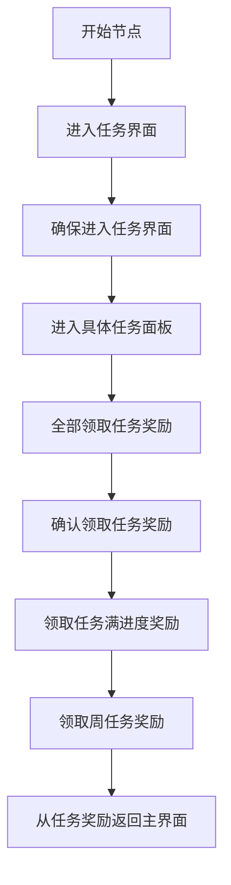
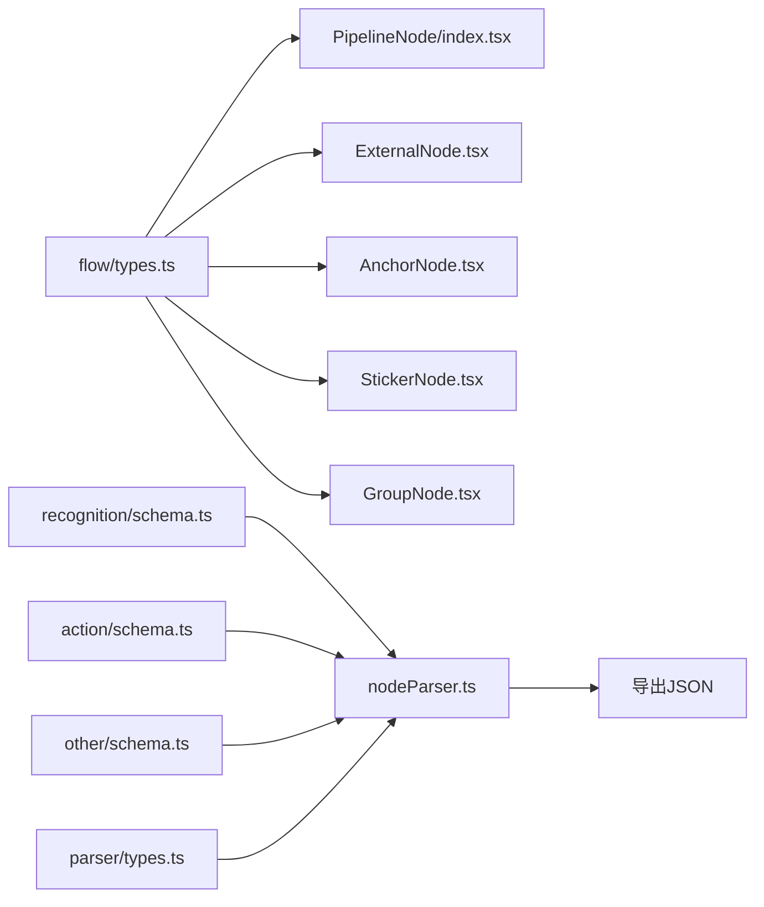

# MaaFramework Pipeline协议

<cite>
**本文档引用的文件**
- [PipelineNode/index.tsx](file://src/components/flow/nodes/PipelineNode/index.tsx)
- [ExternalNode.tsx](file://src/components/flow/nodes/ExternalNode.tsx)
- [AnchorNode.tsx](file://src/components/flow/nodes/AnchorNode.tsx)
- [StickerNode.tsx](file://src/components/flow/nodes/StickerNode.tsx)
- [GroupNode.tsx](file://src/components/flow/nodes/GroupNode.tsx)
- [constants.ts](file://src/components/flow/nodes/constants.ts)
- [flow/types.ts](file://src/stores/flow/types.ts)
- [parser/types.ts](file://src/core/parser/types.ts)
- [nodeParser.ts](file://src/core/parser/nodeParser.ts)
- [nodeTemplates.ts](file://src/data/nodeTemplates.ts)
- [nodeOperations.tsx](file://src/components/flow/nodes/utils/nodeOperations.tsx)
- [recognition/schema.ts](file://src/core/fields/recognition/schema.ts)
- [action/schema.ts](file://src/core/fields/action/schema.ts)
- [other/schema.ts](file://src/core/fields/other/schema.ts)
- [default_pipeline.json](file://LocalBridge/test-json/base/default_pipeline.json)
- [领取奖励.json](file://LocalBridge/test-json/base/pipeline/日常任务/领取奖励.json)
</cite>

## 目录
1. [简介](#简介)
2. [项目结构](#项目结构)
3. [核心组件](#核心组件)
4. [架构总览](#架构总览)
5. [详细组件分析](#详细组件分析)
6. [依赖分析](#依赖分析)
7. [性能考虑](#性能考虑)
8. [故障排除指南](#故障排除指南)
9. [结论](#结论)
10. [附录](#附录)

## 简介
本文件系统性阐述 MaaFramework Pipeline 协议的设计与实现，涵盖节点类型、参数结构、连接机制与数据流向。文档面向初学者提供清晰的概念解释，同时为高级用户提供协议规范与最佳实践，帮助读者高效构建与维护复杂的自动化流程。

## 项目结构
本仓库采用前端 React + TypeScript 架构，围绕可视化流程编辑器组织代码。与 Pipeline 协议直接相关的关键模块包括：
- 节点组件：Pipeline、External、Anchor、Sticker、Group
- 数据结构：节点类型定义、参数类型、边类型
- 字段体系：识别、动作、其他参数的 Schema 定义
- 解析器：节点导出/导入、字段匹配与版本迁移
- 示例配置：测试 JSON 文件展示实际配置形态

**图表来源**
- [PipelineNode/index.tsx:1-255](file://src/components/flow/nodes/PipelineNode/index.tsx#L1-L255)
- [ExternalNode.tsx:1-167](file://src/components/flow/nodes/ExternalNode.tsx#L1-L167)
- [AnchorNode.tsx:1-169](file://src/components/flow/nodes/AnchorNode.tsx#L1-L169)
- [StickerNode.tsx:1-237](file://src/components/flow/nodes/StickerNode.tsx#L1-L237)
- [GroupNode.tsx:1-184](file://src/components/flow/nodes/GroupNode.tsx#L1-L184)
- [flow/types.ts:107-235](file://src/stores/flow/types.ts#L107-L235)
- [parser/types.ts:23-106](file://src/core/parser/types.ts#L23-L106)
- [recognition/schema.ts:1-276](file://src/core/fields/recognition/schema.ts#L1-L276)
- [action/schema.ts:1-299](file://src/core/fields/action/schema.ts#L1-L299)
- [other/schema.ts:1-363](file://src/core/fields/other/schema.ts#L1-L363)
- [nodeParser.ts:1-372](file://src/core/parser/nodeParser.ts#L1-L372)

**章节来源**
- [flow/types.ts:107-235](file://src/stores/flow/types.ts#L107-L235)
- [parser/types.ts:23-106](file://src/core/parser/types.ts#L23-L106)

## 核心组件
本节概述五种节点类型的职责与典型用途，并说明它们在流程中的作用。

- Pipeline 节点：核心执行单元，包含识别、动作与其它控制参数，负责“识别到什么就做什么”。
- External 节点：外部入口/出口节点，用于连接外部流程或外部资源。
- Anchor 节点：锚点节点，用于标记可复用的流程位置，便于在 next/on_error 中引用。
- Sticker 节点：便签节点，用于标注说明、注释与辅助信息，不影响执行。
- Group 节点：分组节点，用于对相关节点进行视觉分组与管理。

**章节来源**
- [constants.ts:14-20](file://src/components/flow/nodes/constants.ts#L14-L20)
- [nodeTemplates.ts:13-107](file://src/data/nodeTemplates.ts#L13-L107)

## 架构总览
Pipeline 协议的运行时由“节点 + 边 + 配置”构成。节点承载识别与动作，边定义连接关系与分支策略，配置提供位置、端点方向等元信息。解析器负责将 Flow 节点转换为可导出的 Pipeline JSON，并进行字段校验与版本迁移。

**图表来源**
- [nodeParser.ts:21-147](file://src/core/parser/nodeParser.ts#L21-L147)
- [parser/types.ts:23-106](file://src/core/parser/types.ts#L23-L106)

## 详细组件分析

### Pipeline 节点数据结构
Pipeline 节点的核心数据结构包含 label、recognition、action、others 等字段，以及可选的 extras 与 handleDirection。

- label：节点显示名称
- recognition：识别配置，包含 type 与 param
- action：动作配置，包含 type 与 param
- others：控制参数，如超时、延迟、锚点、启用状态等
- extras：扩展字段，用于存储额外的非协议字段
- handleDirection：节点端点方向（左入右出、右入左出、上入下出、下入上出）

**图表来源**
- [flow/types.ts:107-122](file://src/stores/flow/types.ts#L107-L122)
- [flow/types.ts:43-102](file://src/stores/flow/types.ts#L43-L102)

**章节来源**
- [flow/types.ts:107-122](file://src/stores/flow/types.ts#L107-L122)
- [flow/types.ts:43-102](file://src/stores/flow/types.ts#L43-L102)

### External/Anchor 节点数据结构
External 与 Anchor 节点主要用于流程连接与锚点标记，结构相对简单，包含 label 与可选的 handleDirection。

- ExternalNodeDataType：外部节点数据
- AnchorNodeDataType：锚点节点数据

**章节来源**
- [flow/types.ts:124-134](file://src/stores/flow/types.ts#L124-L134)

### Sticker/Group 节点数据结构
Sticker 与 Group 节点属于非执行节点，用于标注与分组管理。

- StickerNodeDataType：便签节点数据，包含 label、content、color
- GroupNodeDataType：分组节点数据，包含 label、color

**章节来源**
- [flow/types.ts:144-163](file://src/stores/flow/types.ts#L144-L163)

### 节点组件实现要点
- PipelineNode：根据配置渲染不同风格的内容，支持调试态样式与焦点效果；通过右键菜单与内容组件交互。
- ExternalNode/AnchorNode：渲染标题与端点，支持句柄方向配置。
- StickerNode/GroupNode：支持编辑、拖拽调整尺寸，提供多色彩主题。

**章节来源**
- [PipelineNode/index.tsx:21-194](file://src/components/flow/nodes/PipelineNode/index.tsx#L21-L194)
- [ExternalNode.tsx:28-145](file://src/components/flow/nodes/ExternalNode.tsx#L28-L145)
- [AnchorNode.tsx:30-147](file://src/components/flow/nodes/AnchorNode.tsx#L30-L147)
- [StickerNode.tsx:164-213](file://src/components/flow/nodes/StickerNode.tsx#L164-L213)
- [GroupNode.tsx:111-160](file://src/components/flow/nodes/GroupNode.tsx#L111-L160)

### 连接机制与数据流向
- 边类型 EdgeType：包含 source、target、sourceHandle、targetHandle、label、type、attributes 等字段
- 句柄类型：SourceHandleTypeEnum（next、on_error）、TargetHandleTypeEnum（target、jump_back）
- 连接语义：next 表示成功分支，on_error 表示错误分支；jump_back 可用于回跳

**图表来源**
- [flow/types.ts:21-38](file://src/stores/flow/types.ts#L21-L38)
- [constants.ts:1-11](file://src/components/flow/nodes/constants.ts#L1-L11)

**章节来源**
- [flow/types.ts:21-38](file://src/stores/flow/types.ts#L21-L38)
- [constants.ts:1-11](file://src/components/flow/nodes/constants.ts#L1-L11)

### 字段体系与参数结构
识别、动作与其他参数均通过 Schema 定义，解析器在导出时进行字段匹配与校验。

- 识别参数（RecognitionParamType）：ROI、模板、阈值、排序、特征匹配、OCR、神经网络等
- 动作参数（ActionParamType）：点击、长按、滑动、滚动、按键、输入、应用启动、命令执行、截图等
- 其他参数（OtherParamType）：速率限制、超时、反转、启用、延迟、等待画面静止、关注节点、重复执行等

**图表来源**
- [flow/types.ts:43-102](file://src/stores/flow/types.ts#L43-L102)
- [recognition/schema.ts:7-268](file://src/core/fields/recognition/schema.ts#L7-L268)
- [action/schema.ts:7-291](file://src/core/fields/action/schema.ts#L7-L291)
- [other/schema.ts:7-362](file://src/core/fields/other/schema.ts#L7-L362)

**章节来源**
- [recognition/schema.ts:7-268](file://src/core/fields/recognition/schema.ts#L7-L268)
- [action/schema.ts:7-291](file://src/core/fields/action/schema.ts#L7-L291)
- [other/schema.ts:7-362](file://src/core/fields/other/schema.ts#L7-L362)

### 解析与导出流程
解析器负责将 Flow 节点转换为 Pipeline JSON，支持协议版本切换、默认识别/动作导出开关、字段校验与版本迁移。

**图表来源**
- [nodeParser.ts:21-147](file://src/core/parser/nodeParser.ts#L21-L147)
- [parser/types.ts:23-43](file://src/core/parser/types.ts#L23-L43)

**章节来源**
- [nodeParser.ts:21-147](file://src/core/parser/nodeParser.ts#L21-L147)
- [parser/types.ts:23-43](file://src/core/parser/types.ts#L23-L43)

### 实际配置示例与最佳实践
- 默认配置示例：展示全局默认超时与预延迟设置
- 日常任务示例：展示复杂流程中识别、动作、分支与锚点的组合使用

**图表来源**
- [领取奖励.json:1-606](file://LocalBridge/test-json/base/pipeline/日常任务/领取奖励.json#L1-L606)

**章节来源**
- [default_pipeline.json:1-7](file://LocalBridge/test-json/base/default_pipeline.json#L1-L7)
- [领取奖励.json:1-606](file://LocalBridge/test-json/base/pipeline/日常任务/领取奖励.json#L1-L606)

## 依赖分析
- 节点组件依赖数据结构与配置存储，渲染时读取节点样式、调试状态与焦点效果
- 解析器依赖字段 Schema 与版本检测器，保证导出一致性
- 示例配置依赖解析器的导出能力，形成闭环

**图表来源**
- [flow/types.ts:107-235](file://src/stores/flow/types.ts#L107-L235)
- [PipelineNode/index.tsx:1-255](file://src/components/flow/nodes/PipelineNode/index.tsx#L1-L255)
- [nodeParser.ts:1-372](file://src/core/parser/nodeParser.ts#L1-L372)
- [parser/types.ts:23-106](file://src/core/parser/types.ts#L23-L106)

**章节来源**
- [flow/types.ts:107-235](file://src/stores/flow/types.ts#L107-L235)
- [nodeParser.ts:1-372](file://src/core/parser/nodeParser.ts#L1-L372)

## 性能考虑
- 识别速率限制（rate_limit）与超时（timeout）：合理设置可避免频繁轮询与卡顿
- 延迟策略：尽量使用中间过程节点替代长延迟，提升稳定性与响应速度
- 等待画面静止（wait_freezes）：在关键动作前后使用，减少误判与重复操作
- 锚点与分支：通过锚点减少重复识别，优化路径选择

## 故障排除指南
- 复制节点识别 JSON：仅支持 Pipeline 节点，确保节点类型正确
- 模板保存：检查模板名称合法性与唯一性
- 节点删除：通过工具函数安全移除节点
- 导出配置：确认导出开关与协议版本设置

**章节来源**
- [nodeOperations.tsx:17-183](file://src/components/flow/nodes/utils/nodeOperations.tsx#L17-L183)

## 结论
MaaFramework Pipeline 协议通过清晰的节点类型、严谨的参数 Schema 与灵活的连接机制，为复杂自动化流程提供了强大的表达能力。配合解析器与示例配置，开发者可以高效构建、调试与维护高质量的自动化任务。

## 附录
- 节点模板：提供常用节点模板，便于快速搭建流程
- 字段描述：识别、动作、其他参数的详细说明与示例

**章节来源**
- [nodeTemplates.ts:13-107](file://src/data/nodeTemplates.ts#L13-L107)
- [recognition/schema.ts:7-268](file://src/core/fields/recognition/schema.ts#L7-L268)
- [action/schema.ts:7-291](file://src/core/fields/action/schema.ts#L7-L291)
- [other/schema.ts:7-362](file://src/core/fields/other/schema.ts#L7-L362)