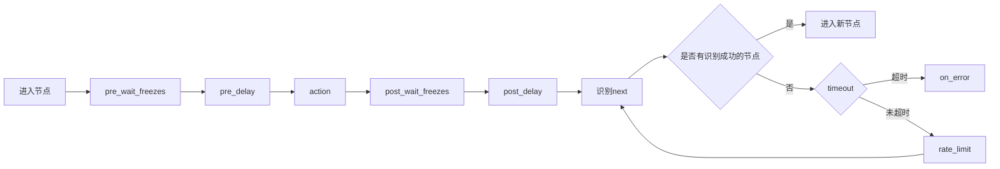

# MaaFramework 任务流水线协议

<cite>
**本文档中引用的文件**  
- [3.1-任务流水线协议.md](file://instructions/maafw-pipeline/3.1-任务流水线协议.md)
- [API参考.md](file://instructions/maafw-golang/API参考/API参考.md)
- [types.ts](file://src/stores/flow/types.ts)
- [schema.ts](file://src/core/fields/recognition/schema.ts)
- [schema.ts](file://src/core/fields/action/schema.ts)
- [schema.ts](file://src/core/fields/other/schema.ts)
- [nodeParser.ts](file://src/core/parser/nodeParser.ts)
- [configParser.ts](file://src/core/parser/configParser.ts)
</cite>

## 目录
1. [简介](#简介)
2. [基础格式](#基础格式)
3. [执行逻辑](#执行逻辑)
4. [属性字段](#属性字段)
5. [识别算法类型](#识别算法类型)
6. [动作类型](#动作类型)
7. [协议版本](#协议版本)
8. [节点生命周期](#节点生命周期)
9. [实现细节](#实现细节)

## 简介

MaaFramework 任务流水线协议是一种基于 JSON 格式的任务编排协议，用于定义自动化任务的执行流程。该协议通过节点（Node）和连接（Connection）构成工作流，每个节点包含识别算法、执行动作和流程控制等属性。本协议支持多种识别算法和动作类型，能够满足复杂的自动化需求。

**Section sources**
- [3.1-任务流水线协议.md](file://instructions/maafw-pipeline/3.1-任务流水线协议.md#L1-L20)

## 基础格式

任务流水线采用 JSON 格式描述，由若干节点（Node）构成，每个节点包含以下核心属性：

```jsonc
{
    "NodeA": {
        "recognition": "OCR",    // 识别算法
        "action": "Click",       // 执行动作
        "next": [                // 后继节点列表
            "NodeB",
            "NodeC"
        ],
        // 其他扩展属性...
    },
    // 其他节点定义...
}
```

**Section sources**
- [3.1-任务流水线协议.md](file://instructions/maafw-pipeline/3.1-任务流水线协议.md#L5-L20)

## 执行逻辑

### 流程控制机制

1. **任务触发**
   - 通过 tasker.post_task 接口指定入口节点启动任务

2. **顺序检测**
   - 对当前节点的 next 列表进行顺序检测
   - 依次尝试识别每个子节点配置的 recognition 特征

3. **中断机制**
   - 当检测到某个子节点匹配成功时，立即终止后续节点检测
   - 执行匹配节点的 action 定义的操作

4. **后继处理**
   - 操作执行完成后，将激活节点切换为当前节点
   - 重复执行上述检测流程

### 终止条件

当满足以下任意条件时，任务流程终止：
- 当前节点的 next 列表为空
- 所有后继节点持续检测失败直至超时

**Section sources**
- [3.1-任务流水线协议.md](file://instructions/maafw-pipeline/3.1-任务流水线协议.md#L22-L51)

## 属性字段

### Pipeline v1

- `recognition` : *string*  
  识别算法类型。可选，默认 [`DirectHit`](#directhit) 。  
  可选的值：[`DirectHit`](#directhit) | [`TemplateMatch`](#templatematch) | [`FeatureMatch`](#featurematch) | [`ColorMatch`](#colormatch) | [`OCR`](#ocr) | [`NeuralNetworkClassify`](#neuralnetworkclassify) | [`NeuralNetworkDetect`](#neuralnetworkdetect) | [`Custom`](#custom)  
  详见 [算法类型](#算法类型)。

- `action`: *string*  
  执行的动作。可选，默认 [`DoNothing`](#donothing) 。  
  可选的值：[`DoNothing`](#donothing) | [`Click`](#click) | [`LongPress`](#longpress) | [`Swipe`](#swipe) | [`MultiSwipe`](#multiswipe) | [`Scroll`](#scroll) | [`ClickKey`](#clickkey) | [`LongPressKey`](#longpresskey) | [`InputText`](#inputtext) | [`StartApp`](#startapp) | [`StopApp`](#stopapp) | [`StopTask`](#stoptask) | [`Command`](#command) | [`Custom`](#custom-1)  
  详见 [动作类型](#动作类型)。

- `next` : *string* | *NodeAttr* | *list<string | NodeAttr, >*  
  接下来要执行的节点列表。可选，默认空。  
  按顺序识别 next 中的每个节点，只执行第一个识别到的。  
  💡 v5.1 版本起新增支持带属性节点、 NodeAttr 形式对象，或两者结合的异质数组。详情请参考 [节点属性](#节点属性)。

- `is_sub`: *bool*  
  **（已在 5.1 版本中废弃，推荐使用 [节点属性](#节点属性) 中的 `[JumpBack]` 功能替代）**  
  我们提供了 [迁移脚本](https://github.com/MaaXYZ/MaaFramework/blob/main/tools/migrate_pipeline_v5.py)，可帮助您无损地将 Pipeline 自动转换为新风格~

- `interrupt` : *string* | *list<string, >*  
  **（已在 5.1 版本中废弃，推荐使用 [节点属性](#节点属性) 中的 `[JumpBack]` 功能替代）**  
  我们提供了 [迁移脚本](https://github.com/MaaXYZ/MaaFramework/blob/main/tools/migrate_pipeline_v5.py)，可帮助您无损地将 Pipeline 自动转换为新风格~

- `rate_limit`: *uint*  
  识别速率限制，单位毫秒。可选，默认 1000 。  
  每轮识别最低消耗 `rate_limit` 毫秒，不足的时间将会 sleep 等待。

- `timeout`: *uint*  
  识别超时时间，毫秒。可选，默认 20 * 1000 。  
  具体逻辑为 `while(!timeout) { foreach(next); sleep_until(rate_limit); }` 。

- `on_error` : *string* | *NodeAttr* | *list<string | NodeAttr, >*  
  当识别超时，或动作执行失败后，接下来会执行该列表中的节点。可选，默认空。  
  💡 v5.1 版本起新增支持带属性节点、 NodeAttr 形式对象，或两者结合的异质数组。详情请参考 [节点属性](#节点属性)。

- `anchor`: *string* | *list<string, >*  
  锚点名称。可选，默认空。  
  当节点执行成功后，会将该锚点名设置为当前节点。多个节点可设置同一个锚点名，后执行的会覆盖先执行的。  
  在 `next` 或 `on_error` 中可通过 `[Anchor]` 属性引用该锚点，运行时会解析为最后设置该锚点的节点。  
  详见 [节点属性](#节点属性)。

- `inverse`: *bool*  
  反转识别结果，识别到了当做没识别到，没识别到的当做识别到了。可选，默认 false 。  
  请注意由此识别出的节点，Click 等动作的点击自身将失效（因为实际并没有识别到东西），若有需求可单独设置 `target` 。

- `enabled`: *bool*  
  是否启用该 node。可选，默认 true 。  
  若为 false，其他 node 的 next 列表中的该 node 会被跳过，既不会被识别也不会被执行。

- `max_hit`: *uint*  
  该节点最多可被识别成功多少次。可选，默认 UINT_MAX ，即无限制。  
  若超过该次数，其他 node 的 next 列表中的该 node 会被跳过，既不会被识别也不会被执行。

- `pre_delay`: *uint*  
  识别到 到 执行动作前 的延迟，毫秒。可选，默认 200 。  
  推荐尽可能增加中间过程节点，少用延迟，不然既慢还不稳定。

- `post_delay`: *uint*  
  执行动作后 到 识别 next 的延迟，毫秒。可选，默认 200 。  
  推荐尽可能增加中间过程节点，少用延迟，不然既慢还不稳定。

- `pre_wait_freezes`: *uint* | *object*  
  识别到 到 执行动作前，等待画面不动了的时间，毫秒。可选，默认 0 ，即不等待。  
  连续 `pre_wait_freezes` 毫秒 画面 **没有较大变化** 才会退出动作。  
  若为 object，可设置更多参数，详见 [等待画面静止](#等待画面静止)。  
  具体的顺序为 `pre_wait_freezes` - `pre_delay` - `action` - `post_wait_freezes` - `post_delay` 。

- `post_wait_freezes`: *uint* | *object*  
  行动动作后 到 识别 next，等待画面不动了的时间，毫秒。可选，默认 0 ，即不等待。  
  其余逻辑同 `pre_wait_freezes`。

- `focus`: *any*  
  关注节点，会额外产生部分回调消息。可选，默认 null，不产生回调消息。  
  详见 [节点通知](#节点通知)。

- `attach`: *object*  
  附加 JSON 对象，用于保存节点的附加配置。可选，默认空对象。  
  该字段可用于存储自定义的配置信息，这些信息不会影响节点的执行逻辑，但可以通过相关接口获取。  
  **注意**：该字段会与默认值中的 `attach` 进行字典合并（dict merge），而不是覆盖。即节点中的 `attach` 会与默认值中的 `attach` 合并，相同键的值会被节点中的值覆盖，但其他键会保留。

**Section sources**
- [3.1-任务流水线协议.md](file://instructions/maafw-pipeline/3.1-任务流水线协议.md#L139-L220)

## 识别算法类型

### `DirectHit`

直接命中，即不进行识别，直接执行动作。

### `TemplateMatch`

模板匹配，即"找图"。  
该算法属性需额外部分字段：

- `roi`: *array<int, 4>* | *string*  
  识别区域坐标。可选，默认 [0, 0, 0, 0] ，即全屏。  
- `roi_offset`: *array<int, 4>*  
  在 `roi` 的基础上额外移动再作为范围，四个值分别相加。可选，默认 [0, 0, 0, 0] 。
- `template`: *string* | *list<string, >*  
  模板图片路径，需要 `image` 文件夹的相对路径。必选。
- `threshold`: *double* | *list<double, >*  
  模板匹配阈值。可选，默认 0.7 。
- `order_by`: *string*  
  结果排序方式。可选，默认 [`Horizontal`](#horizontal)。
- `index`: *int*  
  命中第几个结果。可选，默认 0 。
- `method`: *int*  
  模板匹配算法，即 cv::TemplateMatchModes。可选，默认 5 。
- `green_mask`: *bool*  
  是否进行绿色掩码。可选，默认 false 。

### `FeatureMatch`

特征匹配，泛化能力更强的"找图"，具有抗透视、抗尺寸变化等特点。  
该算法属性需额外部分字段：

- `roi`: *array<int, 4>* | *string*  
  同 `TemplateMatch`.`roi` 。
- `roi_offset`: *array<int, 4>*  
  同 `TemplateMatch`.`roi_offset` 。
- `template`: *string* | *list<string, >*  
  模板图片路径，需要 `image` 文件夹的相对路径。必选。
- `count`: *uint*  
  匹配的特征点的最低数量要求（阈值）。可选，默认 4 。
- `order_by`: *string*  
  结果排序方式。可选，默认 [`Horizontal`](#horizontal) 。
- `index`: *int*  
  命中第几个结果。可选，默认 0 。
- `green_mask`: *bool*  
  是否进行绿色掩码。可选，默认 false 。
- `detector`: *string*  
  特征检测器。可选，默认 `SIFT` 。
- `ratio`: *double*  
  KNN 匹配算法的距离比值，[0 - 1.0] , 越大则匹配越宽松（更容易连线）。可选，默认 0.6 。

### `ColorMatch`

颜色匹配，即"找色"。  
该算法属性需额外部分字段：

- `roi`: *array<int, 4>* | *string*  
  同 `TemplateMatch`.`roi` 。
- `roi_offset`: *array<int, 4>*  
  同 `TemplateMatch`.`roi_offset` 。
- `method`: *int*  
  颜色匹配方式。即 cv::ColorConversionCodes。可选，默认 4 (RGB) 。
- `lower`: *list<int, >* | *list<list<int, >>*  
  颜色下限值。必选。最内层 list 长度需和 `method` 的通道数一致。
- `upper`:  *list<int, >* | *list<list<int, >>*  
  颜色上限值。必选。最内层 list 长度需和 `method` 的通道数一致。
- `count`: *uint*  
  符合的像素点的最低数量要求（阈值）。可选，默认 1。
- `order_by`: *string*  
  结果排序方式。可选，默认 [`Horizontal`](#horizontal) 。
- `index`: *int*  
  命中第几个结果。可选，默认 0 。
- `connected`: *bool*  
  是否是相连的点才会被计数。可选，默认 false 。

### `OCR`

文字识别。  
该算法属性需额外部分字段：

- `roi`: *array<int, 4>* | *string*  
  同 `TemplateMatch`.`roi` 。
- `roi_offset`: *array<int, 4>*  
  同 `TemplateMatch`.`roi_offset` 。
- `expected`: *string* | *list<string, >*  
  期望的结果，支持正则。可选，默认匹配所有结果。
- `threshold`: *double*  
  模型置信度阈值。可选，默认 0.3 。
- `replace`: *array<string, 2>* | *list<array<string, 2>>*  
  部分文字识别结果不准确，进行替换。可选。
- `order_by`: *string*  
  结果排序方式。可选，默认 [`Horizontal`](#horizontal)。
- `index`: *int*  
  命中第几个结果。可选，默认 0 。
- `only_rec`: *bool*  
  是否仅识别（不进行检测，需要精确设置 `roi`）。可选，默认 false 。
- `model`: *string*  
  模型 **文件夹** 路径。使用 `model/ocr` 文件夹的相对路径。可选，默认为空。

### `NeuralNetworkClassify`

深度学习分类，判断图像中的 **固定位置** 是否为预期的"类别"。  
该算法属性需额外部分字段：

- `roi`: *array<int, 4>* | *string*  
  同 `TemplateMatch`.`roi` 。
- `roi_offset`: *array<int, 4>*  
  同 `TemplateMatch`.`roi_offset` 。
- `labels`: *list<string, >*  
  标注，即每个分类的名字。可选。
- `model`: *string*  
  模型文件路径。使用 `model/classify` 文件夹的相对路径。必选。
- `expected`: *int* | *list<int, >*  
  期望的分类下标。可选，默认匹配所有结果。
- `order_by`: *string*  
  结果排序方式。可选，默认 [`Horizontal`](#horizontal) 。
- `index`: *int*  
  命中第几个结果。可选，默认 0 。

### `NeuralNetworkDetect`

深度学习目标检测，高级版"找图"。  
与分类器主要区别在于"找"，即支持任意位置。  
该算法属性需额外部分字段：

- `roi`: *array<int, 4>* | *string*  
  同 `TemplateMatch`.`roi` 。
- `roi_offset`: *array<int, 4>*  
  同 `TemplateMatch`.`roi_offset` 。
- `labels`: *list<string, >*  
  标注，即每个分类的名字。可选。
- `model`: *string*  
  模型文件路径。使用 `model/detect` 文件夹的相对路径。必选。
- `expected`: *int* | *list<int, >*  
  期望的分类下标。可选，默认匹配所有结果。
- `threshold`: *double* | *list<double, >*  
  模型置信度阈值。可选，默认 0.3 。
- `order_by`: *string*  
  结果排序方式。可选，默认 [`Horizontal`](#horizontal) 。
- `index`: *int*  
  命中第几个结果。可选，默认 0 。

### `Custom`

执行通过 `MaaResourceRegisterCustomRecognition` 接口传入的识别器句柄。  
该算法属性需额外部分字段：

- `custom_recognition`: *string*  
  识别名，同注册接口传入的识别名。同时会通过 `MaaCustomRecognitionCallback`.`custom_recognition_name` 传出。必选。
- `custom_recognition_param`: *any*  
  识别参数，任意类型，会通过 `MaaCustomRecognitionCallback`.`custom_recognition_param` 传出。可选，默认 `null` 。
- `roi`: *array<int, 4>* | *string*  
  同 `TemplateMatch`.`roi`，会通过 `MaaCustomRecognitionCallback`.`roi` 传出。可选，默认 [0, 0, 0, 0] 。
- `roi_offset`: *array<int, 4>*  
  同 `TemplateMatch`.`roi_offset` 。

**Section sources**
- [3.1-任务流水线协议.md](file://instructions/maafw-pipeline/3.1-任务流水线协议.md#L277-L572)

## 动作类型

### `DoNothing`

什么都不做。

### `Click`

点击。  
该动作属性需额外部分字段：

- `target`: *true* | *string* | *array<int, 2>* | *array<int, 4>*  
  点击目标的位置。可选，默认 true 。
- `target_offset`: *array<int, 4>*  
  在 `target` 的基础上额外移动再作为点击目标，四个值分别相加。可选，默认 [0, 0, 0, 0] 。
- `contact`: *uint*  
  触点编号，用于区分不同的触控点。可选，默认 0 。

### `LongPress`

长按。  
该动作属性需额外部分字段：

- `target`: *true* | *string* | *array<int, 2>* | *array<int, 4>*  
  长按目标的位置。可选，默认 true 。值同上述 `Click`.`target` 。
- `target_offset`: *array<int, 4>*  
  在 `target` 的基础上额外移动再作为长按目标，四个值分别相加。可选，默认 [0, 0, 0, 0] 。
- `duration`: *uint*  
  长按持续时间，单位毫秒。可选，默认 1000 。
- `contact`: *uint*  
  触点编号，用于区分不同的触控点。可选，默认 0 。

### `Swipe`

线性滑动。  
该动作属性需额外部分字段：

- `begin`: *true* | *string* | *array<int, 2>* | *array<int, 4>*  
  滑动起点。可选，默认 true 。
- `begin_offset`: *array<int, 4>*  
  在 `begin` 的基础上额外移动再作为起点，四个值分别相加。可选，默认 [0, 0, 0, 0] 。
- `end`: *true* | *string* | *array<int, 2>* | *array<int, 4>* | *list<true | string | array<int, 2> | array<int, 4>>*  
  滑动终点。可选，默认 true 。
- `end_offset`: *array<int, 4>* | *list<array<int, 4>>*  
  在 `end` 的基础上额外移动再作为终点，四个值分别相加。可选，默认 [0, 0, 0, 0] 。
- `duration`: *uint* | *list<uint,>*  
  滑动持续时间，单位毫秒。可选，默认 200 。
- `end_hold`: *uint* | *list<uint,>*  
  滑动到终点后，额外等待一定时间再抬起，单位 ms。可选，默认 0。
- `only_hover`: *bool*  
  仅鼠标悬停移动，无按下/抬起动作。可选，默认 false。
- `contact`: *uint*  
  触点编号，用于区分不同的触控点。可选，默认 0 。

### `MultiSwipe`

多指线性滑动。  
该动作属性需额外部分字段：

- `swipes`: *list<object,>*  
  多个滑动的数组。必选。

### `TouchDown`

按下触控点。  
该动作属性需额外部分字段：

- `contact`: *uint*  
  触点编号，用于区分不同的触控点。可选，默认 0 。
- `target`: *true* | *string* | *array<int, 4>*  
  触控目标的位置。可选，默认 true 。
- `target_offset`: *array<int, 4>*  
  在 `target` 的基础上额外移动再作为触控目标，四个值分别相加。可选，默认 [0, 0, 0, 0] 。
- `pressure`: *int*  
  触控压力，范围取决于控制器实现。可选，默认 0 。

### `TouchMove`

移动触控点。字段含义与 `TouchDown` 一致，用于更新触点位置。

### `TouchUp`

抬起触控点。

### `Scroll`

鼠标滚轮滚动。  
该动作属性需额外部分字段：

- `dx`: *int*  
  水平滚动距离，正值向右滚动，负值向左滚动。可选，默认 0 。
- `dy`: *int*  
  垂直滚动距离，正值向下滚动，负值向上滚动。可选，默认 0 。

### `ClickKey`

单击按键。  
该动作属性需额外部分字段：

- `key`: *int* | *list<int, >*  
  要单击的键，仅支持对应控制器的虚拟按键码。必选。

### `LongPressKey`

长按按键。  
该动作属性需额外部分字段：

- `key`: *int* | *list<int, >*  
  要按的键，仅支持对应控制器的虚拟按键码。必选。
- `duration`: *uint*  
  长按持续时间，单位毫秒。可选，默认 1000 。

### `KeyDown`

按下按键但不立即松开。可与 `KeyUp` 配合实现自定义按键时序。

### `KeyUp`

松开按键。用于结束 `KeyDown` 建立的按键状态。

**Section sources**
- [3.1-任务流水线协议.md](file://instructions/maafw-pipeline/3.1-任务流水线协议.md#L573-L800)

## 协议版本

### Pipeline v2

> [!NOTE]
> MaaFW 自 v4.4.0 版本起支持 Pipeline v2 协议，同时兼容 v1。

相较 v1，主要将 `recognition` 和 `action` 相关字段放入了二级字典中（类型放入 `type` 字段，其余参数放入 `param` 字段中），其余并无不同。举例：

```jsonc
{
    "NodeA": {
        "recognition": {
            "type": "TemplateMatch",
            "param": {
                // 识别相关字段放入 recognition.param 中，键和值均无变化
                "template": "A.png",
                "roi": [100, 100, 10, 10]
            }
        },
        "action": {
            "type": "Click",
            "param": {
                // 动作相关字段放入 action.param 中，键和值均无变化
                "target": "XXX"
            }
        },
        // 非 recognition 和 action 的字段与 v1 无变化
        "next": ["NodeB"],
        "pre_delay": 1000,
        // ...
    }
}
```

**Section sources**
- [3.1-任务流水线协议.md](file://instructions/maafw-pipeline/3.1-任务流水线协议.md#L239-L270)

## 节点生命周期

一个节点的生命周期如下：



**Diagram sources**
- [3.1-任务流水线协议.md](file://instructions/maafw-pipeline/3.1-任务流水线协议.md#L223-L237)

## 实现细节

### 数据结构定义

在前端实现中，定义了完整的类型系统来描述任务流水线的数据结构：

```typescript
// 识别参数类型
export type RecognitionParamType = {
  roi?: XYWH | string;
  roi_offset?: XYWH;
  template?: string[];
  threshold?: number[];
  order_by?: string;
  index?: number;
  method?: number;
  green_mask?: boolean;
  count?: number;
  detector?: string;
  ratio?: number;
  lower?: number[][];
  upper?: number[][];
  connected?: boolean;
  expected?: string[] | number[];
  replace?: [string, string][];
  only_rec?: boolean;
  model?: string;
  labels?: string[];
  custom_recognition?: string;
  custom_recognition_param?: any;
  [key: string]: any;
};

// 动作参数类型
export type ActionParamType = {
  target?: XYWH | boolean | string;
  target_offset?: XYWH;
  duration?: number;
  begin?: XYWH;
  begin_offset?: XYWH;
  end?: XYWH;
  end_offset?: XYWH;
  swipes?: any[];
  key?: number;
  input_text?: string;
  package?: string;
  exec?: string;
  args?: string[];
  detach?: boolean;
  custom_action?: string;
  custom_action_param?: any;
  [key: string]: any;
};

// 其他参数类型
export type OtherParamType = {
  rate_limit?: number;
  timeout?: number;
  inverse?: boolean;
  enabled?: boolean;
  pre_delay?: number;
  post_delay?: number;
  pre_wait_freezes?: any;
  postWaitFreezes?: any;
  focus?: any;
  [key: string]: any;
};
```

**Section sources**
- [types.ts](file://src/stores/flow/types.ts#L41-L100)

### 字段 Schema 定义

系统通过 Schema 定义了所有字段的元数据，包括类型、默认值、描述等信息：

```typescript
// 识别字段 Schema 定义
export const recoFieldSchema: Record<string, FieldType> = {
  // 通用字段
  roi: {
    key: "roi",
    type: [FieldTypeEnum.XYWH, FieldTypeEnum.String],
    default: [0, 0, 0, 0],
    desc: "识别区域坐标。可选，默认 [0, 0, 0, 0] ，即全屏。"
  },
  roiOffset: {
    key: "roi_offset",
    type: FieldTypeEnum.XYWH,
    default: [0, 0, 0, 0],
    desc: "在 roi 的基础上额外移动再作为范围，四个值分别相加。可选，默认 [0, 0, 0, 0] 。"
  },
  // ... 其他字段定义
};

// 动作字段 Schema 定义
export const actionFieldSchema: Record<string, FieldType> = {
  // 点击相关
  clickTarget: {
    key: "target",
    type: [
      FieldTypeEnum.XYWH,
      FieldTypeEnum.IntPair,
      FieldTypeEnum.True,
      FieldTypeEnum.String,
    ],
    default: [0, 0, 0, 0],
    desc: "点击目标的位置。可选，默认 true 。"
  },
  // ... 其他字段定义
};

// 其他字段 Schema 定义
const otherFieldSchema: Record<string, FieldType> = {
  rateLimit: {
    key: "rate_limit",
    type: FieldTypeEnum.Int,
    default: 1000,
    step: 500,
    desc: "识别速率限制，单位毫秒。可选，默认 1000 。"
  },
  // ... 其他字段定义
};
```

**Section sources**
- [schema.ts](file://src/core/fields/recognition/schema.ts#L7-L242)
- [schema.ts](file://src/core/fields/action/schema.ts#L7-L246)
- [schema.ts](file://src/core/fields/other/schema.ts#L7-L110)

### 协议解析实现

系统实现了完整的协议解析器，用于处理 Pipeline 配置的解析和转换：

```typescript
/**
 * 解析Pipeline配置
 * @param pipelineObj Pipeline对象
 * @returns 解析后的配置
 */
export function parsePipelineConfig(pipelineObj: any): PipelineConfigType {
  const configs: PipelineConfigType = {};
  const objKeys = Object.keys(pipelineObj);

  // 查找配置键
  const configKey = objKeys.find((objKey) => isConfigKey(objKey));
  if (!configKey) {
    return configs;
  }

  let configObj = pipelineObj[configKey];

  // 兼容新旧版本的配置标记
  const markedConfig = getConfigMark(configObj);
  if (markedConfig) {
    configObj = markedConfig;
  }

  Object.assign(configs, configObj);

  return configs;
}

/**
 * 解析Pipeline节点为导出格式
 * @param fNode Flow节点
 * @returns 解析后的Pipeline节点
 */
export function parsePipelineNodeForExport(
  fNode: PipelineNodeType
): ParsedPipelineNodeType {
  const fNodeData = fNode.data;

  // 识别算法
  const recoType = fNodeData.recognition.type;
  const recognition = {
    type: recoType,
    param: matchParamType(
      fNodeData.recognition.param,
      recoFields[recoType].params
    ),
  };

  // 动作
  const actionType = fNodeData.action.type;
  const action = {
    type: actionType,
    param: matchParamType(
      fNodeData.action.param,
      actionFields[actionType].params
    ),
  };

  // 其他参数
  const others = matchParamType(fNodeData.others, otherFieldParams);

  // 额外字段
  const extras = JsonHelper.isObj(fNodeData.extras)
    ? fNodeData.extras
    : JsonHelper.stringObjToJson(
        String(fNodeData.extras).replaceAll(/[""]/g, `"`)
      ) ?? {};

  // 赋值
  const pNode: ParsedPipelineNodeType = {
    recognition,
    action,
    ...others,
    ...extras,
  };

  // 保存位置信息
  if (useConfigStore.getState().configs.isExportConfig) {
    const position = fNode.position;
    pNode[configMark] = {
      position: {
        x: Math.round(position.x),
        y: Math.round(position.y),
      },
    };
  }

  return pNode;
}
```

**Section sources**
- [configParser.ts](file://src/core/parser/configParser.ts#L47-L69)
- [nodeParser.ts](file://src/core/parser/nodeParser.ts#L21-L76)