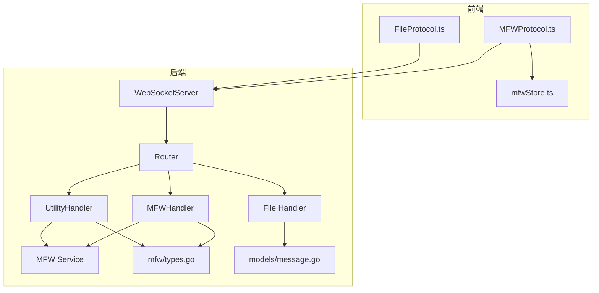
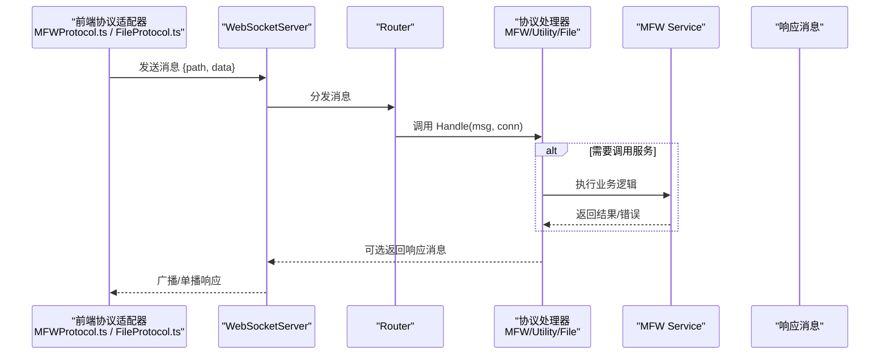
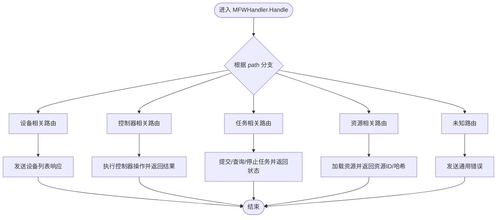
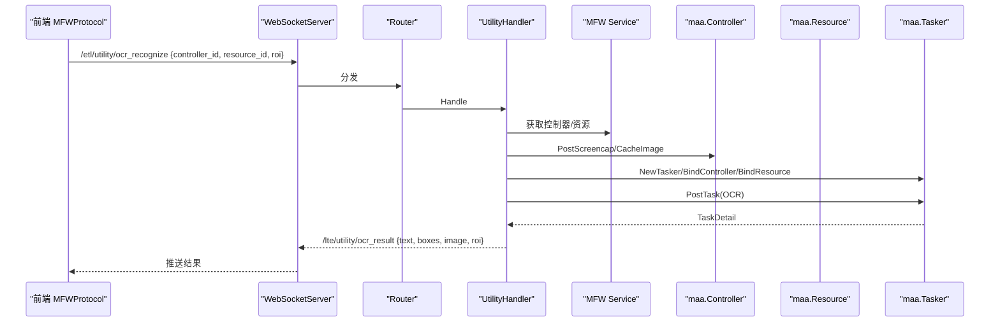
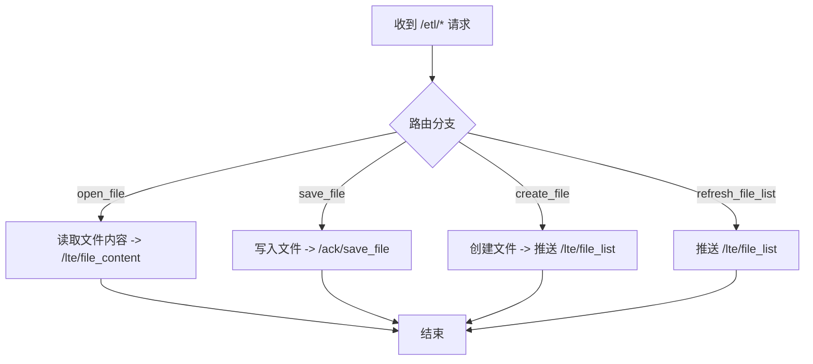
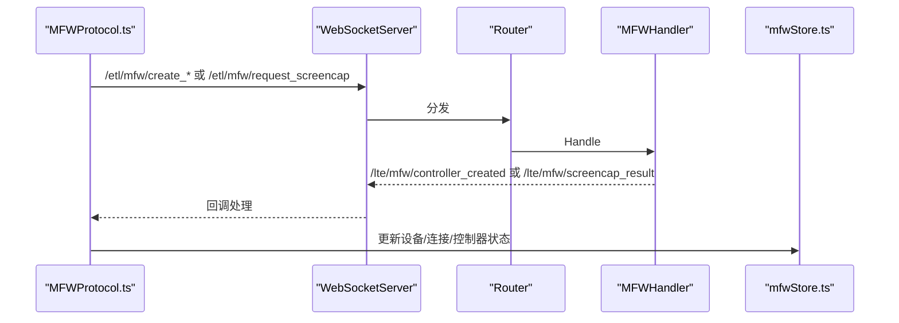
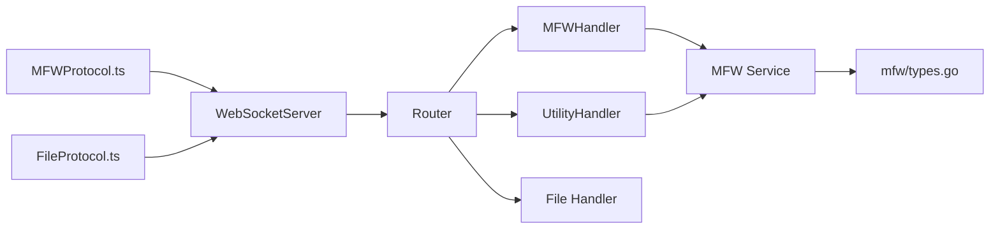

# MaaFramework 协议处理器

<cite>
**本文引用的文件**
- [LocalBridge/internal/protocol/mfw/handler.go](file://LocalBridge/internal/protocol/mfw/handler.go)
- [LocalBridge/internal/protocol/utility/handler.go](file://LocalBridge/internal/protocol/utility/handler.go)
- [LocalBridge/internal/protocol/file/file_handler.go](file://LocalBridge/internal/protocol/file/file_handler.go)
- [src/services/protocols/MFWProtocol.ts](file://src/services/protocols/MFWProtocol.ts)
- [src/services/protocols/FileProtocol.ts](file://src/services/protocols/FileProtocol.ts)
- [LocalBridge/internal/router/router.go](file://LocalBridge/internal/router/router.go)
- [LocalBridge/internal/server/websocket.go](file://LocalBridge/internal/server/websocket.go)
- [LocalBridge/internal/mfw/service.go](file://LocalBridge/internal/mfw/service.go)
- [LocalBridge/internal/mfw/types.go](file://LocalBridge/internal/mfw/types.go)
- [LocalBridge/pkg/models/message.go](file://LocalBridge/pkg/models/message.go)
- [src/stores/mfwStore.ts](file://src/stores/mfwStore.ts)
</cite>

## 目录
1. [简介](#简介)
2. [项目结构](#项目结构)
3. [核心组件](#核心组件)
4. [架构总览](#架构总览)
5. [详细组件分析](#详细组件分析)
6. [依赖关系分析](#依赖关系分析)
7. [性能考量](#性能考量)
8. [故障排查指南](#故障排查指南)
9. [结论](#结论)

## 简介
本文件聚焦于“MaaFramework 协议处理器”，即本地桥接服务中的协议层实现，负责将前端通过 WebSocket 发出的业务请求（如设备发现、控制器创建、截图、OCR识别、任务提交等）路由到后端服务，并将结果回传给前端。该处理器以“前缀路由”模式组织，支持多协议并行：MFW 协议（设备/控制器/任务/资源）、Utility 协议（OCR识别）、File 协议（文件读写与列表推送）。同时，前端也配套实现了对应的协议适配器，用于注册路由、发送请求、接收响应并更新 UI 状态。

## 项目结构
围绕协议处理器的相关文件分布如下：
- 后端协议处理器
  - MFW 协议处理器：负责设备、控制器、任务、资源相关请求
  - Utility 协议处理器：负责 OCR 识别请求
  - File 协议处理器：负责文件读写、列表推送与变更通知
- 路由与服务器
  - 路由分发器：根据消息路径精确或前缀匹配到对应处理器
  - WebSocket 服务器：提供连接管理、广播、握手等能力
- 服务与模型
  - MFW 服务：封装设备、控制器、资源、任务管理器
  - 类型定义：控制器、任务、截图等结构体
  - 通用消息模型：统一的路径与数据载体
- 前端协议适配器
  - MFWProtocol.ts：注册/发送 MFW 相关请求，接收响应并更新状态
  - FileProtocol.ts：注册/发送文件相关请求，接收响应并处理文件变更
  - mfwStore.ts：维护设备列表、控制器连接状态等全局状态

图表来源
- [LocalBridge/internal/protocol/mfw/handler.go](file://LocalBridge/internal/protocol/mfw/handler.go#L1-L83)
- [LocalBridge/internal/protocol/utility/handler.go](file://LocalBridge/internal/protocol/utility/handler.go#L1-L52)
- [LocalBridge/internal/protocol/file/file_handler.go](file://LocalBridge/internal/protocol/file/file_handler.go#L1-L61)
- [LocalBridge/internal/router/router.go](file://LocalBridge/internal/router/router.go#L1-L105)
- [LocalBridge/internal/server/websocket.go](file://LocalBridge/internal/server/websocket.go#L1-L176)
- [LocalBridge/internal/mfw/service.go](file://LocalBridge/internal/mfw/service.go#L1-L127)
- [LocalBridge/internal/mfw/types.go](file://LocalBridge/internal/mfw/types.go#L1-L106)
- [LocalBridge/pkg/models/message.go](file://LocalBridge/pkg/models/message.go#L1-L85)
- [src/services/protocols/MFWProtocol.ts](file://src/services/protocols/MFWProtocol.ts#L1-L120)
- [src/services/protocols/FileProtocol.ts](file://src/services/protocols/FileProtocol.ts#L1-L70)
- [src/stores/mfwStore.ts](file://src/stores/mfwStore.ts#L1-L134)

章节来源
- [LocalBridge/internal/protocol/mfw/handler.go](file://LocalBridge/internal/protocol/mfw/handler.go#L1-L83)
- [LocalBridge/internal/protocol/utility/handler.go](file://LocalBridge/internal/protocol/utility/handler.go#L1-L52)
- [LocalBridge/internal/protocol/file/file_handler.go](file://LocalBridge/internal/protocol/file/file_handler.go#L1-L61)
- [LocalBridge/internal/router/router.go](file://LocalBridge/internal/router/router.go#L1-L105)
- [LocalBridge/internal/server/websocket.go](file://LocalBridge/internal/server/websocket.go#L1-L176)
- [LocalBridge/internal/mfw/service.go](file://LocalBridge/internal/mfw/service.go#L1-L127)
- [LocalBridge/internal/mfw/types.go](file://LocalBridge/internal/mfw/types.go#L1-L106)
- [LocalBridge/pkg/models/message.go](file://LocalBridge/pkg/models/message.go#L1-L85)
- [src/services/protocols/MFWProtocol.ts](file://src/services/protocols/MFWProtocol.ts#L1-L120)
- [src/services/protocols/FileProtocol.ts](file://src/services/protocols/FileProtocol.ts#L1-L70)
- [src/stores/mfwStore.ts](file://src/stores/mfwStore.ts#L1-L134)

## 核心组件
- 路由分发器 Router
  - 通过前缀匹配将消息路由到具体处理器
  - 支持系统握手、错误统一返回
- WebSocket 服务器
  - 提供连接升级、注册/注销、广播、统计等能力
- 协议处理器
  - MFWHandler：设备、控制器、任务、资源相关
  - UtilityHandler：OCR 识别
  - File Handler：文件读写、列表推送、变更通知
- MFW 服务与类型
  - Service：封装设备、控制器、资源、任务管理器
  - types：控制器、任务、截图等结构体
- 前端协议适配器
  - MFWProtocol.ts：注册/发送 MFW 请求，接收响应并更新状态
  - FileProtocol.ts：注册/发送文件请求，接收响应并处理变更
  - mfwStore.ts：维护设备列表、控制器连接状态等

章节来源
- [LocalBridge/internal/router/router.go](file://LocalBridge/internal/router/router.go#L1-L147)
- [LocalBridge/internal/server/websocket.go](file://LocalBridge/internal/server/websocket.go#L1-L176)
- [LocalBridge/internal/protocol/mfw/handler.go](file://LocalBridge/internal/protocol/mfw/handler.go#L1-L83)
- [LocalBridge/internal/protocol/utility/handler.go](file://LocalBridge/internal/protocol/utility/handler.go#L1-L52)
- [LocalBridge/internal/protocol/file/file_handler.go](file://LocalBridge/internal/protocol/file/file_handler.go#L1-L61)
- [LocalBridge/internal/mfw/service.go](file://LocalBridge/internal/mfw/service.go#L1-L127)
- [LocalBridge/internal/mfw/types.go](file://LocalBridge/internal/mfw/types.go#L1-L106)
- [src/services/protocols/MFWProtocol.ts](file://src/services/protocols/MFWProtocol.ts#L1-L120)
- [src/services/protocols/FileProtocol.ts](file://src/services/protocols/FileProtocol.ts#L1-L70)
- [src/stores/mfwStore.ts](file://src/stores/mfwStore.ts#L1-L134)

## 架构总览
后端采用“路由分发 + 协议处理器”的解耦设计：
- 前端通过 WebSocket 发送消息，携带 path 与 data
- Router 根据 path 精确或前缀匹配到对应 Handler
- Handler 调用 Service 或内部逻辑处理，必要时构造响应消息回传
- WebSocketServer 负责连接生命周期与广播

图表来源
- [LocalBridge/internal/router/router.go](file://LocalBridge/internal/router/router.go#L48-L105)
- [LocalBridge/internal/server/websocket.go](file://LocalBridge/internal/server/websocket.go#L141-L176)
- [LocalBridge/internal/protocol/mfw/handler.go](file://LocalBridge/internal/protocol/mfw/handler.go#L23-L83)
- [LocalBridge/internal/protocol/utility/handler.go](file://LocalBridge/internal/protocol/utility/handler.go#L31-L52)
- [LocalBridge/internal/protocol/file/file_handler.go](file://LocalBridge/internal/protocol/file/file_handler.go#L37-L61)
- [LocalBridge/internal/mfw/service.go](file://LocalBridge/internal/mfw/service.go#L1-L127)

## 详细组件分析

### MFW 协议处理器（设备/控制器/任务/资源）
- 路由前缀
  - /etl/mfw/*
- 主要职责
  - 设备：刷新 ADB 设备列表、刷新 Win32 窗口列表
  - 控制器：创建 ADB/Win32 控制器、断开、截图、点击、滑动、输入文本、启动/停止应用
  - 任务：提交任务、查询状态、停止任务
  - 资源：加载资源、注册自定义识别/动作（预留）
- 错误处理
  - 未知路由：统一返回 /error
  - 业务错误：返回带 code/message/detail 的 /error
- 响应消息
  - 设备列表：/lte/mfw/adb_devices、/lte/mfw/win32_windows
  - 控制器：/lte/mfw/controller_created、/lte/mfw/controller_status、/lte/mfw/controller_operation_result
  - 截图：/lte/mfw/screencap_result
  - 任务：/lte/mfw/task_submitted、/lte/mfw/task_status
  - 资源：/lte/mfw/resource_loaded

图表来源
- [LocalBridge/internal/protocol/mfw/handler.go](file://LocalBridge/internal/protocol/mfw/handler.go#L23-L83)
- [LocalBridge/internal/protocol/mfw/handler.go](file://LocalBridge/internal/protocol/mfw/handler.go#L85-L122)
- [LocalBridge/internal/protocol/mfw/handler.go](file://LocalBridge/internal/protocol/mfw/handler.go#L124-L208)
- [LocalBridge/internal/protocol/mfw/handler.go](file://LocalBridge/internal/protocol/mfw/handler.go#L237-L270)
- [LocalBridge/internal/protocol/mfw/handler.go](file://LocalBridge/internal/protocol/mfw/handler.go#L377-L408)
- [LocalBridge/internal/protocol/mfw/handler.go](file://LocalBridge/internal/protocol/mfw/handler.go#L409-L464)
- [LocalBridge/internal/protocol/mfw/handler.go](file://LocalBridge/internal/protocol/mfw/handler.go#L466-L493)
- [LocalBridge/internal/protocol/mfw/handler.go](file://LocalBridge/internal/protocol/mfw/handler.go#L495-L505)
- [LocalBridge/internal/protocol/mfw/handler.go](file://LocalBridge/internal/protocol/mfw/handler.go#L521-L553)

章节来源
- [LocalBridge/internal/protocol/mfw/handler.go](file://LocalBridge/internal/protocol/mfw/handler.go#L1-L553)

### Utility 协议处理器（OCR 识别）
- 路由前缀
  - /etl/utility/*
- 主要职责
  - OCR 识别：基于控制器截图，结合资源或默认 OCR 配置，提交一次性任务并解析结果
- 关键流程
  - 参数校验（controller_id、resource_id、roi）
  - 获取控制器与资源
  - 截图 -> 绑定控制器/资源 -> 初始化 Tasker -> 提交 OCR 任务 -> 解析结果 -> 返回 /lte/utility/ocr_result
- 错误处理
  - 参数错误、控制器不可用、资源加载失败、OCR 未初始化等均返回 /error

图表来源
- [LocalBridge/internal/protocol/utility/handler.go](file://LocalBridge/internal/protocol/utility/handler.go#L31-L52)
- [LocalBridge/internal/protocol/utility/handler.go](file://LocalBridge/internal/protocol/utility/handler.go#L54-L94)
- [LocalBridge/internal/protocol/utility/handler.go](file://LocalBridge/internal/protocol/utility/handler.go#L96-L214)
- [LocalBridge/internal/protocol/utility/handler.go](file://LocalBridge/internal/protocol/utility/handler.go#L216-L336)
- [LocalBridge/internal/mfw/service.go](file://LocalBridge/internal/mfw/service.go#L1-L127)

章节来源
- [LocalBridge/internal/protocol/utility/handler.go](file://LocalBridge/internal/protocol/utility/handler.go#L1-L378)
- [LocalBridge/internal/mfw/service.go](file://LocalBridge/internal/mfw/service.go#L1-L127)

### File 协议处理器（文件读写与列表推送）
- 路由前缀
  - /etl/open_file、/etl/save_file、/etl/create_file、/etl/refresh_file_list
- 主要职责
  - 打开文件：读取内容并返回 /lte/file_content
  - 保存文件：写入并返回 /ack/save_file
  - 创建文件：创建并触发文件列表推送
  - 刷新文件列表：主动推送 /lte/file_list
  - 文件变更通知：订阅事件后广播 /lte/file_changed
- 错误处理
  - JSON 解析错误、文件读写错误等统一返回 /error

图表来源
- [LocalBridge/internal/protocol/file/file_handler.go](file://LocalBridge/internal/protocol/file/file_handler.go#L37-L61)
- [LocalBridge/internal/protocol/file/file_handler.go](file://LocalBridge/internal/protocol/file/file_handler.go#L63-L91)
- [LocalBridge/internal/protocol/file/file_handler.go](file://LocalBridge/internal/protocol/file/file_handler.go#L93-L120)
- [LocalBridge/internal/protocol/file/file_handler.go](file://LocalBridge/internal/protocol/file/file_handler.go#L122-L145)
- [LocalBridge/internal/protocol/file/file_handler.go](file://LocalBridge/internal/protocol/file/file_handler.go#L147-L151)
- [LocalBridge/internal/protocol/file/file_handler.go](file://LocalBridge/internal/protocol/file/file_handler.go#L153-L179)
- [LocalBridge/internal/protocol/file/file_handler.go](file://LocalBridge/internal/protocol/file/file_handler.go#L181-L194)
- [LocalBridge/internal/protocol/file/file_handler.go](file://LocalBridge/internal/protocol/file/file_handler.go#L196-L222)

章节来源
- [LocalBridge/internal/protocol/file/file_handler.go](file://LocalBridge/internal/protocol/file/file_handler.go#L1-L222)

### 前端协议适配器（MFWProtocol.ts）
- 路由注册
  - /lte/mfw/adb_devices、/lte/mfw/win32_windows、/lte/mfw/controller_created、/lte/mfw/controller_status、/lte/mfw/screencap_result、/lte/utility/ocr_result、/lte/mfw/controller_operation_result
- 发送方法
  - 刷新设备、创建控制器、断开、请求截图、请求 OCR、提交任务等
- 状态更新
  - 通过 mfwStore 更新设备列表、连接状态、控制器信息、错误提示

图表来源
- [src/services/protocols/MFWProtocol.ts](file://src/services/protocols/MFWProtocol.ts#L1-L120)
- [src/services/protocols/MFWProtocol.ts](file://src/services/protocols/MFWProtocol.ts#L230-L399)
- [src/stores/mfwStore.ts](file://src/stores/mfwStore.ts#L1-L134)

章节来源
- [src/services/protocols/MFWProtocol.ts](file://src/services/protocols/MFWProtocol.ts#L1-L399)
- [src/stores/mfwStore.ts](file://src/stores/mfwStore.ts#L1-L134)

### 前端协议适配器（FileProtocol.ts）
- 路由注册
  - /lte/file_list、/lte/file_content、/lte/file_changed、/ack/save_file
- 发送方法
  - 打开文件、创建文件、保存文件、刷新文件列表
- 行为
  - 接收文件列表/内容，更新本地缓存
  - 监听文件变更，弹窗提示或自动重载
  - 保存成功后标记最近保存文件，避免重复通知

章节来源
- [src/services/protocols/FileProtocol.ts](file://src/services/protocols/FileProtocol.ts#L1-L319)

## 依赖关系分析
- 组件耦合
  - Router 与各 Handler 通过接口解耦，便于扩展新协议
  - WebSocketServer 仅负责连接与消息转发，不关心业务细节
  - MFWHandler/UtilityHandler 依赖 MFW Service，后者封装设备/控制器/资源/任务管理器
  - 前端协议适配器仅依赖 WebSocket 通道与状态存储
- 外部依赖
  - MaaFramework Go SDK：用于控制器、资源、任务的创建与操作
  - Gorilla WebSocket：用于连接升级与读写
- 潜在循环依赖
  - 无直接循环；协议层通过接口与服务层解耦

图表来源
- [LocalBridge/internal/router/router.go](file://LocalBridge/internal/router/router.go#L1-L105)
- [LocalBridge/internal/protocol/mfw/handler.go](file://LocalBridge/internal/protocol/mfw/handler.go#L1-L83)
- [LocalBridge/internal/protocol/utility/handler.go](file://LocalBridge/internal/protocol/utility/handler.go#L1-L52)
- [LocalBridge/internal/protocol/file/file_handler.go](file://LocalBridge/internal/protocol/file/file_handler.go#L1-L61)
- [LocalBridge/internal/mfw/service.go](file://LocalBridge/internal/mfw/service.go#L1-L127)
- [LocalBridge/internal/mfw/types.go](file://LocalBridge/internal/mfw/types.go#L1-L106)
- [LocalBridge/internal/server/websocket.go](file://LocalBridge/internal/server/websocket.go#L1-L176)
- [src/services/protocols/MFWProtocol.ts](file://src/services/protocols/MFWProtocol.ts#L1-L120)
- [src/services/protocols/FileProtocol.ts](file://src/services/protocols/FileProtocol.ts#L1-L70)

章节来源
- [LocalBridge/internal/router/router.go](file://LocalBridge/internal/router/router.go#L1-L147)
- [LocalBridge/internal/server/websocket.go](file://LocalBridge/internal/server/websocket.go#L1-L176)
- [LocalBridge/internal/mfw/service.go](file://LocalBridge/internal/mfw/service.go#L1-L127)

## 性能考量
- 路由匹配
  - 精确匹配优先，前缀匹配作为兜底，减少不必要的查找成本
- 消息处理
  - Handler 内部尽量短链路处理，避免阻塞；耗时操作（如 OCR）建议异步化
- 连接管理
  - WebSocketServer 使用 goroutine 管理读写与连接注册/注销，注意并发安全
- 资源占用
  - MaaFramework 初始化与释放需谨慎，避免频繁创建销毁
- 前端回调
  - 截图与 OCR 结果回调列表可能增长，注意及时注销

[本节为通用指导，无需列出具体文件来源]

## 故障排查指南
- 握手失败
  - 检查协议版本是否匹配（/system/handshake）
- 未知路由
  - 确认前端发送的 path 是否在后端处理器前缀范围内
- 业务错误
  - 查看 /error 消息中的 code/message/detail 字段定位问题
- 控制器不可用
  - 确认控制器已创建且连接成功；检查控制器状态推送
- OCR 未初始化
  - 确认资源目录结构正确（OCR 模型路径），并确保资源已加载
- 文件读写失败
  - 检查文件权限、路径合法性；查看错误消息并重试

章节来源
- [LocalBridge/internal/router/router.go](file://LocalBridge/internal/router/router.go#L106-L147)
- [LocalBridge/internal/protocol/mfw/handler.go](file://LocalBridge/internal/protocol/mfw/handler.go#L521-L553)
- [LocalBridge/internal/protocol/utility/handler.go](file://LocalBridge/internal/protocol/utility/handler.go#L358-L378)
- [LocalBridge/internal/protocol/file/file_handler.go](file://LocalBridge/internal/protocol/file/file_handler.go#L211-L222)

## 结论
MaaFramework 协议处理器通过清晰的前缀路由与协议适配器，实现了设备/控制器/任务/资源与文件系统的完整闭环。后端以服务层抽象底层能力，前端以协议适配器对接 UI 与状态管理，整体具备良好的可扩展性与可维护性。建议在实际使用中关注握手版本、资源初始化与错误消息的统一处理，以提升稳定性与可观测性。