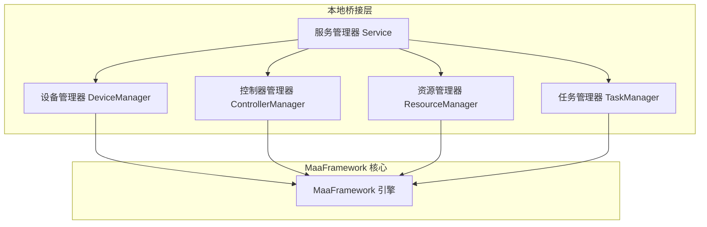
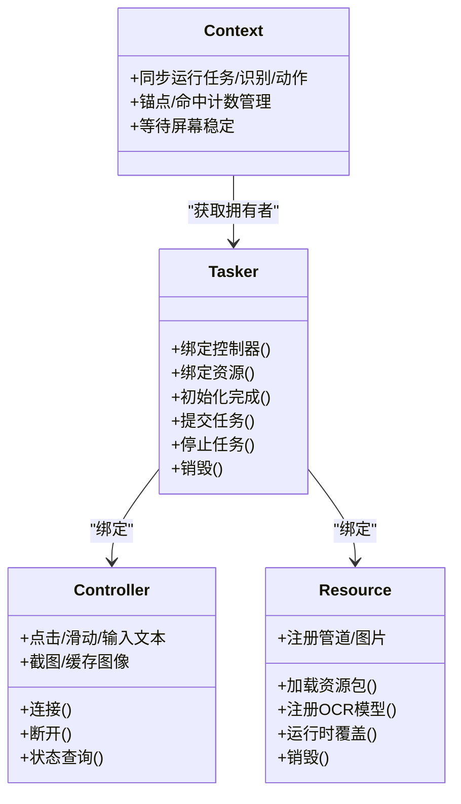
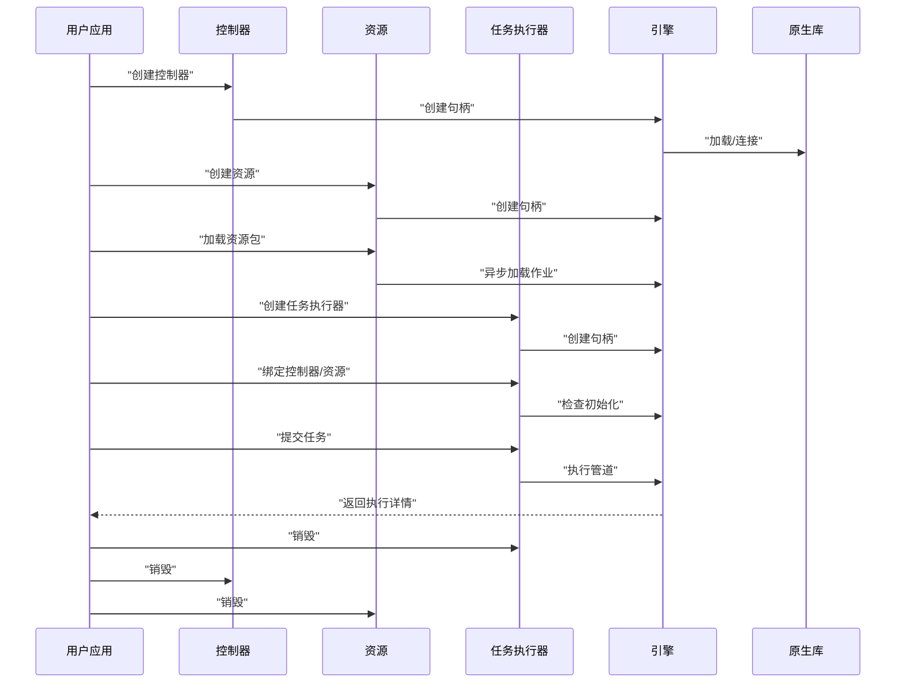
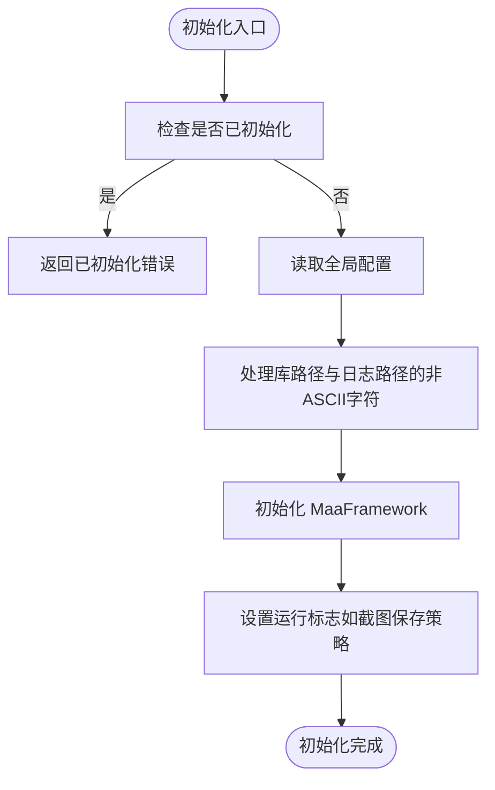
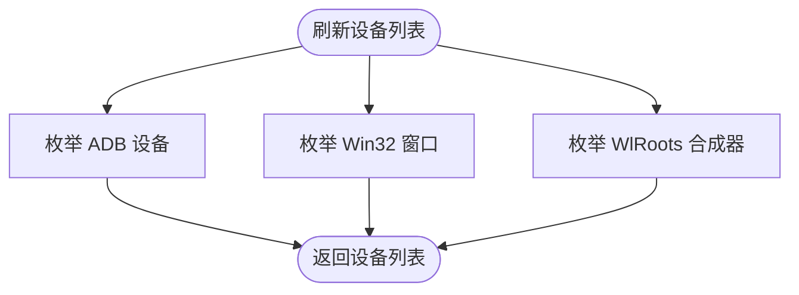
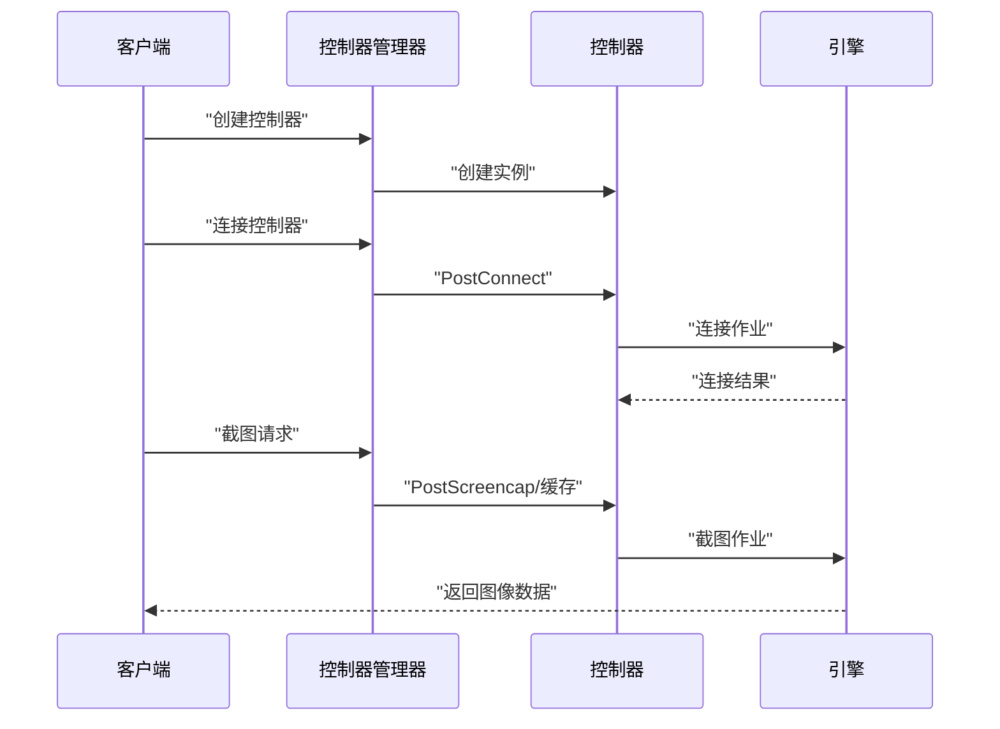
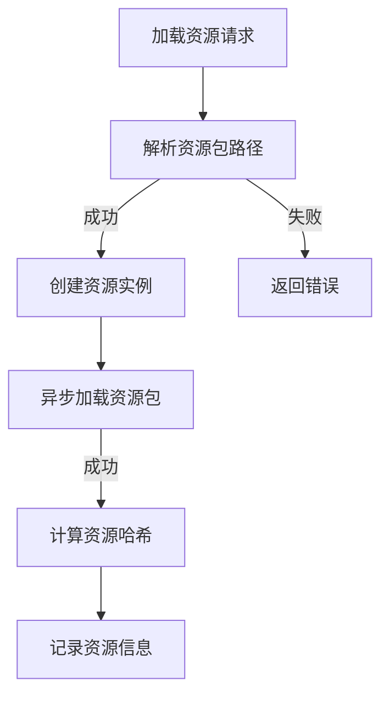
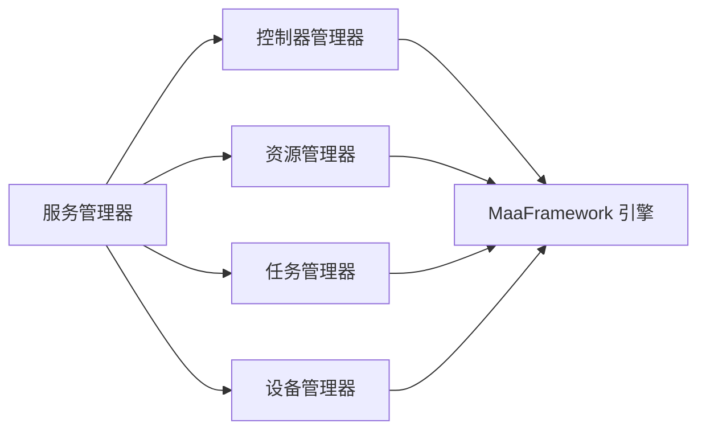
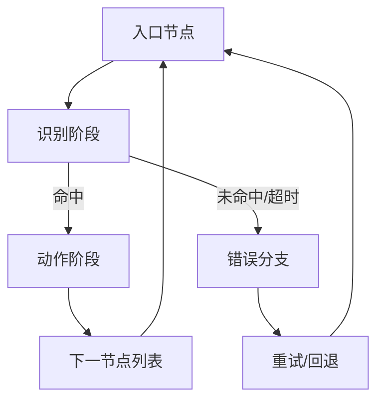
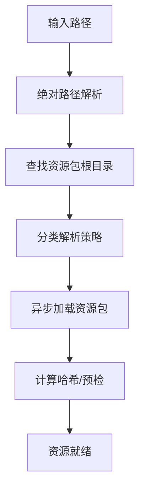

# MaaFramework 基础概念

<cite>
**本文档引用的文件**
- [LocalBridge\internal\mfw\service.go](file://LocalBridge/internal/mfw/service.go)
- [LocalBridge\internal\mfw\types.go](file://LocalBridge/internal/mfw/types.go)
- [LocalBridge\internal\mfw\resource_manager.go](file://LocalBridge/internal/mfw/resource_manager.go)
- [LocalBridge\internal\mfw\controller_manager.go](file://LocalBridge/internal/mfw/controller_manager.go)
- [LocalBridge\internal\mfw\task_manager.go](file://LocalBridge/internal/mfw/task_manager.go)
- [LocalBridge\internal\mfw\device_manager.go](file://LocalBridge/internal/mfw/device_manager.go)
- [LocalBridge\internal\mfw\resource_bundle_resolver.go](file://LocalBridge/internal/mfw/resource_bundle_resolver.go)
- [LocalBridge\internal\mfw\error.go](file://LocalBridge/internal/mfw/error.go)
- [dev\instructions\maafw-guide\1.2-ExplanationOfTerms.md](file://dev/instructions/maafw-guide/1.2-ExplanationOfTerms.md)
- [dev\instructions\maafw-guide\2.1-Integration.md](file://dev/instructions/maafw-guide/2.1-Integration.md)
- [dev\instructions\maafw-golang-binding\Core Components.md](file://dev/instructions/maafw-golang-binding/Core Components.md)
- [dev\instructions\maafw-golang-binding\Pipeline Architecture.md](file://dev/instructions/maafw-golang-binding/Pipeline Architecture.md)
- [dev\instructions\maafw-golang-binding\Pipeline and Nodes.md](file://dev/instructions/maafw-golang-binding/Pipeline and Nodes.md)
</cite>

## 目录
1. [引言](#引言)
2. [项目结构](#项目结构)
3. [核心组件](#核心组件)
4. [架构总览](#架构总览)
5. [详细组件分析](#详细组件分析)
6. [依赖关系分析](#依赖关系分析)
7. [性能考虑](#性能考虑)
8. [故障排查指南](#故障排查指南)
9. [结论](#结论)
10. [附录](#附录)

## 引言
本文件面向希望使用 MaaFramework 构建自动化流程的开发者，系统阐述其基础概念与实现要点。内容涵盖三种集成方案（纯 JSON 低代码编程、JSON+自定义逻辑扩展、全代码开发）、Pipeline 工作流的核心元素（任务、节点、动作、识别）、资源管理机制（图像资源、OCR 模型、管道文件组织），并结合仓库中的本地桥接层实现，给出架构图、调用序列图与最佳实践建议，帮助读者快速上手并做出合适的技术选型。

## 项目结构
本仓库围绕 MaaFramework 的本地桥接层（LocalBridge）构建，提供设备发现、控制器管理、资源加载、任务执行与截图能力，并通过前端可视化编辑器与之交互。核心模块包括：
- 服务管理器：统一初始化/关闭 MaaFramework，协调各子管理器
- 设备管理器：列举 ADB、Win32、WlRoots 等可用设备
- 控制器管理器：创建/连接/断开控制器，执行输入与截图
- 资源管理器：加载/卸载资源包，解析资源根路径
- 任务管理器：提交/停止任务，跟踪任务状态
- 类型与错误：统一的数据结构与错误码定义

**图表来源**
- [LocalBridge\internal\mfw\service.go:15-34](file://LocalBridge/internal/mfw/service.go#L15-L34)
- [LocalBridge\internal\mfw\controller_manager.go:20-31](file://LocalBridge/internal/mfw/controller_manager.go#L20-L31)
- [LocalBridge\internal\mfw\resource_manager.go:11-22](file://LocalBridge/internal/mfw/resource_manager.go#L11-L22)
- [LocalBridge\internal\mfw\task_manager.go:11-22](file://LocalBridge/internal/mfw/task_manager.go#L11-L22)
- [LocalBridge\internal\mfw\device_manager.go:11-25](file://LocalBridge/internal/mfw/device_manager.go#L11-L25)

**章节来源**
- [LocalBridge\internal\mfw\service.go:15-34](file://LocalBridge/internal/mfw/service.go#L15-L34)
- [LocalBridge\internal\mfw\types.go:1-129](file://LocalBridge/internal/mfw/types.go#L1-L129)
- [LocalBridge\internal\mfw\resource_manager.go:11-118](file://LocalBridge/internal/mfw/resource_manager.go#L11-L118)
- [LocalBridge\internal\mfw\controller_manager.go:20-800](file://LocalBridge/internal/mfw/controller_manager.go#L20-L800)
- [LocalBridge\internal\mfw\task_manager.go:11-114](file://LocalBridge/internal/mfw/task_manager.go#L11-L114)
- [LocalBridge\internal\mfw\device_manager.go:11-136](file://LocalBridge/internal/mfw/device_manager.go#L11-L136)

## 核心组件
本节聚焦 MaaFramework 的四大核心组件及其在本地桥接层中的封装与职责：
- Tasker：任务执行器，协调识别与动作
- Controller：设备接口，负责连接、输入注入与截图
- Resource：资源容器，持有管道定义与资产
- Context：回调上下文，向自定义扩展暴露同步执行能力

**图表来源**
- [dev\instructions\maafw-golang-binding\Core Components.md:197-446](file://dev/instructions/maafw-golang-binding/Core Components.md#L197-L446)

**章节来源**
- [dev\instructions\maafw-golang-binding\Core Components.md:197-446](file://dev/instructions/maafw-golang-binding/Core Components.md#L197-L446)

## 架构总览
下图展示从本地桥接层到 MaaFramework 引擎的完整调用链路，包括构造、绑定、初始化、执行与销毁阶段。

**图表来源**
- [dev\instructions\maafw-golang-binding\Core Components.md:129-191](file://dev/instructions/maafw-golang-binding/Core Components.md#L129-L191)

**章节来源**
- [dev\instructions\maafw-golang-binding\Core Components.md:129-191](file://dev/instructions/maafw-golang-binding/Core Components.md#L129-L191)

## 详细组件分析

### 服务管理器 Service
- 职责：统一初始化/关闭 MaaFramework；协调设备、控制器、资源、任务管理器
- 关键点：
  - 初始化时处理 Windows 非 ASCII 路径问题（短路径或工作目录切换）
  - 支持重载（先关闭再重新初始化）
  - 提供各子管理器的访问入口

**图表来源**
- [LocalBridge\internal\mfw\service.go:36-138](file://LocalBridge/internal/mfw/service.go#L36-L138)

**章节来源**
- [LocalBridge\internal\mfw\service.go:36-138](file://LocalBridge/internal/mfw/service.go#L36-L138)

### 设备管理器 DeviceManager
- 职责：枚举 ADB 设备、Win32 窗口、WlRoots 合成器
- 关键点：
  - ADB：提供多种截图与输入方法供用户选择
  - Win32：提供多种截图与输入方法
  - WlRoots：基于桌面窗口枚举

**图表来源**
- [LocalBridge\internal\mfw\device_manager.go:27-121](file://LocalBridge/internal/mfw/device_manager.go#L27-L121)

**章节来源**
- [LocalBridge\internal\mfw\device_manager.go:27-121](file://LocalBridge/internal/mfw/device_manager.go#L27-L121)

### 控制器管理器 ControllerManager
- 职责：创建/连接/断开控制器，执行输入操作（点击、滑动、文本输入、应用启停等），截图与缓存
- 关键点：
  - 支持 ADB、Win32、PlayCover、WlRoots、Gamepad 等多种控制器
  - 操作均通过异步作业（Job）提交，完成后等待结果
  - 截图支持目标长/短边缩放、原始尺寸、缓存读取

**图表来源**
- [LocalBridge\internal\mfw\controller_manager.go:278-622](file://LocalBridge/internal/mfw/controller_manager.go#L278-L622)

**章节来源**
- [LocalBridge\internal\mfw\controller_manager.go:278-622](file://LocalBridge/internal/mfw/controller_manager.go#L278-L622)

### 资源管理器 ResourceManager
- 职责：加载/卸载资源包，解析资源根路径，计算资源哈希
- 关键点：
  - 通过资源包解析器定位 bundle 根目录
  - 支持精确根目录、祖先路径、后代唯一命中等多种解析策略
  - 加载后可进行预检与哈希校验

**图表来源**
- [LocalBridge\internal\mfw\resource_manager.go:24-65](file://LocalBridge/internal/mfw/resource_manager.go#L24-L65)
- [LocalBridge\internal\mfw\resource_bundle_resolver.go:131-205](file://LocalBridge/internal/mfw/resource_bundle_resolver.go#L131-L205)

**章节来源**
- [LocalBridge\internal\mfw\resource_manager.go:24-65](file://LocalBridge/internal/mfw/resource_manager.go#L24-L65)
- [LocalBridge\internal\mfw\resource_bundle_resolver.go:131-205](file://LocalBridge/internal/mfw/resource_bundle_resolver.go#L131-L205)

### 任务管理器 TaskManager
- 职责：提交任务、跟踪状态、停止任务
- 关键点：
  - 任务由 Tasker 执行，任务管理器仅维护状态与生命周期控制

**章节来源**
- [LocalBridge\internal\mfw\task_manager.go:24-90](file://LocalBridge/internal/mfw/task_manager.go#L24-L90)

### 类型与错误定义
- 统一的数据结构：设备信息、控制器信息、任务信息、截图请求/结果、控制器操作类型
- 错误码：控制器创建/连接失败、资源加载失败、任务提交失败、参数无效等

**章节来源**
- [LocalBridge\internal\mfw\types.go:7-129](file://LocalBridge/internal/mfw/types.go#L7-L129)
- [LocalBridge\internal\mfw\error.go:5-53](file://LocalBridge/internal/mfw/error.go#L5-L53)

## 依赖关系分析
- 服务管理器聚合设备、控制器、资源、任务管理器，形成统一入口
- 控制器管理器依赖 MaaFramework 的控制器句柄与作业系统
- 资源管理器依赖资源包解析器与 MaaFramework 的资源句柄
- 任务管理器依赖 Tasker 与作业系统
- 设备管理器依赖 MaaFramework 的设备枚举 API

**图表来源**
- [LocalBridge\internal\mfw\service.go:15-34](file://LocalBridge/internal/mfw/service.go#L15-L34)
- [LocalBridge\internal\mfw\controller_manager.go:20-31](file://LocalBridge/internal/mfw/controller_manager.go#L20-L31)
- [LocalBridge\internal\mfw\resource_manager.go:11-22](file://LocalBridge/internal/mfw/resource_manager.go#L11-L22)
- [LocalBridge\internal\mfw\task_manager.go:11-22](file://LocalBridge/internal/mfw/task_manager.go#L11-L22)
- [LocalBridge\internal\mfw\device_manager.go:11-25](file://LocalBridge/internal/mfw/device_manager.go#L11-L25)

**章节来源**
- [LocalBridge\internal\mfw\service.go:15-34](file://LocalBridge/internal/mfw/service.go#L15-L34)

## 性能考虑
- 截图与缓存：优先使用缓存图像以减少重复抓取；按需设置目标长/短边或原始尺寸
- 识别频率控制：合理设置节点的 RateLimit 与 Timeout，避免频繁重复识别
- 资源加载：批量预检资源包，确保加载后处于 Loaded 状态，降低运行时抖动
- 控制器连接：连接超时与重试策略，避免阻塞主线程
- 任务并发：任务管理器支持多任务并行，但需注意设备与资源竞争

## 故障排查指南
- 初始化失败：检查库路径与日志路径是否包含非 ASCII 字符，必要时启用短路径或工作目录切换
- 控制器连接失败：确认设备可用性、权限与方法选择；查看连接作业状态
- 资源加载失败：核对资源包根目录与子目录结构，使用资源包解析器诊断
- 任务提交失败：确认 Tasker 已绑定控制器与资源，且初始化完成
- 截图为空：检查截图配置与缓存状态，确认控制器已连接

**章节来源**
- [LocalBridge\internal\mfw\service.go:36-138](file://LocalBridge/internal/mfw/service.go#L36-L138)
- [LocalBridge\internal\mfw\controller_manager.go:278-329](file://LocalBridge/internal/mfw/controller_manager.go#L278-L329)
- [LocalBridge\internal\mfw\resource_bundle_resolver.go:131-205](file://LocalBridge/internal/mfw/resource_bundle_resolver.go#L131-L205)
- [LocalBridge\internal\mfw\task_manager.go:24-53](file://LocalBridge/internal/mfw/task_manager.go#L24-L53)

## 结论
MaaFramework 通过清晰的组件分层与标准的生命周期管理，为自动化任务提供了强大的执行引擎。本地桥接层在该基础上，提供了设备发现、控制器管理、资源加载与任务执行的一体化能力。结合三种集成方案，开发者可以按需选择从纯 JSON 低代码到全代码深度定制的路径，快速构建稳定的自动化流程。

## 附录

### 术语与概念
- 节点（Node）：符合管道协议的完整 JSON 对象
- 任务（Task）：若干节点按序连接构成的逻辑流程
- 条目（Entry）：任务中的首个节点
- 管道（Pipeline）：pipeline 文件夹内包含的所有节点
- 资源包（Bundle）：标准资源结构，包含 pipeline、model、image 等
- 资源（Resource）：按顺序加载多个资源包形成的资源集合

**章节来源**
- [dev\instructions\maafw-guide\1.2-ExplanationOfTerms.md:1-43](file://dev/instructions/maafw-guide/1.2-ExplanationOfTerms.md#L1-L43)

### 集成方案与适用场景
- 纯 JSON 低代码编程
  - 特点：以 JSON 描述节点与流程，无需编写代码
  - 适用：快速原型、简单流程、非技术用户
- JSON + 自定义逻辑扩展
  - 特点：保留 JSON 流程，通过自定义动作/识别扩展复杂逻辑
  - 适用：中等复杂度、需要跨语言扩展的场景
- 全代码开发
  - 特点：完全以代码构建 Pipeline 与回调，灵活性最高
  - 适用：高度定制化、复杂业务逻辑、性能敏感场景

**章节来源**
- [dev\instructions\maafw-guide\2.1-Integration.md:1-103](file://dev/instructions/maafw-guide/2.1-Integration.md#L1-L103)

### Pipeline 工作流核心元素
- 任务（Task）：从 Entry 节点开始的完整流程
- 节点（Node）：包含识别配置、动作配置与流转控制
- 动作（Action）：识别命中后执行的操作（点击、滑动、输入等）
- 识别（Recognition）：屏幕目标匹配算法（模板匹配、OCR 等）

**图表来源**
- [dev\instructions\maafw-golang-binding\Pipeline Architecture.md:485-574](file://dev/instructions/maafw-golang-binding/Pipeline Architecture.md#L485-L574)

**章节来源**
- [dev\instructions\maafw-golang-binding\Pipeline Architecture.md:485-574](file://dev/instructions/maafw-golang-binding/Pipeline Architecture.md#L485-L574)
- [dev\instructions\maafw-golang-binding\Pipeline and Nodes.md:289-354](file://dev/instructions/maafw-golang-binding/Pipeline and Nodes.md#L289-L354)

### 资源管理机制
- 资源包（Bundle）：以 pipeline 目录为核心的资源结构
- 资源解析策略：精确根目录、祖先路径、后代唯一命中等
- 资源加载：异步作业 + 预检 + 哈希校验
- 资源覆盖：运行时可对管道、图像等进行覆盖

**图表来源**
- [LocalBridge\internal\mfw\resource_bundle_resolver.go:131-234](file://LocalBridge/internal/mfw/resource_bundle_resolver.go#L131-L234)

**章节来源**
- [LocalBridge\internal\mfw\resource_bundle_resolver.go:131-234](file://LocalBridge/internal/mfw/resource_bundle_resolver.go#L131-L234)