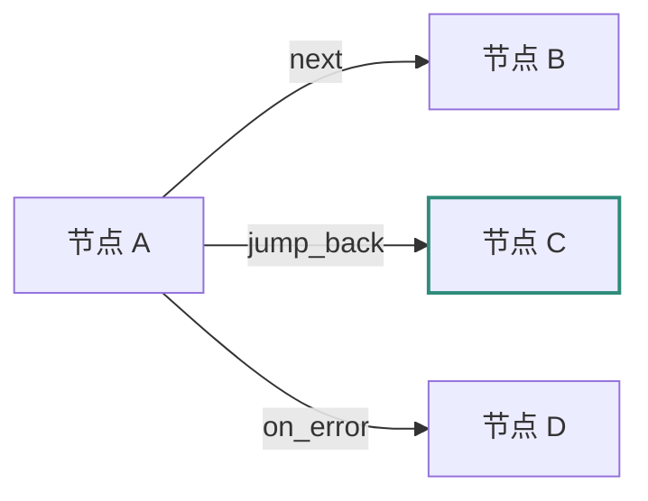
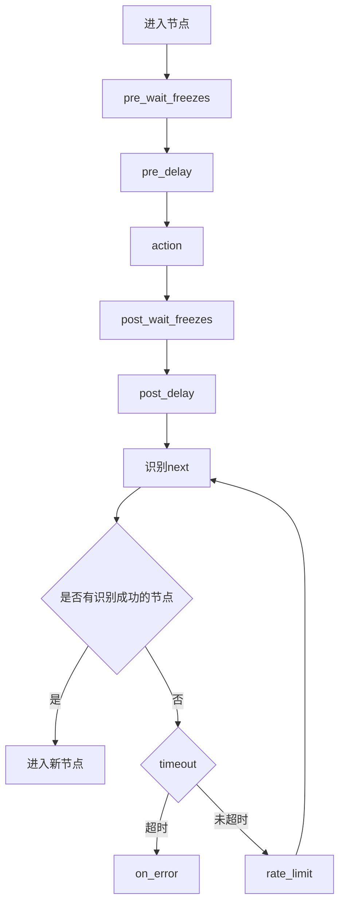

# MaaFramework 流水线术语解释

<cite>
**本文档引用文件**  
- [1.2-术语解释.md](file://instructions/maafw-pipeline/1.2-术语解释.md)
- [3.1-任务流水线协议.md](file://instructions/maafw-pipeline/3.1-任务流水线协议.md)
- [概述.md](file://docsite/docs/01.指南/02.核心概念/10.概述.md)
- [节点.md](file://docsite/docs/01.指南/02.核心概念/20.节点.md)
- [连接.md](file://docsite/docs/01.指南/02.核心概念/40.连接.md)
- [Pipeline 面板.md](file://docsite/docs/01.指南/02.核心概念/80.Pipeline 面板.md)
- [constants.ts](file://src/components/flow/nodes/constants.ts)
- [types.ts](file://src/stores/flow/types.ts)
</cite>

## 目录
1. [MaaFW 专有术语](#maafw-专有术语)
2. [通用术语](#通用术语)
3. [节点类型](#节点类型)
4. [连接机制](#连接机制)
5. [字段结构](#字段结构)
6. [执行流程](#执行流程)

## MaaFW 专有术语

### 节点 (Node)

符合[任务流水线（Pipeline）协议](3.1-任务流水线协议.md)的一个完整 JSON 对象，是任务流程的基本单元。每个节点包含识别、动作、跳转、错误处理、节流、超时、反向匹配、启用状态、最大命中次数、前后延时、前后稳定等待、自定义焦点与附加数据等字段。

### 任务 (Task)

若干**节点**按一定次序相连的逻辑顺序结构，表示从头到尾的整个过程。任务通过指定入口节点启动执行。

### 入口 (Entry)

一个**任务**中的第一个**节点**，是任务执行的起点。

### 流水线 (Pipeline)

一个 `pipeline` 文件夹中包含的所有**节点**的集合。在 MaaPipelineEditor (MPE) 中，也指被编译后的 JSON 代码。

### Bundle

一个按标准资源结构存储的文件夹，包含 `pipeline`、`model`、`image` 等子文件夹。

### 资源 (Resource)

多个 **Bundle** 按一定次序加载形成的资源结构。

### 项目接口 (PI)

`ProjectInterface`，符合 [ProjectInterface 定义](3.2-ProjectInterface协议.md) 的标准化项目结构声明。

### 执行代理 (Agent)

MaaFW v4.x 版本的亮点功能。可将 MaaFW 本体与 `CustomRecognition` / `CustomAction` 分离至独立的两个进程中。例如本体运行在 C# 编写的通用 GUI 中，同时在 Python 代码中运行自定义逻辑，打破语言壁垒。

**Section sources**
- [1.2-术语解释.md](file://instructions/maafw-pipeline/1.2-术语解释.md#maafw-专有术语)

## 通用术语

### 语言绑定 (Binding)

提供将 MaaFW 的 C 语言接口转换为其他编程语言或操作系统服务的胶水代码。

### 感兴趣区域 (ROI)

定义图像识别边界，仅在该区域内进行相关图像处理。

### 文字识别 (OCR)

对包含文本内容的图像进行处理和识别，并提取其中所包含的文字及排版信息。

**Section sources**
- [1.2-术语解释.md](file://instructions/maafw-pipeline/1.2-术语解释.md#通用术语)

## 节点类型

MaaPipelineEditor (MPE) 将节点分为三种类型：**字段节点**、**外部节点**和**Anchor 重定向节点**。

### 字段节点

最常见的节点类型，会直接被一对一地编译为 Pipeline 中的各个节点。它包含完整的四个端点与字段配置功能。

### 外部节点

仅由节点名字段与一个入口端点组成，用于表示其他文件中的节点。当需要在 `next` 等字段中配置其他文件的节点时使用。

### Anchor 重定向节点

一个特殊节点类型，用于标记一个**锚点**的位置。连接到锚点节点的连接会在编译时添加 `[Anchor]` 前缀。

```mermaid
graph TD
A[字段节点] --> |包含| B[节点名]
A --> |包含| C[字段]
A --> |包含| D[端口]
E[外部节点] --> |组成| F[节点名]
E --> |组成| G[入口端点]
H[Anchor 重定向节点] --> |功能| I[标记锚点位置]
I --> |结果| J[编译时添加[Anchor]前缀]
```

**Diagram sources**
- [节点.md](file://docsite/docs/01.指南/02.核心概念/20.节点.md)
- [constants.ts](file://src/components/flow/nodes/constants.ts)

**Section sources**
- [节点.md](file://docsite/docs/01.指南/02.核心概念/20.节点.md)

## 连接机制

连接用于描述两个节点之间的关系，分别对应协议的 `next`、`jump_back`、`on_error` 字段。MPE 依据连接解析 Pipeline 与编译工作流。

### 连接类型

- **Next (正常流程)**: 节点识别成功后执行的后续节点。
- **JumpBack (跳回)**: 当某节点匹配后，系统返回到父节点，从父节点的 Next 列表起始位置继续识别。适用于异常处理场景。
- **OnError (错误处理)**: 当节点识别超时或动作执行失败后，执行的后续节点。

### 连接安全

为保证协议一致性，MPE 实施了连接安全规则：
- 一个节点的 `next` 与 `on_error` 字段内的元素不可重复。
- `jump_back` 连接由于在编译后与 `next` 在同一列表里，因此不允许与 `next` 同时指向同一个节点。



**Diagram sources**
- [连接.md](file://docsite/docs/01.指南/02.核心概念/40.连接.md)
- [types.ts](file://src/stores/flow/types.ts)

**Section sources**
- [连接.md](file://docsite/docs/01.指南/02.核心概念/40.连接.md)

## 字段结构

字段是节点包含的各个键值对，分为一级字段与二级字段。

### 一级字段

- **recognition**: 识别算法类型。
- **action**: 执行的动作。
- **others**: 除 `recognition` 和 `action` 之外的所有属性字段的合集。
- **extras**: 属性字段外的自定义字段。

### 二级字段

即一级字段的 `params`，包含具体的配置参数。

### 字段排序

在节点中，字段的排列遵循“整体有序，局部无序”原则：
- **整体有序**: 一级字段及各自包含的二级字段整体按 `recognition`、`action`、`others`、`extras` 顺序排列。
- **局部无序**: 在一级字段中，各自的二级字段顺序按创建顺序排列。

**Section sources**
- [节点.md](file://docsite/docs/01.指南/02.核心概念/20.节点.md#字段)

## 执行流程

### 基础执行逻辑

1. **任务触发**: 通过 tasker.post_task 接口指定入口节点启动任务。
2. **顺序检测**: 对当前节点的 next 列表进行顺序检测，依次尝试识别每个子节点配置的 recognition 特征。
3. **中断机制**: 当检测到某个子节点匹配成功时，立即终止后续节点检测，执行匹配节点的 action 定义的操作。
4. **后继处理**: 操作执行完成后，将激活节点切换为当前节点，重复执行上述检测流程。

### 终止条件

当满足以下任意条件时，任务流程终止：
- 当前节点的 next 列表为空。
- 所有后继节点持续检测失败直至超时。



**Diagram sources**
- [3.1-任务流水线协议.md](file://instructions/maafw-pipeline/3.1-任务流水线协议.md)
- [types.ts](file://src/stores/flow/types.ts)

**Section sources**
- [3.1-任务流水线协议.md](file://instructions/maafw-pipeline/3.1-任务流水线协议.md#执行逻辑)