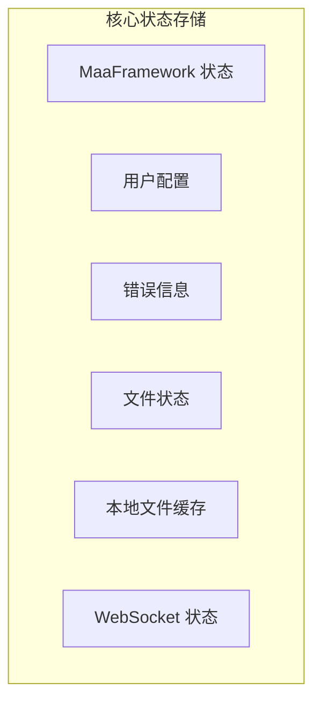
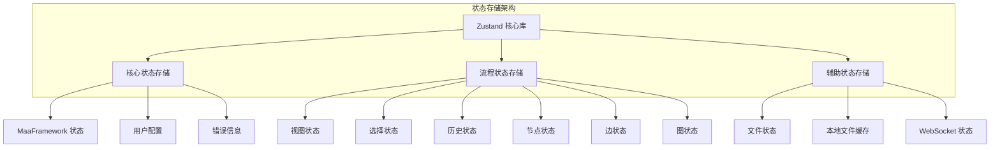
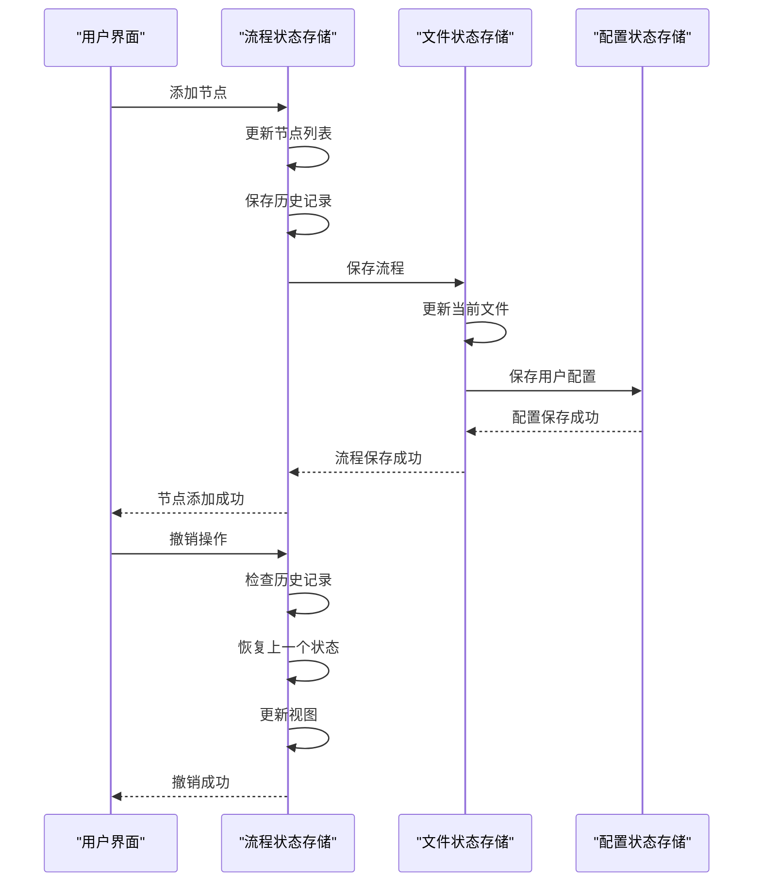
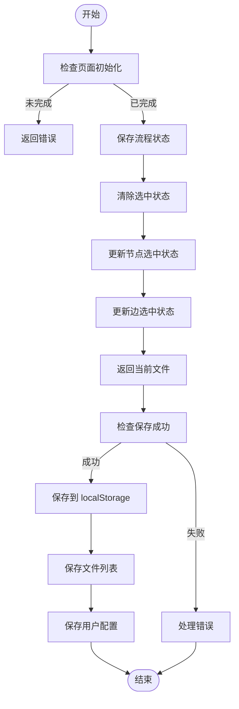
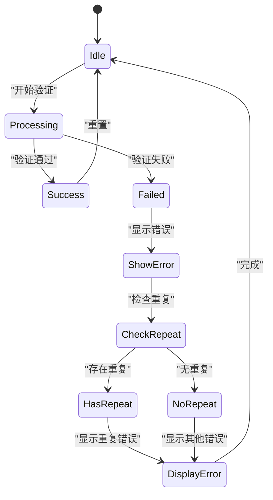

# MaaFramework 状态存储

<cite>
**本文档引用的文件**
- [mfwStore.ts](file://src/stores/mfwStore.ts)
- [configStore.ts](file://src/stores/configStore.ts)
- [errorStore.ts](file://src/stores/errorStore.ts)
- [fileStore.ts](file://src/stores/fileStore.ts)
- [localFileStore.ts](file://src/stores/localFileStore.ts)
- [wsStore.ts](file://src/stores/wsStore.ts)
- [flow/index.ts](file://src/stores/flow/index.ts)
- [flow/types.ts](file://src/stores/flow/types.ts)
- [flow/slices/viewSlice.ts](file://src/stores/flow/slices/viewSlice.ts)
- [flow/slices/selectionSlice.ts](file://src/stores/flow/slices/selectionSlice.ts)
- [flow/slices/historySlice.ts](file://src/stores/flow/slices/historySlice.ts)
- [flow/slices/nodeSlice.ts](file://src/stores/flow/slices/nodeSlice.ts)
- [flow/slices/edgeSlice.ts](file://src/stores/flow/slices/edgeSlice.ts)
- [flow/slices/graphSlice.ts](file://src/stores/flow/slices/graphSlice.ts)
</cite>

## 目录
1. [简介](#简介)
2. [核心状态存储](#核心状态存储)
3. [流程状态存储](#流程状态存储)
4. [状态存储架构](#状态存储架构)
5. [状态存储交互](#状态存储交互)
6. [持久化机制](#持久化机制)
7. [错误处理](#错误处理)
8. [总结](#总结)

## 简介
MaaFramework 状态存储系统是基于 Zustand 实现的前端状态管理解决方案，用于管理可视化流水线编辑器的各种运行时状态。该系统采用模块化设计，将不同功能领域的状态分离到独立的 store 中，确保状态管理的清晰性和可维护性。状态存储涵盖了从用户界面状态到业务逻辑状态的各个方面，包括流程编辑、设备连接、用户配置和文件管理等。

**Section sources**
- [mfwStore.ts](file://src/stores/mfwStore.ts#L1-L134)
- [configStore.ts](file://src/stores/configStore.ts#L1-L107)

## 核心状态存储
MaaFramework 的核心状态存储由多个独立的 store 组成，每个 store 负责管理特定领域的状态。这些 store 使用 Zustand 库实现，提供了类型安全的状态管理。主要的核心状态存储包括 MaaFramework 状态、用户配置、错误信息、文件状态、本地文件缓存和 WebSocket 连接状态。



**Diagram sources**
- [mfwStore.ts](file://src/stores/mfwStore.ts#L1-L134)
- [configStore.ts](file://src/stores/configStore.ts#L1-L107)
- [errorStore.ts](file://src/stores/errorStore.ts#L1-L39)
- [fileStore.ts](file://src/stores/fileStore.ts#L1-L492)
- [localFileStore.ts](file://src/stores/localFileStore.ts#L1-L117)
- [wsStore.ts](file://src/stores/wsStore.ts#L1-L24)

**Section sources**
- [mfwStore.ts](file://src/stores/mfwStore.ts#L1-L134)
- [configStore.ts](file://src/stores/configStore.ts#L1-L107)
- [errorStore.ts](file://src/stores/errorStore.ts#L1-L39)
- [fileStore.ts](file://src/stores/fileStore.ts#L1-L492)
- [localFileStore.ts](file://src/stores/localFileStore.ts#L1-L117)
- [wsStore.ts](file://src/stores/wsStore.ts#L1-L24)

## 流程状态存储
流程状态存储是 MaaFramework 状态管理中最复杂的部分，负责管理可视化流程图的所有状态。它采用切片模式（slices pattern）将不同的状态逻辑分离到独立的模块中，然后通过 `create` 函数组合成一个完整的 store。这种设计提高了代码的可维护性和可测试性。

### 流程状态切片
流程状态存储由多个切片组成，每个切片负责管理特定方面的状态：

```mermaid
classDiagram
class FlowStore {
+ReactFlowInstance instance
+Viewport viewport
+{width : number, height : number} size
+NodeType[] nodes
+EdgeType[] edges
+NodeType[] selectedNodes
+EdgeType[] selectedEdges
+NodeType targetNode
+Array<{nodes : NodeType[], edges : EdgeType[]}> historyStack
+number historyIndex
+number pasteIdCounter
+number nodeIdCounter
}
class FlowViewState {
+ReactFlowInstance instance
+Viewport viewport
+{width : number, height : number} size
+updateInstance(instance)
+updateViewport(viewport)
+updateSize(width, height)
}
class FlowSelectionState {
+NodeType[] selectedNodes
+EdgeType[] selectedEdges
+NodeType targetNode
+updateSelection(nodes, edges)
+setTargetNode(node)
+clearSelection()
}
class FlowHistoryState {
+Array<{nodes : NodeType[], edges : EdgeType[]}> historyStack
+number historyIndex
+saveHistory(delay)
+undo()
+redo()
+initHistory(nodes, edges)
+clearHistory()
}
class FlowNodeState {
+NodeType[] nodes
+number nodeIdCounter
+updateNodes(changes)
+addNode(options)
+setNodeData(id, type, key, value)
+setNodes(nodes)
+resetNodeCounter()
}
class FlowEdgeState {
+EdgeType[] edges
+updateEdges(changes)
+setEdgeData(id, key, value)
+setEdgeLabel(id, newLabel)
+addEdge(co, options)
+setEdges(edges)
}
class FlowGraphState {
+number pasteIdCounter
+replace(nodes, edges, options)
+paste(nodes, edges)
+resetPasteCounter()
+shiftNodes(direction, delta, targetNodeIds)
}
FlowStore --> FlowViewState : "包含"
FlowStore --> FlowSelectionState : "包含"
FlowStore --> FlowHistoryState : "包含"
FlowStore --> FlowNodeState : "包含"
FlowStore --> FlowEdgeState : "包含"
FlowGraphState : "包含"
```

**Diagram sources**
- [flow/index.ts](file://src/stores/flow/index.ts#L1-L78)
- [flow/types.ts](file://src/stores/flow/types.ts#L1-L268)
- [flow/slices/viewSlice.ts](file://src/stores/flow/slices/viewSlice.ts#L1-L28)
- [flow/slices/selectionSlice.ts](file://src/stores/flow/slices/selectionSlice.ts#L1-L101)
- [flow/slices/historySlice.ts](file://src/stores/flow/slices/historySlice.ts#L1-L230)
- [flow/slices/nodeSlice.ts](file://src/stores/flow/slices/nodeSlice.ts#L1-L263)
- [flow/slices/edgeSlice.ts](file://src/stores/flow/slices/edgeSlice.ts#L1-L275)
- [flow/slices/graphSlice.ts](file://src/stores/flow/slices/graphSlice.ts#L1-L160)

**Section sources**
- [flow/index.ts](file://src/stores/flow/index.ts#L1-L78)
- [flow/types.ts](file://src/stores/flow/types.ts#L1-L268)
- [flow/slices/viewSlice.ts](file://src/stores/flow/slices/viewSlice.ts#L1-L28)
- [flow/slices/selectionSlice.ts](file://src/stores/flow/slices/selectionSlice.ts#L1-L101)
- [flow/slices/historySlice.ts](file://src/stores/flow/slices/historySlice.ts#L1-L230)
- [flow/slices/nodeSlice.ts](file://src/stores/flow/slices/nodeSlice.ts#L1-L263)
- [flow/slices/edgeSlice.ts](file://src/stores/flow/slices/edgeSlice.ts#L1-L275)
- [flow/slices/graphSlice.ts](file://src/stores/flow/slices/graphSlice.ts#L1-L160)

## 状态存储架构
MaaFramework 的状态存储采用了分层架构设计，将不同层次的状态分离管理。顶层是各个功能模块的 store，底层是共享的状态管理机制。这种架构确保了状态的单一来源原则，同时提供了良好的扩展性。



**Diagram sources**
- [mfwStore.ts](file://src/stores/mfwStore.ts#L1-L134)
- [configStore.ts](file://src/stores/configStore.ts#L1-L107)
- [errorStore.ts](file://src/stores/errorStore.ts#L1-L39)
- [fileStore.ts](file://src/stores/fileStore.ts#L1-L492)
- [localFileStore.ts](file://src/stores/localFileStore.ts#L1-L117)
- [wsStore.ts](file://src/stores/wsStore.ts#L1-L24)
- [flow/index.ts](file://src/stores/flow/index.ts#L1-L78)

**Section sources**
- [mfwStore.ts](file://src/stores/mfwStore.ts#L1-L134)
- [configStore.ts](file://src/stores/configStore.ts#L1-L107)
- [errorStore.ts](file://src/stores/errorStore.ts#L1-L39)
- [fileStore.ts](file://src/stores/fileStore.ts#L1-L492)
- [localFileStore.ts](file://src/stores/localFileStore.ts#L1-L117)
- [wsStore.ts](file://src/stores/wsStore.ts#L1-L24)
- [flow/index.ts](file://src/stores/flow/index.ts#L1-L78)

## 状态存储交互
状态存储之间的交互通过明确的 API 进行，确保了状态变更的可预测性和可追踪性。各个 store 之间通过导入和调用彼此的方法来实现协作，形成了一个紧密耦合但职责分明的状态管理系统。



**Diagram sources**
- [flow/index.ts](file://src/stores/flow/index.ts#L1-L78)
- [fileStore.ts](file://src/stores/fileStore.ts#L1-L492)
- [configStore.ts](file://src/stores/configStore.ts#L1-L107)

**Section sources**
- [flow/index.ts](file://src/stores/flow/index.ts#L1-L78)
- [fileStore.ts](file://src/stores/fileStore.ts#L1-L492)
- [configStore.ts](file://src/stores/configStore.ts#L1-L107)

## 持久化机制
MaaFramework 状态存储的持久化机制主要通过 localStorage 实现，确保用户配置和文件状态在页面刷新后不会丢失。持久化操作在适当的时间点自动触发，平衡了性能和数据安全的需求。



**Diagram sources**
- [fileStore.ts](file://src/stores/fileStore.ts#L72-L103)
- [configStore.ts](file://src/stores/configStore.ts#L97-L99)

**Section sources**
- [fileStore.ts](file://src/stores/fileStore.ts#L72-L103)
- [configStore.ts](file://src/stores/configStore.ts#L97-L99)

## 错误处理
MaaFramework 状态存储系统内置了完善的错误处理机制，能够捕获和处理各种运行时错误。错误信息被集中管理，便于用户查看和开发者调试。



**Diagram sources**
- [errorStore.ts](file://src/stores/errorStore.ts#L1-L39)
- [fileStore.ts](file://src/stores/fileStore.ts#L139-L158)
- [flow/index.ts](file://src/stores/flow/index.ts#L58-L77)

**Section sources**
- [errorStore.ts](file://src/stores/errorStore.ts#L1-L39)
- [fileStore.ts](file://src/stores/fileStore.ts#L139-L158)
- [flow/index.ts](file://src/stores/flow/index.ts#L58-L77)

## 总结
MaaFramework 状态存储系统是一个精心设计的状态管理解决方案，它通过模块化、切片化的设计模式，有效地管理了复杂的应用状态。系统采用 Zustand 作为核心状态管理库，结合 TypeScript 提供了类型安全的状态操作。流程状态存储的切片模式使得代码结构清晰，易于维护和扩展。持久化机制确保了用户数据的安全，而完善的错误处理机制则提高了系统的健壮性。整体架构体现了现代前端应用状态管理的最佳实践。