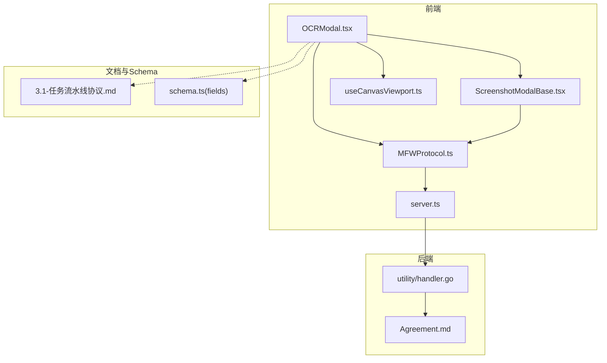
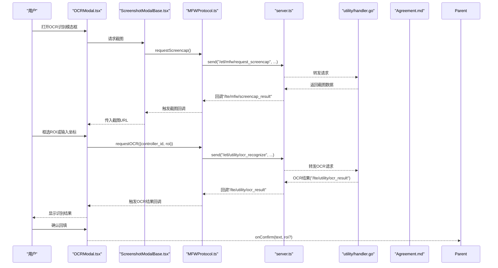
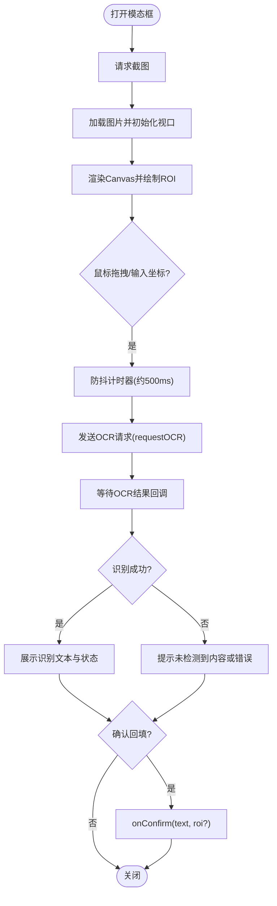
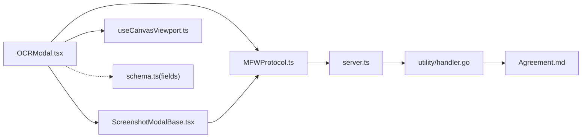

# OCR识别模态框

<cite>
**本文引用的文件列表**
- [OCRModal.tsx](file://src/components/modals/OCRModal.tsx)
- [ScreenshotModalBase.tsx](file://src/components/modals/ScreenshotModalBase.tsx)
- [MFWProtocol.ts](file://src/services/protocols/MFWProtocol.ts)
- [server.ts](file://src/services/server.ts)
- [useCanvasViewport.ts](file://src/hooks/useCanvasViewport.ts)
- [handler.go](file://LocalBridge/internal/protocol/utility/handler.go)
- [Agreement.md](file://LocalBridge/Agreement.md)
- [3.1-任务流水线协议.md](file://instructions/maafw-pipeline/3.1-任务流水线协议.md)
- [schema.ts](file://src/core/fields/recognition/schema.ts)
- [fields.ts](file://src/core/fields/recognition/fields.ts)
</cite>

## 目录
1. [引言](#引言)
2. [项目结构](#项目结构)
3. [核心组件](#核心组件)
4. [架构总览](#架构总览)
5. [详细组件分析](#详细组件分析)
6. [依赖关系分析](#依赖关系分析)
7. [性能考虑](#性能考虑)
8. [故障排查指南](#故障排查指南)
9. [结论](#结论)
10. [附录](#附录)

## 引言
本文件面向使用者与开发者，系统化说明“OCR识别模态框”的功能、交互流程、数据流与集成点，帮助用户在界面中快速框选目标区域并获取文字识别结果，同时为开发者提供代码级理解与扩展指引。文档涵盖前端模态框、截图与视口控制、协议通信、后端OCR执行链路，以及识别字段配置要点。

## 项目结构
围绕OCR识别模态框的关键文件组织如下：
- 前端模态框与截图基座：OCRModal.tsx、ScreenshotModalBase.tsx
- 视口控制Hook：useCanvasViewport.ts
- 协议与WebSocket：MFWProtocol.ts、server.ts
- 后端协议处理：LocalBridge/internal/protocol/utility/handler.go
- 协议与文档：LocalBridge/Agreement.md、instructions/maafw-pipeline/3.1-任务流水线协议.md
- 识别字段Schema与类型：src/core/fields/recognition/schema.ts、fields.ts

图表来源
- [OCRModal.tsx](file://src/components/modals/OCRModal.tsx#L1-L485)
- [ScreenshotModalBase.tsx](file://src/components/modals/ScreenshotModalBase.tsx#L1-L293)
- [useCanvasViewport.ts](file://src/hooks/useCanvasViewport.ts#L1-L307)
- [MFWProtocol.ts](file://src/services/protocols/MFWProtocol.ts#L1-L398)
- [server.ts](file://src/services/server.ts#L1-L298)
- [handler.go](file://LocalBridge/internal/protocol/utility/handler.go#L44-L242)
- [Agreement.md](file://LocalBridge/Agreement.md#L245-L735)
- [3.1-任务流水线协议.md](file://instructions/maafw-pipeline/3.1-任务流水线协议.md#L423-L463)
- [schema.ts](file://src/core/fields/recognition/schema.ts#L1-L241)

章节来源
- [OCRModal.tsx](file://src/components/modals/OCRModal.tsx#L1-L485)
- [ScreenshotModalBase.tsx](file://src/components/modals/ScreenshotModalBase.tsx#L1-L293)
- [MFWProtocol.ts](file://src/services/protocols/MFWProtocol.ts#L1-L398)
- [server.ts](file://src/services/server.ts#L1-L298)
- [handler.go](file://LocalBridge/internal/protocol/utility/handler.go#L44-L242)
- [Agreement.md](file://LocalBridge/Agreement.md#L245-L735)
- [3.1-任务流水线协议.md](file://instructions/maafw-pipeline/3.1-任务流水线协议.md#L423-L463)
- [schema.ts](file://src/core/fields/recognition/schema.ts#L1-L241)

## 核心组件
- OCRModal.tsx：提供OCR识别的交互界面，支持截图预览、框选ROI、手动输入坐标、防抖触发识别、结果显示与确认回填。
- ScreenshotModalBase.tsx：通用截图模态基座，负责请求截图、缩放/平移、工具栏与底部操作区。
- useCanvasViewport.ts：封装缩放、平移、滚轮缩放、空格/中键拖拽、光标状态等视口控制逻辑。
- MFWProtocol.ts：前端协议层，封装请求截图、注册OCR结果回调、发送OCR识别请求等。
- server.ts：WebSocket客户端封装，负责握手、路由注册、消息收发与连接状态管理。
- utility/handler.go：后端Utility路由处理OCR识别请求，执行截图、OCR任务、解析结果并回传。

章节来源
- [OCRModal.tsx](file://src/components/modals/OCRModal.tsx#L1-L485)
- [ScreenshotModalBase.tsx](file://src/components/modals/ScreenshotModalBase.tsx#L1-L293)
- [useCanvasViewport.ts](file://src/hooks/useCanvasViewport.ts#L1-L307)
- [MFWProtocol.ts](file://src/services/protocols/MFWProtocol.ts#L1-L398)
- [server.ts](file://src/services/server.ts#L1-L298)
- [handler.go](file://LocalBridge/internal/protocol/utility/handler.go#L44-L242)

## 架构总览
OCR识别模态框的端到端流程如下：
- 用户打开OCR模态框，基座组件请求截图。
- 前端收到截图后，渲染到Canvas并叠加ROI矩形。
- 用户框选ROI或手动输入坐标，触发防抖OCR请求。
- 前端通过MFW协议向后端发送OCR识别请求。
- 后端执行OCR识别，返回结果给前端。
- 前端展示识别结果，用户确认后将文本与ROI回填至节点字段。

图表来源
- [OCRModal.tsx](file://src/components/modals/OCRModal.tsx#L1-L485)
- [ScreenshotModalBase.tsx](file://src/components/modals/ScreenshotModalBase.tsx#L1-L293)
- [MFWProtocol.ts](file://src/services/protocols/MFWProtocol.ts#L1-L398)
- [server.ts](file://src/services/server.ts#L1-L298)
- [handler.go](file://LocalBridge/internal/protocol/utility/handler.go#L44-L242)
- [Agreement.md](file://LocalBridge/Agreement.md#L245-L735)

## 详细组件分析

### 组件A：OCR识别模态框（OCRModal）
- 职责
  - 管理截图状态、ROI矩形、识别结果与UI反馈。
  - 提供Canvas绘制ROI、鼠标框选、坐标输入、防抖触发OCR、确认回填。
  - 与截图基座协作，复用缩放/平移/工具栏。
- 关键交互
  - 打开时请求截图，加载图片并初始化视口。
  - 鼠标左键拖拽绘制ROI，松开后触发防抖OCR。
  - 手动输入X/Y/W/H后自动触发防抖OCR。
  - 支持清空识别结果、重新截图、关闭与确认。
- 数据流
  - 输入：open、onClose、onConfirm、initialROI。
  - 输出：确认时回传text与可选ROI。
  - 中间态：screenshot、rectangle、isOCRing、ocrText、ocrSuccess。

图表来源
- [OCRModal.tsx](file://src/components/modals/OCRModal.tsx#L1-L485)

章节来源
- [OCRModal.tsx](file://src/components/modals/OCRModal.tsx#L1-L485)

### 组件B：截图模态框基座（ScreenshotModalBase）
- 职责
  - 统一管理截图请求、结果回调、视口控制与工具栏。
  - 提供缩放、重置、重新截图、确认与取消等操作。
- 关键点
  - requestScreenshot：通过MFW协议请求截图。
  - onScreencapResult：接收截图结果并更新状态。
  - renderCanvas：将视口Props与截图传递给子组件渲染Canvas。

章节来源
- [ScreenshotModalBase.tsx](file://src/components/modals/ScreenshotModalBase.tsx#L1-L293)

### 组件C：视口控制Hook（useCanvasViewport）
- 职责
  - 管理缩放比例、平移偏移、空格键与中键拖拽状态。
  - 提供滚轮缩放、按钮缩放、重置视口、初始化图片尺寸与居中。
- 关键点
  - 滚轮缩放以鼠标位置为中心，保持视觉一致性。
  - 空格键或中键按下时进入拖拽模式，拖动更新panOffset。

章节来源
- [useCanvasViewport.ts](file://src/hooks/useCanvasViewport.ts#L1-L307)

### 组件D：协议与WebSocket（MFWProtocol、server）
- MFWProtocol
  - 提供requestScreencap、onScreencapResult、requestOCR、onOCRResult等方法。
  - 注册路由：/lte/mfw/screencap_result、/lte/utility/ocr_result。
- server（LocalWebSocketServer）
  - 负责握手、连接状态、消息路由与发送。
  - initializeWebSocket：注册协议并监听连接状态。

章节来源
- [MFWProtocol.ts](file://src/services/protocols/MFWProtocol.ts#L1-L398)
- [server.ts](file://src/services/server.ts#L1-L298)

### 组件E：后端OCR处理（utility/handler.go）
- 职责
  - 处理OCR识别请求，解析ROI，执行截图与OCR任务，回传结果。
  - 错误处理：ROI格式错误、OCR失败、任务提交失败等。
- 关键点
  - 路由：/etl/utility/ocr_recognize -> /lte/utility/ocr_result。
  - 执行流程：PostScreencap -> PostTask(OCR) -> Wait -> GetDetail -> parseOCRResult。

章节来源
- [handler.go](file://LocalBridge/internal/protocol/utility/handler.go#L44-L242)
- [Agreement.md](file://LocalBridge/Agreement.md#L245-L735)

### 组件F：识别字段Schema与类型（schema.ts、fields.ts）
- 职责
  - 定义识别字段的键、类型、默认值与描述，支撑节点配置。
  - OCR字段包含roi、roiOffset、ocrExpected、ocrThreshold、replace、lengthExpectedOrderBy、index、onlyRec、ocrModel等。
- 关键点
  - roi/roiOffset支持数组或字符串引用先前节点的识别范围。
  - index支持负索引，仅在结果集范围内有效。

章节来源
- [schema.ts](file://src/core/fields/recognition/schema.ts#L1-L241)
- [fields.ts](file://src/core/fields/recognition/fields.ts#L1-L49)

## 依赖关系分析
- 前端耦合
  - OCRModal依赖ScreenshotModalBase、useCanvasViewport、MFWProtocol。
  - ScreenshotModalBase依赖useCanvasViewport与MFWProtocol。
  - MFWProtocol依赖server.ts提供的WebSocket客户端。
- 后端耦合
  - Utility路由处理器依赖MFW服务的ControllerManager与ResourceManager，最终调用OCR任务执行链。
- 协议契约
  - 前后端通过Agreement.md定义的路由与数据结构对齐，确保OCR请求与结果格式一致。

图表来源
- [OCRModal.tsx](file://src/components/modals/OCRModal.tsx#L1-L485)
- [ScreenshotModalBase.tsx](file://src/components/modals/ScreenshotModalBase.tsx#L1-L293)
- [useCanvasViewport.ts](file://src/hooks/useCanvasViewport.ts#L1-L307)
- [MFWProtocol.ts](file://src/services/protocols/MFWProtocol.ts#L1-L398)
- [server.ts](file://src/services/server.ts#L1-L298)
- [handler.go](file://LocalBridge/internal/protocol/utility/handler.go#L44-L242)
- [Agreement.md](file://LocalBridge/Agreement.md#L245-L735)
- [schema.ts](file://src/core/fields/recognition/schema.ts#L1-L241)

## 性能考虑
- 防抖策略
  - 框选或坐标变更后延迟约500ms触发OCR，避免频繁请求导致性能与资源浪费。
- 缩放与渲染
  - Canvas按缩放比例与平移偏移渲染，滚轮缩放以鼠标为中心，减少重绘成本。
- ROI大小
  - 建议尽量缩小ROI，减少OCR计算量；仅在必要时使用全屏识别。
- 仅识别模式（OnlyRec）
  - 在固定位置、固定字体场景下启用OnlyRec可显著提升速度，但需精确ROI。

章节来源
- [OCRModal.tsx](file://src/components/modals/OCRModal.tsx#L1-L485)
- [useCanvasViewport.ts](file://src/hooks/useCanvasViewport.ts#L1-L307)
- [3.1-任务流水线协议.md](file://instructions/maafw-pipeline/3.1-任务流水线协议.md#L423-L463)

## 故障排查指南
- 无法连接本地服务
  - 检查server.ts的连接状态回调与错误提示，确认端口与握手版本匹配。
- 截图失败
  - 确认控制器已连接且controller_id有效；检查MFW协议路由与后端转发。
- OCR无结果
  - 检查ROI是否过小或过大；尝试调整阈值与排序方式；必要时切换OnlyRec模式。
- ROI格式错误
  - 后端对ROI格式有严格校验，需为[x, y, w, h]数组；前端已做四舍五入处理。
- 确认按钮不可用
  - 当未识别到文本或仍在识别中时，确认按钮会被禁用；等待识别完成或手动输入文本。

章节来源
- [server.ts](file://src/services/server.ts#L1-L298)
- [MFWProtocol.ts](file://src/services/protocols/MFWProtocol.ts#L1-L398)
- [handler.go](file://LocalBridge/internal/protocol/utility/handler.go#L44-L242)
- [Agreement.md](file://LocalBridge/Agreement.md#L245-L735)
- [OCRModal.tsx](file://src/components/modals/OCRModal.tsx#L1-L485)

## 结论
OCR识别模态框通过“截图基座+视口控制+协议通信+后端OCR执行”的完整链路，实现了直观、高效的文本识别体验。前端采用防抖与仅识别模式等策略优化性能，后端提供严格的路由与错误处理保障稳定性。结合识别字段Schema，用户可在节点配置中灵活设置ROI、阈值、排序与模型等参数，满足多样化的识别需求。

## 附录
- 识别字段要点（节选）
  - roi/roiOffset：支持数组或字符串引用先前节点识别范围。
  - ocrExpected：支持正则表达式，便于灵活匹配。
  - ocrThreshold：置信度阈值，影响召回与精度平衡。
  - replace：对常见错误字符进行替换。
  - orderBy/index：结果排序与索引选择。
  - onlyRec：仅识别模式，需精确ROI。
  - ocrModel：模型文件夹路径，需包含rec.onnx、det.onnx、keys.txt。

章节来源
- [schema.ts](file://src/core/fields/recognition/schema.ts#L1-L241)
- [fields.ts](file://src/core/fields/recognition/fields.ts#L1-L49)
- [3.1-任务流水线协议.md](file://instructions/maafw-pipeline/3.1-任务流水线协议.md#L423-L463)