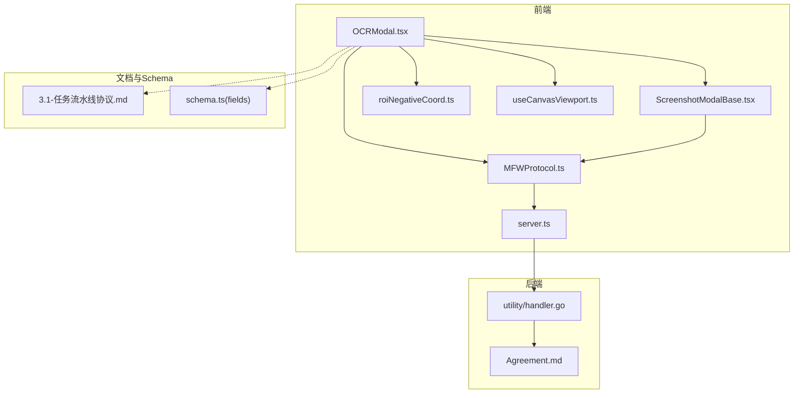
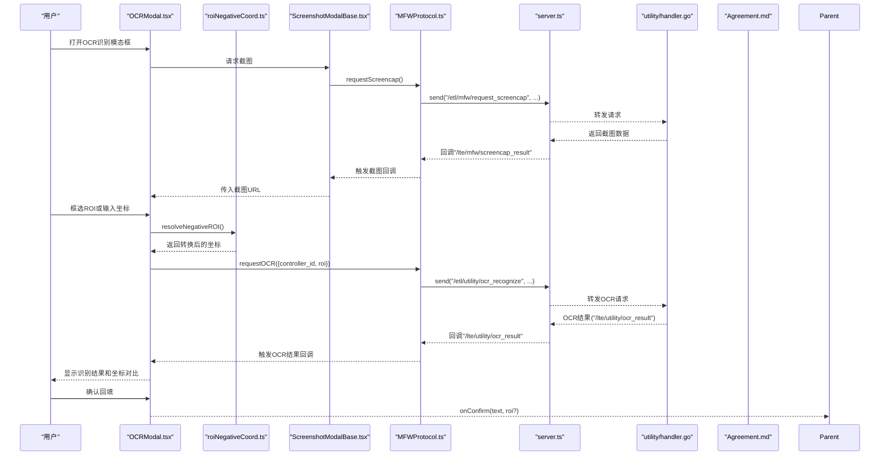
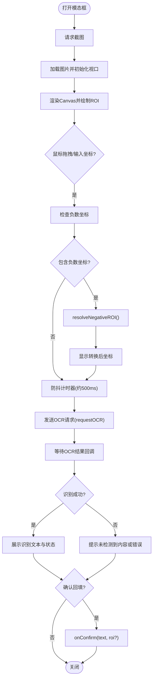
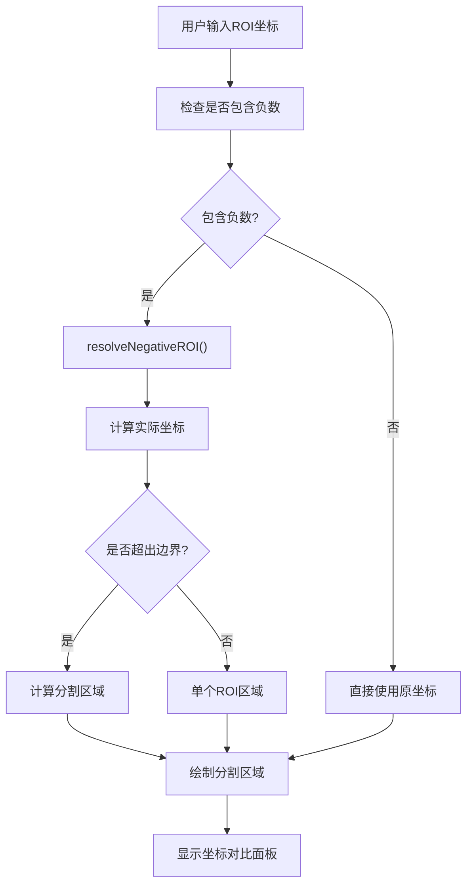
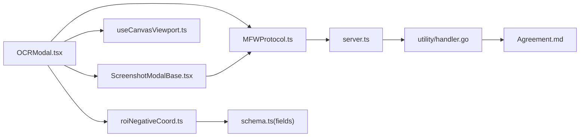

# OCR识别模态框

<cite>
**本文引用的文件列表**
- [OCRModal.tsx](file://src/components/modals/OCRModal.tsx)
- [ScreenshotModalBase.tsx](file://src/components/modals/ScreenshotModalBase.tsx)
- [roiNegativeCoord.ts](file://src/utils/roiNegativeCoord.ts)
- [MFWProtocol.ts](file://src/services/protocols/MFWProtocol.ts)
- [server.ts](file://src/services/server.ts)
- [useCanvasViewport.ts](file://src/hooks/useCanvasViewport.ts)
- [handler.go](file://LocalBridge/internal/protocol/utility/handler.go)
- [Agreement.md](file://LocalBridge/Agreement.md)
- [3.1-任务流水线协议.md](file://instructions/maafw-pipeline/3.1-任务流水线协议.md)
- [schema.ts](file://src/core/fields/recognition/schema.ts)
- [fields.ts](file://src/core/fields/recognition/fields.ts)
</cite>

## 更新摘要
**变更内容**
- 新增ROI坐标转换可视化功能，用户可以实时查看原始坐标和转换后的坐标对比
- 增强负数坐标处理的可视化展示，包括分割区域的绘制和坐标说明
- 优化Canvas绘制逻辑，支持负数坐标的分割显示和扩展边距标注

## 目录
1. [引言](#引言)
2. [项目结构](#项目结构)
3. [核心组件](#核心组件)
4. [架构总览](#架构总览)
5. [详细组件分析](#详细组件分析)
6. [ROI坐标转换可视化](#roi坐标转换可视化)
7. [依赖关系分析](#依赖关系分析)
8. [性能考虑](#性能考虑)
9. [故障排查指南](#故障排查指南)
10. [结论](#结论)
11. [附录](#附录)

## 引言
本文件面向使用者与开发者，系统化说明"OCR识别模态框"的功能、交互流程、数据流与集成点，帮助用户在界面中快速框选目标区域并获取文字识别结果，同时为开发者提供代码级理解与扩展指引。文档涵盖前端模态框、截图与视口控制、协议通信、后端OCR执行链路，以及识别字段配置要点。**更新**：新增ROI坐标转换可视化功能，用户可以直观看到原始坐标和转换后的坐标对比。

## 项目结构
围绕OCR识别模态框的关键文件组织如下：
- 前端模态框与截图基座：OCRModal.tsx、ScreenshotModalBase.tsx
- ROI坐标处理工具：roiNegativeCoord.ts
- 视口控制Hook：useCanvasViewport.ts
- 协议与WebSocket：MFWProtocol.ts、server.ts
- 后端协议处理：LocalBridge/internal/protocol/utility/handler.go
- 协议与文档：LocalBridge/Agreement.md、instructions/maafw-pipeline/3.1-任务流水线协议.md
- 识别字段Schema与类型：src/core/fields/recognition/schema.ts、fields.ts

```mermaid
graph TB
subgraph "前端"
OCR["OCRModal.tsx"]
Base["ScreenshotModalBase.tsx"]
Utils["roiNegativeCoord.ts"]
Hook["useCanvasViewport.ts"]
Proto["MFWProtocol.ts"]
WS["server.ts"]
end
subgraph "后端"
UH["utility/handler.go"]
AG["Agreement.md"]
end
subgraph "文档与Schema"
DOC["3.1-任务流水线协议.md"]
SCHEMA["schema.ts(fields)"]
end
OCR --> Base
OCR --> Utils
OCR --> Hook
OCR --> Proto
Base --> Proto
Proto --> WS
WS --> UH
UH --> AG
OCR -.-> DOC
OCR -.-> SCHEMA
```

**图表来源**
- [OCRModal.tsx](file://src/components/modals/OCRModal.tsx#L1-L1059)
- [ScreenshotModalBase.tsx](file://src/components/modals/ScreenshotModalBase.tsx#L1-L405)
- [roiNegativeCoord.ts](file://src/utils/roiNegativeCoord.ts#L1-L313)

**章节来源**
- [OCRModal.tsx](file://src/components/modals/OCRModal.tsx#L1-L1059)
- [ScreenshotModalBase.tsx](file://src/components/modals/ScreenshotModalBase.tsx#L1-L405)
- [roiNegativeCoord.ts](file://src/utils/roiNegativeCoord.ts#L1-L313)
- [MFWProtocol.ts](file://src/services/protocols/MFWProtocol.ts#L1-L398)
- [server.ts](file://src/services/server.ts#L1-L298)
- [handler.go](file://LocalBridge/internal/protocol/utility/handler.go#L44-L242)
- [Agreement.md](file://LocalBridge/Agreement.md#L245-L735)
- [3.1-任务流水线协议.md](file://instructions/maafw-pipeline/3.1-任务流水线协议.md#L423-L463)
- [schema.ts](file://src/core/fields/recognition/schema.ts#L1-L241)

## 核心组件
- OCRModal.tsx：提供OCR识别的交互界面，支持截图预览、框选ROI、手动输入坐标、防抖触发识别、结果显示与确认回填。**更新**：新增ROI坐标转换可视化功能。
- ScreenshotModalBase.tsx：通用截图模态基座，负责请求截图、缩放/平移、工具栏与底部操作区。
- roiNegativeCoord.ts：ROI坐标转换工具，处理负数坐标、分割区域计算、扩展边距标注等。
- useCanvasViewport.ts：封装缩放、平移、滚轮缩放、空格/中键拖拽、光标状态等视口控制逻辑。
- MFWProtocol.ts：前端协议层，封装请求截图、注册OCR结果回调、发送OCR识别请求等。
- server.ts：WebSocket客户端封装，负责握手、路由注册、消息收发与连接状态管理。
- utility/handler.go：后端Utility路由处理OCR识别请求，执行截图、OCR任务、解析结果并回传。

**章节来源**
- [OCRModal.tsx](file://src/components/modals/OCRModal.tsx#L1-L1059)
- [ScreenshotModalBase.tsx](file://src/components/modals/ScreenshotModalBase.tsx#L1-L405)
- [roiNegativeCoord.ts](file://src/utils/roiNegativeCoord.ts#L1-L313)
- [useCanvasViewport.ts](file://src/hooks/useCanvasViewport.ts#L1-L307)
- [MFWProtocol.ts](file://src/services/protocols/MFWProtocol.ts#L1-L398)
- [server.ts](file://src/services/server.ts#L1-L298)
- [handler.go](file://LocalBridge/internal/protocol/utility/handler.go#L44-L242)

## 架构总览
OCR识别模态框的端到端流程如下：
- 用户打开OCR模态框，基座组件请求截图。
- 前端收到截图后，渲染到Canvas并叠加ROI矩形。
- 用户框选ROI或手动输入坐标，触发防抖OCR请求。
- **更新**：前端通过ROI坐标转换工具解析负数坐标，计算分割区域并可视化显示。
- 前端通过MFW协议向后端发送OCR识别请求。
- 后端执行OCR识别，返回结果给前端。
- 前端展示识别结果，用户确认后将文本与ROI回填至节点字段。

```mermaid
sequenceDiagram
participant U as "用户"
participant OCR as "OCRModal.tsx"
participant Utils as "roiNegativeCoord.ts"
participant Base as "ScreenshotModalBase.tsx"
participant Proto as "MFWProtocol.ts"
participant WS as "server.ts"
participant UT as "utility/handler.go"
participant BR as "Agreement.md"
U->>OCR : 打开OCR识别模态框
OCR->>Base : 请求截图
Base->>Proto : requestScreencap()
Proto->>WS : send("/etl/mfw/request_screencap", ...)
WS-->>UT : 转发请求
UT-->>WS : 返回截图数据
WS-->>Proto : 回调"/lte/mfw/screencap_result"
Proto-->>Base : 触发截图回调
Base-->>OCR : 传入截图URL
U->>OCR : 框选ROI或输入坐标
OCR->>Utils : resolveNegativeROI()
Utils-->>OCR : 返回转换后的坐标
OCR->>Proto : requestOCR({controller_id, roi})
Proto->>WS : send("/etl/utility/ocr_recognize", ...)
WS-->>UT : 转发OCR请求
UT-->>WS : OCR结果("/lte/utility/ocr_result")
WS-->>Proto : 回调"/lte/utility/ocr_result"
Proto-->>OCR : 触发OCR结果回调
OCR-->>U : 显示识别结果和坐标对比
U->>OCR : 确认回填
OCR-->>Parent : onConfirm(text, roi?)
```

**图表来源**
- [OCRModal.tsx](file://src/components/modals/OCRModal.tsx#L1-L1059)
- [roiNegativeCoord.ts](file://src/utils/roiNegativeCoord.ts#L55-L178)
- [ScreenshotModalBase.tsx](file://src/components/modals/ScreenshotModalBase.tsx#L1-L405)
- [MFWProtocol.ts](file://src/services/protocols/MFWProtocol.ts#L1-L398)
- [server.ts](file://src/services/server.ts#L1-L298)
- [handler.go](file://LocalBridge/internal/protocol/utility/handler.go#L44-L242)
- [Agreement.md](file://LocalBridge/Agreement.md#L245-L735)

## 详细组件分析

### 组件A：OCR识别模态框（OCRModal）
- 职责
  - 管理截图状态、ROI矩形、识别结果与UI反馈。
  - 提供Canvas绘制ROI、鼠标框选、坐标输入、防抖触发OCR、确认回填。
  - **更新**：集成ROI坐标转换工具，实时显示原始坐标和转换后的坐标对比。
  - 与截图基座协作，复用缩放/平移/工具栏。
- 关键交互
  - 打开时请求截图，加载图片并初始化视口。
  - 鼠标左键拖拽绘制ROI，松开后触发防抖OCR。
  - 手动输入X/Y/W/H后自动触发防抖OCR。
  - **更新**：当ROI包含负数坐标时，自动计算并显示转换后的坐标区域。
  - 支持清空识别结果、重新截图、关闭与确认。
- 数据流
  - 输入：open、onClose、onConfirm、initialROI。
  - 输出：确认时回传text与可选ROI。
  - 中间态：screenshot、rectangle、isOCRing、ocrText、ocrSuccess。

```mermaid
flowchart TD
Start(["打开模态框"]) --> ReqCap["请求截图"]
ReqCap --> LoadImg["加载图片并初始化视口"]
LoadImg --> Draw["渲染Canvas并绘制ROI"]
Draw --> Drag{"鼠标拖拽/输入坐标?"}
Drag --> |是| CheckNeg["检查负数坐标"]
CheckNeg --> HasNeg{"包含负数坐标?"}
HasNeg --> |是| Resolve["resolveNegativeROI()"]
HasNeg --> |否| Debounce["防抖计时器(约500ms)"]
Resolve --> ShowCoords["显示转换后坐标"]
ShowCoords --> Debounce
Debounce --> SendOCR["发送OCR请求(requestOCR)"]
SendOCR --> Wait["等待OCR结果回调"]
Wait --> Result{"识别成功?"}
Result --> |是| Show["展示识别文本与状态"]
Result --> |否| Hint["提示未检测到内容或错误"]
Show --> Confirm{"确认回填?"}
Hint --> Confirm
Confirm --> |是| Return["onConfirm(text, roi?)"]
Confirm --> |否| End(["关闭"])
Return --> End
```

**图表来源**
- [OCRModal.tsx](file://src/components/modals/OCRModal.tsx#L1-L1059)
- [roiNegativeCoord.ts](file://src/utils/roiNegativeCoord.ts#L55-L178)

**章节来源**
- [OCRModal.tsx](file://src/components/modals/OCRModal.tsx#L1-L1059)

### 组件B：截图模态框基座（ScreenshotModalBase）
- 职责
  - 统一管理截图请求、结果回调、视口控制与工具栏。
  - 提供缩放、重置、重新截图、确认与取消等操作。
- 关键点
  - requestScreenshot：通过MFW协议请求截图。
  - onScreencapResult：接收截图结果并更新状态。
  - renderCanvas：将视口Props与截图传递给子组件渲染Canvas。

**章节来源**
- [ScreenshotModalBase.tsx](file://src/components/modals/ScreenshotModalBase.tsx#L1-L405)

### 组件C：ROI坐标转换工具（roiNegativeCoord）
- 职责
  - 处理负数坐标转换，计算实际坐标、分割区域、扩展边距等。
  - 提供Canvas绘制辅助函数，支持扩展边距标注和负坐标说明。
- 关键功能
  - resolveNegativeROI：解析负数坐标为实际坐标，处理x/y负数、w/h为0或负数的情况。
  - splitROI：计算超出边界的分割区域，支持左上角和右下角区域。
  - 绘制辅助：drawExpandedPadding、drawNegativeCoordLabels等。
- 支持的坐标规则
  - x负数：从右边缘计算
  - y负数：从下边缘计算
  - w为0：延伸至右边缘
  - h为0：延伸至下边缘
  - w/h为负数：取绝对值，(x,y)视为右下角

**章节来源**
- [roiNegativeCoord.ts](file://src/utils/roiNegativeCoord.ts#L1-L313)

### 组件D：视口控制Hook（useCanvasViewport）
- 职责
  - 管理缩放比例、平移偏移、空格键与中键拖拽状态。
  - 提供滚轮缩放、按钮缩放、重置视口、初始化图片尺寸与居中。
- 关键点
  - 滚轮缩放以鼠标位置为中心，保持视觉一致性。
  - 空格键或中键按下时进入拖拽模式，拖动更新panOffset。

**章节来源**
- [useCanvasViewport.ts](file://src/hooks/useCanvasViewport.ts#L1-L307)

### 组件E：协议与WebSocket（MFWProtocol、server）
- MFWProtocol
  - 提供requestScreencap、onScreencapResult、requestOCR、onOCRResult等方法。
  - 注册路由：/lte/mfw/screencap_result、/lte/utility/ocr_result。
- server（LocalWebSocketServer）
  - 负责握手、连接状态、消息路由与发送。
  - initializeWebSocket：注册协议并监听连接状态。

**章节来源**
- [MFWProtocol.ts](file://src/services/protocols/MFWProtocol.ts#L1-L398)
- [server.ts](file://src/services/server.ts#L1-L298)

### 组件F：后端OCR处理（utility/handler.go）
- 职责
  - 处理OCR识别请求，解析ROI，执行截图与OCR任务，回传结果。
  - 错误处理：ROI格式错误、OCR失败、任务提交失败等。
- 关键点
  - 路由：/etl/utility/ocr_recognize -> /lte/utility/ocr_result。
  - 执行流程：PostScreencap -> PostTask(OCR) -> Wait -> GetDetail -> parseOCRResult。

**章节来源**
- [handler.go](file://LocalBridge/internal/protocol/utility/handler.go#L44-L242)
- [Agreement.md](file://LocalBridge/Agreement.md#L245-L735)

### 组件G：识别字段Schema与类型（schema.ts、fields.ts）
- 职责
  - 定义识别字段的键、类型、默认值与描述，支撑节点配置。
  - OCR字段包含roi、roiOffset、ocrExpected、ocrThreshold、replace、lengthExpectedOrderBy、index、onlyRec、ocrModel等。
- 关键点
  - roi/roiOffset支持数组或字符串引用先前节点的识别范围。
  - index支持负索引，仅在结果集范围内有效。

**章节来源**
- [schema.ts](file://src/core/fields/recognition/schema.ts#L1-L241)
- [fields.ts](file://src/core/fields/recognition/fields.ts#L1-L49)

## ROI坐标转换可视化

### 功能概述
OCR模态框新增了ROI坐标转换可视化功能，帮助用户理解负数坐标的转换过程。当用户输入包含负数的ROI坐标时，系统会自动计算并显示转换后的实际坐标区域。

### 核心功能
- **实时坐标转换**：用户输入负数坐标时，系统立即计算转换后的实际坐标
- **分割区域显示**：对于超出边界的ROI，系统会显示分割后的左右区域
- **坐标对比面板**：同时显示原始坐标和转换后的坐标
- **视觉化标注**：在Canvas上绘制分割区域的视觉标记

### 技术实现
- **坐标解析**：通过resolveNegativeROI函数处理负数坐标转换
- **Canvas绘制**：在Canvas上绘制原始ROI和转换后的ROI区域
- **状态管理**：实时监控ROI变化，动态更新可视化显示
- **用户提示**：通过颜色和图标提示负数坐标的含义

### 使用场景
- **负数坐标输入**：用户输入x/y为负数时，系统显示从右/下边缘计算的实际位置
- **边界溢出处理**：当ROI超出图像边界时，显示分割后的多个区域
- **坐标调试**：帮助用户理解复杂的ROI坐标计算逻辑

```mermaid
flowchart TD
Input["用户输入ROI坐标"] --> Check["检查是否包含负数"]
Check --> HasNeg{"包含负数?"}
HasNeg --> |否| Direct["直接使用原坐标"]
HasNeg --> |是| Convert["resolveNegativeROI()"]
Convert --> Calc["计算实际坐标"]
Calc --> Split{"是否超出边界?"}
Split --> |是| SplitROI["计算分割区域"]
Split --> |否| SingleROI["单个ROI区域"]
SplitROI --> Draw["绘制分割区域"]
SingleROI --> Draw
Direct --> Draw
Draw --> Show["显示坐标对比面板"]
```

**图表来源**
- [OCRModal.tsx](file://src/components/modals/OCRModal.tsx#L916-L973)
- [roiNegativeCoord.ts](file://src/utils/roiNegativeCoord.ts#L55-L178)

**章节来源**
- [OCRModal.tsx](file://src/components/modals/OCRModal.tsx#L916-L973)
- [roiNegativeCoord.ts](file://src/utils/roiNegativeCoord.ts#L55-L178)

## 依赖关系分析
- 前端耦合
  - OCRModal依赖ScreenshotModalBase、useCanvasViewport、MFWProtocol、roiNegativeCoord。
  - ScreenshotModalBase依赖useCanvasViewport与MFWProtocol。
  - MFWProtocol依赖server.ts提供的WebSocket客户端。
  - **更新**：OCRModal现在依赖roiNegativeCoord进行坐标转换。
- 后端耦合
  - Utility路由处理器依赖MFW服务的ControllerManager与ResourceManager，最终调用OCR任务执行链。
- 协议契约
  - 前后端通过Agreement.md定义的路由与数据结构对齐，确保OCR请求与结果格式一致。

```mermaid
graph LR
OCR["OCRModal.tsx"] --> Base["ScreenshotModalBase.tsx"]
OCR --> Hook["useCanvasViewport.ts"]
OCR --> Proto["MFWProtocol.ts"]
OCR --> Utils["roiNegativeCoord.ts"]
Base --> Proto
Proto --> WS["server.ts"]
WS --> UH["utility/handler.go"]
UH --> AG["Agreement.md"]
Utils --> SC["schema.ts(fields)"]
```

**图表来源**
- [OCRModal.tsx](file://src/components/modals/OCRModal.tsx#L1-L1059)
- [ScreenshotModalBase.tsx](file://src/components/modals/ScreenshotModalBase.tsx#L1-L405)
- [roiNegativeCoord.ts](file://src/utils/roiNegativeCoord.ts#L1-L313)
- [useCanvasViewport.ts](file://src/hooks/useCanvasViewport.ts#L1-L307)
- [MFWProtocol.ts](file://src/services/protocols/MFWProtocol.ts#L1-L398)
- [server.ts](file://src/services/server.ts#L1-L298)
- [handler.go](file://LocalBridge/internal/protocol/utility/handler.go#L44-L242)
- [Agreement.md](file://LocalBridge/Agreement.md#L245-L735)
- [schema.ts](file://src/core/fields/recognition/schema.ts#L1-L241)

## 性能考虑
- 防抖策略
  - 框选或坐标变更后延迟约500ms触发OCR，避免频繁请求导致性能与资源浪费。
- 缩放与渲染
  - Canvas按缩放比例与平移偏移渲染，滚轮缩放以鼠标为中心，减少重绘成本。
- ROI大小
  - 建议尽量缩小ROI，减少OCR计算量；仅在必要时使用全屏识别。
- **更新**：ROI坐标转换的Canvas绘制优化，只在需要时重新计算和绘制分割区域。
- 仅识别模式（OnlyRec）
  - 在固定位置、固定字体场景下启用OnlyRec可显著提升速度，但需精确ROI。

**章节来源**
- [OCRModal.tsx](file://src/components/modals/OCRModal.tsx#L1-L1059)
- [useCanvasViewport.ts](file://src/hooks/useCanvasViewport.ts#L1-L307)
- [3.1-任务流水线协议.md](file://instructions/maafw-pipeline/3.1-任务流水线协议.md#L423-L463)

## 故障排查指南
- 无法连接本地服务
  - 检查server.ts的连接状态回调与错误提示，确认端口与握手版本匹配。
- 截图失败
  - 确认控制器已连接且controller_id有效；检查MFW协议路由与后端转发。
- OCR无结果
  - 检查ROI是否过小或过大；尝试调整阈值与排序方式；必要时切换OnlyRec模式。
- **更新**：ROI坐标转换异常
  - 检查坐标值是否符合负数坐标规则；确认图像尺寸正确；验证Canvas绘制逻辑。
- ROI格式错误
  - 后端对ROI格式有严格校验，需为[x, y, w, h]数组；前端已做四舍五入处理。
- 确认按钮不可用
  - 当未识别到文本或仍在识别中时，确认按钮会被禁用；等待识别完成或手动输入文本。

**章节来源**
- [server.ts](file://src/services/server.ts#L1-L298)
- [MFWProtocol.ts](file://src/services/protocols/MFWProtocol.ts#L1-L398)
- [handler.go](file://LocalBridge/internal/protocol/utility/handler.go#L44-L242)
- [Agreement.md](file://LocalBridge/Agreement.md#L245-L735)
- [OCRModal.tsx](file://src/components/modals/OCRModal.tsx#L1-L1059)

## 结论
OCR识别模态框通过"截图基座+视口控制+协议通信+后端OCR执行"的完整链路，实现了直观、高效的文本识别体验。**更新**：新增的ROI坐标转换可视化功能进一步提升了用户体验，用户可以直观地理解负数坐标的转换过程和分割区域的计算逻辑。前端采用防抖与仅识别模式等策略优化性能，后端提供严格的路由与错误处理保障稳定性。结合识别字段Schema，用户可在节点配置中灵活设置ROI、阈值、排序与模型等参数，满足多样化的识别需求。

## 附录
- 识别字段要点（节选）
  - roi/roiOffset：支持数组或字符串引用先前节点识别范围。
  - ocrExpected：支持正则表达式，便于灵活匹配。
  - ocrThreshold：置信度阈值，影响召回与精度平衡。
  - replace：对常见错误字符进行替换。
  - orderBy/index：结果排序与索引选择。
  - onlyRec：仅识别模式，需精确ROI。
  - ocrModel：模型文件夹路径，需包含rec.onnx、det.onnx、keys.txt。

**章节来源**
- [schema.ts](file://src/core/fields/recognition/schema.ts#L1-L241)
- [fields.ts](file://src/core/fields/recognition/fields.ts#L1-L49)
- [3.1-任务流水线协议.md](file://instructions/maafw-pipeline/3.1-任务流水线协议.md#L423-L463)