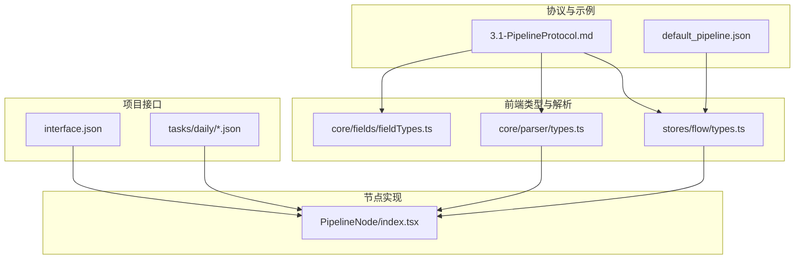
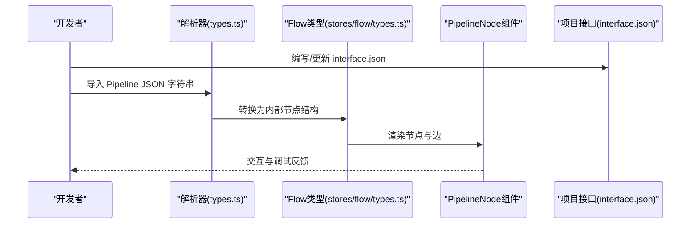
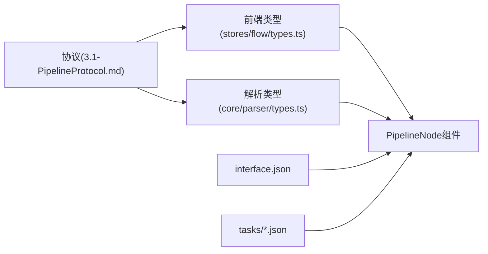

# Pipeline 格式详解

<cite>
**本文档引用的文件**
- [3.1-PipelineProtocol.md](file://dev/instructions/maafw-guide/3.1-PipelineProtocol.md)
- [3.2-ProjectInterface.md](file://dev/instructions/maafw-guide/3.2-ProjectInterface.md)
- [types.ts](file://src/stores/flow/types.ts)
- [types.ts](file://src/core/parser/types.ts)
- [fieldTypes.ts](file://src/core/fields/fieldTypes.ts)
- [PipelineNode/index.tsx](file://src/components/flow/nodes/PipelineNode/index.tsx)
- [interface.json](file://LocalBridge/test-json/interface.json)
- [default_pipeline.json](file://LocalBridge/test-json/resource/base/default_pipeline.json)
- [start_game.json](file://LocalBridge/test-json/resource/tasks/daily/start_game.json)
- [claim_mail.json](file://LocalBridge/test-json/resource/tasks/daily/claim_mail.json)
</cite>

## 目录
1. [简介](#简介)
2. [项目结构](#项目结构)
3. [核心组件](#核心组件)
4. [架构总览](#架构总览)
5. [详细组件分析](#详细组件分析)
6. [依赖分析](#依赖分析)
7. [性能考虑](#性能考虑)
8. [故障排查指南](#故障排查指南)
9. [结论](#结论)
10. [附录](#附录)

## 简介
本文件系统性阐述 MAA Pipeline 的 JSON 结构设计、字段语义与协议约束，覆盖任务定义、节点类型、动作类型、识别类型、默认参数继承机制、以及通过 interface.json 描述项目接口的方式。文档同时给出字段说明、示例路径与最佳实践，帮助开发者正确编写与理解 Pipeline 配置。

## 项目结构
围绕 Pipeline 的关键文件分布如下：
- 协议与示例：dev/instructions/maafw-guide/3.1-PipelineProtocol.md、LocalBridge/test-json/resource/base/default_pipeline.json
- 前端类型与解析：src/stores/flow/types.ts、src/core/parser/types.ts、src/core/fields/fieldTypes.ts
- 节点渲染与交互：src/components/flow/nodes/PipelineNode/index.tsx
- 项目接口描述：LocalBridge/test-json/interface.json
- 任务清单与选项：LocalBridge/test-json/resource/tasks/daily/*.json

**图表来源**
- [3.1-PipelineProtocol.md](file://dev/instructions/maafw-guide/3.1-PipelineProtocol.md)
- [default_pipeline.json](file://LocalBridge/test-json/resource/base/default_pipeline.json)
- [types.ts](file://src/stores/flow/types.ts)
- [types.ts](file://src/core/parser/types.ts)
- [fieldTypes.ts](file://src/core/fields/fieldTypes.ts)
- [PipelineNode/index.tsx](file://src/components/flow/nodes/PipelineNode/index.tsx)
- [interface.json](file://LocalBridge/test-json/interface.json)
- [start_game.json](file://LocalBridge/test-json/resource/tasks/daily/start_game.json)
- [claim_mail.json](file://LocalBridge/test-json/resource/tasks/daily/claim_mail.json)

**章节来源**
- [3.1-PipelineProtocol.md](file://dev/instructions/maafw-guide/3.1-PipelineProtocol.md)
- [types.ts](file://src/stores/flow/types.ts)
- [types.ts](file://src/core/parser/types.ts)
- [fieldTypes.ts](file://src/core/fields/fieldTypes.ts)
- [PipelineNode/index.tsx](file://src/components/flow/nodes/PipelineNode/index.tsx)
- [interface.json](file://LocalBridge/test-json/interface.json)
- [default_pipeline.json](file://LocalBridge/test-json/resource/base/default_pipeline.json)
- [start_game.json](file://LocalBridge/test-json/resource/tasks/daily/start_game.json)
- [claim_mail.json](file://LocalBridge/test-json/resource/tasks/daily/claim_mail.json)

## 核心组件
- Pipeline 节点数据结构：包含识别、动作、其他参数三部分，以及节点布局与类型信息。
- 识别参数类型：涵盖 ROI、模板匹配、特征匹配、颜色匹配、OCR、分类与检测、复合识别等。
- 动作参数类型：点击、长按、滑动、多指滑动、滚动、按键、输入文本、启停应用、停止任务、命令、Shell、截图等。
- 其他参数类型：超时、速率限制、前置/后置延迟、等待冻结、重复次数与间隔、反向识别、启用开关、锚点、焦点通知等。
- 默认参数继承：通过 default_pipeline.json 提供全局与算法/动作类型的默认值，支持字典合并与优先级覆盖。

**章节来源**
- [types.ts](file://src/stores/flow/types.ts)
- [3.1-PipelineProtocol.md](file://dev/instructions/maafw-guide/3.1-PipelineProtocol.md)
- [default_pipeline.json](file://LocalBridge/test-json/resource/base/default_pipeline.json)

## 架构总览
Pipeline JSON 在运行时由解析器转换为内部节点结构，再由前端节点组件渲染与交互；项目接口通过 interface.json 描述控制器、资源、分组、导入任务等元信息。

**图表来源**
- [types.ts](file://src/core/parser/types.ts)
- [types.ts](file://src/stores/flow/types.ts)
- [PipelineNode/index.tsx](file://src/components/flow/nodes/PipelineNode/index.tsx)
- [interface.json](file://LocalBridge/test-json/interface.json)

## 详细组件分析

### Pipeline JSON 结构与字段说明
- 基本格式与执行逻辑
  - 节点以键值对形式组织，每个节点包含识别、动作、后续节点列表、错误分支等。
  - 执行采用“顺序检测+命中即停”的策略，支持超时与错误处理分支。
- 属性字段
  - 识别类型：DirectHit、TemplateMatch、FeatureMatch、ColorMatch、OCR、NeuralNetworkClassify、NeuralNetworkDetect、And、Or、Custom 等。
  - 动作类型：DoNothing、Click、LongPress、Swipe、MultiSwipe、Scroll、ClickKey、LongPressKey、InputText、StartApp、StopApp、StopTask、Command、Shell、Screencap、Custom 等。
  - 控制与行为：next、on_error、anchor、inverse、enabled、max_hit、rate_limit、timeout、pre/post_delay、pre/post_wait_freezes、repeat、repeat_delay、repeat_wait_freezes、focus、attach 等。
- 版本演进与兼容
  - v1 与 v2 格式差异：识别与动作参数迁移到 type/param 结构，其余保持一致。
  - 默认参数继承：default_pipeline.json 支持全局 Default、算法名对象、动作名对象的默认值，节点参数优先级最高。
- 区域与目标
  - roi/box/target 的区别与组合：识别区域、命中框、动作目标，支持偏移与字符串引用。

**章节来源**
- [3.1-PipelineProtocol.md](file://dev/instructions/maafw-guide/3.1-PipelineProtocol.md)
- [types.ts](file://src/stores/flow/types.ts)
- [default_pipeline.json](file://LocalBridge/test-json/resource/base/default_pipeline.json)

### 识别类型详解
- DirectHit：无识别直接执行动作，支持 ROI 与 ROI 偏移。
- TemplateMatch：模板匹配，支持阈值、排序方式、索引、算法、绿色掩码等。
- FeatureMatch：特征匹配，支持检测器、距离比、最小匹配点数等。
- ColorMatch：颜色匹配，支持通道与范围、连通计数、排序与索引。
- OCR：文本识别，支持期望结果、阈值、替换规则、模型、颜色过滤等。
- NeuralNetworkClassify/Detect：深度学习分类/检测，支持标签、模型路径、期望类别、阈值、排序与索引。
- And/Or：复合识别，支持子识别数组、盒索引与子名引用。

**章节来源**
- [3.1-PipelineProtocol.md](file://dev/instructions/maafw-guide/3.1-PipelineProtocol.md)

### 动作类型详解
- 点击/长按：支持目标区域、偏移、持续时间、触控参数。
- 滑动/多指滑动：支持起点/终点/偏移、滑动序列、方向与距离。
- 滚动：支持目标区域与偏移。
- 按键：支持虚拟键码。
- 输入文本：支持文本内容。
- 应用控制：启动/停止应用、停止任务、命令、Shell、截图等。

**章节来源**
- [3.1-PipelineProtocol.md](file://dev/instructions/maafw-guide/3.1-PipelineProtocol.md)

### 默认参数与继承机制
- default_pipeline.json 结构：Default、算法名对象、动作名对象。
- 继承优先级：节点参数 > 算法/动作默认 > Default 默认 > 框架内置默认。
- 多 Bundle 行为：按加载顺序合并，默认值一经节点加载即固定。

**章节来源**
- [3.1-PipelineProtocol.md](file://dev/instructions/maafw-guide/3.1-PipelineProtocol.md)
- [default_pipeline.json](file://LocalBridge/test-json/resource/base/default_pipeline.json)

### 项目接口描述（interface.json）
- 用途：描述项目元信息、控制器、资源、代理、分组、导入任务等。
- 关键字段：interface_version、name/title/icon/description/version/welcome/contact/license/github/mirrorchyan_*、controller、resource、agent、group、import、task、option 等。
- 任务清单：通过 resource/tasks/*/*.json 定义任务条目、入口节点、默认勾选、描述与分组。

**章节来源**
- [interface.json](file://LocalBridge/test-json/interface.json)
- [start_game.json](file://LocalBridge/test-json/resource/tasks/daily/start_game.json)
- [claim_mail.json](file://LocalBridge/test-json/resource/tasks/daily/claim_mail.json)

### 前端节点与交互
- 节点数据结构：label、recognition(type/param)、action(type/param)、others、extras、type、handleDirection。
- 渲染与样式：根据节点样式（classic/modern/minimal）渲染不同内容组件。
- 交互能力：右键菜单、探索模式下的确认/重新生成/执行按钮、锚点引用高亮、调试覆盖层展示。

**章节来源**
- [types.ts](file://src/stores/flow/types.ts)
- [PipelineNode/index.tsx](file://src/components/flow/nodes/PipelineNode/index.tsx)

## 依赖分析
- 协议到类型：3.1-PipelineProtocol.md 定义的字段与类型在 stores/flow/types.ts 中以 TypeScript 类型体现。
- 解析到渲染：core/parser/types.ts 定义解析后的节点结构，最终在 PipelineNode 组件中渲染。
- 项目接口到任务：interface.json 与 resource/tasks/*/*.json 共同决定任务入口与可选项。

**图表来源**
- [3.1-PipelineProtocol.md](file://dev/instructions/maafw-guide/3.1-PipelineProtocol.md)
- [types.ts](file://src/stores/flow/types.ts)
- [types.ts](file://src/core/parser/types.ts)
- [PipelineNode/index.tsx](file://src/components/flow/nodes/PipelineNode/index.tsx)
- [interface.json](file://LocalBridge/test-json/interface.json)
- [start_game.json](file://LocalBridge/test-json/resource/tasks/daily/start_game.json)
- [claim_mail.json](file://LocalBridge/test-json/resource/tasks/daily/claim_mail.json)

**章节来源**
- [3.1-PipelineProtocol.md](file://dev/instructions/maafw-guide/3.1-PipelineProtocol.md)
- [types.ts](file://src/stores/flow/types.ts)
- [types.ts](file://src/core/parser/types.ts)
- [PipelineNode/index.tsx](file://src/components/flow/nodes/PipelineNode/index.tsx)
- [interface.json](file://LocalBridge/test-json/interface.json)
- [start_game.json](file://LocalBridge/test-json/resource/tasks/daily/start_game.json)
- [claim_mail.json](file://LocalBridge/test-json/resource/tasks/daily/claim_mail.json)

## 性能考虑
- 识别速率限制：合理设置 rate_limit，避免过于频繁的轮询。
- 超时与等待：timeout 与 pre/post_wait_freezes 的平衡，减少无效等待。
- 重复执行：repeat/repeat_delay/repeat_wait_freezes 的使用需谨慎，避免过度重复导致耗时增加。
- 默认参数：通过 default_pipeline.json 减少冗余配置，提升一致性与可维护性。

[本节为通用建议，不直接分析具体文件]

## 故障排查指南
- 节点未执行
  - 检查 enabled 是否为 true，max_hit 是否已达上限。
  - 检查 next/on_error 的节点名称是否正确，是否存在循环或跳转回退。
- 识别失败
  - 检查 roi/roi_offset 是否准确，模板/颜色参数是否合适，阈值是否合理。
  - 对于 OCR，确认 expected 与 replace 配置，必要时启用 color_filter。
- 动作异常
  - 检查 target/target_offset 是否正确，触控参数（如 pressure、contact）是否需要调整。
  - 对于 Scroll/多指滑动，确认起点/终点与偏移设置。
- 默认值冲突
  - 检查 default_pipeline.json 的合并顺序与优先级，确保节点参数覆盖符合预期。

**章节来源**
- [3.1-PipelineProtocol.md](file://dev/instructions/maafw-guide/3.1-PipelineProtocol.md)
- [default_pipeline.json](file://LocalBridge/test-json/resource/base/default_pipeline.json)

## 结论
Pipeline 格式通过清晰的节点结构与丰富的识别/动作类型，提供了强大的自动化脚本表达能力。结合 default_pipeline.json 的默认参数继承与 interface.json 的项目接口描述，开发者可以高效地构建、维护与扩展复杂的工作流。遵循本文档的字段说明与最佳实践，有助于提升稳定性与可维护性。

[本节为总结，不直接分析具体文件]

## 附录

### 字段类型枚举（辅助理解）
- 数值与布尔：int、double、bool、true
- 列表：list<int>、list<double>、list<string>、list<array<int,4>>
- 位置与坐标：array<int,4>、array<int,2>、list<array<int,4>>
- 任意与对象：any、list<object>、list<string|object>
- 图片路径：image_path、list<image_path>

**章节来源**
- [fieldTypes.ts](file://src/core/fields/fieldTypes.ts)

### 示例与参考路径
- Pipeline 协议与示例：[3.1-PipelineProtocol.md](file://dev/instructions/maafw-guide/3.1-PipelineProtocol.md)
- 默认参数示例：[default_pipeline.json](file://LocalBridge/test-json/resource/base/default_pipeline.json)
- 项目接口描述：[interface.json](file://LocalBridge/test-json/interface.json)
- 任务清单示例：[start_game.json](file://LocalBridge/test-json/resource/tasks/daily/start_game.json)、[claim_mail.json](file://LocalBridge/test-json/resource/tasks/daily/claim_mail.json)

**章节来源**
- [3.1-PipelineProtocol.md](file://dev/instructions/maafw-guide/3.1-PipelineProtocol.md)
- [default_pipeline.json](file://LocalBridge/test-json/resource/base/default_pipeline.json)
- [interface.json](file://LocalBridge/test-json/interface.json)
- [start_game.json](file://LocalBridge/test-json/resource/tasks/daily/start_game.json)
- [claim_mail.json](file://LocalBridge/test-json/resource/tasks/daily/claim_mail.json)