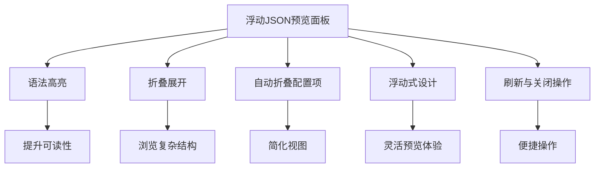
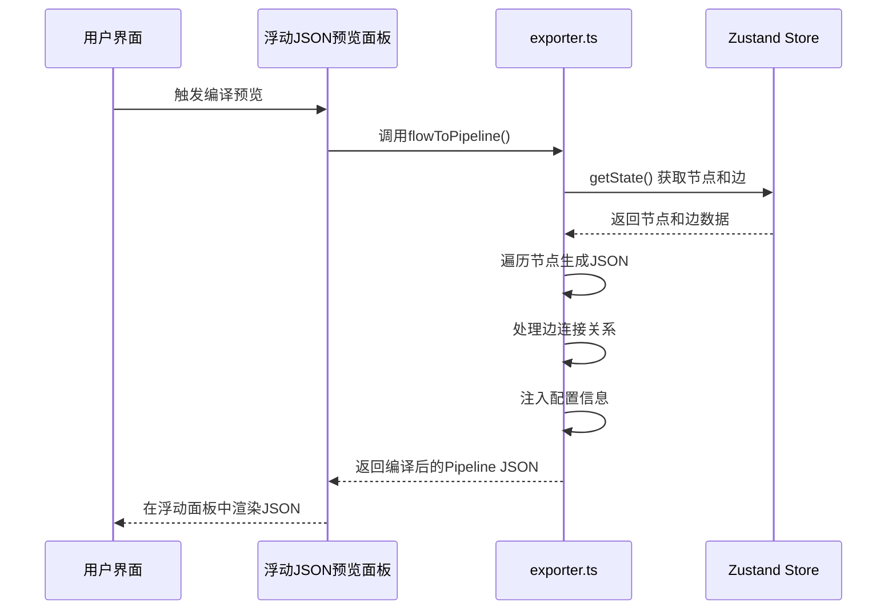
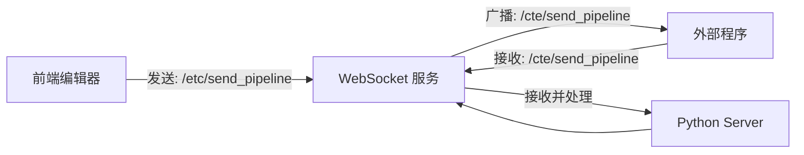

# Pipeline 面板

<cite>
**本文档引用文件**  
- [JsonViewer.tsx](file://src/components/JsonViewer.tsx)
- [exporter.ts](file://src/core/parser/exporter.ts)
- [server.ts](file://src/services/server.ts)
- [FloatingJsonPanel.module.less](file://src/styles/FloatingJsonPanel.module.less)
- [JsonPreviewButton.tsx](file://src/components/panels/toolbar/JsonPreviewButton.tsx)
</cite>

## 更新摘要
**已做更改**  
- 更新了核心功能详解部分，以反映从固定JSON查看器到浮动JSON预览面板的变更
- 新增了浮动JSON预览面板的样式与交互特性说明
- 更新了相关代码文件引用，包括新的样式文件和按钮组件
- 移除了过时的"实时预览模式"描述，替换为新的浮动面板行为说明

## 目录
1. [简介](#简介)
2. [核心功能详解](#核心功能详解)
3. [JSON 编译与导出机制](#json-编译与导出机制)
4. [WebSocket 联动机制](#websocket-联动机制)
5. [调试与验证实践](#调试与验证实践)
6. [典型输出示例与字段解析](#典型输出示例与字段解析)

## 简介

Pipeline 面板是 MaaPipelineEditor 的核心功能模块之一，作为可视化编辑器与底层 MaaFramework 协议之间的桥梁，实时展示当前流程的 JSON 编译结果。该面板不仅提供语法高亮、折叠展开等交互式 JSON 查看功能，还支持与本地 WebSocket 服务联动，实现配置的实时同步与外部程序通信。用户可通过该面板进行流程调试、配置验证和快速导出，极大提升了开发效率。

**Section sources**
- [JsonViewer.tsx](file://src/components/JsonViewer.tsx#L1-L212)
- [docsite/docs/01.指南/02.核心概念/80.Pipeline 面板.md](file://docsite/docs/01.指南/02.核心概念/80.Pipeline 面板.md#L1-L22)

## 核心功能详解

### 浮动JSON预览面板交互特性

`JsonViewer` 组件已更新为浮动式预览面板，基于 `@microlink/react-json-view` 实现，提供更灵活的 JSON 数据可视化展示。其核心交互特性包括：

- **语法高亮**：自动识别 JSON 结构，对键名、字符串、数字、布尔值等不同数据类型应用不同颜色，提升可读性。
- **折叠展开**：支持点击节点旁的箭头图标折叠或展开嵌套对象与数组，便于浏览大型 JSON 结构。
- **自动折叠策略**：通过 `shouldCollapse` 函数，自动折叠以 `__$mpe_config_` 和 `__$mpe_external_` 为前缀的配置与外部节点字段，保持视图简洁。
- **浮动式设计**：新的浮动面板设计允许用户自由控制显示与隐藏，不影响主工作区布局。

面板通过右上角工具栏的"JSON 预览"按钮控制显示状态，提供刷新和关闭操作。当其他面板打开时，JSON 面板会自动关闭，确保界面整洁。



**Diagram sources**
- [JsonViewer.tsx](file://src/components/JsonViewer.tsx#L23-L212)
- [FloatingJsonPanel.module.less](file://src/styles/FloatingJsonPanel.module.less#L1-L74)
- [JsonPreviewButton.tsx](file://src/components/panels/toolbar/JsonPreviewButton.tsx#L1-L33)

**Section sources**
- [JsonViewer.tsx](file://src/components/JsonViewer.tsx#L23-L212)
- [FloatingJsonPanel.module.less](file://src/styles/FloatingJsonPanel.module.less#L1-L74)
- [JsonPreviewButton.tsx](file://src/components/panels/toolbar/JsonPreviewButton.tsx#L1-L33)

## JSON 编译与导出机制

### exporter.ts：Zustand 状态到 MaaFramework JSON 的转换

`exporter.ts` 文件中的 `flowToPipeline` 函数是整个编译流程的核心，负责将 Zustand 状态树中的流程数据转换为符合 MaaFramework 协议的 JSON 结构。

1. **数据提取**：函数首先从 `useFlowStore` 和 `useFileStore` 中获取当前的节点、边、文件名和配置信息。支持传入可选参数以导出特定子集。
2. **节点生成**：遍历所有节点，根据节点类型（`Pipeline` 或 `External`）调用相应的解析函数（`parsePipelineNodeForExport` 或 `parseExternalNodeForExport`）生成对应的 JSON 对象。
3. **连接处理**：对边进行排序后，遍历每条边，构建源节点到目标节点的连接关系。支持 `Next` 和 `Error` 两种连接类型，并能处理 `Anchor` 节点和 `jump_back` 属性。
4. **配置注入**：如果启用了"导出配置"选项，会将当前文件的配置信息（如文件名、版本号）注入到一个以 `__$mpe_config_` 为前缀的特殊节点中。



**Diagram sources**
- [exporter.ts](file://src/core/parser/exporter.ts#L28-L136)
- [JsonViewer.tsx](file://src/components/JsonViewer.tsx#L86-L94)

**Section sources**
- [exporter.ts](file://src/core/parser/exporter.ts#L28-L136)
- [types.ts](file://src/core/parser/types.ts#L15-L17)
- [nodeParser.ts](file://src/core/parser/nodeParser.ts#L21-L76)

## WebSocket 联动机制

### 服务端与客户端通信流程

Pipeline 面板通过 WebSocket 与本地服务（`server/main.py`）建立双向通信，实现配置的实时同步。

1. **客户端初始化**：前端通过 `server.ts` 中的 `LocalWebSocketServer` 类建立连接，监听 `/etc/send_pipeline` 路径。
2. **发送编译结果**：当用户点击"应用到本地"按钮时，`requests.ts` 中的 `sendCompiledPipeline` 函数被调用，将编译好的 JSON 通过 WebSocket 发送到 `ws://localhost:9066`。
3. **服务端接收与广播**：Python 服务端（`websocket_server.py`）监听连接，收到消息后，通过 `send_pipeline_to_client` 方法将 Pipeline 数据广播给所有连接的客户端。
4. **客户端接收**：前端 `responds.ts` 中的 `registerRespondRoutes` 函数注册了 `/cte/send_pipeline` 路由，当收到服务端推送时，会调用 `pipelineToFlow` 将 JSON 重新导入编辑器。



**Diagram sources**
- [server.ts](file://src/services/server.ts#L4-L204)
- [requests.ts](file://src/services/requests.ts#L7-L45)
- [responds.ts](file://src/services/responds.ts#L10-L68)
- [websocket_server.py](file://server/core/websocket_server.py#L16-L109)

**Section sources**
- [server.ts](file://src/services/server.ts#L4-L204)
- [requests.ts](file://src/services/requests.ts#L7-L45)
- [responds.ts](file://src/services/responds.ts#L10-L68)

## 调试与验证实践

### 利用 Pipeline 面板进行调试

Pipeline 面板是验证配置正确性的强大工具：

1. **实时语法检查**：通过观察 JSON 输出，可以立即发现节点命名冲突、参数缺失等错误。例如，若节点名重复，导出时会失败并弹出错误通知。
2. **结构验证**：检查生成的 JSON 是否符合 MaaFramework 的协议规范，如 `recognition` 和 `action` 字段的结构是否正确。
3. **连接逻辑验证**：通过查看 `next` 和 `on_error` 数组，可以直观地验证流程的跳转逻辑是否符合预期。
4. **外部程序联动测试**：启动本地 WebSocket 服务后，点击"应用到本地"，观察外部程序是否能正确接收并处理更新。

**Section sources**
- [JsonViewer.tsx](file://src/components/JsonViewer.tsx#L119-L197)
- [exporter.ts](file://src/core/parser/exporter.ts#L128-L135)
- [configStore.ts](file://src/stores/configStore.ts#L57-L68)

## 典型输出示例与字段解析

### 典型 Pipeline JSON 输出

```json
{
  "ExampleNode": {
    "recognition": {
      "type": "TemplateMatch",
      "param": {
        "template": "example.png"
      }
    },
    "action": {
      "type": "Click",
      "param": {}
    },
    "next": ["NextNode"],
    "on_error": ["ErrorNode"]
  },
  "$__mpe_config_example.json": {
    "$__mpe_code": {
      "filename": "example.json",
      "version": "v0.8.2"
    }
  }
}
```

### 关键字段含义

- **节点名 (如 `ExampleNode`)**：流程中每个节点的唯一标识，由用户在编辑器中定义。
- **`recognition`**: 识别模块配置，包含 `type`（识别算法类型）和 `param`（具体参数）。
- **`action`**: 动作模块配置，包含 `type`（动作类型）和 `param`（参数，可能为空）。
- **`next`**: 成功执行后的下一个节点列表，支持数组形式以实现多分支。
- **`on_error`**: 执行失败后的跳转节点列表。
- **`__$mpe_config_`**: 配置节点前缀，用于存储文件元信息。
- **`__$mpe_code`**: 配置标记，其下的 `filename` 和 `version` 字段记录了文件名和编辑器版本。

这些字段共同构成了 MaaFramework 可执行的流程定义，Pipeline 面板让用户能够清晰地理解和验证这一底层协议结构。

**Section sources**
- [types.ts](file://src/core/parser/types.ts#L20-L35)
- [exporter.ts](file://src/core/parser/exporter.ts#L118-L126)
- [nodeParser.ts](file://src/core/parser/nodeParser.ts#L27-L44)