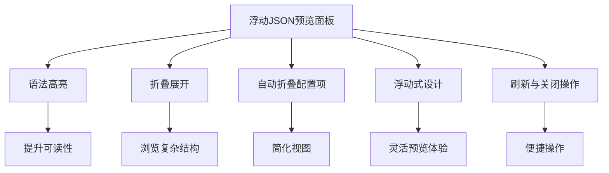
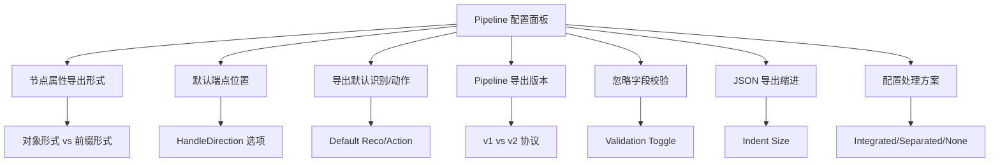
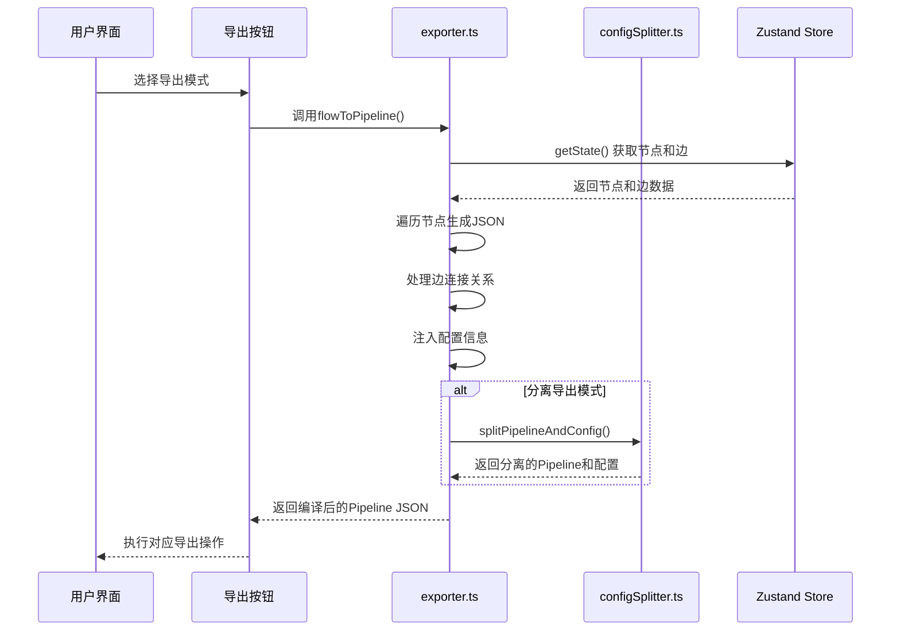
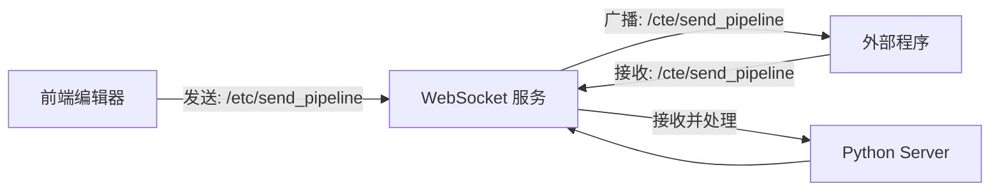

# Pipeline 面板

<cite>
**本文档引用文件**  
- [JsonViewer.tsx](file://src/components/JsonViewer.tsx)
- [exporter.ts](file://src/core/parser/exporter.ts)
- [server.ts](file://src/services/server.ts)
- [FloatingJsonPanel.module.less](file://src/styles/FloatingJsonPanel.module.less)
- [JsonPreviewButton.tsx](file://src/components/panels/toolbar/JsonPreviewButton.tsx)
- [ExportButton.tsx](file://src/components/panels/toolbar/ExportButton.tsx)
- [ExportFileModal.tsx](file://src/components/modals/ExportFileModal.tsx)
- [PipelineConfigSection.tsx](file://src/components/panels/config/PipelineConfigSection.tsx)
- [ConfigPanel.tsx](file://src/components/panels/main/ConfigPanel.tsx)
- [configStore.ts](file://src/stores/configStore.ts)
- [configSplitter.ts](file://src/core/parser/configSplitter.ts)
- [clipboard.ts](file://src/utils/clipboard.ts)
</cite>

## 更新摘要
**已做更改**  
- 新增了导出按钮功能分离章节，详细介绍多种导出模式的实现
- 新增了管道配置面板章节，说明 v1/v2 协议版本选择、字段验证跳过、JSON 导出缩进等配置选项
- 更新了导出机制章节，增加分离导出模式和配置处理方案的说明
- 新增了配置拆分与合并工具的说明
- 更新了相关代码文件引用，包括新的导出组件和配置面板

## 目录
1. [简介](#简介)
2. [核心功能详解](#核心功能详解)
3. [导出按钮功能分离](#导出按钮功能分离)
4. [管道配置面板](#管道配置面板)
5. [JSON 编译与导出机制](#json-编译与导出机制)
6. [WebSocket 联动机制](#websocket-联动机制)
7. [调试与验证实践](#调试与验证实践)
8. [典型输出示例与字段解析](#典型输出示例与字段解析)

## 简介

Pipeline 面板是 MaaPipelineEditor 的核心功能模块之一，作为可视化编辑器与底层 MaaFramework 协议之间的桥梁，实时展示当前流程的 JSON 编译结果。该面板不仅提供语法高亮、折叠展开等交互式 JSON 查看功能，还支持与本地 WebSocket 服务联动，实现配置的实时同步与外部程序通信。用户可通过该面板进行流程调试、配置验证和快速导出，极大提升了开发效率。

**Section sources**
- [JsonViewer.tsx](file://src/components/JsonViewer.tsx#L1-L212)
- [docsite/docs/01.指南/02.核心概念/80.Pipeline 面板.md](file://docsite/docs/01.指南/02.核心概念/80.Pipeline 面板.md#L1-L22)

## 核心功能详解

### 浮动JSON预览面板交互特性

`JsonViewer` 组件已更新为浮动式预览面板，基于 `@microlink/react-json-view` 实现，提供更灵活的 JSON 数据可视化展示。其核心交互特性包括：

- **语法高亮**：自动识别 JSON 结构，对键名、字符串、数字、布尔值等不同数据类型应用不同颜色，提升可读性。
- **折叠展开**：支持点击节点旁的箭头图标折叠或展开嵌套对象与数组，便于浏览大型 JSON 结构。
- **自动折叠策略**：通过 `shouldCollapse` 函数，自动折叠以 `__$mpe_config_` 和 `__$mpe_external_` 为前缀的配置与外部节点字段，保持视图简洁。
- **浮动式设计**：新的浮动面板设计允许用户自由控制显示与隐藏，不影响主工作区布局。

面板通过右上角工具栏的"JSON 预览"按钮控制显示状态，提供刷新和关闭操作。当其他面板打开时，JSON 面板会自动关闭，确保界面整洁。


```mermaid
flowchart TD
A[浮动JSON预览面板] --> B[语法高亮]
A --> C[折叠展开]
A --> D[自动折叠配置项]
A --> E[浮动式设计]
A --> F[刷新与关闭操作]
B --> G[提升可读性]
C --> H[浏览复杂结构]
D --> I[简化视图]
E --> J[灵活预览体验]
F --> K[便捷操作]
```

**Diagram sources**
- [JsonViewer.tsx](file://src/components/JsonViewer.tsx#L23-L212)
- [FloatingJsonPanel.module.less](file://src/styles/FloatingJsonPanel.module.less#L1-L74)
- [JsonPreviewButton.tsx](file://src/components/panels/toolbar/JsonPreviewButton.tsx#L1-L33)

**Section sources**
- [JsonViewer.tsx](file://src/components/JsonViewer.tsx#L23-L212)
- [FloatingJsonPanel.module.less](file://src/styles/FloatingJsonPanel.module.less#L1-L74)
- [JsonPreviewButton.tsx](file://src/components/panels/toolbar/JsonPreviewButton.tsx#L1-L33)

## 导出按钮功能分离

### 多模式导出支持

ExportButton.tsx 组件实现了导出按钮的功能分离，支持多种导出模式，满足不同使用场景的需求：

#### 主要导出模式

1. **粘贴板导出**：将编译后的 Pipeline 直接复制到系统剪贴板
2. **文件导出**：通过 ExportFileModal 弹窗选择文件名和格式进行下载
3. **本地保存**：保存到本地文件系统，支持三种保存模式
4. **部分导出**：仅导出选中的节点和连接关系
5. **分离导出**：在分离模式下分别导出 Pipeline 和配置

#### 本地保存模式

当连接到本地 WebSocket 服务时，导出按钮提供以下本地保存选项：

- **全部保存**：同时保存 Pipeline 和配置文件
- **仅保存 Pipeline**：仅保存流程定义文件
- **仅保存配置**：仅保存配置文件

#### 分离导出模式

在分离导出模式下，导出按钮提供专门的分离导出选项：

- **导出 Pipeline**：仅导出流程定义
- **导出配置**：仅导出配置信息

```mermaid
flowchart TD
A[导出按钮] --> B[粘贴板导出]
A --> C[文件导出]
A --> D[本地保存]
A --> E[部分导出]
A --> F[分离导出]
B --> G[flowToPipeline]
C --> H[ExportFileModal]
D --> I[saveFileToLocal]
E --> J[flowToPipeline(selected)]
F --> K[flowToSeparatedStrings]
G --> L[ClipboardHelper]
H --> M[File System Access API]
I --> N[本地文件系统]
J --> O[选中节点数据]
K --> P[Pipeline + Config]
```

**Diagram sources**
- [ExportButton.tsx](file://src/components/panels/toolbar/ExportButton.tsx#L92-L125)
- [ExportFileModal.tsx](file://src/components/modals/ExportFileModal.tsx#L102-L139)
- [clipboard.ts](file://src/utils/clipboard.ts#L3-L23)

**Section sources**
- [ExportButton.tsx](file://src/components/panels/toolbar/ExportButton.tsx#L1-L316)
- [ExportFileModal.tsx](file://src/components/modals/ExportFileModal.tsx#L1-L302)
- [clipboard.ts](file://src/utils/clipboard.ts#L1-L64)

## 管道配置面板

### Pipeline 导出配置选项

PipelineConfigSection.tsx 提供了丰富的 Pipeline 导出配置选项，支持精细化的导出控制：

#### 核心配置选项

1. **节点属性导出形式**
   - 对象形式：`{ name: 'C', anchor: true, jump_back: true }`
   - 前缀形式：`'[Anchor][JumpBack]C'`

2. **默认端点位置**
   - 左右：左侧输入，右侧输出（默认）
   - 右左：右侧输入，左侧输出
   - 上下：上方输入，下方输出
   - 下上：下方输入，上方输出

3. **导出默认识别/动作**
   - 关闭时，导出时若节点的识别类型为 DirectHit 且无参数，则不导出 recognition 字段
   - 若动作类型为 DoNothing 且无参数，则不导出 action 字段

4. **Pipeline 导出版本**
   - v2：使用嵌套对象结构 `{ recognition: { type: 'X', param: {...} } }`
   - v1：参数平铺在节点根对象 `{ recognition: 'X', template: '...' }`

5. **忽略字段校验**
   - 开启后，导出时将跳过字段格式校验
   - 适用于快速导出或调试场景

6. **JSON 导出缩进**
   - 导出 JSON 文件时每层缩进的空格数
   - 默认为 4 空格，可设置为 2 或其他值

7. **配置处理方案**
   - 集成导出：配置嵌入 Pipeline 文件，适合单文件分享
   - 分离导出：配置存储至独立 .mpe.json 文件，便于版本管理
   - 不导出：不保存任何配置，导入时触发自动布局

#### 一键配置功能

- **一键更改端点位置**：将所有节点的端点位置更改为当前选中的默认位置


```mermaid
flowchart TD
A[Pipeline 配置面板] --> B[节点属性导出形式]
A --> C[默认端点位置]
A --> D[导出默认识别/动作]
A --> E[Pipeline 导出版本]
A --> F[忽略字段校验]
A --> G[JSON 导出缩进]
A --> H[配置处理方案]
B --> I[对象形式 vs 前缀形式]
C --> J[HandleDirection 选项]
D --> K[Default Reco/Action]
E --> L[v1 vs v2 协议]
F --> M[Validation Toggle]
G --> N[Indent Size]
H --> O[Integrated/Separated/None]
```

**Diagram sources**
- [PipelineConfigSection.tsx](file://src/components/panels/config/PipelineConfigSection.tsx#L60-L270)
- [configStore.ts](file://src/stores/configStore.ts#L88-L90)

**Section sources**
- [PipelineConfigSection.tsx](file://src/components/panels/config/PipelineConfigSection.tsx#L1-L274)
- [configStore.ts](file://src/stores/configStore.ts#L25-L62)

## JSON 编译与导出机制

### exporter.ts：Zustand 状态到 MaaFramework JSON 的转换

`exporter.ts` 文件中的 `flowToPipeline` 函数是整个编译流程的核心，负责将 Zustand 状态树中的流程数据转换为符合 MaaFramework 协议的 JSON 结构。

#### 主要功能特性

1. **数据提取**：函数首先从 `useFlowStore` 和 `useFileStore` 中获取当前的节点、边、文件名和配置信息。支持传入可选参数以导出特定子集。
2. **节点生成**：遍历所有节点，根据节点类型（`Pipeline` 或 `External`）调用相应的解析函数（`parsePipelineNodeForExport` 或 `parseExternalNodeForExport`）生成对应的 JSON 对象。
3. **连接处理**：对边进行排序后，遍历每条边，构建源节点到目标节点的连接关系。支持 `Next` 和 `Error` 两种连接类型，并能处理 `Anchor` 节点和 `jump_back` 属性。
4. **配置注入**：如果启用了"导出配置"选项，会将当前文件的配置信息（如文件名、版本号）注入到一个以 `__$mpe_config_` 为前缀的特殊节点中。

#### 分离导出模式

新增的 `flowToSeparatedStrings` 函数支持分离导出模式：

- **forceExportConfig**：强制导出配置，即使配置处理模式设置为不导出
- **splitPipelineAndConfig**：将完整的 Pipeline 对象拆分为纯 Pipeline 和配置两部分
- **独立字符串输出**：返回包含 pipelineString 和 configString 的对象


```mermaid
sequenceDiagram
participant UI as 用户界面
participant ExportButton as 导出按钮
participant Exporter as exporter.ts
participant Splitter as configSplitter.ts
participant Store as Zustand Store
UI->>ExportButton : 选择导出模式
ExportButton->>Exporter : 调用flowToPipeline()
Exporter->>Store : getState() 获取节点和边
Store-->>Exporter : 返回节点和边数据
Exporter->>Exporter : 遍历节点生成JSON
Exporter->>Exporter : 处理边连接关系
Exporter->>Exporter : 注入配置信息
alt 分离导出模式
Exporter->>Splitter : splitPipelineAndConfig()
Splitter-->>Exporter : 返回分离的Pipeline和配置
end
Exporter-->>ExportButton : 返回编译后的Pipeline JSON
ExportButton-->>UI : 执行对应导出操作
```

**Diagram sources**
- [exporter.ts](file://src/core/parser/exporter.ts#L28-L136)
- [configSplitter.ts](file://src/core/parser/configSplitter.ts#L21-L141)
- [ExportButton.tsx](file://src/components/panels/toolbar/ExportButton.tsx#L77-L89)

**Section sources**
- [exporter.ts](file://src/core/parser/exporter.ts#L28-L244)
- [types.ts](file://src/core/parser/types.ts#L15-L17)
- [nodeParser.ts](file://src/core/parser/nodeParser.ts#L21-L76)
- [configSplitter.ts](file://src/core/parser/configSplitter.ts#L1-L437)

## WebSocket 联动机制

### 服务端与客户端通信流程

Pipeline 面板通过 WebSocket 与本地服务（`server/main.py`）建立双向通信，实现配置的实时同步。

1. **客户端初始化**：前端通过 `server.ts` 中的 `LocalWebSocketServer` 类建立连接，监听 `/etc/send_pipeline` 路径。
2. **发送编译结果**：当用户点击"应用到本地"按钮时，`requests.ts` 中的 `sendCompiledPipeline` 函数被调用，将编译好的 JSON 通过 WebSocket 发送到 `ws://localhost:9066`。
3. **服务端接收与广播**：Python 服务端（`websocket_server.py`）监听连接，收到消息后，通过 `send_pipeline_to_client` 方法将 Pipeline 数据广播给所有连接的客户端。
4. **客户端接收**：前端 `responds.ts` 中的 `registerRespondRoutes` 函数注册了 `/cte/send_pipeline` 路由，当收到服务端推送时，会调用 `pipelineToFlow` 将 JSON 重新导入编辑器。


```mermaid
graph LR
A[前端编辑器] -- "发送: /etc/send_pipeline" --> B[WebSocket 服务]
C[外部程序] -- "接收: /cte/send_pipeline" --> B
B -- "广播: /cte/send_pipeline" --> C
B -- "接收并处理" --> D[Python Server]
D --> B
```

**Diagram sources**
- [server.ts](file://src/services/server.ts#L4-L204)
- [requests.ts](file://src/services/requests.ts#L7-L45)
- [responds.ts](file://src/services/responds.ts#L10-L68)
- [websocket_server.py](file://server/core/websocket_server.py#L16-L109)

**Section sources**
- [server.ts](file://src/services/server.ts#L4-L204)
- [requests.ts](file://src/services/requests.ts#L7-L45)
- [responds.ts](file://src/services/responds.ts#L10-L68)

## 调试与验证实践

### 利用 Pipeline 面板进行调试

Pipeline 面板是验证配置正确性的强大工具：

1. **实时语法检查**：通过观察 JSON 输出，可以立即发现节点命名冲突、参数缺失等错误。例如，若节点名重复，导出时会失败并弹出错误通知。
2. **结构验证**：检查生成的 JSON 是否符合 MaaFramework 的协议规范，如 `recognition` 和 `action` 字段的结构是否正确。
3. **连接逻辑验证**：通过查看 `next` 和 `on_error` 数组，可以直观地验证流程的跳转逻辑是否符合预期。
4. **外部程序联动测试**：启动本地 WebSocket 服务后，点击"应用到本地"，观察外部程序是否能正确接收并处理更新。

### 导出模式选择建议

- **开发调试**：推荐使用 v2 协议版本和集成导出模式
- **生产环境**：推荐使用 v1 协议版本和分离导出模式
- **快速验证**：可以开启忽略字段校验功能
- **团队协作**：推荐使用分离导出模式便于版本管理

**Section sources**
- [JsonViewer.tsx](file://src/components/JsonViewer.tsx#L119-L197)
- [exporter.ts](file://src/core/parser/exporter.ts#L128-L135)
- [configStore.ts](file://src/stores/configStore.ts#L57-L68)

## 典型输出示例与字段解析

### 典型 Pipeline JSON 输出

```json
{
  "ExampleNode": {
    "recognition": {
      "type": "TemplateMatch",
      "param": {
        "template": "example.png"
      }
    },
    "action": {
      "type": "Click",
      "param": {}
    },
    "next": ["NextNode"],
    "on_error": ["ErrorNode"]
  },
  "$__mpe_config_example.json": {
    "$__mpe_code": {
      "filename": "example.json",
      "version": "v0.8.2"
    }
  }
}
```

### 分离导出模式示例

在分离导出模式下，会产生两个文件：

**pipeline.json**：
```json
{
  "ExampleNode": {
    "recognition": {
      "type": "TemplateMatch",
      "param": {
        "template": "example.png"
      }
    },
    "action": {
      "type": "Click",
      "param": {}
    },
    "next": ["NextNode"],
    "on_error": ["ErrorNode"]
  }
}
```

**example.mpe.json**：
```json
{
  "file_config": {
    "filename": "example.json",
    "version": "v0.8.2"
  },
  "node_configs": {
    "ExampleNode": {
      "position": { "x": 100, "y": 200 }
    }
  }
}
```

### 关键字段含义

- **节点名 (如 `ExampleNode`)**：流程中每个节点的唯一标识，由用户在编辑器中定义。
- **`recognition`**: 识别模块配置，包含 `type`（识别算法类型）和 `param`（具体参数）。
- **`action`**: 动作模块配置，包含 `type`（动作类型）和 `param`（参数，可能为空）。
- **`next`**: 成功执行后的下一个节点列表，支持数组形式以实现多分支。
- **`on_error`**: 执行失败后的跳转节点列表。
- **`__$mpe_config_`**: 配置节点前缀，用于存储文件元信息。
- **`__$mpe_code`**: 配置标记，其下的 `filename` 和 `version` 字段记录了文件名和编辑器版本。
- **`node_configs`**: 分离模式下的节点配置存储，包含位置信息等。

这些字段共同构成了 MaaFramework 可执行的流程定义，Pipeline 面板让用户能够清晰地理解和验证这一底层协议结构。

**Section sources**
- [types.ts](file://src/core/parser/types.ts#L20-L35)
- [exporter.ts](file://src/core/parser/exporter.ts#L118-L126)
- [nodeParser.ts](file://src/core/parser/nodeParser.ts#L27-L44)
- [configSplitter.ts](file://src/core/parser/configSplitter.ts#L21-L141)