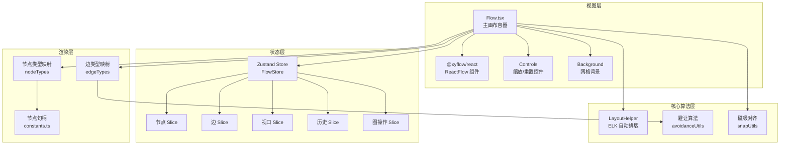
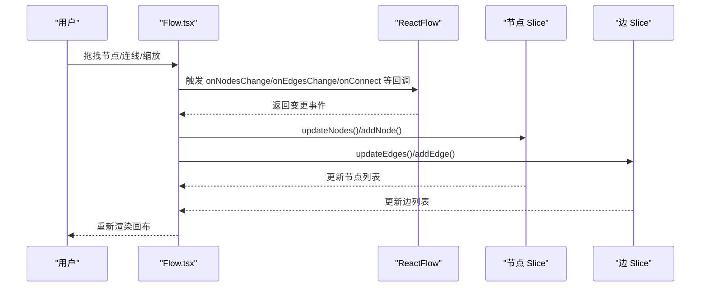
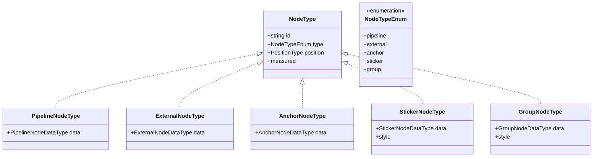
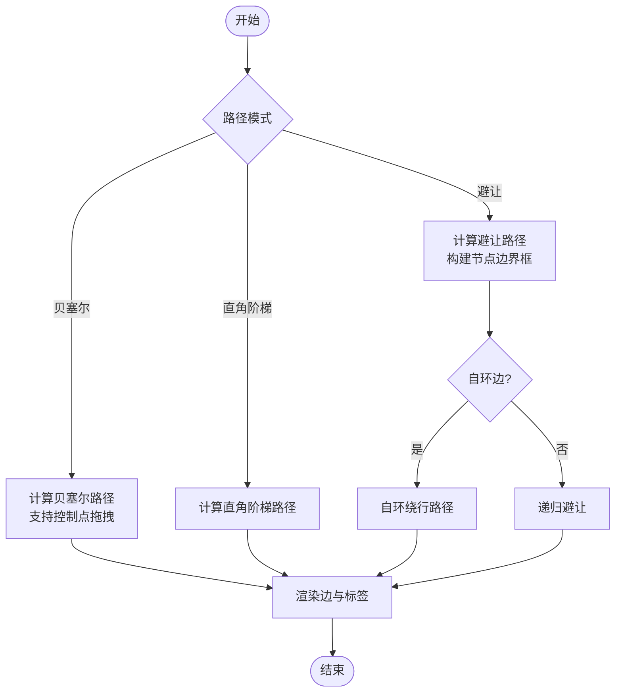
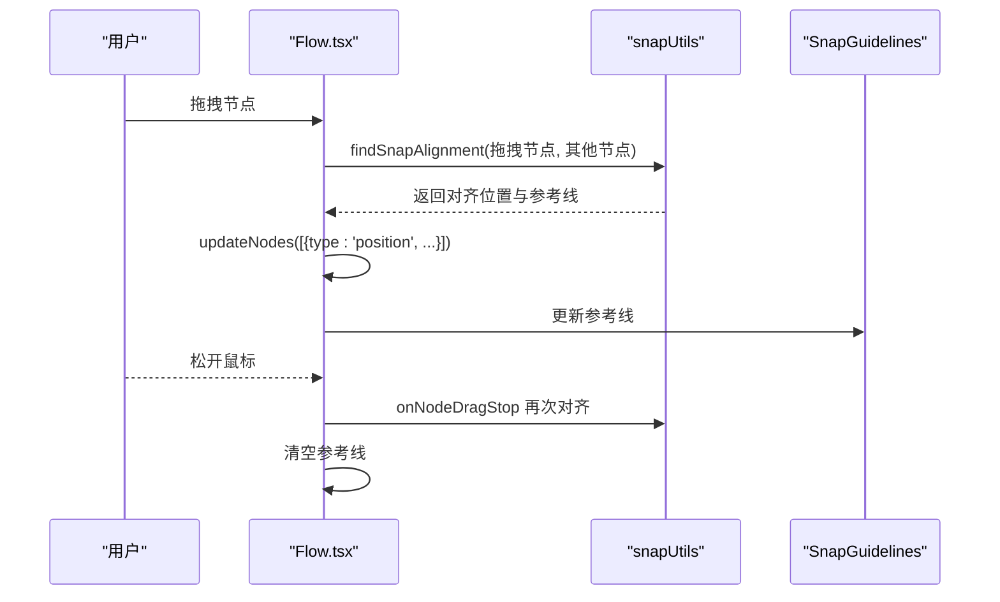
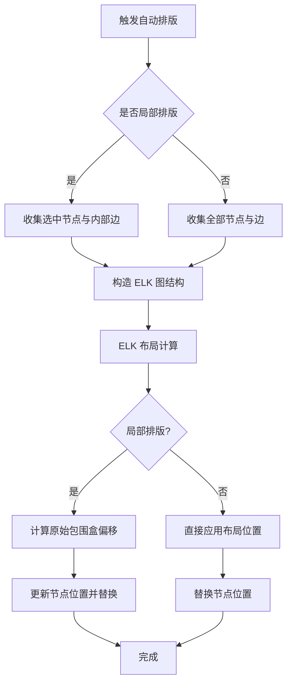
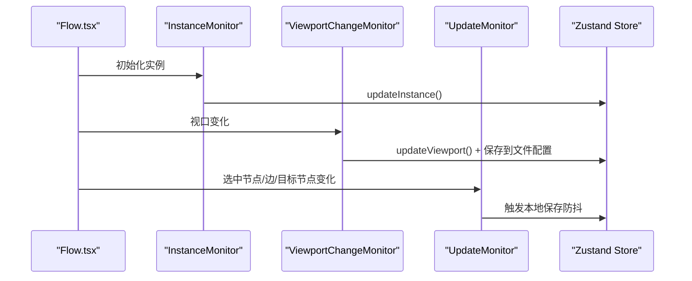
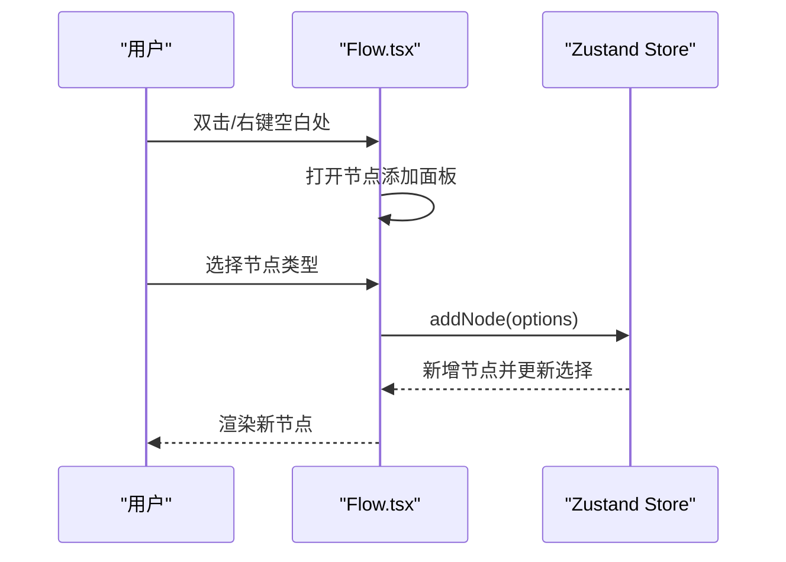
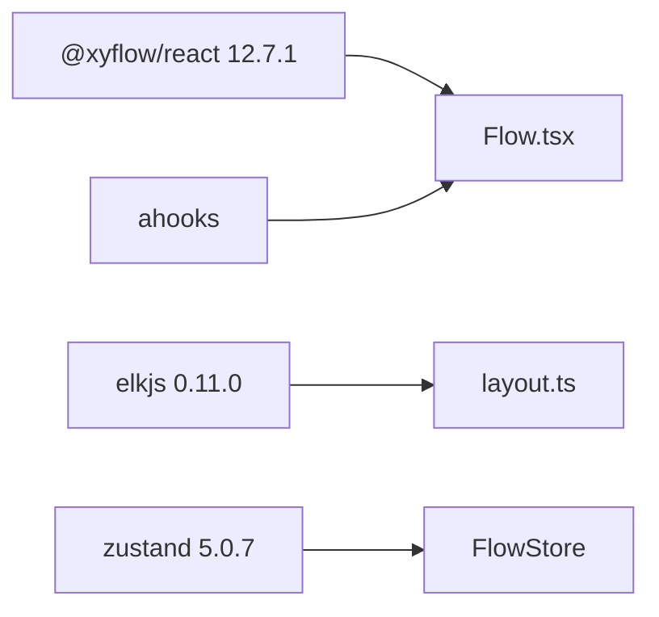

# React Flow 技术原理

<cite>
**本文档引用的文件**
- [Flow.tsx](file://src/components/Flow.tsx)
- [index.ts](file://src/stores/flow/index.ts)
- [layout.ts](file://src/core/layout.ts)
- [edges.tsx](file://src/components/flow/edges.tsx)
- [types.ts](file://src/stores/flow/types.ts)
- [snapUtils.ts](file://src/core/snapUtils.ts)
- [avoidanceUtils.ts](file://src/core/avoidanceUtils.ts)
- [nodeSlice.ts](file://src/stores/flow/slices/nodeSlice.ts)
- [edgeSlice.ts](file://src/stores/flow/slices/edgeSlice.ts)
- [constants.ts](file://src/components/flow/nodes/constants.ts)
- [utils.ts](file://src/components/flow/nodes/utils.ts)
- [SnapGuidelines.tsx](file://src/components/flow/SnapGuidelines.tsx)
- [package.json](file://package.json)
</cite>

## 目录
1. [简介](#简介)
2. [项目结构](#项目结构)
3. [核心组件](#核心组件)
4. [架构总览](#架构总览)
5. [详细组件分析](#详细组件分析)
6. [依赖关系分析](#依赖关系分析)
7. [性能考虑](#性能考虑)
8. [故障排查指南](#故障排查指南)
9. [结论](#结论)

## 简介
本文件系统性阐述 MaaPipelineEditor 中基于 React Flow 的可视化编辑器技术原理与实现细节，重点覆盖以下方面：
- 节点渲染与类型体系
- 连线绘制与路径算法
- 拖拽交互与磁吸对齐
- 布局算法与自动排版
- 生命周期管理与状态存储
- 性能优化策略与最佳实践

## 项目结构
MaaPipelineEditor 的可视化编辑器围绕 React Flow 组件展开，采用“状态集中 + 分片切分”的架构组织：
- 视图层：Flow.tsx 作为主画布容器，挂载 ReactFlow、背景、控制条等
- 状态层：Zustand Store 将视口、选择、历史、节点、边、图操作、路径、锚点引用等切分为多个 slice
- 核心算法层：布局（ELK）、避让（自研）、磁吸（像素级对齐）
- 渲染层：节点与边的自定义组件，支持贝塞尔曲线、直角阶梯、避让路径等

**图表来源**
- [Flow.tsx:648-705](file://src/components/Flow.tsx#L648-L705)
- [index.ts:18-28](file://src/stores/flow/index.ts#L18-L28)
- [layout.ts:31-148](file://src/core/layout.ts#L31-L148)
- [avoidanceUtils.ts:691-779](file://src/core/avoidanceUtils.ts#L691-L779)
- [snapUtils.ts:100-161](file://src/core/snapUtils.ts#L100-L161)
- [edges.tsx:673-676](file://src/components/flow/edges.tsx#L673-L676)
- [constants.ts:14-20](file://src/components/flow/nodes/constants.ts#L14-L20)

**章节来源**
- [Flow.tsx:648-705](file://src/components/Flow.tsx#L648-L705)
- [index.ts:18-28](file://src/stores/flow/index.ts#L18-L28)

## 核心组件
- 主画布容器：负责事件绑定、只读控制、嵌入模式权限、复制粘贴快捷键、视口持久化、节点添加面板联动等
- 节点类型注册：统一管理五种节点类型（Pipeline/External/Anchor/Sticker/Group）
- 边类型注册：统一管理 marked 边，支持贝塞尔曲线、直角阶梯、避让路径、控制点拖拽
- 状态存储：Zustand 多 slice 组合，提供节点/边增删改、历史记录、路径模式、锚点引用等能力
- 布局与避让：ELK 自动排版 + 自研避让算法，兼顾美观与可读性

**章节来源**
- [Flow.tsx:235-706](file://src/components/Flow.tsx#L235-L706)
- [index.ts:18-28](file://src/stores/flow/index.ts#L18-L28)
- [edges.tsx:311-671](file://src/components/flow/edges.tsx#L311-L671)

## 架构总览
React Flow 在本项目中的应用遵循“容器组件 + 自定义渲染 + 状态驱动”的模式：
- 容器组件：Flow.tsx 作为顶层容器，注入节点/边类型映射，绑定回调，承载 UI 控件
- 自定义渲染：节点与边均采用自定义组件，实现差异化视觉与交互
- 状态驱动：Zustand Store 统一管理节点/边/视口/历史等状态，通过 slice 解耦职责
- 算法支撑：布局与避让算法独立封装，供渲染层按需调用

**图表来源**
- [Flow.tsx:300-359](file://src/components/Flow.tsx#L300-L359)
- [nodeSlice.ts:44-136](file://src/stores/flow/slices/nodeSlice.ts#L44-L136)
- [edgeSlice.ts:25-66](file://src/stores/flow/slices/edgeSlice.ts#L25-L66)

## 详细组件分析

### 节点渲染与类型体系
- 节点类型注册：通过 nodeTypes 映射五种节点类型，分别对应不同的渲染组件
- 节点数据模型：统一的 NodeType 联合类型，包含位置、尺寸、类型、数据等字段
- 句柄方向：通过 HandleDirection 控制输入输出方向，影响连线路径与标签显示
- 节点图标与颜色：根据识别/动作类型与节点类型动态选择图标与配色

**图表来源**
- [types.ts:230-236](file://src/stores/flow/types.ts#L230-L236)
- [types.ts:158-227](file://src/stores/flow/types.ts#L158-L227)
- [constants.ts:14-20](file://src/components/flow/nodes/constants.ts#L14-L20)

**章节来源**
- [index.ts:8-14](file://src/stores/flow/index.ts#L8-L14)
- [types.ts:230-236](file://src/stores/flow/types.ts#L230-L236)
- [constants.ts:28-46](file://src/components/flow/nodes/constants.ts#L28-L46)
- [utils.ts:14-139](file://src/components/flow/nodes/utils.ts#L14-L139)

### 连线绘制与路径算法
- 边类型：marked 边，支持三种路径模式
  - 贝塞尔曲线：支持控制点拖拽，双击重置
  - 直角阶梯：getSmoothStepPath，适合层级化流程
  - 避让路径：calculateAvoidancePath，避免遮挡节点
- 控制点拖拽：在贝塞尔模式下，通过鼠标拖拽实时调整路径曲率
- 标签与透明度：根据焦点模式与选中状态动态调整边与标签透明度

**图表来源**
- [edges.tsx:390-458](file://src/components/flow/edges.tsx#L390-L458)
- [avoidanceUtils.ts:691-779](file://src/core/avoidanceUtils.ts#L691-L779)

**章节来源**
- [edges.tsx:311-671](file://src/components/flow/edges.tsx#L311-L671)
- [avoidanceUtils.ts:691-779](file://src/core/avoidanceUtils.ts#L691-L779)

### 拖拽交互与磁吸对齐
- 拖拽事件链路：onNodeDrag → 计算磁吸对齐 → 更新节点位置 → onNodeDragStop → 分组拖入/拖出检测
- 磁吸算法：以像素级阈值比较拖拽节点与候选节点的对齐点（左/中/右、上/中/下），生成对齐参考线
- 视口过滤：可选仅对视口范围内的节点进行磁吸，提升性能
- 参考线渲染：通过 SnapGuidelines 组件在画布上绘制虚线参考线

**图表来源**
- [Flow.tsx:469-608](file://src/components/Flow.tsx#L469-L608)
- [snapUtils.ts:100-161](file://src/core/snapUtils.ts#L100-L161)
- [SnapGuidelines.tsx:5-58](file://src/components/flow/SnapGuidelines.tsx#L5-L58)

**章节来源**
- [Flow.tsx:469-608](file://src/components/Flow.tsx#L469-L608)
- [snapUtils.ts:100-161](file://src/core/snapUtils.ts#L100-L161)
- [SnapGuidelines.tsx:5-58](file://src/components/flow/SnapGuidelines.tsx#L5-L58)

### 布局算法与自动排版
- 自动排版：基于 ELKJS 的 layered 算法，支持部分节点局部排版与全局排版
- 参数配置：方向、间距、交叉最小化策略、网络单纯形节点放置等
- 局部排版：仅对选中节点及其内部边进行重排，保持其余节点位置不变
- 适配测量尺寸：在节点尺寸未就绪时延迟执行，确保布局质量

**图表来源**
- [layout.ts:41-148](file://src/core/layout.ts#L41-L148)

**章节来源**
- [layout.ts:31-148](file://src/core/layout.ts#L31-L148)

### 状态管理与生命周期
- Store 组合：通过 create 将视口、选择、历史、节点、边、图操作、路径、锚点引用等 slice 组合
- 生命周期钩子：InstanceMonitor、ViewportChangeMonitor、UpdateMonitor 分别负责实例更新、视口持久化、本地保存
- 历史记录：支持撤销/重做，记录节点/边/分组等操作
- 嵌入模式：根据权限控制只读与复制能力，向父窗口发送错误消息

**图表来源**
- [Flow.tsx:137-189](file://src/components/Flow.tsx#L137-L189)
- [index.ts:18-28](file://src/stores/flow/index.ts#L18-L28)

**章节来源**
- [Flow.tsx:137-189](file://src/components/Flow.tsx#L137-L189)
- [index.ts:18-28](file://src/stores/flow/index.ts#L18-L28)

### 交互模式设计
- 节点选择：支持单选/多选，支持路径模式下的关联高亮
- 连线创建：支持从句柄拖拽连线，支持空白处快速创建节点
- 缩放平移：内置 Controls，支持滚轮缩放、拖拽平移
- 右键菜单：选区右键菜单，支持批量操作
- 复制粘贴：支持复制选中节点与边，粘贴到画布

**图表来源**
- [Flow.tsx:427-467](file://src/components/Flow.tsx#L427-L467)
- [nodeSlice.ts:139-308](file://src/stores/flow/slices/nodeSlice.ts#L139-L308)

**章节来源**
- [Flow.tsx:427-467](file://src/components/Flow.tsx#L427-L467)
- [nodeSlice.ts:139-308](file://src/stores/flow/slices/nodeSlice.ts#L139-L308)

## 依赖关系分析
- React Flow 版本：12.7.1，提供节点/边渲染、事件回调、视口控制等核心能力
- ELKJS：0.11.0，用于自动排版
- Zustand：5.0.7，轻量状态管理
- ahooks：提供防抖等工具

**图表来源**
- [package.json:32-48](file://package.json#L32-L48)
- [layout.ts:15](file://src/core/layout.ts#L15)
- [Flow.tsx:28](file://src/components/Flow.tsx#L28)

**章节来源**
- [package.json:32-48](file://package.json#L32-L48)

## 性能考虑
- 防抖更新：对选中节点/边/目标节点变化进行防抖，减少本地保存频率
- 视口观察：仅在视口变化结束时保存，降低频繁写入
- 尺寸监听：ResizeObserver 监听画布尺寸变化，延迟更新
- 局部排版：仅对选中节点进行排版，避免全量重排
- 避让算法：对节点边界框进行预处理，减少重复计算
- 磁吸过滤：可选仅对视口内节点进行磁吸，降低计算量

**章节来源**
- [Flow.tsx:173-186](file://src/components/Flow.tsx#L173-L186)
- [Flow.tsx:625-645](file://src/components/Flow.tsx#L625-L645)
- [layout.ts:36-39](file://src/core/layout.ts#L36-L39)
- [avoidanceUtils.ts:666-684](file://src/core/avoidanceUtils.ts#L666-L684)
- [snapUtils.ts:73-78](file://src/core/snapUtils.ts#L73-L78)

## 故障排查指南
- 只读模式限制：在嵌入模式下，若尝试修改节点/边会向父窗口发送错误消息
- 节点名重复：新增/修改节点时检查重复名称并提示
- 连线冲突：next 与 on_error 不能同时指向同一目标节点
- 自环边处理：避让算法对自环边进行特殊处理
- 控制点重置：支持一键重置贝塞尔控制点

**章节来源**
- [Flow.tsx:300-359](file://src/components/Flow.tsx#L300-L359)
- [index.ts:85-104](file://src/stores/flow/index.ts#L85-L104)
- [edgeSlice.ts:170-197](file://src/stores/flow/slices/edgeSlice.ts#L170-L197)
- [avoidanceUtils.ts:745-760](file://src/core/avoidanceUtils.ts#L745-L760)
- [edges.tsx:379-388](file://src/components/flow/edges.tsx#L379-L388)

## 结论
本项目通过 React Flow 与自研算法相结合，实现了高性能、可扩展的可视化编辑器。其关键优势在于：
- 清晰的状态分层与职责划分，便于维护与扩展
- 丰富的交互与可视化能力，满足复杂流程编辑需求
- 算法层面的优化（避让、磁吸、局部排版）保障了良好的用户体验
- 嵌入模式与权限控制，增强了产品在不同场景下的适应性

建议在后续迭代中持续关注：
- 虚拟化渲染：针对超大规模图的节点/边虚拟化
- 增量更新：进一步细化变更追踪，减少不必要的重渲染
- 内存管理：对历史记录与临时对象进行周期性清理