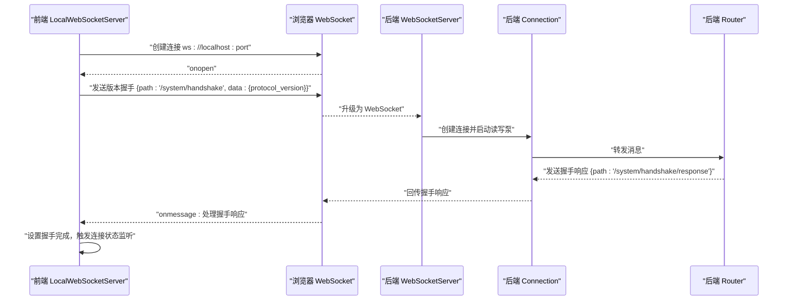
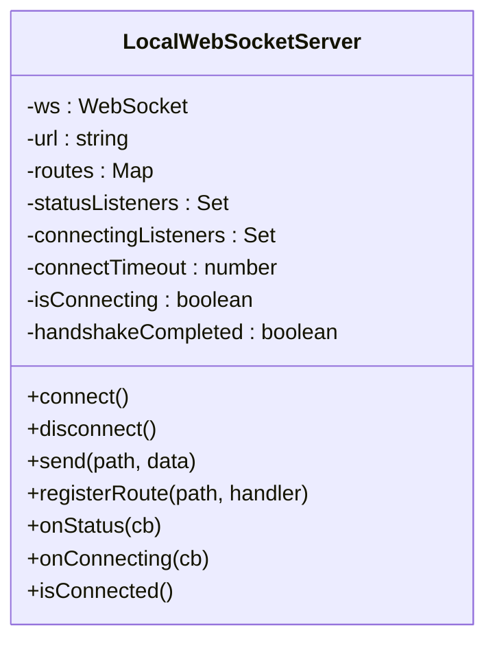
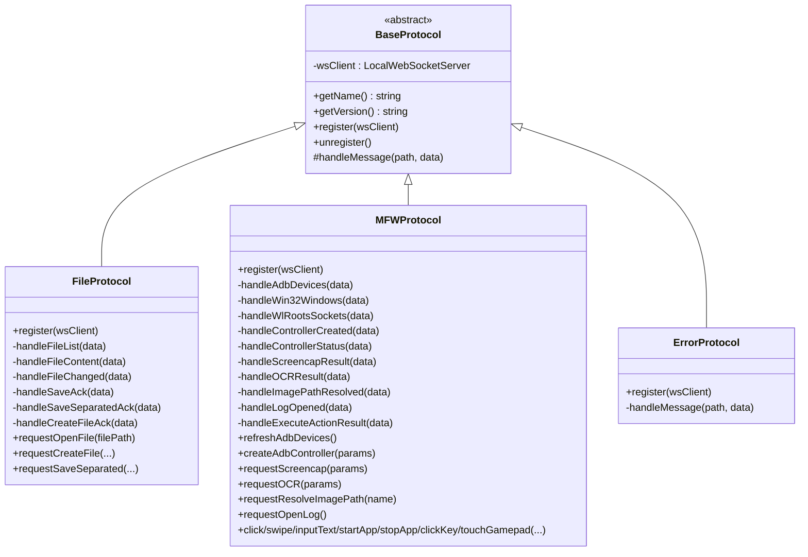
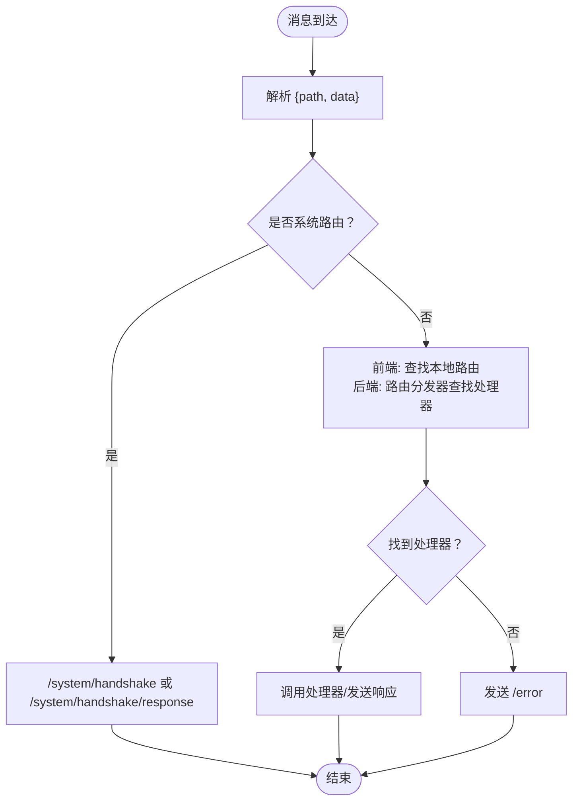
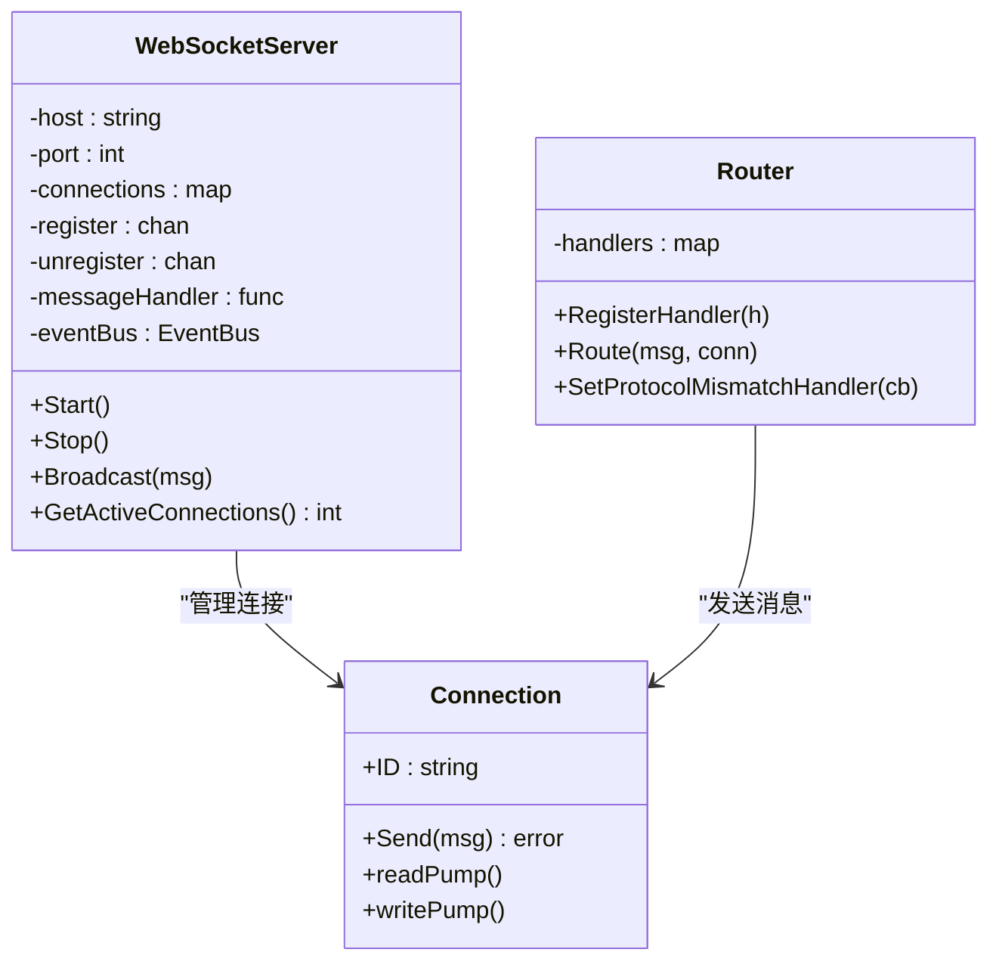
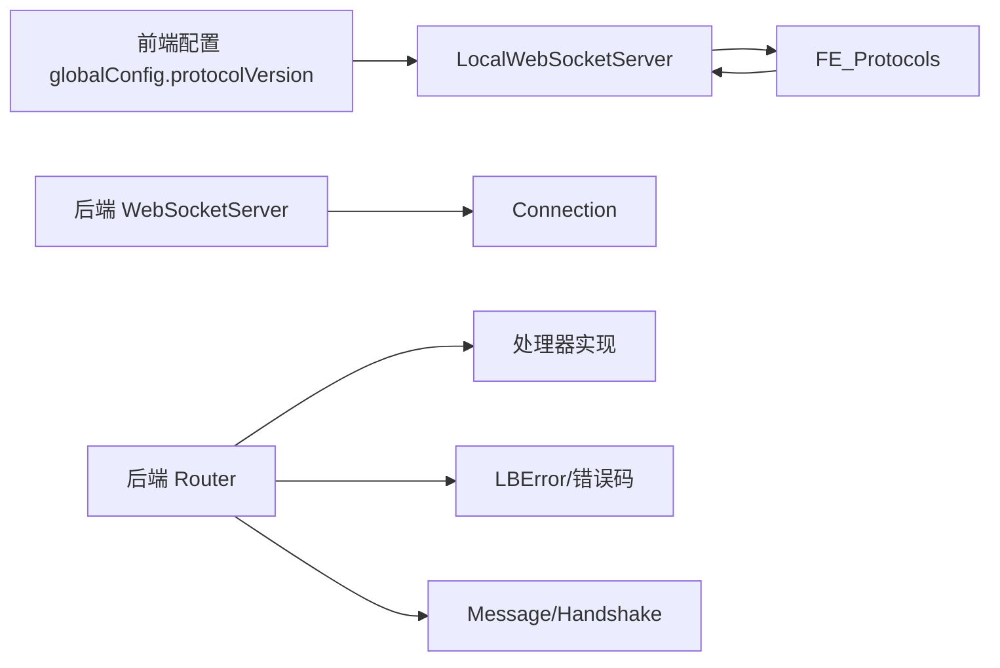

# WebSocket 通信机制

<cite>
**本文档引用的文件**
- [src/services/server.ts](file://src/services/server.ts)
- [src/services/type.ts](file://src/services/type.ts)
- [src/services/protocols/BaseProtocol.ts](file://src/services/protocols/BaseProtocol.ts)
- [src/services/protocols/FileProtocol.ts](file://src/services/protocols/FileProtocol.ts)
- [src/services/protocols/MFWProtocol.ts](file://src/services/protocols/MFWProtocol.ts)
- [src/services/protocols/ErrorProtocol.ts](file://src/services/protocols/ErrorProtocol.ts)
- [src/stores/configStore.ts](file://src/stores/configStore.ts)
- [src/stores/wsStore.ts](file://src/stores/wsStore.ts)
- [LocalBridge/internal/server/websocket.go](file://LocalBridge/internal/server/websocket.go)
- [LocalBridge/internal/server/connection.go](file://LocalBridge/internal/server/connection.go)
- [LocalBridge/internal/router/router.go](file://LocalBridge/internal/router/router.go)
- [LocalBridge/internal/errors/errors.go](file://LocalBridge/internal/errors/errors.go)
- [LocalBridge/pkg/models/message.go](file://LocalBridge/pkg/models/message.go)
</cite>

## 目录
1. [引言](#引言)
2. [项目结构](#项目结构)
3. [核心组件](#核心组件)
4. [架构总览](#架构总览)
5. [详细组件分析](#详细组件分析)
6. [依赖关系分析](#依赖关系分析)
7. [性能考量](#性能考量)
8. [故障排除指南](#故障排除指南)
9. [结论](#结论)

## 引言
本文件系统性阐述 MaaPipelineEditor 中基于 WebSocket 的前后端通信机制，覆盖连接建立、消息协议设计、路由机制、消息格式规范、事件类型定义、扩展性与安全性、错误处理与重连策略，以及调试方法与最佳实践。目标读者既包括需要理解整体架构的开发者，也包括希望快速接入或扩展通信能力的工程师。

## 项目结构
MaaPipelineEditor 的 WebSocket 通信分为前端协议层与后端服务层两部分：
- 前端协议层：位于 src/services，包含 WebSocket 客户端、协议抽象与具体协议实现（文件、MFW、错误等）。
- 后端服务层：位于 LocalBridge，包含 WebSocket 服务器、连接管理、消息路由与错误封装。

```mermaid
graph TB
subgraph "前端(src/services)"
FE_Server["LocalWebSocketServer<br/>连接与消息分发"]
FE_Protocols["协议模块<br/>File/MFW/Error 等"]
FE_Models["消息模型与路由常量"]
end
subgraph "后端(LocalBridge)"
BE_Server["WebSocketServer<br/>连接管理/广播"]
BE_Connection["Connection<br/>读写泵/发送队列"]
BE_Router["Router<br/>路由分发/版本握手"]
BE_Errors["错误封装<br/>LBError/错误码"]
BE_Models["消息模型<br/>Message/Handshake 等"]
end
FE_Server <- --> |"WebSocket"| BE_Server
FE_Protocols --> FE_Server
BE_Router --> BE_Connection
BE_Server --> BE_Connection
BE_Router --> BE_Models
FE_Models --> FE_Server
```

**图表来源**
- [src/services/server.ts:22-343](file://src/services/server.ts#L22-L343)
- [LocalBridge/internal/server/websocket.go:36-178](file://LocalBridge/internal/server/websocket.go#L36-L178)
- [LocalBridge/internal/server/connection.go:13-95](file://LocalBridge/internal/server/connection.go#L13-L95)
- [LocalBridge/internal/router/router.go:29-161](file://LocalBridge/internal/router/router.go#L29-L161)
- [LocalBridge/internal/errors/errors.go:23-141](file://LocalBridge/internal/errors/errors.go#L23-L141)
- [LocalBridge/pkg/models/message.go:4-129](file://LocalBridge/pkg/models/message.go#L4-L129)

**章节来源**
- [src/services/server.ts:1-388](file://src/services/server.ts#L1-L388)
- [LocalBridge/internal/server/websocket.go:1-178](file://LocalBridge/internal/server/websocket.go#L1-L178)

## 核心组件
- 前端 LocalWebSocketServer：负责连接生命周期管理、消息路由注册、版本握手、发送与接收消息、连接状态监听与清理。
- 协议模块 BaseProtocol：协议抽象基类，定义协议名称、版本、注册与消息处理入口。
- 具体协议：FileProtocol（文件列表/内容/变更与保存确认）、MFWProtocol（设备发现/控制器/截图/OCR/输入等）、ErrorProtocol（统一错误处理与弹窗）。
- 后端 WebSocketServer：负责 HTTP 升级、连接注册/注销、广播消息、连接数统计。
- 后端 Connection：单连接读写泵、发送队列与并发安全。
- 后端 Router：路由分发、处理器注册、版本握手、错误消息发送。
- 错误封装：统一错误码与错误数据结构，便于前后端一致处理。
- 消息模型：统一的 Message 结构与各协议的数据结构。

**章节来源**
- [src/services/server.ts:22-343](file://src/services/server.ts#L22-L343)
- [src/services/protocols/BaseProtocol.ts:7-39](file://src/services/protocols/BaseProtocol.ts#L7-L39)
- [src/services/protocols/FileProtocol.ts:16-68](file://src/services/protocols/FileProtocol.ts#L16-L68)
- [src/services/protocols/MFWProtocol.ts:18-117](file://src/services/protocols/MFWProtocol.ts#L18-L117)
- [src/services/protocols/ErrorProtocol.ts:11-25](file://src/services/protocols/ErrorProtocol.ts#L11-L25)
- [LocalBridge/internal/server/websocket.go:36-178](file://LocalBridge/internal/server/websocket.go#L36-L178)
- [LocalBridge/internal/server/connection.go:13-95](file://LocalBridge/internal/server/connection.go#L13-L95)
- [LocalBridge/internal/router/router.go:29-161](file://LocalBridge/internal/router/router.go#L29-L161)
- [LocalBridge/internal/errors/errors.go:23-141](file://LocalBridge/internal/errors/errors.go#L23-L141)
- [LocalBridge/pkg/models/message.go:4-129](file://LocalBridge/pkg/models/message.go#L4-L129)

## 架构总览
前端通过 LocalWebSocketServer 与后端建立 WebSocket 连接；连接建立后进行版本握手校验；随后各协议模块注册路由，实现请求-响应、广播与实时推送等通信方式。



**图表来源**
- [src/services/server.ts:109-184](file://src/services/server.ts#L109-L184)
- [src/services/type.ts:2-18](file://src/services/type.ts#L2-L18)
- [LocalBridge/internal/server/websocket.go:145-161](file://LocalBridge/internal/server/websocket.go#L145-L161)
- [LocalBridge/internal/server/connection.go:32-58](file://LocalBridge/internal/server/connection.go#L32-L58)
- [LocalBridge/internal/router/router.go:115-143](file://LocalBridge/internal/router/router.go#L115-L143)

## 详细组件分析

### 前端 WebSocket 客户端（LocalWebSocketServer）
- 连接管理：支持连接/断开、连接超时、连接中状态监听、连接状态监听。
- 消息路由：注册系统路由与业务路由，按 path 分发到对应处理器。
- 版本握手：发送握手请求，接收响应并根据 success 决定连接状态。
- 发送消息：序列化 {path, data}，在 OPEN 状态下发送。
- 状态存储：使用 wsStore 管理连接与连接中状态。



**图表来源**
- [src/services/server.ts:22-343](file://src/services/server.ts#L22-L343)

**章节来源**
- [src/services/server.ts:109-343](file://src/services/server.ts#L109-L343)
- [src/stores/wsStore.ts:7-23](file://src/stores/wsStore.ts#L7-L23)

### 协议系统与路由机制
- 协议抽象：BaseProtocol 定义 getName/getVersion/register/unregister/handleMessage。
- 路由注册：各协议在 register 中调用 wsClient.registerRoute 注册接收路由与确认路由。
- 路由分发：前端按 path 在本地 routes 中查找处理器；后端 Router 按精确匹配或前缀匹配查找处理器。
- 系统路由：/system/handshake 与 /system/handshake/response 用于版本握手。



**图表来源**
- [src/services/protocols/BaseProtocol.ts:7-39](file://src/services/protocols/BaseProtocol.ts#L7-L39)
- [src/services/protocols/FileProtocol.ts:16-68](file://src/services/protocols/FileProtocol.ts#L16-L68)
- [src/services/protocols/MFWProtocol.ts:18-117](file://src/services/protocols/MFWProtocol.ts#L18-L117)
- [src/services/protocols/ErrorProtocol.ts:11-25](file://src/services/protocols/ErrorProtocol.ts#L11-L25)

**章节来源**
- [src/services/protocols/BaseProtocol.ts:7-39](file://src/services/protocols/BaseProtocol.ts#L7-L39)
- [src/services/protocols/FileProtocol.ts:44-68](file://src/services/protocols/FileProtocol.ts#L44-L68)
- [src/services/protocols/MFWProtocol.ts:48-117](file://src/services/protocols/MFWProtocol.ts#L48-L117)
- [src/services/protocols/ErrorProtocol.ts:20-25](file://src/services/protocols/ErrorProtocol.ts#L20-L25)

### 消息格式规范与事件类型
- 通用消息结构：{ path, data }。path 作为路由标识，data 为任意 JSON 数据。
- 系统路由：
  - /system/handshake：前端发送 { protocol_version }。
  - /system/handshake/response：后端返回 { success, server_version, required_version, message }。
- 文件协议事件：
  - 推送：/lte/file_list、/lte/file_content、/lte/file_changed。
  - 确认：/ack/save_file、/ack/save_separated、/ack/create_file。
- MFW 协议事件：
  - 设备与控制器：/lte/mfw/adb_devices、/lte/mfw/win32_windows、/lte/mfw/wlroots_sockets、/lte/mfw/controller_created、/lte/mfw/controller_status。
  - 实时结果：/lte/mfw/screencap_result、/lte/utility/ocr_result、/lte/utility/image_path_resolved、/lte/utility/log_opened、/lte/mfw/execute_action_result。
  - 请求：/etl/*（如 /etl/open_file、/etl/create_file、/etl/save_separated、/etl/mfw/* 等）。
- 错误事件：/error，数据结构包含 { code, message, detail }。



**图表来源**
- [src/services/type.ts:2-18](file://src/services/type.ts#L2-L18)
- [LocalBridge/internal/router/router.go:57-112](file://LocalBridge/internal/router/router.go#L57-L112)
- [LocalBridge/pkg/models/message.go:4-15](file://LocalBridge/pkg/models/message.go#L4-L15)

**章节来源**
- [src/services/type.ts:2-18](file://src/services/type.ts#L2-L18)
- [LocalBridge/pkg/models/message.go:4-129](file://LocalBridge/pkg/models/message.go#L4-L129)
- [LocalBridge/internal/router/router.go:57-112](file://LocalBridge/internal/router/router.go#L57-L112)

### 后端服务器与连接管理
- WebSocketServer：HTTP 升级、连接注册/注销、广播消息、连接数统计。
- Connection：读写泵 goroutine、发送队列、并发安全、发送失败日志。
- Router：处理器注册、前缀匹配、版本握手、错误消息发送。



**图表来源**
- [LocalBridge/internal/server/websocket.go:36-178](file://LocalBridge/internal/server/websocket.go#L36-L178)
- [LocalBridge/internal/server/connection.go:13-95](file://LocalBridge/internal/server/connection.go#L13-L95)
- [LocalBridge/internal/router/router.go:29-161](file://LocalBridge/internal/router/router.go#L29-L161)

**章节来源**
- [LocalBridge/internal/server/websocket.go:66-178](file://LocalBridge/internal/server/websocket.go#L66-L178)
- [LocalBridge/internal/server/connection.go:32-95](file://LocalBridge/internal/server/connection.go#L32-L95)
- [LocalBridge/internal/router/router.go:43-161](file://LocalBridge/internal/router/router.go#L43-L161)

### 错误处理与协议版本不匹配
- 错误封装：统一错误码与错误数据结构，便于前端统一展示。
- 协议版本不匹配：后端比较前端协议版本与服务端协议版本，不匹配时发送失败响应并触发一次回调。
- 前端错误协议：统一处理 /error，区分普通错误与特殊场景（如 OCR 资源加载失败）弹窗提示。

**章节来源**
- [LocalBridge/internal/errors/errors.go:9-141](file://LocalBridge/internal/errors/errors.go#L9-L141)
- [LocalBridge/internal/router/router.go:115-143](file://LocalBridge/internal/router/router.go#L115-L143)
- [src/services/protocols/ErrorProtocol.ts:27-79](file://src/services/protocols/ErrorProtocol.ts#L27-L79)

## 依赖关系分析
- 前端依赖：
  - 协议模块依赖 LocalWebSocketServer 提供的 registerRoute/send 能力。
  - 配置中心 globalConfig.protocolVersion 作为协议版本来源。
- 后端依赖：
  - Router 依赖 Handler 接口实现前缀匹配与处理。
  - 错误封装统一对外输出。



**图表来源**
- [src/stores/configStore.ts:7-13](file://src/stores/configStore.ts#L7-L13)
- [src/services/server.ts:20-20](file://src/services/server.ts#L20-L20)
- [LocalBridge/internal/router/router.go:19-26](file://LocalBridge/internal/router/router.go#L19-L26)
- [LocalBridge/internal/errors/errors.go:23-50](file://LocalBridge/internal/errors/errors.go#L23-L50)

**章节来源**
- [src/stores/configStore.ts:7-13](file://src/stores/configStore.ts#L7-L13)
- [src/services/server.ts:20-20](file://src/services/server.ts#L20-L20)
- [LocalBridge/internal/router/router.go:19-26](file://LocalBridge/internal/router/router.go#L19-L26)

## 性能考量
- 连接池与广播：后端 WebSocketServer 维护连接集合，广播时遍历发送，注意大规模连接下的内存与带宽压力。
- 发送队列：后端 Connection 的发送通道容量有限，避免阻塞主循环；前端 LocalWebSocketServer 在发送异常时记录日志并返回失败。
- 路由匹配：后端采用前缀匹配，建议协议路由前缀设计清晰，减少查找成本。
- 版本握手：在连接建立后立即进行，避免后续频繁错误分发。

[本节为通用指导，无需列出章节来源]

## 故障排除指南
- 连接超时：前端设置连接超时并提示用户检查本地服务是否启动与端口可用。
- 连接失败：捕获 onerror/onclose，清理定时器与状态，触发连接状态监听。
- 协议版本不匹配：后端记录警告并发送失败响应，前端断开连接并提示更新。
- 错误消息：统一通过 /error 处理，特殊错误（如 OCR 资源加载失败）以弹窗形式展示详细信息。
- 保存确认：文件协议提供保存确认机制与超时处理，避免长时间挂起。

**章节来源**
- [src/services/server.ts:131-254](file://src/services/server.ts#L131-L254)
- [src/services/protocols/ErrorProtocol.ts:84-119](file://src/services/protocols/ErrorProtocol.ts#L84-L119)
- [src/services/protocols/FileProtocol.ts:541-579](file://src/services/protocols/FileProtocol.ts#L541-L579)
- [LocalBridge/internal/router/router.go:115-143](file://LocalBridge/internal/router/router.go#L115-L143)

## 结论
MaaPipelineEditor 的 WebSocket 通信机制通过“前端协议模块 + 后端路由处理器”的双端协作，实现了稳定、可扩展且易于维护的本地服务通信体系。系统在连接生命周期管理、消息路由、错误处理与版本控制方面具备良好设计，同时为后续扩展（新增协议、事件类型与处理器）提供了清晰的接口与约定。建议在扩展新协议时遵循现有路由命名规范与错误封装约定，确保一致性与可观测性。