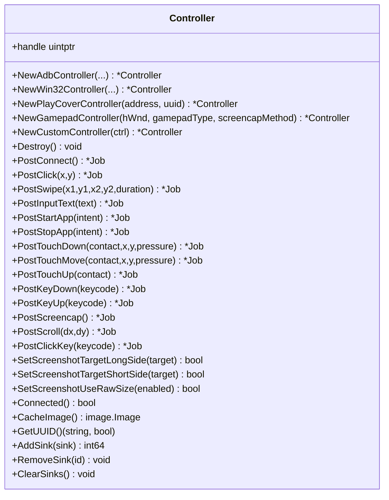
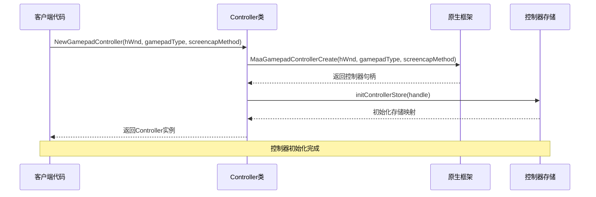
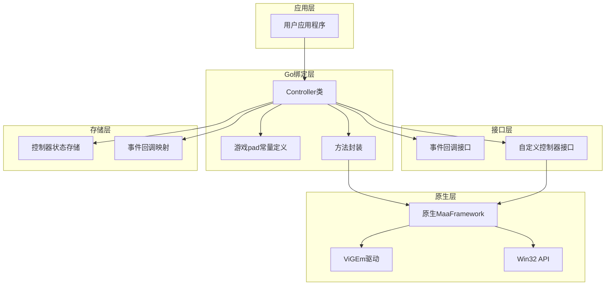
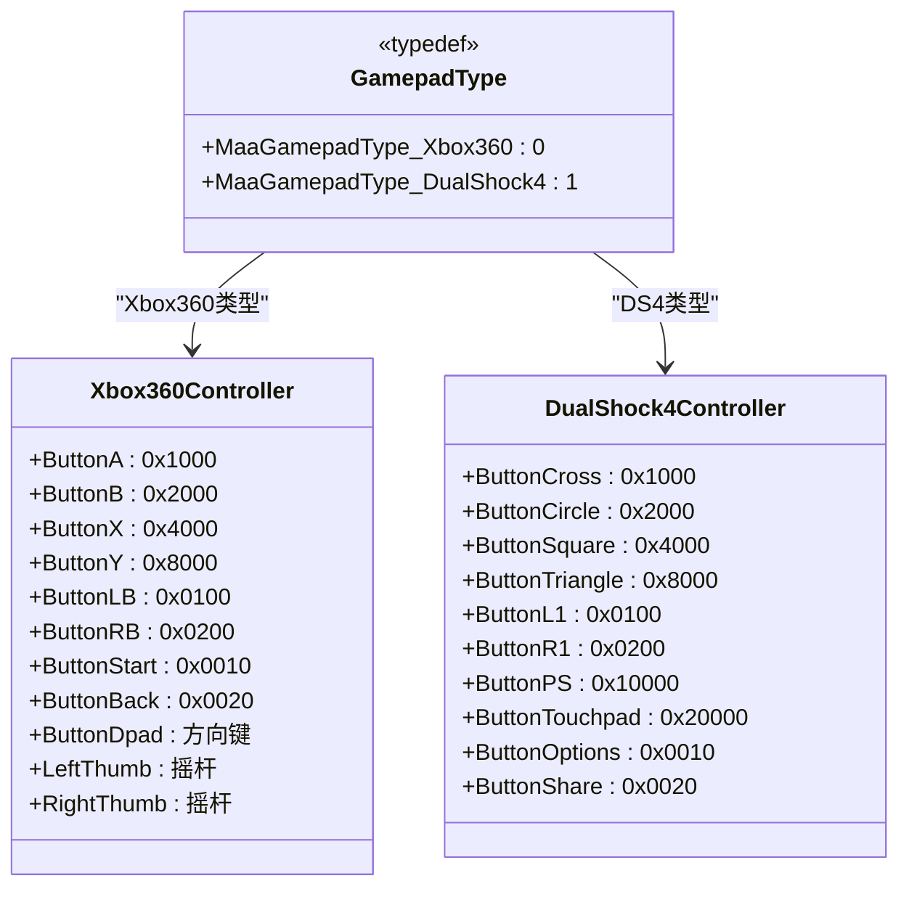
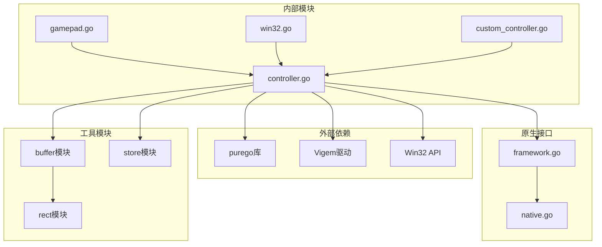

# maafw-golang 核心概念

<cite>
**本文档引用的文件列表**
- [README.md](file://README.md)
- [instructions/maafw-golang-binding/核心概念/核心概念.md](file://instructions/maafw-golang-binding/核心概念/核心概念.md)
- [instructions/maafw-golang-binding/API参考/框架初始化.md](file://instructions/maafw-golang-binding/API参考/框架初始化.md)
- [instructions/maafw-golang-binding/API参考/事件系统.md](file://instructions/maafw-golang-binding/API参考/事件系统.md)
- [instructions/maafw-golang-binding/API参考/任务管理器.md](file://instructions/maafw-golang-binding/API参考/任务管理器.md)
- [instructions/maafw-golang-binding/API参考/执行上下文.md](file://instructions/maafw-golang-binding/API参考/执行上下文.md)
- [instructions/maafw-golang-binding/API参考/控制器.md](file://instructions/maafw-golang-binding/API参考/控制器.md)
- [instructions/maafw-golang-binding/API参考/资源管理器.md](file://instructions/maafw-golang-binding/API参考/资源管理器.md)
- [instructions/maafw-golang-binding/高级功能/Agent架构/Agent架构.md](file://instructions/maafw-golang-binding/高级功能/Agent架构/Agent架构.md)
- [instructions/maafw-golang-binding/示例与用例/快速开始示例.md](file://instructions/maafw-golang-binding/示例与用例/快速开始示例.md)
- [instructions/maafw-golang-binding/示例与用例/Agent客户端示例.md](file://instructions/maafw-golang-binding/示例与用例/Agent客户端示例.md)
- [instructions/maafw-golang-binding/示例与用例/Agent服务器示例.md](file://instructions/maafw-golang-binding/示例与用例/Agent服务器示例.md)
- [src/App.tsx](file://src/App.tsx)
- [package.json](file://package.json)
- [instructions/maafw-golang-binding/核心概念/任务管理器 (Tasker).md](file://instructions/maafw-golang-binding/核心概念/任务管理器 (Tasker).md)
- [instructions/maafw-golang-binding/核心概念/事件系统 (Event System).md](file://instructions/maafw-golang-binding/核心概念/事件系统 (Event System).md)
- [instructions/maafw-golang-binding/核心概念/事件系统重构.md](file://instructions/maafw-golang-binding/核心概念/事件系统重构.md)
- [instructions/maafw-golang-binding/核心概念/控制器 (Controller)/PlayCover控制器.md](file://instructions/maafw-golang-binding/核心概念/控制器 (Controller)/PlayCover控制器.md)
- [instructions/maafw-golang-binding/核心概念/控制器 (Controller)/游戏pad控制器.md](file://instructions/maafw-golang-binding/核心概念/控制器 (Controller)/游戏pad控制器.md)
- [instructions/maafw-golang-binding/高级功能/基于节点的流水线系统.md](file://instructions/maafw-golang-binding/高级功能/基于节点的流水线系统.md)
- [controller.go](file://controller.go)
- [internal/native/framework.go](file://internal/native/framework.go)
- [event.go](file://event.go)
- [LocalBridge/internal/mfw/controller_manager.go](file://LocalBridge/internal/mfw/controller_manager.go)
- [LocalBridge/internal/mfw/types.go](file://LocalBridge/internal/mfw/types.go)
- [instructions/maafw-guide/2.4-控制方式说明.md](file://instructions/maafw-guide/2.4-控制方式说明.md)
- [instructions/maafw-golang-binding/API大全.md](file://instructions/maafw-golang-binding/API大全.md)
</cite>

## 更新摘要
**变更内容**
- 新增 `PostRecognition` 和 `PostAction` 方法的详细说明
- 扩展"任务生命周期"章节以涵盖直接提交识别与动作任务的功能
- 更新架构总览序列图以反映新增方法
- 增加新的组件详解小节"直接提交识别与动作任务"
- 更新类图以包含新增方法
- **新增"事件系统重构"章节，详细说明事件系统从代码生成到手写适配器模式的重构**
- **新增"PlayCover控制器"章节，介绍针对iOS设备上PlayCover应用的专用控制器**
- **新增"游戏pad控制器"章节，详细介绍Windows平台虚拟游戏手柄控制器的完整功能**
- **新增"基于节点的流水线系统"章节，阐述基于节点的声明式任务流架构**
- **更新控制器章节，增加Gamepad控制器的详细技术规范和使用指南**

## 目录
1. [引言](#引言)
2. [项目结构](#项目结构)
3. [核心组件](#核心组件)
4. [架构总览](#架构总览)
5. [详细组件分析](#详细组件分析)
6. [依赖关系分析](#依赖关系分析)
7. [性能考量](#性能考量)
8. [故障排查指南](#故障排查指南)
9. [结论](#结论)
10. [附录](#附录)

## 引言
本篇文档围绕 maa-framework-go 的核心概念与组件进行系统性阐述，目标是帮助开发者建立坚实的理论基础，理解 Tasker（任务调度中枢）、Resource（识别资源与流水线配置）、Controller（设备控制抽象，支持 ADB/Win32/PlayCover/Gamepad/自定义）、Context（任务执行上下文）、Event（事件回调系统）之间的协作关系与内部工作机制。文档同时结合代码库中的具体实现（如 NewTasker、PostTask、PostBundle 等），并通过图示展示组件间的数据流与依赖关系，并总结常见误用与最佳实践。**本次更新重点反映了事件系统重构、PlayCover控制器、游戏pad控制器和基于节点的流水线系统等新功能。**

## 项目结构
该仓库采用按职责分层的组织方式：
- 核心 API 层：tasker.go、resource.go、controller.go、context.go、event.go、job.go
- 自定义扩展层：custom_action.go、custom_recognition.go
- 示例层：examples 下包含快速开始、自定义动作、自定义识别、Agent 客户端/服务器等示例
- 内部工具与桥接：internal 目录下的缓冲区、原生桥接、存储等

**章节来源**
- [README.md](file://README.md#L30-L72)

## 核心组件
- Tasker：负责任务提交、状态查询、停止信号、事件回调注册、节点详情查询等，是任务执行的中枢。
- Resource：负责资源加载、流水线覆盖、自定义识别/动作注册、事件回调注册等，承载识别与动作的配置与能力。
- Controller：负责设备连接、截图、输入、应用启停、滚动等操作，抽象出 ADB/Win32/PlayCover/Gamepad/自定义控制器。
- Context：提供在单次任务执行中运行识别/动作的能力，支持覆盖流水线、锚点、命中计数等上下文级操作。
- Event：统一的事件回调代理与分发器，将底层事件映射到 Tasker/Resource/Controller/Context 的回调接口。
- Job/TaskJob：封装异步作业的状态查询与等待逻辑，TaskJob 还可获取任务详情。

**章节来源**
- [instructions/maafw-golang-binding/核心概念/核心概念.md](file://instructions/maafw-golang-binding/核心概念/核心概念.md#L84-L100)

## 架构总览
下图展示了从应用调用到底层原生交互的关键路径，以及事件回调的分发链路。

**图示来源**
- [instructions/maafw-golang-binding/核心概念/核心概念.md](file://instructions/maafw-golang-binding/核心概念/核心概念.md#L100-L134)

**章节来源**
- [instructions/maafw-golang-binding/核心概念/核心概念.md](file://instructions/maafw-golang-binding/核心概念/核心概念.md#L100-L134)

## 详细组件分析

### Tasker 组件
- 职责
  - 创建销毁、初始化检查、缓存清理
  - 绑定 Resource 与 Controller
  - 提交任务、停止任务、查询状态与等待完成
  - 查询任务详情、节点详情、最新节点
  - 注册/移除/清空事件回调（Tasker/Context 两类 Sink）
- 关键方法与行为
  - NewTasker：创建句柄并登记到全局存储，用于后续回调注销与资源回收
  - PostTask：支持字符串或任意可 JSON 序列化的覆盖参数；内部将覆盖参数序列化后传递给原生
  - PostStop：向任务器发送停止信号
  - AddSink/RemoveSink/ClearSinks：注册 TaskerEventSink 回调，保存映射以便销毁时注销
  - AddContextSink/RemoveContextSink/ClearContextSinks：注册 ContextEventSink 回调
  - 任务详情查询：getTaskDetail/getNodeDetail/getRecognitionDetail/getActionDetail
- 数据流
  - 任务提交后由原生执行，期间通过事件回调异步通知上层
  - 任务完成后可通过 Wait 获取最终状态，再通过 GetDetail 获取详细信息

**图示来源**
- [instructions/maafw-golang-binding/API参考/任务管理器.md](file://instructions/maafw-golang-binding/API参考/任务管理器.md#L150-L206)

**章节来源**
- [instructions/maafw-golang-binding/API参考/任务管理器.md](file://instructions/maafw-golang-binding/API参考/任务管理器.md#L150-L206)
- [instructions/maafw-golang-binding/API参考/任务管理器.md](file://instructions/maafw-golang-binding/API参考/任务管理器.md#L206-L234)

### Resource 组件
- 职责
  - 创建销毁、加载资源包、查询加载状态、获取哈希与节点列表
  - 流水线覆盖、下一跳覆盖、图像覆盖
  - 注册/注销/清空自定义识别与自定义动作
  - 注册/移除/清空事件回调（ResourceEventSink）
- 关键方法与行为
  - NewResource：创建句柄并登记到全局存储
  - PostBundle：添加资源路径并返回 Job，支持异步等待
  - OverridePipeline：支持字符串或任意可 JSON 序列化的覆盖参数
  - OverrideNext：按任务名覆盖下一跳列表
  - OverrideImage：覆盖指定图像
  - RegisterCustomRecognition/RegisterCustomAction：注册自定义识别/动作，保存回调ID映射
  - AddSink/RemoveSink/ClearSinks：注册 ResourceEventSink 回调
- 数据流
  - 资源加载完成后，可通过 Loaded 检查状态；节点列表与自定义项可通过相应接口查询

**图示来源**
- [instructions/maafw-golang-binding/API参考/资源管理器.md](file://instructions/maafw-golang-binding/API参考/资源管理器.md#L221-L271)

**章节来源**
- [instructions/maafw-golang-binding/API参考/资源管理器.md](file://instructions/maafw-golang-binding/API参考/资源管理器.md#L140-L210)

### Controller 组件
- 职责
  - 创建 ADB/Win32/PlayCover/Gamepad/自定义控制器实例
  - 设备连接、截图、点击、滑动、按键、输入文本、启动/停止应用、触摸/滚动等
  - 选项设置（如截图目标长边/短边、是否使用原始尺寸）
  - 缓存最近一次截图图像、获取 UUID
  - 注册/移除/清空事件回调（ControllerEventSink）
- 关键方法与行为
  - NewAdbController/NewWin32Controller/NewPlayCoverController/NewGamepadController/NewCustomController：五种构造方式
  - PostConnect/PostClick/PostSwipe/PostInputText/PostStartApp/PostStopApp/PostTouchDown/PostTouchMove/PostTouchUp/PostKeyDown/PostKeyUp/PostScreencap/PostScroll：各类设备操作
  - SetScreenshotTargetLongSide/SetScreenshotTargetShortSide/SetScreenshotUseRawSize：截图尺寸相关选项
  - CacheImage/GetUUID：读取缓存图像与设备 UUID
  - AddSink/RemoveSink/ClearSinks：注册 ControllerEventSink 回调
- 数据流
  - 控制器通过原生接口执行设备操作，期间通过事件回调异步通知上层

**图示来源**
- [instructions/maafw-golang-binding/API参考/控制器.md](file://instructions/maafw-golang-binding/API参考/控制器.md#L236-L300)

**章节来源**
- [instructions/maafw-golang-binding/API参考/控制器.md](file://instructions/maafw-golang-binding/API参考/控制器.md#L118-L182)

### Context 组件
- 职责
  - 在当前上下文中运行任务、识别、动作，并返回详细结果
  - 支持覆盖流水线、下一跳、图像覆盖
  - 获取节点 JSON、克隆上下文、设置/获取锚点、统计命中次数
  - 获取当前任务作业、当前 Tasker 实例
- 关键方法与行为
  - RunTask/RunRecognition/RunAction：在上下文中执行对应步骤，内部将覆盖参数序列化后传递给原生
  - OverridePipeline/OverrideNext/OverrideImage：覆盖上下文级配置
  - GetNodeJSON/GetNodeData：获取节点 JSON 并解析为结构化对象
  - GetTaskJob/GetTasker/Clone：获取当前任务作业、Tasker 或克隆上下文
  - SetAnchor/GetAnchor/GetHitCount/ClearHitCount：锚点与命中计数管理
- 数据流
  - 上下文通过 Tasker 执行任务，再由 Tasker 返回任务详情供 Context 使用

**图示来源**
- [instructions/maafw-golang-binding/API参考/执行上下文.md](file://instructions/maafw-golang-binding/API参考/执行上下文.md#L300-L340)

**章节来源**
- [instructions/maafw-golang-binding/API参考/执行上下文.md](file://instructions/maafw-golang-binding/API参考/执行上下文.md#L300-L340)

### Event 系统（观察者模式）
- 职责
  - 统一的事件回调注册与注销
  - 将底层事件消息映射到 Tasker/Resource/Controller/Context 的回调接口
  - 事件状态（Starting/Succeeded/Failed/Unknown）解析
- 关键机制
  - registerEventCallback/unregisterEventCallback：维护回调 ID 到 sink 的映射
  - _MaaEventCallbackAgent：原生回调入口，根据 transArg 查找 sink 并分发
  - eventHandler.handleRaw：根据消息前缀路由到对应回调接口
- 模式体现
  - 观察者模式：各组件通过 AddSink 注册回调，事件发生时异步通知
  - 适配器思想：将底层通用回调适配为不同组件的特定接口

**图示来源**
- [instructions/maafw-golang-binding/API参考/事件系统.md](file://instructions/maafw-golang-binding/API参考/事件系统.md#L344-L373)

**章节来源**
- [instructions/maafw-golang-binding/API参考/事件系统.md](file://instructions/maafw-golang-binding/API参考/事件系统.md#L331-L373)

### Job/TaskJob（异步作业模型）
- 职责
  - 封装异步作业的状态查询与等待
  - TaskJob 在 Job 基础上增加获取任务详情的能力
- 关键方法
  - Status/Done/Wait：查询状态、等待完成
  - TaskJob.GetDetail：获取任务详情

**图示来源**
- [instructions/maafw-golang-binding/API参考/任务管理器.md](file://instructions/maafw-golang-binding/API参考/任务管理器.md#L365-L401)

**章节来源**
- [instructions/maafw-golang-binding/API参考/任务管理器.md](file://instructions/maafw-golang-binding/API参考/任务管理器.md#L365-L401)

### 直接提交识别与动作任务
- **PostRecognition**：直接提交识别任务，接收识别类型、参数和图像，返回 TaskJob 用于状态查询和等待。适用于需要独立执行识别操作的场景。
- **PostAction**：直接提交动作任务，接收动作类型、参数、目标区域和识别结果，返回 TaskJob。适用于需要独立执行动作操作的场景。
- **灵活性**：这两个方法提供了比 PostTask 更细粒度的控制，允许开发者在不定义完整任务流程的情况下执行特定的识别或动作。
- **参数处理**：识别参数和动作参数会被序列化为 JSON 字符串，识别结果详情也会被序列化后传递给原生接口。

**图表来源**
- [tasker.go](file://tasker.go#L102-L124)
- [internal/native/framework.go](file://internal/native/framework.go#L35-L36)

**章节来源**
- [tasker.go](file://tasker.go#L102-L124)

### 工厂模式与门面模式的应用
- 工厂模式
  - Tasker/Resource/Controller 的构造函数分别负责创建不同类型的实例（NewTasker、NewResource、NewAdbController、NewWin32Controller、NewPlayCoverController、NewGamepadController、NewCustomController），体现了工厂模式的"创建型"特征
- 门面模式
  - Context 对外提供 RunTask/RunRecognition/RunAction 等高层接口，隐藏了底层 Tasker 的细节，形成简洁易用的门面
  - Tasker/Resource/Controller 的多数方法也起到简化调用的作用，便于上层以统一方式使用

**章节来源**
- [instructions/maafw-golang-binding/核心概念/核心概念.md](file://instructions/maafw-golang-binding/核心概念/核心概念.md#L404-L416)

### 事件系统重构
**章节来源**
- [instructions/maafw-golang-binding/核心概念/事件系统重构.md](file://instructions/maafw-golang-binding/核心概念/事件系统重构.md)
- [instructions/maafw-golang-binding/核心概念/事件系统 (Event System).md](file://instructions/maafw-golang-binding/核心概念/事件系统 (Event System).md)

事件系统已进行重构，主要变化如下：
- **移除代码生成**：不再使用 `tools/gen-event-sink` 工具生成事件接口和适配器，改为手写实现，提高了代码的可读性和可维护性。
- **引入手写适配器**：通过 `*EventSinkAdapter` 结构体（如 `TaskerEventSinkAdapter`）实现适配器模式，简化了单事件回调的注册。
- **简化分发逻辑**：事件分发逻辑更加清晰，移除了 `event_sinks_gen.go` 文件，降低了系统复杂性。
- **统一注册入口**：保留了 `AddSink`/`RemoveSink` 等统一的注册入口，但内部实现更简洁，通过全局映射表管理回调ID。

**图示来源**
- [instructions/maafw-golang-binding/核心概念/事件系统重构.md](file://instructions/maafw-golang-binding/核心概念/事件系统重构.md#L117-L140)
- [instructions/maafw-golang-binding/核心概念/事件系统 (Event System).md](file://instructions/maafw-golang-binding/核心概念/事件系统 (Event System).md#L174-L205)

### PlayCover控制器
**章节来源**
- [instructions/maafw-golang-binding/核心概念/控制器 (Controller)/PlayCover控制器.md](file://instructions/maafw-golang-binding/核心概念/控制器 (Controller)/PlayCover控制器.md)
- [controller.go](file://controller.go#L54-L68)
- [controller.go](file://controller.go#L179-L247)
- [controller.go](file://controller.go#L336-L358)
- [LocalBridge/internal/mfw/controller_manager.go](file://LocalBridge/internal/mfw/controller_manager.go#L128-L156)
- [LocalBridge/internal/mfw/types.go](file://LocalBridge/internal/mfw/types.go#L26-L31)

PlayCover控制器是专为与macOS上运行的iOS应用（通过PlayCover兼容层）进行交互而设计的控制器。
- **创建方式**：通过 `NewPlayCoverController(address, uuid string)` 创建，需要提供PlayCover应用的地址和控制器的唯一标识符。
- **核心功能**：支持连接管理、输入操作（点击、滑动、文本输入）、屏幕截图、应用管理（启动/停止）和事件回调。
- **异步操作**：所有操作（如 `PostClick`, `PostSwipe`）均返回 `Job` 实例，采用异步模式执行。
- **特性标志**：PlayCover控制器的特性标志为 `MaaControllerFeature_UseMouseDownAndUpInsteadOfClick`，表示框架会使用 touch_down + touch_up 代替 click 操作。
- **集成实现**：在 `LocalBridge/internal/mfw/controller_manager.go` 中，`CreatePlayCoverController` 方法封装了控制器的创建过程，生成唯一ID并维护控制器状态，确保与框架其他组件（如资源管理器、任务管理器）的协同工作。

**图示来源**
- [instructions/maafw-golang-binding/核心概念/控制器 (Controller)/PlayCover控制器.md](file://instructions/maafw-golang-binding/核心概念/控制器 (Controller)/PlayCover控制器.md#L100-L133)

### 游戏pad控制器
**章节来源**
- [instructions/maafw-golang-binding/核心概念/控制器 (Controller)/游戏pad控制器.md](file://instructions/maafw-golang-binding/核心概念/控制器 (Controller)/游戏pad控制器.md)
- [LocalBridge/internal/mfw/controller_manager.go](file://LocalBridge/internal/mfw/controller_manager.go#L158-L211)
- [instructions/maafw-guide/2.4-控制方式说明.md](file://instructions/maafw-guide/2.4-控制方式说明.md#L108-L165)
- [instructions/maafw-golang-binding/API大全.md](file://instructions/maafw-golang-binding/API大全.md#L1069-L1080)

游戏pad控制器是MaaFramework Go绑定中的重要组件，它提供了虚拟游戏pad控制器的功能，允许开发者在Windows平台上创建和控制虚拟的游戏手柄设备。该控制器支持Xbox 360和DualShock 4两种游戏pad类型，并且集成了屏幕截图功能。

**核心特性**
- 支持Xbox 360和DualShock 4两种游戏pad类型
- 提供完整的按钮映射和触摸输入支持
- 集成Win32屏幕截图功能
- 异步操作支持（通过Job模式）
- 事件回调机制
- ViGEm驱动要求

**前置要求**
- 需要安装 ViGEm Bus Driver 才能使用此控制器

**创建流程**

**图表来源**
- [instructions/maafw-golang-binding/核心概念/控制器 (Controller)/游戏pad控制器.md](file://instructions/maafw-golang-binding/核心概念/控制器 (Controller)/游戏pad控制器.md#L126-L141)

**章节来源**
- [instructions/maafw-golang-binding/核心概念/控制器 (Controller)/游戏pad控制器.md](file://instructions/maafw-golang-binding/核心概念/控制器 (Controller)/游戏pad控制器.md#L27-L474)

**架构概览**
游戏pad控制器采用分层架构设计，结合了Go语言的类型安全性和原生C库的高性能特性：

**图表来源**
- [instructions/maafw-golang-binding/核心概念/控制器 (Controller)/游戏pad控制器.md](file://instructions/maafw-golang-binding/核心概念/控制器 (Controller)/游戏pad控制器.md#L152-L190)

**游戏pad类型系统**
控制器支持两种主要的游戏pad类型：

**图表来源**
- [instructions/maafw-golang-binding/核心概念/控制器 (Controller)/游戏pad控制器.md](file://instructions/maafw-golang-binding/核心概念/控制器 (Controller)/游戏pad控制器.md#L310-L348)

**依赖关系分析**
游戏pad控制器的依赖关系展示了其在整个系统中的位置和作用：

**图表来源**
- [instructions/maafw-golang-binding/核心概念/控制器 (Controller)/游戏pad控制器.md](file://instructions/maafw-golang-binding/核心概念/控制器 (Controller)/游戏pad控制器.md#L358-L395)

**关键依赖说明**
1. **purego库**: 用于Go与原生C库的交互
2. **ViGEm驱动**: 虚拟游戏pad设备驱动程序
3. **Win32 API**: Windows平台的系统API调用
4. **缓冲区管理**: 图像和字符串数据的内存管理
5. **状态存储**: 控制器实例的状态持久化

**性能考虑**
游戏pad控制器在设计时考虑了多个性能优化方面：
- 使用原子操作管理自定义控制器回调ID
- 通过缓冲区池减少内存分配开销
- 智能的资源清理机制避免内存泄漏
- 所有控制器操作都支持异步执行
- Job模式提供非阻塞的操作接口
- 事件回调机制实现高效的响应式编程
- 直接调用原生Win32 API减少中间层开销
- ViGEm驱动的高效虚拟设备实现
- 最小化的数据转换和格式适配

**故障排除指南**
常见问题及解决方案：
- **ViGEm驱动问题**
  - 问题：创建游戏pad控制器时失败
  - 原因：ViGEm Bus Driver未正确安装
  - 解决方案：下载并安装最新版本的ViGEm驱动，重启系统确保驱动正确加载，验证驱动状态：设备管理器中查看ViGEm设备

- **屏幕截图功能异常**
  - 问题：游戏pad控制器无法进行屏幕截图
  - 原因：窗口句柄无效或Win32屏幕捕获方法不兼容
  - 解决方案：确保传入有效的窗口句柄，尝试不同的Win32屏幕捕获方法，检查应用程序权限和UAC设置

- **按钮映射错误**
  - 问题：DS4按钮映射不符合预期
  - 原因：按钮映射到Xbox等价物的限制
  - 解决方案：使用ButtonCross/ButtonCircle等别名访问DS4按钮，对于特殊按钮(PS、Touchpad)，使用专用常量，检查目标应用程序对不同按钮类型的处理

### 基于节点的流水线系统
**章节来源**
- [instructions/maafw-golang-binding/高级功能/基于节点的流水线系统.md](file://instructions/maafw-golang-binding/高级功能/基于节点的流水线系统.md)

该系统采用声明式任务流与JSON配置相结合的方式，构建了基于节点的自动化任务执行流程。
- **核心组件**：
  - **节点 (Node)**：流水线的基本执行单元，包含识别、动作、跳转逻辑等配置。
  - **流水线 (Pipeline)**：节点的集合，定义了任务的完整流程。
  - **任务器 (Tasker)**：负责任务的调度和执行，协调资源与控制器。
- **架构设计**：系统采用分层架构，上层为用户应用，中层为框架（Tasker, Context, Pipeline, Node），下层为资源（Resource）和控制器（Controller）。
- **扩展性**：支持通过 `RegisterCustomAction` 和 `RegisterCustomRecognition` 注册自定义动作和识别算法，极大地增强了框架的灵活性。

**图示来源**
- [instructions/maafw-golang-binding/高级功能/基于节点的流水线系统.md](file://instructions/maafw-golang-binding/高级功能/基于节点的流水线系统.md#L96-L119)

## 依赖关系分析
- 组件耦合
  - Tasker 依赖 Resource 与 Controller（绑定与查询）
  - Context 依赖 Tasker（获取任务详情、当前任务作业）
  - Event 系统为 Tasker/Resource/Controller/Context 提供统一的回调入口
  - Job/TaskJob 为 Tasker/Resource/Controller 的异步操作提供统一的状态查询与等待
- 外部依赖
  - 通过 internal/native 与原生 MaaFramework 交互
  - 通过 internal/store 维护句柄到回调映射与自定义识别/动作的回调 ID 映射

**图示来源**
- [instructions/maafw-golang-binding/核心概念/核心概念.md](file://instructions/maafw-golang-binding/核心概念/核心概念.md#L417-L449)

**章节来源**
- [instructions/maafw-golang-binding/核心概念/核心概念.md](file://instructions/maafw-golang-binding/核心概念/核心概念.md#L417-L449)

## 性能考量
- 异步作业模型
  - 使用 Job/TaskJob 避免阻塞主线程，提高吞吐量
- 缓存与复用
  - Tasker/Resource/Controller 在销毁时会注销所有回调，避免内存泄漏
  - Context 提供 Clone，可在需要时复制上下文以减少重复配置
- 图像与缓冲
  - 识别与动作过程中大量使用图像缓冲，注意及时释放缓冲区，避免内存占用过高
- 事件回调
  - 回调注册/注销需成对出现，避免回调表膨胀导致性能下降
- **游戏pad控制器性能优化**
  - ViGEm驱动的高效虚拟设备实现
  - 直接调用原生Win32 API减少中间层开销
  - 最小化的数据转换和格式适配

## 故障排查指南
- 初始化失败
  - 确认已正确初始化并配置运行库路径
  - 检查 Tasker/Resource/Controller 的初始化状态与错误返回值
- 事件未回调
  - 确认已正确注册 AddSink/RemoveSink，且回调 ID 未被重复使用
  - 检查事件消息前缀与回调类型匹配
- 任务无结果
  - 使用 Wait() 等待完成后再调用 GetDetail()
  - 检查 OverridePipeline/OverrideNext/OverrideImage 是否正确覆盖
- 设备连接问题
  - 确认 PostConnect 成功，Connected() 返回真
  - 检查截图尺寸设置与缓存图像是否可用
- **游戏pad控制器问题**
  - 确认ViGEm驱动已正确安装
  - 检查窗口句柄格式（十六进制字符串）是否正确
  - 验证游戏pad类型参数（"xbox360"或"dualshock4"）

**章节来源**
- [instructions/maafw-golang-binding/核心概念/核心概念.md](file://instructions/maafw-golang-binding/核心概念/核心概念.md#L470-L490)

## 结论
maa-framework-go 通过 Tasker、Resource、Controller、Context、Event 与 Job/TaskJob 的协同，构建了一个清晰、可扩展且高性能的自动化框架。Tasker 作为中枢协调任务执行，Resource 管理识别资源与流水线，Controller 抽象设备控制，Context 提供上下文级的执行能力，Event 以观察者模式实现异步通知，Job/TaskJob 则提供了统一的异步作业模型。工厂模式与门面模式的应用使得 API 更加简洁易用。

**本次更新引入的事件系统重构、PlayCover控制器、游戏pad控制器和基于节点的流水线系统，进一步增强了框架的可维护性、平台支持能力和任务编排的灵活性。** 特别是游戏pad控制器的加入，为Windows平台的虚拟手柄输入提供了完整而灵活的解决方案，支持ViGEm驱动和多种截图方法，满足了复杂自动化场景的需求。

遵循本文的最佳实践与排错建议，可有效提升开发效率与稳定性。

## 附录
- 快速开始示例展示了从初始化、设备连接、资源加载到任务执行的完整流程
- 自定义动作与识别示例展示了如何扩展识别与动作能力
- Agent 客户端/服务器示例展示了跨进程协作的工作流
- **游戏pad控制器示例**展示了虚拟手柄输入和屏幕截图功能的完整使用流程

**章节来源**
- [instructions/maafw-golang-binding/示例与用例/快速开始示例.md](file://instructions/maafw-golang-binding/示例与用例/快速开始示例.md#L360-L369)
- [instructions/maafw-golang-binding/示例与用例/Agent客户端示例.md](file://instructions/maafw-golang-binding/示例与用例/Agent客户端示例.md#L378-L391)
- [instructions/maafw-golang-binding/示例与用例/Agent服务器示例.md](file://instructions/maafw-golang-binding/示例与用例/Agent服务器示例.md#L388-L411)