# 其他字段

<cite>
**本文档引用的文件**  
- [schema.ts](file://src\core\fields\other\schema.ts)
- [index.ts](file://src\core\fields\other\index.ts)
- [fieldFactory.ts](file://src\core\fields\fieldFactory.ts)
- [types.ts](file://src\core\fields\types.ts)
- [fieldTypes.ts](file://src\core\fields\fieldTypes.ts)
- [PipelineEditor.tsx](file://src\components\panels\node-editors\PipelineEditor.tsx)
- [FieldPanel.tsx](file://src\components\panels\FieldPanel.tsx)
- [nodeParser.ts](file://src\core\parser\nodeParser.ts)
- [types.ts](file://src\stores\flow\types.ts)
- [AddFieldElem.tsx](file://src\components\panels\field-items\AddFieldElem.tsx)
- [ListValueElem.tsx](file://src\components\panels\field-items\ListValueElem.tsx)
- [3.1-任务流水线协议.md](file://instructions\maafw-pipeline\3.1-任务流水线协议.md)
</cite>

## 目录
1. [简介](#简介)
2. [其他字段概览](#其他字段概览)
3. [字段详细说明](#字段详细说明)
4. [字段类型定义](#字段类型定义)
5. [字段在系统中的使用](#字段在系统中的使用)
6. [字段生命周期与执行顺序](#字段生命周期与执行顺序)
7. [实际应用示例](#实际应用示例)
8. [最佳实践与注意事项](#最佳实践与注意事项)

## 简介

"其他字段"是MaaPipelineEditor中的一个重要组成部分，用于定义节点的非核心行为参数。这些字段提供了对节点执行流程的精细控制，包括超时设置、延迟控制、锚点管理、执行限制等功能。本文档将详细介绍这些字段的定义、用途和在系统中的实现方式。

**本文档引用的文件**
- [schema.ts](file://src\core\fields\other\schema.ts#L1-L131)
- [3.1-任务流水线协议.md](file://instructions\maafw-pipeline\3.1-任务流水线协议.md#L1-L800)

## 其他字段概览

"其他字段"定义了节点执行过程中的各种控制参数，这些参数不属于识别或动作的核心配置，但对节点的行为有重要影响。这些字段主要分为以下几类：

- **执行控制**：如 `timeout`（超时时间）、`rateLimit`（速率限制）
- **时间控制**：如 `preDelay`（前置延迟）、`postDelay`（后置延迟）
- **流程控制**：如 `anchor`（锚点）、`next`（下一节点）
- **执行限制**：如 `enabled`（是否启用）、`maxHit`（最大命中次数）
- **高级控制**：如 `preWaitFreezes`（前置等待静止）、`repeat`（重复执行）

这些字段共同构成了节点执行的完整控制体系，使得自动化流程可以更加灵活和可靠。

**本文档引用的文件**
- [schema.ts](file://src\core\fields\other\schema.ts#L1-L131)
- [3.1-任务流水线协议.md](file://instructions\maafw-pipeline\3.1-任务流水线协议.md#L1-L800)

## 字段详细说明

### rateLimit（速率限制）

`rateLimit` 字段定义了识别的最小时间间隔，单位为毫秒。默认值为1000毫秒。该字段确保每轮识别至少消耗指定的时间，不足的时间会通过sleep等待来补足。

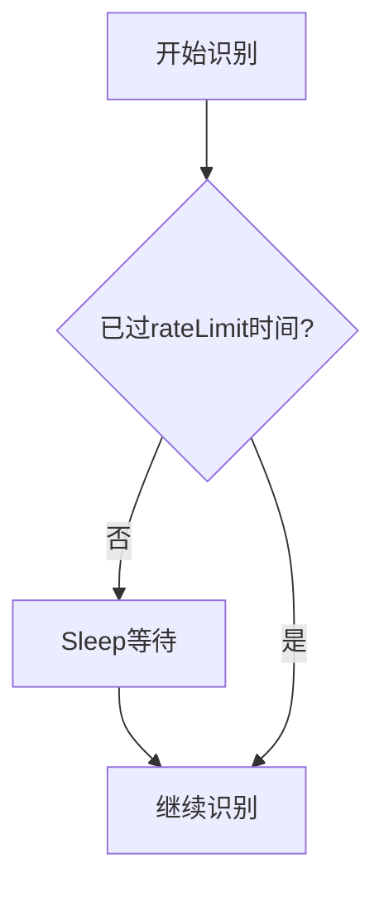

**本文档引用的文件**
- [schema.ts](file://src\core\fields\other\schema.ts#L8-L13)
- [3.1-任务流水线协议.md](file://instructions\maafw-pipeline\3.1-任务流水线协议.md#L164-L166)

### timeout（超时时间）

`timeout` 字段定义了识别的最长等待时间，单位为毫秒。默认值为20000毫秒。当识别持续未成功时，超过此时间后会触发超时处理。

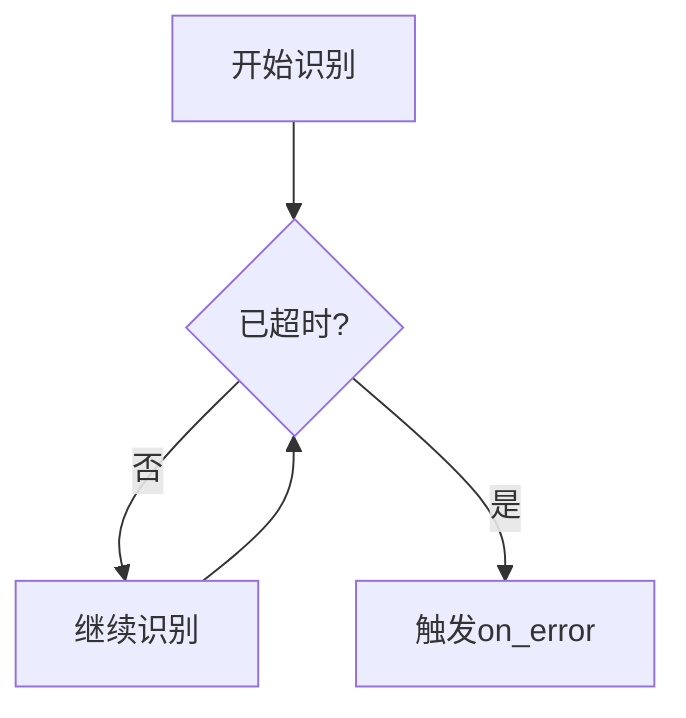

**本文档引用的文件**
- [schema.ts](file://src\core\fields\other\schema.ts#L15-L20)
- [3.1-任务流水线协议.md](file://instructions\maafw-pipeline\3.1-任务流水线协议.md#L168-L170)

### anchor（锚点）

`anchor` 字段用于设置节点的锚点名称。当节点执行成功后，该锚点名会被设置为当前节点。多个节点可以设置相同的锚点名，后执行的会覆盖先执行的。

```mermaid
flowchart TD
A[节点A] --> |执行成功| B[设置锚点A]
C[节点B] --> |执行成功| D[设置锚点A]
E[其他节点] --> |引用[Anchor]| F[跳转到节点B]
```

**本文档引用的文件**
- [schema.ts](file://src\core\fields\other\schema.ts#L22-L26)
- [3.1-任务流水线协议.md](file://instructions\maafw-pipeline\3.1-任务流水线协议.md#L176-L180)

### inverse（反转识别）

`inverse` 字段用于反转识别结果。当设置为true时，识别到了被视为没识别到，没识别到的被视为识别到了。

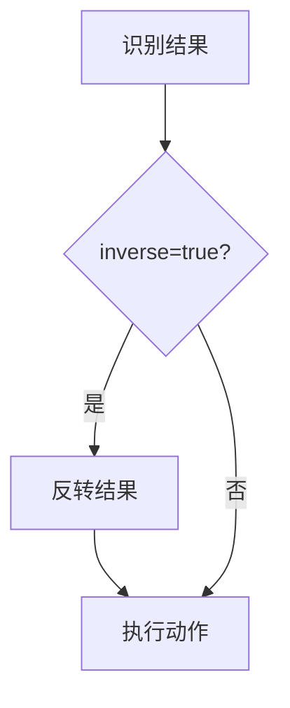

**本文档引用的文件**
- [schema.ts](file://src\core\fields\other\schema.ts#L28-L32)
- [3.1-任务流水线协议.md](file://instructions\maafw-pipeline\3.1-任务流水线协议.md#L182-L184)

### enabled（启用状态）

`enabled` 字段控制节点是否启用。默认为true。当设置为false时，其他节点的next列表中的该节点会被跳过。

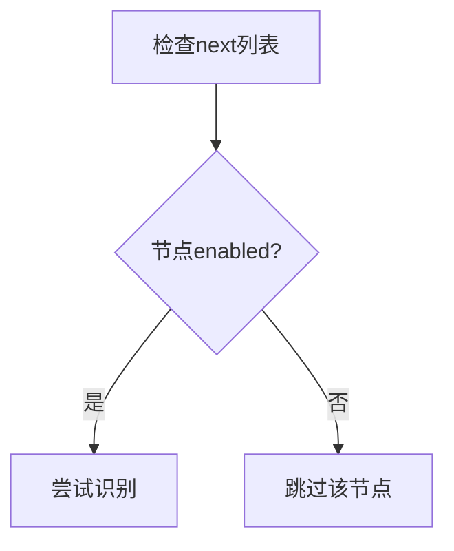

**本文档引用的文件**
- [schema.ts](file://src\core\fields\other\schema.ts#L34-L38)
- [3.1-任务流水线协议.md](file://instructions\maafw-pipeline\3.1-任务流水线协议.md#L186-L188)

### maxHit（最大命中次数）

`maxHit` 字段定义了节点最多可被识别成功的次数。超过此次数后，该节点会被跳过。

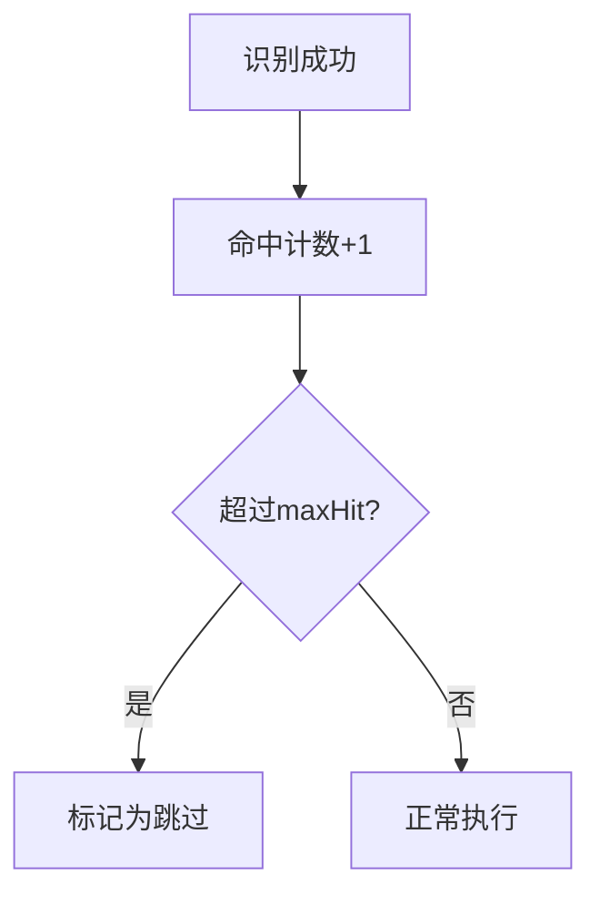

**本文档引用的文件**
- [schema.ts](file://src\core\fields\other\schema.ts#L40-L44)
- [3.1-任务流水线协议.md](file://instructions\maafw-pipeline\3.1-任务流水线协议.md#L190-L192)

### preDelay 和 postDelay（前后延迟）

`preDelay` 和 `postDelay` 字段分别定义了识别到后执行动作前的延迟和执行动作后识别next的延迟。

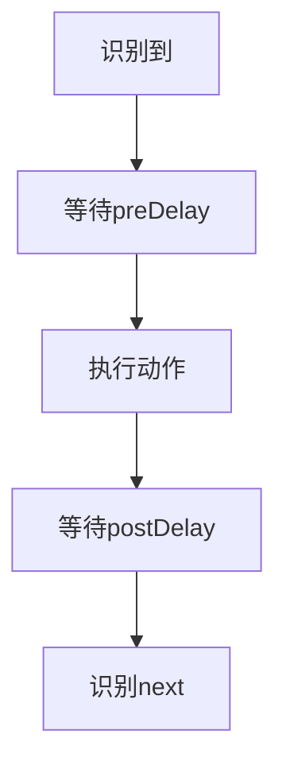

**本文档引用的文件**
- [schema.ts](file://src\core\fields\other\schema.ts#L46-L58)
- [3.1-任务流水线协议.md](file://instructions\maafw-pipeline\3.1-任务流水线协议.md#L194-L200)

### preWaitFreezes 和 postWaitFreezes（等待画面静止）

`preWaitFreezes` 和 `postWaitFreezes` 字段定义了在执行动作前后等待画面静止的时间。

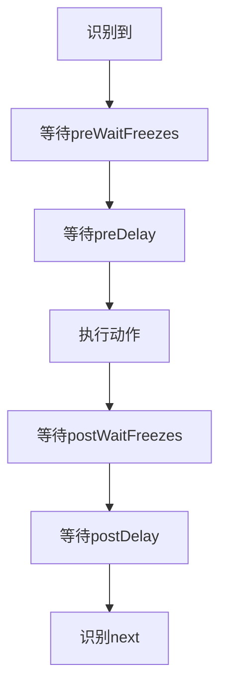

**本文档引用的文件**
- [schema.ts](file://src\core\fields\other\schema.ts#L60-L70)
- [3.1-任务流水线协议.md](file://instructions\maafw-pipeline\3.1-任务流水线协议.md#L202-L206)

### repeat（重复执行）

`repeat` 字段定义了动作的重复执行次数。`repeatDelay` 和 `repeatWaitFreezes` 用于控制重复执行之间的延迟和等待。

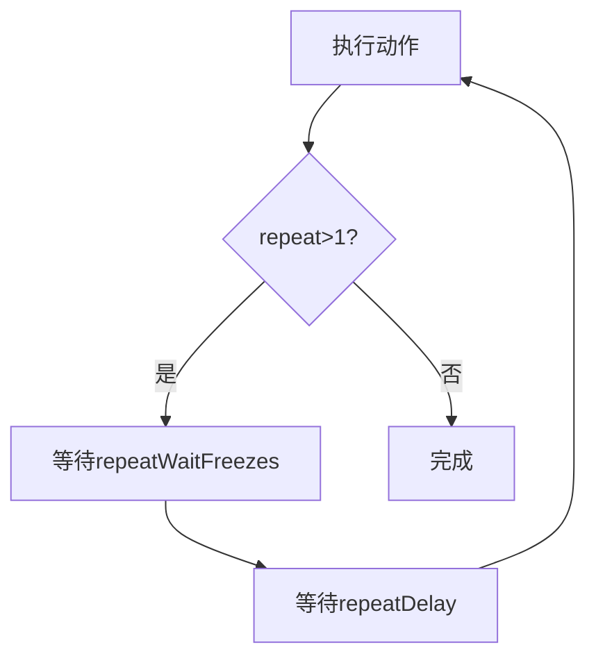

**本文档引用的文件**
- [schema.ts](file://src\core\fields\other\schema.ts#L78-L94)
- [3.1-任务流水线协议.md](file://instructions\maafw-pipeline\3.1-任务流水线协议.md#L254-L267)

## 字段类型定义

### 字段类型枚举

字段类型在 `fieldTypes.ts` 文件中定义，使用枚举 `FieldTypeEnum` 表示：

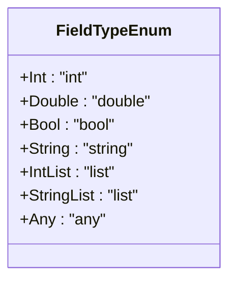

**本文档引用的文件**
- [fieldTypes.ts](file://src\core\fields\fieldTypes.ts#L1-L23)

### 字段结构定义

字段的基本结构在 `types.ts` 文件中定义，包含键名、类型、默认值和描述等属性：

```typescript
interface FieldType {
    key: string;
    type: FieldTypeEnum | FieldTypeEnum[];
    default: any;
    desc: string;
    step?: number;
    required?: boolean;
}
```

**本文档引用的文件**
- [types.ts](file://src\core\fields\types.ts#L6-L14)

## 字段在系统中的使用

### 字段工厂模式

系统使用工厂模式来创建和管理字段，通过 `fieldFactory.ts` 提供的辅助函数：

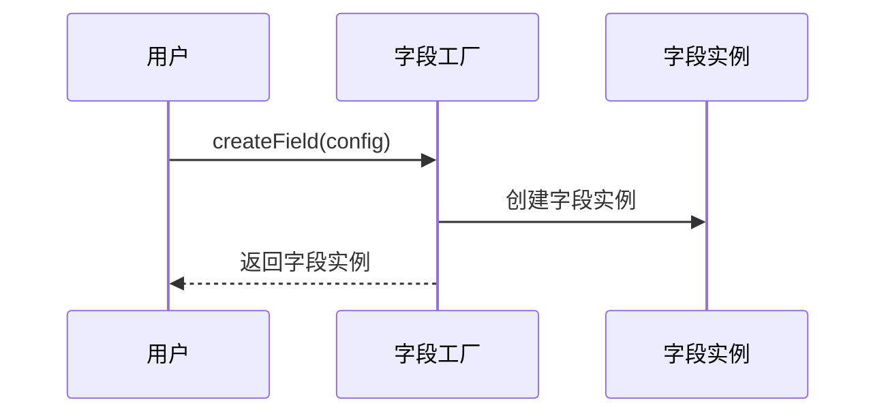

**本文档引用的文件**
- [fieldFactory.ts](file://src\core\fields\fieldFactory.ts#L6-L8)

### 字段在编辑器中的呈现

在 `PipelineEditor.tsx` 中，其他字段通过专门的UI组件进行展示和编辑：

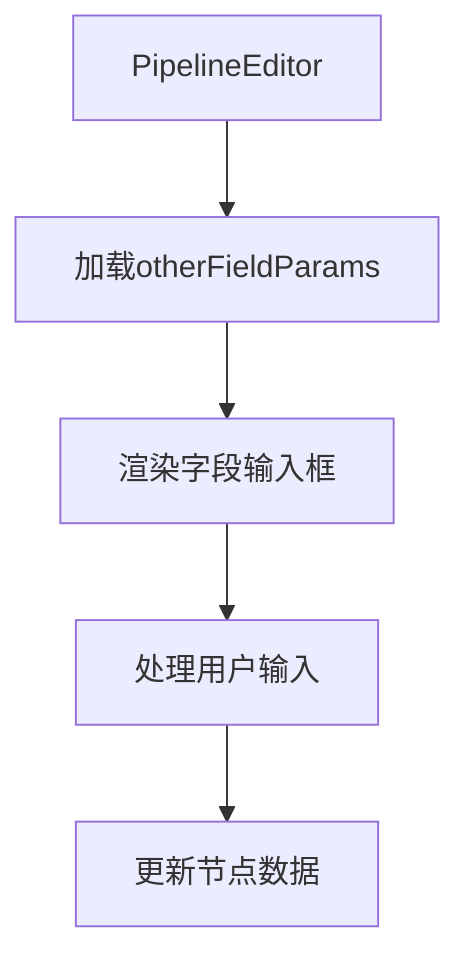

**本文档引用的文件**
- [PipelineEditor.tsx](file://src\components\panels\node-editors\PipelineEditor.tsx#L9-L298)
- [FieldPanel.tsx](file://src\components\panels\FieldPanel.tsx#L10-L45)

### 字段解析与导出

在 `nodeParser.ts` 中，其他字段被解析并导出为标准格式：

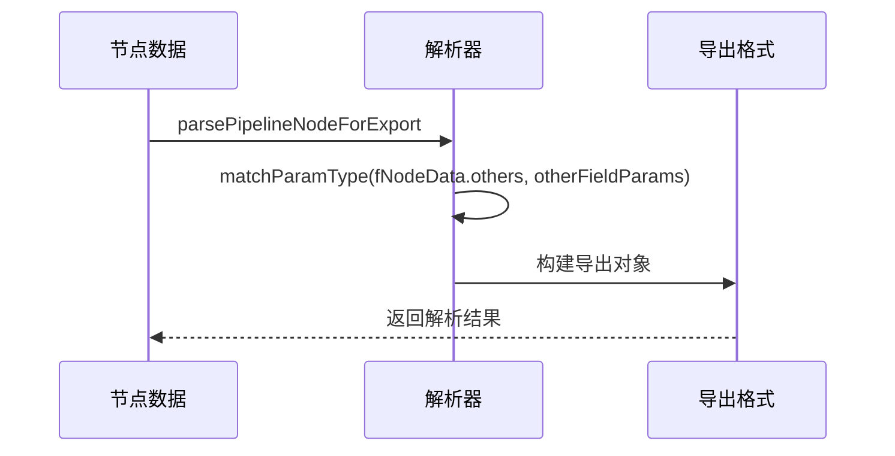

**本文档引用的文件**
- [nodeParser.ts](file://src\core\parser\nodeParser.ts#L46-L47)
- [types.ts](file://src\stores\flow\types.ts#L89-L100)

## 字段生命周期与执行顺序

### 节点执行生命周期

其他字段在节点执行过程中按照特定顺序发挥作用：

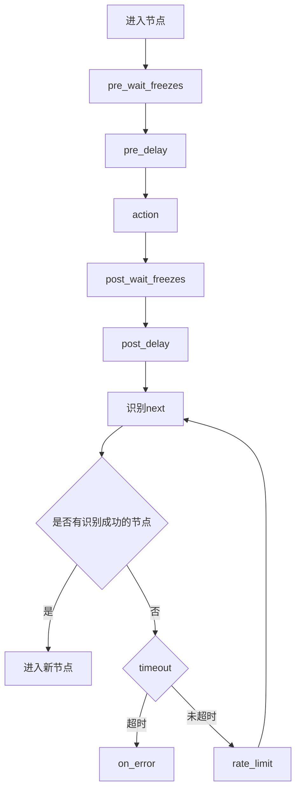

**本文档引用的文件**
- [3.1-任务流水线协议.md](file://instructions\maafw-pipeline\3.1-任务流水线协议.md#L223-L237)

### 字段执行顺序

各时间相关字段的执行顺序如下：

1. `pre_wait_freezes` - 识别到后等待画面静止
2. `pre_delay` - 识别到后延迟
3. `action` - 执行动作
4. `post_wait_freezes` - 动作后等待画面静止
5. `post_delay` - 动作后延迟

这个顺序确保了动作执行的稳定性和可靠性。

**本文档引用的文件**
- [schema.ts](file://src\core\fields\other\schema.ts#L64-L65)
- [schema.ts](file://src\core\fields\other\schema.ts#L70-L71)

## 实际应用示例

### 游戏自动化场景

在游戏自动化中，可以使用其他字段来处理复杂的交互：

```json
{
  "进入主界面": {
    "recognition": "TemplateMatch",
    "action": "Click",
    "timeout": 30000,
    "rate_limit": 2000,
    "anchor": "main_menu"
  },
  "战斗开始": {
    "recognition": "ColorMatch",
    "action": "Swipe",
    "pre_delay": 500,
    "post_delay": 1000,
    "max_hit": 3,
    "on_error": ["重新开始"]
  }
}
```

### 应用测试场景

在应用测试中，可以使用其他字段来确保测试的稳定性：

```json
{
  "登录检查": {
    "recognition": "OCR",
    "action": "DoNothing",
    "timeout": 15000,
    "enabled": true,
    "focus": "login_status"
  },
  "点击提交": {
    "recognition": "DirectHit",
    "action": "Click",
    "repeat": 3,
    "repeat_delay": 2000,
    "on_error": ["重新填写"]
  }
}
```

**本文档引用的文件**
- [3.1-任务流水线协议.md](file://instructions\maafw-pipeline\3.1-任务流水线协议.md#L60-L93)

## 最佳实践与注意事项

### 推荐实践

1. **避免过度使用延迟**：优先使用中间过程节点而不是延迟来控制流程
2. **合理设置超时时间**：根据实际场景设置合理的超时时间，避免过长或过短
3. **使用锚点管理流程**：通过锚点来管理复杂的流程跳转
4. **限制重复执行次数**：为重复执行设置合理的上限，防止无限循环

### 注意事项

1. **反转识别的限制**：当使用`inverse`时，Click等动作的点击自身将失效
2. **字段合并规则**：`attach`字段会与默认值进行字典合并而不是覆盖
3. **性能影响**：过多的等待和延迟会影响整体执行效率
4. **调试建议**：使用`focus`字段来产生额外的回调消息，便于调试

**本文档引用的文件**
- [schema.ts](file://src\core\fields\other\schema.ts#L51-L52)
- [schema.ts](file://src\core\fields\other\schema.ts#L100-L101)
- [3.1-任务流水线协议.md](file://instructions\maafw-pipeline\3.1-任务流水线协议.md#L183-L184)