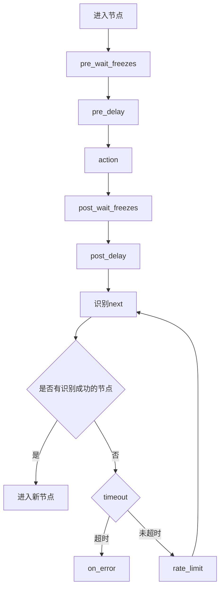

# 其他字段

<cite>
**本文引用的文件**
- [schema.ts](file://src\core\fields\other\schema.ts)
- [index.ts](file://src\core\fields\other\index.ts)
- [fieldFactory.ts](file://src\core\fields\fieldFactory.ts)
- [types.ts](file://src\core\fields\types.ts)
- [fieldTypes.ts](file://src\core\fields\fieldTypes.ts)
- [PipelineEditor.tsx](file://src\components\panels\node-editors\PipelineEditor.tsx)
- [FieldPanel.tsx](file://src\components\panels\FieldPanel.tsx)
- [nodeParser.ts](file://src\core\parser\nodeParser.ts)
- [types.ts](file://src\stores\flow\types.ts)
- [AddFieldElem.tsx](file://src\components\panels\field-items\AddFieldElem.tsx)
- [ListValueElem.tsx](file://src\components\panels\field-items\ListValueElem.tsx)
- [3.1-任务流水线协议.md](file://instructions\maafw-guide\3.1-任务流水线协议.md)
- [节点属性.md](file://instructions\maafw-golang-binding\高级功能\流水线配置\节点结构详解\节点结构详解.md)
- [通信协议.md](file://docsite\docs\01.指南\100.其他\10.通信协议.md)
- [action\schema.ts](file://src\core\fields\action\schema.ts)
- [action\fields.ts](file://src\core\fields\action\fields.ts)
</cite>

## 更新摘要
本次更新围绕"其他字段"配置的增强，主要变更包括：
- **timeout字段描述重写**：从"识别最长等待时间"改为"控制'下一个列表循环识别超时'"，更准确地反映了其在节点执行循环中的作用
- **anchor字段增强**：在描述中增加了"详见 节点属性"的引用，引导用户查看更详细的锚点机制说明
- **maxHit默认值调整**：从5改为1，提供更严格的节点命中次数控制
- **focus字段描述扩展**：大幅扩展了focus字段的功能描述，包含消息类型、模板字符串、文件路径支持、URL支持、直接文本内容、Markdown格式支持、国际化能力和自动占位符替换等特性
- **触控交互能力增强**：新增contact和pressure参数支持，为Click、Swipe、LongPress等动作提供更精细的多点触控和压力控制能力

## 目录
1. [简介](#简介)
2. [其他字段概览](#其他字段概览)
3. [字段详细说明](#字段详细说明)
4. [字段类型定义](#字段类型定义)
5. [字段在系统中的使用](#字段在系统中的使用)
6. [字段生命周期与执行顺序](#字段生命周期与执行顺序)
7. [实际应用示例](#实际应用示例)
8. [最佳实践与注意事项](#最佳实践与注意事项)

## 简介
"其他字段"是 MaaPipelineEditor 中用于定义节点非核心行为参数的重要集合。它们提供对节点执行流程的精细控制，涵盖超时、延迟、锚点、启用状态、命中次数、等待画面静止、重复执行等多个方面。本次更新重点增强了字段的功能描述和使用体验，特别是timeout、anchor、maxHit和focus字段的改进，使自动化流程更加精确和可控。

**本文引用的文件**
- [schema.ts](file://src\core\fields\other\schema.ts)
- [3.1-任务流水线协议.md](file://instructions\maafw-guide\3.1-任务流水线协议.md)

## 其他字段概览
"其他字段"主要包括以下类别：
- 执行控制：如 rateLimit（速率限制）
- 时间控制：如 preDelay（前置延迟）、postDelay（后置延迟）
- 流程控制：如 anchor（锚点）、next（下一节点）
- 执行限制：如 enabled（是否启用）、maxHit（最大命中次数）
- 高级控制：如 preWaitFreezes（前置等待静止）、postWaitFreezes（后置等待静止）、repeat（重复执行）、repeatDelay（重复延迟）、repeatWaitFreezes（重复等待静止）
- 调试支持：如 focus（关注节点）

这些字段共同构成节点执行的完整控制体系，使自动化流程更灵活、更可靠。

**本文引用的文件**
- [schema.ts](file://src\core\fields\other\schema.ts)
- [3.1-任务流水线协议.md](file://instructions\maafw-guide\3.1-任务流水线协议.md)

## 字段详细说明

### rateLimit（速率限制）
- 类型：整数（毫秒）
- 默认值：1000
- 描述：识别速率限制，单位毫秒。可选，默认 1000。每轮识别 next 最低消耗 rate_limit 毫秒，不足的时间将会 sleep 等待。
- 适用范围：所有节点的识别循环中。

**本文引用的文件**
- [schema.ts](file://src\core\fields\other\schema.ts#L8-L13)
- [3.1-任务流水线协议.md](file://instructions\maafw-guide\3.1-任务流水线协议.md#L164-L166)

### timeout（超时时间）
- 类型：整数（毫秒）
- 默认值：20000
- 描述：控制"下一个列表循环识别超时"，毫秒。可选，默认 20 * 1000（20 秒）。设置为 -1 表示无限等待，永不超时。具体逻辑为 while(!timeout) { foreach(next); sleep_until(rate_limit); }。
- 适用范围：节点的 next 列表循环识别过程。

**更新**：timeout字段描述已重写，现在更准确地反映了其在"下一个列表循环识别"中的作用，而不是简单的"识别最长等待时间"。

**本文引用的文件**
- [schema.ts](file://src\core\fields\other\schema.ts#L15-L21)
- [3.1-任务流水线协议.md](file://instructions\maafw-guide\3.1-任务流水线协议.md#L168-L170)

### anchor（锚点）
- 类型：字符串或字符串列表
- 默认值：空字符串
- 描述：锚点名称。可选，默认空。当节点执行成功后，会将该锚点名设置为当前节点。多个节点可设置同一个锚点名，后执行的会覆盖先执行的。在 next 或 on_error 中可通过 [Anchor] 属性引用该锚点，运行时会解析为最后设置该锚点的节点。详见 节点属性。

**更新**：anchor字段描述已增强，增加了"详见 节点属性"的引用，引导用户查看更详细的锚点机制说明。

**本文引用的文件**
- [schema.ts](file://src\core\fields\other\schema.ts#L22-L27)
- [节点属性.md](file://instructions\maafw-golang-binding\高级功能\流水线配置\节点结构详解\节点结构详解.md#L59-L66)

### inverse（反转识别）
- 类型：布尔
- 默认值：true
- 描述：反转识别结果，识别到了当做没识别到，没识别到的当做识别到了。可选，默认 false。请注意由此识别出的节点，Click 等动作的点击自身将失效（因为实际并没有识别到东西），若有需求可单独设置 target。

**本文引用的文件**
- [schema.ts](file://src\core\fields\other\schema.ts#L28-L33)
- [3.1-任务流水线协议.md](file://instructions\maafw-guide\3.1-任务流水线协议.md#L183-L184)

### enabled（启用状态）
- 类型：布尔
- 默认值：false
- 描述：是否启用该 node。可选，默认 true。若为 false，其他 node 的 next 列表中的该 node 会被跳过，既不会被识别也不会被执行。

**本文引用的文件**
- [schema.ts](file://src\core\fields\other\schema.ts#L34-L39)
- [3.1-任务流水线协议.md](file://instructions\maafw-guide\3.1-任务流水线协议.md#L186-L188)

### maxHit（最大命中次数）
- 类型：整数
- 默认值：1
- 描述：该节点最多可被识别成功多少次。可选，默认 1。若超过该次数，其他 node 的 next 列表中的该 node 会被跳过，既不会被识别也不会被执行。

**更新**：maxHit默认值已从5调整为1，提供更严格的节点命中次数控制。

**本文引用的文件**
- [schema.ts](file://src\core\fields\other\schema.ts#L40-L45)
- [3.1-任务流水线协议.md](file://instructions\maafw-guide\3.1-任务流水线协议.md#L190-L192)

### preDelay 与 postDelay（前后延迟）
- 类型：整数（毫秒）
- 默认值：分别为 400 左右
- 描述：识别到 到 执行动作前 的延迟；动作后 到 识别 next 的延迟。可选，默认 200。推荐尽可能增加中间过程节点，少用延迟，不然既慢还不稳定。

**本文引用的文件**
- [schema.ts](file://src\core\fields\other\schema.ts#L46-L59)
- [3.1-任务流水线协议.md](file://instructions\maafw-guide\3.1-任务流水线协议.md#L194-L200)

### preWaitFreezes、postWaitFreezes、repeatWaitFreezes（等待画面静止）
- 类型：整数或对象
- 默认值：0（整数模式表示等待毫秒数；对象模式包含详细参数）
- 描述：在识别到/动作后/重复动作前等待画面静止的时间。可选，默认 0，即不等待。连续指定毫秒数画面没有较大变化才会退出等待。若为 object，可设置更多参数，详见 等待画面静止。具体的顺序为 pre_wait_freezes - pre_delay - action - post_wait_freezes - post_delay。

**本文引用的文件**
- [schema.ts](file://src\core\fields\other\schema.ts#L60-L119)
- [schema.ts](file://src\core\fields\other\schema.ts#L120-L179)
- [schema.ts](file://src\core\fields\other\schema.ts#L242-L301)
- [PipelineEditor.tsx](file://src\components\panels\node-editors\PipelineEditor.tsx#L180-L200)
- [PipelineEditor.tsx](file://src\components\panels\node-editors\PipelineEditor.tsx#L192-L223)
- [PipelineEditor.tsx](file://src\components\panels\node-editors\PipelineEditor.tsx#L225-L291)
- [PipelineEditor.tsx](file://src\components\panels\node-editors\PipelineEditor.tsx#L493-L571)
- [PipelineEditor.tsx](file://src\components\panels\node-editors\PipelineEditor.tsx#L573-L651)
- [PipelineEditor.tsx](file://src\components\panels\node-editors\PipelineEditor.tsx#L652-L724)

### repeat（重复执行）
- 类型：整数
- 默认值：2
- 描述：动作重复执行次数。可选，默认 1，即不重复。执行流程为 action - [repeat_wait_freezes - repeat_delay - action] × (repeat-1)。

**本文引用的文件**
- [schema.ts](file://src\core\fields\other\schema.ts#L230-L235)
- [3.1-任务流水线协议.md](file://instructions\maafw-guide\3.1-任务流水线协议.md#L254-L267)

### focus（关注节点）
- 类型：任意
- 默认值：空
- 描述：关注节点，会额外产生部分回调消息。可选，默认 null，不产生回调消息。在节点中添加 focus 字段，键为消息类型，值为要展示的模板字符串，模板字符串支持文件路径、URL或直接文本，内容支持Markdown格式，支持国际化（以$开头）。模板中可使用 {字段名} 格式的占位符，UI 会自动替换为实际值。

**更新**：focus字段描述已大幅扩展，现在包含了消息类型、模板字符串、文件路径支持、URL支持、直接文本内容、Markdown格式支持、国际化能力和自动占位符替换等完整功能说明。

**本文引用的文件**
- [schema.ts](file://src\core\fields\other\schema.ts#L180-L229)
- [3.1-任务流水线协议.md](file://instructions\maafw-guide\3.1-任务流水线协议.md#L1-L200)
- [通信协议.md](file://docsite\docs\01.指南\100.其他\10.通信协议.md#L582-L625)

### attach（附加配置）
- 类型：任意对象
- 默认值：空对象
- 描述：附加 JSON 对象，用于保存节点的附加配置。可选，默认空对象。该字段可用于存储自定义的配置信息，这些信息不会影响节点的执行逻辑，但可以通过相关接口获取。注意：该字段会与默认值中的 attach 进行字典合并（dict merge），而不是覆盖。即节点中的 attach 会与默认值中的 attach 合并，相同键的值会被节点中的值覆盖，但其他键会保留。

**本文引用的文件**
- [schema.ts](file://src\core\fields\other\schema.ts#L302-L307)

### 触控参数（contact 和 pressure）

**新增**：为了支持更精细的触摸交互控制，系统现在为多种动作类型提供了触控参数支持。

#### contact（触点编号）
- 类型：整数
- 默认值：0
- 描述：触点编号，用于区分不同的触控点。可选，默认 0。Adb 控制器：表示手指编号（0 为第一根手指，1 为第二根手指，以此类推） Win32 控制器：表示鼠标按键编号（0 为左键，1 为右键，2 为中键，3 为 XBUTTON1，4 为 XBUTTON2）

#### pressure（触控压力）
- 类型：整数
- 默认值：1
- 描述：触控压力，范围取决于控制器实现。可选，默认 1。

**支持的动作类型**：
- Click（点击）
- Swipe（滑动）
- LongPress（长按）
- TouchDown（按下触控点）
- TouchMove（移动触控点）
- TouchUp（抬起触控点）

**本文引用的文件**
- [action\schema.ts](file://src\core\fields\action\schema.ts#L140-L165)
- [action\fields.ts](file://src\core\fields\action\fields.ts#L12-L92)
- [3.1-任务流水线协议.md](file://instructions\maafw-guide\3.1-任务流水线协议.md#L841-L847)
- [3.1-任务流水线协议.md](file://instructions\maafw-guide\3.1-任务流水线协议.md#L877-L883)
- [3.1-任务流水线协议.md](file://instructions\maafw-guide\3.1-任务流水线协议.md#L956-L968)

## 字段类型定义

### 字段类型枚举
字段类型在 fieldTypes.ts 中定义，使用枚举 FieldTypeEnum 表示基本类型。

**本文引用的文件**
- [fieldTypes.ts](file://src\core\fields\fieldTypes.ts#L1-L26)

### 字段结构定义
字段的基本结构在 types.ts 中定义，包含键名、类型、默认值、描述等属性。

**本文引用的文件**
- [types.ts](file://src\core\fields\types.ts#L6-L16)

## 字段在系统中的使用

### 字段工厂模式
系统使用工厂模式创建字段，通过 fieldFactory.ts 提供的辅助函数简化字段定义。

**本文引用的文件**
- [fieldFactory.ts](file://src\core\fields\fieldFactory.ts#L6-L8)

### 字段在编辑器中的呈现
在 PipelineEditor.tsx 中，其他字段通过专门的 UI 组件进行展示与编辑。针对 waitFreezes 相关字段，编辑器实现了：
- int/object 双模式识别与切换
- 对象模式下的参数列表配置
- 添加/删除/修改子字段的交互逻辑

**本文引用的文件**
- [PipelineEditor.tsx](file://src\components\panels\node-editors\PipelineEditor.tsx#L180-L200)
- [PipelineEditor.tsx](file://src\components\panels\node-editors\PipelineEditor.tsx#L192-L223)
- [PipelineEditor.tsx](file://src\components\panels\node-editors\PipelineEditor.tsx#L225-L291)
- [PipelineEditor.tsx](file://src\components\panels\node-editors\PipelineEditor.tsx#L493-L571)
- [PipelineEditor.tsx](file://src\components\panels\node-editors\PipelineEditor.tsx#L573-L651)
- [PipelineEditor.tsx](file://src\components\panels\node-editors\PipelineEditor.tsx#L652-L724)

### 字段解析与导出
在 nodeParser.ts 中，其他字段被解析并导出为标准格式，确保与协议规范一致。

**本文引用的文件**
- [nodeParser.ts](file://src\core\parser\nodeParser.ts#L46-L47)
- [types.ts](file://src\stores\flow\types.ts#L89-L100)

## 字段生命周期与执行顺序

### 节点执行生命周期
其他字段在节点执行过程中按以下顺序发挥作用：

**本文引用的文件**
- [3.1-任务流水线协议.md](file://instructions\maafw-guide\3.1-任务流水线协议.md#L223-L237)

### 字段执行顺序
各时间相关字段的执行顺序如下：
1. pre_wait_freezes（识别到后等待画面静止）
2. pre_delay（识别到后延迟）
3. action（执行动作）
4. post_wait_freezes（动作后等待画面静止）
5. post_delay（动作后延迟）

该顺序保证动作执行的稳定性与可靠性。

**本文引用的文件**
- [schema.ts](file://src\core\fields\other\schema.ts#L60-L71)
- [schema.ts](file://src\core\fields\other\schema.ts#L120-L129)
- [schema.ts](file://src\core\fields\other\schema.ts#L242-L253)

### waitFreezesFields 的作用与使用
- 定义：waitFreezesFields 由 pre_wait_freezes、post_wait_freezes、repeat_wait_freezes 三者组成，用于统一标识和处理"等待画面静止"相关字段。
- 用途：在 UI 编辑器中，通过 waitFreezesFields 可以识别这些字段并提供一致的结构化配置体验（int/object 双模式）。
- 影响：新增该数组后，编辑器对这些字段的交互逻辑进行了专门处理，包括模式切换、参数增删改等。

**本文引用的文件**
- [schema.ts](file://src\core\fields\other\schema.ts#L337-L341)
- [index.ts](file://src\core\fields\other\index.ts#L1-L8)
- [PipelineEditor.tsx](file://src\components\panels\node-editors\PipelineEditor.tsx#L180-L200)
- [PipelineEditor.tsx](file://src\components\panels\node-editors\PipelineEditor.tsx#L192-L223)
- [PipelineEditor.tsx](file://src\components\panels\node-editors\PipelineEditor.tsx#L225-L291)
- [PipelineEditor.tsx](file://src\components\panels\node-editors\PipelineEditor.tsx#L493-L571)
- [PipelineEditor.tsx](file://src\components\panels\node-editors\PipelineEditor.tsx#L573-L651)
- [PipelineEditor.tsx](file://src\components\panels\node-editors\PipelineEditor.tsx#L652-L724)

## 实际应用示例
以下示例展示了在不同场景中如何使用"其他字段"（示例以路径代替具体代码片段）：

- 游戏自动化场景（进入主界面、战斗开始等）：参见 [3.1-任务流水线协议.md](file://instructions\maafw-guide\3.1-任务流水线协议.md#L60-L93)
- 应用测试场景（登录检查、点击提交等）：参见 [3.1-任务流水线协议.md](file://instructions\maafw-guide\3.1-任务流水线协议.md#L60-L93)

## 最佳实践与注意事项
- 避免过度使用延迟：优先使用中间过程节点而非延迟控制流程
- 合理设置超时时间：根据实际场景设定合理的 timeout，避免过长或过短
- 使用锚点管理流程：通过 anchor 管理复杂的流程跳转
- 严格控制重复执行次数：为 repeat 设置合理上限，防止无限循环
- 反转识别的限制：使用 inverse 时，某些动作（如点击自身）可能无效
- 字段合并规则：attach 字段会与默认值进行字典合并（相同键覆盖，其他键保留）
- 性能影响：过多等待和延迟会影响整体执行效率
- 调试建议：使用 focus 字段产生额外回调消息，便于调试

**更新**：maxHit默认值已从5调整为1，建议在需要严格控制节点执行次数的场景中使用。

**更新**：新增触控参数支持，建议在需要精细控制触摸交互的场景中使用contact和pressure参数。

**本文引用的文件**
- [schema.ts](file://src\core\fields\other\schema.ts#L28-L33)
- [schema.ts](file://src\core\fields\other\schema.ts#L302-L307)
- [3.1-任务流水线协议.md](file://instructions\maafw-guide\3.1-任务流水线协议.md#L183-L184)
- [action\schema.ts](file://src\core\fields\action\schema.ts#L140-L165)
- [action\fields.ts](file://src\core\fields\action\fields.ts#L12-L92)