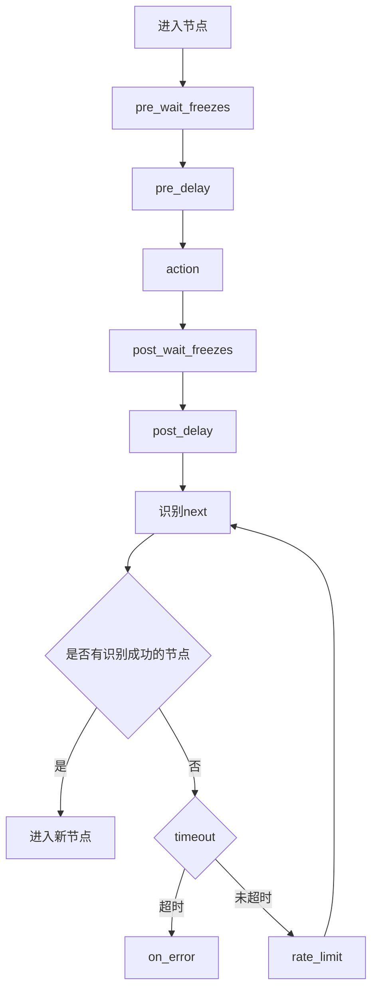

# 其他字段

<cite>
**本文引用的文件**
- [schema.ts](file://src\core\fields\other\schema.ts)
- [index.ts](file://src\core\fields\other\index.ts)
- [fieldFactory.ts](file://src\core\fields\fieldFactory.ts)
- [types.ts](file://src\core\fields\types.ts)
- [fieldTypes.ts](file://src\core\fields\fieldTypes.ts)
- [PipelineEditor.tsx](file://src\components\panels\node-editors\PipelineEditor.tsx)
- [FieldPanel.tsx](file://src\components\panels\FieldPanel.tsx)
- [nodeParser.ts](file://src\core\parser\nodeParser.ts)
- [types.ts](file://src\stores\flow\types.ts)
- [AddFieldElem.tsx](file://src\components\panels\field-items\AddFieldElem.tsx)
- [ListValueElem.tsx](file://src\components\panels\field-items\ListValueElem.tsx)
- [3.1-任务流水线协议.md](file://instructions\maafw-pipeline\3.1-任务流水线协议.md)
</cite>

## 更新摘要
本次更新围绕“其他字段”配置的增强，新增 waitFreezesFields 数组，用于统一标识和处理“等待画面静止”相关字段（pre_wait_freezes、post_wait_freezes、repeat_wait_freezes）。该增强使 UI 编辑器能够以一致的方式识别这些字段，并提供更灵活的结构化配置能力（int/object 双模式），包括时间阈值、目标区域、模板匹配算法、匹配阈值、检测速率限制和超时等参数。

同时，文档内容相应补充了 waitFreezesFields 的定义与使用说明，并更新了字段生命周期与执行顺序的描述，确保与新增的冻结等待配置保持一致。

## 目录
1. [简介](#简介)
2. [其他字段概览](#其他字段概览)
3. [字段详细说明](#字段详细说明)
4. [字段类型定义](#字段类型定义)
5. [字段在系统中的使用](#字段在系统中的使用)
6. [字段生命周期与执行顺序](#字段生命周期与执行顺序)
7. [实际应用示例](#实际应用示例)
8. [最佳实践与注意事项](#最佳实践与注意事项)

## 简介
“其他字段”是 MaaPipelineEditor 中用于定义节点非核心行为参数的重要集合。它们提供对节点执行流程的精细控制，涵盖超时、延迟、锚点、启用状态、命中次数、等待画面静止、重复执行等多个方面。本次更新重点增强“等待画面静止”的配置能力，通过 waitFreezesFields 统一管理相关字段，提升复杂场景下的稳定性与可控性。

**本文引用的文件**
- [schema.ts](file://src\core\fields\other\schema.ts)
- [3.1-任务流水线协议.md](file://instructions\maafw-pipeline\3.1-任务流水线协议.md)

## 其他字段概览
“其他字段”主要包括以下类别：
- 执行控制：如 rateLimit（速率限制）
- 时间控制：如 preDelay（前置延迟）、postDelay（后置延迟）
- 流程控制：如 anchor（锚点）、next（下一节点）
- 执行限制：如 enabled（是否启用）、maxHit（最大命中次数）
- 高级控制：如 preWaitFreezes（前置等待静止）、postWaitFreezes（后置等待静止）、repeat（重复执行）、repeatDelay（重复延迟）、repeatWaitFreezes（重复等待静止）

这些字段共同构成节点执行的完整控制体系，使自动化流程更灵活、更可靠。

**本文引用的文件**
- [schema.ts](file://src\core\fields\other\schema.ts)
- [3.1-任务流水线协议.md](file://instructions\maafw-pipeline\3.1-任务流水线协议.md)

## 字段详细说明

### rateLimit（速率限制）
- 类型：整数（毫秒）
- 默认值：1000
- 描述：每轮识别 next 最低消耗的时间。不足的时间会通过 sleep 等待补齐。
- 适用范围：所有节点的识别循环中。

**本文引用的文件**
- [schema.ts](file://src\core\fields\other\schema.ts#L8-L13)
- [3.1-任务流水线协议.md](file://instructions\maafw-pipeline\3.1-任务流水线协议.md#L164-L166)

### timeout（超时时间）
- 类型：整数（毫秒）
- 默认值：20000
- 描述：识别最长等待时间。超过该时间将触发超时处理。

**本文引用的文件**
- [schema.ts](file://src\core\fields\other\schema.ts#L15-L20)
- [3.1-任务流水线协议.md](file://instructions\maafw-pipeline\3.1-任务流水线协议.md#L168-L170)

### anchor（锚点）
- 类型：字符串或字符串列表
- 默认值：空字符串
- 描述：节点执行成功后设置的锚点名。多个节点可设置同一锚点，后执行者覆盖先执行者。可在 next 或 on_error 中通过 [Anchor] 引用。

**本文引用的文件**
- [schema.ts](file://src\core\fields\other\schema.ts#L22-L26)
- [3.1-任务流水线协议.md](file://instructions\maafw-pipeline\3.1-任务流水线协议.md#L176-L180)

### inverse（反转识别）
- 类型：布尔
- 默认值：false
- 描述：反转识别结果。true 时，“识别到”视为“未识别到”，反之亦然。注意：使用 inverse 时，某些动作（如点击自身）可能无效。

**本文引用的文件**
- [schema.ts](file://src\core\fields\other\schema.ts#L28-L32)
- [3.1-任务流水线协议.md](file://instructions\maafw-pipeline\3.1-任务流水线协议.md#L182-L184)

### enabled（启用状态）
- 类型：布尔
- 默认值：true
- 描述：控制节点是否启用。false 时，其他节点的 next 列表中的该节点会被跳过。

**本文引用的文件**
- [schema.ts](file://src\core\fields\other\schema.ts#L34-L38)
- [3.1-任务流水线协议.md](file://instructions\maafw-pipeline\3.1-任务流水线协议.md#L186-L188)

### maxHit（最大命中次数）
- 类型：整数
- 默认值：无限制
- 描述：节点最多可被识别成功的次数。超过后该节点会被跳过。

**本文引用的文件**
- [schema.ts](file://src\core\fields\other\schema.ts#L40-L44)
- [3.1-任务流水线协议.md](file://instructions\maafw-pipeline\3.1-任务流水线协议.md#L190-L192)

### preDelay 与 postDelay（前后延迟）
- 类型：整数（毫秒）
- 默认值：分别为 200 左右
- 描述：识别到后执行动作前的延迟；动作后识别 next 前的延迟。推荐优先使用中间过程节点而非延迟。

**本文引用的文件**
- [schema.ts](file://src\core\fields\other\schema.ts#L46-L58)
- [3.1-任务流水线协议.md](file://instructions\maafw-pipeline\3.1-任务流水线协议.md#L194-L200)

### preWaitFreezes、postWaitFreezes、repeatWaitFreezes（等待画面静止）
- 类型：整数或对象
- 默认值：0（整数模式表示等待毫秒数；对象模式包含详细参数）
- 描述：在识别到/动作后/重复动作前等待画面静止的时间。对象模式支持以下参数：
  - time：连续毫秒数内画面无较大变化才退出等待
  - target：等待目标位置（与点击目标一致）
  - target_offset：在 target 基础上的额外偏移（四元组）
  - threshold：模板匹配阈值（用于判断“无较大变化”）
  - method：模板匹配算法（对应 OpenCV 的模板匹配模式）
  - rate_limit：检测速率限制（毫秒）
  - timeout：等待超时时间（毫秒）
- UI 支持：编辑器提供 int/object 双模式切换，对象模式下可逐项配置上述参数。

**本文引用的文件**
- [schema.ts](file://src\core\fields\other\schema.ts#L60-L119)
- [schema.ts](file://src\core\fields\other\schema.ts#L120-L179)
- [schema.ts](file://src\core\fields\other\schema.ts#L242-L301)
- [PipelineEditor.tsx](file://src\components\panels\node-editors\PipelineEditor.tsx#L180-L200)
- [PipelineEditor.tsx](file://src\components\panels\node-editors\PipelineEditor.tsx#L192-L223)
- [PipelineEditor.tsx](file://src\components\panels\node-editors\PipelineEditor.tsx#L225-L291)
- [PipelineEditor.tsx](file://src\components\panels\node-editors\PipelineEditor.tsx#L493-L571)
- [PipelineEditor.tsx](file://src\components\panels\node-editors\PipelineEditor.tsx#L573-L651)
- [PipelineEditor.tsx](file://src\components\panels\node-editors\PipelineEditor.tsx#L652-L724)

### repeat（重复执行）
- 类型：整数
- 默认值：1
- 描述：动作重复执行次数。执行流程为：action → [repeat_wait_freezes → repeat_delay → action] × (repeat-1)。

**本文引用的文件**
- [schema.ts](file://src\core\fields\other\schema.ts#L230-L241)
- [3.1-任务流水线协议.md](file://instructions\maafw-pipeline\3.1-任务流水线协议.md#L254-L267)

### focus（关注节点）
- 类型：任意
- 默认值：空
- 描述：关注节点会产生额外回调消息，便于调试。支持多种事件触发时机的消息模板。

**本文引用的文件**
- [schema.ts](file://src\core\fields\other\schema.ts#L180-L229)
- [3.1-任务流水线协议.md](file://instructions\maafw-pipeline\3.1-任务流水线协议.md#L1-L200)

### attach（附加配置）
- 类型：任意对象
- 默认值：空对象
- 描述：用于保存节点的附加配置。attach 会与默认值进行字典合并（相同键以节点值为准，其他键保留）。

**本文引用的文件**
- [schema.ts](file://src\core\fields\other\schema.ts#L302-L307)

## 字段类型定义

### 字段类型枚举
字段类型在 fieldTypes.ts 中定义，使用枚举 FieldTypeEnum 表示基本类型。

**本文引用的文件**
- [fieldTypes.ts](file://src\core\fields\fieldTypes.ts#L1-L23)

### 字段结构定义
字段的基本结构在 types.ts 中定义，包含键名、类型、默认值、描述等属性。

**本文引用的文件**
- [types.ts](file://src\core\fields\types.ts#L6-L14)

## 字段在系统中的使用

### 字段工厂模式
系统使用工厂模式创建字段，通过 fieldFactory.ts 提供的辅助函数简化字段定义。

**本文引用的文件**
- [fieldFactory.ts](file://src\core\fields\fieldFactory.ts#L6-L8)

### 字段在编辑器中的呈现
在 PipelineEditor.tsx 中，其他字段通过专门的 UI 组件进行展示与编辑。针对 waitFreezes 相关字段，编辑器实现了：
- int/object 双模式识别与切换
- 对象模式下的参数列表配置
- 添加/删除/修改子字段的交互逻辑

**本文引用的文件**
- [PipelineEditor.tsx](file://src\components\panels\node-editors\PipelineEditor.tsx#L180-L200)
- [PipelineEditor.tsx](file://src\components\panels\node-editors\PipelineEditor.tsx#L192-L223)
- [PipelineEditor.tsx](file://src\components\panels\node-editors\PipelineEditor.tsx#L225-L291)
- [PipelineEditor.tsx](file://src\components\panels\node-editors\PipelineEditor.tsx#L493-L571)
- [PipelineEditor.tsx](file://src\components\panels\node-editors\PipelineEditor.tsx#L573-L651)
- [PipelineEditor.tsx](file://src\components\panels\node-editors\PipelineEditor.tsx#L652-L724)

### 字段解析与导出
在 nodeParser.ts 中，其他字段被解析并导出为标准格式，确保与协议规范一致。

**本文引用的文件**
- [nodeParser.ts](file://src\core\parser\nodeParser.ts#L46-L47)
- [types.ts](file://src\stores\flow\types.ts#L89-L100)

## 字段生命周期与执行顺序

### 节点执行生命周期
其他字段在节点执行过程中按以下顺序发挥作用：

**本文引用的文件**
- [3.1-任务流水线协议.md](file://instructions\maafw-pipeline\3.1-任务流水线协议.md#L223-L237)

### 字段执行顺序
各时间相关字段的执行顺序如下：
1. pre_wait_freezes（识别到后等待画面静止）
2. pre_delay（识别到后延迟）
3. action（执行动作）
4. post_wait_freezes（动作后等待画面静止）
5. post_delay（动作后延迟）

该顺序保证动作执行的稳定性与可靠性。

**本文引用的文件**
- [schema.ts](file://src\core\fields\other\schema.ts#L60-L71)
- [schema.ts](file://src\core\fields\other\schema.ts#L120-L129)
- [schema.ts](file://src\core\fields\other\schema.ts#L242-L253)

### waitFreezesFields 的作用与使用
- 定义：waitFreezesFields 由 pre_wait_freezes、post_wait_freezes、repeat_wait_freezes 三者组成，用于统一标识和处理“等待画面静止”相关字段。
- 用途：在 UI 编辑器中，通过 waitFreezesFields 可以识别这些字段并提供一致的结构化配置体验（int/object 双模式）。
- 影响：新增该数组后，编辑器对这些字段的交互逻辑进行了专门处理，包括模式切换、参数增删改等。

**本文引用的文件**
- [schema.ts](file://src\core\fields\other\schema.ts#L334-L341)
- [index.ts](file://src\core\fields\other\index.ts#L1-L8)
- [PipelineEditor.tsx](file://src\components\panels\node-editors\PipelineEditor.tsx#L180-L200)
- [PipelineEditor.tsx](file://src\components\panels\node-editors\PipelineEditor.tsx#L192-L223)
- [PipelineEditor.tsx](file://src\components\panels\node-editors\PipelineEditor.tsx#L225-L291)
- [PipelineEditor.tsx](file://src\components\panels\node-editors\PipelineEditor.tsx#L493-L571)
- [PipelineEditor.tsx](file://src\components\panels\node-editors\PipelineEditor.tsx#L573-L651)
- [PipelineEditor.tsx](file://src\components\panels\node-editors\PipelineEditor.tsx#L652-L724)

## 实际应用示例
以下示例展示了在不同场景中如何使用“其他字段”（示例以路径代替具体代码片段）：

- 游戏自动化场景（进入主界面、战斗开始等）：参见 [3.1-任务流水线协议.md](file://instructions\maafw-pipeline\3.1-任务流水线协议.md#L60-L93)
- 应用测试场景（登录检查、点击提交等）：参见 [3.1-任务流水线协议.md](file://instructions\maafw-pipeline\3.1-任务流水线协议.md#L60-L93)

## 最佳实践与注意事项
- 避免过度使用延迟：优先使用中间过程节点而非延迟控制流程
- 合理设置超时时间：根据实际场景设定合理的 timeout，避免过长或过短
- 使用锚点管理流程：通过 anchor 管理复杂的流程跳转
- 限制重复执行次数：为 repeat 设置合理上限，防止无限循环
- 反转识别的限制：使用 inverse 时，某些动作（如点击自身）可能无效
- 字段合并规则：attach 字段会与默认值进行字典合并（相同键覆盖，其他键保留）
- 性能影响：过多等待和延迟会影响整体执行效率
- 调试建议：使用 focus 字段产生额外回调消息，便于调试

**本文引用的文件**
- [schema.ts](file://src\core\fields\other\schema.ts#L28-L32)
- [schema.ts](file://src\core\fields\other\schema.ts#L302-L307)
- [3.1-任务流水线协议.md](file://instructions\maafw-pipeline\3.1-任务流水线协议.md#L183-L184)